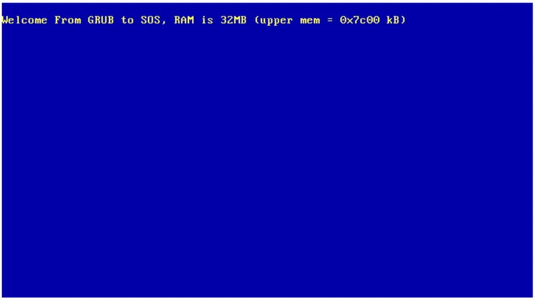
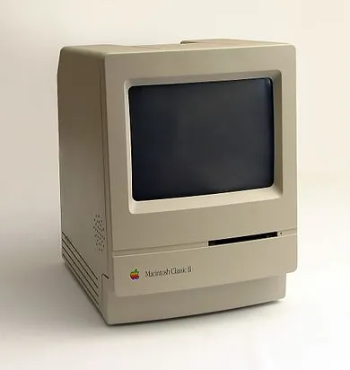
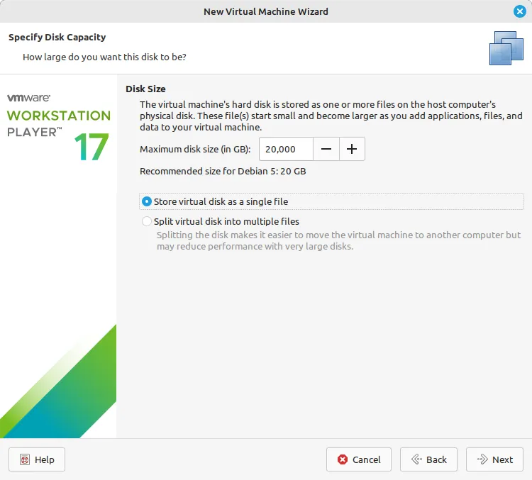
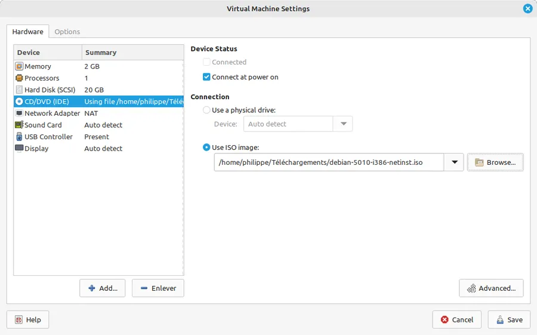
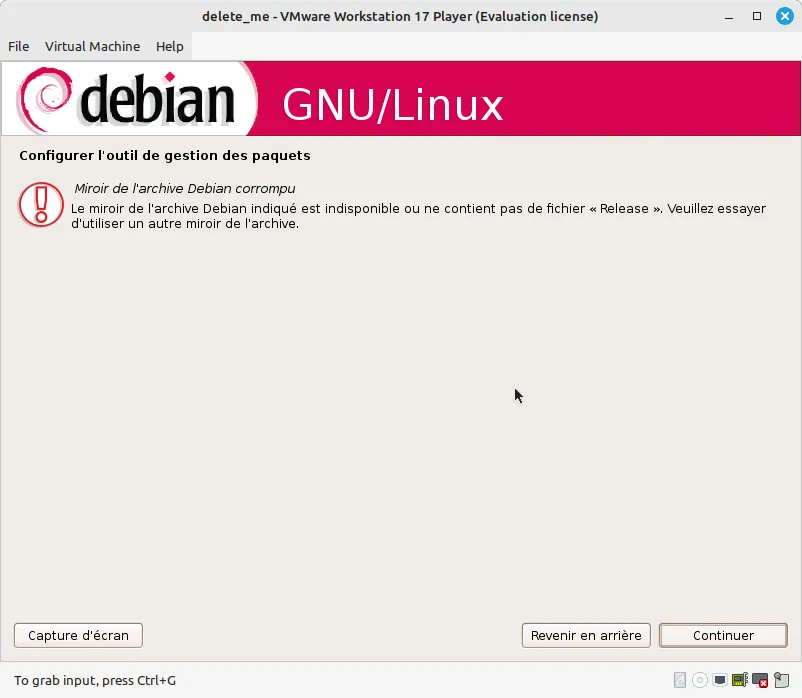
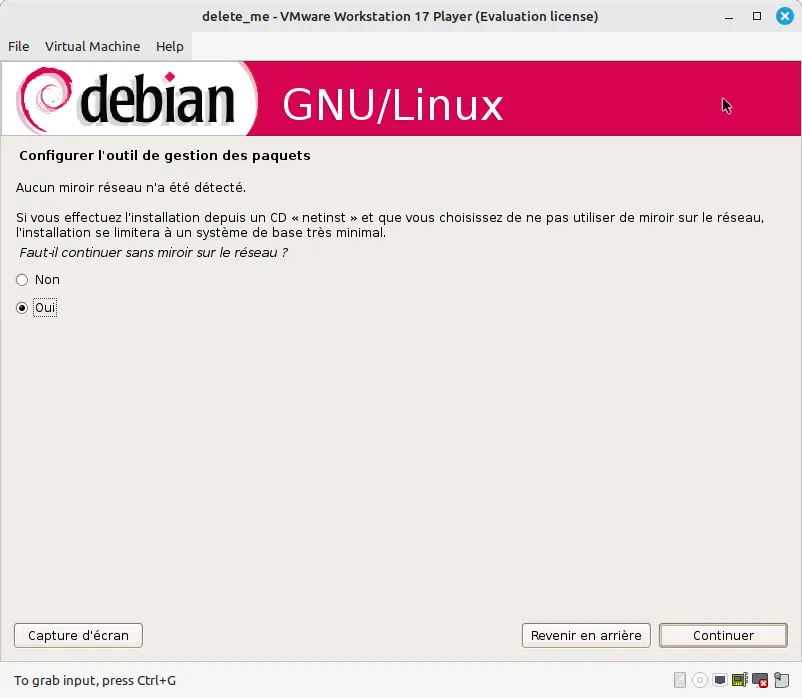
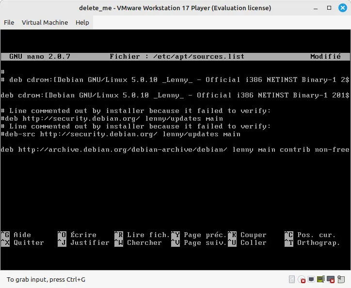
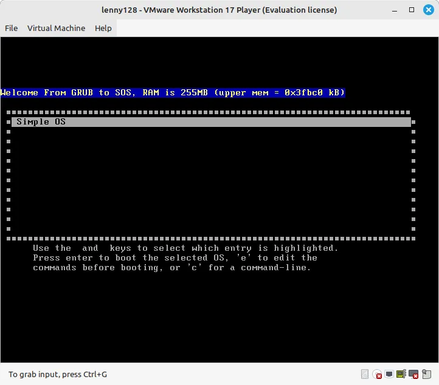
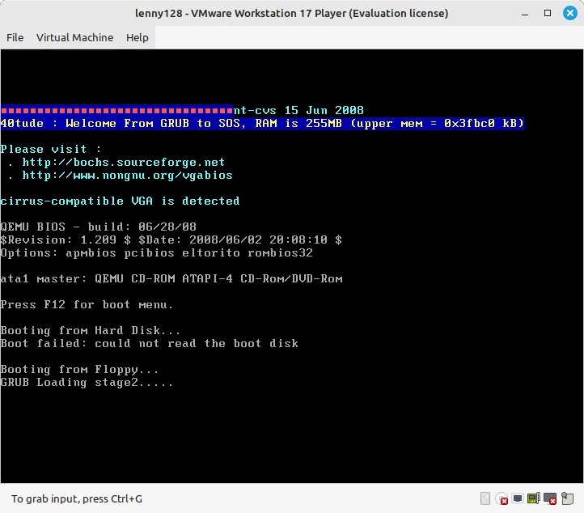
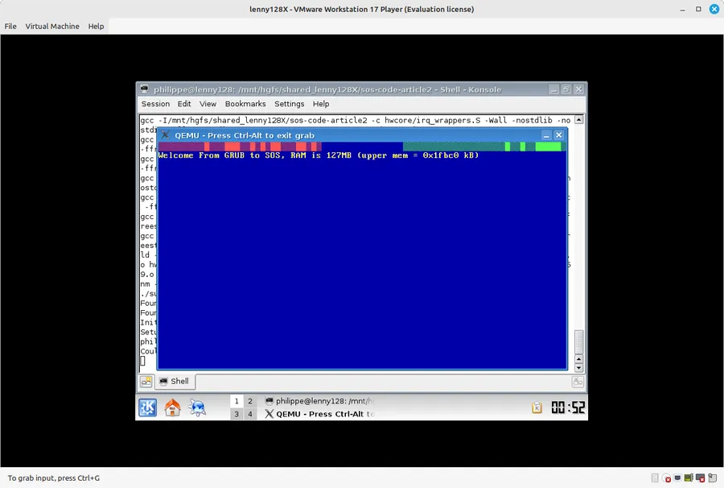

# Simple OS

## Les épisodes de la série

* [Episode 0]() 
* [Episode 1]()
* [Episode 2]()
* [Episode 3]()


## Introduction

J'explique ici la galère que c'est, en 2023, de remonter une machine susceptible de faire tourner le code d'un OS écrit en 2004. C'est un excellent exemple de ce qu'il ne faut **PAS** faire.

La lecture de ce billet est facultative pour comprendre comment on passe de SOS à SOS2. Tu peux donc passer au billet suivant si tu ne souhaite pas faire démarrer le SOS "historique" dans une VM.

<div align="center">

</div>

Commence par lire [cet article]() avant de revenir ici. 

Ayé, t'as lu? Donc maintenant tu sais que j'ai décidé de faire du bouche-à-bouche à un code qui a une vingtaine d'année et de le faire tourner dans un setup modernisé à base de Grub2, Docker, NASM etc.

So far so good... À l'issue de mon premier billet, le code de l'épisode 1 historique tourne et c'est le sourire aux lèvres que je m'attaque au code de l'épisode 2 de la [saga SOS](http://sos.enix.org/fr/SOSDownload). Ce dernier concerne les interruptions (exceptions et IRQ). Là aussi, ça se passe plutôt bien et assez rapidement j'ai un code qui "marchotte". Je dis "marchotte" car si les IRQ matérielles du timer sont bien prises en compte, je passe complètement à côté des exceptions (entre autres la division par 0 qui est mise en œuvre dans le code de démonstration de l'article). J'ai beau chercher je ne trouve pas... Je vois bien un ou deux trucs dans mon code mais globalement je suis sec... Finalement j'en arrive à la **très mauvaise idée** qu'il serait judicieux de remonter une machine de l'époque. Le principe serait d'y faire tourner le code "canal historique", sans y toucher du tout et de voir comment ça se passe.

Je confirme. C'était une **très mauvaise idée** et je m'en vais te raconter ici ce qui m'est arrivé. Je vais tout détailler mais franchement je ne te conseille pas de le refaire de ton côté. De mon point de vue, il est très intéressant et instructif de refaire tourner le code de SOS mais il vaut mieux le faire dans un setup "moderne". À toi de voir. Sur ce, allez, c'est parti...

## La méthode

<div align="center">

</div>


Je ne peux pas porter le code de SOS sur une disquette. Je n'ai plus de PC avec disquette. À la maison, le seul qui accepte encore les floppy c'est un Mac Classic II mais bon, c'est une autre histoire. En plus, dans la série SOS, on ne peut utiliser des disquettes que sur les épisodes 1 et 2. Bref, ça ne vaut pas le coup.

Je ne peux pas porter le code sur une machine sur laquelle tourne une distribution moderne. En effet, cette dernière utilise Grub 2 comme bootloader. Or le code original de SOS n'est compatible qu'avec Grub 1 (aussi connu sous le nom Grub Legacy). En plus on est dans un contexte 64 bit, faudrait un cross-compiler... Ça ne sent pas la sérénité...

J'ai essayé, vraiment essayé d'utiliser une image Docker mais je me suis retrouvé rapidement face à des problèmes de version de Grub 2 vs Grub Legacy, des soucis de compilateur trop récent, des problèmes dans le Makefile qui passait plus... En plus, il y a un mixte entre l'image qui peut être de type 386 et le sous-jacent du container qui est "moderne". Là, je ne suis pas sûr de tout comprendre. Bref, j'ai essayé, j'ai passé/perdu beaucoup de temps et finalement je me dis qu'il vaut mieux émuler une configuration matérielle et logicielle "historique".

<!-- ### Note -->

{: .note }
Compte tenu de ce que j'ai appris avec les tests ci-dessous... Un jour de pluie, je ferai peut-être un nouveau test avec une image Docker. À voir...

Comme je manque de PC, je vais installer une "vieille" distribution dans une machine virtuelle "vieille" qui sera émulée à l'aide de VMware Workstation 17 Player (sérieux, t'as vu la longueur du nom... Ils ont fumé quoi au marketing ?). Je décide de faire tout ça sur un host Linux sur lequel tourne une Mint 21.2 (cela ne change pas grand-chose à mon avis si on met l'émulateur VMware sur un host WIN11).

Pour me mettre dans les conditions de l'article originel, il me faut donc une distribution Linux de l'époque. En 2004 chez Debian on avait Woody. Je suis parti avec une Lenny, qui est sortie en 2009 car, sauf erreur de ma part c'est la [dernière version de Debian qui avait un Grub 1 comme bootloader](https://wiki.debian.org/Grub) (ensuite ils sont passé sur Grub 2). Je pense que tout ce qui va être expliqué ci-dessous peut s'appliquer à une version Woody mais bon, franchement, je ne souhaite pas réitérer l'expérience.

Donc jusque-là c'est simple :

* Un portable qui fonctionne sous Mint 21.2
* Installation d'un player VMware
* Installation d'une Debian Lenny en tant que VM dans le player

## Installer VMware sur le host Mint

* C'est récent, hyper facile. No problemo
* Si besoin lire <https://linuxways.net/mint/how-to-install-vmware-workstation-on-linux-mint-20/>

## Récupérer une image ISO de Lenny

* <https://cdimage.debian.org/mirror/cdimage/archive/5.0.10/i386/iso-cd/>
* Choisir `debian-5010-i386-netinst.iso`
* Copie dans `/home/philippe/Téléchargements` du host Mint

## Créer une machine virtuelle lenny

* Sous VMware Player c'est évident.
* Tout laisser par défaut sauf le disque qu'on garde en un seul fichier.

<div align="center">

</div>


Oui, bien sûr, avant de lancer la VM, il faut faire pointer le CD de la VM vers le fichier ISO qu'on vient de récupérer.

<div align="center">

</div>


Lancer la VM

## Installation de Debian Lenny

* Tout laisser par défaut (`lenny` au lieu de `debian` comme nom de machine)
* Installer SANS miroir (plus rien n'est dispo depuis l'installeur). Faut appuyer sur **ESC** pour sauter cette étape et finir l'installation en installant le minimum minimorum.

<div align="center">

</div>

On est gentil on confirme qu'on sait (plus ou moins) ce que l'on fait

<div align="center">

</div>


Pour finir, on a donc un système minimum dans la VM. Je passe les détails mais à la fin, comme la chenille, c'est la VM qui redémarre 🎵🎶.

## Quand on est logué sur la VM lenny

```bash
su                                          # il n'y a pas encore de sudo
nano /etc/apt/sources.list
```

* Lire <https://www.debian.org/distrib/archive>
* Mettre en commentaire ou **supprimer la ligne** `deb cdrom ...`
* Ajouter la ligne ci-dessous :

```bash
deb http://archive.debian.org/debian-archive/debian/ lenny main contrib non-free
```

* CTRL + O pour écrire
* CTRL + X pour quitter nano

<div align="center">

</div>


On est toujours super user. Si on fait un :

```bash
apt-get update
```

On a un message qui dit que certaines clés sont expirées

```
KEYEXPIRED 1520281423
KEYEXPIRED 1337087218
```

Je n'ai pas réussi à mettre à jour les clés. Par exemple, les 2 commandes ci-dessous n'aident pas.

```bash
apt-key list
apt-key adv --recv-keys --keyserver keyserver.ubuntu.com F42584E6
```

* Lire : <https://futurestud.io/tutorials/fix-ubuntu-debian-apt-get-keyexpired-the-following-signatures-were-invalid>
* Faire une recherche sur `KEYEXPIRED apt-key`

## Installer les softs sur la VM lenny

### Méthode que j'utilise finalement

On peut éviter de changer la date de la VM et laisser `apt-get install` râler et nous demander de confirmer qu'on veut faire l'installation sans vérification (authentification).

### Changer la date de la VM

* Lire <https://stackoverflow.com/questions/29070471/gpg-error-http-archive-debian-org-lenny-updates-release-the-following-signat>
* Outre le fait que c'est un peu "bourrin" comme méthode il faut, en plus, se rappeler à chaque fois qu'on relance la VM de changer la date. Finalement ce n'est pas tenable.
* Enfin bref, j'ai essayé, j'ai eu des problèmes... Je ne recommande pas.

```bash
su
date --set "2009-10-10"
apt-get update
apt-get upgrade
```
### Les softs à installer

```
apt-get install sudo
visudo
```

* Quand `apt-get` râle parce que le paquet `sudo` n'a pas été authentifié faut appuyer sur `o`
* Dans le fichier qui s'ouvre sous nano, rajouter une ligne du style `nom_user ALL=…` comme pour `root`.
* On sauve CTRL+O
* On quitte CTRL+X

```bash
exit                                      # pour ne plus être root
sudo apt-get install locate
sudo updatedb
```

* Ce n'est peut-être pas une bonne idée que de vouloir optimiser en mettant tout dans une même commande.
* Je ne mets pas `-y` pour bien tout confirmer moi-même à chaque fois

```bash
sudo apt-get install build-essential
sudo apt-get install linux-headers-$(uname -r)
sudo apt-get install mtools
sudo apt-get install file
sudo apt-get install qemu
```
## Installer les VMTools

* Faut le faire car je veux un répertoire partagé entre le host Mint et la VM lenny
* Menu Virtual Machine (en haut de la fenêtre)
* Cliquer alors sur VMware Tools Installation
* Revenir dans la console de la VM lenny

```bash
sudo mount /dev/cdrom /cdrom
ls /cdrom
```

* On voit `VMwareTools-10.0.12-14792880.tar.gz`
* Normalement on est dans `$HOME`
* Saisir les commandes ci-dessous :

```bash
cd
mkdir tmp
cd tmp
tar -xvf /cdrom/VMwareTools-10.0.12-14792880.tar.gz
cd vmware-tools-distrib
sudo ./vmware-install.pl
```

* Garder tous les choix par défaut (`ENTER`, `ENTER`...)
* Quand c'est terminé

```bash
cd
rm -rf ./tmp/vmware-tools-distrib/
sudo shutdown -h now
```
## Faire une copie de la VM


{: .warning }
Copie de la VM

* C'est très important car en cas de plantage total de la VM on sera bien content de pouvoir repartir d'une copie. Oui, je te confirme, ça sent le vécu...
* Si la VM s'appelle `lenny` et que je m'appelle `philippe` elle est dans : `/home/philippe/vmware/lenny` (`~/vmware/lenny` pour les intimes)
* Suffit de copier le répertoire `lenny` et de le nommer `lenny.bak` par exemple
* Ne pas faire apparaître `lenny.bak` dans le player VMware
* En cas de souci :
  + On supprime la VM lenny de VMware Workstation Player
  + On fait une copie de `lenny.bak` qu'on renomme `lenny`
  + On la fait apparaitre dans VMware Workstation Player
  + Le coût par VM n'est pas énorme. 1.3 GB environ.

**Ne pas passer à la suite** sans avoir fait une copie. Aie confiance, crois en moi...🎵🎶

{: .warning }
Copie de la VM. Je peux pas mettre beaucoup plus de warnings. Tu es prévenu.

## Installer un répertoire partagé

* Entre le host Mint et la VM lenny
* Dans VMware Workstation Player, clic droit sur la VM, option Virtual Machine Settings puis onglet Options
* Lors de la config je nomme le répertoire `shared_lenny` et il pointe sur le répertoire /`home/philippe/Documents/tmp/shared_lenny` du host Mint.
* C'est un truc tout bête mais ça permet d'éditer du code avec le VSCode du host Mint plutôt qu'avec le nano de la VM lenny etc.

## Récupérer le code de l'article 1 historique

* Relancer la VM lenny
* Sur la VM, le répertoire partagé est dans `/mnt/hgfs/shared_lenny` (c'est tellement intuitif... J'adore ce genre de truc...).

```bash
cd /mnt/hgfs/shared_lenny
wget -P ./ http://sos.enix.org/wiki-fr/upload/SOSDownload/sos-code-art1.tgz
tar -xvf sos-code-art1.tgz
cd sos-code-article1
```
## Compiler le code de SOS

```bash
make
```

* Pas d'erreur
* Un warning dans `main.c` ligne 32, variable `i` non utilisée.
* On s'en fout pour l'instant

Sur la VM lenny, si dans la console je tape :

```bash
file fd.img
```

Alors je vois :

```bash
fd.img: DOS floppy 1440k, x86 hard disk boot sector
```

Comme la compilation a été faite dans un répertoire partagé entre le host Mint et la VM lenny, on peut relancer la même commande `file fd.img` depuis le host. Voilà ce que l'on voit alors :

```bash
fd.img: DOS/MBR boot sector, code offset 0x48+2, OEM-ID "MTOO3911", root entries 224, sectors 2880 (volumes <=32 MB), sectors/FAT 9, sectors/track 18, serial number 0x78a5cd31, unlabeled, FAT (12 bit), followed by FAT
```

Que ce soit sur le host Mint ou la VM lenny, la commande `file sos.elf` retourne la même chose :

```bash
fsos.elf: ELF 32-bit LSB executable, Intel 80386, version 1 (SYSV), statically linked, not stripped
```

Sur le host Mint, on peut monter l'image `fd.img`. Suffit de cliquer sur le nom du fichier dans "l'explorateur de fichiers" (je sais plus comment il s'appelle. Nemo ? Pas sûr...). On retrouve les sous-répertoires `/boot`, /`modules`, /`system`. Dans `/system` il y a `sos.elf`.

On peut aussi monter `fd.img` depuis la VM lenny

```bash
sudo mkdir /media/tmp_dsk
sudo mount -o loop fd.img /media/tmp_dsk
ls -al /media/tmp_dsk
```

On retrouve bien le contenu du floppy

```bash
sudo umount /media/tmp_dsk
```
## Lancement

* On est toujours dans le répertoire `/mnt/hgfs/shared_lenny/sos-code-article1`

```bash
qemu -fda fd.img
```

* On a une erreur du type :

```bash
Use fbdev option or set FRAMEBUFFER environment variable
```

Il faudrait peut-être que je creuse la question après avoir lu ça par exemple : <https://linux.debian.user.narkive.com/HxaW9M7S/fbdev-requirement-of-qemu>

Normalement SOS fonctionne avec la mémoire vidéo qui est mappée en mémoire (0xB8000, 80x25x2).

Bon allez, on relance en évitant le frame buffer

```bash
qemu --curses -fda fd.img
```

On voit Grub Ver 0.97 tout en haut de l'écran et le menu Simple OS (c'est rassurant, c'est la preuve qu'on est en Grub 1).

Après sélection de SOS dans le menu ça part en vrille

```bash
Booting 'Simple OS'
root (fd0)
Filesystem type is fat, using whole disk
kernel /system/sos.elf
Error 13 : Invalid or unsupported executable format
Press any key to continue...
```

* Là, c'est mort
* Sur la VM, il faut ouvrir un second terminal (ALT+F2)
* Se loguer
* Saisir

```bash
top
```

* Appuyer sur '`k`'
* Donner le N° du PID de qemu puis saisir '9' pour le type de signal à envoyer
* C'est équivalent à la commande : `kill -9 2684 # où 2684 est le PID de qemu`

<div align="center">

</div>


Bon, ben, "ça passe pas...". Va falloir trouver autre chose.

Je pensais avoir trouvé un truc grâce à ce lien : <https://stackoverflow.com/questions/27939316/bochs-2-4-6-grub-0-97-error-13-invalid-or-unsupported-executable-format-wh>

Dans `sos.ldS` je déplace `*(.rodata)` dans la section `.text` du code.

```
/* Beginning of the text section */
    .text ALIGN(4096) :
    {
        /* This section includes the code */
        *(.text*)
        *(.rodata*)
        /* Defines the 'etext' and '_etext' at the end */
        PROVIDE(etext = .);
        PROVIDE(_etext = .);
    }
    /* Beginning of the data section */
    .data . :
    {   *(.data*)
        PROVIDE(edata = .);
        PROVIDE(_edata = .);
    }
    /* Beginning of the read-only data section */
    /*
    .rodata . :
    {   *(.rodata*)
        PROVIDE(erodata = .);
        PROVIDE(_erodata = .);
    }
    */
```

Dans le même fichier je modifie ensuite la ligne :

```
.bss SIZEOF(.rodata) + ADDR(.rodata) :
```

Qui devient :

```
.bss SIZEOF(.data) + ADDR(.data) :
```

En effet, il n'y a plus de section `.rodata`. Je relance

```bash
make clean
make
qemu --curses -fda fd.img
```

Mais, bon, "ça passe toujours pas...". De toute façon c'était une bêtise. Le code original tournait. De plus, à mon avis, cette histoire de `.rodata` n'est valable **QUE** si le code assembleur est assemblé par NASM. Je pense même que NASM supporte pleinement `.rodata` (depuis la version 0.98.32, pour le format elf, voir [le pdf de NASM 2.16.01 p175](https://www.nasm.us/docs.php)). Bon, on s'en fout, on perd du temps là... En effet, sous SOS, le code assembleur historique est assemblé par GAS qui gère très bien les sections `.rodata`. Et, encore une fois, le code original fonctionnait très bien...

J'enlève les modifications de `sos.ldS` puis je repars carrément de zéro en décompressant l'article 1 à nouveau.

```bash
rm -rf sos-code-article1/
tar -xvf sos-code-art1.tgz
```

Mouai... Et on fait quoi maintenant qu'on est revenu au point de départ ?

## Follow the white rabbit...

Heu... Je vais te calmer tout de suite. On ne va pas aller aux pays des merveilles mais plutôt à la cave... Et encore, je vais te donner une version édulcorée, un truc bien propre, à la chronologie bien linéaire, genre tuto de YouTube où tout se passe toujours bien.

En réalité ça ne s'est pas du tout passé comme ça. C'est parti dans tous les sens, j'ai pas mal cherché, j'ai fait les trucs dans le mauvais ordre, j'ai perdu pas mal de VM... Une vraie boucherie, y avait du sang partout. Le genre d'expérience qui te donne envie de tout jeter. Un peu comme ces [p💀t@ins de randos qui n'en finissent pas de monter...](https://www.youtube.com/shorts/d92jbkVY8wY)


## Ce que je crois avoir compris

* SOS fonctionne avec Grub 1
* Dans la configuration actuelle, avec le Grub 1 installé sur la VM lenny, le Makefile retrouve bien ses petits mais ça part en vrille à l'exécution. Message du style "Invalid or unsupported executable format".
* En cherchant sur le web, je fini par fouiller, à la main, message par message, dans les [archives de la mailing](http://the-doors.enix.org/pipermail/sos/) [l](http://the-doors.enix.org/pipermail/sos/)[ist de SOS](http://the-doors.enix.org/pipermail/sos/) (merci les gars, franchement merci de tout laisser en ligne après autant d'années)
* Plus précisément, je tombe sur ce message : <http://the-doors.enix.org/pipermail/sos/2011-January/001076.html>. Là, tu te dis qu'il y a des mecs qui ont plus d'idées que toi et qu'il y a peut-être un truc à tenter.
* Du coup je recompile un Grub 1 et je l'installe sur la VM lenny
* Ensuite je recompile SOS. Ça génère un nouveau fichier fd.img en utilisant, entre autres, le fichier Stage 2 du "nouveau" Grub 1
* Et là... Ça ne marche toujours pas... P💀t@in fait suer !!!
* Grand moment de solitude... Pas le moral... Je tombe dans l'alcool, la drogue et la prostitution...
* Mais bon, en continuant à chercher je trouve ce billet : [https://wiki.archlinux.org/title/Talk:GRUB_Legacy](https://wiki.archlinux.org/title/Talk%3AGRUB_Legacy)

<div align="center">

</div>


* Là, tu comprends que pour Grub 1, il faut que les [inodes du système de fichiers](https://fr.wikipedia.org/wiki/N%C5%93ud_d%27index) aient une taille de 128 octets.
* Bien sûr, quand je vérifie la taille des inodes de la VM lenny je découvre qu'ils ont une taille de 256 octets. C'est bizarre et contradictoire avec ce qui est dit dans le billet mais bon... On va quand même essayer de mettre les inodes à 128 octets.
* Le problème c'est que je ne peux pas changer la taille des inodes sur un disque qui est monté
* Je récupère une distribution qui possède un mode "live".
* Je boote la VM lenny sur le CD de la distribution live en question
* Je vérifie la taille des inodes. Ils sont à 256 bytes.
* Je demande à les faire passer à 128...
* Et là on me dit que ce n'est pas possible de réduire la taille des inodes qu'on ne peut que les faire grandir
* P💀t@in, je suis maudit ou quoi ?

Re alcool, re drogue et re prostitution...

* J'essaie de jouer avec l'installeur de la Debian Lenny. J'essaie le mode expert mais là il y a trop de questions auxquelles je n'ai pas les réponses. Je pense cependant qu'un "bon" aurait choisi cette voie.
* Finalement je fais un entre-deux un peu "cracra". Accroche ta ceinture et reste avec moi deux minutes. Imagine... :
    * Je boote le live CD sur la VM leny
    * Cette dernière a toutes ses partitions, tout va bien. Y a juste la première dont il faut faire passer la taille des inodes de 256 à 128 octets
    * On sacrifie la première partition en claquant dessus un nouveau système de fichiers dont les inodes ont une taille de 128. Ça ne va sans doute pas matcher au niveau de la taille de la partition mais on s'en fout on est plus à ça près.
    * Par contre, c'est sûr, on aura perdu tous les fichiers.
    * Faut donc refaire une installation de la Debian Lenny
    * Je reboote donc la VM lenny avec le CD d'installation de la Debian Lenny
    * Lors du paramétrage de l'installation on demande à garder les partitions ainsi que les systèmes de fichiers en place et à simplement copier les fichiers de Lenny dessus
    * Enfin je reboote la VM lenny.
    * Tout devrait être pareil sauf que dorénavant, les inodes de sda1 devraient être à 128 octets.

* Pour faire bonne mesure, je recompile un Grub 1 et je le réinstalle
* Je reboote de la VM lenny
* Je compile et je teste SOS
* Et si ça ne marche pas... Ben je ne sais pas... J'élève des brebis sur les hauteurs de [Solenzara](https://www.sarisolenzara.fr/) ?

Mouai... Ça a l'air compliqué ton affaire. Tu peux résumer ?

## La checklist qu'on va suivre

1. Récupérer une distribution "live" et booter dessus
1. Créer un système de fichiers avec des inodes à 128 octets sur le sda1 de la VM
1. Rebooter la VM sur le CD d'installation Debian Lenny
1. Refaire une installation en conservant les systèmes de fichiers en place
1. Rebooter la VM, compiler et installer Grub 1
1. Rebooter la VM, compiler et tester SOS

Ca a l'air tellement facile, tellement naturel quand c'est résumé de cette façon...

## 1 - Récupérer une distribution live et booter dessus

Après coup je pense que j'aurai pu prendre une BusyBox, une ToyBox où un truc de ce genre. Sur le moment je n'ai pas réfléchi, j'ai fait simple et j'ai récupéré une [Mint XFCE](https://www.linuxmint.com/edition.php?id=307) parce que c'est pas trop lourd, que je sais qu'il y a `gparted` etc.

Je la dépose dans le répertoire `/home/philippe/Téléchargements` du host Mint

Je fais une copie du répertoire `/home/philippe/vmware/lenny` que je renomme `/home/philippe/vmware/lenny128` (128 comme les 128 octets des inodes. Malin le mec 🦊)

Je fais apparaître cette VM dans VMware Player (un clic sur home puis "Open a Virtual Machine" à droite).

Dans les settings je fais passer la mémoire à 4GB et je fais pointer le CD sur l'ISO de Mint XFCE.

J'en profite pour créer un répertoire partagé que je nomme `shared-lenny128`. Sur le host Mint il pointe sur /`home/philippe/Documents/tmp/shared_lenny128`

Au démarrage de la VM je confirme que j'ai copié la VM (c'est pour des histoires de duplication d'adresse MAC, je sais plus trop).

Concernant le démarrage sur le CD live il faut, quand la VM boote, appuyer sur la touche `F2` pour accèder à son BIOS. Là, dans l'onglet boot du BIOS, il faut mettre le CD en haut de la liste, quitter le BIOS et reprendre le démarrage de la VM.

On se retrouve sur une Mint XFCE live

## 2 - Créer un système de fichiers avec des inodes à 128 octets sur le sda1 de la VM

J'utilise l'excellent `gparted` de la Mint live et je vérifie les différentes partitions du disque ainsi que le nom de ce dernier. Ici c'est sda, la partition swap est sur sda5 et le système de fichiers sur sda1

Dans un terminal, pour vérifier la taille des inodes je tape : `sudo tune2fs -l /dev/sda1`

Dans tout ce qui est affiché je vois un truc du style : `Inode size 256`

Pour vérifier la taille des inodes on peut aussi faire un `cat /etc/mk2fs.conf | more`

Ca va pas marcher mais on peut tenter : `sudo tune2fs -I 128 /dev/sda1`

C'est là qu'il répond : `tune2fs 1.46.5 (30 Dec 2020) Shrinking inode size not supported`

Pas de remord, on pas trop d'autre solution. On créé un nouveau système de fichiers sur la partition sda1 avec : `sudo mke2fs -t ext3 -I 128 /dev/sda1`

On éteint gentiment la VM (`sudo shutdown -h now`) et on revient sur le VMware Player

## 3 - Rebooter la VM sur le CD d'installation Debian Lenny

Dans le VMware Player je m'assure que le CD de la VM lenny128 pointe bien sur l'ISO `debian-5010-i386-netinst.iso`

On redémarre la VM

## 4 - Refaire une installation en conservant les systèmes de fichiers en place

On commence à avoir l'habitude

Je laisse tout par defaut sauf que je nomme la machine lenny128

Le truc le plus important c'est l'étape partition/système de fichiers. Faut lui faire comprendre qu'on garde le partitionnment et le système de fichiers qui est en place

On passe à la suite et il copie les fichiers

L'installation se termine normalement

## 5 - Rebooter la VM, compiler et installer Grub 1

Une fois que la VM lenny128 a démarré, je tape `sudo tune2fs -l /dev/sda1` dans un terminal

Je dois voir un truc du style `Inode size : 128`. Si je n'ai pas cette valeur, c'est pas la peine d'aller plus loin. Il faut revenir en arrière.

### 5.1 - Compiler Grub 1

```bash
sudo nano /etc/apt/sources.lst
```

Ajouter la ligne

```bash
deb-src http://archive.debian.org/debian-archive/debian/ lenny main
```

Sauver, quitter. Normalement il y a un répertoire `tmp` dans `$HOME`

```bash
sudo apt-get update
cd ~/tmp
mkdir grub_build
cd grub_build
apt-get source grub
cd grub-0.97
```

Allez, on compile et on installe. Pas de panique ça va bien se passer. En fait on a déjà téléchargé tout ce dont a besoin (rappelle toi le `sudo apt-get install build-essential` par exemple).
  
Ensuite le make install ne va rien installer sur l'installation déjà en place. En fait tous les fichiers générés vont se retrouver dans `/usr/local`. Donc, encore une fois, pas de panique.

```bash
./configure
make                    # jette ton œil
make -n install         # jette ton œil, vérifie que tout semble OK
sudo make install

```

Quand c'est terminé et que tout semble s'être bien passé

```bash
ls -al /usr/local/sbin
ls -al /usr/local/lib/grub/i386-pc
```

À titre d'exercice je te propose de comparer les tailles, les dates et les heures des fichiers `stage2` des répertoires `/boot/grub` et `/usr/local/lib/grub/i386-pc`.

Moi j'ai respectivement 128 552 octets d'un côté et 101 978 de l'autre.

Ce qu'il faut qu'on fasse maintenant c'est qu'on installe notre Grub 1 nouvellement compilé en lieu et place de celui qui est venu avec la Debian Lenny.

On vérifie le petit nom de notre disque avec cette commande par exemple

```bash
sudo fdisk -l
```

Moi je vois `sda1`… `sda5`. Mon disque s'appelle `sda`.

Ensuite j'installe le nouveau Grub1.

```bash
cd /usr/local/sbin
sudo ./grub-install /dev/sda
```

Aucune erreur à l'écran normalement.

Si c'est pas le cas on est mal...

Dans `/boot/grub` je vois que la taille de stage2 est dorénavant 101 978.

On reboote

```bash
sudo reboot -h now
```
### 5.2 À lire si besoin

* <https://www.gnu.org/software/grub/manual/grub/html_node/Installing-GRUB-using-grub_002dinstall.html>
* <https://www.cyberciti.biz/faq/how-to-get-source-code-of-package-using-the-apt-command-on-debian-or-ubuntu/>
* <https://www.malekal.com/comment-compiler-un-logiciel-depuis-des-sources-sur-linux/>

## 6 - Rebooter la VM, compiler et tester SOS

### 6.1 Article 1 de SOS

* Oups... On a déjà rebooté. Tiens, vas-y, fais moi un procès si t'es pas content.
* On récuprère ensuite le code de l'article 1 de SOS.

```bash
cd /mnt/hgfs/shared_lenny128
wget -P ./ http://sos.enix.org/wiki-fr/upload/SOSDownload/sos-code-art1.tgz
tar -xvf sos-code-art1.tgz
cd sos-code-article1

```

* Comme on a recompilé Grub 1 je te propose de mettre à jour les variables `grub_dirs_common` et `sbin_grub_path` du fichier `../sos-code-article1/support/build-image.sh` comme suit :

```
# grub_dirs_common= .................
# sbin_grub_path= .................

grub_dirs_common="/usr/local/lib/grub/i386-pc"
sbin_grub_path="/usr/local/sbin"

```

* Quand c'est fait on build.
* Il ne doit pas y avoir d'erreur. Il y a juste un warning à propos d'une variable `i` qui n'est pas utilisée dans `main.c`.

```bash
make
```

* On boote SOS dans QEMU
* Note que je demande à l'émulateur QEMU de simuler une machine avec 256 MB de RAM mais bon on s'en fout...
* Oh, p💀t@in ça démarre enfin !

```bash
qemu -m 256M --curses -fda fd.img
```
<div align="center">

</div>


Je pense que les problèmes d'affichage sont liés au fait que QEMU est en mode "curses" (ça ressemble à Rhide et à l'interface graphique qu'avait [Turbo C 2.0](https://winworldpc.com/product/borland-turbo-c/2x)) et que cela ne correspond pas exactement à la représentation que SOS se fait de la mémoire vidéo.

Faut regarder dans le détail. Je ne suis pas sûr de tout comprendre.

Mais... Nom de Zeus, Marty, il a démarré !

Pour sortir proprement, il faut :

* Ouvrir un second terminal (ALT+F2)
* Se loguer
* Saisir la commande `top`
* Appuyer sur '`k`'
* Donner le N° du PID de qemu puis saisir '9' pour le type de signal à envoyer

#### 6.1.1 À lire si besoin

* <https://fr.wikipedia.org/wiki/Ncurses#:~:text=ncurses%20(de%20l'anglais%20%C2%AB,'un%20mode%20semi%2Dgraphique.>
* <https://arnaud-feltz.developpez.com/tutoriels/ncurses/?page=premier_pas>

### 6.2 Article 2 de SOS

Je te la fais courte

```bash
cd /mnt/hgfs/shared_lenny128
wget -P ./ http://sos.enix.org/wiki-fr/upload/SOSDownload/sos-code-art2.tgz
tar -xvf sos-code-art2.tgz
cd sos-code-article2
```

Mise à jour des variables `grub_dirs_common` et `sbin_grub_path` du fichier `../sos-code-article1/support/build-image.sh`.

```
# grub_dirs_common= .................
# sbin_grub_path= .................

grub_dirs_common="/usr/local/lib/grub/i386-pc"
sbin_grub_path="/usr/local/sbin"

```

Build et run

```bash
make
qemu -m 256M --curses -fda fd.img
```

Voilà ce que je vois.

<div align="center">

</div>


Comme dans l'article 2 on retrouve des marques rouges à gauche pour les exceptions liées aux divisions par 0.

Cependant, je ne retrouve pas à droite les marques vertes qui comptent les IRQ matérielles du timer qui tourne à 100 Hz.

M'en fout. Je suis trop content, je regarderai ça plus tard. Je suis presque sûr que c'est un problème d'affichage, de maping mémoire...

### 6.3 Article 2 de SOS, bis

Je m'en doutais... Lorsque la VM lenny ne comporte qu'une console... Alors, quand on demande à QEMU d'exécuter SOS ça ratatouille un peu côté affichage. En effet, dans ce cas, QEMU met à la disposition de l'OS un affichage ncurses. De son côté SOS manque encore un peu de subtilité et attaque directement l'affichage vidéo via son mapping mémoire. Voir la dernière capture d'écran par exemple.

Afin de lever le doute, voilà ce que j'ai fait.

#### Duplication de la VM lenny128

* Copie du répertoire `lenny128`
* Je renomme la copie `lenny128X`
* Le nom c'est juste pour dire qu'on va passer sous système de fenêtrage
* Dans VMware Player, faire apparaître la VM `lenny128X`
* Dans ses settings
    * Lui donner 8 ou 4 GB de mémoire
    * Lui donner le nom `lenny128X`
    * Mettre en place un répertoire partagé avec le host Mint. J'ai appelé ce répertoire `shared_lenny128X`
* Je lance la VM `lenny128X`
* Je confirme que c'est une VM que j'ai copié
* Quand je suis sur le terminal je tape les commandes suivantes

```bash
sudo apt-get install xorg kde-core --no-install-recommends
startx
```

* Du coup on a un KDE minimal
* Sous KDE, j'ouvre un terminal où je tape

```bash
cd /mnt/hgfs/shared_lenny128X
wget -P ./ http://sos.enix.org/wiki-fr/upload/SOSDownload/sos-code-art2.tgz
tar -xvf sos-code-art2.tgz
cd sos-code-article2
```

Mise à jour des variables `grub_dirs_common` et `sbin_grub_path` du fichier `../sos-code-article1/support/build-image.sh`.

```
# grub_dirs_common= .................
# sbin_grub_path= .................

grub_dirs_common="/usr/local/lib/grub/i386-pc"
sbin_grub_path="/usr/local/sbin"

```

Build et run

```bash
make
qemu -fda fd.img
```

Tadaaa !

<div align="center">

</div>


On retrouve bien tous nos petits. Les exceptions à gauche en rouge et les IRQ du compteur en vert à droite. Ça clignote, c'est beau... En ces temps de préparation de Noyel me voilà tout "émouvé".

Sérieux, je suis super content. Je vais pouvoir comparer des pommes avec des pommes (SOS2 vs SOS) et ne pas perdre de temps avec QEMU en mode console dans une VM.

Ah oui, sinon, pour arrêter SOS... Comme d'habitude maintenant, j'ouvre une nouvelle console, j'invoque la commande `top`. Ensuite je tape "`k`" puis le N° du PID de qemu. Enfin je reviens sur la console où j'avais appelé QEMU.

## Conclusion

1. ~~Il faut que je relise et que je rajoute des captures d'écran. Ca manque.~~

1. ~~Il faut que je comprenne mieux ces histoires de mémoire vidéo sur QEMU qui tourne lui même dans une VM...~~

1. Tout ceci me confirme qu'en 2023 c'est de la perte de temps que de s'entêter à faire ce genre de truc. Grub 1 (aka Grub Legacy) n'existe plus, tout le monde est en Grub 2, ma Mint "normale" a des inodes de 256 octets... Bref, il n'y a plus grand chose qui matche.

1. Par contre dans mon cas c'est nécessaire car j'ai besoin de pouvoir comparer SOS à SO2 (la version qui tourne sur Docker, via Grub 2 et dont l'assembleur est en NASM)

*Allez, à plus et la suite au prochain épisode... Ce sera quand le code de l'épisode 2 tournera dans SOS2 aussi bien que celui-là. J'y suis presque, il manque juste (yaka, faukon) les exceptions que je loupe complètement.*

