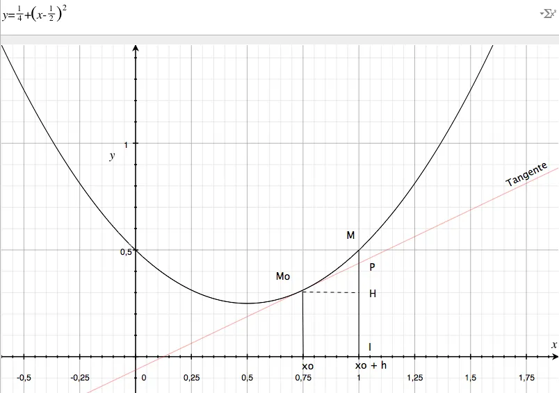
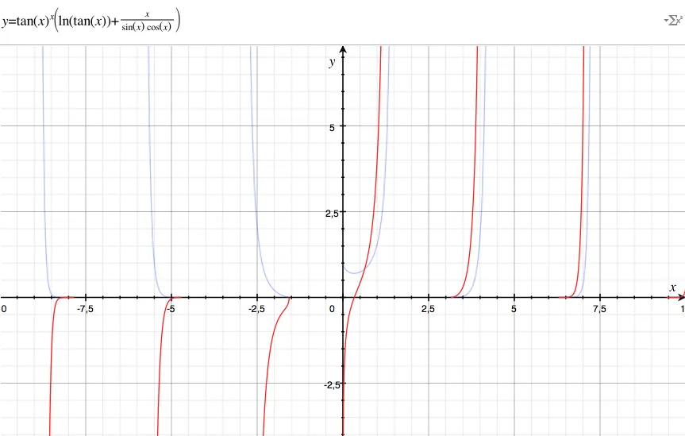

# Dérivée et différentielle

## Introduction 

Je vais essayer de mettre noir sur blanc ce que je crois avoir compris à propos de ces histoires de dérivées et de différentielles. Si vous êtes prof de maths... Eh bien, comme le dirait Gand Alf dans le Seigneur des Anneaux : "Fuyez pauvres fous !". En effet, je n'ai pas du tout l'intention d'être rigoureux. 

En fait, je voudrais juste m'assurer d'être suffisamment clair pour qu'après avoir lu cet article on puisse "sentir" les choses, faire un ou deux exercices de base puis relire un cours plus formel avec beaucoup plus d'intérêt.

Bon, allez, c'est parti... On imagine qu'on a une courbe sympa (continue, dérivable, un polynôme propre sur lui par exemple etc.). Là-dessus, on va pointer le point Mo aux coordonnées (xo, yo). Vous le voyez le point Mo dans le graphe ci-dessous ? Ok, on continue...

Premier point : Heu... C'est quoi l'intérêt des différentielles, du calcul différentiel etc. ? Regardons la courbe ci-dessus. L'idée sous-jacente à ces histoires de calcul différentiel c'est tout simple. Ça consiste à dire que même si la courbe (la fonction) est très compliquée, localement, pour peu qu'on s'intéresse à des tout petits bouts de courbe alors **on peut assimiler le morceau de courbe MoM à la droite MoM**. 

Bon, là, dans le graphe d'avant ça ne marche pas trop car on "voit" bien qu'au niveau de M, il y a une différence, un espace, entre la droite tangente et la courbe. Cela dit... Cela dit, sur la courbe, faites glisser gentiment le point M vers le point Mo et? Et à ce moment-là on sent bien qu'on pourra utiliser la droite tangente comme une "bonne" approximation de la courbe. 

{: .important }
Relisez les 2 dernières phrases. Elles sont importantes.

## Equation de la tangente

Déterminons l'équation de la droite tangente qui passe par Mo. Honnêtement, je ne connais pas la formule par cœur (et en plus il est hors de question que je l'apprenne). On va voir 2 méthodes pour retrouver nos petits.

Sinon, il y a cette [vidéo](https://youtu.be/GVWad0mqKtQ) 

### Méthode 1

Je sais qu'on cherche un truc du style :

$$y = ax + b$$

Eh oh... Arrêtez de râler... Ce n'est pas très dur. C'est juste l'équation d'une droite et on a vu ça à la maternelle... Cela étant dit, comme la droite tangente passe par Mo je sais que sa pente c'est la dérivée au point Mo et je peux écrire :

$$y = f'(xo)x + b$$

{: .warning }
J'écris bien $$f'(xo)$$ et pas $$f'(x)$$. Je suis sans doute un peu lourd mais il faut bien se mettre dans la tête que la pente de la droite tangente au point Mo c'est la valeur de la dérivée de la fonction au point Mo. 

J'insiste... Si la fonction était $$f(x)=x^2$$ et si le point était le point d'abscisse $$xo=3$$ alors la pente vaudrait $$2x3=6$$ (la dérivée de $$x^2$$ c'est $$2x$$. Quand $$x$$ vaut 3 la dérivée vaut 6). Bon allez, ce n'est pas tout ça mais il faut qu'on avance...

Ensuite je me dis : "Quand $$x$$ vaut $$xo$$, la droite passe par $$f(xo)$$". Tout de suite, vous je sais pas, mais moi ça me fait penser à un changement de variable et j'écris l'équation précédente sous la forme :

$$y = f'(xo) (x-xo) + b$$

À partir de là, je me redis : "Quand $$x$$ vaut $$xo$$, la droite passe par $$f(xo)$$". Avec l'équation ci-dessus, quand $$x$$ vaut $$xo$$ il ne me reste plus que :

$$f(xo) = f'(xo) (xo-xo) + b$$

Et donc

$$f(xo) = b$$

Finalement l'équation de la droite tangente qui passe par Mo est :

$$y = f'(xo) (x-xo) + f(xo)$$

### Méthode 2

Ci-dessus j'explique ce que l'on peut faire, si on a tout oublié, afin de retrouver l'équation de la tangente au point Mo. Cela dit, ça prend trois plombes et y a moyen d'aller plus vite... Beaucoup plus vite... Watch this!

Au point Mo, si je regarde le triangle (Mo, H, M) qui est rectangle en H, alors je peux écrire un truc du style :

$$\tan(\alpha) = \frac{opp}{adj} = \frac{y_{M} - y_{H}}{x_{M} - x_{H}} = \frac{y - f(xo)}{x-xo}$$

Où $$\alpha$$ est l'angle en Mo. Comme la tangente au point Mo c'est la dérivée alors, en deux lignes chrono, on a bien :

$$f'(xo) = \frac{y - f(xo)}{x-xo}$$

C'est bien le résultat qu'on a trouvé précédemment avec la Méthode 1.

Maintenant, plaçons sur la courbe le point M dont l'abscisse est xo+h. De manière pratique, je retrouve xo sur l'axe des x (l'abscisse de Mo, 0.75 ici), je rajoute h (0.25 ici pour arriver en x=1, le point noté I). Ensuite je monte verticalement et quand j'intercepte la courbe, ayé, c'est gagné, je peux placer mon point M dont les coordonnées sont donc (xo+h, f(xo+h)). 

C'est clair ? Il n'y a pas d'embrouille ? Allez, on continue...

Tiens, c'est bizarre... La tangente en Mo coupe la droite IM en un point P. C'est quoi les coordonnées de ce point ? En voilà une question qu'elle est bonne ! Cherchons un peu...

Pour trouver l'abscisse du point P c'est facile, c'est xo+h. En revanche pour l'ordonnée du point P, là je sèche un peu... Mais non, c'est juste qu'il faut voir le truc... Si P appartient à la droite tangente qui passe par Mo, alors on sait que ses coordonnées respectent l'équation de la droite en question. Autrement dit ses coordonnées respectent :

$$y_{P} = f'(xo) (x_{P}-xo) + f(xo)$$

$$y_{P} = f'(xo) ((xo+h)-xo) + f(xo)$$

$$y_{P} = f'(xo) h + f(xo)$$

**Attention :**  C'est là qu'on va voir la lumière... Quand on accroît xo d'une quantité h alors on passe du point Mo au point M dont les coordonnées sont (xo+h, f(xo+h)) et on peut dire (si on considère que P est très proche de M) que :

$$y_{P} = f(xo) + f'(xo) h$$

Soit

$$y_{M} {\approx} f(xo) + f'(xo) h$$

Autrement dit, et pour répondre à la question à propos de P, ce dernier est en fait **une approximation de M**. Son principal intérêt par rapport à M c'est qu'on peut facilement le calculer. On prend Mo, on ajoute h en abscisse et la quantité f'(xo)h en ordonnée et zou on a notre point P.

{: .warning }
Il ne faut pas oublier qu'on n'a pas une égalité mais bien une approximation. En effet, sur le graphe on voit bien (enfin j'espère) que sur l'axe des y, passer de Mo à M c'est passer de H à M et que cela se fait en deux étapes : HP puis PM. Dans l'égalité précédente il manque encore un "ptit" bout (le morceau PM. HP quant à lui, on le connaît déjà, il vaut f'(xo)h).

Par définition **on appelle différentielle**, et on la note $$\mathrm{d}y$$, la quantité suivante :

$$\mathrm{d}y = f'(xo) h$$

Où h est un accroissement infinitésimal (tout petit) de x. Si on note cet accroissement dx au lieu de h alors, en Mo(xo, yo) on peut écrire :

$$\mathrm{d}y = f'(xo) \mathrm{d}x$$

Finalement sur notre dessin on a donc :

$$y_{M} {\approx} y_{Mo} + f'(xo) h$$

$$y_{M} {\approx} y_{Mo} + \mathrm{d}y$$

## Résumé

Δy = YM - YMo

dy = YP - YMo

P est une "bonne" approximation de M

$$\mathrm{d}y = f'(x)\mathrm{d}x$$

**La différentielle d'une fonction f se calcule en multipliant la dérivée de la fonction (f'(x)) par la différentielle de la variable (dx).** 

* Merci de lire la phrase précédente 3 ou 4 fois jusqu'à ce les mots aient vraiment un sens pour vous.

$$\mathrm{d}x$$ c'est un accroissement, une quantité très petite, un scalaire qui ne dépend pas de x (dx=0.0001 par exemple, de plus la dérivée de $$\mathrm{d}x$$ est nulle... tout ça quoi)

Dernier point. Il ne faut pas oublier que $$\mathrm{d}y$$ (HP) n'est pas égal à ∆y (HM) mais que c'en est une approximation d'autant meilleure que $$\mathrm{d}x$$ est petit.

## Exemples de différentielles

Si $$y = x^2$$ alors $$\mathrm{d}y = 2x\mathrm{d}x$$

Si $$y = \ln(x)$$ alors $$\mathrm{d}y = \frac {1}{x} \mathrm{d}x$$

Si $$y = \tan(x)$$ alors $$\mathrm{d}y = \frac {1}{cos^2(x)} \mathrm{d}x$$

## Règles de calcul

Voilà de quoi survivre...

$$\mathrm{d}(u+v) = \mathrm{d}u + \mathrm{d}v$$

$$\mathrm{d}(uv) = v\mathrm{d}u + u\mathrm{d}v$$

$$\mathrm{d}(\frac{u}{v}) = \frac{v\mathrm{d}u - u\mathrm{d}v}{v^2}$$

$$\frac{\mathrm{d}y}{\mathrm{d}x} = \frac{\mathrm{d}y}{\mathrm{d}u} \frac{\mathrm{d}u}{\mathrm{d}x}$$

## Exemple

La résistance d'un fil électrique en fonction de la température est donnée par :

$$R = R_0(1 + {\alpha}t)$$

Pour le cuivre $$\alpha$$ vaut 4E-4. Si t varie quel est l'impact sur R?

On part de :

$$R = R_0(1 + {\alpha}t)$$

On différencie car on veut étudier ce qui se passe quand la température évolue un tout petit peu. On trouve :

$$\mathrm{d}R = R_0{\alpha}\mathrm{d}t$$

**Application numérique :** Si Ro=1kΩ et si t varie de 40 °C alors la résistance varie de :

$$\mathrm{d}R = 1000 * 4 10^{-4} * 40 = 16 {\Omega}$$

## Exemple

Calculer la dérivée de

$$y = \tan(x)^x$$

Si y a des puissances "bizarres", on ne perd pas de temps et on prend le log

$$\ln(y) = x \ln(\tan(x))$$

On différencie l'équation ci-dessus. Faites-le sur un bout de papier sur le côté. Il n'y a rien de terrible si on se rappelle les règles qu'on utilise pour le calcul des dérivées. Au pire, jetez un oeil sur les règles qu'on a rappelé un peu avant. Heu... N'oubliez pas que la dérivée de tg c'est 1/cos2.

Sinon, à propos des dérivées, j'ai [quelques vidéos sur YouTube](https://youtu.be/Bfa6pNC4YzE)

$$\frac{1}{y} dy = (\ln(\tan(x)) + x \frac{1}{\tan(x)} \frac{1}{\cos^2(x)})\mathrm{d}x$$

On fait passer y de l'autre côté

$$\mathrm{d}y = y (\ln(\tan(x)) + x \frac{1}{\tan(x)} \frac{1}{\cos^2(x)})\mathrm{d}x$$

On remplace y par son expression en x histoire d'avoir un truc homogène à droite.

$$\mathrm{d}y = \tan(x)^x (\ln(\tan(x)) + x \frac{1}{\tan(x)} \frac{1}{\cos^2(x)})\mathrm{d}x$$

On fait passer $$\mathrm{d}x$$ de l'autre côté

$$\frac{\mathrm{d}y}{\mathrm{d}x} = \tan(x)^x (\ln(\tan(x)) + x \frac{1}{\tan(x)} \frac{1}{\cos^2(x)})$$

$$\frac{\mathrm{d}y}{\mathrm{d}x} = \tan(x)^x (\ln(tg(x)) + \frac{x}{\tan(x) \cos^2(x)})$$

$$\frac{\mathrm{d}y}{\mathrm{d}x} = \tan(x)^x (\ln(tg(x)) + \frac{x}{\frac{\sin(x)}{\cos(x)} \cos^2(x)})$$

$$\frac{\mathrm{d}y}{\mathrm{d}x} = \tan(x)^x (\ln(\tan(x)) + \frac{x}{\sin(x)\cos(x)})$$

$$\frac{\mathrm{d}y}{\mathrm{d}x} = f'(x) = \tan(x)^x (\ln(\tan(x)) + \frac{x}{\sin(x)\cos(x)})$$

Pour ceux qui se demandent à quoi peut bien ressembler une telle "horreur" voici ce que ça donne sous Grapher.

Pour aller un peu plus loin vous pouvez faire un tour sur cet [article](`NOT YET TRANSFERED` "Equations différentielles du premier ordre") qui traite des équations différentielles du premier ordre et qui met en œuvre les règles du calcul différentiel qu'on vient de survoler. Bonne lecture 😀

