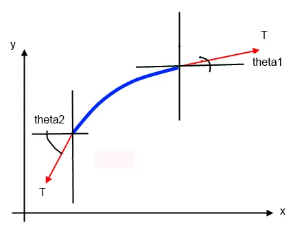
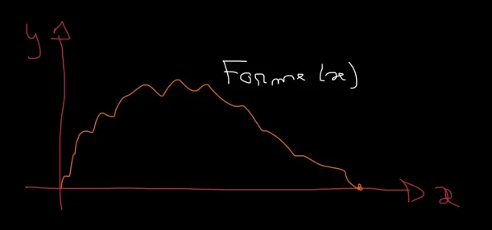
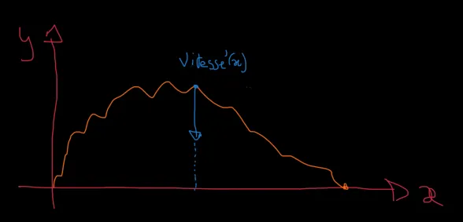
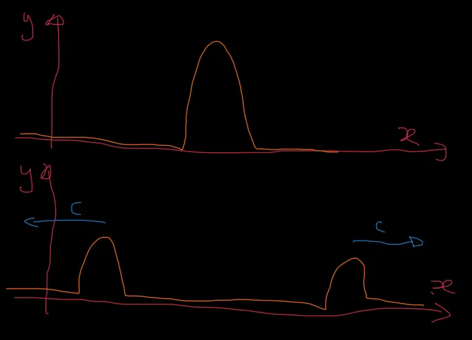

# Equation d'onde à une dimension

## Mise en équation

Bon, le dessin ci-dessous est très moche mais on arrive à se faire une idée de ce qui se passe. Pensez à une corde de guitare pas trop tendue. On s’intéresse à un petit bout de corde de longueur dl. Sur l'axe des x on navigue entre x et x+dx. Sur l'axe des y on circule entre y et y+dy. On suppose que les angles theta1 et theta2 sont faibles. T est la tension et elle est identique (en module) aux deux extrémités. Cela dit les vecteurs T n'ont pas la même orientation (ici, bien sûr, c'est très accentué).

On part de la seconde loi de Newton :

$$\Sigma \vec{F} = m \vec{a}$$

Sur l'axe des x les deux projections s'annulent. Cela dit, sur l'axe des y on a :

$$Tsin(\theta_1) - Tsin(\theta_2) = m a_y$$

Puis en mettant T en facteur :

$$T (sin(\theta_1) - sin(\theta_2)) = m a_y$$

Si les 2 points sont très proches, alors l'angle est faible et on peut faire les \approximations suivantes (développement en série de Taylor dont on garde uniquement les termes de degré 1) :

$$cos(\theta) \approx 1$$

$$sin(\theta) \approx \theta$$

$$tan(\theta) \approx \theta sin(\theta)$$

### Ruse de Sioux 1 
Comme l'angle est faible, on peut remplacer les sinus par les tangentes et on écrit :

$$T (tan(\theta_1) - tan(\theta_2)) = m a_y$$

Ensuite, et c'est là qu'on se dit qu'il y en a qui en ont vraiment dans le chou, comme

$$tan(\theta) = \frac {\mathrm{d}y}{\mathrm{d}x}$$

L'équation devient :

$$T ((\frac {\mathrm{d}y}{\mathrm{d}x})_{x+\mathrm{d}x} - (\frac {\mathrm{d}y}{\mathrm{d}x})_x) = m a_y$$

Les indices (x+\mathrm{d}x) et (x) indiquent 'en x+\mathrm{d}x' et 'en x'.

### Ruse de Sioux 2
Ensuite, il faut se rappeler que

$$(\frac {\mathrm{d}y}{\mathrm{d}x})_{x+\mathrm{d}x} - (\frac {\mathrm{d}y}{\mathrm{d}x})_x = \frac{\mathrm{d}^2y}{\mathrm{d}x^2} \mathrm{d}x$$

En cas de doute, on peut revenir à la définition de la dérivée d'une fonction et écrire :

$$ f'(x) = \frac{f(x+h) - f(x)}{h}$$

$$ \frac{f(x+h) - f(x)}{h} = f'(x)$$

Et donc :

$${f(x+h) - f(x)} = h f'(x)$$

En remplaçant h par dx on a :

$${f(x+\mathrm{d}x) - f(x)} = f'(x) \mathrm{d}x$$

$${f(x+\mathrm{d}x) - f(x)} = {\frac{\mathrm{d}y}{\mathrm{d}x}} \mathrm{d}x$$

Ensuite, on voit que si au lieu de la fonction, on s'intéresse à la dérivée de la fonction alors on obtient :

$$(\frac {\mathrm{d}y}{\mathrm{d}x})_{x+\mathrm{d}x} - (\frac {\mathrm{d}y}{\mathrm{d}x})_x = \frac{\mathrm{d}^2y}{\mathrm{d} x^2} \mathrm{d}x$$

Bref... À ce stade on a donc :

$$T (\frac{\mathrm{d}^2y}{\mathrm{d} x^2} \mathrm{d}x) = m a_y$$

Ensuite on évalue l'accélération selon l'axe des y à :

$$a_y = \frac{\mathrm{d}^2y}{\mathrm{d} t^2}$$

Et l'équation devient :

$$T \frac{\mathrm{d}^2y}{\mathrm{d} x^2} \mathrm{d}x = m \frac{\mathrm{d}^2y}{\mathrm{d} t^2}$$

On remplace la masse m par le produit de dx par la masse par unité de longueur (masse linéique) :

$$T \frac{\mathrm{d}^2y}{\mathrm{d} x^2} \mathrm{d}x = \mu \mathrm{d}x \frac{\mathrm{d}^2y}{\mathrm{d} t^2}$$

On divise à gauche et à droite par dx :

$$T \frac{\mathrm{d}^2y}{\mathrm{d} x^2} = \mu \frac{\mathrm{d}^2y}{\mathrm{d} t^2}$$

Si on divise par T et si on rapatrie tout à gauche, au final, on a l'équation suivante à résoudre :

$$\frac{\mathrm{d}^2y}{\mathrm{d} x^2} - \frac{\mu}{T} \frac{\mathrm{d}^2y}{\mathrm{d} t^2} = 0 $$

Intéressons-nous au terme $$\frac{\mu}{T}$$ et plus précisément à sa dimension. Ci-dessous on se rappelle qu'une tension c'est une force, c'est à dire le produit d'une masse par une accélération. Il vient :

$$\frac{\mu}{T} = \frac{kg m^-1}{kg ms^-2}=\frac{s^2}{m^2} = \frac{1}{v^2}$$

C'est donc l'inverse du carré d'une vitesse.On note alors généralement c la célérité de l'onde le long de la corde. Attention il ne s'agit pas de la vitesse de déplacement des bouts de corde selon l'axe vertical mais bien la vitesse de la vague selon l'axe des x. On pose :

$$c^2 = \frac{T}{\mu}$$

Pour finir la mise en équation nous donne :

$$\frac{\mathrm{d}^2y}{\mathrm{d} x^2} - \frac{1}{c^2} \frac{\mathrm{d}^2y}{\mathrm{d} t^2} = 0 $$

La solution de cette équation est de la forme :

$$f(x,t) = F(x+ct) + G(x-ct)$$

Où F et G sont, à priori, des fonctions complètement arbitraires. Le seul truc c'est qu'il faut absolument que ce soit des fonctions de (x+ct) et de (x-ct).

Essayons de comprendre ce que l'on vient d'écrire... Pour cela, on va s'occuper que de la fonction G(x, t). A t=0 on peut tracer G(x, 0) pour tous les x possibles. Maintenant, à t=1 seconde, on peut encore tracer G(x-c*1)=G(x-c). Dans ce cas, on peut se demander qu'elle est l'abscisse du point qui aura la même amplitude que celle du point x=0 précédent ? Simple, il faut aller en x=c car alors on trace G(c-c)=G(0).

Autrement dit, G(x-ct) est une onde qui se propage vers la droite. On peut aussi s'a\muser avec F(x, t) et vérifier qu'il s'agit d'une onde qui se propage vers la gauche.

On peut aussi remarquer que si au bout d'une seconde, le point d'abscisse x=c à la même amplitude que le point x=0 à t=0 cela signifie que la vitesse de propagation de l'onde c'est c.

La solution la plus générale de l'équation de la corde vibrante est donc la superposition de 2 ondes qui se déplacent respectivement vers la gauche et vers la droite à la même vitesse c.

## Exemple pratique

Mouai... Et en pratique ça donne quoi ? En fait F(x,t) et G(x,t) sont déterminées par les conditions initiales. Prenons un exemple et imaginons qu'à l'instant t=0 la forme de la corde soit donnée par :

$$f(x,0) = Forme(x)$$

Ce qui revient à dire qu'à t=0 on a :

$$Forme(x) = F(x) + G(x)$$

De même, imaginons que à t=0, les vitesses initiales des points de la corde (là, pour le coup, on parle bien des vitesses verticales de déplacement de chaque bout de corde) soient données par :

$$(\frac{\mathrm{d} f(x,t)}{\mathrm{d} t})_{t=0} = {Vitesse'}(x)$$

Y a bien un 'prime' afin de faire ressortir le fait qu'on parle de la dérivée par rapport à x d'une fonction 'Vitesse'. Ce faisant les fonctions Vitesse(x) et Forme(x) sont bien deux fonctions de la même variable x. A partir de là, si on dérive f(x,t) par rapport à t il vient :

$$f(x,t) = F(x+ct) + G(x-ct)$$

$$\frac{\mathrm{d} f(x,t)}{\mathrm{d} t} = c F'(x+ct) - c G'(x-ct)$$

En t=0 on a donc :

$${Vitesse'}(x) = c F'(x) - c G'(x)$$

Ce qui peut s'intégrer en :

$${Vitesse}(x) = c F(x) - c G(x)$$

On a donc lesystème de 2 équations suivant :

$$Forme(x) = F(x) + G(x)$$

$$Vitesse(x) = c F(x) - c G(x)$$

On peut alors déterminer F et G

$$F(x) = \frac{1}{c} \frac{1}{2} (Forme(x) + Vitesse(x))$$

$$G(x) = \frac{1}{c} \frac{1}{2} (Forme(x) - Vitesse(x))$$

Pour finir on trouve :

$$f(x,t) = F(x+ct) + G(x-ct)$$

$$f(x,t) = \frac{1}{c} \frac{1}{2} (Forme(x+ct) + Vitesse(x+ct)) + \frac{1}{c} \frac{1}{2} (Forme(x-ct) + Vitesse(x-ct))$$

Si au départ la corde est tendue (sous forme d'une cloche par exemple) et est relâchée sans vitesse initiale alors Forme(x) a la forme d'une cloche et Vitesse(x)=0 quel que soit x.

Ensuite on a :

$$f(x,t) = \frac{1}{c} \frac{1}{2} Forme(x+ct) + \frac{1}{c} \frac{1}{2} Forme(x-ct)$$

On a donc une cloche de demi-hauteur initiale qui part à droite ($$\frac{1}{2} Forme(x-ct)$$) et une autre qui part à gauche ($$\frac{1}{2} Forme(x+ct)$$).

Le $$\frac{1}{c}$$ qui traîne ne doit pas nous empêcher de dormir. En fait, c'est un reliquat de l'équation :

$$(\frac{d f(x,t)}{d t})_{t=0} = {Vitesse'}(x)$$

Si on avait décidé de définir la vitesse initiale de chaque point par une équation du style :

$$(\frac{1}{c} \frac{d f(x,t)}{d t})_{t=0} = {Vitesse'}(x)$$

À la fin on aurait eu :

$$f(x,t) = \frac{1}{2} Forme(x+ct) + \frac{1}{2} Forme(x-ct)$$

