# Dipôle électrique

## Introduction
Afin de "m'amuser" avec Grapher sous Mac OS je suis revenu sur ces histoires de dipôle électrique. Je vais mettre noir sur blanc ce que j'ai fait puis les 2 ou 3 captures issues de l'excellent Grapher.

### À propos de Grapher 
Pour être clair, le produit est vraiment super mais la documentation est... comment dire... À chier, je crois qu'il n'y a pas d'autres mots. C'est franchement incompréhensible. Une seule solution... Google. Pour l'instant j'ai repéré 2 sources qui tiennent la route :

* http://y.barois.free.fr/grapher/Bienvenue.html
* http://theputterer.wordpress.com/2011/04/02/mac-os-x-grapher-using-parameters/

Pour le reste c'est un peu le désert... Ah oui j'allais oublier, Grapher vient en standard avec Mac OS (il est dans Utilities) et ma toute petite expérience m'incite à vous recommander de sauvegarder souvent. J'ai eu 2 plantages et bien sûr cela arrive toujours au pire moment. Vaut mieux sauvegarder ce sur quoi on travaille puis créer un nouveau document pour tester un truc vite plutôt que de tout perdre. Vous êtes prévenus. Allez, c'est parti.

## Potentiel électrique du dipôle

Bon, on va commencer par un schéma de la situation. Ce n'est pas le plus beau dessin mais on va faire avec... On a donc 2 charges (+q et -q) qui sont séparées d'une distance "a". La charge positive se trouve en x=+a/2 et la charge négative se trouve en x=-a/2. Pour le reste on a une charge M en (x, y). Pour l'instant ne vous occupez pas de l'angle ni des traits rouges, on verra ça plus tard.

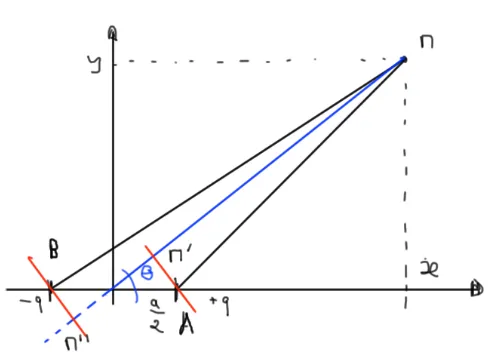

Le but du jeu c'est de déterminer le potentiel électrique et le champ électrique en un point M. Cela étant fait on essaiera de représenter tout ça en 3D etc. Du point de vue de la stratégie de calcul on va commencer par déterminer le potentiel électrique V (un scalaire) puis en en déduira le champ électrique (un vecteur) en dérivant ce dernier.

On part donc de l'expression du potentiel électrique qui est de la forme :

$$V = \frac{1}{4\pi\epsilon_0} \frac{q}{r}$$

Comme il y a une charge + et une charge - dont les distances à M sont différentes (r+ et r-) on a dans notre cas :

$$V = \frac{q}{4\pi\epsilon_0} (\frac{1}{r_+} - \frac{1}{r_-})$$

### Coordonnées cartésiennes 

En coordonnées cartésiennes, pour r+ on trouve :

$$r^2_+ = MA^2 = (x-\frac{a}{2})^2 + y^2 $$

Pour r- on a :

$$r^2_- = (x+\frac{a}{2})^2 + y^2 $$

Bon... Ben... Ayé, on a terminé, y a plus qu'à tracer. Dans la formule ci-dessous faut juste remarquer que la distance s'appelle 'd' (et non plus 'a') et que je n'ai pas tenu compte de la constante q/4πε0. Autrement dit on doit tracer la courbe :

$$V = \frac{1}{\sqrt{(r^2_+)}} - \frac{1}{\sqrt{(r^2_-)}}$$

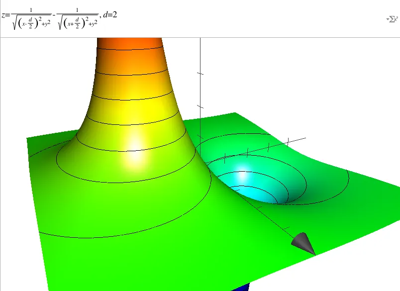

#### Remarque 
Entre autres, ce qu'il y a de vraiment bien dans Grapher c'est qu'on utilise quasiment les formules telles quelles (cela dit y a des cas où il a fallu que je fasse des galipettes). Jetez votre oeil en haut de l'image ci-dessus.

Sur le graphe 3D ci-dessus, les abscisses positives ne sont pas visibles. Elles sont à gauche sous la partie positive de la courbe 3D qui monte. L'axe des 'y' vient vers nous et bien sûr l'axe des 'z' monte au ciel... On a bien un repère orienté. Pour retrouver les axes 'x' et 'y' dans l'orientation du premier schéma, il faut faire tourner la scène autour de l'axe 'z' jusqu'à ce que l'axe des y soit vertical et que l'axe des x soit horizontal et orienté vers la droite.

En 2D si on affiche l'équation rapidement voilà ce que j'obtiens :

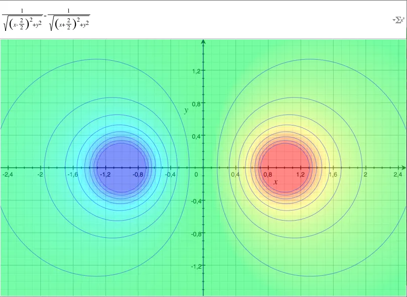

#### Remarque 
Dans Grapher, pour faire ça, j'utilise un graphe 2D et je prends bien soin de ne PAS mettre "z=..." dans la formule (en haut, en blanc).

Dernier point. Les lignes horizontales du graphe 3D sont des équipotentielles (le potentiel scalaire V y est constant). On les retrouve en bleu aussi dans le graphe 2D ci-dessus. Ce sont elles qu'on retrouve généralement dans les bouquins. En 3D, l'observation du "pied" de la colonne de gauche et/ou de la première équipotentielle autour de la charge négative montre bien que ce ne sont pas de cercles. C'est encore plus visible sur la vue de dessus qu'offre le graphe 2D.

#### Remarque 
C'est un peu idiot mais puisqu'on m'a posé la question... Ne vous laissez pas berner par le graphe 3D. Physiquement, il n'y a rien qui monte et rien qui descend. Si le potentiel électrique est positif et élevé alors il est affiché en hauteur. En cela la vue 2D est sans doute moins spectaculaire mais plus "facile" à appréhender.

Ok, ok, ok... Tu parlais des équipotentielles mais c'est quoi au juste leur expression? On voit bien en 2D que c'est pas des "ronds", ça doit être bien tordu cette histoire. On va y venir mais avant ça je voudrais refaire l'étude du potentiel en cordonnées polaires.

### Coordonnées polaires

Bizarrement c'est un peu moins simple à mettre en musique alors j'affiche de nouveau le schéma et je vais prendre mon temps.

On commence par la charge positive. J'appelle ra le rayon qui va de +q au point M. Maintenant, il faut remarquer le trait rouge qui est perpendiculaire au rayon OM et qui coupe ce dernier en M'. Bon, allez, on est équipé, on peut démarrer et on écrit :

$$V = \frac{q}{4\pi\epsilon_0} (\frac{1}{r_a} - \frac{1}{r_b})$$

$$r^2_a = MM'^2 + M'A^2$$

En ce qui concerne MM' il faut remarquer que :

$$MM' = MO - OM'$$

$$MM' = r - \frac{a}{2} cos(\theta)$$

Pour M'A on a :

$$M'A = \frac{a}{2} sin(\theta)$$

Ensuite si on regroupe le tout on obtient :

$$r^2_a = MM'^2 + M'A^2$$

$$r^2_a = (r - \frac{a}{2} cos(\theta))^2 + (\frac{a}{2} sin(\theta))^2$$

$$r^2_a = r^2 - a*r*cos(\theta) + (\frac{a}{2})^2$$

On s'occupe maintenant de la charge négative et j'appelle rb le rayon qui va de la charge -q au point M. La ruse ici c'est de penser à prolonger OM (trait bleu en pointillé) et de tracer en rouge la perpendiculaire (M''B). Ensuite on recommence et on écrit :

$$r^2_b = MM^{\prime \prime 2} + MM^{\prime \prime}B^2$$

$$r^2_b = (r + \frac{a}{2} cos(\theta))^2 + (\frac{a}{2} sin(\theta))^2$$

$$r^2_b = r^2 + a*r*cos(\theta) + (a/2)^2$$

Bon allez, c'est parti on peut tout regrouper dans une seule équation

$$V = \frac{q}{4\pi\epsilon_0} (\frac{1}{\sqrt{r^2 - a*r*cos(\theta) + (\frac{a}{2})^2}} - \frac{1}{\sqrt{r^2 + a*r*cos(\theta) + (\frac{a}{2})^2}})$$

Bon... Ben... Vas-y, fais péter le graphique ! En fait, c'est là que ça se complique et où je ne comprends pas tout... Encore une fois, j'ai mis à 1 la constante de proportionnalité au début de la formule mais voilà ce que j'obtiens :

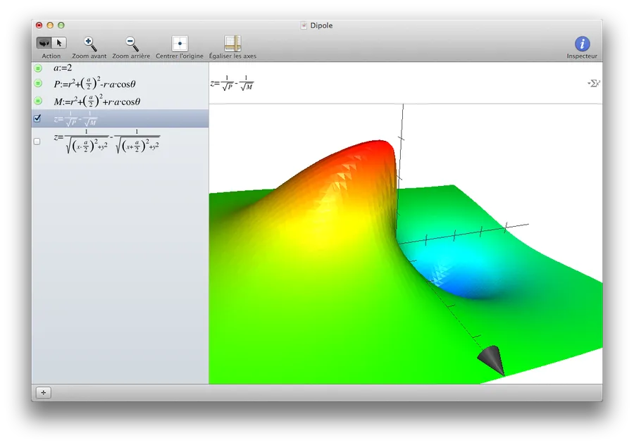

#### Remarque 
Dans Grapher on peut décomposer une formule un peu complexe en un jeu de sous formules. C'est vraiment très pratique. De même, on peut définir des constantes ('a' dans l'exemple ci-dessus) et les utiliser dans les formules. Jetez votre oeil dans la partie gauche de la capture de fenêtre ci-dessus.

Quoiqu'il en soit, je ne comprends pas ce qui se passe... Je pense que c'est dû à la façon dont Grapher dessine en 3D avec des coordonnées polaires. Heu... Oui, oui, j'ai vérifié les calculs et en passant des coordonnées polaires aux coordonnées cartésiennes je retombe bien sur la même équation. Je ne sais pas... Je vais revenir sur le sujet plus tard et si je trouve mon erreur ou la parade et je modifierai l'article en conséquence.

Pour information, quand je superpose les deux courbes précédentes voilà ce que je vois :

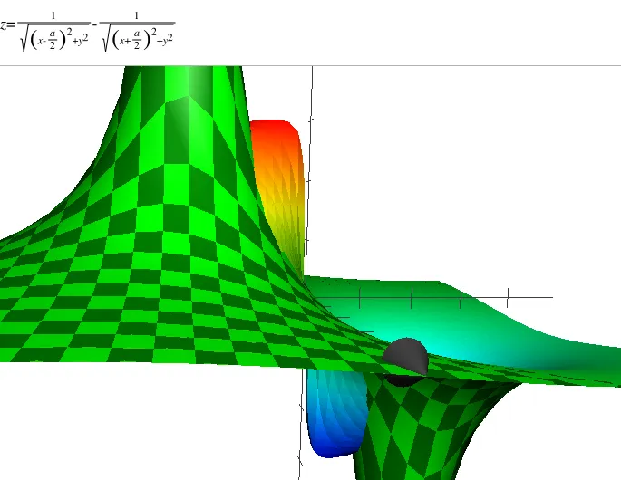

J'ai trouvé! En fait dans Grapher quand on travaille en polaires il faut utiliser **r0** en lieu et place de **r**. Quand je fais la modification voilà ce que j'obtiens. Là, ça tient la route et je suis content 😀.

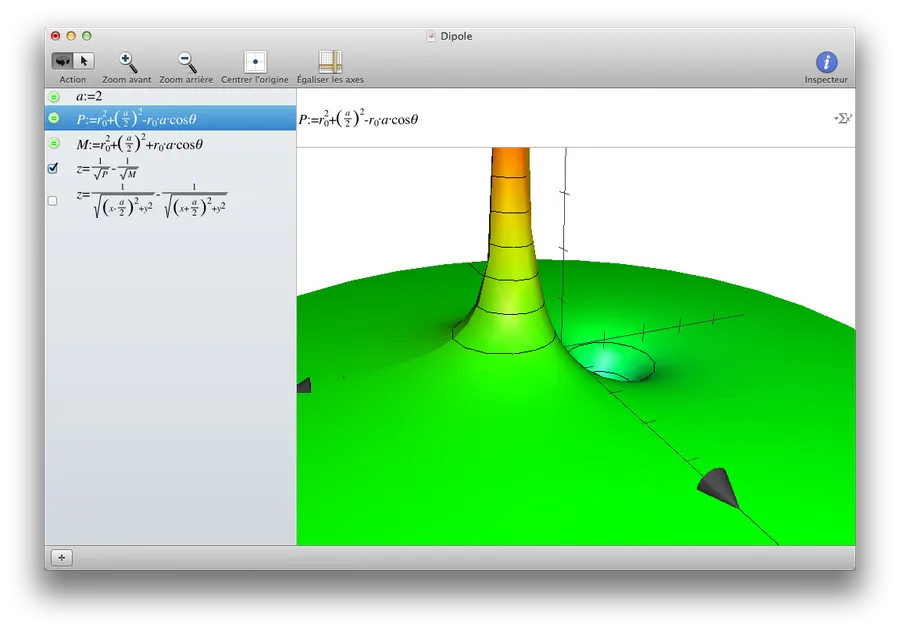

## Approximations

Ok... Tu as fait de jolis gribouillis en 3D tout ça tout ça, mais bon, moi quand je vais sur Wikipedia, Google tout ça... Je ne retrouve pas du tout tes formules. On peut essayer de retomber sur nos pattes avant d'aller plus loin ?

Au tout début le potentiel V valait :

$$V = \frac{q}{4\pi\epsilon_0} (\frac{1}{r_a} - \frac{1}{r_b})$$

Ensuite on a trouvé que :

$$r^2_a = r^2 - a*r*cos(\theta) + (\frac{a}{2})^2$$

et,

$$r^2_b = r^2 + a*r*cos(\theta) + (\frac{a}{2})^2$$

Si on ne s'intéresse qu'à ra, compte tenu de ce que l'on vient de ré-écrire on a :

$$\frac{1}{r_a} = \frac{1}{\sqrt{r^2 - a*r*cos(\theta) + (\frac{a}{2})^2}}$$

En faisant sortir 'r' de la racine :

$$\frac{1}{r_a} = \frac{1}{r \sqrt{1 - \frac{a*cos(\theta)}{r} + (\frac{a}{2r})^2}}$$

Si on considère que 'r' est très grand devant 'a' on peut supprimer le dernier terme sous la racine car une fois au carré il devient vraiment négligeable devant les autres. Il nous reste donc :

$$\frac{1}{r_a} = \frac{1}{r \sqrt{1 - \frac{a*cos(\theta)}{r}}}$$

$$\frac{1}{r_a} = \frac{1}{r (1 - \frac{a*cos(\theta)}{r})^{\frac{1}{2}}}$$

$$\frac{1}{r_a} = \frac{1}{r} (1 - \frac{a*cos(\theta)}{r})^{\frac{-1}{2}}$$

Si on se rappelle que :

$$(1+a)^n \approx 1 + na$$

Alors on peut approcher l'égalité précédente par :

$$\frac{1}{r_a} = \frac{1}{r} (1 + \frac{1}{2} \frac{a*cos(\theta)}{r})$$

Pour rb on trouve de manière similaire un truc du style :

$$\frac{1}{r_b} = \frac{1}{r} (1 - \frac{1}{2} \frac{a*cos(\theta)}{r})$$

Maintenant si on évalue

$$\frac{1}{r_a} - \frac{1}{r_b}$$

On se retrouve à calculer

$$\frac{1}{r_a} - \frac{1}{r_b} = \frac{1}{r} (1 + \frac{1}{2} \frac{a*cos(\theta)}{r}) - \frac{1}{r} (1 - \frac{1}{2} \frac{a*cos(\theta)}{r})$$

Le 1/r se met en facteur, les "1" dégagent et les fractions s'additionnent pour donner :

$$\frac{1}{r_a} - \frac{1}{r_b} = \frac{1}{r} (\frac{2a*cos(\theta)}{2r})$$

Les "2" se simplifient et il reste :

$$\frac{1}{r_a} - \frac{1}{r_b} = \frac{a*cos(\theta)}{r^2} $$

Finalement on a retrouvé l'équation des bouquins et on se retrouve à tracer la courbe suivante :

$$V = \frac{q}{4\pi\epsilon_0} \frac{a*cos(\theta)}{r^2}$$

À ce stade, on peut se demander quel est l'impact des approximations qui ont été faites et on peut afficher les 2 courbes afin de voir ce que cela donne. Un premier test donne le résultat suivant :

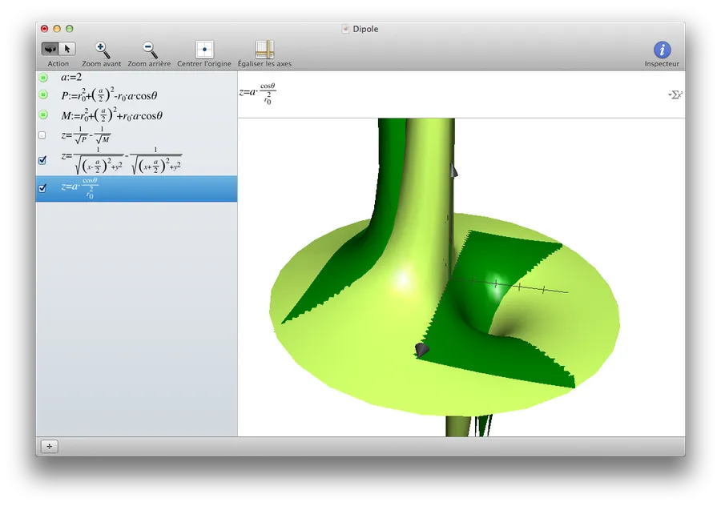

En vert clair c'est notre potentiel approximé et en vert foncé c'est la courbe sans approximation. Heu... Y a un truc qui ne va pas... Il y a beaucoup de différences entre les 2 courbes. C'est vrai. Cela dit les approximations supposaient que le point M était éloigné du dipôle. Autrement dit que 'a' était petit devant 'r'. Changeons la valeur de 'a' et mettons-la à 0.1. On obtient l'image suivante :

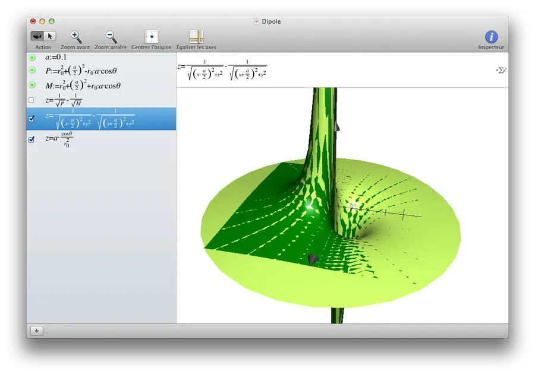

Ah, là c'est mieux ! Bon, bref, il ne faut pas oublier les approximations et leurs conséquences.

Une dernière remarque et après on passe à la suite. Lorsqu'on a fait les approximations, finalement, on a trouvé un résultat en 1/r2 alors qu'on était parti d'une formule avec des 1/r. C'était assez clair quand on a écrit :

$$V = \frac{q}{4\pi\epsilon_0} \frac{a*cos(\theta)}{r^2}$$

Ce comportement en 1/r2 n'était pas du tout évident à faire ressortir ou à anticiper lorsqu'on utilisait la formule "full options" sans approximation. En effet on avait un truc du style :

$$V = \frac{q}{4\pi\epsilon_0} (\frac{1}{\sqrt{r^2 - a*r*cos(\theta) + (\frac{a}{2})^2}} - \frac{1}{\sqrt{r^2 + a*r*cos(\theta) + (\frac{a}{2})^2}})$$

Tiens, ben vas-y toi qui est si malin, montre-moi en 2 seconde avec une formule pareille, que le potentiel va se comporter en 1/r2... Good luck.

Autrement dit, l'effet d'un dipôle se fait beaucoup moins ressentir que celui d'un monopole. Dans un cas on décroit en 1/r2 alors que dans l'autre on décroit en 1/r.

Bon, allez, chose "promite" chose "dute", on passe aux équipotentielles.

## Les équipotentielles

Le but du jeu ici c'est d'être capable de tracer "à la main" les courbes horizontales que Grapher traçait pour nous sur le tout premier schéma 3D (on les avait bien vu aussi sur le graphe en 2D). Pour déterminer les équipotentielle il faut travailler à potentiel constant. Cela étant compris reprenons la dernière équation qui donnait le potentiel électrique :

$$V = \frac{q}{4\pi\epsilon_0} \frac{a*cos(\theta)}{r^2}$$

Enlevons la constante de proportionnalité qui traine devant et il reste :

$$V = \frac{a*cos(\theta)}{r^2}$$

Avec un indice "_o", faisons ressortir que l'on "travaille" à V constant :

$$V_0 = \frac{a*cos(\theta)}{r^2}$$

Faisons ressortir 'r' de tout cela :

$$r^2 = \frac{a}{V_0} cos(\theta)$$

En faisant attention à la valeur absolue et en regroupant toutes les constantes sous une variable 'A' il vient :

$$r = A \sqrt{|cos(\theta)|}$$

Allez, zou c'est parti, on repart sous Grapher et on trace la courbe en rouge (on verra pour la courbe bleue plus tard...)

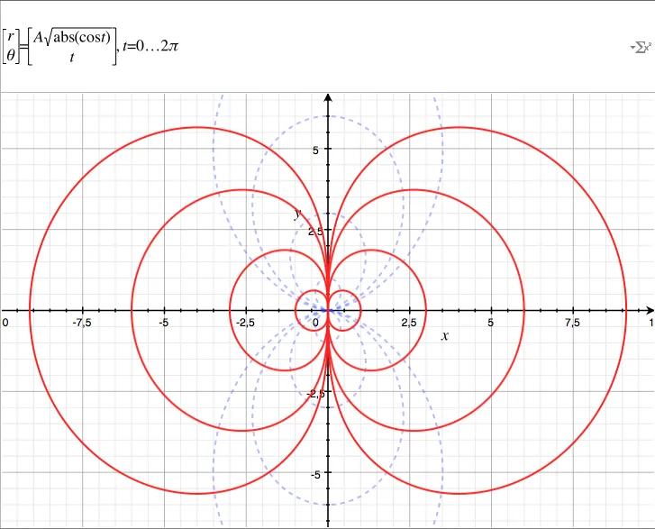

À propos du "making of" il faut noter que A est une variable qu'on ne voit pas ici mais qui prend les valeurs 1, 3, 6 et 9. Ici on ne voit donc que 4 équipotentielles parmi une infinité. On retrouve bien la forme qu'on avait "deviné" sur le premier graphe 3D.

Pour le reste, comme le montre Grapher, j'utilise une courbe paramétrique avec 't' en paramètre qui varie de 0 à 2π.

Maintenant on peut se demander ce que cela donne en 3D. Là aussi j'utilise Grapher et voilà ce que cela donne. L'effet "poupée gigogne" est dû au fait que je fais varier le paramètre A de 1 à 9 (1, 3, 6 et 9. On a donc 4 surfaces imbriquées). J'ai pris soin de rendre les surfaces transparentes histoire qu'on puisse toutes les voir. Ici, on a l'axe des x qui part à droite et l'axe des y qui va vers le haut, histoire d'être homogène avec le graphe 2D précédent.

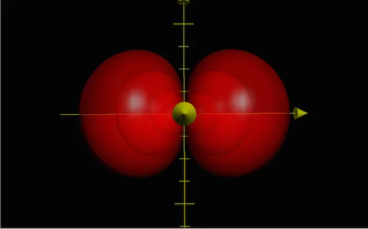

Afin de bien comprendre ce qui se passe lors du passage en 3D je ne modifie pas mon point de vue et je suis donc toujours au-dessus avec l'axe z qui sort de l'écran. Il faut comprendre/saisir/piger que pour générer la surface en 3D, on doit laisser la distance r et l'angle θ constant. Il ne reste plus qu'un degré de liberté... Tourner autour de l'axe des x.

Bref, je modifie légèrement l'équation à tracer et je force Grapher à travailler sur une seule surface. J'impose A=9 pour garder la plus grande surface. De plus je demande à tracer l'équipotentielle à z=0. Il n'y a pas de surprise, je retrouve bien la courbe que j'avais en 2D. L'axe des x part à droite, l'axe des y monte verticalement et l'axe des z sort de l'écran.

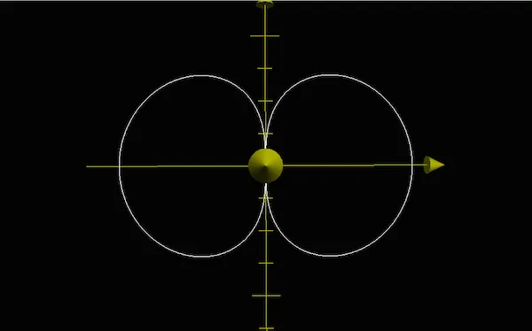

Ensuite je ne change rien à part l'angle de rotation autour de l'axe x et je travaille maintenant avec un angle de +π/4. Toujours vue de dessus, voilà ce que je vois... Pas très significatif...

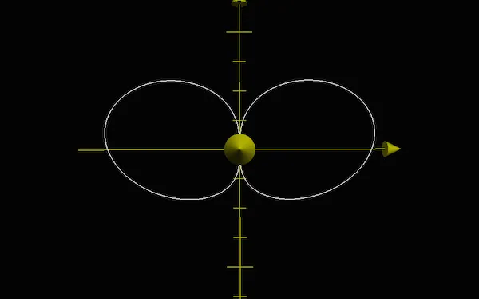

Maintenant, je ne change toujours qu'un seul paramètre à la fois et je modifie mon point de vue. Voilà ce que j'observe.

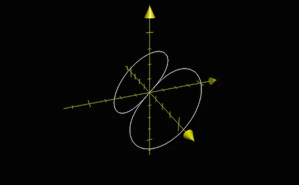

L'axe y part bien à droite alors que l'axe des x sort de l'écran. Dans le sens trigonométrique on a bien fait faire +π/4 autour de l'axe des x. Si maintenant on revient à la vue 3D des différentes surfaces voilà ce que l'on voit :

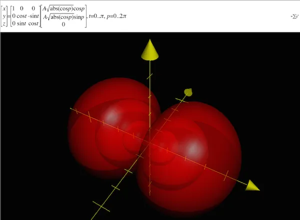

En haut, dans la partie blanche de Grapher, on ne reconnait pas trop notre équation... En fait je n'ai pas trouvé de méthode simple pour faire faire à Grapher une rotation autour de l'axe des x alors je l'ai "codée" moi même avec mes petits doigts. En gros, la première matrice s'occupe de faire faire une rotation de 't' radians autour de l'axe des x Ensuite dans le vecteur on utilise cos et sin pour transformer les coordonnées polaires en coordonnées cartésiennes (attention, notez bien qu'à gauche on attend un point en coordonnées cartésiennes - x, y et z).

Bon ce n'est pas cool et c'est sans doute de ma faute... Si je trouve une solution je ferai une modification dans la page.

## Le champ électrique

C'est vrai ça, on en a plus parlé de celui-là. Récapitulons ce que nous avons... V(ρ, θ) est le potentiel électrostatique. C'est un champ scalaire dont la valeur dépend de la position :

$$V(r, \theta) = \frac{q}{4\pi\epsilon_0} \frac{acos(\theta)}{r^2} $$

Pour déterminer le champ électrique on utilise le fait qu'*en tout point de l'espace, le champ électrique E est normal aux surfaces équipotentielles*. On a donc :

$$\vec{E} = - \vec{\nabla(V)}$$

### Note
En cas de doute, imaginez un condensateur plan que vous mettez à l'horizontale. Vous amenez une pile et vous connectez le + à la plaque du haut (le - à la plaque du bas). Les 1.5V de différence de potentiel vont se retrouver entre les plaques. Des équipotentielles horizontales vont prendre place entre les deux plaques (de V=0V en bas à V=1.5V en haut) et un champs électrique perpendiculaire aux équipotentielles, dirigé de haut en bas va se développer. Il ne faut pas oublier que le champ électrique E est un vecteur qui a le sens d'une charge +. Le sens de E est donc opposé à l'évolution de la valeur de V ce qui explique le '-' de la formule ci-dessus.

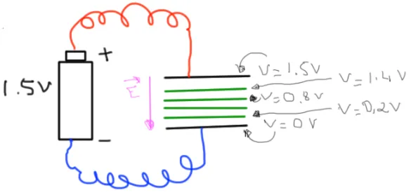

Pour avancer, il ne faut pas non plus oublier pas la définition du gradient en polaire...

$$\vec{E} = - (\frac {\partial V}{\partial r}, \frac{1}{r} \frac{\partial V}{\partial \theta}, \frac{1}{rsin(\theta)} \frac{\partial V}{\partial \varphi}) $$

Finalement on a donc :

$$\vec{E} = (A \frac{2cos(\theta)}{r^3}, A \frac{sin(\theta)}{r^3}, 0)$$

Le champ électrique d'un dipôle n'a donc pas de composante en 'φ' et décroît en 1/r3

## Les lignes de force du champ électrique, lignes de champ

Ce sont les lignes qui sont colinéaires au champ électrique qu'on vient de déterminer (elles sont donc perpendiculaires aux surfaces équipotentielles). Pour pouvoir les tracer, on se dit que si 'dl' est un élément infiniment petit de la ligne de champ alors le produit vectoriel de E par dl doit être nul.

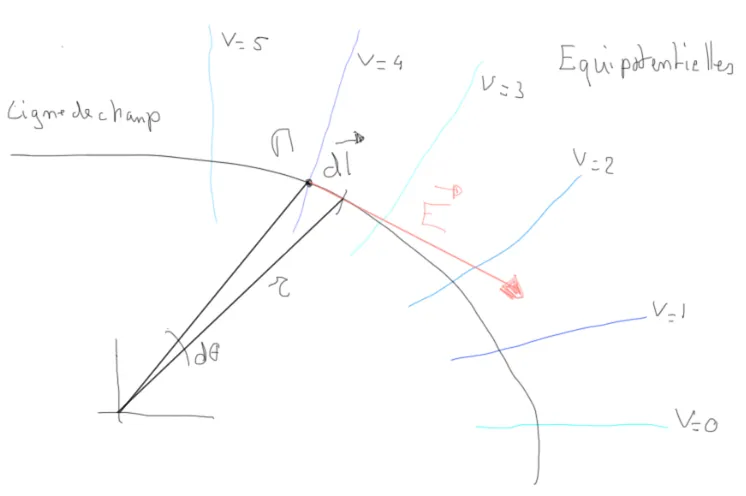

Autrement dit il faut :

$$\vec{E} * \vec{dl} = \vec{0}$$

Si on se rappelle qu'en coordonnées polaires on a :

$$\vec{dl} = (dr, rd(\theta), rd{\varphi})$$

A partir de là, si on ne se mélange pas les pinceaux dans les produits croisés (sans oublier le '-' des coordonnées en θ), on trouve

$$\vec{E} * \vec{dl} = (0, 0, A \frac{2cos(\theta)}{r^3} r d\theta - A \frac{sin(\theta)}{r^3} dr)$$

Il faut donc que :

$$A \frac{2cos(\theta)}{r^3} r d\theta - A \frac{sin(\theta)}{r^3} dr = 0$$

On vire les A et les 1/r3

$${2cos(\theta)} r d(\theta) - {sin(\theta)} dr = 0$$

On regroupe les termes en 'r' et en 'θ'

$$2cos(\theta) r d(\theta) = sin(\theta) dr$$

$$2\frac{cos(\theta)}{sin(\theta)} d(\theta) = \frac{dr}{r}$$

$$2\frac{cos(\theta)d(\theta)}{sin(\theta)} = \frac{dr}{r}$$

$$2\frac{d(sin(\theta))}{sin(\theta)} = \frac{dr}{r}$$

On intègre

$$2 ln(sin(\theta)) = ln(r)+ K$$

$$ln(sin^2(\theta)) = ln(Kr)$$

$$sin^2(\theta) = Kr$$

$$r = Ksin^2(\theta)$$

Oui, oui je sais... L'utilisation que je fais de K n'est pas très orthodoxe. On s'en fiche, c'est une constante qui passe de gauche à droite, au-dessus, en dessous...

Maintenant, si on affiche en 3D l'équipotentielle, le mieux c'est de commencer par faire un affichage "2D". On se place donc au-dessus de la scène (l'axe z sort par l'écran) et je fais en sorte que l'axe des x parte à droite. Pour le reste on trace la ligne de force qui est dans le plan des charges.

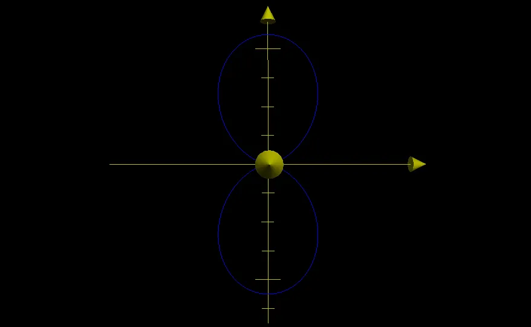

Maintenant, toujours dans le plan des charges, on affiche les équipotentielles V(ρ, θ) = Cte

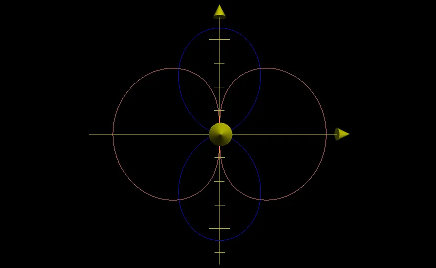

On retrouve bien la courbe que nous avions précédemment en 2D (j'avais dit que je reviendrai sur la courbe bleue...)

Pour finir on se fait la totale. On a en rouge les équipotentielles (y en a 4 avec des valeurs de A qui vont de 1 à 9). On a en bleu les lignes de forces du champ électrique. Là aussi le paramètre A prend 4 valeurs différentes mais on ne le voit pas bien dans l'image ci-dessous. Au pire remontez au graphe 2D avec les lignes bleues en pointillées et imaginez des "tores pincés" autour de l'axe des x.

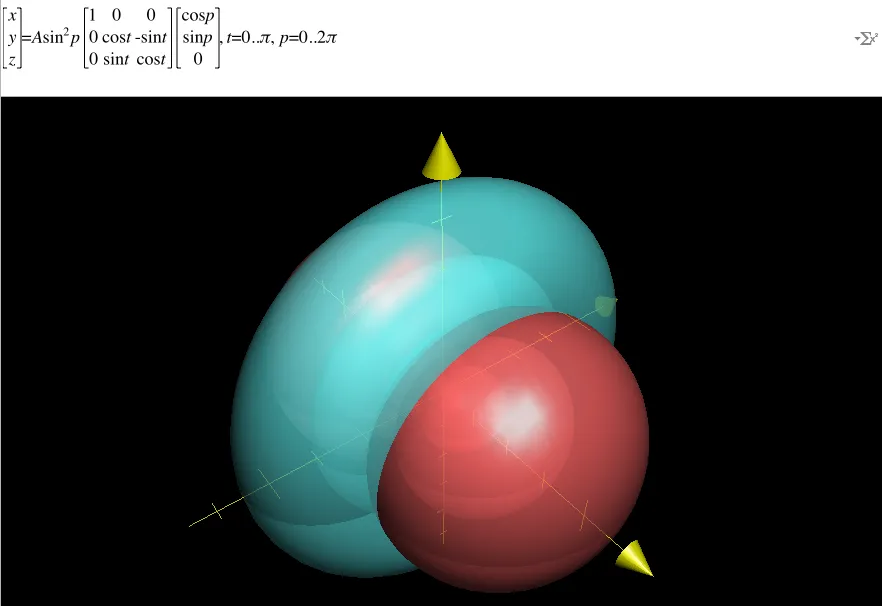

Si vous êtes perdus dans la formule, la matrice, les coordonnées polaires puis cartésiennes... Relisez ce que j'ai dit un peu plus haut. Pour le reste, ne vous laissez pas abuser. A l'instar des équipotentielles (en rouge, là où V est Cte), les lignes de champ couvrent, elles aussi, tout l'espace. Il se trouve que dans l'image ci-dessus on a juste un ratio entre les équipotentielles et les lignes de champ qui fait qu'on a l'impression d'un "donut" fourré à la fraise Tagada. Si je m'amuse à dessiner des lignes de champ un peu plus éloignées voilà ce que cela donne.

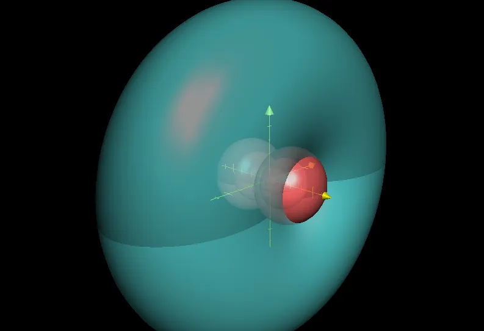

## Conclusion

Bon ben voilà. Je crois que j'ai fait le tour. Il n'y a rien de révolutionnaire mais bon au moins on a une vue 3D sans avoir à utiliser d'applet Java. Pour le reste, j'espère que je n'ai pas d'erreur dans les formules. Faut dire que la syntaxe que j'utilise pour afficher les équations m'oblige à taper des trucs à rallonge...

### Note
Nov 2022 j'ai tout relu encore une fois (y avait des petits trucs à reprendre) et surtout, j'ai fait passer toutes les formules sous MathJax (une dinguerie mais bon ayé, c'est fait.)

Sinon à propos de Grapher, une remarque, un regret ? 
Oui. Un truc qui est carrément soûlant... Si on touche à une des formules il fait un reset des couleurs de toutes les courbes. C'est lourd, très lourd... Pour le reste c'est vraiment un soft super qui mérite d'être plus connu et documenté...

