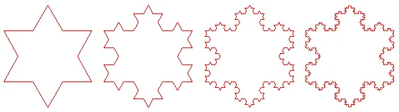
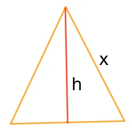
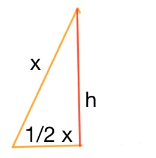
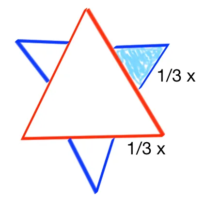
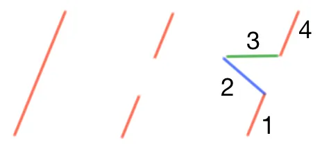

# Périmètre infini et surface finie - Flocon de Koch

Je suis tombé là-dessus par hasard dans le bouquin de maths de ma fille. On demandait de déterminer le surface limite du flocon de Koch. Je me suis pris au jeu et je mets noir sur blanc mon raisonnement.

<div align="center">

</div>


On part d'un triangle équilatéral de côté 'x'. Pour rappel, la surface du triangle est donnée part :

<div align="center">

</div>


$$S = \frac{bh}{2}$$ 
où b est la base et h la hauteur.

Ensuite pour retrouver la hauteur h on peut faire :

<div align="center">

</div>


$$x^2 = h^2 +(x/2)^2$$

$$h^2 = x^2 - x^2/4$$

$$h^2 = (3/4) x^2$$

$$h = x \frac{\sqrt{3}}{2}$$

Ensuite on repart de :

$$S = \frac{bh}{2}$$

$$S = \frac{1}{2}x * x \frac{\sqrt{3}}{2} * \frac{1}{2}$$

$$S = x^2 \frac{\sqrt{3}}{4} $$

Appelons cette première surface Ao et donnons à x la valeur 1. Ao devient :

$$A_0 =1^2 * \frac{\sqrt{3}}{4} $$

Ensuite on passe à la seconde itération et du point de vue de la surface on a qui ressemble à ce qui suit. Pour les 3 petits triangles bleu il faut remarquer qu'ils sont eux aussi équilatéraux et que leur base vaut $$\frac{1}{3}x$$ :

<div align="center">

</div>


$$A_1 = A_0 + 3 a_1$$

Avec a1 la surface de chacun des petits triangles (en bleu ci-dessus). a1 vaut maintenant :

$$a_1 = \frac{\sqrt{3}}{4} ((1/3)^1)^2$$

Là, il faut bien faire attention au (1/3)1 car si à la première itération, on "coupe" en 3 chaque côté qui vaut 1, à la seconde itération on coupera en 3 chaque côté qui vaut 1/3 etc. Ainsi on aura :

$$a_2 =\frac{\sqrt{3}}{4} ((1/3)^2)^2$$

Puis à l'itération n, la surface de chaque nouveau petit triangle vaudra :

$$a_n= \frac{\sqrt{3}}{4} ((1/3)^n)^2$$

Bon. Maintenant, revenons à cette formule :

$$A_1 = A_0 + 3 a_1$$

Là, il faut faire attention au 3 devant a1. En effet, ce 3 représente le nombre de côtés que l'on avait à l'itération précédente. On doit donc trouver une "formule" pour calculer ce nombre... Allez on commence doucement...

À la fin de l'itération 1 il y aura 3 (2+2) segments. Pour s'en convaincre il faut remarquer qu'il y a 3 côtés et que chaque côté comprend 2 segments rouge et 2 segments bleu.

Une autre façon de le comprendre c'est de voir qu'au début de l'itération 1, on a 3 côtés. Sur chaque côté, on "supprime" le 1/3 du segment (qui est au milieu) et il reste 2 segments. Ensuite, en lieu et place du segment qu'on vient d'enlever, on rajoute 2 segments pour faire un "petit" triangle.

<div align="center">

</div>


D'où le (2+2) 3 et donc le 3x4 qu'on retrouve ci-dessous. A l'itération 2 on aura donc :

$$A2 = A_1 + 3*4^1 a_2$$

Ensuite, à l'itération 3 on aura :

$$A_3 = A_2 + 3*4^2 a_3$$

Euh... Attends deux minutes... D'où tu sors ton 42? En fait, il faut réaliser qu'à chaque itération, chaque segment se retrouve découpé en 4. Ceci explique la croissance exponentielle. Enfin bref, à l'itération n on aura :

$$A_n = A_{n-1} + 3*4^{n-1} a_n$$

Au final notre formule devient :

$$A_n = A_{n-1} + 3*4^{n-1}\frac{\sqrt{3}}{4} (1/3^n)^2$$

Et par voie de conséquence, la formule de la surface devient :

$$S =\frac{\sqrt{3}}{4} +\sum_{1}^{n}{ 3*4^{k-1}\frac{\sqrt{3}}{4} (1/3^k)^2}$$

Faisons un peu le ménage et il vient :

$$S =\frac{\sqrt{3}}{4} +\sum_{1}^{n}{ 3 \frac{\sqrt{3}}{4} 4^{k-1} (1/3^{2k})}$$

$$S =\frac{\sqrt{3}}{4} +\sum_{1}^{n}{ 3 \frac{\sqrt{3}}{4} 4^{k-1} \frac{1}{3^{2k}}}$$

$$S =\frac{\sqrt{3}}{4} + 3 \frac{\sqrt{3}}{4} \sum_{1}^{n}{ {4^{k-1}} \frac{1}{3^{2k}}}$$

Si on divise par 4 ce qu'il y a dans la somme on obtient :

$$S = \frac{\sqrt{3}}{4} + 3 \frac{\sqrt{3}}{4} \sum_{1}^{n}{ \frac{4^k}{4} \frac{1}{3^{2k}}}$$

$$S = \frac{\sqrt{3}}{4} + 3 \frac{\sqrt{3}}{4} \frac{1}{4} \sum_{1}^{n}{ (\frac{4}{9})^k}$$

Là, il est peut-être utile d'identifier la somme des n premiers termes (de 1 à n) d'une suite géométrique de premier terme 4/9 et de raison 4/9. Si on ne s'intéresse qu'à cette dernière pour l'instant on a :

$$\sigma = \sum_{1}^{n}{ (\frac{4}{9})^k}$$

$$\sigma =\frac{(\frac{4}{9})^{n+1} - (\frac{4}{9})^{1}}{\frac{4}{9}-1}$$

$$\sigma =\frac{\frac{4}{9}((\frac{4}{9})^{n} - 1)}{\frac{4}{9}-1}$$

$$\sigma =\frac{\frac{4}{9}(1 - (\frac{4}{9})^{n})}{1 - \frac{4}{9}}$$

$$\sigma =\frac{4}{9} \frac{(1 - (\frac{4}{9})^{n})}{\frac{5}{9}}$$

$$\sigma =\frac{4}{9} \frac{9}{5} (1 - (\frac{4}{9})^{n})$$

$$\sigma =\frac{4}{5} (1 - \frac{4}{9}^{n})$$

Quand n tend vers l'infini on a :

$$\sigma =\frac{4}{5} (1 - \frac{4}{9}^{n})$$

$$\sigma =\frac{4}{5}$$

Finalement, la surface tend vers une limite finie :

$$S = \frac{\sqrt{3}}{4} + 3 \frac{\sqrt{3}}{4} \frac{1}{4} \sum_{1}^{n}{ (\frac{4}{9})^k}$$

$$S = \frac{\sqrt{3}}{4} + 3 \frac{\sqrt{3}}{4} \frac{1}{4} \frac{4}{5}$$

$$S = \frac{\sqrt{3}}{4} + 3 \frac{\sqrt{3}}{4} \frac{1}{5}$$

$$S = \frac{\sqrt{3}}{4} + 3 \frac{\sqrt{3}}{20}$$

$$S = \frac{5 \sqrt{3}}{20} + 3 \frac{\sqrt{3}}{20}$$

$$S = \frac{8 \sqrt{3}}{20} $$

$$S = \frac{2 \sqrt{3}}{5} $$

## Conclusion 
* Alors que son **périmètre** tend vers une **valeur infinie** 
* La **surface** du flocon de Koch tend vers une **valeur finie**
Marrant non ?

Pour le fun, un bout de code C++ pour voir comment évolue la surface calculée en fonction de n. Il n'y a aucune malice dans le code ci-dessous. Il faut juste remarquer qu'on commence par calculer la somme, puis qu'on "remonte" la formule de la droite vers la gauche.

```cpp
// clang++ -std=c++11 -stdlib=libc++ koch.cpp -o koch
#include <iostream>
#include <math.h>
using namespace std;
int main() {
  auto n = 10;
  auto S = 0.0;
  for (auto k = 1; k != n + 1; ++k)
    S += pow(4.0 / 9.0, k);
  S *= 3 * sqrt(3) / (4 * 4);
  S += sqrt(3) / 4;
  cout << "With n = " << n << " the surface = " << S << endl;
  cout << "The limit is : " << 2 * sqrt(3) / 5 << endl;
}
```

Il ne faut pas hésiter à aller le copier/coller sur [ideone.com](https://ideone.com/) par exemple.

Le même code en Javascript à copier sur [CodePen.io](https://codepen.io/) par exemple.

```java
n = 10
S = 0.0
for(k=1; k!=n+1; k++){
  S += Math.pow(4.0/9.0, k);
}
S *= 3*Math.sqrt(3)/(4*4);
S += Math.sqrt(3)/4;
console.log ('Avec n = ' + n + ' la surface calculée vaut : ' + S);
console.log('La limite est : ' + 2*Math.sqrt(3)/5);

```
