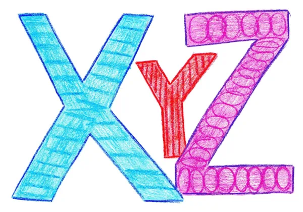

# x+y+z=30

## Introduction

$$x+y+z=30$$ 
... Problème posé l'autre jour par ma fille suite discussion en classe avec ses potes et le prof de [Maths](). On cherche $$x$$, $$y$$ et $$z$$ tels que :

$$ x+y+z=30 $$

Avec

$$ x, y, z \in \left \{1, 3, 5, 7, 9, 11, 13, 15\right \}$$

On remarque que tous les nombres sont impairs. Si la somme de deux d'entre eux donne bien un nombre pair, quand on ajoute le troisième, c'est mort, le résultat est impair et on ne peut pas retomber sur 30. 

**LE** truc, c'est de se dire que si cette équation n'est pas possible en base 10 il faut essayer dans une autre base. Oui, mais laquelle ?

## Petit rappel à propos des bases

Si j'ai le nombre 124 en base 10 alors il se décompose comme suit :

$$ 124_{10} = 1 * 10^2 + 2 * 10^1 + 4 * 10^0 $$

Il en va de même dans les autres bases. En particulier, dans la base $ k$ que l'on cherche, on peut écrire

$$ 30_k = 3 * k^1 + 0 * k^0 $$

Si vous avez toujours des problèmes avec ces histoires, jetez un œil sur cette [page](http://villemin.gerard.free.fr/Wwwgvmm/Numerati/ConDecim.htm) avant de poursuivre.

## Reprenons...

À ce stade il faut que l'on s'impose des choses afin de circonscrire le problème. En gros, l'idée c'est de se dire que si on veut un 3 comme facteur des $ k^1$ ce dernier pourrait être la somme du premier digit de $$y$$ et du premier digit de $$z$$ ainsi que d'une retenue.

Compte tenu de ce que l'on vient de dire, on cherche donc une solution dans laquelle $$y$$ et $$z$$ possèdent chacun 2 digits (et $$x$$ n'en possède qu'un seul). Si c'est le cas on peut écrire $$y$$ et $$z$$ sous la forme

$$ y = y_1y_2 $$

Et

$$ z = z_1z_2 $$

On s'impose en plus de chercher une solution dans laquelle la somme des facteurs des $$k^0$$ génèrent une retenue. On aura donc un 1 fourni par le premier digit de $$y$$, un autre 1 fourni par le premier digit de $$z$$ et un dernier 1 fourni par la retenue. 

Si ce n'est pas clair, il faut imaginer qu'en base 10 j'essaie de faire en sorte que par exemple y = 11, z = 13 et que $$x + 1 + 3 = 10$$ ce qui génère une retenue.

Finalement, on se retrouve à résoudre l'équation suivante

$$ x + y_2 + z_2 = k $$

## De pire en pire...

Ah ben super, bravo... On avait une équation à trois inconnues et on se retrouve maintenant avec une équation à 4 inconnues. Il n'y a pas à dire, on sent qu'on avance... 😁 

C'est vrai, vu comme ça, ça ne fait pas rêver. Toutefois, on a réduit les possibilités pour $$y_2$$ et $$z_2$$. En effet, ils ne peuvent plus prendre leurs valeurs que dans l'ensemble 5, 3 et 1 car on a que 3 nombres à 2 digits dans l'ensemble de départ (15, 13 et 11). Faisons une petite table pour voir ce que donnent les différentes additions de ces digits.

|  | 5 | 3 | 1 |
| --- | --- | --- | --- |
| 5 | x | 8 | 6 |
| 3 | x | x | 4 |
| 1 | x | x | x |

Dans la table ci-dessus, en ligne et en colonne on retrouve les digits concernés. Ensuite je m'impose de ne pas utiliser 2 fois le même nombre car les premiers digits de chaque nombre sont uniques (11, 13 et 15 n'ont pas de premier digits commun). La diagonale est donc vide. Enfin, l'addition étant commutative, je ne remplis que la demi-matrice supérieure.

À l'aide de cette première table, on observe que l'addition de $$y$$ et $$z$$ nous donnera un nombre qui se terminera par 8, 6 ou 4. Comme on sait que $$x$$ peut prendre une valeur impaire entre 1 et 9, construisons une seconde table afin de voir ce que cela donne

|  | 8 | 6 | 4 |
| --- | --- | --- | --- |
| 1 | 9 | 7 | 5 |
| 3 | 11 | 9 | 7 |
| 5 | 13 | 11 | 9 |
| 7 | 15 | 13 | 11 |
| 9 | 17 | 15 | 13 |

Sur la première ligne, c'est le digit unité des différentes additions entre $$ y_2$$, $$ z_2$$(voir la première table). Dans la première colonne on reporte les valeurs que peut prendre $$x$$ (chiffres impairs à un digit de l'ensemble de départ). On remarque que toutes les sommes sont des nombres qui appartiennent à l'ensemble de départ. Toutes ? Non, il reste quand même la valeur 17. Si on se rappelle que l'on veut que la somme de $$y_2$$, $$z_2$$ et $$ x$$ génère une retenue il faut absolument que la somme ne soit pas égale à l'un des nombres de l'ensemble de départ.

Bon allez, c'est mon dernier choix Jean Pierre, je décide que la solution existe en base 17. Vérifions si ça colle.

## Une solution en base 17 ?

Dans la dernière table, on choisit 17

Cela veut dire que $$x$$ vaut 9 (dernière ligne) et que le dernier digit de la somme de $$y_2$$ et $$z_2$$ vaut 8 (première colonne)

Si le dernier digit vaut 8, en regardant dans la première table, on peut choisir $$y_2$$ égal à 3 et $$z_2$$ égal à 5. Comme la table est symétrique par rapport à la diagonale on aurait pu intervertir les 2 valeurs.

Quant à $$y_1$$ et $$z_1$$ ils valent tous les deux 1. C'est quelque chose que nous avions imposé.

Le tiercé pourrait donc être un truc du style : x = 9, y = 13 et z = 15. Vérifions tout ça :

$$9_{17} = 9_{10}$$

$$13_{17} = 20_{10}$$

$$15_{17} = 22_{10}$$

La somme en base 10 donne 51 (9+20+22)

Cerise sur le gâteau $$30_{17} = 51_{10}$$

Que du bonheur, on a trouvé une solution.

$$ 9_{17} + 13_{17} + 15_{17} = 30_{17} $$

Maintenant la question à se poser est sans doute la suivante : est-ce qu'il existe d'autres solutions et si oui combien ? La réponse à la première question est sans doute oui car si on a imposé le fait que les 3 variables soient différentes et on n'a pas cherché de solution avec un nombre qui se répète parmi $$x$$, $$y$$ et $$z$$. Mais ça, c'est une autre histoire...

