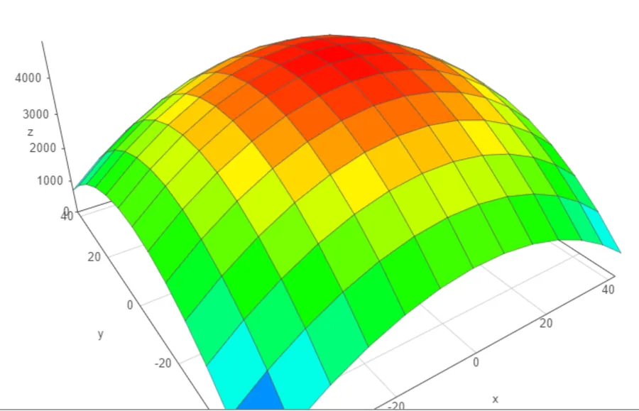
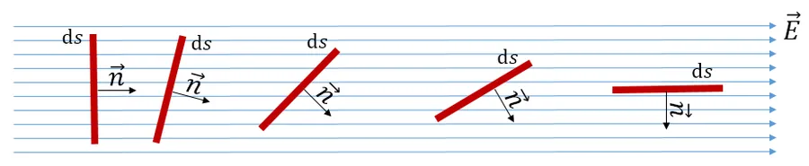
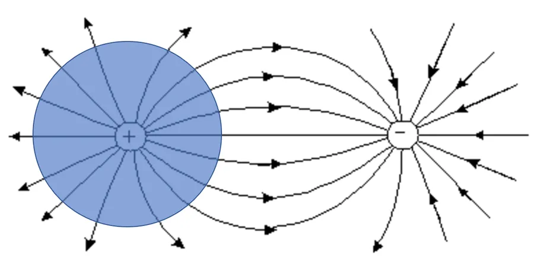
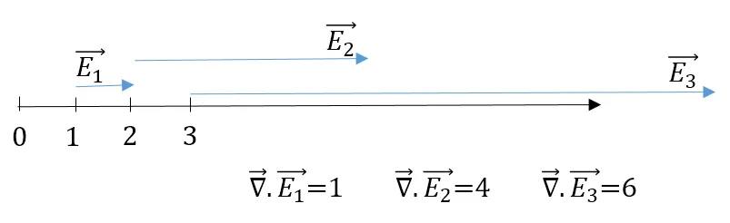
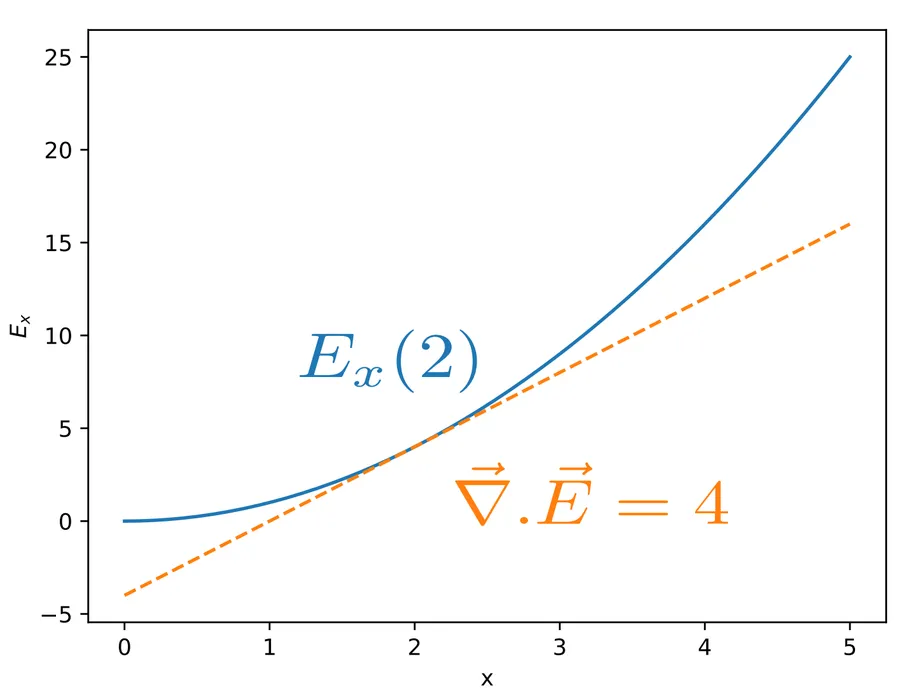
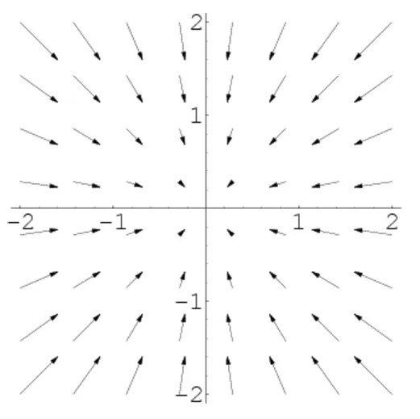
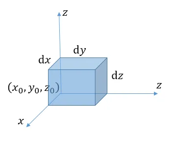

# Forme intégrale et différentielle de la loi de Gauss

## Introduction

Forme intégrale et différentielle de la loi de Gauss... Pour être honnête à propos des [équations de Maxwell](https://fr.wikipedia.org/wiki/%C3%89quations_de_Maxwell), quand j'étais étudiant, je ne suis pas sûr d'avoir compris de quoi il s'agissait vraiment. Je voyais bien des signes au tableau, dans les livres et sur mes feuilles, j'arrivais à calculer des trucs mais bon, franchement, je ne crois pas que j'avais saisi de quoi on parlait. 

Je ne me rappelle plus très bien mais je suis presque certains qu'à l'époque je ne savais pas quand utiliser l'une ou l'autre. Quant à passer d'une forme à l'autre... 

Bref, je vais essayer de remédier à cela et expliquer les choses de la façon dont j'aurai voulu qu'on me les explique à l'époque. C'est parti.

La loi de Gauss est la première et la plus simple des quatre équations. Sous sa forme intégrale s'exprime de la façon suivante :

$$\oint\limits_S \vec{E} \cdot \hat{n} \text{d}s=\frac{q_{enc}}{\varepsilon_o}$$

Sous forme différentielle, elle s'exprime de la façon suivante :

$$\vec{\nabla} \cdot \vec{E} = \frac{\rho }{\varepsilon_o}$$

Si le but du jeu ici est de comprendre la forme intégrale et différentielle de la loi de Gauss il est aussi de montrer comment on passe de la première forme à la seconde. On en profitera pour revenir sur les différents éléments qui constituent chacune des formules. Ce sera aussi une bonne occasion pour remettre à plat un certain nombre de choses pas toujours bien comprises (en tout cas cela ne l'était pas pour moi).

## Décortiquons la forme intégrale

$$\oint\limits_S \vec{E} \cdot \hat{n} \ \text{d}s=\frac{q_{enc}}{\varepsilon_o}$$

### Le terme de gauche de la forme intégrale

$$\oint\limits_S \vec{E} \cdot \hat{n} \ \text{d}s$$

$$\vec{E}$$ : le champ électrique. Dans la formule, c’est un vecteur. En effet, un champ électrique possède (comme un vecteur…) un sens, une direction et une amplitude.

Pour faire simple, un champ électrique est une région de l'espace où s'exerce des forces électriques sur des particules chargées. Pour faire encore plus simple... Je me promène et j'ai dans la main une charge électrique positive. J'ouvre ma main. La charge ne bouge pas... J'en déduis qu'il n'y a pas de champ électrique dans le coin. Si la charge bouge... J'en déduis qu'il y a un champ électrique qui exerce une force sur la charge ($$ \vec{F} = q \vec{E}$$).

Pour représenter les champ électriques on utilise généralement des lignes, dites, lignes de champ. Plus les lignes sont espacées et plus le champ est faible. Plus elles sont resserrées et plus le champ est fort (la force exercée sur une charge sera importante). On peut penser aux courbes de niveaux des cartes géographiques. Plus les lignes sont espacées et plus le terrain est plat et plus elles sont resserrées et plus l'altitude varie rapidement.

Dans cette  [vidéo](https://www.youtube.com/watch?v=Y6YdC2UoDYY), via diverses expériences, on visualise les lignes de champs électrique :

$$ \hat{n} $$ : c'est un vecteur unitaire. Sa longueur vaut 1. Comme il est un peu spécial, pour bien le repérer dans la formule, au lieu d'une flèche il est recouvert par un chapeau. Pour construire un tel vecteur, c'est relativement simple :

$$\hat{V} = \frac {\vec{V}} {|\vec{V}|}$$

Dans la formule, au point considéré, $$ \hat{n} $$ est le vecteur normal à la surface $$ \text{d}s $$

$$ \cdot $$ : Le "point" c'est le produit scalaire entre deux vecteurs. Ce dernier vaut :

$$V_1V_2cos(V_1,V_2) $$

Le résultat est un scalaire, une valeur. À cause du (ou grâce à) cosinus, le produit scalaire est :

* maximal quand les vecteurs sont co-linéaires et dans le même sens (cos vaut alors 1 et il ne peut pas valoir plus).
* nul quand les vecteurs sont à 90° l'un de l'autre.
* minimal quand les vecteurs sont co-linéaires mais de sens opposé (le cos vaut -1 et ne peut pas valoir moins).

$$ \text{d}s $$ : c'est une surface infinitésimale, une surface élémentaire. Si on pense à un ballon de rugby, il suffit d'imaginer qu'on dessine dessus des carrés de 1mm de côté. Vu le loin on recouvre parfaitement le ballon. À y regarder de plus près chaque facette, chaque carré élémentaire, possède une orientation différente de celle de son voisin. Les différences son faibles entre deux carrés adjacents. Ci-dessous, une illustration de que ce j'ai en tête. Quoiqu'il en soit, on constate que les facettes qui sont au sommet et à la base du ballon sont à 90° des facettes qui se trouvent à l'équateur (aux pôles les facettes sont horizontales alors qu'à l'équateur les facettes sont verticales)

$$ \vec{E} \cdot \hat{n} \ \text{d}s $$ : c'est le flux élémentaire de $$ \vec{E}$$ à travers $$ \text{d}s $$. Quand on pense à un flux, on pense souvent à l'eau qui coule à travers un trou. Ici rien ne coule. En fait ici le flux mesure la quantité de champ électrique qui passe à travers la surface élémentaire. Dans l'illustration ci-dessous, le champ électrique est constant (les lignes sont parallèles sur toute la largeur de la page) mais on fait varier l'angle de la surface élémentaire $$ \text{d}s$$. À gauche il y a 8 lignes qui passent à travers. Forcément plus il y a de l'angle et moins il y a de lignes de champ qui traversent la surface (l'épaisseur est censée être nulle). À la fin, à droite, plus aucune ligne ne passe et le flux est nul.

$$ \oint\limits_S $$ : c'est la somme intégrale sur toute la surface de tous les flux élémentaires. Il faut bien comprendre que c'est une intégrale double sur toute la surface (y a pas le signe de double intégragtion mais y a un "S". Le cercle indique que la surface est fermée). Si on reprend le ballon de rugby, "l’algorithme" de la somme intégrale pourrait ressembler à ce qui suit.

Pour chaque facette sur la surface du ballon :

* Déterminer la valeur de sa surface $$ \text{d}s $$ (elle peut être constante. 1mm x 1mm par exemple).
* Déterminer $$ \hat{n} $$ (on sait que ce vecteur a une longueur de 1 mais quelle est son orientation et son sens?).
* Ceci fait, au point, déterminer les caractéristiques du champ électrique (intensité, sens, orientation).
* Faire le produit scalaire de $$ \vec{E}$$ par $$ \hat{n} $$.
* Multiplier le nombre obtenu par la valeur de $$ \text{d}s $$ (hé oui, il ne faut pas l'oublier celui là, chaque facette a une surface...).

### Le terme de droite de la forme intégrale

$$\frac{q_{enc}}{\varepsilon_o}$$

$$ q_{enc} $$ : c'est la quantité de charges enfermées par la surface close. C'est une quantité net exprimée en Coulombs. Si il y a autant de charges positives que négatives la somme est nulle.

***Remarque :*** C'est un point de vocabulaire. Les charges électriques dont on parle ici sont des charges "statiques". Ce sont elles qui engendrent un champ électrostatique. Il existe un autre type de champ électrique qui lui est induit par la variation dans le temps d'un champ magnétique (loi de Faraday).

$$ \varepsilon_o $$ : c'est la permittivité du vide. C'est un coefficient qui traduit le fait que le vide est plus ou moins sensible au champ électrique. On le voit, dans la formule $$ \varepsilon_o $$ agit comme un facteur de mise à l'échelle. On pourrait très bien imaginer un système d'unités dans lequel $$ \varepsilon_o $$ n’apparaîtrait pas dans cette formule (mais bon, il apparaîtrait ailleurs c'est sûr).

## À propos de la première équation

En français dans le texte on doit lire : le flux électrique qui passe au travers d'une surface fermée S est proportionnel au nombre de charges électriques contenues dans le volume ainsi délimité.

En ce qui me concerne, je "visualise" la situation de la façon suivante :

1. J'imagine un ballon de baudruche dans lequel je dépose quelques charges positives. Des lignes de champ électrostatiques sortent alors de ce dernier et vont rejoindre des charges négatives quelque part en dehors du ballon. Le flux électrique est positif car les lignes sortent du ballon. C'est ce qui est représenté dans la figure suivante.
2. Si je mets 5 charges positives et 5 charges négatives, aucune ligne de champ ne sort du ballon. Il y a bien des lignes de champ électriques entre les charges positives et négatives mais elles vont directement des unes aux autres. De toute façon, si une ligne de champ issue d'une charge positive sortait du ballon elle serait obligée de revenir dans le ballon pour rejoindre une charge négative. Le flux sortant serait donc compensé par un flux rentrant et le flux résultant serait nul.
3. Si je met uniquement des charges négatives alors, venues de l'espace, des lignes de champ rentrent dans le ballon et vont terminer leur course sur les charges négatives. Le flux électrique est négatif car les lignes de champ rentrent dans le ballon.

### Remarque :

L'univers est en équilibre électrique. Il y a donc autant de charges positives que de charge négatives. En conséquence, dans l'expérience de pensée précédente, si je met des charges positives dans le ballon, je ne romps pas l'équilibre. Il y a simplement un nombre identique de charges de signe opposé qui sont en dehors du ballon. C'est pour cette raison que je peux dire que dans le cas 1, des lignes sortent du ballon pour rejoindre des charges négatives en dehors de ce dernier. Idem dans le cas 3, si je mets des charges négatives dans le ballon alors je suis sûr que dans l'espace il y a autant de charges positives qui ne "cherchent" plus qu'à tendre une ligne de champ entre elles et les charges qui sont à l'intérieur du ballon.

## Décortiquons la forme différentielle

$$\vec{\nabla} \cdot \vec{E} = \frac{\rho }{\varepsilon_o}$$

### Le terme de gauche de la forme différentielle

$$\vec{\nabla} \cdot \vec{E}$$

$$ \vec{\nabla}$$ : le triangle inversé se nomme nabla. C'est un opérateur différentiel vectoriel. Pas de panique... Cela veut simplement dire qu'il s'agit d'un vecteur dont les composantes sont des dérivées partielles. Typiquement on a :
$$\vec{\nabla} = \hat{i} \frac{\partial }{\partial x} + \hat{j} \frac{\partial }{\partial y} + \hat{k} \frac{\partial }{\partial z}$$

Histoire de bien garder en tête que $$ \vec{\nabla}$$ est un vecteur et quitte à être un peu lourd, notons qu'on peut l'écrire aussi comme ça :

$$
\vec{\nabla} = \begin{pmatrix}\frac{\partial }{\partial x}
\\ \frac{\partial }{\partial y}
\\ \frac{\partial }{\partial z}
\end{pmatrix}
$$

Ce qui est gênant c'est que pour l'instant on ne voit pas sur quoi l'opérateur s'applique et on ne voit pas non plus comment on va pouvoir manipuler tout ça. En fait tout va dépendre de l'opération (produit scalaire, produit vectoriel...) ainsi que de l'objet auquel on va appliquer l'opérateur $$ \vec{\nabla}$$ (sur un vecteur, sur un champ scalaire).

Dans le cas qui nous intéresse, première ligne de la table ci-dessous, le produit scalaire du vecteur nabla et d'un vecteur, retourne un scalaire (c'est le propre du produit scalaire). Ce dernier est la somme des dérivées partielles de chacune des composantes du vecteur (dérivée de $$E_x$$ par rapport à $$x$$ plus la dérivée de $$E_y$$ par rapport à $$y$$ etc.)

| Opération | Écriture | Nom | Opérandes | Résultat |
|:---       |:---      |:--- |:---       |:---      |
| Produit scalaire | $$ \vec{\nabla} \cdot \vec{E} $$ | Divergence | $$ (\frac{\partial }{\partial x},\frac{\partial }{\partial y},\frac{\partial }{\partial y}) \cdot (E_x,E_y,E_z)$$ | $$ \frac{\partial E_x }{\partial x} + \frac{\partial E_y}{\partial y} + \frac{\partial E_z}{\partial z}$$ |
| Produit vectoriel | $$ \vec{\nabla} \times \vec{E}$$ | Rotationnel (Curl) | $$ (\frac{\partial }{\partial x},\frac{\partial }{\partial y},\frac{\partial }{\partial y}) \times (E_x,E_y,E_z)$$ | $$ \begin{pmatrix}\frac{\partial E_z}{\partial y}-\frac{\partial E_y}{\partial z} \\ \frac{\partial E_x}{\partial z}-\frac{\partial E_z}{\partial x} \\ \frac{\partial E_y}{\partial x}-\frac{\partial E_x}{\partial y}\end{pmatrix}$$|
| Application sur un champ scalaire | $$\vec{\nabla} \phi$$ | Gradient | $$(\frac{\partial }{\partial x},\frac{\partial }{\partial y},\frac{\partial }{\partial y})  \phi$$ | $$ \begin{pmatrix}\frac{\partial \phi}{\partial x} \\ \frac{\partial \phi}{\partial y} \\ \frac{\partial \phi}{\partial z} \end{pmatrix}$$ |

### Remarque :

Non, non, je n'ai pas l'intention d'expliquer les lignes 2 et 3 du tableau. Elles sont là pour illustrer le fait que l'opérateur nabla s'applique de 3 façons différentes (divergence, rotationnel, gradient)

Pour essayer de saisir à quoi correspond la divergence (1ere ligne), raisonnons à une dimension. On considère dans l'exemple qui suit que les composantes $$ E_y$$ et $$ E_z$$ sont nulles. Je m'impose en plus que $$ E_x$$ varie en $$ x^2$$. Alors si je calcule la divergence, seule la composante en x va rentrer en jeu. Cette dernière vaut $$ 2x$$. Ci-dessous on a tracé 3 instances du champ électrique aux abscisses 1, 2 et 3. On affiche aussi les valeurs des divergences associées.

Une autre façon de "voir" les choses est de se placer en 2 et de calculer la divergence qui dans notre cas correspond à la dérivée (dans l'exemple, il n'y a pas de composante en y ni en z).

On retiendra qu'une divergence positive indique que les vecteurs s'écartent du point où on fait le calcul. Le point se comporte comme une source, une fontaine qui coule. Réciproquement une divergence négative indique que les vecteurs concourent vers le point où la divergence est évaluée (le point se comporte donc comme la bonde d'un évier). Ci-dessous un champs vectoriel à deux dimensions dont la divergence est négative au point (0,0).

$$ \vec{\nabla} \cdot \vec{E}$$ : c'est la divergence du champ électrique au point considéré. Si elle est positive les vecteurs du champ électrique s'écartent du point d'étude. Dans le cas contraire, quand la divergence est négative, les vecteurs du champ électrique convergent vers le point d'étude.

### Le terme de droite de la forme différentielle

$$\frac{\rho }{\varepsilon_o}$$

$$ \rho $$ : c'est la densité de charge électrique au point d'étude. C'est donc le rapport d'une quantité de charge sur un volume.

$$ \varepsilon_o $$ : c'est la même que tout à l'heure.

## Ça va mieux en le disant

* La forme intégrale met en relation le flux à travers une surface fermée et la quantité de charges contenue dans la surface en question. On regarde donc la situation "de loin", globalement. On intègre la situation. Typiquement on l'utilisera lorsque, connaissant une distribution de charges, on cherche à déterminer le flux électrique à travers une surface (flux à travers un cylindre qui entoure un fil conducteur contenant n charges par centimètre par exemple). Il faut donc garder en tête qu'on s'intéresse au résultat global et pas à ce qui se passe en chaque point.
* La forme différentielle s’intéresse à ce qui se passe en un point particulier. C'est un cas limite dans lequel on fait tendre la surface fermée précédente vers un tout petit volume autour d'un point particulier. Par exemple, on l'utilisera lorsque, connaissant l'expression du champ électrique en fonction de x, y et z, on souhaite déterminer la densité de charge en un point particulier (x=2, y =0 et z = 42 par exemple).

## Passage d'une équation à l'autre

### Motivation

En fait, on cherche à savoir ce qui se passe en chaque point. On a une première équation qui donne le flux à travers une surface... Très bien... Mais qu'est ce qui se passe en chaque point? Du point de vue de la méthode, on va partir de ce que l'on connait (le première équation) et on va faire tendre la surface fermée vers 0 afin qu'elle n'entoure plus qu'un seul point infinitésimal.

### C'est parti

On commence par se donner un champ électrique $$ E$$ dont les 3 composantes sont $$ (E_x, E_y, E_z)$$. Je choisis arbitrairement de dire que les composantes $$ E_x$$, $$ E_y$$ et $$ E_z$$ vont toutes dans le sens des $$ x$$, $$ y$$ et $$ z$$ positifs. Si il en était autrement cela ne changerait strictement rien à la démarche. Ce serait juste un peu moins pratique.

Ensuite, on choisit un point $$ (x_0, y_0, z_0)$$ à partir duquel on va construire un volume infinitésimal dont les dimensions sont respectivement $$ dx$$, $$ dy$$ et $$ dz$$.

Enfin, on se propose d'évaluer le flux total sortant de ce volume élémentaire puis de faire tendre ce volume vers 0 afin de pouvoir évaluer ce qui se passe au point $$ (x_0, y_0, z_0)$$. Je suis lourd mais c'est pas grave : il est important de garder en tête qu'on va faire tendre le volume vers 0.

On part donc de ce que l'on connait

$$\oint\limits_S \vec{E} \cdot \hat{n} \ \text{d}s=\frac{q_{enc}}{\varepsilon_o}$$

Voilà ce que l'on cherche à évaluer

$$\lim_{S \to 0 } \oint\limits_S \vec{E} \cdot \hat{n} \ \text{d}s=???$$

On oublie la limite pour l'instant et on décompose l'intégration sur toute la surface en une somme d'intégrations par face. En effet, c'est plus simple car sur chaque face la normale est constante (toujours vers le haut, toujours vers la gauche etc.). Il vient :

$$\oint\limits_S \vec{E} \cdot \hat{n} \ \text{d}s = 
\begin{aligned}
&+ \int E_x(x_0 + \text{d}x, y, z) \ \text{d}y \text{d}z - \int E_x(x_0, y, z) \ \text{d}y \text{d}z 
&+ \int E_y(x, y_0+ \text{d}y, z) \ \text{d}x \text{d}z - \int E_y(x, y_0, z) \ \text{d}x \text{d}z 
&+ \int E_z(x, y, z_0+ \text{d}z) \ \text{d}x \text{d}y - \int E_z(x, y, z_0) \ \text{d}x \text{d}y
\end{aligned}
$$

Pour expliquer la première ligne à droite de l'égalité il faut remarquer les choses suivantes

* À l'abscisse $$ x_0 + \text{d}x$$ la surface de la face vaut $$ \text{d}y \text{d}z $$.
* À cet endroit, la normale à la surface qui sort du volume est co-linéaire avec la composante $$ E_x$$ du champ électrique (ne pas oublier qu'on a choisi $$ E$$ tel que ses composantes soient toutes dans le sens des axes positifs). Le cosinus de l'angle entre la normale et $$ E_x$$ vaut donc +1. Le produit scalaire est donc positif.
* En ce qui concerne la valeur champ électrique il vaut $$ E_x(x_0 + \text{d}x, y, z)$$
* Le cosinus de l'angle entre la normale à la surface élémentaire et $$ E_y$$ (ou $$ E_z$$) vaut 0. Le produit scalaire est donc nul et n'apparaît pas dans la ligne.

On raisonne de la même façon pour le second membre de la première ligne. On est à l'abscisse $$ x_0$$ et la surface élémentaire est identique. Ceci dit, dorénavant, la normale à la surface (qui sort toujours du volume) est de sens opposé à la composante $$ E_x$$ du champ électrique qui est toujours dirigé dans le sens des $$ x$$ positifs. Le produit scalaire est donc négatif. Pour finir, la valeur champ électrique vaut $$ E_x(x_0, y, z)$$. On ne tient pas compte des composantes $$ E_y$$ et $$ E_z$$ car elles sont orthogonales à la normale et donc leur produit scalaire avec la normale est nul.

On applique le même raisonnement pour écrire les lignes 2 et 3

Pour passer à l'étape suivante on remarque que chaque intégration élémentaire va se simplifier lors du passage à la limite. En effet, la composante $$ E_x$$ est orthogonale à la surface $$ \text{d}y \text{d}z $$. La somme intégrale élémentaire se réduit donc au produit de la surface par le vecteur. Il en va de même pour les deux autres lignes.

$$
\lim_{S \to 0 } \oint\limits_S \vec{E} \cdot \hat{n} \ \text{d}s =
\begin{aligned}
&+ E_x(x_0 + \text{d}x, y, z) \cdot \text{d}y \text{d}z - E_x(x_0, y, z) \cdot \text{d}y \text{d}z \\
&+ E_y(x, y_0 + \text{d}y, z) \cdot \text{d}x \text{d}z - E_y(x, y_0, z) \cdot \text{d}x \text{d}z \\
&+ E_z(x, y, z_0 + \text{d}z) \cdot \text{d}x \text{d}y - E_z(x, y, z_0) \cdot \text{d}x \text{d}y
\end{aligned}
$$

Là c'est simple on factorise.

$$\lim_{S \to 0 } \oint\limits_S \vec{E} \cdot \hat{n} \ \text{d}s= 
\begin{aligned}
&+ \left( E_x(x_0 + \text{d}x, y, z) - E_x(x_0, y, z) \right) \cdot \text{d}y \text{d}z 
&+ \left( E_y(x, y_0+ \text{d}y, z) - E_y(x, y_0, z) \right) \cdot \text{d}x \text{d}z 
&+ \left( E_z(x, y, z_0+ \text{d}z) - E_z(x, y, z_0) \right) \cdot \text{d}x \text{d}y
\end{aligned}
$$

Afin de pouvoir progresser, je propose de retourner en classe de Terminale et de revenir à la définition de la dérivée :

$$\lim_{h \to 0 } \frac{f(x+h)-f(x)}{h}=f^{\prime}$$

Pour retomber sur nos pattes et retrouver les notations de la première ligne on peut encore écrire

$$\lim_{dx \to 0 } \frac{f(x+\text{d}x)-f(x)}{\text{d}x}=f^{\prime}$$

À ce point, il faut juste se rappeler qu'en terminale, la dérivée $$ f^{\prime}$$ était une dérivé par rapport à $$ x$$. Ici dans un contexte où l'on a plusieurs variables parlera plutôt de dérivée partielle par rapport à $$ x$$ par exemple. On utilise la notation "d-rond" et on écrit :

$$\frac{f(x+\text{d}x)-f(x)}{\text{d}x} = \frac{\partial }{\partial x} f$$

Ensuite, on fait passer le $$ \text{d}x $$ de l'autre côté.

$$f(x+\text{d}x)-f(x) = \frac{\partial }{\partial x} f \ {\text{d}x}$$

Sans trop d'effort on voit dorénavant comment ré-écrire la première ligne car en effet on a :

$$E_x(x_0 + \text{d}x, y, z) - E_x(x_0, y, z) = \frac{\partial }{\partial x} E_x(x_0, y, z) \ {\text{d}x}$$

La première ligne devient donc :

$$(E_x(x_0 + \text{d}x, y, z) - E_x(x_0, y, z)) \cdot \text{d}y \text{d}z = \frac{\partial }{\partial x} E_x(x_0, y, z) \ {\text{d}x}\text{d}y \text{d}z $$

L'ensemble des trois lignes devient :

$$\lim_{S \to 0 } \oint\limits_S \vec{E} \cdot \hat{n} \ \text{d}s= \frac{\partial }{\partial x} E_x(x_0, y, z) \ {\text{d}x}\text{d}y \text{d}z + \frac{\partial }{\partial y} E_y(x, y_0, z) \ {\text{d}x}\text{d}y \text{d}z + \frac{\partial }{\partial z} E_z(x, y, z_0) \ {\text{d}x}\text{d}y \text{d}z$$

On met en facteur le volume élémentaire $$ \text{d}x \text{d}y \text{d}z$$ et l'ensemble devient :

$$\lim_{S \to 0 } \oint\limits_S \vec{E} \cdot \hat{n} \ \text{d}s = (\frac{\partial }{\partial x} E_x(x_0, y, z) + \frac{\partial }{\partial y} E_y(x, y_0, z) + \frac{\partial }{\partial z} E_z(x, y, z_0)) \ {\text{d}x}\text{d}y \text{d}z $$

Là on peut reconnaître l'expression de la divergence et on écrit :

$$\lim_{S \to 0 } \oint\limits_S \vec{E} \cdot \hat{n} \ \text{d}s = \vec{\nabla} \cdot \vec{E} \ {\text{d}x}\text{d}y \text{d}z$$

Maintenant que l'on a bien simplifié l'intégrale, il est temps de retrouver le second membre de l'égalité de départ. On peut écrire :

$$\vec{\nabla} \cdot \vec{E} \ {\text{d}x}\text{d}y \text{d}z = \lim_{S \to 0 } \frac{q_{enc}}{\varepsilon_o}$$

On peut commencer par appeler $$ \text{d}v$$ le volume $$ \text{d}x\text{d}y\text{d}z$$

$$\vec{\nabla} \cdot \vec{E} \ \text{d}v =\lim_{S \to 0 } \frac{q_{enc}}{\varepsilon_o}$$

Puis le faire passer de l'autre côté de l'égalité.

$$\vec{\nabla} \cdot \vec{E} =\lim_{S \to 0 } \frac{1}{\text{d}v} \ \frac{q_{enc}}{\varepsilon_o}$$

On a presque terminé mais je vais pinailler... Un peu plus haut, au début, quand on simplifiait l'expression de l'intégrale, à un moment j'ai utilisé le passage à la limite. Ceci dit, on a toujours pas fait de passage à la limite pour le membre de droite. C'est ce que l'on va faire maintenant.

Lors du passage à la limite, la surface diminue. Il en va de même pour le volume $$ \text{d}v $$. On se sort d'affaire en remarquant qu'un nombre de charges divisé par un volume c'est une densité de charge $$ \rho$$. On peut donc écrire :

$$\vec{\nabla} \cdot \vec{E} = \frac{\rho}{\varepsilon_o}$$

Et c'est terminé. La suite au prochain épisode...

## À retenir à propos de la forme intégrale et différentielle de la loi de Gauss

1. Les lignes de champs électrostatiques vont des charges positives vers les charges négatives. C'est leur grande différence avec les lignes de champs électriques induites (par un champs magnétique variable par exemple) qui elles, bouclent sur elles même.
2. Forme intégrale et différentielle de la loi de Gauss
   1. $$\oint\limits_S \vec{E} \cdot \hat{n} \ \text{d}s=\frac{q_{enc}}{\varepsilon_o}$$
   2. $$\vec{\nabla} \cdot \vec{E} = \frac{\rho }{\varepsilon_o}$$
3. La seconde équation permet de savoir ce qui se passe en chaque point (c'est un cas limite de la première)
4. Bien voir que l'équivalant en un point d'un flux sortant c'est une divergence positive (fontaine)
5. La méthode
   1. On part de la première équation
   2. On construit un volume élémentaire autour d'un point (et on choisi un E facile à manipuler)
   3. On simplifie l'intégrale puis on retombe sur une divergence
   4. $$\vec{\nabla} \cdot \vec{E} = \lim_{\Delta V \to 0 } \oint\limits_S \vec{E} \cdot \hat{n} \ \text{d}s $$
   La divergence c'est la limite du flux.
   5. Attention avec les passages aux limites

## Pour aller plus loin

* **LE** cours du professeur [R. SHANKAR](https://www.youtube.com/playlist?list=PLD07B2225BB40E582)

