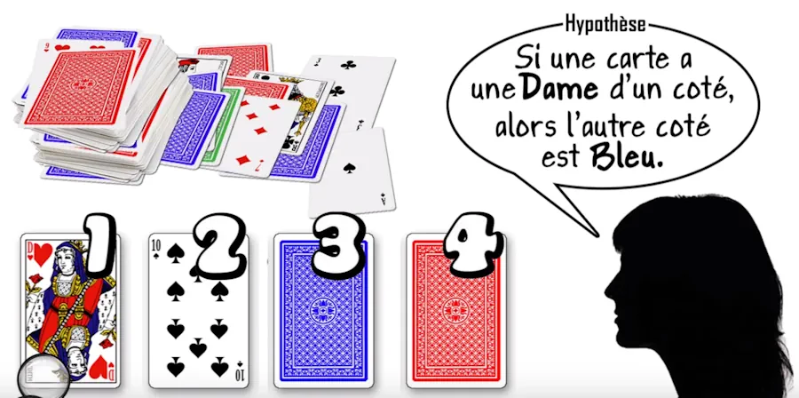

# Implication logique

<!-- Hello \( \alpha = 42 \) la vie est belle (VSCode marche pas, Jekyll marche pas)

Hello $\alpha = 42 $ la vie est belle (VSCode marche , Jekyll marche pas)

Hello $$\alpha = 42 $$ la vie est belle (VSCode marche pas car sur une ligne, Jekyll marche)

To see the $\mathrm{\LaTeX}$ source of the formula, right-click anywhere on it. -->

L'implication logique est une construction moins intuitive que le "et logique" ou le "ou logique". Comme en plus on l'utilise tous les jours à chaque fois que l'on conduit un raisonnement (mathématique, philosophique, business) il n'est peut-être pas inutile de bien préciser les choses. Allez c'est parti.

## Introduction

Une **proposition** est soit vraie, soit fausse mais elle n'est pas les deux à la fois

### Exemples

* Il pleut. C'est une proposition, elle vraie ou fausse mais elle n'est pas les deux à la fois.

* 4x2=[42](https://fr.wikipedia.org/wiki/La_grande_question_sur_la_vie%2C_l%27univers_et_le_reste) est fausse (au moins dans cet univers)

C'est ce que l'on appelle la [logique du **tiers exclu**](https://fr.wikipedia.org/wiki/Principe_du_tiers_exclu) ou encore la **logique Aristotélicienne** (ça, en réunion de famille, quand on arrive à le placer, ça claque).

Pour la petite histoire, une **assertion** représente un énoncé considéré ou présenté comme vrai. En C/C++, par exemple, il y a moyen d'utiliser la macro [assert](http://www.cplusplus.com/reference/cassert/assert/)(hypothèse) dans son code afin de vérifier que telle ou telle hypothèse est vraie avant d'aller plus loin.

Si P et Q sont 2 assertions (2 trucs vrais) alors, par définition, l'assertion "**(Non P) ou Q**" s'appelle l'assertion "$$P \implies Q$$" et on lit "P implique Q".

La proposition $$P \implies Q$$ se lit :

* "P implique Q"

* "si P alors Q"

Dès lors que P est vérifiée ((Non P) est donc fausse), Q doit être vérifiée pour que la règle "(Non P) ou Q" soit vraie. Dit autrement, si P est vérifiée, Q doit être vérifiée pour que la règle "P=>Q" soit respectée.

Je le redis différemment :  
* Je veux que "(Non P) ou Q" soit vraie.  
* Si (Non P) est fausse il faut obligatoirement que Q soit vraie.  
* Q est obligée d'être vraie
* Mais si (Non P) est fausse cela veut dire que P est vraie  

Dans la proposition P => Q on nomme :

* P **l’antécédent**
* Q le **conséquent**

Dans la théorie des ensembles, l'implication se traduit par une inclusion. Le conséquent **contient** l'antécédent. Il faut comprendre que l'antécédent est une version plus précise, plus spécifique, plus spécialisée du conséquent.

### Exemples

P est l'ensemble des jolies filles  
P est inclus dans Q qui est l'ensemble des filles  
Toutes les jolies filles sont des filles  

P est l'ensemble des personnes qui ont plus de 21 ans  
P est inclus dans l'ensemble des gens qui ont plus de 18 ans (Q comprend ceux qui ont plus de 19 ans, 20 ans...)  
Tous ceux qui ont plus de 21 ans ont bien plus de 18 ans  

## La table de vérité de l'implication logique

Voici la **table de vérité** de la proposition $$P \implies Q$$. Deux propositions sont **équivalentes** si elles ont la même table de vérité.

| $$P$$ | $$Q$$ | $$P \implies Q$$ |
| --- | --- | --- |
| V | V | V |
| V | F | F |
| F | V | V |
| F | F | V |

Dans ce qui suit on va s'attarder sur chacun des cas car certains d'entre eux ne sont pas évidents.

## Cas où la proposition P est vraie et où la proposition Q est vraie

Si P la proposition est vraie et si la proposition Q est vraie alors la proposition P => Q est vraie. Si ce n'est pas immédiat, faut peut-être penser à "**(Non P) ou Q**". Si P est vraie, Non P est fausse. Ensuite la proposition "Faux ou Vrai" est vraie.

### Exemple

On dit que la proposition P est vraie lorsque Bob a plus de 21 ans (Bob > 21)
On dit que la proposition Q est vraie lorsque Bob a plus de 18 ans (Bob > 18)
Si Bob > 21 est vraie et si Bob > 18 est vraie aussi alors P => Q est vraie
Autrement dit la proposition "Vrai implique Vrai" est vraie

Avec des ensembles, P est inclus dans Q. Si Bob a plus de 21 ans alors il a plus de 18 ans.

### Condition suffisante

La proposition P (Bob > 21) est une **condition suffisante** mais pas nécessaire pour que la proposition Q (Bob > 18) soit vraie. Pour que Q soit vérifiée il suffit que P le soit. Il suffit que Bob ait plus de 21 ans pour que la proposition Q soit vraie mais bon, c'est encore le cas si Bob a 20 ou 19 ans.

### Condition nécessaire

La proposition Q (Bob > 18) est une **condition nécessaire** mais pas suffisante pour que la proposition P soit vraie. Pour que Bob ait plus de 21 ans, il est nécessaire (mais pas suffisant) que Bob ait plus de 18 ans. Si Bob a 20 ans, alors il a bien plus de 18 ans. Pourtant cela ne suffit pas pour qu'il ait plus 21 ans.

On en revient à ce que l'on avait un peu plus haut : "Dès lors que P est vérifiée, Q doit l'être aussi pour que la règle (P=>Q) soit respectée."

La proposition "Vrai implique Vrai" est vraie.

## Cas où la proposition P est vraie et où la proposition Q est fausse

Si P est respectée (vraie) et que Q ne l'est pas (fausse) alors la proposition P => Q est fausse. En effet, dans notre cas, Bob ne peut pas être, à la fois, plus âgé que 21 ans et plus jeune que 18 ans.

Si on utilise la phrase "Dès lors que P est vérifiée, Q doit l'être aussi pour que la règle (P=>Q) soit respectée". On voit bien que Q n'étant pas vérifiée, P=>Q ne l'est pas non plus.

Autrement dit la proposition "Vrai implique Faux" est fausse.

## Cas où la proposition P est fausse et où la proposition Q est vraie

Si P n'est pas respectée (Bob <=21) et Q est vérifiée (Bob>18) alors la proposition P => Q est vraie. En effet, car tel est le cas si Bob est âgé de 20 ans. On a bien Bob <=21. La proposition P (Bob > 21) est fausse. Cela dit on a aussi Bob > 18 ce qui veut dire que Q est vraie. La proposition P => Q est donc bien vérifiée.

La proposition "Faux implique vrai" est vraie

En fait, on rencontre peu ce cas car on part généralement d'hypothèses qui sont vraies.

## Cas où la proposition P est fausse et Q où la proposition est fausse

Si P fausse ( Bob <= 21) et Q fausse (Bob <= 18) alors P => Q est vrai. En effet, la proposition Bob <= 21 => Bob <= 18 est vraie si Bob a 15 ans par exemple.

Là aussi, on ne l'utilise pas ou peu car on part d'hypothèses vraies.

Donc la proposition "Faux implique faux" est vraie

## Ce qu'il faut retenir à ce stade

Le seul cas ou P=>Q est fausse c'est lorsque P est vraie et que Q est fausse.

## La contraposée

La **contraposée** c'est la proposition : $$!Q \implies !P$$
Ici !Q se lit "non Q" ou "Q est fausse". Les 2 propositions ont la même table de vérité. (Bob>21 => Bob>18) est donc équivalent à (Bob<= 18 => Bob <=21).

C'est utile car il est parfois plus facile de démontrer la contraposée que la proposition initiale.

### Exemples

1. $ x=3 \implies x^2=9 $ est une proposition vraie. Sa contraposée est $ x^2 \neq 9 \implies x \neq 3 $.
1. Le théorème de Pythagore. "Si ABC est un triangle rectangle en A alors $ BC^2 = AB^2 + AC^2 $ ». Sa contraposée est : "Si $ BC^2 \neq AB^2 + AC^2 $ alors ABC n’est pas un triangle rectangle en A".
1. Pour démontrer que pour tout entier naturel n, si n² est pair, alors n est pair on préfère démontrer la contraposée qui est "Pour tout entier naturel n, si n est impair, alors n² est impair".

### Ne pas confondre contraposée et réciproque

Si $$P \implies Q$$ est la proposition initiale, la **réciproque** c'est la proposition : $$Q \implies P$$
C'est pas parce que la proposition $$P \implies Q$$ est vraie que sa réciproque est vraie

### Exemples

1. "Si il pleut alors le sol est mouillé". C'est vrai mais cela ne veut pas dire que "Si le sol est mouillé alors il pleut". En effet, j'ai pu arroser le sol.
1. "Si je vais en boîte, je vais pêcho". C'est sans doute vrai (enfin faut voir sur place) mais en tout cas cela ne veut pas dire "J'ai pêcho donc je suis en boîte". En effet, je peux tout à fait pêcho au Super U au coin de la rue.
1. De même si on a Bob>21 => Bob>18 cela ne veut pas dire que Bob>18 => Bob>21

## La négation de l'implication

$$\neg (P \implies Q) \iff \neg (\neg P \lor Q) \iff P \land \neg Q $$

## Une autre façon de voir l'implication

P => Q est équivalent à ((Non P) ou Q). On peut le vérifier avec une table de vérité (voir ci-dessous). En reprenant la définition "(Non P) ou Q", on voit que cette proposition est vraie lorsque la proposition (non P) ou la proposition Q est vraie. En effet la proposition "A ou B" est vraie si et seulement si A est vraie ou si B est vraie.

Table de vérité de la proposition (Non P) ou Q

| $$P$$ | $$Q$$ | $$P \implies Q$$ | $$\neg P$$ | $$\neg P \lor Q$$ |
| --- | --- | --- | --- | --- |
| V | V | V | F | V |
| V | F | F | F | F |
| F | V | V | V | V |
| F | F | V | V | V |

Pour que la proposition ($$\neg P \lor Q$$) soit vraie il suffit

* Que l'un des deux au moins soit vrai

* Que $$\neg P$$ soit vraie, que $$Q$$ soit vraie ou que les 2 soient vraies

* Que $$P$$ soit fausse, que $$Q$$ soit vraie ou que les les 2 soient vraies

Comme pour la contraposée, il est parfois plus facile de démontrer ($$\neg P \lor Q$$) plutôt que $$P \implies Q$$

## Mise en application

Le test est le suivant. Certains font l'hypothèse que les Dames ont un dos bleu. On nous présente 4 cartes (voir ci-dessous). Quelles sont les cartes qu'il faut retourner pour vérifier l'hypothèse ?

Ayé, vous avez fait votre choix ? Pas besoin d'un coup de fil et d'en appeler au public ? Très bien, on va voir si vous faites partie des 4% qui ont trouvé la bonne réponse.

La réponse se trouve dans cette [vidéo](https://youtu.be/1c1jZQ9Bkq0?t=2m2s)

Oh, by the way... Abonnez-vous à la chaîne [Hygiène Mentale](https://www.youtube.com/channel/UCMFcMhePnH4onVHt2-ItPZw).

Compte tenu de ce que nous avons vu à propos de l'implication logique, le choix des cartes à retourner s'explique de la façon suivante :

2. "Les Dames ont un dos bleu" c'est l'implication de départ, notre P => Q, notre "Si Dame alors Bleu". Compte tenu de ce que vous avez lu, vous savez qu'il y a uniquement 2 façons de vérifier l'hypothèse.

6. Vérifier l'hypothèse en retournant la Dame et on s'attend à voir un dos bleu.

10. Vérifier la contraposée !Q =>!P. Autrement dit vérifier !Bleu => !Dame. Comme il n'y a que 2 couleurs de dos ici cela revient à vérifier Rouge => !Dame. Il faut donc retourner aussi la quatrième carte.

## Conclusion

* **(Non P) ou Q** s'appelle la proposition **P => Q** et se lit P implique Q

* Dès lors que P est vérifiée, Q doit être aussi vérifiée pour que la règle (P=>Q) soit respectée.

* Le seul cas où P => Q est fausse c'est lorsque P est vraie et Q est fausse

* L'antécédent P est inclus dans le précédent Q (pensez aux filles et aux jolies filles)

* La **contraposée** c'est la proposition : !Q => !P. Parfois plus facile à démontrer que l'implication.

* La **réciproque** c'est la proposition : Q => P. Ne pas la confondre avec la contraposée

* Il est parfois plus facile de démontrer Non P ou Q

Pour aller plus loin on pourra lire "[The book of proof](https://www.people.vcu.edu/~rhammack/BookOfProof/BookOfProof.pdf)" ou passer quelques minutes/heures sur [Youtube](https://www.youtube.com).

