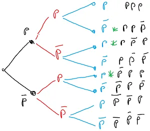
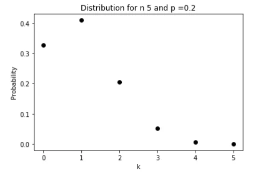
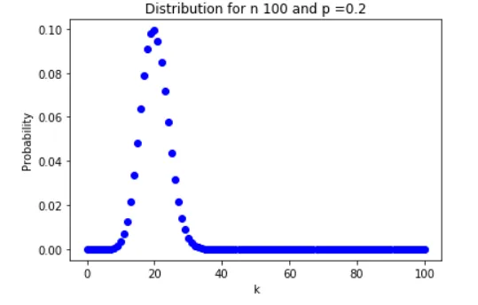

# Loi binomiale

## Introduction
La formule s'écrit de la façon suivante :

$$P(X=k) = \binom{n}{k} p^k (1-p)^{n-k}$$

Un peu indigeste vue comme ça, non? De plus, dans quels cas l'utiliser? Comment la comprendre? Comment s'en rappeler le cas échéant? Bon, allez, on va remettre tout ça dans l'ordre en partant de zéro ou presque. 

La loi binomiale modélise le nombre de **succès** obtenus lors de la **répétition indépendante** de plusieurs **expériences aléatoires identiques**. Attention tous les mots sont importants...

### Succès
On parle de succès car l'expérience ne peut avoir que deux issues. Succès ou échec. 

#### Exemples : 
1. Je suis plus grand ou plus petit que la toise qui permet d’accéder à Star Tours. 
2. La boule tirée de l'urne est verte ou elle n'est pas verte. 
3. L'éleve est une fille ou n'est pas une fille (ça peut être un Troll, un Nain, un Gobelin... mais en tout cas c'est pas une fille)

### Répétitions indépendantes 
Cela signifie qu'une expérience n'influe pas sur les exériences suivantes.

#### Exemples :
1. Je tire une boule d'une urne qui contient 20 boules (rouge et bleue). Si elle est rouge c'est un succès. Après avoir vérifié sa couleur je ne la remet **pas** dans l'une. Dans ce cas, on ne peut pas appliquer la loi binomiale car si on ne remet pas la boule rouge alors la probabilité de tirer une seconde boule rouge varie. En effet, si au départ il y a 10 rouges et 10 bleues alors la probabilité de tirer une rouge est de 50%. Je tire une rouge et je ne la remet pas. Maintenant la probabilité de tirer seconde boule rouge est $$\frac{9}{19}$$. En effet, il ne reste plus que 9 boules rouges et un total de 19 boules. Il faut aussi noter que si la probabilité de tirer une boule bleue était au départ de 50% au premier tirage, au second elle vaut $$\frac{10}{19}$$ car une boule rouge a été tirée au premier tirage. Bref, le fait de ne **pas** remettre la boule influence les tirages suivants. On ne peut donc pas utiliser la loi binomiale dans ce cas. 

2. À la sortie de la ligne de production, à la fin de la journée, on a produit un million de billes rouge et bleu. Je tire successivement 20 billes et je ne les remet pas dans le circuit. On considèrera dans ce cas que les tirages sont indépendants car 20 billes par rapport à un million c'est négligeable. On considère que la probabilité de tirer une bille rouge reste la même. Bref, on pourra dire que, dans ce cas, les expériences sont indépendantes et on pourra utiliser la loi binomiale.

3. Toujours et encore avec une urne... Il y a 20 billes, 10 bleues et 10 rouges. Je tire une boule, je regarde sa couleur et je la remet dans l'urne. Là, comme la probabilité de tirer une rouge est toujours la même quelque soit l'indice du tirage (premier tirage, second tirage ...) on est vraiment dans un cas d'expériences indépendantes les unes des autres. On peut, sans crainte, utiliser la loi binomiale.

### Expériences aléatoires identiques
Là, ça ne casse pas trois pattes à un canard... Cela veut simplement dire qu'on fait à chaque fois la même chose. Sinon on peut ajouter que chaque expérience est appelée "épreuve de Bernoulli". Ca claque quand on le dit en société mais bon... Ca fait pas vraiment avancer notre problème...

#### Exemples :
1. On tire toujours une bille à la fois
2. On ne s'amuse pas à tirer une boule, puis 3 boules le coup d'après etc.

## Un exemple typique
En bout de chaine de production de l'usine où je travaille, dans un lot de 1000 processeurs, j'en prends 5 et je les teste. En fonction de leur performance ils peuvent fonctionner (ou pas) au delà de 5 Ghz. Sachant qu'en général 20% des processeurs fonctionnent au delà de 5 GHz quelle est la probablilté d'avoir 3 processeurs qui fonctionnnent au delà de 5 Ghz parmi les 5 que je viens de tirer?

#### Remarque :
La question, posée de cette façon n'a aucun intérêt. On s'en fout. On sait qu'en général on a 20% des processeurs qui passent la barre des 5 GHz. 
Quid maintenant du scénario suivant... Un stagiaire chevelu et boutonneux à souhait viens de faire des tests. Il entre en trombe dans mon bureau et m'annonce tout essouflé : "Formidable, 60% de la production est dorénavant au delà de la barre des 5 Ghz. Compte tenu du fait qu'on vend beaucoup plus cher ce type de processeur on va faire exploser la marge cette année!". C'est exactement les mêmes chiffres. Rien n'a changé... Alors, qu'est-ce que je fais? Je vais m'acheter une Testarossa ou je lui demande de me payer un café pour qu'on prenne le temps de gentiment parler de statistiques... Je vous laisse réfléchir là dessus, on en reparlera à la fin de la page.

Les processeurs testés fonctionnent (ou pas) au delà de 5GHz. C'est binaire. Ca passe ou ça ne passe pas. Je ne prends que 5 processeurs sur 1000. C'est tout à fait négligeable. Les probabilités ne sont pas impactées significativement. Je peux donc appliquer la loi binomiale.

Essayons de nous représenter la scène :
* Je tire un premier processeur. Il passe ou il ne pas pas le test. Imaginons qu'il le passe.
* Je prends un second processeur. Supposons qu'il passe le test.
* Je tire un troisième processeur. Supposons qu'il passe le test.
* Je tire un quatrième processeur. Supposons qu'il ne passe PAS le test.
* Je tire un cinquième et dernier processeur. Supposons qu'il ne passe PAS non plus le test.

On est pile poil dans le cas demandé. On a tiré 5 processeurs et 3 passent le test à 5 GHz. Maintenant calculons la probabilité de ce tirage en particulier. Quitte à être bien lourd voilà ce qui c'est passé : On a tiré un processeur qui passe et un autre qui passe et un dernier qui passe et un qui passe pas et enfin un dernier qui passe passe le test.

La probabilité de cette configuration particulière est donc :
$$ P(\textrm{passe}) * P(\textrm{passe}) * P(\textrm{passe}) * P(\textrm{passe pas}) * P(\textrm{passe pas})$$

Ce qui peut encore s'écrire de la façon suivante : 
$$ P(\textrm{passe})^3 * P(\textrm{passe pas})^2 $$

Si ce n'est pas clair, imaginez un arbre binaire. Si le processeur passe le test je prend la branche du haut et si il ne passe pas le test je prends la branche du bas. Au bout de la  branche, "passe, passe, passe, passe pas, passe pas " la probabilité d'apparition est bien $$ P(\textrm{passe})^3 * P(\textrm{passe pas})^2 $$

Si cela n'est toujours pas clair, dessinons carrément un arbre binaire (voir un peu plus bas). Pour "simplifier" on va imaginer que l'on ne fait que 3 tirages et que dans ces tirages on s'interresse à ceux qui comportent 2 processeurs qui passent le test. Si on "s'amuse" à lister tous les tirages possibles on remarque qu'il y a plusieurs tirages qui comportent 2 processeurs qui passent le test et un processeur qui ne passe pas le test. Ci-dessous j'ai pris soin de mettre des asterisques vertes pour identifier les tirages en question. On va en reparler un peu plus loin. Ce qu'il faut bien garder en tête ici c'est qu'il y a plusieurs façon d'avoir un tirage qui comporte 2 processeurs qui passent le test. 

Quoiqu'il en soit, pour l'un quelconque de ces tirages, sa probabilité d'apparaition s'écrit sous la forme $$ P(\textrm{passe})^2 * P(\textrm{passe pas})^1 $$ et ce, que le processeur qui ne passe pas le test soit le premier, le second ou le dernier. 

[comment]: <> (Faut penser à enlever les parenthèses autour du commentaire)
[comment]: <> ()

<!--  -->
<div align="center">

</div>


C'est exactement la même chose quand on tire 5 processeurs dont trois passent le test. L'arbre serait tout simplement beaucoup plus large. 

Avançons d'un cran. On nous a dit qu'en général seuls 20% des processeurs passent le test. Cela veut dire que $$P(\textrm{passe}) = 0.2$$ et que $$P(\textrm{passe pas}) = 0.8$$. 

La probabilité d'obtenir une configuration dans laquelle 3 processeurs passent le test et 2 ne le passent pas est donc : 
$$ 0.2^3 * 0.8^2$$

**Attention** : Tout cela est juste mais cette configuration est une configuration particulière. En effet, il existe différentes façons d'avoir 3 processeurs qui, parmi 5, passent le test. Si besoin, il suffit de se reporter à l'image de l'arbre précédente pour constater qu'il y a par exemple 3 façons d'obtenir un tirage de 3 processeurs dont deux passent le test (voir les asterisques). 

Dans le cas précédent on a dit que c'était les processeurs tirés en premier, second et troisième qui passaient le test. 

Ceci dit, cela aurait pu être les processeurs tirés en premier, en second et en cinquième. Dans ce second cas on a encore 3 processeurs qui passent le test et 2 qui ne le passent pas. La probabilité de cette configuration serait exactement la même ($$ 0.2^3 * 0.8^2$$).

Bref, il faut que l'on détermine le nombre de façons différentes d'avoir 3 processeurs parmi 5 qui passent le test. Quand ce sera fait il faudra multiplier le résultat précédent ($$ 0.2^3 * 0.8^2$$) par ce nombre.  

Allez c'est parti :

* Au départ je peux décider que le premier processeur qui va passer le test sera tiré en premier, second... cinquième. J'ai donc 5 choix possibles. 
* L'indice du premier processeur étant fixé, pour le second processeurs qui va passer le test je n'ai plus que 4 choix possibles.
* Pour le troisième et dernier processeur qui va passer le test je n'ai plus que 3 choix possibles

Autrement dit :

$$ \text{Nombre tirages possibles} = 5 * 4 * 3 $$

On peut encore écrire cela sous la forme :

$$ \text{Nombre tirages possibles} = \frac{5 * 4 * 3 * 2 * 1}{2 * 1} $$

Ce qui permet de faire ressortir les données du problème (tirage de 5 processeurs dont 3 passent le test) :

$$ \text{Nombre tirages possibles} = \frac{5!}{(5-3)!} $$

**Re attention** : Pas si vite l'ami... Les processeurs sont tous identiques. Autrement dit si je suis dans la configuration où les 3 premiers processeurs passent le test et où les 2 derniers ne le passent pas je peux schématiser la chose de la manière suivante : 

$$ \text{+ + + - -} $$

Maintenant, qu'est ce qui se passe si on interverti le premier et le second signe '+'? Ben, ça change rien! On a toujours 3 signes '+' puis 2 signes '-'. Cela veut donc dire que dans la formule précédente on compte des choses en double. En effet, de toutes les configurations où les 3 premiers processeurs passent le test il ne faut en retenir qu'une seule. Et on fait ça comment? Il suffit de diviser le résultat précédent par le nombre de façons de mélanger 3 éléments indiscernables. 

Pour calculer le nombre de mélanges avec 3 éléments, on va utiliser le raisonnement que l'on a déjà mis en oeuvre précédement. En effet, on peut se dire que pour le premier processeur il y a 3 emplacements possibles. Que pour le second il n'en reste plus que 2 et que pour le troisième et dernier il ne reste plus qu'un seul emplacement. 

Autrement dit, au total, il y a $$3 * 2 *1$$ façons de mélanger trois processeurs. Au final, il faut donc diviser le résultat précédent par $$3!$$. Finalement on arrive à : 

$$ \text{Nombre tirages possibles} = \frac{5!}{3! * (5-3)!} $$

Ca, par définition, c'est $$\binom{5}{3}$$

De manière générale quand on choisi $$k$$ objets parmi $$n$$ le nombre de tirages possibiles s'écrit $$\binom{n}{k}$$

Pour finir, la probabilité d'avoir 3 processeurs parmi 5 qui passent le test s'écrit donc :

$$\binom{5}{3} 0.2^3 * 0.8^2$$

Ce qui, selon les règles de l'art s'écrit de la façon suivante :

$$P(X=3) = \binom{5}{3} 0.2^3 * 0.8^2$$

Où $$X$$ est une variable aléatoire (autrement dit un compteur de succès).

De manière générale on écrit :

$$P(X=k) = \binom{n}{k} p^k * (1-p)^{n-k} $$

## Problème
Oui mais t'es mignon, je comprends bien les explications quand je les lis mais honnêtement je ne suis pas fichu de ré-écrire la formule. Comment je dois faire pour m'en sortir? 

Bon, à ce stade, si vous êtes prof de maths "fuyez pauvres fous" (à dire à la façon de Gandalf) car si vous n'avez pas aimé le début vous allez détester la suite...

Bon... Mon petit Padawan, on va commencer par retrouver les éléments dont on a besoin pour écrire la formule. Il faut retrouver :
1. n le nombre total d'éléments du tirage (5 dans le cas précédent)
2. p la probabilité du succès (20% des processeurs passent le test à 5 Ghz)
2. k le nombre d'éléments qui, parmi les n éléments tirés, passent le test (3 dans l'exemple précédents)

**Attention** : Dans un énnoncé si on dit que 75% des étudiants échouent au test cela veut dire que 25% le passent avec succès. De même si c'est pas une fille c'est un garçon... Enfin bref, il faut bien lire et bien comprendre les subtilités de certains ennoncés.

Maintenant voilà, à "haute voix", la façon dont j'écris la formule.

1. Je cherche la probabilité pour que mon compteur $$X$$ prenne la valeur $$k$$. J'écris $$P(X=k) =$$
2. Dans le tirage il y a $$k$$ éléments qui passent le test avec succès. La probabilité de succès est $$p$$. Je devrais écrire $$p*p*p*...p$$, $$k$$ fois. Comme je suis malin j'écris $$p^k$$. À ce stade la formule s'écrit : $$P(X=k) = p^k$$
3. Dans le tirage il y a un total de $$n$$ éléments. J'en ai déjà pris $$k$$ en compte. Je dois maintenant tenir compte des $$n-k$$ éléments qui restent. Si la probablité de succès est $$p$$ cela veut dire que la probabilité d'échec est $$(1-p)$$. Bon, ben au final je dois tirer $$n-k$$ éléments avec, à chaque fois, une probabilité de $$(1-p)$$. Je devrais écrire $$(1-p) * (1-p) * (1-p) ... (1-p)$$ , $$(n-k)$$ fois. Comme je suis malin j'écris $$(1-p)^{n-k}$$. À ce stade la formule s'écrit :$$P(X=k) = p^k (1-p)^{n-k}$$
4. Parmis les $$n$$ emplacements que propose un tirage comment je peux classer $$k$$ éléments? En fait c'est $$n * (n-1) * (n-2) * ... * (n-k)$$. Ce qui s'écrit $$\frac{n!}{(n-k)!}$$ 
5. Ceci dit les éléments sont indicernables. Je dois donc éliminer les configurations en doublon. Je divise encore par $$k!$$. À ce stade la formule s'écrit :$$P(X=k) = \frac{n!}{k! * (n-k)!} p^k (1-p)^{n-k}$$
6. $$P(X=k) = \binom{n}{k} p^k * (1-p)^{n-k} $$

## Testarossa ou café?
Faisons le calcul. Il faut évaluer $$\binom{5}{3} 0.2^3 * 0.8^2$$. Le bout de code Python ci-dessous répond à la question.

```python
import math

# Emulate the nCr function available on scientific calculators
def nCr(n,r):
    f = math.factorial
    return f(n) / f(r) / f(n-r)

n = 5
k = 3
p = 0.2
print (nCr(n, k) * (p)**k * (1-p)**(n-k))

=> 0.05120000000000002
```

Il y a donc 5% de chance pour que cette configuration se présente. De là à dire que 60% de la production passe la barre des 5 GHz il y a peut être un excès d'enthousiasme. Bon... On va aller prendre un café et réviser la loi binomiale avec le stagiaire.


## Amusons nous deux minutes
On vient de calculer la probabilité pour que dans un lot de 5 processeurs, 3 d'entre eux passent la barre des 5 GHz alors que normalement c'est 20%. On peut se demander quelle est la probabilité pour que dans le même lot 2 d'entre eux passent le test. Idem pour 1 seul processeur etc.

Le script ci-dessous permet de répondre à toutes ces questions :

```python
import matplotlib.pyplot as plt
import scipy.stats  as stats
n = 5
p = 0.2

# There are n+1 possible number of "successes" from 0 to n
x = range(n+1)
y = stats.binom.pmf(x, n, p)

plt.plot(x, y, "o", color="black")

# Format the x and y axis
plt.title("Distribution for n {0} and p ={1}".format(n,p))
plt.xlabel("k")
plt.ylabel("Probability")
plt.draw()
```

<div align="center">

</div>

On retrouve bien que la probabilité pour que 3 processeurs passent le test est aux alentours de 0.05 soit 5%. De manière "logique" c'est le cas où un seul processeur passe le test qui est le plus probable. En effet, 20% de 5 c'est bien 1. De manière surprenante on remarque la probabilité qu'aucun processeur ne passe le test est bien plus importante que la probabilité où 2 processeurs passent le test.

Bon, allez, on passe la seconde et on imagine que la loi binomiale peut toujours s'appliquer si on fait un échantillon de 100 processeurs.

Dans le script ci-dessous il suffit de remplacer n=5 par n=100.

```python
n = 100
p = 0.2

# There are n+1 possible number of "successes" from 0 to n
x = range(n+1)
y = stats.binom.pmf(x, n, p)

plt.plot(x, y, "o", color="blue")

# Format the x and y axis
plt.title("Distribution for n {0} and p ={1}".format(n,p))
plt.xlabel("k")
plt.ylabel("Probability")
plt.draw()
```

<div align="center">

</div>

Il n'y a pas de surprise. On voit bien que c'est dans le cas où $k=20$ qu'on a la probabilité la plus importante. C'est une autre façon d'illustrer le fait que l'espérance de la loi binomiale c'est $np$ ($$E(X) = np$$).

Appliqué ici on a bien $$E(X) = 100*0.2 = 20$$

Ensuite la distribution est bien symétrique par rapport à l'axe $$k=20$$. Autrement dit, il y a autant de chances pour que sur un lot de 100 processeurs 15 ou 25 d'entre eux passent le test de 5 GHz.


