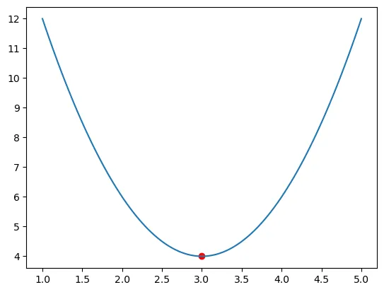

# Equation canonique

<div align="center">

</div>


## Introduction
C'est moyennement intéressant car cela ne concerne que les polynômes de degré 2. T'as vu, ça donne vraiement envie de lire la suite...

On veut écrire $$f(x)=ax^2+bx+c$$ sous la forme $$a(x-\alpha)^2 + \beta$$ 

C'est ça la forme canonique.

*Heu... Pourquoi? J'veux dire, pourquoi tu veux me prendre la tête avec la forme canonique d'un pauv' polynôme de d°2?*

En fait on va en reparler à la fin mais ce que tu dois retenir ici c'est que si j'ai la forme canonique du polynôme alors je sais :
1. Comment la courbe est orientée (branches en l'air ou en bas)
1. À quelle valeur de $$x$$ se trouve son sommet (respectivement son creux)
1. À quelle hauteur ($$y$$) se trouve le sommet en question

Bref, l'expression canonique (sous réserve qu'elle soit pas trop prise de tête à déterminer) permet, sans graphique, de savoir à quoi ressemble la courbe.


## Calcul de $$\alpha$$ et $$\beta$$
On commence en posant l'égalité

$$ ax^2+bx+c = a(x-\alpha)^2 + \beta $$

$$ ax^2+bx+c = a (x^2 - 2 x \alpha + \alpha^2) + \beta$$


$$ ax^2+bx+c = ax^2 - 2ax\alpha + a \alpha^2 + \beta$$

On égalise membre à membre. En français dans le texte cela veut dire que les facteurs de $$x^2$$ sont égaux entre eux, idem pour les facteurs de $$x$$ ainsi que les constantes. On se retrouve avec 3 égalités :

$$ a = a$$
$$ b = -2a\alpha$$
$$ c = a \alpha^2 + \beta$$

De la seconde égalité on tire :
$$ \alpha = - \frac{b}{2a}$$

Avec la troisième égalité on obtient :
$$ \beta = c - a \alpha^2 $$

Or, on vient de trouver que :
$$ \alpha = - \frac{b}{2a}$$

Donc
$$ \beta = c - a \alpha^2 $$
$$ \beta = c - a (- \frac{b}{2a})^2 $$

$$ \beta = c - a  \frac{b^2}{4a^2}$$
$$ \beta = c - \frac{b^2}{4a}$$
$$ \beta = \frac{4ac}{4a} - \frac{b^2}{4a}$$
$$ \beta = \frac{4ac - b^2}{4a}$$
$$ \beta = -\frac{b^2 - 4ac}{4a}$$
$$ \beta = -\frac{\Delta}{4a}$$

Mouai...À ce stade on peut donc dire que :

$$ ax^2+bx+c = a(x-\alpha^2) + \beta $$

Avec 
$$ \alpha = - \frac{b}{2a}$$
Et 
$$ \beta = -\frac{\Delta}{4a}$$

### Calculons f($$\alpha$$)

$$ f(x)=ax^2+bx+c $$

Donc 

$$ f(\alpha)=a\alpha^2+b\alpha+c $$

Or

$$ \alpha = - \frac{b}{2a}$$

On a donc :

$$ f(\alpha)=a(- \frac{b}{2a})^2 + b(- \frac{b}{2a}) + c $$
$$ f(\alpha)=a(\frac{b^2}{4a^2}) - (\frac{b^2}{2a}) + c $$
$$ f(\alpha)=\frac{b^2}{4a} - \frac{2b^2}{4a} + c $$
$$ f(\alpha)=\frac{b^2}{4a} - \frac{2b^2}{4a} + \frac{4ac}{4a} $$
$$ f(\alpha)=\frac{b^2 - 2b^2 + 4ac}{4a} $$
$$ f(\alpha)=\frac{- b^2 + 4ac}{4a} $$
$$ f(\alpha)= - \frac{b^2 - 4ac}{4a} $$
$$ f(\alpha)= - \frac{\Delta}{4a} $$

Donc $$\beta = f(\alpha)$$ 

Dorénavant on peut dire :

$$ ax^2+bx+c = a(x-\alpha)^2 + \beta $$

Avec 
$$ \alpha = - \frac{b}{2a}$$
Et 
$$ \beta = f(\alpha)$$

## Mise en pratique pour montrer que c'est vraiment utile et facile
On se donne $$f(x) = 2x^2 -12x + 22$$

Exprimez $$f(x)$$ sous sa forme canonique

Fastoche! On commence avec $$\alpha$$ 
$$\alpha = - \frac{b}{2a} = - \frac{-12}{4} = 3$$ 

Ensuite on trouve $$\beta$$
$$ \beta = f(\alpha) = 2\alpha^2 -12\alpha + 22 = 2 * 3^2 - 12 * 3 + 22 = 18 - 36 + 22 = 4$$

Donc sous sa forme canonique on a :

$$f(x) = a(x-\alpha^2) + \beta $$
$$f(x) = 2(x-3)^2 + 4 $$

Une fois écrit sous cette forme on peut dire que :
* La parabole est convexe. Ses branches sont en l'air
* Son minimum arrive que $$x = \beta = 3$$
* Que la valeur de $$f(x)$$ en ce point $$4$$   

C'est bien ce que l'on retrouve si on trace la courbe.

```python
# Pas la peine de lire ces lignes
# Ce qui compte c'est le graphe qui suit

def f(x) :
  return 2*(x-3)**2 + 4

fig, ax = plt.subplots()
x = np.linspace (1, 5, 100)
ax.plot(x, f(x))
_ = ax.scatter(3, 4, c='red')
```


<div align="center">

</div>


## Une autre façon de raisonner

On veut toujours écrire $$f(x)=ax^2+bx+c$$ sous la forme $$a(x-\alpha)^2 + \beta$$ 

Pour y arriver, on va écrire le début de $$f(x)$$ comme une identité remarquable.

$$f(x)=ax^2 + bx + c$$
$$f(x)=a(x^2+x \frac{b}{a}) + c$$

Là, la ruse consiste à dire que ce qu'il y a dans la parenthèse ressemble au début d'une identité remarquable. Un truc du style :

$$( A + B)^2 = (A^2 + 2AB +B^2)$$

OK... Dans la parenthèse on a :

$$ x^2 + x \frac{b}{a} $$

Et ça, c'est censé ressembler au début de $$(A^2 + 2AB + ...)$$

Développons $$(x + \frac{b}{2a})^2$$. Il faut bien voir le $$2$$ au dénominateur.

$$ (x + \frac{b}{2a})^2 = x^2 + 2 * x * \frac{b}{2a} + (\frac{b}{2a})^2 $$
$$ (x + \frac{b}{2a})^2 = x^2 + x * \frac{b}{a} + (\frac{b}{2a})^2 $$

On reconnait, à droite de l'égalité le début de notre écriture de $$f(x)$$. On avait : 

$$f(x)=a(x^2+x \frac{b}{a}) + c$$

Et ici on peut dire que : 
$$ (x + \frac{b}{2a})^2 - (\frac{b}{2a})^2 = x^2 + x * \frac{b}{a}  $$

Si on remplace dans l'expression de $$f(x)$$ on a : 

$$f(x)=a(x^2 + x \frac{b}{a}) + c$$

$$f(x)=a((x + \frac{b}{2a})^2 - (\frac{b}{2a})^2) + c$$

$$f(x) = a((x + \frac{b}{2a})^2 - \frac{b^2}{4a^2}) + c $$
$$f(x) = a (x + \frac{b}{2a})^2 - a \frac{b^2}{4a^2} + c $$
$$f(x) = a (x + \frac{b}{2a})^2 - \frac{b^2}{4a} + c $$
$$f(x) = a (x + \frac{b}{2a})^2 - \frac{b^2}{4a} + \frac{4ac}{4a} $$
$$f(x) = a (x + \frac{b}{2a})^2 + \frac{4ac - b^2}{4a} $$
$$f(x) = a (x + \frac{b}{2a})^2 + \frac{\Delta}{4a} $$

On retrouve bien ce que nous avions précédement : 
$$ ax^2+bx+c = a(x-\alpha)^2 + \beta $$

Avec 
$$ \alpha = - \frac{b}{2a}$$
Et 
$$ \beta = \frac{\Delta}{4a} = f(\alpha)$$


## À retenir
1. $$ ax^2+bx+c = a(x-\alpha)^2 + \beta $$
1. $$\alpha = - \frac{b}{2a}$$
1. $$ \beta = f(\alpha)$$
1. $$\alpha$$ est la valeur de $$x$$ où se trouve l'extremum
1. La valeur de la fonction à cet endroit c'est $$f(\alpha)$$ c'est à dire $$\beta$$
1. Refaire l'application numérique précédente. Il faut se rappeler que $$\alpha = - \frac{b}{2a}$$ puis calculer $$f(\alpha)$$ pour trouver $$\beta$$