# From Derivatives to Action: How Physics Describes Change
{: .no_toc }

Building intuition from local laws, differential equations, and variational principles
{: .lead }


<!-- <h2 align="center">
<span style="color:orange"><b> 🚧 This post is under construction 🚧</b></span>
</h2> -->


<!-- ###################################################################### -->
<!-- ###################################################################### -->
<!-- ###################################################################### -->
## TL;DR
{: .no_toc }

**Why derivatives and differential equations?**
* First-order derivatives represent "state change" (velocity/flow)
* Second-order derivatives represent "interaction/response" (acceleration/force/curvature)
* Physics laws are local: what happens here depends on nearby values. This leads naturally to derivatives
* Most fundamental laws are second-order because systems have inertia (they "remember" their velocity)

**Why the same equations everywhere?**
* Heat, waves, and quantum mechanics all share the structure: time evolution = spatial curvature
* The Laplacian $$\nabla^2$$ measures how a point differs from its neighbors
* Locality + symmetry + conservation laws always produce the same mathematical ingredients

**From local to global: variational principles**
* Differential equations describe physics locally (step by step in time)
* Variational principles describe physics globally (the entire trajectory at once)
* Both are equivalent -- two languages for the same physics

**The principle of stationary action**
* Action $$S$$ is a score
* Action $$S = \int_{t_1}^{t_2} L(x,\dot x,t)\,dt$$
* Lagrangian $$L = T - V$$ (kinetic minus potential energy)
* The real trajectory is the one that makes $$\delta S = 0$$
* From this single principle: Newton's laws, Maxwell's equations, quantum mechanics, general relativity
* Noether's theorem: every symmetry of the action gives a conservation law (time $$\rightarrow$$ energy, space $$\rightarrow$$ momentum, rotation $$\rightarrow$$ angular momentum)

**The quantum connection**
* In quantum mechanics, a particle explores all possible paths
* Each path contributes with amplitude $$e^{iS/\hbar}$$
* The classical trajectory is the one where paths interfere constructively: the action is stationary


<figure style="max-width: 900px; margin: auto; text-align: center;">

<figcaption>Among infinitely many possible trajectories, nature selects the one that extremizes the action.</figcaption>
</figure>


<!-- ###################################################################### -->
<!-- ###################################################################### -->
<!-- ###################################################################### -->
## Table of Contents
{: .no_toc .text-delta}
- TOC
{:toc}


> *Space: the final frontier.*
>
> *These are the voyages of a curious mind, on a lifelong quest to decode the deep architecture of reality.*
>
> *Its ongoing mission: to explore why the laws of physics are written in the language of change... to uncover how motion itself is governed by the beauty of variation... and to trace the hidden principle that dictates every path through the cosmos.*
>
> *To look beyond equations as mere symbols, to see in them the signature of a deeper order... where, among all possible worlds, nature chooses the one that speaks of balance.*

<figure style="max-width: 450px; margin-left: auto; margin-right: 0; text-align: center;">

<figcaption>Space: the final frontier.</figcaption>
</figure>


<!-- ###################################################################### -->
<!-- ###################################################################### -->
<!-- ###################################################################### -->
## Introduction

March 2026. We’re driving back from a ski trip. It’s past midnight. The highway is almost empty. Everyone else in the car is asleep. It's like when you try to meditate and think about nothing... And your brain does the exact opposite (it is not the first time [it happens]()). Mine starts wandering. From one idea to another, without any clear direction... until it lands on a surprisingly stubborn question:

> *Why does physics use so many first- and second-order derivatives?*

Don’t ask me how I got there. But once the question is in your head, it doesn’t really leave. We read things like $$ \frac{dx}{dt}, \quad \frac{d^2x}{dt^2} $$ all the time. Velocity, acceleration, waves, heat, electromagnetism... it’s everywhere. And sure, I "know" (more or less) what these formulas really mean... But a different question starts to emerge:

> *Why does nature seem to "think" in derivatives?*
> *Why first order here, second order there... and almost never more?*

There must be a reason... So in this post, I propose we take a step back and try to build some intuition. We’ll start with what we already know:

* What first and second derivatives really represent,
* Why differential equations naturally appear in physics,
* And why second-order equations are so common.

Then we’ll take a turn. Instead of describing motion step by step, we’ll discover a completely different perspective: variational principles.

And in particular, one idea that sits at the heart of modern physics:

> *Among all possible paths, nature selects the one that makes something... stationary.*

This is the principle of stationary action (aka principle of least action).

It might sound abstract at first, but it turns out to be one of the most powerful ways to describe our world. From classical mechanics to quantum physics, it’s the same underlying idea showing up again and again.

This post is written with high school seniors (though some sections may still be challenging) and first-year university students in mind. Whenever necessary, we’ll slow down and revisit key tools (e.g., integration by parts) or add some "Side Note".

There are also a few Python snippets you can copy-paste and run to build intuition visually. And at the end, you’ll find a webliography with books, videos, and related articles if you want to go further (including deeper dives into derivatives, differentials, and Maxwell’s equations).

The tone here is conversational and as usual there are no stupid questions, only good ones that haven’t been explored yet.

Alright, let’s get started!


<!-- ###################################################################### -->
<!-- ###################################################################### -->
<!-- ###################################################################### -->
## Why derivatives and differential equations in physics?

Can we take the time to explain why we so often encounter first- or second-order differential equations, as well as derivatives, in physics formulas? I "understand"
$$F = ma$$, but I don’t understand how it was derived, from where it comes from... Same thing for the wave equation or heat propagation equation, etc.

Great question Marty! The short answer is: derivatives appear in physics because nature evolves continuously in time and space, and differential equations express how a system changes locally. But it's worth unpacking this slowly from first principles.


<!-- ###################################################################### -->
### 1. In Physics we try to describe how things change
{: .no_toc }

Most physical phenomena involve change:

* Position changes with time
* Temperature changes in space
* Velocity changes due to forces
* Electric fields vary in space and time

Mathematically, the cleanest way to describe change is with a derivative.

For a quantity $$x(t)$$, which express where we are in function of time:

* Velocity: $$v = \frac{dx}{dt}$$
* Acceleration: $$a = \frac{d^2x}{dt^2}$$

So the moment we want to describe motion, derivatives appear naturally.

#### **Side Note**
{: .no_toc }

I hope this is clear and that you can picture what is going on, because this matters for what follows. Imagine you are walking along a straight, flat road. You take one step of 1 m every second (you are taller than me). So if I take a photo every second, I will see you moving to the right, say. From the starting point you will pass through positions 1 m, 2 m, and so on. In that context, this is exactly what $$x(t)$$ means. Clear? Good. Now, what is your speed? If you are not sure, remember that on highways we drive at 130 km/h. Speed is a distance divided by a time: it is the change in your position $$x$$ over a time interval, the ratio $$\frac{dx}{dt}$$ (where $$dx$$ and $$dt$$ stand for "change in $$x$$" and "change in $$t$$" respectively). Finally, acceleration is the change in speed over a time interval. That is what pushes you back into your car seat when you accelerate. But speed is already the change in $$x$$ over a time interval, so acceleration is the ratio $$\frac{d^2x}{dt^2}$$.

<figure style="max-width: 600px; margin: auto; text-align: center;">
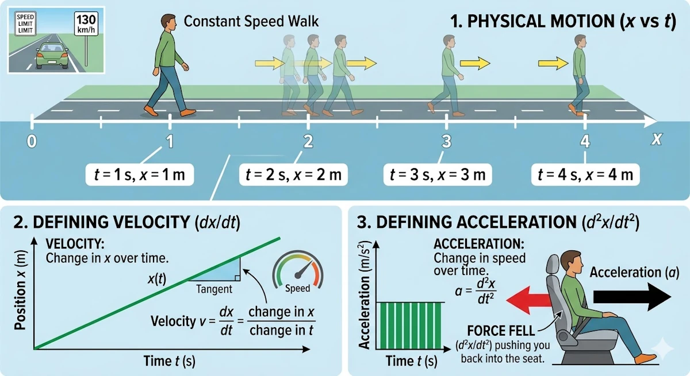
<figcaption>Position, speed and acceleration</figcaption>
</figure>


<!-- ###################################################################### -->
### 2. Why equations are often first or second order?
{: .no_toc }

In physics, most fundamental laws are expressed as differential equations of the first or second order because they describe how a system's state evolves based on its current configuration.

**First-order equations** typically govern "flow" processes or systems where the rate of change depends directly on the current value. A classic example is radioactive decay or heat transfer (Newton’s Law of Cooling), where the rate of change in temperature is proportional to the temperature difference itself. In these cases, the universe is interested in how the "now" dictates the "next moment."

#### **Side Note**
{: .no_toc }

You believe these examples are artificial? Ok... What about [percentages?]() Think to the money your beloved grand-mother put in an account with 1.5% interest. When we say:

> *We add x% to a sum, and that added amount depends on the current sum*

That’s exactly the idea of "rate of change depends on the current value".

* If you have \$100 and gain 5%, you add $5
* If you have \$200 and gain 5%, you add $10

So the change depends on the current amount. Ok... Now, let's follow the white rabbit and let's write this as a differential equation (just to make sure we are in sync). Let’s call:

* $$ S(t) $$: the amount of money at time $$ t $$
* $$ r $$: the growth rate (for example, 5% = 0.05)

The key idea becomes:

> *The rate at which the money changes is proportional to how much money we already have*

Mathematically:
$$
\frac{dS}{dt} = r \cdot S
$$

Can you believe it? There is a first-order differential equation hidden behind a percentage. Ok... What happens when we solve it? Can we "see" the future?

In fact if we solve:
$$
\frac{dS}{dt} = rS
$$

We get:
$$
S(t) = S_0 e^{rt}
$$

Where:
* $$ S_0 $$: the initial amount (\$100)
* $$ e^{rt} $$: continuous growth

This is what we call "continuous compounding" and this explains why your banker have a Lamborghini while you own a bicycle.

In high school, we usually see something like: $$S_n = S_0 (1 + r)^n $$

That’s discrete compounding (step by step). The differential equation version is an extreme version where we say:

> *What if compounding happens all the time, not just once per year?*


**Second-order equations**, however, are the backbone of classical mechanics and wave theory. This is largely due to Newton’s Second Law, $$F = ma$$. This equality explains how the Force (do you hear John Williams's music?) changes the *rate of change* of the position. Say it again. The force changes the rate of change of the position.

Since acceleration is the second derivative of position ($$a = \frac{d^2x}{dt^2}$$), any law involving force (from gravity to electromagnetism) is naturally second-order.

Furthermore, second-order derivatives account for curvature and restoring forces. In wave equations, the second derivative describes how a disturbance "snaps back" toward equilibrium, allowing energy to propagate through space.

Going beyond the second order is rare in fundamental physics because it would imply that a system's "acceleration" depends on its "jerk" (the rate of change of acceleration), which doesn't typically align with our observations of how energy and momentum are conserved in nature.


#### **First derivative $$ \rightarrow $$ flow / transport**
{: .no_toc }

If a phenomenon depends only on the rate of change, we get first-order equations.

Example: radioactive decay

* Experimentation: We measure that the speed at which nuclei disappear is proportional to how many remain.
* Interpretation:
    - "Speed" means $$\frac{dN}{dt}$$
    - "is proportional" means $$\lambda$$
    - "how many remain" means $$N$$
    - "disappear" means $$-$$

Tadaa!

$$\frac{dN}{dt} = -\lambda N$$

This law is local and simple. More atoms means more decay events per second. The formula leads to a exponential decay.


#### **Side Note with Python**
{: .no_toc }

Copy the code below in a [Jupyter Notebook](https://jupyter.org/try-jupyter/lab/)


```python
import numpy as np
import matplotlib.pyplot as plt

# Parameters
lambda_ = 0.5   # decay constant
N0 = 10         # initial quantity

# Time array
t = np.linspace(0, 10, 200)

# Exponential decay solution
N = N0 * np.exp(-lambda_ * t)

# Numerical derivative dN/dt
dt = t[1] - t[0]
dN_dt = np.gradient(N, dt)

# Plot
plt.figure(figsize=(8, 5))

plt.plot(t, N, label="N(t) (quantity)")
plt.plot(t, dN_dt, linestyle="--", label="dN/dt (rate of change)")

# Decorations
plt.axhline(0)
plt.title("First derivative as rate of change (exponential decay)")
plt.xlabel("Time")
plt.ylabel("Value")
plt.legend()

plt.show()

```
You should see

<figure style="max-width: 450px; margin: auto; text-align: center;">
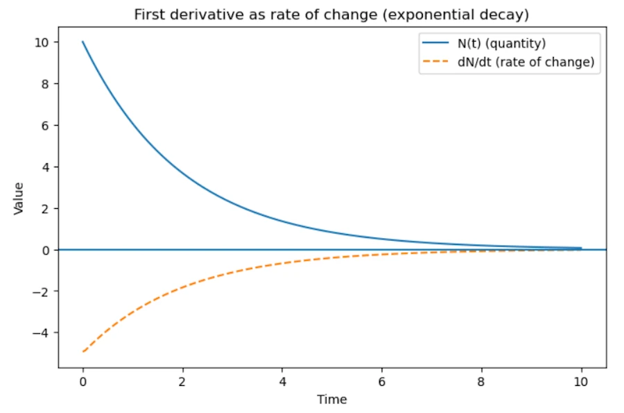
<figcaption>First derivative as rate of change (exponential decay)</figcaption>
</figure>


#### **Second derivative $$ \rightarrow $$ dynamics / inertia**
{: .no_toc }


In physics, second-order derivatives are the language of dynamics and they appear when acceleration matters. While a first-order equation describes a system that "drifts" according to its current state (like a leaf in a stream), a second-order equation describes a system with inertia.

**The Physics of "Memory":** The appearance of the second derivative is fundamentally linked to Newton’s Second Law. When we say $$F = ma$$, as already mentioned, we are stating that a force doesn't change a position directly, it changes the *rate of change* of the position.

<figure style="max-width: 450px; margin: auto; text-align: center;">
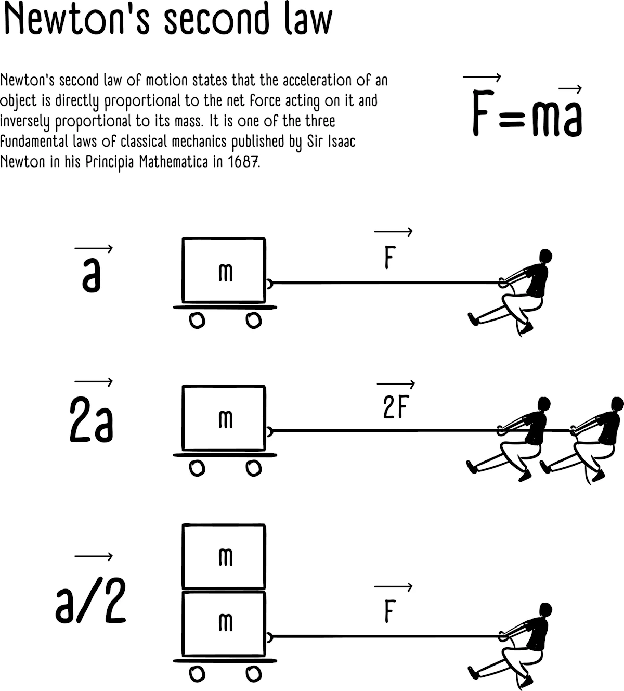
<figcaption>Newton’s Second Law</figcaption>
</figure>

Since acceleration $$a$$ is the derivative of velocity $$v$$, and velocity is the derivative of position $$x$$, we arrive at a second-order differential equation:

$$F = m \frac{dv}{dt} = m \frac{d^2x}{dt^2}$$

This mathematical structure implies that a physical body possesses a "memory" of its own motion. Because the governing equation is second-order, the "state" of the system at any given moment $$t$$ is not defined by its location alone.

To predict the future state at $$t + \Delta t$$, the laws of physics require two distinct data points. You can think of this as the system needing to know both its current address and its recent history:

1.  Where the object is (Position: $$x$$): The instantaneous spatial coordinate.
2.  How it got there (Velocity: $\dot{x}$): The "memory" of its previous motion, which dictates its momentum.


**The Contrast: Memory vs. Instantaneous Systems:** To visualize this, imagine a light switch versus a coasting car

* No Memory (First-Order): A light switch. The moment you stop applying force, the state is fixed. It doesn't "remember" how fast you flipped it. It is either *on* or *off*.
* With Memory (Second-Order): A car traveling at 60 km/h. If you take your foot off the gas (zero force), the car doesn't stop instantly. It "remembers" its velocity and continues to move forward. This "stored" information is what we mathematically represent as the second-order derivative.


**Why Two Initial Conditions?:** From a calculus perspective, solving a second-order equation requires integrating twice. Each integration introduces a constant ($$C_1$$ and $$C_2$$). Physically, these constants correspond to the initial position and initial velocity.


Again, if the universe were governed by first-order equations ($$F = mv$$), inertia wouldn't exist. The moment you stopped applying a force, an object would instantly stop moving. Because our universe is second-order, objects "remember" their velocity, requiring a counter-force to bring them to rest. This is why second-order equations are essential for describing anything that oscillates, orbits, or survives an impact.


<!-- ###################################################################### -->
### 3. But how did Newton discover $$F = ma$$?
{: .no_toc }

Important point: Newton (1687, publication in Principia Mathematica) did not guess the equation randomly. It emerged from experiments plus symmetry principles.


#### **Observations known before Newton**
{: .no_toc }

Galileo (in 1589+, 100 years before Newton, 100 years!) had already measured that:

* Objects fall with constant acceleration
* Motion without forces means constant velocity

Believe it or not, Galileo was the first to measure it experimentally. Launching watermelons from the top of the Pisa tower is certainly a legend. He more certainly used inclined plans (to slow down the falls). Thanks to Aristotle (-350), until then (so, realize it took almost 2_000 years), people assumed the speed of falling bodies was proportional to their weight.

Galileo's experiments implies:

$$a = \text{constant when force is constant}$$

Then experiments showed:

* Double the force $$ \rightarrow $$ double the acceleration
* Double the mass $$ \rightarrow $$ half the acceleration

So empirically:

$$a \propto \frac{F}{m}$$

Where the symbol $$\propto$$ means proportional. At the end they came with:

$$F = ma$$

So it is really an empirical law extracted from experiments.


<!-- ###################################################################### -->
### 4. Why physics prefers local laws?
{: .no_toc }

Most physical laws describe local behavior:

Instead of saying

> *The temperature everywhere depends on the whole system.*

Nature usually says something like:

> *What happens here depends on what is happening just next to it.*

This locality leads directly to derivatives.


#### **Example: Heat Flow and Temperature**
{: .no_toc }

Consider a temperature field: $$ T(x, t) $$.

Don't start grumbling. A temperature field $$ T(x, y, t) $$ is just the ceramic hob you turned on and then turned off. Over time, the temperatures are going to change (go down), and they won't all be the same. The temperatures at the edge of the burner might cool down faster than the rest. Anyway, the temperature $$T$$ depends on both time and position. Here I used a field $$(x,y)$$, while in the example we only have $$T(x, t)$$. Life is simple!

The heat flowing through a point depends on how temperature changes in space. More precisely, it depends on the temperature gradient:

$$
\text{Heat flow} \propto - \nabla T
$$

The symbol $$ \nabla $$ is called nabla (it can be named "del" also).

One way to understand the "gradient" is through intuition: imagine standing on a snowboard on a mountain. You are trying to find the direction of the steepest slope. That direction is exactly what the gradient represents.

* In **3D**, the gradient tells us the direction and strength of the steepest increase.
* In **1D**, this reduces to something familiar:
  $$
  f(x) = x^2 \quad \rightarrow \quad \nabla f = \frac{df}{dx}
  $$
  So in one dimension, nabla is just the usual derivative.


#### **Side Note on the Nabla Operator**
{: .no_toc }

The symbol $$ \nabla $$ (or sometimes written $$ \vec{\nabla} $$) is a vector differential operator, which means that it behaves like a vector whose components are derivatives.

In 3D, it is defined as:
$$
\nabla = \hat{i} \frac{\partial}{\partial x} + \hat{j} \frac{\partial}{\partial y} + \hat{k} \frac{\partial}{\partial z}
$$

You can also write it in vector form:
$$
\nabla =
\begin{pmatrix}
\frac{\partial}{\partial x}
\\ \frac{\partial}{\partial y}
\\ \frac{\partial}{\partial z}
\end{pmatrix}
$$


At first, this may feel abstract because:

* We don’t yet see what the operator is applied to
* We don’t know how to "compute" with it

The key idea is that everything depends on two things:

1. What we apply $$ \nabla $$ to: a scalar field like the temperatures on the previous ceramic hob or a vector field like the vectors representing the wind forces and directions on a 2D map.
2. What operation we use. Remember nabla is a vector so we can compute dot product, cross product...


**Main Operations with Nabla**

The table below summarizes the most important operations.

| Operation         | 1D Version              | 3D Expression               | Name       | Result                                                                                                                                                                                                                                  |
| :---------------- | :---------------------- | :-------------------------- | :--------- | :-------------------------------------------------------------------------------------------------------------------------------------------------------------------------------------------------------------------------------------- |
| Dot product       | $$ \frac{dE}{dx} $$     | $$ \nabla \cdot \vec{E} $$  | Divergence | $$ \frac{\partial E_x}{\partial x} + \frac{\partial E_y}{\partial y} + \frac{\partial E_z}{\partial z} $$                                                                                                                               |
| Cross product     | — (not defined in 1D)   | $$ \nabla \times \vec{E} $$ | Curl       | $$ \begin{pmatrix} \frac{\partial E_z}{\partial y}-\frac{\partial E_y}{\partial z} \\ \frac{\partial E_x}{\partial z}-\frac{\partial E_z}{\partial x} \\ \frac{\partial E_y}{\partial x}-\frac{\partial E_x}{\partial y} \end{pmatrix} $$ |
| Applied to scalar | $$ \frac{d\phi}{dx} $$  | $$ \nabla \phi $$           | Gradient   | $$ \begin{pmatrix} \frac{\partial \phi}{\partial x} \\ \frac{\partial \phi}{\partial y} \\ \frac{\partial \phi}{\partial z} \end{pmatrix} $$                                                                                              |


**Summary about $$ \vec{\nabla} $$**

* In 1D, everything reduces to ordinary derivatives.
* In higher dimensions, $$ \nabla $$ lets us generalize derivatives in a compact way.
* The different operations (gradient, divergence, curl) describe different physical behaviors:
  * Gradient $$ \rightarrow $$ direction of change
  * Divergence $$ \rightarrow $$ sources and sinks
  * Curl $$ \rightarrow $$ rotation


<!-- ###################################################################### -->
### 5. Example: heat equation
{: .no_toc }

The heat equation is

$$\frac{\partial T}{\partial t} = \kappa \nabla^2 T$$

This looks complicated but comes from two physical statements.

#### **1 Heat flows from hot to cold**
{: .no_toc }

This is the Fourier law:

$$q = -k \nabla T$$

$$q$$, the heat flux (energy per unit area per unit time) depends on temperature gradient. $$q$$ is not a "temperature flux" but a heat flux.

Do not hesitate to think in 1D where $$q = -k \frac{dT}{dx}$$

* $$q$$, Heat Flux: This represents the flow of thermal energy (Joules) passing through a unit area ($m^2$) per second ($s$). Its unit is $W/m^2$.
* $$k$$, Thermal Conductivity: This is a material property. A high $k$ (like copper) means the material conducts heat easily. A low $k$ (like fiberglass) means it is an insulator.
* $$\frac{dT}{dx}$$, Temperature Gradient: This is the change in temperature over a specific distance.

Why is there a negative sign? The negative sign is the mathematical way of saying "heat flows from hot to cold."


#### **2 Energy is conserved**
{: .no_toc }

Change of temperature = heat entering − heat leaving.

Mathematically this gives:

$$\frac{\partial T}{\partial t} = - \nabla \cdot q$$

Again, interpretation in 1D might be easier. It comes:

$$\frac{\partial T}{\partial t} = - \frac{\partial q}{\partial x}$$

It tells us that the temperature at a specific point changes over time ($$t$$) based on whether heat is "piling up" or "draining away" at that location.


* $\frac{\partial T}{\partial t}$ (Rate of Change): This represents how fast the temperature is rising or falling at a single point $x$.
* $- \frac{\partial q}{\partial x}$ (Negative Flux Gradient): This term describes the "net" heat flow.
    * If more heat enters a small segment than leaves it, the gradient $\frac{\partial q}{\partial x}$ is negative.
    * The double negative ($-\frac{\partial q}{\partial x}$) turns this into a positive temperature increase.


Once this is understood in 1D, substitute $$q$$ in the second equation and it comes:

$$\frac{\partial T}{\partial t} = \kappa \nabla^2 T$$

So the second derivative appears because:

* Heat flow depends on gradient
* Conservation introduces divergence

Divergence of gradient, this is the Laplacian ($$ \nabla^2 $$)


#### **Side Note on the Laplacian**
{: .no_toc }

The symbol $$ \nabla^2 $$ is called the Laplacian. It look mysterious, but it is actually a way to say "divergence of the gradient". In other words:

$$ \nabla^2 T = \nabla \cdot (\nabla T) $$


**What does it do?**

* You start with a scalar field (like temperature $$T$$)
* You apply the Laplacian
* You get... another scalar

So
* Input: scalar
* Output: scalar


**In 1D (simplest case)**

In one dimension, everything reduces to ordinary derivatives:

$$
\nabla^2 T = \frac{d^2 T}{dx^2}
$$

So the Laplacian is just the second derivative. This tells us how the slope itself is changing (remember acceleration vs speed).


**In 3D (more general case)**

In three dimensions, the Laplacian becomes:

$$
\nabla^2 T =
\frac{\partial^2 T}{\partial x^2}
+
\frac{\partial^2 T}{\partial y^2}
+
\frac{\partial^2 T}{\partial z^2}
$$

It is the sum of second derivatives in each direction.


**Physical intuition**

The Laplacian measures how a quantity compares to its surroundings.

* If $$ \nabla^2 T > 0 $$: the point is colder than its neighbors $$ \rightarrow $$ heat flows in
* If $$ \nabla^2 T < 0 $$: the point is hotter than its neighbors $$ \rightarrow $$ heat flows out

So it captures how things spread out or smooth out over time.


**Why it appears in the heat equation?**

* The gradient tells us how temperature changes $$ \rightarrow $$ gives heat flow
* The divergence tells us how heat accumulates or leaves

Putting both together naturally gives the Laplacian $$\nabla^2 T$$


**Summary about $$ \nabla^2 $$**
* Laplacian = $$ \nabla^2 $$
* In 1D: Laplacian = second derivative
* In 3D: sum of second derivatives
* It takes a scalar $$ \rightarrow $$ scalar
* It describes diffusion/spreading


#### **Side Note with Python**
{: .no_toc }

Copy the code below in a [Jupyter Notebook](https://jupyter.org/try-jupyter/lab/)

```python
import numpy as np
import matplotlib.pyplot as plt
from mpl_toolkits.mplot3d import Axes3D

# Create a 2D grid
x = np.linspace(-3, 3, 100)
y = np.linspace(-3, 3, 100)
X, Y = np.meshgrid(x, y)

# Define a scalar field T(x, y)
T = np.exp(-(X**2 + Y**2))  # a smooth "hot bump"

# Compute Laplacian numerically
dx = x[1] - x[0]
dy = y[1] - y[0]

d2T_dx2 = np.gradient(np.gradient(T, dx, axis=1), dx, axis=1)
d2T_dy2 = np.gradient(np.gradient(T, dy, axis=0), dy, axis=0)

laplacian_T = d2T_dx2 + d2T_dy2

# Plot
fig = plt.figure(figsize=(12, 5))

# --- Surface: T(x, y)
ax1 = fig.add_subplot(121, projection='3d')
ax1.plot_surface(X, Y, T)
ax1.set_title("Scalar field T(x, y)")
ax1.set_xlabel("x")
ax1.set_ylabel("y")

# --- Surface: Laplacian of T
ax2 = fig.add_subplot(122, projection='3d')
ax2.plot_surface(X, Y, laplacian_T)
ax2.set_title("Laplacian ∇²T")
ax2.set_xlabel("x")
ax2.set_ylabel("y")

plt.tight_layout()
plt.show()
```
You should see

<figure style="max-width: 450px; margin: auto; text-align: center;">
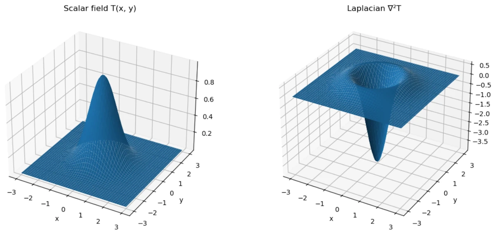
<figcaption>The Laplacian measures how a quantity compares to its surroundings</figcaption>
</figure>


* The left plot is our scalar field $$ T(x,y) $$: a "hot bump"
* The right plot is $$ \nabla^2 T $$
* At the top of the bump $$\rightarrow$$ Laplacian is negative $$\rightarrow$$ hotter than surroundings $$\rightarrow$$ heat flows out
* Around the edges $$\rightarrow$$ Laplacian becomes **positive** $$\rightarrow$$ colder than surroundings $$\rightarrow$$ heat flows in
* Again, the Laplacian measures how a quantity compares to its surroundings


<!-- ###################################################################### -->
### 6. Why differential equations appear everywhere?
{: .no_toc }

Almost every physical theory has three ingredients:

#### **1. Locality**
{: .no_toc }

What happens here depends on nearby values. This translates in derivatives in space


#### **2. Continuous time evolution**
{: .no_toc }

Future depends on current rate of change. This translates derivatives in time


#### **3. Conservation laws**
{: .no_toc }

Energy, momentum, charge, mass...

These are expressed mathematically using divergences and derivatives.


<!-- ###################################################################### -->
### 7. Why second order is extremely common?
{: .no_toc }

Most fundamental laws in physics are second order because:

* Systems have inertia
* Energy depends on velocity squared
* Conservation of momentum naturally leads to acceleration

Examples:
* Newtonian mechanics
* Wave equation
* Schrödinger equation (first order in time but second in space)
* Maxwell equations (effectively second order)


<!-- ###################################################################### -->
### 8. Summary
{: .no_toc }

We see derivatives everywhere because physics tries to answer:

> *How does the state of the system change locally?*

Derivatives are the mathematical language of change.

And differential equations express:

> *The rate of change of something depends on the current state of the system.*


A good mental model is:

Physics laws are like rules of evolution.

They don't tell us the whole trajectory.

They only say:

> If the system is like this right now, then it will start changing like that.

That is exactly what a differential equation describes.


<!-- ########################################### -->
<!-- ########################################### -->
<!-- ########################################### -->
<!-- ########################################### -->
<!-- ########################################### -->
<!-- ########################################### -->
<!-- ########################################### -->
<!-- ########################################### -->
<!-- ########################################### -->
<!-- ########################################### -->
<!-- ########################################### -->
<!-- ########################################### -->
<!-- ########################################### -->
<!-- ########################################### -->
<!-- ########################################### -->


<!-- ###################################################################### -->
<!-- ###################################################################### -->
<!-- ###################################################################### -->
## Why the heat equation, the wave equation and the Schrödinger equation look so similar?

Let's go step by step.


<!-- ###################################################################### -->
### 1. The common mathematical structure
{: .no_toc }

Many physical phenomena involve a quantity that depends on space and time:

$$
u(x,t)
$$

Examples:

* Temperature $$T(x,t)$$
* Displacement of a string $$y(x,t)$$
* Quantum wavefunction $$\psi(x,t)$$

In all three cases, the evolution of the system takes the form: $$ \text{time change} = \text{spatial variation} $$

The spatial variation is usually measured by the Laplacian $$ \nabla^2 $$ which is basically the second derivative in space. Why the second derivative? Because it measures curvature.


<!-- ###################################################################### -->
### 2. The physical meaning of the second spatial derivative
{: .no_toc }

Imagine a function $$u(x)$$.

The second derivative tells us whether the value at a point is:

* Higher than its neighbors
* Lower than its neighbors

Graphically:

* $$u'' > 0$$ implies valley
* $$u'' < 0$$ implies hill

So the second derivative tells us how different a point is from its surroundings. And many physical processes try to reduce those differences or react to them. That’s why the Laplacian appears everywhere.

#### **Side Note with Python**
{: .no_toc }

Copy the code below in a [Jupyter Notebook](https://jupyter.org/try-jupyter/lab/)

```python
import numpy as np
import matplotlib.pyplot as plt

# Create x values
x = np.linspace(-5, 5, 400)

# Define a function u(x)
u = np.sin(x)

# Compute second derivative numerically
dx = x[1] - x[0]
u_second = np.gradient(np.gradient(u, dx), dx)

# Plot the function
plt.figure(figsize=(8, 5))
plt.plot(x, u, label="u(x) = sin(x)")

# Highlight regions
plt.fill_between(x, u, where=(u_second > 0), alpha=0.3, label="u'' > 0 (valley)")
plt.fill_between(x, u, where=(u_second < 0), alpha=0.3, label="u'' < 0 (hill)")

# Decorations
plt.axhline(0)
plt.title("Second derivative indicates hills and valleys")
plt.legend()
plt.xlabel("x")
plt.ylabel("u(x)")

plt.show()

```
You should see

<figure style="max-width: 450px; margin: auto; text-align: center;">
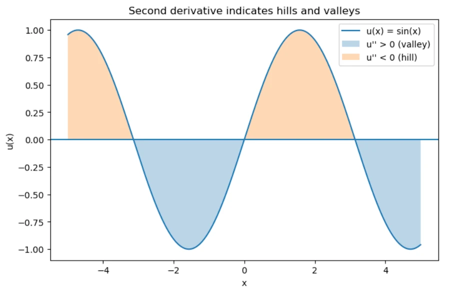
<figcaption>Second derivative indicates hills and valleys</figcaption>
</figure>


<!-- ###################################################################### -->
### 3. Example 1: heat diffusion
{: .no_toc }

The heat equation is

$$
\frac{\partial T}{\partial t} = \kappa \nabla^2 T
$$

Interpretation:

* If a point is hotter than its neighbors, heat flows away
* If a point is colder than neighbors, heat flows in

So temperature differences smooth out over time. The Laplacian measures exactly that difference. Result, the system diffuses.


<!-- ###################################################################### -->
### 4. Example 2: waves
{: .no_toc }

The wave equation is:

$$
\frac{\partial^2 u}{\partial t^2} = c^2 \nabla^2 u
$$

Don't trust me. Read this [page]() to see how to derive the previous formula.

In the case of a vibrating string, the interpretation is different. If a point on the string is curved, tension pulls it back toward equilibrium. More curvature means stronger restoring force. That force produces acceleration, which is why the time derivative is second order.

In others words:
* Curvature means force
* Force means acceleration

Thus:

$$
\text{acceleration} \propto \text{curvature}
$$

This produces waves instead of diffusion.


<!-- ###################################################################### -->
### 5. Example 3: quantum mechanics
{: .no_toc }

The Schrödinger equation is

$$
i\hbar \frac{\partial \psi}{\partial t} =
-\frac{\hbar^2}{2m} \nabla^2 \psi + V\psi
$$

This also contains the Laplacian. Why? Because the Laplacian corresponds to kinetic energy. In fact, the kinetic energy operator is:

$$
-\frac{\hbar^2}{2m}\nabla^2
$$

So again, the spatial curvature determines how the wave function evolves. The mathematics ends up looking surprisingly similar to diffusion or waves.


<!-- ###################################################################### -->
### 6. The deep unifying idea
{: .no_toc }

In many physical systems:

$$
\text{time evolution} = \text{spatial curvature}
$$

The curvature represents how different a point is from nearby points.

Depending on the physics:

| System  | Equation                                        | Behavior          |
| ------- | ----------------------------------------------- | ----------------- |
| Heat    | $$ \partial_t T = \kappa \nabla^2 T $$          | Diffusion         |
| Waves   | $$ \partial_t^2 u = c^2 \nabla^2 u $$           | Oscillations      |
| Quantum | $$ i\partial_t \psi = -\nabla^2 \psi + V\psi $$ | Probability waves |

Same mathematical ingredient, different physics.


<!-- ###################################################################### -->
### 7. Why nature loves local curvature laws?
{: .no_toc }

There are several deep reasons.

#### **1. Local interactions**
{: .no_toc }

Atoms only interact with nearby atoms. So the state at a point depends on neighbors, not the whole universe. The Laplacian is precisely the operator that compares a point to its neighbors.


#### **2. Symmetry**
{: .no_toc }

Physical laws must be invariant under:
* Translations
* Rotations

The simplest operator with those symmetries is the Laplacian.


#### **3. Energy minimization**
{: .no_toc }

Many systems evolve to minimize energy. Energy often contains terms like $$ (\nabla u)^2 $$. When we minimize such an energy functional, the resulting equation contains $$ \nabla^2 u $$. So the Laplacian appears naturally from variational principles.


<!-- ###################################################################### -->
### 8. A powerful intuition
{: .no_toc }

We can think of the Laplacian as:

> *Difference between a point and the average of its neighbors.*

In fact, on a discrete grid:

$$
\nabla^2 u(x)
\approx
u_{\text{neighbors}} - u(x)
$$

So the equations basically say:
* Heat: move toward neighbor average
* Waves: accelerate toward neighbor average
* Quantum: evolve based on neighbor difference


<!-- ###################################################################### -->
### 9. Why physics equations look "simple"?
{: .no_toc }

In fact, the real world equations are often the simplest possible ones.

Physicists usually assume:

1. locality
2. symmetry
3. smoothness
4. conservation laws

When we write the simplest equation compatible with these principles, we often end up with:

* First or second derivatives
* Laplacians
* Linear terms

Which explains why the same equations appear everywhere.


<!-- ###################################################################### -->
### 10. Summary
{: .no_toc }

Derivatives appear in physics because:

* Physics describes change
* Laws are local
* Systems react to differences with neighbors
* Curvature (second derivative) measures those differences

That’s why the same structures appear in:

* Heat
* Waves
* Quantum mechanics
* Electromagnetism
* Fluid dynamics


<figure style="max-width: 600px; margin: auto; text-align: center;">

<figcaption>From differential equations to variational principle.</figcaption>
</figure>


<!-- ########################################### -->
<!-- ########################################### -->
<!-- ########################################### -->
<!-- ########################################### -->
<!-- ########################################### -->
<!-- ########################################### -->
<!-- ########################################### -->
<!-- ########################################### -->
<!-- ########################################### -->
<!-- ########################################### -->
<!-- ########################################### -->
<!-- ########################################### -->
<!-- ########################################### -->
<!-- ########################################### -->
<!-- ########################################### -->


<!-- ###################################################################### -->
<!-- ###################################################################### -->
<!-- ###################################################################### -->
## A deeper modern perspective

### From differential equations to the variational principle
{: .no_toc }

Up to this point, we have described physical systems using derivatives: velocity as a first derivative, acceleration as a second derivative, and more generally differential equations that relate these quantities. This approach is local in nature: it tells us how the system evolves step by step, at each instant of time.

However, this is not the only way to describe motion. Instead of focusing on what happens at each instant, we can ask a different question: *among all possible trajectories connecting two points, why does the system follow this particular one?*

This leads us to a more global perspective, where the entire trajectory is considered at once. Rather than expressing laws as differential equations, we look for a quantity, called the action, whose value depends on the whole path, and we postulate that the actual motion makes this quantity stationary.

The remarkable fact is that these two approaches, local differential equations and global optimization, are not in contradiction. They are in fact equivalent descriptions of the same physical laws.


Quick heads-up before we dive in: don't make the same mistake I did. It’s easy to get hyper-focused on the Principle of Least Action, but just remember it’s actually just one specific 'flavor' of a much bigger mathematical concept called the variational principle. Keep that in the back of your mind as we go, it’ll make everything else click way faster. Ok, let’s break it down.


<!-- ###################################################################### -->
### 1. What is a variational principle (in general)?
{: .no_toc }

A variational principle is any statement of the form:

> *The physical solution is the one that makes a certain quantity stationary (usually an extremum this means a minimum or a maximum).*

Mathematically:

$$
\delta \mathcal{F} = 0
$$

where $$\mathcal{F}$$ is some functional (a function of functions).

So the structure is:

* We define a quantity depending on a function (trajectory, field, shape...)
* We require that small variations do not change it at first order

This idea exists far beyond physics.


<!-- ###################################################################### -->
### 2. Why extremize anything?
{: .no_toc }

At this point, a natural question arises:

> *Why should a physical system be described by an extremum of some quantity?*

At first sight, this may feel artificial. In Newtonian mechanics, we are used to local laws such as:

* "Force equals mass times acceleration"
* Equations that tell us how motion evolves step by step in time

A variational principle looks very different. It is a global statement: instead of describing what happens at each instant, it compares entire possible trajectories and selects one special path.

So why does this work? The key idea is that extremizing a functional is not a completely new kind of law. It is actually another way of encoding differential equations.

When we impose $$ \delta \mathcal{F} = 0$$, we are requiring that small changes of the function do not affect the quantity at first order. This constraint turns out to be strong enough to produce local equations of motion (through the Euler–Lagrange equations).

In other words:

> *A variational principle is a compact, global way of writing the same physics that can also be expressed with differential equations.*

This is why the principle of least action is so powerful: it does not replace Newton’s laws. It reformulates them in a way that reveals deeper structure (symmetries, conservation laws, and generalizations to fields).


<!-- ###################################################################### -->
### 3. Why extremize anything? Extended Cut.
{: .no_toc }

There isn’t a single definitive answer, but we can look at it from several complementary angles. Each one sheds light on a different aspect of the idea.


#### **1. Historical and intuitive perspective: from optics to mechanics**
{: .no_toc }

The first known variational principle did not come from mechanics, but from optics with Pierre de Fermat (~1650):

> *Light follows the path that makes the travel time stationary.*

Why? Fermat was looking for a unifying principle to explain both reflection and refraction.
In a uniform medium, the shortest path is a straight line. But in a medium with varying refractive index, it’s no longer the geometric distance that matters—it’s the *time*.

When Pierre-Louis Moreau de Maupertuis, Leonhard Euler, and Joseph-Louis Lagrange searched for a similar principle in mechanics, they were guided by this idea: nature behaves in an "economical" way.

* A free particle moves in a straight line.
* A projectile follows a curved path.

But what is being minimized (or made stationary)? Not distance, not time, but the integral of ( T - V ), the difference between kinetic and potential energy.

Why this specific form $$ L = T - V $$? It wasn’t guessed from first principles. It was discovered by trial and error. The goal was to find a quantity whose extremization reproduces Newton’s laws.

Lagrange showed that if we impose

$$ \delta \int L \, dt = 0 \quad \text{with} \quad L = T - V$$

Then we recover

$$m\ddot{x} = -\nabla V$$.

So this is not a new physical law. It’s a **powerful reformulation** of existing ones.


#### **2. Mathematical perspective: a compact way to encode local laws**
{: .no_toc }

Why require an integral to be stationary instead of directly writing differential equations?

Suppose we start with an equation of motion like $$\ddot{x} = f(x)$$.

We can ask: does there exist a function $$ L(x,\dot{x}) $$ such that solutions of this equation are exactly the critical points of $$\int L \,dt$$?

Under certain conditions (for example, when forces come from a potential), the answer is yes.

More importantly: extremizing an integral is a compact, global way to encode second-order differential equations together with boundary conditions.

For a functional
$$
S[q] = \int_{t_1}^{t_2} L(q,\dot{q},t),dt,
$$

The condition $$ \delta S = 0 $$, for variations vanishing at the endpoints, leads *locally* to the Euler–Lagrange equations:

$$
\frac{d}{dt}\left(\frac{\partial L}{\partial \dot{q}}\right) - \frac{\partial L}{\partial q} = 0.
$$

So the variational principle is not something foreign to differential equations. It’s another, more global way of expressing them.


#### **3. Physical/philosophical perspective: why an extremum?**
{: .no_toc }

This question has puzzled thinkers from Gottfried Wilhelm Leibniz to Richard Feynman. Here are a few ways to think about it.

**The quantum mechanics viewpoint (Feynman):**

In quantum mechanics, a particle does not follow a single path. It explores all possible paths, each contributing an amplitude proportional to $$e^{iS/\hbar}$$.

The observed behavior comes from summing over all these paths.

When $$ \hbar $$ is very small (the classical limit), most contributions cancel out due to destructive interference. The only paths that survive are those where $$ S $$ is stationary because the phase varies the least there.

So the classical principle of least action emerges from quantum interference. There’s no "decision" by nature, just constructive interference near the classical path.


**Economy of description:**

A variational principle is a global statement:

* Instead of saying: "at every instant, acceleration equals force divided by mass,"
* We say: "among all possible paths, the real one makes a certain quantity stationary."

This formulation is especially powerful for:

* Symmetries (via Noether’s theorem $$\rightarrow$$ conservation laws),
* Constrained systems,
* Field theories (where partial differential equations come from a Lagrangian density).

So we use it because it is conceptually powerful and unifying, not because nature "prefers" extrema.


**A geometric analogy:**

In differential geometry, geodesics are curves that extremize distance.

* In flat space $$\rightarrow$$ straight lines
* In curved space $$\rightarrow$$ curved paths

In mechanics, we can reformulate motion as a geodesic problem in a more abstract "configuration space," where the metric is related to kinetic energy.

From this viewpoint, extremizing the action generalizes the idea of a "straight line" to more complex spaces.


#### **4. Summary**
{: .no_toc }

* **Mathematically**: extremizing an integral is equivalent to enforcing differential equations with boundary conditions. This is a more global formulation.
* **Physically**: the principle of least action is not more fundamental than Newton’s laws, but it reveals structure, symmetry, and unity.
* **Quantum mechanically**: the classical path is the one that survives interference—it’s where the action is stationary.


<!-- ###################################################################### -->
### 4. The principle of least action = a specific variational principle
{: .no_toc }

The principle of least action is just the case where:

$$
\mathcal{F} = S = \int L\,dt
$$

So:

$$
\delta S = 0
$$

This gives:

* Newton’s laws
* Maxwell’s equations
* Schrödinger equation
* General relativity

It’s extremely powerful but conceptually, it’s just one member of a larger family.

Historically, it was developed by people like Pierre-Louis Maupertuis and later formalized by William Rowan Hamilton.


<!-- ###################################################################### -->
### 5. Other variational principles in physics
{: .no_toc }

There are many important examples that are not phrased as "action minimization", even though some can be reformulated that way.


#### **1. Fermat’s principle (optics)**
{: .no_toc }

Associated with Pierre de Fermat (1660+)

$$
\delta \int n(s)\,ds = 0
$$

Interpretation:

> *Light follows the path that extremizes travel time.*

This explains:

* Refraction
* Reflection

This is actually an action principle for light, but historically it came first and looks different.


#### **2. Principle of minimum potential energy**
{: .no_toc }

In statics:

> *A system at equilibrium minimizes its potential energy.*

$$
\delta U = 0
$$

Examples:

* A hanging chain
* Elastic structures
* Equilibrium configurations

No time involved, this is not an "action over time", just a spatial variational principle.


#### **3. Principle of virtual work**
{: .no_toc }

Used in mechanics and engineering:

$$
\sum F_i \cdot \delta x_i = 0
$$

Interpretation:

> *For equilibrium, virtual displacements produce no net work.*

This is another variational formulation of mechanics.


#### **4. Least dissipation / entropy principles**
{: .no_toc }

In thermodynamics and statistical physics:

* Minimum entropy production (near equilibrium)
* Onsager’s principle

These are variational principles involving irreversible processes, not classical action.


#### **5. Rayleigh–Ritz method**
{: .no_toc }

Used in quantum mechanics and engineering:

$$
E[\psi] = \frac{\langle \psi | H | \psi \rangle}{\langle \psi|\psi\rangle}
$$

Minimizing this gives approximations of energy levels.

This is a variational method, not a fundamental law, but it uses the same idea.


<!-- ###################################################################### -->
### 6. So what makes the action so special?
{: .no_toc }

This is a good question because, in effect, not all variational principles are equal. The action principle is special because:


#### **1. It applies to dynamics (evolution in time)**
{: .no_toc }

Many variational principles describe equilibrium. The action principle describes how systems evolve in time.


#### **2. It is extremely general**
{: .no_toc }

It works for:

* Particles
* Fields
* Relativity
* Quantum theory


#### **3. It encodes symmetries**
{: .no_toc }

Through Emmy Noether’s theorem (1915):

> *Every symmetry of the action corresponds to a conservation law.*

Examples:

* Time invariance leads to energy conservation
* Space invariance leads to momentum conservation
* Rotation invariance leads to angular momentum

This is a deep structural reason physicists love the action.


<!-- ###################################################################### -->
### 7. Modern viewpoint
{: .no_toc }

In modern physics, the hierarchy is roughly:

* Variational principles (very general idea)

  * Action principle (central, universal in fundamental physics)

    * Specific Lagrangians for specific theories

So yes the principle of least action is a particular realization of a much broader conceptual framework.


<!-- ###################################################################### -->
### 8. A deeper intuition
{: .no_toc }

Why do variational principles appear at all?

One way to think about it:

Instead of describing physics as:

> *Local cause leads to local effect.*

We describe it as:

> *Global constraint on all possible histories.*

Then the real trajectory is the one that satisfies that constraint.

It’s a very different viewpoint:

* Newton/Leibniz: local differential equation
* Lagrange/Hamilton: global optimization over paths

Yet they give the same results.


<!-- ###################################################################### -->
### 9. Subtle but important point
{: .no_toc }

"Least action" is slightly misleading. In reality:

$$
\delta S = 0
$$

means:

* Minimum
* Maximum
* Or saddle point

So the correct name is: principle of stationary action


<!-- ###################################################################### -->
### 10. Big picture
{: .no_toc }

We can think of it like this:

* Differential equations for local description
* Variational principles for global description

They are two equivalent ways of encoding the same physics.

Final takeaway

* Variational principles are a general mathematical framework
* The principle of least action is one specific (and extremely powerful) example
* Many other principles (optics, statics, thermodynamics) fit into the same pattern
* Modern physics is largely built on the action because of its universality and symmetry properties


<!-- ########################################### -->
<!-- ########################################### -->
<!-- ########################################### -->
<!-- ########################################### -->
<!-- ########################################### -->
<!-- ########################################### -->
<!-- ########################################### -->
<!-- ########################################### -->
<!-- ########################################### -->
<!-- ########################################### -->
<!-- ########################################### -->
<!-- ########################################### -->
<!-- ########################################### -->
<!-- ########################################### -->
<!-- ########################################### -->


<!-- ###################################################################### -->
<!-- ###################################################################### -->
<!-- ###################################################################### -->
## I'm in high school, could you show me an example I can understand?

Alright, let’s tackle this carefully and make it *actually understandable* at a high school level. We’ll go step by step, with a one classic example of stationary action: A particle moving in a straight line (free particle). I’ll explain both the idea and the calculations, without skipping the important reasoning.


### First: Again... What does "stationary action" mean?
{: .no_toc }

Remember, we defined something called the **action** as:

$$
S = \int_{t_1}^{t_2} L \, dt
$$

* $$ S $$: the action
* $$ L $$: the Lagrangian (usually $$ L = T - V $$)
* $$ T $$: kinetic energy
* $$ V $$: potential energy

The principle says:

> *The real motion of a system is the one that makes the action stationary (usually a minimum).*

"Stationary" means:

* Not necessarily the smallest,
* But small variations don’t change it at first order. Think of a marble at the bottom of a bowl. If we do not push to far, the marble remains at the bottom.


### Key idea (super important)
{: .no_toc }

We imagine a small change in the path:

$$
x(t) \rightarrow x(t) + \varepsilon \eta(t)
$$

* $$ \varepsilon $$: very small number
* $$ \eta(t) $$: arbitrary small function (but zero at the endpoints)

We then ask "How does the action change?". If $$ \delta S = 0 $$ then the path is physical.


### Example of the free particle (no forces applied)
{: .no_toc }


<figure style="max-width: 600px; margin: auto; text-align: center;">

<figcaption>Studying a free particle in space with the principle of least action</figcaption>
</figure>

#### **Step 1: Define the system**
{: .no_toc }

A particle of mass $$ m $$, moving freely. No forces means no potential energy and so:

$$
L = T = \frac{1}{2} m v^2
$$

and since $$ v = \dot{x} $$:

$$
L = \frac{1}{2} m \dot{x}^2
$$


#### **Step 2: Write the action**
{: .no_toc }

$$
S = \int_{t_1}^{t_2} \frac{1}{2} m \dot{x}^2 \, dt
$$


#### **Step 3: Vary the path**
{: .no_toc }

We replace:

$$
x(t) \rightarrow x(t) + \varepsilon \eta(t)
$$

Then:

$$
\dot{x} \rightarrow \dot{x} + \varepsilon \dot{\eta}
$$


#### **Step 4: Plug into the action**
{: .no_toc }

$$
S(\varepsilon) = \int \frac{1}{2} m (\dot{x} + \varepsilon \dot{\eta})^2 dt
$$

Expand:

$$
S(\varepsilon) = \int \frac{1}{2} m \left( \dot{x}^2 + 2\varepsilon \dot{x}\dot{\eta} + \varepsilon^2 \dot{\eta}^2 \right) dt
$$


#### **Step 5: Keep only first order terms**
{: .no_toc }

We can ignore $$ \varepsilon^2 $$. Too small, remember $$0.1 \times 0.1=0.001$$:

$$
S(\varepsilon) \approx \int_{t_1}^{t_2} \frac{1}{2} m \dot{x}^2 \, dt + \varepsilon \int m \dot{x}\dot{\eta} \, dt
$$


$$
S(\varepsilon) \approx S(0) + \varepsilon \int m \dot{x}\dot{\eta} \, dt
$$

Now bear with me. By definition, if $$\varepsilon$$ small, we have:

$$
\delta S = S(\varepsilon) - S(0)
$$

So we can write, in first approximation:

$$
\delta S = S(0) + \varepsilon \int m \dot{x}\dot{\eta} \, dt - S(0)
$$


$$
\delta S = \varepsilon \int m \dot{x}\dot{\eta} \, dt
$$

$$
\delta S = \varepsilon m \int \dot{x}\dot{\eta} \, dt
$$


#### **Step 6: Integration by parts**
{: .no_toc }

We transform:

$$
\int \dot{x}\dot{\eta} \, dt
$$

Using integration by parts:

$$
= [\dot{x}\eta]_{t_1}^{t_2} - \int \ddot{x} \eta \, dt
$$

But, by definition we have $$ \eta(t_1) = \eta(t_2) = 0 $$

So it comes:

$$
\delta S = -\varepsilon m \int \ddot{x} \eta \, dt
$$


#### **Step 7: Key conclusion: Tadaa!**
{: .no_toc }

For this ($$\delta S$$) to be zero for any function $$ \eta $$ we must have:

$$
\ddot{x} = 0
$$


Integrating twice, this means:

$$
x(t) = vt + x_0
$$

Straight-line motion at constant speed. That is exactly Newton’s first law.


#### **Side Note with Python**
{: .no_toc }

The following script generates several candidate paths between the same two endpoints and computes the action for each. The physical path (straight line, $$a = 0$$) is the one with the minimum action.

Copy the code below in a [Jupyter Notebook](https://jupyter.org/try-jupyter/lab/)

```python
import numpy as np
import matplotlib.pyplot as plt

# Free particle: from x=0 at t=0 to x=1 at t=1
# Physical path: straight line x(t) = t
# Perturbed paths: x(t) = t + a * sin(pi * t)

m = 1.0
t = np.linspace(0, 1, 500)
dt = t[1] - t[0]

amplitudes = [-0.4, -0.2, 0.0, 0.2, 0.4]
actions = []

fig, (ax1, ax2) = plt.subplots(1, 2, figsize=(12, 5))

for a in amplitudes:
    x = t + a * np.sin(np.pi * t)
    v = np.gradient(x, dt)
    S = np.trapz(0.5 * m * v**2, t)
    actions.append(S)
    ax1.plot(t, x, label=f"a = {a:.1f}   S = {S:.3f}")

ax1.set_title("Candidate paths (free particle)")
ax1.set_xlabel("time t")
ax1.set_ylabel("position x(t)")
ax1.legend()

colors = ["tab:blue" if a == 0.0 else "tab:gray" for a in amplitudes]
ax2.bar([f"a={a:.1f}" for a in amplitudes], actions, color=colors)
ax2.set_title("Action S for each path\n(blue = physical path)")
ax2.set_xlabel("path")
ax2.set_ylabel("action S")

plt.tight_layout()
plt.show()
```

You should see

<figure style="max-width: 600px; margin: auto; text-align: center;">
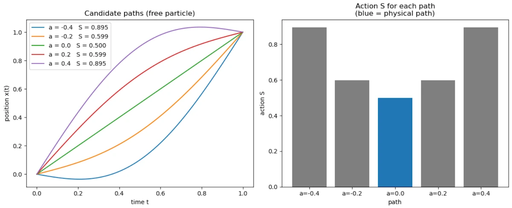
<figcaption>Among all candidate paths, the physical straight-line path has the minimum action</figcaption>
</figure>

* The left plot shows 5 paths all going from $$(0,0)$$ to $$(1,1)$$: the physical straight line and 4 curved alternatives
* The right plot shows the action computed for each: the physical path (blue) has the lowest value
* This is the variational principle made visible: nature selects the path that minimizes the action


#### **Side Note about Integration by Parts**
{: .no_toc }

Let’s start from something we definitely "should" know: $$\frac{d}{dt}(uv) = u'v + uv' $$. This is the product rule for derivatives. If you don't remember, find a bridge and jump. I can't do anything for you. You are lost for the cause.

Let's turn this into something useful and we’re going to reverse the logic. If:

$$
\frac{d}{dt}(uv) = u'v + uv'
$$

Then integrating both sides gives:

$$
\int \frac{d}{dt}(uv) \, dt = \int u'v \, dt + \int uv' \, dt
$$

Let's simplify. The left side is easy:

$$
\int \frac{d}{dt}(uv) \, dt = uv
$$

So we get:

$$
uv = \int u'v \, dt + \int uv' \, dt
$$

Let's cleanup our bedroom. It comes:


$$
\int uv' \, dt = uv - \int u'v \, dt
$$

This is integration by parts. Now, just for the fun and to make sure we are on the same page, let's apply it, again, to our case. We want to transform:

$$
\int \dot{x}\dot{\eta} \, dt
$$

We match it with:
* If $$ u = \dot{x} $$ then $$ u' = \ddot{x} $$
* If $$ v' = \dot{\eta} $$ then $$ v = \eta $$

Let's apply the formula

$$
\int \dot{x}\dot{\eta} \, dt
= \dot{x}\eta - \int \ddot{x}\eta \, dt
$$

Since we’re working between two times $$ t_1 $$ and $$ t_2 $$, we write:

$$
= [\dot{x}\eta]_{t_1}^{t_2} - \int \ddot{x}\eta \, dt
$$


The first term disappears because, remember, we chose:

$$
\eta(t_1) = \eta(t_2) = 0
$$

So:

$$
[\dot{x}\eta]_{t_1}^{t_2} = 0
$$

So we’re left with:

$$
\int \dot{x}\dot{\eta} \, dt = - \int \ddot{x}\eta \, dt
$$

And that’s exactly what we needed.


<!-- ###################################################################### -->
<!-- ###################################################################### -->
<!-- ###################################################################### -->
## I'm still in high school, can you show me another example?


### Let's look at a particle in gravity
{: .no_toc }

Because, now it gets more interesting.


<figure style="max-width: 600px; margin: auto; text-align: center;">
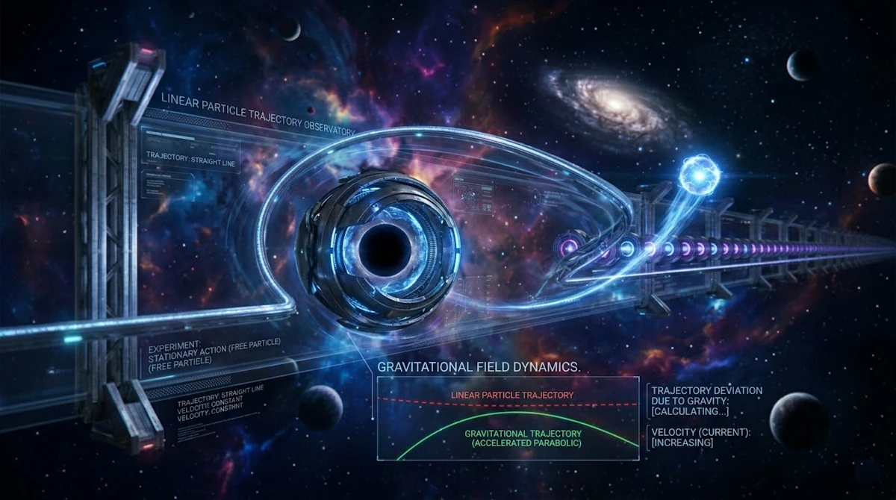
<figcaption>Studying a particle in gravity with the principle of least action</figcaption>
</figure>


#### **Step 1: Define energies**
{: .no_toc }

* Kinetic energy:

$$
T = \frac{1}{2} m \dot{x}^2
$$

* Potential energy (gravity):

$$
V = mgx
$$

So:

$$
L = \frac{1}{2} m \dot{x}^2 - mgx
$$


#### **Step 2: Action**
{: .no_toc }

$$
S = \int \left( \frac{1}{2} m \dot{x}^2 - mgx \right) dt
$$


#### **Step 3: Vary the path**
{: .no_toc }

Same idea:

$$
x \rightarrow x + \varepsilon \eta
$$

And so:

$$ \dot{x} \rightarrow \dot{x} + \varepsilon \dot{\eta} $$

<!-- $$ x \rightarrow x + \varepsilon \eta $$ -->


#### **Step 4: Plug in**
{: .no_toc }

$$
S(\varepsilon) = \int \left( \frac{1}{2} m (\dot{x} + \varepsilon \dot{\eta})^2 - mg(x + \varepsilon \eta) \right) dt
$$

Expand:

$$
= S(0) + \varepsilon \int \left( m \dot{x}\dot{\eta} - mg\eta \right) dt
$$


#### **Step 5: Compute variation**
{: .no_toc }

$$
\delta S = \varepsilon \int \left( m \dot{x}\dot{\eta} - mg\eta \right) dt
$$


#### **Step 6: Integration by parts again**
{: .no_toc }


<!--
$$
\int m \dot{x}\dot{\eta} dt = -\int m \ddot{x} \eta dt
$$

So:

$$
\delta S = \varepsilon \int \left( -m \ddot{x} - mg \right)\eta \, dt
$$
 -->


We start from:

$$
\int m \dot{x}\dot{\eta} \, dt
$$

Apply integration by parts:

$$
= m [\dot{x} \eta]_{t_1}^{t_2} - \int m \ddot{x} \eta \, dt
$$

But since we impose that the variation vanishes at the endpoints:

$$
\eta(t_1) = \eta(t_2) = 0
$$

the boundary term disappears:

$$
[\dot{x} \eta]_{t_1}^{t_2} = 0
$$

So we are left with:

$$
\int m \dot{x}\dot{\eta} , dt = - \int m \ddot{x} \eta \, dt
$$

Now substitute back into the variation:

$$
\delta S = \varepsilon \int \left( -m \ddot{x} - mg \right)\eta \, dt
$$


#### **Step 7: Final condition**
{: .no_toc }

For all $$ \eta $$ we want $$\delta S = 0$$ so:

$$
-m \ddot{x} - mg = 0
$$


#### **Final result: Tadaa!**
{: .no_toc }

$$
m \ddot{x} = -mg
$$

Since $$m$$ is not 0, it comes:

$$
\ddot{x} = -g
$$

That’s exactly the equation of a falling object.


<!-- ########################################### -->
<!-- ########################################### -->
<!-- ########################################### -->
<!-- ########################################### -->
<!-- ########################################### -->
<!-- ########################################### -->
<!-- ########################################### -->
<!-- ########################################### -->
<!-- ########################################### -->
<!-- ########################################### -->
<!-- ########################################### -->
<!-- ########################################### -->
<!-- ########################################### -->
<!-- ########################################### -->
<!-- ########################################### -->


<!-- ###################################################################### -->
<!-- ###################################################################### -->
<!-- ###################################################################### -->
## Why do we call it Action in Physics?

This a good question Marty and this actually goes straight into the history and philosophy of physics.


<!-- ###################################################################### -->
### 1. Where the word "action" comes from?
{: .no_toc }

The term "action" was introduced in the 18th century, mainly by Pierre-Louis Moreau de Maupertuis (around 1744).

He proposed an early version of a least-action principle and used the word *action* to describe a quantity that measures the "effort" or "activity" of nature along a path.

At the time, physics was still heavily influenced by philosophical ideas like:

* Nature acts in the most efficient way
* God or nature minimizes effort or "expenditure"

So "action" was meant to sound like:

> *How much "doing" or "effort" happens during a motion.*


<!-- ###################################################################### -->
### 2. What Maupertuis meant by "action"?
{: .no_toc }

His original definition wasn’t exactly $$ \int (T - V) \, dt$$.
He defined action roughly as:

$$
\text{action} \sim \int p \, dq
$$

* $$ p $$ = momentum
* $$q $$ = position

So already, action was something that:

* Depends on the whole path
* Accumulates along motion
* Measures something like "quantity of motion × distance"


<!-- ###################################################################### -->
### 3. Who formalized it?
{: .no_toc }

The modern definition came later with:

* Joseph-Louis Lagrange (1760+)
* William Rowan Hamilton (1830+)

Hamilton is the one who really established:

$$
S = \int (T - V) \, dt
$$

and turned "action" into a central, precise mathematical object.


<!-- ###################################################################### -->
### 4. Why the name stuck?
{: .no_toc }

The name "action" survived even though the meaning became more abstract, for a few reasons:

* It still represents something accumulated over motion
* It connects to energy and dynamics
* It has the flavor of a global measure of what happens along a trajectory

Even today, physicists sometimes loosely interpret action as:

* "How much dynamical activity happens along a path"
* or "The cost of a trajectory"


<!-- ###################################################################### -->
### 5. A deeper modern perspective
{: .no_toc }

In modern physics, "action" is less about "effort" and more about:

* A functional that encodes the entire dynamics of a system
* The central object from which all equations of motion can be derived

And in quantum mechanics (as we noticed with Feynman), it becomes even more fundamental:

* Every path is weighted by $$e^{iS/\hbar}$$

So "action" is really:

> *The quantity that controls how nature evolves, both classically and quantum mechanically.*


<!-- ###################################################################### -->
### 6. Summary
{: .no_toc }

* The word "action" was introduced by Maupertuis in the 18th century
* It originally meant something like "effort" or "amount of motion"
* It was later formalized by Lagrange and Hamilton into $$S = \int (T - V) \, dt$$
* The name stuck even as the concept became more abstract and central


<!-- ########################################### -->
<!-- ########################################### -->
<!-- ########################################### -->
<!-- ########################################### -->
<!-- ########################################### -->
<!-- ########################################### -->
<!-- ########################################### -->
<!-- ########################################### -->
<!-- ########################################### -->
<!-- ########################################### -->
<!-- ########################################### -->
<!-- ########################################### -->
<!-- ########################################### -->
<!-- ########################################### -->
<!-- ########################################### -->


<!-- ###################################################################### -->
<!-- ###################################################################### -->
<!-- ###################################################################### -->
## Why $$L = T - V$$?

It has been stated that the Lagrangian $$L = T - V$$, where $$T$$ is kinetic energy and $$V$$ is potential energy. Why? Why do we minimize the difference rather than the sum? Why do we minimize the difference between the values rather than the difference between their squares?

Can we revisit the origins of the definition of what is known as the action in physics?


<!-- ###################################################################### -->
### 1. Why not use the total energy?
{: .no_toc }

We are usually taught to work with total energy, $E = T + V$, which is a conserved quantity over time.

<!-- However, the Lagrangian ($L$) focuses on the dynamics, the "trade-off" during the journey. We might legitimately wonder: why subtract potential energy?  -->

Now, imagine a ball thrown upward: it loses kinetic energy ($T$) to gain potential energy ($V$). If we used $T + V$, the sum would remain constant regardless of the path taken, which doesn't help us distinguish the "real" trajectory from the "fake" ones. By using $L = T - V$, we are essentially measuring the "balance" between motion and position at every instant. The Principle of Least Action looks for the path that minimizes this cumulative imbalance over the entire trip. It’s as if nature seeks the ultimate economy, ensuring that kinetic energy isn't spent unless it’s "justified" by a corresponding change in potential energy.


<!-- ###################################################################### -->
### 2. What the action is?
{: .no_toc }

In classical mechanics, we want to understand how an object moves from point A to point B. Instead of looking only at its position at a given instant, we can look at the entire path it takes.

This is where the action, denoted $$S$$, comes in. It is a kind of "score" we compute for each possible path. More concretely, for every trajectory the object could follow between $$t_1$$ and $$t_2$$, we assign a number $$S$$ that summarizes "how much energy it expends to move".

To compute this score we use the Lagrangian, denoted $$L$$:

$$
L = T - V
$$

* $$T$$ is the kinetic energy: the energy due to motion, which depends on speed.
* $$V$$ is the potential energy: the energy due to forces that "push or pull" the object (such as gravity or a spring).

We then integrate $$L$$ over time between $$t_1$$ and $$t_2$$:

$$
S = \int_{t_1}^{t_2} L \, dt = \int_{t_1}^{t_2} (T - V) \,dt
$$

This integral yields a single number for each path (again, think of it as a score, a global grade). The principle of least action says that the path the object actually takes is the one that makes this number "stationary" (often a minimum) compared to all other possible paths.

So instead of following the forces at each instant as with $$F = ma$$, we can think in terms of the global path, and the object "chooses" the trajectory that makes the action special.


More precisely, in classical mechanics, the action $$S$$ is a functional, a quantity that depends on the whole path a system takes between two times:

$$
S[q(t)] = \int_{t_1}^{t_2} L(q, \dot{q}, t)  dt
$$

where $$L = T - V$$ is the Lagrangian, $$T$$ is kinetic energy, $$V$$ is potential energy, and $$q(t)$$ describes the configuration of the system over time.

The principle of least action (more accurately, principle of stationary action) states that the physical path a system follows makes $$S$$ stationary (usually a minimum) compared to nearby paths:

$$
\delta S = 0
$$

This yields Euler–Lagrange equations, which are exactly Newton’s laws in disguise.


<!-- ###################################################################### -->
### 3. Why $$L = T - V$$ and not $$T + V$$?
{: .no_toc }

Historically, this comes from Hamilton’s reformulation of mechanics:

* Kinetic energy $$T$$ represents motion.
* Potential energy $$V$$ represents "stored" energy due to forces.
* The Lagrangian $$L = T - V$$ turns out to encode the dynamics correctly: when we apply $$\delta S = 0$$, the resulting equations of motion reproduce Newton’s second law $$F = ma$$.

If we tried $$T + V$$, the Euler–Lagrange equations would lead to completely wrong dynamics. Mathematically, $$T - V$$ naturally appears when we try to generalize d’Alembert’s principle, which itself expresses that the difference between applied forces and inertial forces "vanishes" along the physical path.

So it’s not arbitrary; it’s derived to make Newton’s laws emerge from a variational principle.


<!-- ###################################################################### -->
### 4. Why minimize (or make stationary) instead of maximize?
{: .no_toc }

* In many cases, the action is actually minimized, like in free particle motion or harmonic oscillators.
* More generally, the principle is "stationary action," meaning $$\delta S = 0$$. This includes minima, maxima, and saddle points. The key is that the first variation vanishes, we don’t always strictly minimize in a global sense.

So the focus is on "stationary" not strictly "minimum".


<!-- ###################################################################### -->
### 5. Why not the difference of squares or other functions?
{: .no_toc }

* The Lagrangian is chosen to be linear in energies $$T - V$$ because it matches Newtonian dynamics.
* Using $$T + V$$ or $$(T - V)^2$$ gives different Euler–Lagrange equations that do not reproduce physical trajectories.
* It turns out that (T - V) is the simplest combination leading to second-order differential equations in time, which is what we observe for real motion.


<!-- ###################################################################### -->
### 6. Historical genesis
{: .no_toc }

* Maupertuis (1744) first proposed a kind of "least action" principle: the integral of momentum along the path is minimized.
* Euler and Lagrange formalized it, showing $$S = \int L \, dt$$ gives Newton’s equations.
* Hamilton gave the modern formulation with $$L = T - V$$ in 1834.
* So the action $$S$$ is not just "something we made up"; it arises naturally from trying to express mechanics in terms of variational principles, which is elegant and generalizable (to fields, quantum mechanics, relativity...).


<!-- ###################################################################### -->
### 7. Summary
{: .no_toc }

1. Action $$S = \int (T - V) \, dt$$ because this combination reproduces Newtonian dynamics via a variational principle.
2. We look for stationary points of $$S$$, not strictly minima, because the actual physical path makes $$\delta S = 0$$.
3. Other choices like $$T + V$$ or $$(T - V)^2$$ fail to give the correct equations of motion.
4. Historically, it comes from the effort to express mechanics as a global extremum principle, starting with Maupertuis and culminating in Hamilton’s formulation.


<!-- ###################################################################### -->
<!-- ###################################################################### -->
<!-- ###################################################################### -->
## Show me how, using the principle of stationary action (least action), we can recover $$F=ma$$?

This is one of the most beautiful things in theoretical physics: Newton’s law can be derived from a variational principle. I'll go carefully and start from the basics so every step makes sense.

The key idea comes from the Pierre-Louis Maupertuis principle, later generalized by William Rowan Hamilton and Joseph-Louis Lagrange.

The principle says:

> *The trajectory of a physical system is the one that makes the action stationary.*


<!-- ########################################### -->
### 1. Define the action
{: .no_toc }

We introduce a quantity called the action:

$$
S = \int_{t_1}^{t_2} L(x,\dot x,t),dt
$$

where:

* $$x(t)$$ = position
* $$\dot x = dx/dt$$ = velocity
* $$L$$ = Lagrangian

For a particle in a potential $$V(x)$$:

$$
L = T - V
$$

where:

* $$T = \frac{1}{2} m \dot{x}^2$$ (kinetic energy)
* $$V(x)$$ (potential energy)

So:

$$
L(x,\dot x) = \frac12 m\dot x^2 - V(x)
$$


<!-- ########################################### -->
### 2. The principle of stationary action
{: .no_toc }

Nature selects the path (x(t)) such that the action is stationary:

$$
\delta S = 0
$$

Meaning: small variations of the trajectory do not change the action at first order.

We therefore consider a slightly modified path:

$$
x(t) + \epsilon \eta(t)
$$

where:

* $$\epsilon$$ is small
* $$\eta(t)$$ is an arbitrary function
* $$\eta(t_1)=\eta(t_2)=0$$ (endpoints fixed)


<!-- ########################################### -->
### 3. Compute how the action changes
{: .no_toc }

The action becomes

$$
S(\epsilon) = \int_{t_1}^{t_2}L(x+\epsilon\eta,\dot x+\epsilon\dot\eta,t) \, dt$$

Now differentiate with respect to $$\epsilon$$:

$$
\frac{dS}{d\epsilon} = \int\left(\frac{\partial L}{\partial x}\eta+\frac{\partial L}{\partial \dot x}\dot\eta\right) \, dt$$

Then we impose:

$$
\frac{dS}{d\epsilon}=0
$$


<!-- ########################################### -->
### 4. Remove the derivative on $$\dot{\eta}$$
{: .no_toc }

We integrate by parts:

$$
\int \frac{\partial L}{\partial \dot x}\dot\eta dt = \left[\frac{\partial L}{\partial \dot x}\eta \right]_{t_1}^{t_2} - \int\frac{d}{dt}\left(\frac{\partial L}{\partial \dot x} \right)\eta dt
$$

The boundary term vanishes because:

$$
\eta(t_1)=\eta(t_2)=0
$$

So the variation becomes

$$
\delta S = \int \left(\frac{\partial L}{\partial x} - \frac{d}{dt} \frac{\partial L} {\partial \dot x} \right) \eta(t) dt
$$


<!-- ########################################### -->
### 5. Euler–Lagrange equation
{: .no_toc }

Because $$\eta(t)$$ is arbitrary, the only way the integral can always vanish is if:

$$
\frac{d}{dt} \frac{\partial L}{\partial \dot x} - \frac{\partial L}{\partial x} = 0
$$

This is the Euler–Lagrange equation.

This equation is the core of Lagrangian mechanics.


<!-- ########################################### -->
### 6. Insert the Lagrangian
{: .no_toc }

Recall:

$$
L = \frac12 m\dot x^2 - V(x)
$$


#### **First term**
{: .no_toc }

$$
\frac{\partial L}{\partial \dot x} = m\dot x
$$

So

$$
\frac{d}{dt}(m\dot x) = m\ddot x
$$


#### **Second term**
{: .no_toc }

$$
\frac{\partial L}{\partial x} = -\frac{dV}{dx}
$$


<!-- ########################################### -->
### 7. The resulting equation
{: .no_toc }

Insert into Euler–Lagrange:

$$
m\ddot x - (-\frac{dV}{dx}) = 0
$$

which gives

$$
m\ddot x = -\frac{dV}{dx}
$$

But the force in a potential is

$$
F = -\frac{dV}{dx}
$$

So we obtain:

$$
F = m\ddot x
$$

Which is exactly Newton’s second law.


<!-- ########################################### -->
### 8. Why this is profound
{: .no_toc }

This derivation shows that Newton’s laws are not fundamental, they are consequences of a deeper principle which is that physical systems extremize the action.

This framework generalizes to almost all physics:
* Classical mechanics
* Optics
* Quantum mechanics
* Quantum field theory
* General relativity


<!-- ########################################### -->
### 9. Intuition for why the action works
{: .no_toc }

The action accumulates the difference $$ T - V $$ over time.

The system chooses the trajectory that balances:

* Kinetic energy
* Potential energy

so that small deviations do not reduce the action.

In some sense, the system finds the most economical path in spacetime.


<!-- ########################################### -->
### 10. Summary
{: .no_toc }

1. Define the action

$$
S=\int L\,dt
$$

2. Use the Lagrangian

$$
L = T - V
$$

3. Require stationary action

$$
\delta S =0
$$

4. Obtain Euler–Lagrange equation

$$
\frac{d}{dt}\frac{\partial L}{\partial \dot x} - \frac{\partial L}{\partial x} = 0
$$

5. Substitute $$L$$

This gives

$$
F = m\ddot x
$$


<figure style="max-width: 450px; margin: auto; text-align: center;">

<figcaption>Different paths to get back to base, but only one is the most efficient.</figcaption>
</figure>


<!-- ########################################### -->
<!-- ########################################### -->
<!-- ########################################### -->
<!-- ########################################### -->
<!-- ########################################### -->
<!-- ########################################### -->
<!-- ########################################### -->
<!-- ########################################### -->
<!-- ########################################### -->
<!-- ########################################### -->
<!-- ########################################### -->
<!-- ########################################### -->
<!-- ########################################### -->
<!-- ########################################### -->
<!-- ########################################### -->


<!-- ###################################################################### -->
<!-- ###################################################################### -->
<!-- ###################################################################### -->
## Application to a mass-spring system (harmonic oscillator)

This time, no gravity. Instead, a mass attached to a spring. The result will be very different from the previous examples: rather than a constant acceleration, we will find oscillatory motion.


<!-- ###################################################################### -->
### 1. Define the energies
{: .no_toc }

Consider a mass $$m$$ on a frictionless surface, attached to a spring of stiffness $$k$$. Let $$x(t)$$ be the displacement from the rest position.

* Kinetic energy: $$T = \frac{1}{2} m \dot{x}^2$$
* Potential energy stored in the spring (Hooke's law): $$V = \frac{1}{2} k x^2$$

The Lagrangian is:

$$
L = T - V = \frac{1}{2} m \dot{x}^2 - \frac{1}{2} k x^2
$$


<!-- ###################################################################### -->
### 2. Write the action
{: .no_toc }

$$
S = \int_{t_1}^{t_2} \left( \frac{1}{2} m \dot{x}^2 - \frac{1}{2} k x^2 \right) dt
$$


<!-- ###################################################################### -->
### 3. Vary the path
{: .no_toc }

Same procedure as before. We replace:

$$
x(t) \rightarrow x(t) + \varepsilon \eta(t), \quad \eta(t_1) = \eta(t_2) = 0
$$

Then:

$$
\dot{x} \rightarrow \dot{x} + \varepsilon \dot{\eta}
$$


<!-- ###################################################################### -->
### 4. Expand and keep first-order terms
{: .no_toc }

$$
S(\varepsilon) = \int \left[ \frac{1}{2} m (\dot{x} + \varepsilon\dot{\eta})^2 - \frac{1}{2} k (x + \varepsilon\eta)^2 \right] dt
$$

Expanding and dropping the $$\varepsilon^2$$ terms:

$$
S(\varepsilon) \approx S(0) + \varepsilon \int \left( m \dot{x}\dot{\eta} - k x \eta \right) dt
$$

So:

$$
\delta S = \varepsilon \int \left( m \dot{x}\dot{\eta} - k x \eta \right) dt
$$


<!-- ###################################################################### -->
### 5. Integration by parts
{: .no_toc }

We transform the first term using integration by parts (boundary terms vanish since $$\eta(t_1) = \eta(t_2) = 0$$):

$$
\int m \dot{x}\dot{\eta} \, dt = - \int m \ddot{x} \eta \, dt
$$

So:

$$
\delta S = \varepsilon \int \left( -m \ddot{x} - k x \right) \eta \, dt
$$


<!-- ###################################################################### -->
### 6. Equation of motion: Tadaa!
{: .no_toc }

For $$\delta S = 0$$ for any $$\eta$$, we need:

$$
m \ddot{x} + k x = 0
$$

or equivalently:

$$
\ddot{x} = -\frac{k}{m} x
$$

This is the equation of the harmonic oscillator. The solution is:

$$
x(t) = A \cos(\omega t + \varphi), \quad \omega = \sqrt{\frac{k}{m}}
$$

The mass oscillates back and forth with angular frequency $$\omega$$. No constant acceleration here -- a completely different physical behavior from free fall, yet obtained with exactly the same variational procedure.


#### **Side Note with Python**
{: .no_toc }

The following script plots the position, kinetic energy, and potential energy of the harmonic oscillator over time. Notice how $$T$$ and $$V$$ constantly exchange energy while the total $$E = T + V$$ remains perfectly constant.

Copy the code below in a [Jupyter Notebook](https://jupyter.org/try-jupyter/lab/)

```python
import numpy as np
import matplotlib.pyplot as plt

# Harmonic oscillator: x(t) = A cos(omega t)
m = 1.0
k = 4.0
A = 1.0

omega = np.sqrt(k / m)
t = np.linspace(0, 3 * np.pi / omega, 500)

x = A * np.cos(omega * t)
v = -A * omega * np.sin(omega * t)
T = 0.5 * m * v**2
V = 0.5 * k * x**2
E = T + V

plt.figure(figsize=(9, 5))
plt.plot(t, x, label="x(t)  position")
plt.plot(t, T, label="T(t)  kinetic energy", linestyle="--")
plt.plot(t, V, label="V(t)  potential energy", linestyle="--")
plt.plot(t, E, label="E = T + V  total energy", linewidth=2, color="black")

plt.axhline(0, color="k", linewidth=0.5)
plt.title("Harmonic oscillator: energy exchange")
plt.xlabel("time t")
plt.ylabel("value")
plt.legend()
plt.tight_layout()
plt.show()
```

You should see

<figure style="max-width: 600px; margin: auto; text-align: center;">
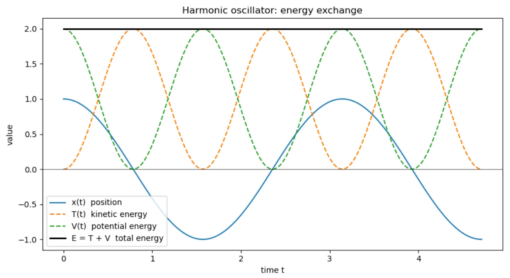
<figcaption>Harmonic oscillator: kinetic and potential energy exchange while total energy stays constant</figcaption>
</figure>

* When the mass passes through the equilibrium position ($$x = 0$$), speed is maximum: all energy is kinetic
* At the turning points ($$x = \pm A$$), speed is zero: all energy is potential
* The black line $$E = T + V$$ is perfectly flat -- energy is conserved


<figure style="max-width: 600px; margin: auto; text-align: center;">
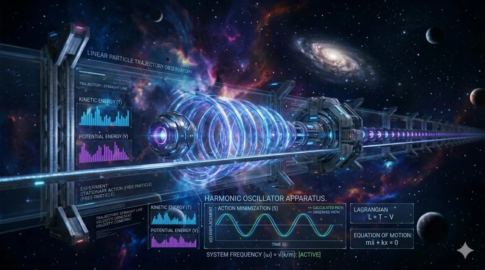
<figcaption>Studying mass-spring system with the principle of least action</figcaption>
</figure>


<!-- ########################################### -->
<!-- ########################################### -->
<!-- ########################################### -->
<!-- ########################################### -->
<!-- ########################################### -->
<!-- ########################################### -->
<!-- ########################################### -->
<!-- ########################################### -->
<!-- ########################################### -->
<!-- ########################################### -->
<!-- ########################################### -->
<!-- ########################################### -->
<!-- ########################################### -->
<!-- ########################################### -->
<!-- ########################################### -->


<!-- ###################################################################### -->
<!-- ###################################################################### -->
<!-- ###################################################################### -->
## Can we explain why a ball falls vertically while accelerating?


<!-- Ok... So using the action principle let's work through the reasoning step by step for a ball falling vertically under gravity. We will keep things simple and clear. -->


<!-- ###################################################################### -->
### 1. Define the variables
{: .no_toc }

Let:

* $$h(t)$$ = height of the ball at time $$t$$
* $$v(t) = \dot{h}(t) = \frac{dh}{dt}$$ = velocity
* $$m$$ = mass of the ball (it cancels out in the end)
* $$g$$ = gravitational acceleration

Kinetic energy:

$$
T = \frac{1}{2} m \dot{h}^2
$$

Potential energy:
$$
V = m g h
$$

The Lagrangian:
$$
L = T - V = \frac{1}{2} m \dot{h}^2 - m g h
$$


<!-- ###################################################################### -->
### 2. Derive the Euler-Lagrange equation
{: .no_toc }

Let us take the time to explain where the Euler-Lagrange equation comes from.


#### **1. Starting idea**
{: .no_toc }

We have the action principle:

$$
S[h(t)] = \int_{t_1}^{t_2} L(h, \dot{h}) , dt
$$

The ball "chooses" the path $$h(t)$$ that makes $$S$$ stationary with respect to small variations of the path.

We therefore consider a slightly modified path:

$$
h(t) \to h(t) + \epsilon \eta(t)
$$

* $$\eta(t)$$ is a small arbitrary function that vanishes at the endpoints $$t_1$$ and $$t_2$$ (we do not change the start and end points).
* $$\epsilon$$ is a small number measuring the size of the variation.

The action principle requires:

$$
\frac{d}{d\epsilon} S[h(t) + \epsilon \eta(t)] \Big|_{\epsilon=0} = 0
$$

That is, the derivative of the action with respect to this small variation is zero.


#### **2. Expand**
{: .no_toc }

Substitute $$L$$:

$$
S[h+\epsilon \eta] = \int_{t_1}^{t_2} L(h + \epsilon \eta, \dot{h} + \epsilon \dot{\eta}) dt
$$

Differentiate with respect to $$\epsilon$$ and evaluate at $$\epsilon = 0$$:

$$
\delta S = \int_{t_1}^{t_2} \left( \frac{\partial L}{\partial h} \eta + \frac{\partial L}{\partial \dot{h}} \dot{\eta} \right) dt = 0
$$


#### **3. Integration by parts**
{: .no_toc }

We want to eliminate $$\dot{\eta}$$ and keep only $$\eta$$. We integrate the second term by parts:

$$
\int_{t_1}^{t_2} \frac{\partial L}{\partial \dot{h}} \dot{\eta} , dt = \left[ \frac{\partial L}{\partial \dot{h}} \eta \right]_{t_1}^{t_2} - \int_{t_1}^{t_2} \frac{d}{dt} \left( \frac{\partial L}{\partial \dot{h}} \right) \eta  dt
$$

Since $$\eta(t_1) = \eta(t_2) = 0$$, the boundary term vanishes. What remains is:

$$
\delta S = \int_{t_1}^{t_2} \left( \frac{\partial L}{\partial h} - \frac{d}{dt} \frac{\partial L}{\partial \dot{h}} \right) \eta  dt = 0
$$


#### **4. Arbitrariness of $$\eta$$**
{: .no_toc }

This integral must vanish for every arbitrary function $$\eta(t)$$. The only way this is always true is if the coefficient of $$\eta$$ is zero:

$$
\frac{d}{dt} \frac{\partial L}{\partial \dot{h}} - \frac{\partial L}{\partial h} = 0
$$

This is the Euler-Lagrange equation.


In summary:

1. Perturb the path with a small variation.
2. Require the variation of the action to be zero.
3. Integration by parts yields a condition on $$h(t)$$: the Euler-Lagrange equation.


<!-- ###################################################################### -->
### 3. Write the Euler-Lagrange equation
{: .no_toc }


The action principle says:
$$
\delta S = \delta \int_{t_1}^{t_2} L(h, \dot{h}) dt = 0
$$

The Euler-Lagrange equation we just derived says:
$$
\frac{d}{dt} \frac{\partial L}{\partial \dot{h}} - \frac{\partial L}{\partial h} = 0
$$

Let us compute the partial derivatives:

1. $$\frac{\partial L}{\partial \dot{h}} = m \dot{h}$$
2. $$\frac{d}{dt} \frac{\partial L}{\partial \dot{h}} = m \ddot{h}$$
3. $$\frac{\partial L}{\partial h} = - m g$$

The equation therefore becomes:
$$
m \ddot{h} - (- m g) = 0 \quad \Rightarrow \quad m \ddot{h} + m g = 0 \quad \Rightarrow \quad \ddot{h} = - g
$$

Exactly the vertical acceleration under gravity.


<!-- ###################################################################### -->
### 4. Integrate to find the trajectory
{: .no_toc }

Integrating twice gives the height:

$$
\dot{h}(t) = \dot{h}_0 - g t
$$

$$
h(t) = h_0 + \dot{h}_0 t - \frac{1}{2} g t^2
$$

* $$h_0$$ = initial height
* $$\dot{h}_0$$ = initial velocity (often 0 if the ball is dropped)

For a ball released from rest:
$$
\dot{h}_0 = 0 \quad \Rightarrow \quad h(t) = h_0 - \frac{1}{2} g t^2
$$

This is exactly the uniformly accelerated free fall we already know.


<!-- ########################################### -->
<!-- ########################################### -->
<!-- ########################################### -->
<!-- ########################################### -->
<!-- ########################################### -->
<!-- ########################################### -->
<!-- ########################################### -->
<!-- ########################################### -->
<!-- ########################################### -->
<!-- ########################################### -->
<!-- ########################################### -->
<!-- ########################################### -->
<!-- ########################################### -->
<!-- ########################################### -->
<!-- ########################################### -->


<!-- ###################################################################### -->
<!-- ###################################################################### -->
<!-- ###################################################################### -->
## How Maxwell's equations can be derived from a variational principle?

The amazing thing is that the four Maxwell equations can be obtained from a single variational principle, exactly like $$F = ma$$.

But there is one big conceptual jump:

* Instead of finding the “best trajectory” $$x(t)$$ of a particle,
* We now look for the “best configuration” of fields in space and time.

So we are no longer minimizing a path... We are minimizing how fields behave everywhere.


<figure style="max-width: 600px; margin: auto; text-align: center;">
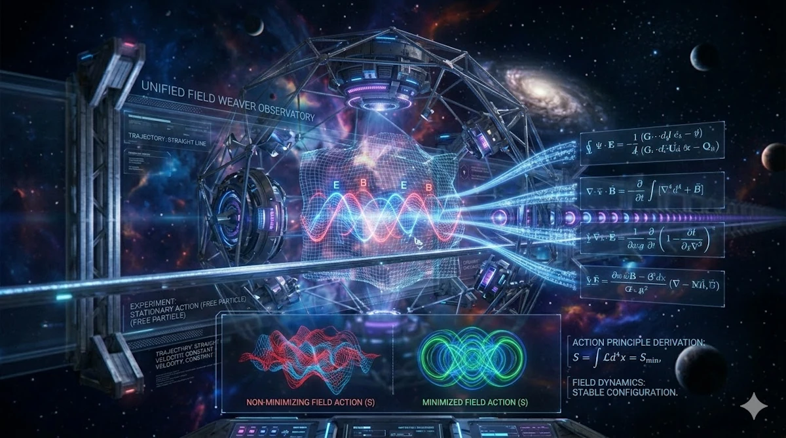
<figcaption>How Maxwell's equations can be derived from a variational principle?</figcaption>
</figure>


<!-- ########################################### -->
### 1. From particles to fields
{: .no_toc }

In mechanics, everything depended on a single function:

* Variable: $$x(t)$$
* Action:
  $$
  S = \int L(x,\dot x,t) \, dt
  $$

We varied this function and obtained an equation of motion. In electromagnetism, things are richer. Instead of one function, we now have fields defined at every point in space and time:

* Electric field $$ \mathbf{E}(x,t) $$
* Magnetic field $$ \mathbf{B}(x,t) $$

So instead of a curve, we are dealing with objects that fill space.


#### **Why not vary $$\mathbf{E}$$ and $$\mathbf{B}$$ directly?**
{: .no_toc }

At first glance, it would seem natural to vary $$\mathbf{E}$$ and $$\mathbf{B}$$ but there is a problem:

* They are not independent.
* They must satisfy certain constraints (like Faraday’s law).

This makes the variational calculation messy.


#### **A smarter choice: Add a level of indirection in the form of potentials**
{: .no_toc }

Instead, we introduce more fundamental quantities:

* Scalar potential $$\phi$$
* Vector potential $$\mathbf{A}$$

From these, the fields are defined as:

$$
\mathbf{E} = -\nabla \phi - \frac{\partial \mathbf{A}}{\partial t}
$$

$$
\mathbf{B} = \nabla \times \mathbf{A}
$$


#### **Why is this useful?**
{: .no_toc }

Because now:

* $$\phi$$ and $$\mathbf{A}$$ are two independent variables
* $$\mathbf{E}$$ and $$\mathbf{B}$$ are automatically constructed

And something remarkable happens. Indeed, two of Maxwell’s equations are already built into these definitions. We will come back to that later.


<!-- ########################################### -->
### 2. The electromagnetic action
{: .no_toc }

For fields, the action is no longer just over time. We must integrate over all space and time:

$$
S = \int L \, d^3x \, dt
$$

Here, $$L$$ is no longer just a Lagrangian. It is a Lagrangian density (energy per unit volume). Watch out. We have $$L \, d^3x$$, this is a Lagrangian density mutlitplied bt a volume $$\rightarrow$$ Lagrangian.


The electromagnetic Lagrangian density is:

$$
L = \frac{\epsilon_0}{2}(E^2 - c^2 B^2) - \rho \phi - \mathbf{J}\cdot \mathbf{A}
$$

where:

* $$\rho$$ = charge density
* $$\mathbf{J}$$ = current density


#### **Let’s slow down and interpret each term**
{: .no_toc }

This is crucial.

| Term                             | Meaning                                               |
| -------------------------------- | ----------------------------------------------------- |
| $$\frac{\epsilon_0}{2}E^2$$      | Energy stored in the electric field                   |
| $$-\frac{\epsilon_0}{2}c^2 B^2$$ | Energy stored in the magnetic field                   |
| $$-\rho \phi$$                   | Interaction between charges and the scalar potential  |
| $$-\mathbf{J}\cdot \mathbf{A}$$  | Interaction between currents and the vector potential |


So the action contains:

* Energy of the fields themselves
* Plus how they interact with matter

This plays the same role as $$L = T - V$$ in mechanics, but for fields. The terms in $$E^2$$ and $$B^2$$ correspond to energy stored in the field, while the terms involving $$\rho$$ and $$\mathbf{J}$$ describe how the field interacts with matter.


<!-- ########################################### -->
### 3. Apply the variational principle
{: .no_toc }

The rule is unchanged:

$$
\delta S = 0
$$

But what do we vary?

* Not a trajectory anymore
* We vary the fields themselves

$$
\phi \rightarrow \phi + \delta \phi
$$

$$
\mathbf{A} \rightarrow \mathbf{A} + \delta \mathbf{A}
$$


#### **What does “varying a field” mean?**
{: .no_toc }

It means:

* slightly changing its value
* at every point in space and time

and asking:

> *Does the action increase or decrease?*

And once we answer the question, the physical fields (the reality) are the ones that make the action stationary.


#### **The field Euler–Lagrange equation**
{: .no_toc }

For any field $$q$$, the equation becomes:

$$
\partial_\mu
\left(
\frac{\partial L}{\partial (\partial_\mu q)}
\right)
-
\frac{\partial L}{\partial q}
= 0
$$

This looks intimidating, but it is just the continuous version of:

$$
\frac{d}{dt}\left(\frac{\partial L}{\partial \dot q}\right) - \frac{\partial L}{\partial q} = 0
$$

This is the field version of the Euler–Lagrange equation.


<!-- ########################################### -->
### 4. Vary the scalar potential
{: .no_toc }

Now we apply the rule to $$\phi$$.

Important idea:

* $$\phi$$ only appears in $$\mathbf{E}$$ and in the term $$-\rho \phi$$

So when we vary $$\phi$$, we are really changing:

* The electric field
* The interaction with charge

After working through the derivatives (this is the technical part), everything simplifies to:

$$
\nabla \cdot \mathbf{E} = \frac{\rho}{\epsilon_0}
$$


This is Gauss’s law. So one Maxwell equation comes directly from $$\delta S = 0$$.


<!-- ########################################### -->
### 5. Vary the vector potential
{: .no_toc }

Now we vary $$\mathbf{A}$$.

This affects:

* $$\mathbf{E}$$ (through the time derivative)
* $$\mathbf{B}$$ (through the curl)
* The interaction term $$\mathbf{J} \cdot \mathbf{A}$$

Again, after a (long but systematic) calculation, we obtain:

$$
\nabla \times \mathbf{B} -
\frac{1}{c^2} \frac{\partial \mathbf{E}}{\partial t}
\mu_0 \mathbf{J}
$$


This is the Ampère–Maxwell law. Now we have two equations out of four.


<!-- ########################################### -->
### 6. The other two equations appear automatically
{: .no_toc }

This is one of the most beautiful parts. Remember how we defined:

$$
\mathbf{B} = \nabla \times \mathbf{A}
$$

Take the divergence:

$$
\nabla \cdot \mathbf{B} = \nabla \cdot (\nabla \times \mathbf{A})
$$

But a fundamental identity in vector calculus says:

$$
\nabla \cdot (\nabla \times \text{anything}) = 0
$$

So:

$$
\nabla \cdot \mathbf{B} = 0
$$


* This is Gauss’s law for magnetism.
* It is not derived, it is automatically true (because how A was designed)


Now for the electric field:

$$
\mathbf{E} = -\nabla \phi - \frac{\partial \mathbf{A}}{\partial t}
$$

Take the curl:

$$
\nabla \times \mathbf{E}=
-\nabla \times (\nabla \phi)
\frac{\partial}{\partial t}(\nabla \times \mathbf{A})
$$

Again, an identity:

$$
\nabla \times (\nabla \phi) = 0
$$

So we get:

$$
\nabla \times \mathbf{E}
=
-\frac{\partial \mathbf{B}}{\partial t}
$$

This is Faraday’s law.


<!-- ########################################### -->
### 7. The four Maxwell equations
{: .no_toc }

We now have the full set:

**Gauss law**

$$
\nabla \cdot \mathbf{E} = \frac{\rho}{\epsilon_0}
$$

**Gauss law for magnetism**

$$
\nabla \cdot \mathbf{B} = 0
$$

**Faraday law**

$$
\nabla \times \mathbf{E} =
-\frac{\partial \mathbf{B}}{\partial t}
$$

**Ampère–Maxwell law**

$$
\nabla \times \mathbf{B} =
\mu_0 \mathbf{J} +
\frac{1}{c^2}\frac{\partial \mathbf{E}}{\partial t}
$$

All four equations come from:

* One choice of variables ($$\phi, \mathbf{A}$$)
* One Lagrangian
* One principle: $$ \delta S = 0 $$

Smoking!


<!-- ########################################### -->
### 8. Why this is conceptually powerful
{: .no_toc }


The variational approach reveals deep structure.


#### **1. Symmetry**
{: .no_toc }

The action is invariant under gauge transformations:

$$
A \rightarrow A + \nabla \chi
$$

$$
\phi \rightarrow \phi - \partial_t \chi
$$

This symmetry explains charge conservation.


#### **2. Relativity**
{: .no_toc }

The electromagnetic action is naturally written in relativistic form.

That is why electromagnetism fits perfectly with special relativity.


#### **3. Field theory structure**
{: .no_toc }

The same framework works for:

* Electromagnetism
* Quantum fields
* The Standard Model
* Gravity

So Maxwell theory is actually the first modern field theory.


<!-- ########################################### -->
### 9. A beautiful consequence: light
{: .no_toc }

If we remove charges ($$\rho=0$$, $$J=0$$) and combine Maxwell equations, we obtain

$$
\nabla^2 \mathbf{E} =
\frac{1}{c^2}
\frac{\partial^2 \mathbf{E}}{\partial t^2}
$$

This is the wave equation.

Meaning:

> *Electromagnetic fields propagate as waves.*

The wave speed is

$$
c = \frac{1}{\sqrt{\mu_0\epsilon_0}}
$$

which turned out to be exactly the speed of light.

This is how Maxwell predicted that light is an electromagnetic wave.


<!-- ########################################### -->
### 10. Summary
{: .no_toc }

Just like $$F=ma$$ comes from extremizing

$$
S=\int (T-V),dt
$$

Maxwell’s equations come from extremizing the electromagnetic field action

$$
S=\int L(E,B,\rho,J) \, d^3x \, dt
$$

Nature seems to follow a universal rule:

> *The laws of physics come from making an action stationary.*


<!-- ########################################### -->
<!-- ########################################### -->
<!-- ########################################### -->
<!-- ########################################### -->
<!-- ########################################### -->
<!-- ########################################### -->
<!-- ########################################### -->
<!-- ########################################### -->
<!-- ########################################### -->
<!-- ########################################### -->
<!-- ########################################### -->
<!-- ########################################### -->
<!-- ########################################### -->
<!-- ########################################### -->
<!-- ########################################### -->


<!-- ###################################################################### -->
<!-- ###################################################################### -->
<!-- ###################################################################### -->
## All of this is quite reminiscent of Feynman integrals. No?

What we see with the principle of action is indeed very similar to the idea behind Feynman integrals in quantum mechanics. Let's try to establish the connection:


<!-- ###################################################################### -->
### 1. Classical vs quantum
{: .no_toc }

* Classical: the object follows a single path that makes the action $$S$$ stationary.
* Quantum: a particle explores all possible paths between two points, not just the one that minimizes the action. Each path contributes with a complex weight:

$$
\text{Amplitude} \sim e^{i S/\hbar}
$$

* $$S$$ = action for that path
* $$\hbar$$ = reduced Planck constant

The classical path emerges as the one for which contributions from neighboring paths add constructively, while "odd" paths cancel out by interference.


<!-- ###################################################################### -->
### 2. Intuition
{: .no_toc }

* Classically, $$\delta S = 0$$ selects the real path.
* Quantum mechanically, all paths exist, but the classical path corresponds to the maximum of constructive interference, which explains why classical laws emerge at large scales.


<!-- ###################################################################### -->
### 3. So yes
{: .no_toc }

The action principle can be seen as the "classical limit" of the Feynman path integral.

* Both start from the same idea: an action associated with each path.
* The difference: classically one path is chosen; quantum mechanically all paths are summed over.


<!-- ###################################################################### -->
<!-- ###################################################################### -->
<!-- ###################################################################### -->
## Conclusion

Remember that highway, past midnight, everyone asleep? That stubborn question that wouldn't leave:

> *Why does physics use so many first- and second-order derivatives?*

We now have an answer. Several, actually.

Derivatives appear because nature evolves continuously, and the most natural way to describe continuous change is to ask: *what is happening right now, compared to an instant ago?* That question, asked at every point in space and time, is precisely what a derivative is. And because most physical systems have inertia (they remember their velocity) the laws governing them are naturally second-order.

But we went further than that. We discovered that the three great equations of classical physics (heat, waves, quantum mechanics) all share the same skeleton: a time derivative on the left, a Laplacian on the right. Not a coincidence. Locality, symmetry, and conservation laws are so constraining that they leave very little room for the mathematics to differ.

Then came the deeper shift. Differential equations describe physics locally, step by step, from one instant to the next. But there is another language entirely: instead of asking "what force acts here?" we ask "which path, among all possible paths, does nature actually take?" And the answer is: the one that makes the action stationary.

$$
S = \int_{t_1}^{t_2} L(x, \dot{x}, t)\, dt
$$

This is not just a computational trick. It is a different way of thinking about physical law. Nature does not push particles forward with forces. It selects trajectories globally, as if evaluating all possibilities at once and choosing the one that balances kinetic and potential energy in the most efficient way.

From that single principle, Newton's laws, Maxwell's equations, and the Schrodinger equation all fall out. Emmy Noether (watch the video below) then showed that the symmetries of the action are the deepest reason conservation laws exist: time invariance gives energy conservation, spatial invariance gives momentum conservation. The structure runs very deep.

And here is what I find genuinely striking: this same logic shows up far outside physics.

When a neural network learns, it minimizes a loss function over billions of possible parameter configurations. It searches for the path through parameter space that makes something stationary. When a reinforcement learning agent plans ahead, it does not just react locally to the next state; it evaluates entire sequences of decisions and selects the trajectory that maximizes a cumulative reward. The agent, in a very real sense, extremizes its own action.

Nature and intelligence turn out to share the same underlying move: among all possible paths, find the one that matters.

That is not a metaphor. It is the same mathematics.

The highway is still out there, mostly empty, the night still quiet. But the question has an answer now. And the answer, as it usually is in physics, turns out to be more beautiful than the question deserved.


<!-- ###################################################################### -->
<!-- ###################################################################### -->
<!-- ###################################################################### -->
## Webliography

### US
{: .no_toc }
* ...

<figure style="max-width: 225px; margin: auto; text-align: center;">
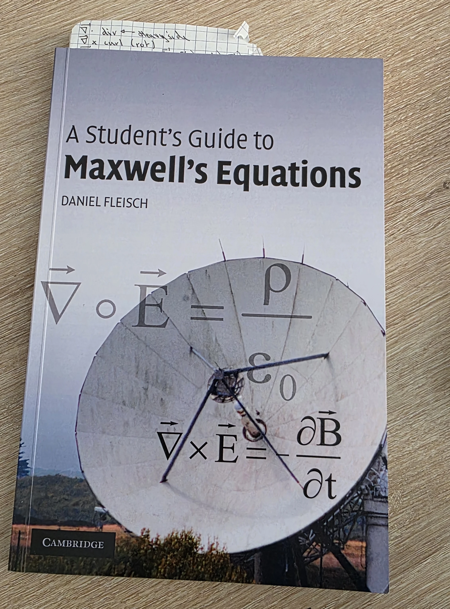
<figcaption>A Student's Guide to Maxwell's Equations</figcaption>
</figure>


### FR
{: .no_toc }
Your favorit browser should be able to translate if needed.

* [Forme intégrale et différentielle de la loi de Gauss]()
* [Chainette]()
* [Equation Différentielle du 1er Ordre]()
* [Equation de Bernoulli]()
* [Dérivées et Différentielles]()
* [Equation d'onde]()
* [Distance la plus courte entre 2 points]()
* [Gradient Descent in 1, 2 or N dimensions]()


<figure style="max-width: 560px; margin: auto;">
  <div style="position: relative; padding-bottom: 56.25%; height: 0;">
    <iframe
      src="https://www.youtube.com/embed/MIeYz6aMBbk"
      title="Le principe de moindre action - Passe-science #6"
      style="position: absolute; inset: 0; width: 100%; height: 100%;"
      allowfullscreen>
    </iframe>
  </div>
  <figcaption style="text-align: center;">
    Le principe de moindre action - Passe-science #6
  </figcaption>
</figure>

<figure style="max-width: 225px; margin: auto; text-align: center;">
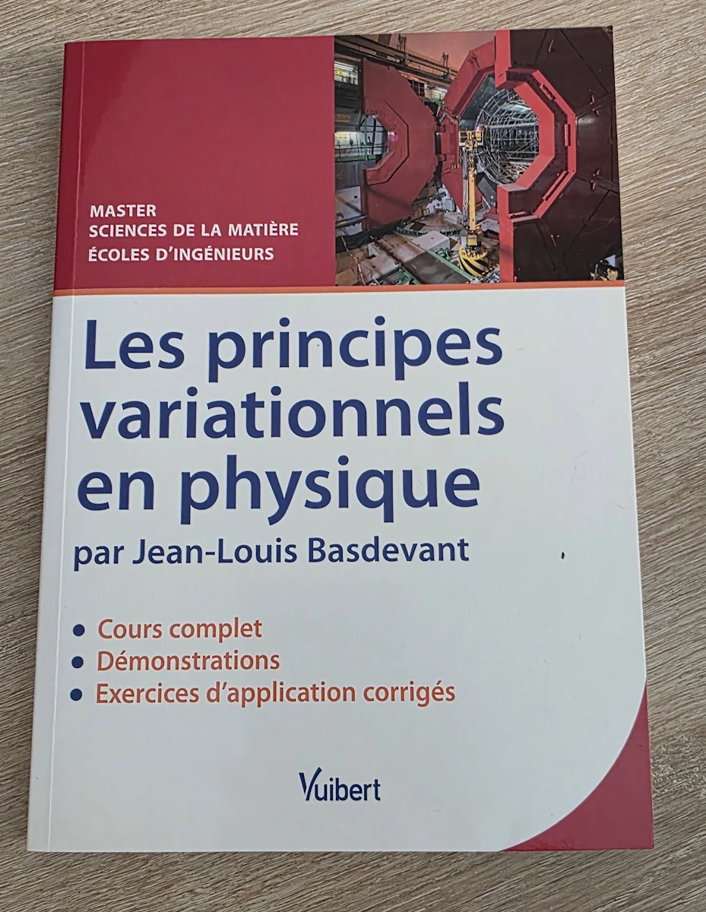
<figcaption>Les principes variationnels en physique</figcaption>
</figure>


<figure style="max-width: 225px; margin: auto; text-align: center;">
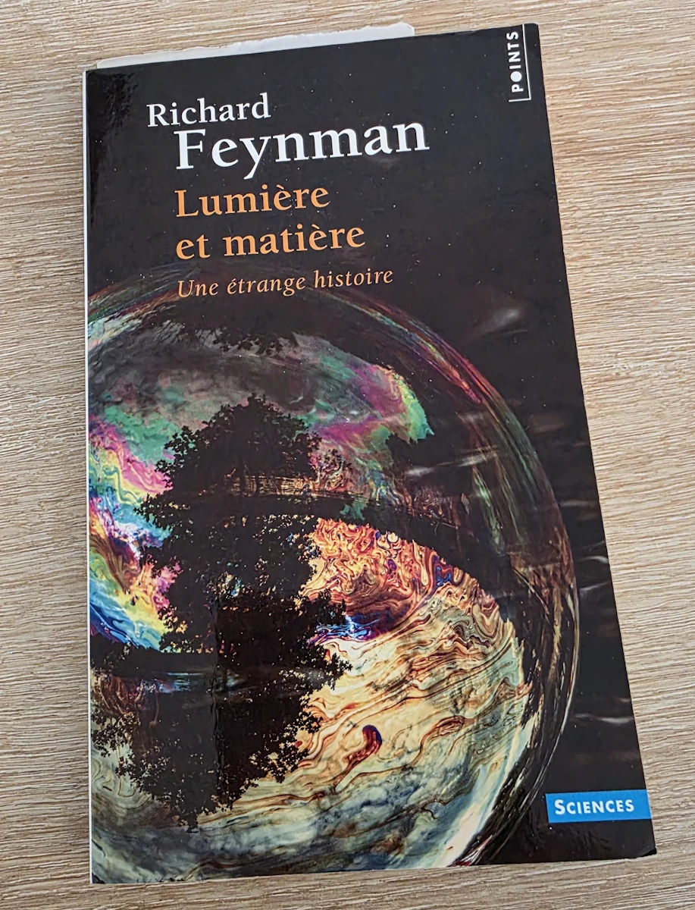
<figcaption>Lumière et Matière</figcaption>
</figure>
