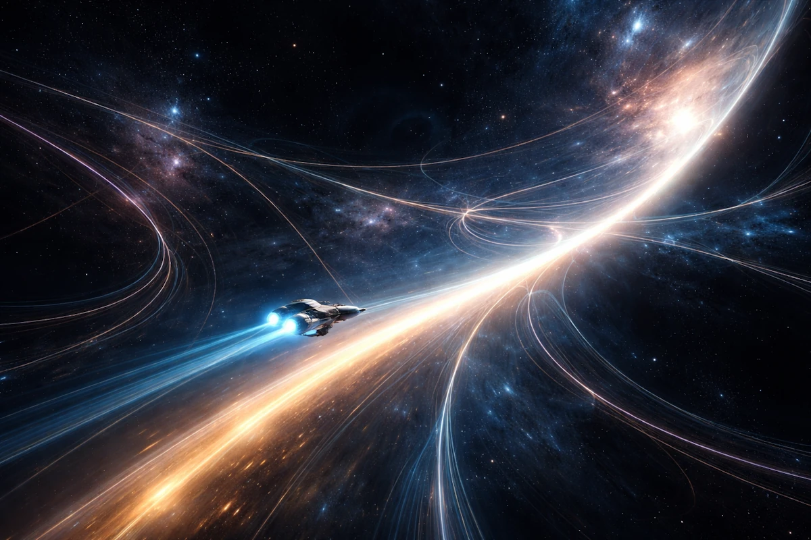
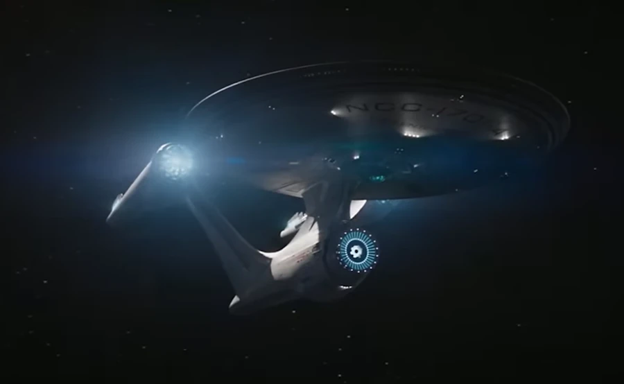
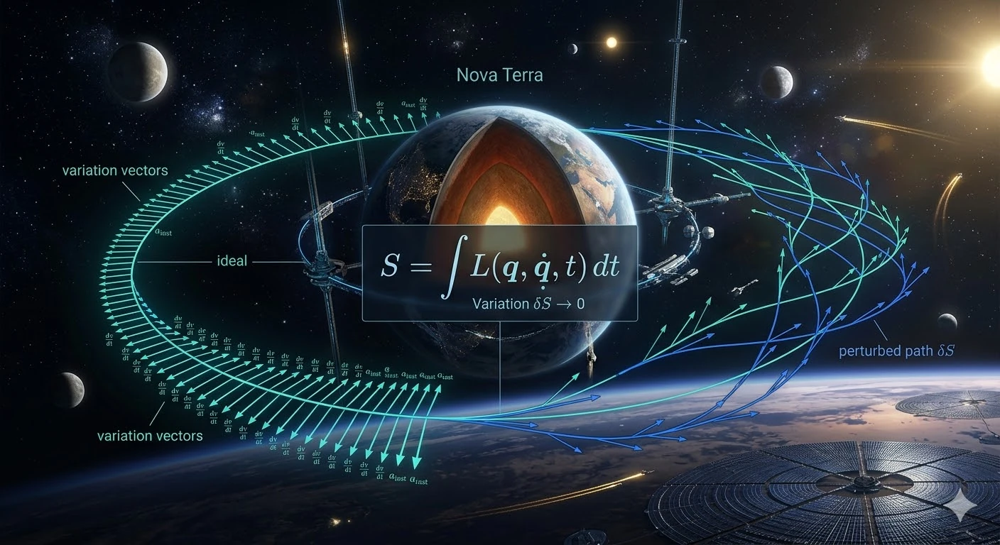

<!--
* Comment présenter à un élève de terminale qui sait à peu près ce qu'est une dérivée et une intégrale?
* Dans "What is a variational principle (in general)?". Revenir sur ces histoire de fonctionnelle (fonction de fonction). Pourquoi on en a besoin.
* Dans la Conclusion. Parler du chemin optimum qu'emprunte une IA/Agent pour résoudre un problème
-->

# From Derivatives to Action: How Physics Describes Change
{: .no_toc }
<!-- # Why derivatives and differential equations in physics -->

Building intuition from local laws, differential equations, and variational principles
{: .lead }

<h2 align="center">
<b> 🚧 This post is under construction. First draft 🚧</b>
</h2>

<!-- ###################################################################### -->
<!-- ###################################################################### -->
<!-- ###################################################################### -->
## TL;DR
{: .no_toc }

* Action $$S = \int_{t_1}^{t_2} L(x,\dot x,t),dt$$
* Lagrangian $$L$$

<figure style="text-align: center;">

<figcaption>Among infinitely many possible trajectories, nature selects the one that extremizes the action.</figcaption>
</figure>

<!-- ###################################################################### -->
<!-- ###################################################################### -->
<!-- ###################################################################### -->
## Table of Contents
{: .no_toc .text-delta}
- TOC
{:toc}

> *Space: the final frontier.*
>
> *These are the voyages of a curious mind, on a lifelong quest to decode the deep architecture of reality.*
>
> *Its ongoing mission: to explore why the laws of physics are written in the language of change... to uncover how motion itself is governed by the beauty of variation... and to trace the hidden principle that dictates every path through the cosmos.*
>
> *To look beyond equations as mere symbols, to see in them the signature of a deeper order... where, among all possible worlds, nature chooses the one that speaks of balance.*

<figure style="text-align: right;">

<figcaption>...</figcaption>
</figure>

<!-- ###################################################################### -->
<!-- ###################################################################### -->
<!-- ###################################################################### -->
## Introduction

It’s on the way, just taking a little longer than expected.

<!-- ###################################################################### -->
<!-- ###################################################################### -->
<!-- ###################################################################### -->
## Why derivatives and differential equations in physics?

Can we take the time to explain why we so often encounter first- or second-order differential equations, as well as derivatives, in physics formulas? I understand
$$F=ma$$, but I don’t understand how it was derived, from where it comes from... Same thing for the wave equation or heat propagation equation, etc.

Great question Marty! The short answer is: derivatives appear in physics because nature evolves continuously in time and space, and differential equations express how a system changes locally. But it's worth unpacking this slowly from first principles.

<!-- ###################################################################### -->
### 1. In Physics wr try to describe how things change
{: .no_toc }

Most physical phenomena involve change:

* Position changes with time
* Temperature changes in space
* Velocity changes due to forces
* Electric fields vary in space and time

Mathematically, the cleanest way to describe change is with a derivative.

For a quantity $$x(t)$$, which express where you are in function of time:

* Velocity: $$v = \frac{dx}{dt}$$
* Acceleration: $$a = \frac{d^2x}{dt^2}$$

So the moment we want to describe motion, derivatives appear naturally.

#### **Side Note**
{: .no_toc }

I hope this is clear and that you can picture what is going on, because this matters for what follows. Imagine you are walking along a straight, flat road. You take one step of 1 m every second (you are taller than me). So if I take a photo every second, I will see you moving to the right, say. From the starting point you will pass through positions 1 m, 2 m, and so on. In that context, this is exactly what $$x(t)$$ means. Clear? Good. Now, what is your speed? If you are not sure, remember that on highways we drive at 130 km/h. Speed is a distance divided by a time: it is the change in your position $$x$$ over a time interval, the ratio $$\frac{dx}{dt}$$ (where $$dx$$ and $$dt$$ stand for "change in $$x$$" and "change in $$t$$" respectively). Finally, acceleration is the change in speed over a time interval. That is what pushes you back into your car seat when you accelerate. But speed is already the change in $$x$$ over a time interval, so acceleration is the ratio $$\frac{d^2x}{dt^2}$$.

<!-- ###################################################################### -->
### 2. Why equations are often first or second order
{: .no_toc }

This is not arbitrary. It comes from how many levels of change influence the system.

#### **First derivative -> flow / transport**
{: .no_toc }

If a phenomenon depends only on the rate of change, we get first-order equations.

Example: radioactive decay

Experimentation: We measure that the speed at which nuclei disappear is proportional to how many remain.

Interpretation: Speed of means $$\frac{dN}{dt}$$, is proportional means $$\lambda$$, how many reamain means $$N$$, disappear means $$-$$. Tadaaa!

$$\frac{dN}{dt} = -\lambda N$$

This law is local and simple. More atoms means more decay events per second. The formula leads to the exponential decay.

#### **Second derivative -> dynamics / inertia**
{: .no_toc }

Second derivatives appear when acceleration matters.

Example:

$$F = ma$$

But acceleration is

$$a = \frac{d^2x}{dt^2}$$

So Newton's law becomes

$$F = m \frac{d^2x}{dt^2}$$

Why second order?

Because inertia exists. A body remembers its velocity.

To know the future motion, we must know:

* position
* velocity

Two initial conditions means second order equation.

<!-- ###################################################################### -->
### 3. But how did Newton discover $$F = ma$$?
{: .no_toc }

Important point: Newton did not guess the equation randomly. It emerged from experiments + symmetry principles.

#### **Observations known before Newton**
{: .no_toc }

Galileo had already measured that:

* objects fall with constant acceleration
* motion without forces means constant velocity

Believe it or not, Galileo was the first to measure it experimentally. Launching watermelons from the top of the Pisa tower is certainly a legend. He more certainly used inclined plans (to slow down the falls). Thanks to Aristotle, until then, people assumed the speed of falling bodies was proportional to their weight.

Galileo's experiments implies:

$$a = \text{constant when force is constant}$$

Then experiments showed:

* double the force -> double the acceleration
* double the mass -> half the acceleration

So empirically:

$$a \propto \frac{F}{m}$$

Which gives

$$F = ma$$

So it is really an empirical law extracted from experiments.

<!-- ###################################################################### -->
### 4. Why physics prefers local laws
{: .no_toc }

Most physical laws describe local behavior:

Instead of saying

> "The temperature everywhere depends on the whole system"

Nature usually says something simpler:

> "What happens here depends on what is happening just next to it."

This locality leads directly to derivatives.

Example:

Temperature $$T(x,t)$$

The heat flowing through a point depends on the temperature gradient:

$$\text{Heat flow} \propto - \nabla T$$

That gradient ($$\nabla$$) sign in called Nabla. Think about you on your snowboard when you are looking, in 3D, for the greatest slope. You are looking for the greatest gradient. When we deal with 1D problems ($$f(x)=x^2$$) the gradient is our good old and beloved derivative.

<!-- ###################################################################### -->
### 5. Example: heat equation
{: .no_toc }

The heat equation is

$$\frac{\partial T}{\partial t} = \kappa \nabla^2 T$$

This looks complicated but comes from two simple physical statements.

#### **1 Heat flows from hot to cold**
{: .no_toc }

This is the Fourier law:

$$q = -k \nabla T$$

Heat flux depends on temperature gradient.

#### **2 Energy is conserved**
{: .no_toc }

Change of temperature = heat entering − heat leaving.

Mathematically this gives

$$\frac{\partial T}{\partial t} = - \nabla \cdot q$$

Substitute $$q$$:

$$\frac{\partial T}{\partial t} = \kappa \nabla^2 T$$

So the second derivative appears because:

* heat flow depends on gradient
* conservation introduces divergence

Gradient of gradient, this is the Laplacian.

<!-- ###################################################################### -->
### 6. Why differential equations appear everywhere?
{: .no_toc }

Almost every physical theory has three ingredients:

#### 1. Locality
{: .no_toc }

What happens here depends on nearby values. This translates in derivatives in space

#### **2. Continuous time evolution**
{: .no_toc }

Future depends on current rate of change. This translates derivatives in time

#### **3. Conservation laws**
{: .no_toc }

Energy, momentum, charge, mass…

These are expressed mathematically using divergences and derivatives.

<!-- ###################################################################### -->
### 7. Why order 2 is extremely common
{: .no_toc }

Most fundamental laws in physics are second order because:

* systems have inertia
* energy depends on velocity squared
* conservation of momentum naturally leads to acceleration

Examples:

* Newtonian mechanics
* wave equation
* Schrödinger equation (first order in time but second in space)
* Maxwell equations (effectively second order)

<!-- ###################################################################### -->
### 8. Summary
{: .no_toc }

We see derivatives everywhere because physics tries to answer:

> How does the state of the system change locally?

Derivatives are simply the mathematical language of change.

And differential equations express:

> The rate of change of something depends on the current state of the system.

A good mental model is:

Physics laws are like rules of evolution.

They don't tell us the whole trajectory.

They only say:

> If the system is like this right now, then it will start changing like that.

That is exactly what a differential equation describes.

<!-- ########################################### -->
<!-- ########################################### -->
<!-- ########################################### -->
<!-- ########################################### -->
<!-- ########################################### -->
<!-- ########################################### -->
<!-- ########################################### -->
<!-- ########################################### -->
<!-- ########################################### -->
<!-- ########################################### -->
<!-- ########################################### -->
<!-- ########################################### -->
<!-- ########################################### -->
<!-- ########################################### -->
<!-- ########################################### -->

<!-- ###################################################################### -->
<!-- ###################################################################### -->
<!-- ###################################################################### -->
## Why the heat equation, the wave equation and the Schrödinger equation look so similar?

Once we see the common structure, a lot of physics suddenly becomes less mysterious.

We’ll go step by step.

<!-- ###################################################################### -->
### 1. The common mathematical structure
{: .no_toc }

Many physical phenomena involve a quantity that depends on space and time:

$$
u(x,t)
$$

Examples:

* temperature $$T(x,t)$$
* displacement of a string $$y(x,t)$$
* quantum wavefunction $$\psi(x,t)$$

In all three cases, the evolution of the system takes the form:
v
$$
\text{time change} = \text{spatial variation}
$$

The spatial variation is usually measured by the Laplacian:

$$
\nabla^2
$$

which is basically the second derivative in space.

Why the second derivative? Because it measures curvature.

<!-- ###################################################################### -->
### 2. The physical meaning of the second spatial derivative
{: .no_toc }

Imagine a function (u(x)).

The second derivative tells us whether the value at a point is:

* higher than its neighbors
* lower than its neighbors

Graphically:

* $$u'' > 0$$ implies valley
* $$u'' < 0$$ implies hill

So the second derivative tells us how different a point is from its surroundings.

And many physical processes try to reduce those differences or react to them.

That’s why the Laplacian appears everywhere.

<!-- ###################################################################### -->
### 3. Example 1: heat diffusion
{: .no_toc }

The heat equation is

$$
\frac{\partial T}{\partial t} = \kappa \nabla^2 T
$$

Interpretation:

* if a point is hotter than its neighbors, heat flows away
* if a point is colder than neighbors, heat flows in

So temperature differences smooth out over time.

The Laplacian measures exactly that difference.

Result: the system diffuses.

<!-- ###################################################################### -->
### 4. Example 2: waves
{: .no_toc }

The wave equation is:

$$
\frac{\partial^2 u}{\partial t^2} = c^2 \nabla^2 u
$$

Example: vibrating string.

Here the interpretation is different. If a point on the string is curved, tension pulls it back toward equilibrium. More curvature means stronger restoring force. That force produces acceleration, which is why the time derivative is second order.

So:

* curvature means force
* force means acceleration

Thus:

$$
\text{acceleration} \propto \text{curvature}
$$

This produces waves instead of diffusion.

<!-- ###################################################################### -->
### 5. Example 3: quantum mechanics
{: .no_toc }

The Schrödinger equation is

$$
i\hbar \frac{\partial \psi}{\partial t} =
-\frac{\hbar^2}{2m} \nabla^2 \psi + V\psi
$$

This also contains the Laplacian.

Why?

Because the Laplacian corresponds to kinetic energy.

In fact, the kinetic energy operator is:

$$
-\frac{\hbar^2}{2m}\nabla^2
$$

So again:

* spatial curvature determines how the wavefunction evolves.

The mathematics ends up looking surprisingly similar to diffusion or waves.

<!-- ###################################################################### -->
### 6. The deep unifying idea
{: .no_toc }

In many physical systems:

$$
\text{time evolution} = \text{spatial curvature}
$$

The curvature represents how different a point is from nearby points.

Depending on the physics:

| System  | Equation                                      | Behavior          |
| ------- | --------------------------------------------- | ----------------- |
| Heat    | $$ \partial_t T = \kappa \nabla^2 T $$          | Diffusion         |
| Waves   | $$ \partial_t^2 u = c^2 \nabla^2 u $$           | Oscillations      |
| Quantum | $$ i\partial_t \psi = -\nabla^2 \psi + V\psi $$ | Probability waves |

Same mathematical ingredient, different physics.

<!-- ###################################################################### -->
### 7. Why nature loves local curvature laws
{: .no_toc }

There are several deep reasons.

#### **1. Local interactions**
{: .no_toc }

Atoms only interact with nearby atoms.

So the state at a point depends on neighbors, not the whole universe.

The Laplacian is precisely the operator that compares a point to its neighbors.

#### **2️. Symmetry**
{: .no_toc }

Physical laws must be invariant under:

* translations
* rotations

The simplest operator with those symmetries is the Laplacian.

#### **3️. Energy minimization**
{: .no_toc }

Many systems evolve to minimize energy.

Energy often contains terms like

$$
(\nabla u)^2
$$

When we minimize such an energy functional, the resulting equation contains

$$
\nabla^2 u
$$

So the Laplacian appears naturally from variational principles.

<!-- ###################################################################### -->
### 8. A powerful intuition
{: .no_toc }

We can think of the Laplacian as:

> difference between a point and the average of its neighbors

In fact, on a discrete grid:

$$
\nabla^2 u(x)
\approx
u_{\text{neighbors}} - u(x)
$$

So the equations basically say:

* heat: move toward neighbor average
* waves: accelerate toward neighbor average
* quantum: evolve based on neighbor difference

<!-- ###################################################################### -->
### 9. Why physics equations look simple
{: .no_toc }

In fact, the real world equations are often the simplest possible ones.

Physicists usually assume:

1. locality
2. symmetry
3. smoothness
4. conservation laws

When we write the simplest equation compatible with these principles, we often end up with:

* first or second derivatives
* Laplacians
* linear terms

Which explains why the same equations appear everywhere.

<!-- ###################################################################### -->
### 10. Summary
{: .no_toc }

Derivatives appear in physics because:

* physics describes change
* laws are local
* systems react to differences with neighbors
* curvature (second derivative) measures those differences

That’s why the same structures appear in:

* heat
* waves
* quantum mechanics
* electromagnetism
* fluid dynamics

<figure style="text-align: center;">

<figcaption>.</figcaption>
</figure>

<!-- ########################################### -->
<!-- ########################################### -->
<!-- ########################################### -->
<!-- ########################################### -->
<!-- ########################################### -->
<!-- ########################################### -->
<!-- ########################################### -->
<!-- ########################################### -->
<!-- ########################################### -->
<!-- ########################################### -->
<!-- ########################################### -->
<!-- ########################################### -->
<!-- ########################################### -->
<!-- ########################################### -->
<!-- ########################################### -->

<!-- ###################################################################### -->
<!-- ###################################################################### -->
<!-- ###################################################################### -->
## A deeper modern perspective

It is important to understand that:

> The principle of least (or stationary) action is one specific instance of a much broader idea: variational principles.

Let’s unpack that carefully.

<!-- ###################################################################### -->
### 1. What is a variational principle (in general)?
{: .no_toc }

A variational principle is any statement of the form:

> "The physical solution is the one that makes a certain quantity stationary (usually an extremum this means a minimum or a maximum)."

Mathematically:

$$
\delta \mathcal{F} = 0
$$

where $$\mathcal{F}$$ is some functional (a function of functions).

So the structure is:

* We define a quantity depending on a function (trajectory, field, shape…)
* We require that small variations do not change it at first order

This idea exists far beyond physics.

<!-- ###################################################################### -->
### 2. The principle of least action = a specific variational principle
{: .no_toc }

The principle of least action is just the case where:

$$
\mathcal{F} = S = \int L\,dt
$$

So:

$$
\delta S = 0
$$

This gives:

* Newton’s laws
* Maxwell’s equations
* Schrödinger equation
* General relativity

It’s extremely powerful but conceptually, it’s just one member of a larger family.

Historically, it was developed by people like Pierre-Louis Maupertuis and later formalized by William Rowan Hamilton.

<!-- ###################################################################### -->
### 3. Other variational principles in physics
{: .no_toc }

There are many important examples that are not phrased as "action minimization", even though some can be reformulated that way.

#### **1. Fermat’s principle (optics)**
{: .no_toc }

Associated with Pierre de Fermat

$$
\delta \int n(s)\,ds = 0
$$

Interpretation:

> Light follows the path that extremizes travel time.

This explains:

* refraction
* reflection

This is actually an action principle for light, but historically it came first and looks different.

#### **2. Principle of minimum potential energy**
{: .no_toc }

In statics:

> A system at equilibrium minimizes its potential energy.

$$
\delta U = 0
$$

Examples:

* a hanging chain
* elastic structures
* equilibrium configurations

No time involved — this is not an "action over time", just a spatial variational principle.

#### **3. Principle of virtual work**
{: .no_toc }

Used in mechanics and engineering:

$$
\sum F_i \cdot \delta x_i = 0
$$

Interpretation:

> For equilibrium, virtual displacements produce no net work.

This is another variational formulation of mechanics.

#### **4. Least dissipation / entropy principles**
{: .no_toc }

In thermodynamics and statistical physics:

* minimum entropy production (near equilibrium)
* Onsager’s principle

These are variational principles involving irreversible processes, not classical action.

#### **5. Rayleigh–Ritz method**
{: .no_toc }

Used in quantum mechanics and engineering:

$$
E[\psi] = \frac{\langle \psi | H | \psi \rangle}{\langle \psi|\psi\rangle}
$$

Minimizing this gives approximations of energy levels.

This is a variational method, not a fundamental law, but it uses the same idea.

<!-- ###################################################################### -->
### 4. So what makes the action special?
{: .no_toc }

This is a good question because, in effect, not all variational principles are equal. The action principle is special because:

#### **1. It applies to dynamics (time evolution)**
{: .no_toc }

Many variational principles describe equilibrium.

The action principle describes how systems evolve in time.

#### **2️. It is extremely general**
{: .no_toc }

It works for:

* particles
* fields
* relativity
* quantum theory

#### **3. It encodes symmetries**
{: .no_toc }

Through Emmy Noether’s theorem:

> Every symmetry of the action corresponds to a conservation law.

Examples:

* time invariance leads to energy conservation
* space invariance leads to momentum conservation
* rotation invariance leads to angular momentum

This is a deep structural reason physicists love the action.

<!-- ###################################################################### -->
### 5. Modern viewpoint
{: .no_toc }

In modern physics, the hierarchy is roughly:

* Variational principles (very general idea)

  * Action principle (central, universal in fundamental physics)

    * Specific Lagrangians for specific theories

So yes:

> The principle of least action is a particular realization of a much broader conceptual framework.

<!-- ###################################################################### -->
### 6. A deeper intuition
{: .no_toc }

Why do variational principles appear at all?

One way to think about it:

Instead of describing physics as:

> "local cause leads to local effect"

We describe it as:

> "global constraint on all possible histories"

Then the real trajectory is the one that satisfies that constraint.

It’s a very different viewpoint:

* Newton: local differential equation
* Lagrange/Hamilton: global optimization over paths

Yet they give the same results.

<!-- ###################################################################### -->
### 7. Subtle but important point
{: .no_toc }

"Least action" is slightly misleading.

In reality:

$$
\delta S = 0
$$

means:

* minimum
* maximum
* or saddle point

So the correct name is: principle of stationary action

<!-- ###################################################################### -->
### 8. Big picture
{: .no_toc }

We can think of it like this:

* Differential equations for local description
* Variational principles for global description

They are two equivalent ways of encoding the same physics.

Final takeaway

* Variational principles are a general mathematical framework
* The principle of least action is one specific (and extremely powerful) example
* Many other principles (optics, statics, thermodynamics) fit into the same pattern
* Modern physics is largely built on the action because of its universality and symmetry properties

<!-- ########################################### -->
<!-- ########################################### -->
<!-- ########################################### -->
<!-- ########################################### -->
<!-- ########################################### -->
<!-- ########################################### -->
<!-- ########################################### -->
<!-- ########################################### -->
<!-- ########################################### -->
<!-- ########################################### -->
<!-- ########################################### -->
<!-- ########################################### -->
<!-- ########################################### -->
<!-- ########################################### -->
<!-- ########################################### -->

<!-- ###################################################################### -->
<!-- ###################################################################### -->
<!-- ###################################################################### -->
## I'm in high school, could you show me an example I can understand?

Alright, let’s tackle this carefully and make it *actually understandable* at a high school (terminale) level. We’ll go step by step, with a one classic example of stationary action: A particle moving in a straight line (free particle). I’ll explain both the **idea** and the **calculations**, without skipping the important reasoning.

### First: Again... What does "stationary action" mean?

In physics, we define something called the **action**:

$$
S = \int_{t_1}^{t_2} L , dt
$$

* $$ S $$: the action
* $$ L $$: the Lagrangian (usually $$ L = T - V $$)
* $$ T $$: kinetic energy
* $$ V $$: potential energy

The principle says:

> The real motion of a system is the one that makes the action stationary (usually a minimum).

"Stationary" means:

* not necessarily the smallest,
* but small variations don’t change it at first order.

### Key idea (super important)

We imagine a **small change in the path**:

$$
x(t) \rightarrow x(t) + \varepsilon \eta(t)
$$

* $$ \varepsilon $$: very small number
* $$ \eta(t) $$: arbitrary small function (but zero at the endpoints)

We then ask "How does the action change?"

If:

$$
\delta S = 0
$$

then the path is physical.

### Free particle (no forces applied)

#### **Step 1: Define the system**

A particle of mass $$ m $$, moving freely.

* No forces means no potential energy
* So:

$$
L = T = \frac{1}{2} m v^2
$$

and since $$ v = \dot{x} $$:

$$
L = \frac{1}{2} m \dot{x}^2
$$

#### **Step 2: Write the action**

$$
S = \int_{t_1}^{t_2} \frac{1}{2} m \dot{x}^2 , dt
$$

#### **Step 3: Vary the path**

We replace:

$$
x(t) \rightarrow x(t) + \varepsilon \eta(t)
$$

Then:

$$
\dot{x} \rightarrow \dot{x} + \varepsilon \dot{\eta}
$$

#### **Step 4: Plug into the action**

$$
S(\varepsilon) = \int \frac{1}{2} m (\dot{x} + \varepsilon \dot{\eta})^2 dt
$$

Expand:

$$
= \int \frac{1}{2} m \left( \dot{x}^2 + 2\varepsilon \dot{x}\dot{\eta} + \varepsilon^2 \dot{\eta}^2 \right) dt
$$

#### **Step 5: Keep only small terms**

We ignore ( \varepsilon^2 ) (too small):

$$
S(\varepsilon) \approx S(0) + \varepsilon \int m \dot{x}\dot{\eta} , dt
$$

So:

$$
\delta S = \varepsilon \int m \dot{x}\dot{\eta} , dt
$$

#### **Step 6: Integration by parts**

We transform:

$$
\int \dot{x}\dot{\eta} dt
$$

Using integration by parts:

$$
= [\dot{x}\eta]_{t_1}^{t_2} - \int \ddot{x} \eta dt
$$

But:

* $$ \eta(t_1) = \eta(t_2) = 0 $$

So:

$$
\delta S = -\varepsilon \int m \ddot{x} \eta dt
$$

#### **Step 7: Key conclusion**

For this to be zero **for any function ( \eta )**:

$$
m \ddot{x} = 0
$$

#### **Final result: Tadaa!**

$$
\ddot{x} = 0
$$

This means:

$$
x(t) = vt + x_0
$$

Straight-line motion at constant speed — exactly Newton’s first law.

<!-- ###################################################################### -->
<!-- ###################################################################### -->
<!-- ###################################################################### -->
## I'm still in high school, can you show me another example?

### Particle in gravity

Because, now it gets more interesting.

#### **Step 1: Define energies**

* Kinetic energy:

$$
T = \frac{1}{2} m \dot{x}^2
$$

* Potential energy (gravity):

$$
V = mgx
$$

So:

$$
L = \frac{1}{2} m \dot{x}^2 - mgx
$$

#### **Step 2: Action**

$$
S = \int \left( \frac{1}{2} m \dot{x}^2 - mgx \right) dt
$$

#### **Step 3: Vary the path**

Same idea:

$$
x \rightarrow x + \varepsilon \eta
$$

Then:

* $$ \dot{x} \rightarrow \dot{x} + \varepsilon \dot{\eta} $$
* $$ x \rightarrow x + \varepsilon \eta $$

#### **Step 4: Plug in**

$$
S(\varepsilon) = \int \left( \frac{1}{2} m (\dot{x} + \varepsilon \dot{\eta})^2 - mg(x + \varepsilon \eta) \right) dt
$$

Expand:

$$
= S(0) + \varepsilon \int \left( m \dot{x}\dot{\eta} - mg\eta \right) dt
$$

#### **Step 5: Compute variation**

$$
\delta S = \varepsilon \int \left( m \dot{x}\dot{\eta} - mg\eta \right) dt
$$

#### **Step 6: Integration by parts again**

$$
\int m \dot{x}\dot{\eta} dt = -\int m \ddot{x} \eta dt
$$

So:

$$
\delta S = \varepsilon \int \left( -m \ddot{x} - mg \right)\eta , dt
$$

#### **Step 7: Final condition**

For all $$ \eta $$:

$$
-m \ddot{x} - mg = 0
$$

#### **Final result: Tadaa!**

$$
m \ddot{x} = -mg
$$

or:

$$
\ddot{x} = -g
$$

That’s exactly the equation of a falling object.

<!-- ###################################################################### -->
<!-- ###################################################################### -->
<!-- ###################################################################### -->
## What you should remember from the 2 previous examples

Both examples follow the same structure:

1. Write $$ L = T - V $$
2. Compute the action
3. Slightly change the path
4. Expand
5. Set $$ \delta S = 0 $$
6. Get the equation of motion

Instead of saying:

> "Forces determine motion"

The principle of stationary action says:

> "Nature chooses the path that makes the action stable."

And from that, **Newton’s laws come out automatically**.

<!-- ###################################################################### -->
<!-- ###################################################################### -->
<!-- ###################################################################### -->
## Show me how, using the principle of stationary action (least action), we can recover $$F=ma$$?

This is one of the most beautiful things in theoretical physics: Newton’s law can be derived from a variational principle. I'll go carefully and start from the basics so every step makes sense.

The key idea comes from the Pierre-Louis Maupertuis principle, later generalized by William Rowan Hamilton and Joseph-Louis Lagrange.

The principle says:

> The trajectory of a physical system is the one that makes the action stationary.

<!-- ########################################### -->
### 1. Define the action
{: .no_toc }

We introduce a quantity called the action:

$$
S = \int_{t_1}^{t_2} L(x,\dot x,t),dt
$$

where:

* $$x(t)$$ = position
* $$\dot x = dx/dt$$ = velocity
* $$L$$ = Lagrangian

For a particle in a potential $$V(x)$$:

$$
L = T - V
$$

where:

* $$T = \frac{1}{2} m \dot{x}^2$$ (kinetic energy)
* $$V(x)$$ (potential energy)

So:

$$
L(x,\dot x) = \frac12 m\dot x^2 - V(x)
$$

<!-- ########################################### -->
### 2. The principle of stationary action
{: .no_toc }

Nature selects the path (x(t)) such that the action is stationary:

$$
\delta S = 0
$$

Meaning: small variations of the trajectory do not change the action at first order.

We therefore consider a slightly modified path:

$$
x(t) + \epsilon \eta(t)
$$

where:

* $$\epsilon$$ is small
* $$\eta(t)$$ is an arbitrary function
* $$\eta(t_1)=\eta(t_2)=0$$ (endpoints fixed)

<!-- ########################################### -->
### 3. Compute how the action changes
{: .no_toc }

The action becomes

$$
S(\epsilon) = \int_{t_1}^{t_2}L(x+\epsilon\eta,\dot x+\epsilon\dot\eta,t) \, dt$$

Now differentiate with respect to (\epsilon):

$$
\frac{dS}{d\epsilon} = \int\left(\frac{\partial L}{\partial x}\eta+\frac{\partial L}{\partial \dot x}\dot\eta\right) \, dt$$

Then we impose:

$$
\frac{dS}{d\epsilon}=0
$$

<!-- ########################################### -->
### 4. Remove the derivative on $$\dot{\eta}$$
{: .no_toc }

We integrate by parts:

$$
\int \frac{\partial L}{\partial \dot x}\dot\eta dt = \left[\frac{\partial L}{\partial \dot x}\eta \right]_{t_1}^{t_2} - \int\frac{d}{dt}\left(\frac{\partial L}{\partial \dot x} \right)\eta dt
$$

The boundary term vanishes because:

$$
\eta(t_1)=\eta(t_2)=0
$$

So the variation becomes

$$
\delta S = \int \left(\frac{\partial L}{\partial x} - \frac{d}{dt} \frac{\partial L} {\partial \dot x} \right) \eta(t) dt
$$

<!-- ########################################### -->
### 5. Euler–Lagrange equation
{: .no_toc }

Because (\eta(t)) is arbitrary, the only way the integral can always vanish is if:

$$
\frac{d}{dt} \frac{\partial L}{\partial \dot x} - \frac{\partial L}{\partial x} = 0
$$

This is the Euler–Lagrange equation.

This equation is the core of Lagrangian mechanics.

<!-- ########################################### -->
### 6. Insert the Lagrangian
{: .no_toc }

Recall:

$$
L = \frac12 m\dot x^2 - V(x)
$$

#### **First term**
{: .no_toc }

$$
\frac{\partial L}{\partial \dot x} = m\dot x
$$

So

$$
\frac{d}{dt}(m\dot x) = m\ddot x
$$

#### **Second term**
{: .no_toc }

$$
\frac{\partial L}{\partial x} = -\frac{dV}{dx}
$$

<!-- ########################################### -->
### 7. The resulting equation
{: .no_toc }

Insert into Euler–Lagrange:

$$
m\ddot x - (-\frac{dV}{dx}) = 0
$$

which gives

$$
m\ddot x = -\frac{dV}{dx}
$$

But the force in a potential is

$$
F = -\frac{dV}{dx}
$$

So we obtain:

$$
F = m\ddot x
$$

Which is exactly Newton’s second law.

<!-- ########################################### -->
### 8. Why this is profound
{: .no_toc }

This derivation shows that Newton’s laws are not fundamental, they are consequences of a deeper principle which is that physical systems extremize the action.

This framework generalizes to almost all physics:
* classical mechanics
* optics
* quantum mechanics
* quantum field theory
* general relativity

<!-- ########################################### -->
### 9. Intuition for why the action works
{: .no_toc }

The action accumulates the difference:

$$
T - V
$$

over time.

The system chooses the trajectory that balances:

* kinetic energy
* potential energy

so that small deviations do not reduce the action.

In some sense, the system finds the most economical path in spacetime.

<!-- ########################################### -->
### 10. Summary
{: .no_toc }

1. Define the action

$$
S=\int L,dt
$$

2. Use the Lagrangian

$$
L = T - V
$$

3. Require stationary action

$$
\delta S =0
$$

4. Obtain Euler–Lagrange equation

$$
\frac{d}{dt}\frac{\partial L}{\partial \dot x} - \frac{\partial L}{\partial x} = 0
$$

5. Substitute $$L$$

This gives

$$
F = m\ddot x
$$

<!-- ########################################### -->
<!-- ########################################### -->
<!-- ########################################### -->
<!-- ########################################### -->
<!-- ########################################### -->
<!-- ########################################### -->
<!-- ########################################### -->
<!-- ########################################### -->
<!-- ########################################### -->
<!-- ########################################### -->
<!-- ########################################### -->
<!-- ########################################### -->
<!-- ########################################### -->
<!-- ########################################### -->
<!-- ########################################### -->

<!-- ###################################################################### -->
<!-- ###################################################################### -->
<!-- ###################################################################### -->
## Why do we call it Action in Physics?

This is not a weird question at all and this actually goes straight into the history and philosophy of physics.

<!-- ###################################################################### -->
### 1. Where the word "action" comes from
{: .no_toc }

The term "action" was introduced in the 18th century, mainly by Pierre-Louis Moreau de Maupertuis (around 1744).

He proposed an early version of a least-action principle and used the word *action* to describe a quantity that measures the "effort" or "activity" of nature along a path.

At the time, physics was still heavily influenced by philosophical ideas like:

* Nature acts in the most efficient way
* God or nature minimizes effort or "expenditure"

So "action" was meant to sound like:

> how much "doing" or "effort" happens during a motion

<!-- ###################################################################### -->
### 2. What Maupertuis meant by "action"
{: .no_toc }

His original definition wasn’t exactly $$ \int (T - V) \, dt$$.
He defined action roughly as:

$$
\text{action} \sim \int p , dq
$$

* (p) = momentum
* (q) = position

So already, action was something that:

* depends on the whole path
* accumulates along motion
* measures something like "quantity of motion × distance"

<!-- ###################################################################### -->
### 3. Who formalized it
{: .no_toc }

The modern definition came later with:

* Joseph-Louis Lagrange
* William Rowan Hamilton

Hamilton (1830s) is the one who really established:

$$
S = \int (T - V) \, dt
$$

and turned "action" into a central, precise mathematical object.

<!-- ###################################################################### -->
### 4. Why the name stuck
{: .no_toc }

The name "action" survived even though the meaning became more abstract, for a few reasons:

* It still represents something accumulated over motion
* It connects to energy and dynamics
* It has the flavor of a global measure of what happens along a trajectory

Even today, physicists sometimes loosely interpret action as:

* "how much dynamical activity happens along a path"
* or "the cost of a trajectory"

<!-- ###################################################################### -->
### 5. A deeper modern perspective
{: .no_toc }

In modern physics, "action" is less about "effort" and more about:

* a functional that encodes the entire dynamics of a system
* the central object from which all equations of motion can be derived

And in quantum mechanics (as we noticed with Feynman), it becomes even more fundamental:

* every path is weighted by $$e^{iS/\hbar}$$

So "action" is really:

> the quantity that controls how nature evolves, both classically and quantum mechanically

<!-- ###################################################################### -->
### 6. Summary
{: .no_toc }

* The word "action" was introduced by Maupertuis in the 18th century
* It originally meant something like "effort" or "amount of motion"
* It was later formalized by Lagrange and Hamilton into $$S = \int (T - V) \, dt$$
* The name stuck even as the concept became more abstract and central

<!-- ########################################### -->
<!-- ########################################### -->
<!-- ########################################### -->
<!-- ########################################### -->
<!-- ########################################### -->
<!-- ########################################### -->
<!-- ########################################### -->
<!-- ########################################### -->
<!-- ########################################### -->
<!-- ########################################### -->
<!-- ########################################### -->
<!-- ########################################### -->
<!-- ########################################### -->
<!-- ########################################### -->
<!-- ########################################### -->

<!-- ###################################################################### -->
<!-- ###################################################################### -->
<!-- ###################################################################### -->
## Why $$L = T - V$$?

It has been stated that the Lagrangian $$L = T - V$$, where $$T$$ is kinetic energy and $$V$$ is potential energy. Why? Why do we minimize the difference rather than the sum? Why do we minimize the difference between the values rather than the difference between their squares?

Can we revisit the origins of the definition of what is known as the action in physics?

<!-- ###################################################################### -->
### 1. What the action is
{: .no_toc }

In classical mechanics, we want to understand how an object moves from point A to point B. Instead of looking only at its position at a given instant, we can look at the entire path it takes.

This is where the action, denoted $$S$$, comes in. It is a kind of "score" we compute for each possible path. More concretely, for every trajectory the object could follow between $$t_1$$ and $$t_2$$, we assign a number $$S$$ that summarizes "how much energy it expends to move".

To compute this score we use the Lagrangian, denoted $$L$$:

$$
L = T - V
$$

* $$T$$ is the kinetic energy: the energy due to motion, which depends on speed.
* $$V$$ is the potential energy: the energy due to forces that "push or pull" the object (such as gravity or a spring).

We then integrate $$L$$ over time between $$t_1$$ and $$t_2$$:

$$
S = \int_{t_1}^{t_2} L \, dt = \int_{t_1}^{t_2} (T - V) \,dt
$$

This integral yields a single number for each path (again, think of it as a score, a global grade). The principle of least action says that the path the object actually takes is the one that makes this number "stationary" (often a minimum) compared to all other possible paths.

So instead of following the forces at each instant as with $$F = ma$$, we can think in terms of the global path, and the object "chooses" the trajectory that makes the action special.

More precisely, in classical mechanics, the action $$S$$ is a functional, a quantity that depends on the whole path a system takes between two times:

$$
S[q(t)] = \int_{t_1}^{t_2} L(q, \dot{q}, t)  dt
$$

where $$L = T - V$$ is the Lagrangian, $$T$$ is kinetic energy, $$V$$ is potential energy, and $$q(t)$$ describes the configuration of the system over time.

The principle of least action (more accurately, principle of stationary action) states that the physical path a system follows makes $$S$$ stationary (usually a minimum) compared to nearby paths:

$$
\delta S = 0
$$

This yields Euler–Lagrange equations, which are exactly Newton’s laws in disguise.

<!-- ###################################################################### -->
### 2. Why $$L = T - V$$ and not $$T + V$$
{: .no_toc }

Historically, this comes from Hamilton’s reformulation of mechanics:

* Kinetic energy $$T$$ represents motion.
* Potential energy $$V$$ represents "stored" energy due to forces.
* The Lagrangian $$L = T - V$$ turns out to encode the dynamics correctly: when we apply $$\delta S = 0$$, the resulting equations of motion reproduce Newton’s second law $$F = ma$$.

If we tried $$T + V$$, the Euler–Lagrange equations would lead to completely wrong dynamics. Mathematically, $$T - V$$ naturally appears when we try to generalize d’Alembert’s principle, which itself expresses that the difference between applied forces and inertial forces "vanishes" along the physical path.

So it’s not arbitrary; it’s derived to make Newton’s laws emerge from a variational principle.

<!-- ###################################################################### -->
### 3. Why minimize (or make stationary) instead of maximize?
{: .no_toc }

* In many simple cases, the action is actually minimized, like in free particle motion or harmonic oscillators.
* More generally, the principle is "stationary action," meaning $$\delta S = 0$$. This includes minima, maxima, and saddle points. The key is that the first variation vanishes, we don’t always strictly minimize in a global sense.

So the focus is on "stationary" not strictly "minimum".

<!-- ###################################################################### -->
### 4. Why not the difference of squares or other functions?
{: .no_toc }

* The Lagrangian is chosen to be linear in energies $$T - V$$ because it matches Newtonian dynamics.
* Using $$T + V$$ or $$(T - V)^2$$ gives different Euler–Lagrange equations that do not reproduce physical trajectories.
* It turns out that (T - V) is the simplest combination leading to second-order differential equations in time, which is what we observe for real motion.

<!-- ###################################################################### -->
### 5. Historical genesis
{: .no_toc }

* Maupertuis (1744) first proposed a kind of "least action" principle: the integral of momentum along the path is minimized.
* Euler and Lagrange formalized it, showing $$S = \int L \, dt$$ gives Newton’s equations.
* Hamilton gave the modern formulation with $$L = T - V$$ in 1834.
* So the action $$S$$ is not just "something we made up"; it arises naturally from trying to express mechanics in terms of variational principles, which is elegant and generalizable (to fields, quantum mechanics, relativity…).

<!-- ###################################################################### -->
### 6. Summary
{: .no_toc }

1. Action $$S = \int (T - V) \, dt$$ because this combination reproduces Newtonian dynamics via a variational principle.
2. We look for stationary points of $$S$$, not strictly minima, because the actual physical path makes $$\delta S = 0$$.
3. Other choices like $$T + V$$ or $$(T - V)^2$$ fail to give the correct equations of motion.
4. Historically, it comes from the effort to express mechanics as a global extremum principle, starting with Maupertuis and culminating in Hamilton’s formulation.

<figure style="text-align: center;">

<figcaption>.</figcaption>
</figure>

<!-- ########################################### -->
<!-- ########################################### -->
<!-- ########################################### -->
<!-- ########################################### -->
<!-- ########################################### -->
<!-- ########################################### -->
<!-- ########################################### -->
<!-- ########################################### -->
<!-- ########################################### -->
<!-- ########################################### -->
<!-- ########################################### -->
<!-- ########################################### -->
<!-- ########################################### -->
<!-- ########################################### -->
<!-- ########################################### -->

<!-- ###################################################################### -->
<!-- ###################################################################### -->
<!-- ###################################################################### -->
## Application to a ball falling under gravity

<!-- ###################################################################### -->
### 1. Define the energies
{: .no_toc }

* Kinetic energy $$T$$: depends on the speed of the ball. If the ball falls vertically, $$T = \frac{1}{2} m v^2$$.
* Potential energy $$V$$: due to gravity, $$V = m g h$$, where $$h$$ is the height above the ground.

The Lagrangian is therefore:

$$
L = T - V = \frac{1}{2} m v^2 - m g h
$$

<!-- ###################################################################### -->
### 2. Action for a path
{: .no_toc }

Suppose the ball starts at height $$h_1$$ at time $$t_1$$ and arrives at $$h_2$$ at time $$t_2$$. We can imagine several possible paths, for example:

1. A straight, regular fall (speed increasing steadily).
2. A "zigzag" path (imagine the ball bouncing upward before falling).
3. A very odd path that goes up first then comes back down.

For each path we compute the action:

$$
S = \int_{t_1}^{t_2} \left( \frac{1}{2} m v(t)^2 - m g h(t) \right) dt
$$

Each path yields a different number.

<!-- ###################################################################### -->
### 3. The ball "chooses" the right path
{: .no_toc }

The action principle tells us that the actual path taken by the ball is the one that makes $$S$$ stationary (often a minimum).

* If you imagine all possible trajectories, the real one is the trajectory that most harmoniously balances kinetic energy and potential energy over time.
* In the case of free fall, this simply corresponds to uniformly accelerated straight-line motion, exactly what Newton tells us with $$F = ma$$.

<!-- ###################################################################### -->
### 4. Visual intuition
{: .no_toc }

* The "score" $$S$$ acts as a measure of the "cost" of the path.
* The actual path minimizes this global cost, rather than deciding force by force at each instant.
* It is as if the ball had "pre-computed" the best trajectory so that $$T$$ and $$V$$ balance out over the entire path.

<!-- ########################################### -->
<!-- ########################################### -->
<!-- ########################################### -->
<!-- ########################################### -->
<!-- ########################################### -->
<!-- ########################################### -->
<!-- ########################################### -->
<!-- ########################################### -->
<!-- ########################################### -->
<!-- ########################################### -->
<!-- ########################################### -->
<!-- ########################################### -->
<!-- ########################################### -->
<!-- ########################################### -->
<!-- ########################################### -->

<!-- ###################################################################### -->
<!-- ###################################################################### -->
<!-- ###################################################################### -->
## Can we explain why a ball falls vertically while accelerating?

Let us work through the reasoning step by step for a ball falling vertically under gravity, using the action principle. We will keep things simple and clear.

<!-- ###################################################################### -->
### 1. Define the variables
{: .no_toc }

Let:

* $$h(t)$$ = height of the ball at time $$t$$
* $$v(t) = \dot{h}(t) = \frac{dh}{dt}$$ = velocity
* $$m$$ = mass of the ball (it cancels out in the end)
* $$g$$ = gravitational acceleration

Kinetic energy:

$$
T = \frac{1}{2} m \dot{h}^2
$$

Potential energy:
$$
V = m g h
$$

The Lagrangian:
$$
L = T - V = \frac{1}{2} m \dot{h}^2 - m g h
$$

<!-- ###################################################################### -->
### 2. Derive the Euler-Lagrange equation
{: .no_toc }

Let us take the time to explain where the Euler-Lagrange equation comes from.

#### **1. Starting idea**
{: .no_toc }

We have the action principle:

$$
S[h(t)] = \int_{t_1}^{t_2} L(h, \dot{h}) , dt
$$

The ball "chooses" the path $$h(t)$$ that makes $$S$$ stationary with respect to small variations of the path.

We therefore consider a slightly modified path:

$$
h(t) \to h(t) + \epsilon \eta(t)
$$

* $$\eta(t)$$ is a small arbitrary function that vanishes at the endpoints $$t_1$$ and $$t_2$$ (we do not change the start and end points).
* $$\epsilon$$ is a small number measuring the size of the variation.

The action principle requires:

$$
\frac{d}{d\epsilon} S[h(t) + \epsilon \eta(t)] \Big|_{\epsilon=0} = 0
$$

That is, the derivative of the action with respect to this small variation is zero.

#### **2. Expand**
{: .no_toc }

Substitute $$L$$:

$$
S[h+\epsilon \eta] = \int_{t_1}^{t_2} L(h + \epsilon \eta, \dot{h} + \epsilon \dot{\eta}) dt
$$

Differentiate with respect to $$\epsilon$$ and evaluate at $$\epsilon = 0$$:

$$
\delta S = \int_{t_1}^{t_2} \left( \frac{\partial L}{\partial h} \eta + \frac{\partial L}{\partial \dot{h}} \dot{\eta} \right) dt = 0
$$

#### **3. Integration by parts**
{: .no_toc }

We want to eliminate $$\dot{\eta}$$ and keep only $$\eta$$. We integrate the second term by parts:

$$
\int_{t_1}^{t_2} \frac{\partial L}{\partial \dot{h}} \dot{\eta} , dt = \left[ \frac{\partial L}{\partial \dot{h}} \eta \right]_{t_1}^{t_2} - \int_{t_1}^{t_2} \frac{d}{dt} \left( \frac{\partial L}{\partial \dot{h}} \right) \eta  dt
$$

Since $$\eta(t_1) = \eta(t_2) = 0$$, the boundary term vanishes. What remains is:

$$
\delta S = \int_{t_1}^{t_2} \left( \frac{\partial L}{\partial h} - \frac{d}{dt} \frac{\partial L}{\partial \dot{h}} \right) \eta  dt = 0
$$

#### **4. Arbitrariness of $$\eta$$**
{: .no_toc }

This integral must vanish for every arbitrary function $$\eta(t)$$. The only way this is always true is if the coefficient of $$\eta$$ is zero:

$$
\frac{d}{dt} \frac{\partial L}{\partial \dot{h}} - \frac{\partial L}{\partial h} = 0
$$

This is the Euler-Lagrange equation.

In summary:

1. Perturb the path with a small variation.
2. Require the variation of the action to be zero.
3. Integration by parts yields a condition on $$h(t)$$: the Euler-Lagrange equation.

<!-- ###################################################################### -->
### 3. Write the Euler-Lagrange equation
{: .no_toc }

The action principle says:
$$
\delta S = \delta \int_{t_1}^{t_2} L(h, \dot{h}) dt = 0
$$

The Euler-Lagrange equation we just derived says:
$$
\frac{d}{dt} \frac{\partial L}{\partial \dot{h}} - \frac{\partial L}{\partial h} = 0
$$

Let us compute the partial derivatives:

1. $$\frac{\partial L}{\partial \dot{h}} = m \dot{h}$$
2. $$\frac{d}{dt} \frac{\partial L}{\partial \dot{h}} = m \ddot{h}$$
3. $$\frac{\partial L}{\partial h} = - m g$$

The equation therefore becomes:
$$
m \ddot{h} - (- m g) = 0 \quad \Rightarrow \quad m \ddot{h} + m g = 0 \quad \Rightarrow \quad \ddot{h} = - g
$$

Exactly the vertical acceleration under gravity.

<!-- ###################################################################### -->
### 4. Integrate to find the trajectory
{: .no_toc }

Integrating twice gives the height:

$$
\dot{h}(t) = \dot{h}_0 - g t
$$

$$
h(t) = h_0 + \dot{h}_0 t - \frac{1}{2} g t^2
$$

* $$h_0$$ = initial height
* $$\dot{h}_0$$ = initial velocity (often 0 if the ball is simply dropped)

For a ball released from rest:
$$
\dot{h}_0 = 0 \quad \Rightarrow \quad h(t) = h_0 - \frac{1}{2} g t^2
$$

This is exactly the uniformly accelerated free fall you already know.

<!-- ########################################### -->
<!-- ########################################### -->
<!-- ########################################### -->
<!-- ########################################### -->
<!-- ########################################### -->
<!-- ########################################### -->
<!-- ########################################### -->
<!-- ########################################### -->
<!-- ########################################### -->
<!-- ########################################### -->
<!-- ########################################### -->
<!-- ########################################### -->
<!-- ########################################### -->
<!-- ########################################### -->
<!-- ########################################### -->

<!-- ###################################################################### -->
<!-- ###################################################################### -->
<!-- ###################################################################### -->
## How Maxwell's equations can be derived from a variational principle?

The amazing thing is that the four Maxwell equations can be obtained from one single variational principle, exactly like $$F=ma$$. The difference is that instead of a particle trajectory $$x(t)$$, we now vary fields in spacetime.

The equations describe the electromagnetic field discovered by James Clerk Maxwell.

<!-- ########################################### -->
### 1. From particles to fields
{: .no_toc }

In mechanics we had:

* variable: $$x(t)$$
* action:

$$
S = \int L(x,\dot x,t),dt
$$

In electromagnetism we instead describe fields:

* electric field $$ \mathbf{E}(x,t) $$
* magnetic field $$ \mathbf{B}(x,t) $$

But varying vector fields directly is inconvenient. Instead we introduce potentials:

* scalar potential $$ \phi $$
* vector potential $$ \mathbf{A} $$

The physical fields are defined by

$$
\mathbf{E} = -\nabla \phi - \frac{\partial \mathbf{A}}{\partial t}
$$

$$
\mathbf{B} = \nabla \times \mathbf{A}
$$

These automatically satisfy two Maxwell equations.

<!-- ########################################### -->
### 2. The electromagnetic action
{: .no_toc }

For fields, the action becomes an integral over spacetime:

$$
S = \int L \, d^3x \,dt
$$

The Lagrangian density for electromagnetism is

$$
L = \frac{\epsilon_0}{2}(E^2 - c^2 B^2) * \rho \phi - \mathbf{J}\cdot \mathbf{A}
$$

where

* $$\rho$$ = charge density
* $$\mathbf{J}$$ = current density

Interpretation:

| Term        | Meaning               |
| ----------- | --------------------- |
| $$E^2$$       | electric field energy |
| $$B^2$$       | magnetic field energy |
| $$\rho \phi$$ | coupling to charge    |
| $$\mathbf{J}\cdot \mathbf{A}$$  | coupling to current   |

So the action contains field energy + interaction with charges.

<!-- ########################################### -->
### 3. Apply the variational principle
{: .no_toc }

The rule is exactly the same as before:

$$
\delta S = 0
$$

But now we vary the fields:

$$
\phi \rightarrow \phi + \delta\phi
$$

$$
\mathbf{A} \rightarrow \mathbf{A} + \delta\mathbf{A}
$$

From this we obtain Euler–Lagrange equations for fields.

For a field $$q$$:

$$
\partial_\mu
\left(
\frac{\partial L}{\partial (\partial_\mu q)}
\right) -
\frac{\partial L}{\partial q}
=0
$$

This is the field version of the Euler–Lagrange equation.

<!-- ########################################### -->
### 4. Vary the scalar potential
{: .no_toc }

When we vary $$ \phi $$, the calculation gives:

$$
\nabla \cdot \mathbf{E} = \frac{\rho}{\epsilon_0}
$$

This is Gauss's law.

<!-- ########################################### -->
### 5. Vary the vector potential
{: .no_toc }

Varying $$ \mathbf{A} $$ gives:

$$
\nabla \times \mathbf{B} - \frac{1}{c^2} \frac{\partial \mathbf{E}}{\partial t} = \mu_0 \mathbf{J}
$$

This is Ampère–Maxwell law.

<!-- ########################################### -->
### 6. The other two equations appear automatically
{: .no_toc }

Because of how (E) and (B) were defined from the potentials, two equations are automatically satisfied:

$$
\nabla \cdot \mathbf{B} = 0
$$

(no magnetic monopoles)

and

$$
\nabla \times \mathbf{E} =
-\frac{\partial \mathbf{B}}{\partial t}
$$

This is Faraday's law.

So all four Maxwell equations emerge.

<!-- ########################################### -->
### 7. The four Maxwell equations
{: .no_toc }

The full set is:

**Gauss law**

$$
\nabla \cdot \mathbf{E} = \frac{\rho}{\epsilon_0}
$$

**Gauss law for magnetism**

$$
\nabla \cdot \mathbf{B} = 0
$$

**Faraday law**

$$
\nabla \times \mathbf{E} =
-\frac{\partial \mathbf{B}}{\partial t}
$$

**Ampère–Maxwell law**

$$
\nabla \times \mathbf{B} =
\mu_0 \mathbf{J} +
\frac{1}{c^2}\frac{\partial \mathbf{E}}{\partial t}
$$

All from one action.

<!-- ########################################### -->
### 8. Why this is conceptually powerful
{: .no_toc }

The variational approach reveals deep structure.

#### **1️. Symmetry**
{: .no_toc }

The action is invariant under gauge transformations:

$$
A \rightarrow A + \nabla \chi
$$

$$
\phi \rightarrow \phi - \partial_t \chi
$$

This symmetry explains charge conservation.

#### **2️. Relativity**
{: .no_toc }

The electromagnetic action is naturally written in relativistic form.

That is why electromagnetism fits perfectly with special relativity.

#### **3️. Field theory structure**
{: .no_toc }

The same framework works for:

* electromagnetism
* quantum fields
* the Standard Model
* gravity

So Maxwell theory is actually the first modern field theory.

<!-- ########################################### -->
### 9. A beautiful consequence: light
{: .no_toc }

If we remove charges ((\rho=0), (J=0)) and combine Maxwell equations, we obtain

$$
\nabla^2 \mathbf{E} =
\frac{1}{c^2}
\frac{\partial^2 \mathbf{E}}{\partial t^2}
$$

This is the wave equation.

Meaning:

> electromagnetic fields propagate as waves.

The wave speed is

$$
c = \frac{1}{\sqrt{\mu_0\epsilon_0}}
$$

which turned out to be exactly the speed of light.

This is how Maxwell predicted that light is an electromagnetic wave.

<!-- ########################################### -->
### 10. Summary
{: .no_toc }

Just like $$F=ma$$ comes from extremizing

$$
S=\int (T-V),dt
$$

Maxwell’s equations come from extremizing the electromagnetic field action

$$
S=\int L(E,B,\rho,J),d^3x,dt
$$

Nature seems to follow a universal rule:

> The laws of physics come from making an action stationary.

<!-- ########################################### -->
<!-- ########################################### -->
<!-- ########################################### -->
<!-- ########################################### -->
<!-- ########################################### -->
<!-- ########################################### -->
<!-- ########################################### -->
<!-- ########################################### -->
<!-- ########################################### -->
<!-- ########################################### -->
<!-- ########################################### -->
<!-- ########################################### -->
<!-- ########################################### -->
<!-- ########################################### -->
<!-- ########################################### -->

<!-- ###################################################################### -->
<!-- ###################################################################### -->
<!-- ###################################################################### -->
## All of this is quite reminiscent of Feynman integrals. No?

What we see with the principle of action is indeed very similar to the idea behind Feynman integrals in quantum mechanics. Let's try to establish the connection:

<!-- ###################################################################### -->
### 1. Classical vs quantum
{: .no_toc }

* Classical: the object follows a single path that makes the action $$S$$ stationary.
* Quantum: a particle explores all possible paths between two points, not just the one that minimizes the action. Each path contributes with a complex weight:

$$
\text{Amplitude} \sim e^{i S/\hbar}
$$

* $$S$$ = action for that path
* $$\hbar$$ = reduced Planck constant

The classical path emerges as the one for which contributions from neighboring paths add constructively, while "odd" paths cancel out by interference.

<!-- ###################################################################### -->
### 2. Intuition
{: .no_toc }

* Classically, $$\delta S = 0$$ selects the real path.
* Quantum mechanically, all paths exist, but the classical path corresponds to the maximum of constructive interference, which explains why classical laws emerge at large scales.

<!-- ###################################################################### -->
### 3. So yes
{: .no_toc }

The action principle can be seen as the "classical limit" of the Feynman path integral.

* Both start from the same idea: an action associated with each path.
* The difference: classically one path is chosen; quantum mechanically all paths are summed over.

<!-- ###################################################################### -->
<!-- ###################################################################### -->
<!-- ###################################################################### -->
## Conclusion

Coming soon, just a bit delayed.

<!-- ###################################################################### -->
<!-- ###################################################################### -->
<!-- ###################################################################### -->
## Webliography

### US
{: .no_toc }
* ...

### FR
{: .no_toc }
* [Chainette]()
* [Equation Différentielle du 1er Ordre]()
* [Equation de Bernouilli]()
* [Dérivées et Différentielles]()
* [Equation d'onde]()
* [Forme intégrale et différentielle de la loi de Gauss]()
* [Distance la plus courte entre 2 points]()

