# {{ page.title }}
{: .no_toc }

{{ page.description }}
{: .lead }


<!-- <h2 align="center"><span style="color:orange"><b> 🚧 This post is under construction 🚧</b></span></h2> -->


<!-- ###################################################################### -->
<!-- ###################################################################### -->
<!-- ###################################################################### -->
## TL;DR
{: .no_toc }

* A **power law** looks like $$y = C \cdot x^{\alpha}$$.
* $$\alpha$$ determines whether a system has a meaningful average or variance. When  $$\alpha \leq 2$$, average behavior becomes unstable, making models based on “typical” outcomes unreliable and increasing the risk of catastrophic surprises in areas like policy, infrastructure, and finance.
* **Scale invariance**: doubling $$x$$ always multiplies $$y$$ by the same factor ($$2^{\alpha}$$), no matter where we start. Exponentials don't have this property.
* **The log-log diagnostic**: plot $$\log y$$ vs $$\log x$$. A straight line means power law. The slope is the exponent $$\alpha$$.
* **Heavy tail**: the probability of extreme events decays much slower than an exponential. Catastrophic earthquakes, financial crashes and viral content are all far more likely than a Gaussian or exponential model would predict.
* Power laws appear everywhere: city populations, wealth distribution, word frequencies (Zipf), web links, solar flares, file sizes.
* **Exponential vs power law in one rule**:
    * constant ratio per *multiplicative* step in $$x$$ means power law
    * constant ratio per *additive* step means exponential.
* Power laws emerge from **multiplicative processes without a characteristic scale** ("the rich get richer")
* Exponentials emerge from **constant-rate processes with a characteristic scale** (radioactive decay).
* **Warning (Clauset, 2009)**: "looks linear on log-log" is necessary but not sufficient. Log-normal distributions can fool us. Use Maximum Likelihood Estimation and goodness-of-fit tests before claiming a power law.


<figure style="max-width: 900px; margin: auto; text-align: center;">

<figcaption>Muahaha… I don’t rule the world. I just control the tail.</figcaption>
</figure>


<!-- ###################################################################### -->
<!-- ###################################################################### -->
<!-- ###################################################################### -->
## Table of Contents
{: .no_toc .text-delta}
- TOC
{:toc}


<!-- ###################################################################### -->
<!-- ###################################################################### -->
<!-- ###################################################################### -->
<!-- ## Introduction

Lorem... -->


<!-- ###################################################################### -->
<!-- ###################################################################### -->
<!-- ###################################################################### -->
## Example 1: Kleiber's Law (Metabolic Rate vs Body Mass)


<!-- ###################################################################### -->
### The Setup
{: .no_toc }

In the 1930s, [Max Kleiber](https://en.wikipedia.org/wiki/Max_Kleiber) was measuring how much oxygen different animals consume per day (from mice to cows). He had a simple, practical question: **if I double an animal's body mass, how much more food does it need?**

The naive hypothesis (the "obvious" one) was linear: twice the mass $$\rightarrow$$ twice the energy. Some biologists argued for a $$2/3$$ exponent, based on surface-area reasoning (heat loss scales with surface, surface scales as $$M^{2/3}$$).

Like Galileo before him, Kleiber just… measured things.


<!-- ###################################################################### -->
### The Raw Data
{: .no_toc }

| Animal | Body mass $$M$$ (kg) | Metabolic rate $$B$$ (watts) |
|--------|-------------------|---------------------------|
| Mouse | 0.025 | 0.24 |
| Rat | 0.3 | 1.45 |
| Cat | 3 | 8.0 |
| Dog | 11 | 22.7 |
| Human | 70 | 82 |
| Cow | 400 | 270 |
| Elephant | 3000 | 1100 |


<!-- ###################################################################### -->
### Step 1: Plot linearly. It's a mess.
{: .no_toc }

On linear axes, the elephant dominates everything and we can't see structure in the small animals at all. We notice it's "some kind of curve" but can't say more.

#### **Side Note**
{: .no_toc }

* Feel free to copy and paste the code of this article, online, in a [Jupyter Notebook](https://jupyter.org/)
* Otherwise you can download a notebook [here](assets/power_laws.ipynb). It contains all the sample code.


```python
import matplotlib.pyplot as plt

# Data: Kleiber's metabolic scaling
animals = ["Mouse", "Rat", "Cat", "Dog", "Human", "Cow", "Elephant"]
M = [0.025, 0.3, 3, 11, 70, 400, 3000]       # body mass (kg)
B = [0.24, 1.45, 8.0, 22.7, 82, 270, 1100]    # metabolic rate (W)

fig, ax = plt.subplots(figsize=(9, 6))
ax.plot(M, B, 'o', markersize=8, color='#2a6496')

for name, m, b in zip(animals, M, B):
    ax.annotate(name, (m, b), textcoords="offset points", xytext=(8, 8), fontsize=10)

ax.set_xlabel("Body mass M (kg)", fontsize=13)
ax.set_ylabel("Metabolic rate B (W)", fontsize=13)
ax.set_title("Metabolic Rate vs Body Mass", fontsize=14)
ax.grid(True, alpha=0.3)
fig.tight_layout()
plt.show()

```

<figure style="max-width: 900px; margin: auto; text-align: center;">
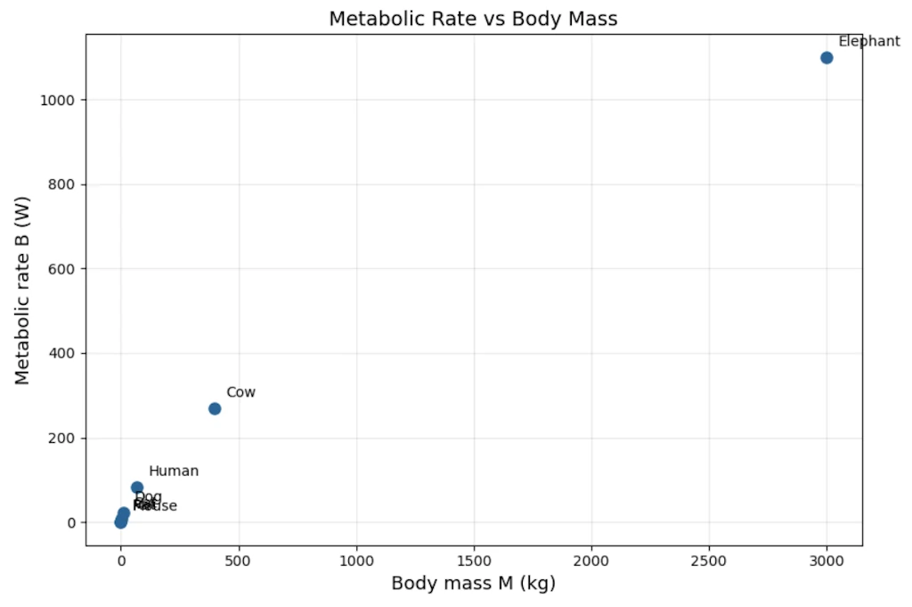
<figcaption>Mouse, Rat, Cat, and Dog are all crushed into the bottom-left corner while Elephant dominates</figcaption>
</figure>


With the help of the graph, we immediately *see* the problem: data for small animals are packed into the bottom-left corner while Elephant are on the other side of the scale. We can't zoom on small animals without "loosing" larger ones. That's exactly the visual motivation for switching to another scaling.


<!-- ###################################################################### -->
### Step 2: Try log-linear. Does it straighten?
{: .no_toc }

Let's plot $$\log B$$ vs $$M$$. Still curved. Not exponential.

```python
import numpy as np
import matplotlib.pyplot as plt

# Data: Kleiber's metabolic scaling
animals = ["Mouse", "Rat", "Cat", "Dog", "Human", "Cow", "Elephant"]
M = np.array([0.025, 0.3, 3, 11, 70, 400, 3000])       # body mass (kg)
B = np.array([0.24, 1.45, 8.0, 22.7, 82, 270, 1100])    # metabolic rate (W)

fig, ax = plt.subplots(figsize=(9, 6))
ax.plot(M, np.log10(B), 'o', markersize=8, color='#2a6496')

for name, m, b in zip(animals, M, B):
    ax.annotate(name, (m, np.log10(b)), textcoords="offset points", xytext=(8, 8), fontsize=10)

ax.set_xlabel("Body mass M (kg)", fontsize=13)
ax.set_ylabel("log₁₀(B)  [B in watts]", fontsize=13)
ax.set_title("log(Metabolic Rate) vs Body Mass — semi-log", fontsize=14)
ax.grid(True, alpha=0.3)
fig.tight_layout()
plt.show()

```

<figure style="max-width: 900px; margin: auto; text-align: center;">
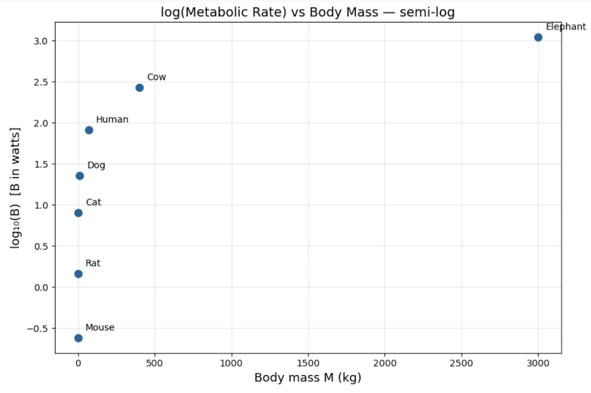
<figcaption>The points still curve on semi-log graph</figcaption>
</figure>


The small animals are more visible now, but the points still curve. This confirms this isn't an exponential relationship (which would appear as a straight line here)


<!-- ###################################################################### -->
### Step 3: Try log-log.
{: .no_toc }

Let's plot $$\log B$$ vs $$\log M$$:

| $$\log_{10} M$$ | $$\log_{10} B$$ |
|---------------|---------------|
| -1.60 | -0.62 |
| -0.52 | 0.16 |
| 0.48 | 0.90 |
| 1.04 | 1.36 |
| 1.85 | 1.91 |
| 2.60 | 2.43 |
| 3.48 | 3.04 |



```python
import numpy as np
import matplotlib.pyplot as plt

# Data: Kleiber's metabolic scaling
animals = ["Mouse", "Rat", "Cat", "Dog", "Human", "Cow", "Elephant"]
M = np.array([0.025, 0.3, 3, 11, 70, 400, 3000])       # body mass (kg)
B = np.array([0.24, 1.45, 8.0, 22.7, 82, 270, 1100])    # metabolic rate (W)

# Log-log linear fit: log(B) = a * log(M) + b
coeffs = np.polyfit(np.log10(M), np.log10(B), 1)
exponent, log_prefactor = coeffs
prefactor = 10 ** log_prefactor

# Fit line over a smooth range
M_fit = np.logspace(np.log10(M.min()) - 0.3, np.log10(M.max()) + 0.3, 200)
B_fit = prefactor * M_fit ** exponent

# Plot
fig, ax = plt.subplots(figsize=(9, 6))
ax.loglog(M, B, 'o', markersize=9, color='#2a6496', zorder=5)
ax.loglog(M_fit, B_fit, '--', color='#cc4444', linewidth=1.5,
          label = "Fit: $B = %.2f \\, M^{%.2f}$" % (prefactor, exponent))

# Annotate each animal
offsets = {
    "Mouse": (10, 8), "Rat": (10, -12), "Cat": (10, 8),
    "Dog": (-15, -18), "Human": (10, 8), "Cow": (-15, -18), "Elephant": (10, 8),
}
for name, m, b in zip(animals, M, B):
    dx, dy = offsets[name]
    ax.annotate(name, (m, b), textcoords="offset points", xytext=(dx, dy), fontsize=10)

ax.set_xlabel("Body mass $M$ (kg)", fontsize=13)
ax.set_ylabel("Metabolic rate $B$ (W)", fontsize=13)
ax.set_title("Kleiber's Law — Metabolic Scaling", fontsize=14)
ax.legend(fontsize=12)
ax.grid(True, which="both", alpha=0.3)
fig.tight_layout()
plt.show()
```



<figure style="max-width: 900px; margin: auto; text-align: center;">
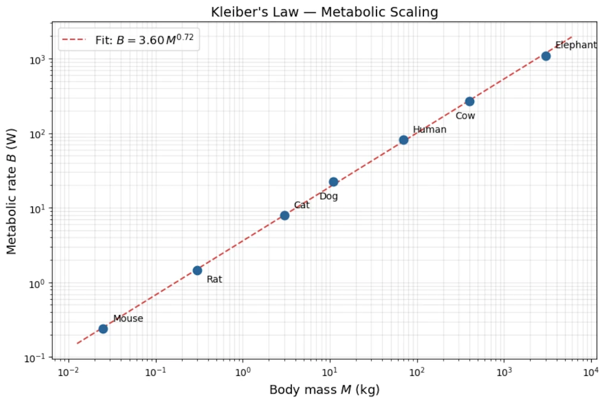
<figcaption>Haha moment with the log-log graph?
</figcaption>
</figure>

Now the points fall on a straight line. This is our moment of discovery.


<!-- ###################################################################### -->
### Step 4: Read off the slope
{: .no_toc }

<!-- From mouse to elephant: $$\Delta \log M = 3.48 - (-1.60) = 5.08$$, $$\Delta \log B = 3.04 - (-0.62) = 3.66$$.

$$\hat{\alpha} = \frac{3.66}{5.08} \approx 0.72$$

Linear regression on all 7 log-log points gives $$\hat{\alpha} \approx 0.74$$, intercept $$\approx -0.10$$, so:

$$\boxed{B \approx 0.8 \cdot M^{3/4}}$$ -->

#### **Step 4.1: A quick estimate of the slope**
{: .no_toc }

We can get a rough idea by using just the two extreme points (mouse and elephant):

$$\hat{\alpha}_{\text{rough}} = \frac{\Delta \log B}{\Delta \log M} = \frac{\log(1100) - \log(0.24)}{\log(3000) - \log(0.025)} = \frac{3.04 - (-0.62)}{3.48 - (-1.60)} = \frac{3.66}{5.08} \approx 0.72$$

This tells us the slope is *somewhere around* 0.72 but we only used 2 points out of 7, so it's a rough estimate.

#### **Step 4.2: A better estimate using all the data**
{: .no_toc }

A linear regression on all 7 log-log points uses every animal, not just the extremes, so it's more reliable. It gives:

$$\hat{\alpha} = 0.74, \qquad \hat{b} = -0.10$$

where the fitted line is $$\log B = \hat{b} + \hat{\alpha} \cdot \log M$$, i.e. $$\log B = -0.10 + 0.74 \cdot \log M$$.

#### **Step 4.3: Why do we write $$3/4$$ instead of $$0.74$$?**
{: .no_toc }

Both 0.72 (rough) and 0.74 (regression) are *empirical estimates*. They come from a small, noisy dataset and carry some uncertainty. The true slope could reasonably be anything between about 0.70 and 0.78.

The fraction $$3/4 = 0.75$$ sits right in the middle of that range. Physicists and biologists prefer it because:

- it's within the measurement uncertainty of both estimates,
- a clean fraction suggests there may be a deeper structural explanation (and indeed, the West-Brown-Enquist model from 1997 derives $$3/4$$ from theoretical principles about fractal vascular networks).

So $$3/4$$ is not a third, different value, it's the theoretical "round number" that our noisy estimates are consistent with.

#### **Step 4.4: From the intercept to the prefactor 0.8**
{: .no_toc }

The regression gives us the equation in log-space:

$$\log B = -0.10 + \frac{3}{4}\log M$$

We need to convert this back to an ordinary equation $$B = C \cdot M^{3/4}$$. Taking the log of both sides of that ordinary equation gives $$\log B = \log C + \frac{3}{4}\log M$$, so by comparison:

$$\log C = -0.10$$

To find $$C$$, we "undo" the logarithm (base 10):

$$C = 10^{-0.10} \approx 0.79 \approx 0.8$$

We can check on a calculator: $$10^{-0.10} = 0.794...$$

#### **Step 4.5: Final result**
{: .no_toc }

$$\boxed{B \approx 0.8 \cdot M^{3/4}}$$

where $$B$$ is in watts, $$M$$ is in kilograms, and $$0.8$$ is not a mysterious constant, it's simply $$10^{\text{intercept}} = 10^{-0.10}$$.


<!-- ###################################################################### -->
### Step 5: Testing the three hypotheses against the data
{: .no_toc }

<!--
| Hypothesis | Exponent | Prediction for elephant vs mouse ratio | Observed |
|------------|----------|----------------------------------------|----------|
| Linear | 1.0 | $$(3000/0.025)^{1.0} = 120\,000\times$$ | — |
| Surface area | 0.67 | $$(120\,000)^{0.67} = 3\,800\times$$ | — |
| **Kleiber** | **0.75** | $$(120\,000)^{0.75} = 18\,600\times$$ | **$$1100/0.24 \approx 4\,600\times$$** |

None is perfect (real biology is noisy), but $$3/4$$ fits dramatically better than $$1$$ or $$2/3$$, and it holds across **27 orders of magnitude** of body mass when we include bacteria and whales. That robustness is the signature that we've found something real.
 -->


We have a mouse (0.025 kg, 0.24 W) and an elephant (3000 kg, 1100 W). The mass ratio between them is:

$$\frac{M_{\text{elephant}}}{M_{\text{mouse}}} = \frac{3000}{0.025} = 120\,000$$

The **observed** metabolic rate ratio is:

$$\frac{B_{\text{elephant}}}{B_{\text{mouse}}} = \frac{1100}{0.24} \approx 4\,580$$

So the elephant is 120 000 times heavier, but only about 4 600 times more "energy-hungry." The question is: which model predicts this correctly?

If $$B = C \cdot M^{\alpha}$$, then the ratio of metabolic rates is:

$$\frac{B_{\text{elephant}}}{B_{\text{mouse}}} = \left(\frac{M_{\text{elephant}}}{M_{\text{mouse}}}\right)^{\alpha} = 120\,000^{\,\alpha}$$

Let's compute this for each hypothesis:

| Hypothesis | Exponent $$\alpha$$ | Predicted ratio $$120\,000^{\,\alpha}$$ | Observed ratio | How far off? |
|---|---|---|---|---|
| Linear ("metabolism proportional to mass") | 1.0 | $$120\,000^{1.0} = 120\,000$$ | 4,580 | **26× too high** |
| Surface area (Rubner's law) | 0.67 | $$120\,000^{0.67} \approx 2\,420$$ | 4,580 | **1.9× too low** |
| **Kleiber's law** | **0.75** | $$120\,000^{0.75} \approx 5\,530$$ | **4,580** | **1.2× too high** |

How to read this table: if the elephant-to-mouse metabolic ratio is really about 4 580, then:

- The **linear** model ($$\alpha = 1$$) predicts 120 000. It overshoots by a factor of 26. It's wildly wrong because it assumes a big animal is just a "scaled-up small animal" with no efficiency gain.
- The **surface area** model ($$\alpha = 2/3$$) predicts 2 420. It undershoots by almost half. It's in the right ballpark but systematically too low.
- **Kleiber's** model ($$\alpha = 3/4$$) predicts 5 530. It overshoots by only about 20%. With just two noisy data points, that's remarkably close.

None of the three is exact, which is normal: real biological data is noisy, and the mouse and elephant don't sit perfectly on any theoretical line. But $$\alpha = 3/4$$ is clearly the best of the three.

**Why this is convincing beyond just two animals:** When biologists extend this analysis from bacteria ($$10^{-13}$$ W) to blue whales ($$10^{4}$$ W), spanning roughly **27 orders of magnitude** in body mass, the $$3/4$$ exponent continues to hold. A pattern that survives across such an enormous range is very unlikely to be a coincidence; it points to a universal structural constraint on how organisms distribute energy.


<!-- ###################################################################### -->
### Why 3/4 and not 2/3? The physical story came *long after* the data.
{: .no_toc }

The $$\frac{3}{4}$$ exponent was a mystery for 60 years. In 1997, West, Brown & Enquist showed it emerges from the **fractal geometry of vascular networks**: the network must fill a 3D volume but itself has fractal dimension and the math forces $$\alpha = \frac{3}{4}$$. The law was discovered empirically decades before it was understood theoretically. **Data first, theory second.**


<!-- ###################################################################### -->
<!-- ###################################################################### -->
<!-- ###################################################################### -->
## Example 2: Gutenberg-Richter Law (Earthquake Magnitudes)


<!-- ###################################################################### -->
### The Setup
{: .no_toc }

In the 1940s, Beno Gutenberg and Charles Richter were cataloguing California earthquakes. They had counts of earthquakes per year at each magnitude level. The question: **is there a pattern in how often large vs small quakes occur?**

The engineering hope was that large earthquakes were rare "anomalies", exponentially rare, like failures in most engineered systems, so we could define a "maximum credible earthquake." Spoiler alert: that hope was wrong.


<!-- ###################################################################### -->
### The Raw Data (simplified, order-of-magnitude realistic)
{: .no_toc }

| Magnitude $$M$$ | Quakes/year in California |
|---------------|--------------------------|
| 2 | ~1000 |
| 3 | ~300 |
| 4 | ~100 |
| 5 | ~30 |
| 6 | ~10 |
| 7 | ~3 |
| 8 | ~1 |


```python
import matplotlib.pyplot as plt

# Gutenberg-Richter: earthquake frequency in California
magnitude = [2, 3, 4, 5, 6, 7, 8]
quakes_per_year = [1000, 300, 100, 30, 10, 3, 1]

fig, ax = plt.subplots(figsize=(9, 6))
ax.plot(magnitude, quakes_per_year, 'o', markersize=8, color='#2a6496')

ax.set_xlabel("Magnitude M", fontsize=13)
ax.set_ylabel("Earthquakes per year", fontsize=13)
ax.set_title("Earthquake Frequency vs Magnitude (California)", fontsize=14)
ax.grid(True, alpha=0.3)
fig.tight_layout()
plt.show()
```


<figure style="max-width: 900px; margin: auto; text-align: center;">
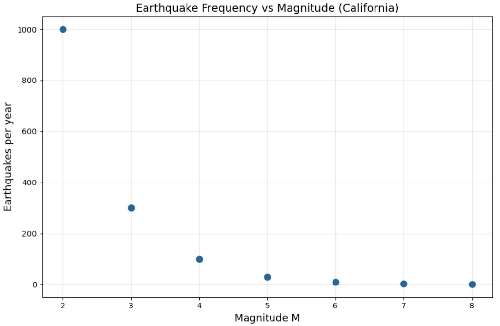
<figcaption>Same story as the metabolic data in linear scale where the small magnitudes crush everything else.
</figcaption>
</figure>


<!-- ###################################################################### -->
### Step 1: First look: is it exponential?
{: .no_toc }

Let's plot $$\log N$$ vs $$M$$ (log-linear):

| $$M$$ | $$\log_{10} N$$ |
|-----|---------------|
| 2 | 3.0 |
| 3 | 2.5 |
| 4 | 2.0 |
| 5 | 1.5 |
| 6 | 1.0 |
| 7 | 0.5 |
| 8 | 0.0 |


```python
import numpy as np
import matplotlib.pyplot as plt

# Gutenberg-Richter: earthquake frequency in California
magnitude = np.array([2, 3, 4, 5, 6, 7, 8])
quakes_per_year = np.array([1000, 300, 100, 30, 10, 3, 1])

fig, ax = plt.subplots(figsize=(9, 6))
ax.plot(magnitude, np.log10(quakes_per_year), 'o', markersize=8, color='#2a6496')

ax.set_xlabel("Magnitude M", fontsize=13)
ax.set_ylabel("log₁₀(N)", fontsize=13)
ax.set_title("log₁₀(Earthquakes per year) vs Magnitude", fontsize=14)
ax.grid(True, alpha=0.3)
fig.tight_layout()
plt.show()
```


<figure style="max-width: 900px; margin: auto; text-align: center;">
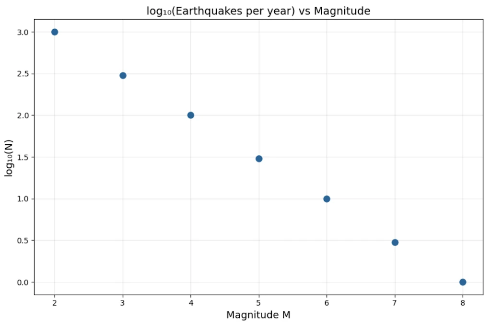
<figcaption>The points fall on a perfect straight line.
</figcaption>
</figure>


**This is a perfect straight line.** Slope = $$-0.5$$ per unit magnitude. So:

$$\log_{10} N = 3 - 0.5 \cdot M \implies N = 10^{3 - 0.5M} = 10^3 \cdot 10^{-0.5M}$$

Wait, that looks like an **exponential in $$M$$**, not a power law! Case closed?


<!-- ###################################################################### -->
### Step 2: The key insight: magnitude is already a log scale
{: .no_toc }

Richter magnitude is defined as:

$$M = \log_{10}\left(\frac{E}{E_0}\right) \cdot \frac{2}{3} \quad \text{(approximately)}$$

So $$M \propto \log E$$, meaning **energy $$E \propto 10^{1.5M}$$**.

Substitute $$M = \frac{2}{3}\log_{10}(E/E_0)$$ into the Gutenberg-Richter relation:

$$\log_{10} N = a - b \cdot M = a - b \cdot \frac{2}{3}\log_{10} E + \text{const}$$

$$\log_{10} N = \text{const} - \frac{2b}{3} \log_{10} E$$

$$\boxed{N(E) \propto E^{-2b/3}}$$

**It's a power law in energy**, with exponent $$\approx -2b/3 \approx -1.0$$ for $$b \approx 1.5$$.


<!-- ###################################################################### -->
### Step 3: What this means concretely
{: .no_toc }

$$N(>E) \propto E^{-1}$$

A quake releasing $$10\times$$ more energy is $$10\times$$ rarer. A quake releasing $$1000\times$$ more energy is $$1000\times$$ rarer. **There is no characteristic earthquake size.** The ratio is always the same. That's **scale invariance** in action.

The exponential-in-magnitude formula and the power-law-in-energy formula are the **same statement**, just in different variables. The discovery was realizing that magnitude was already a compressed (logarithmic) representation, and that uncompressing it reveals the true power law structure.


#### **Side Note**
{: .no_toc }

**"Heavy tail"** is a precise mathematical concept: it means the tail of the distribution decays slower than any exponential. Formally, for a heavy-tailed distribution, $\lim_{x \to \infty} e^{\lambda x} \cdot P(X > x) = \infty$ for all $\lambda > 0$. Power laws satisfy this. The tail is "heavy" because it carries more probability mass than you'd expect — extreme events are rare but not *as* rare as an exponential would predict.


<!-- ###################################################################### -->
### The engineering consequence
{: .no_toc }

If seismic energy followed a true exponential distribution (with a characteristic scale), there would be a natural maximum earthquake and risk would be bounded. The power law means **there is no such maximum**. The distribution has a **heavy tail**. Every time we think we've seen the biggest possible earthquake, the math says there's a finite probability of something larger. This fundamentally changed how nuclear plants, dams, and bridges are designed.


```python
import numpy as np
import matplotlib.pyplot as plt

# -----------------------------
# Parameters
# -----------------------------
alpha = 2.5          # Pareto tail exponent
lam_exp = 1.0        # Exponential decay rate
lam_test = 0.3       # Lambda used in the heavy-tail definition

x = np.linspace(1, 40, 1000)

# -----------------------------
# Survival functions P(X>x)
# -----------------------------
# Exponential tail
S_exp = np.exp(-lam_exp * x)

# Pareto tail (power law)
S_par = x**(-alpha)

# -----------------------------
# Plot 1: Tail probabilities
# -----------------------------
plt.figure(figsize=(10,6))
plt.semilogy(x, S_exp, label='Exponential tail', linewidth=3)
plt.semilogy(x, S_par, label='Power-law tail (heavy tail)', linewidth=3)

plt.title("Tail Probability P(X>x): Exponential vs Heavy Tail")
plt.xlabel("Event size x")
plt.ylabel("Survival probability (log scale)")
plt.legend()
plt.grid(True)
plt.show()


# -----------------------------
# Plot 2: Log-log reveals power law
# -----------------------------
plt.figure(figsize=(10,6))
plt.loglog(x, S_exp, label='Exponential', linewidth=3)
plt.loglog(x, S_par, label='Power law', linewidth=3)

plt.title("Log-Log View (Power law becomes a straight line)")
plt.xlabel("Event size x")
plt.ylabel("P(X>x)")
plt.legend()
plt.grid(True)
plt.show()


# -----------------------------
# Illustration of heavy-tail definition:
# exp(lambda x) * P(X>x)
# -----------------------------
test_exp = np.exp(lam_test*x) * S_exp
test_par = np.exp(lam_test*x) * S_par

plt.figure(figsize=(10,6))
plt.yscale('log')
plt.plot(x, test_exp, label=r'$e^{\lambda x} P(X>x)$ exponential', linewidth=3)
plt.plot(x, test_par, label=r'$e^{\lambda x} P(X>x)$ Pareto', linewidth=3)

plt.title("Mathematical Heavy-Tail Test")
plt.xlabel("x")
plt.ylabel(r'$e^{\lambda x} P(X>x)$')
plt.legend()
plt.grid(True)
plt.show()


# -----------------------------
# Extreme-event comparison
# -----------------------------
thresholds = [5, 10, 20]

print("\nProbability of very large events:")
for t in thresholds:
    p_exp = np.exp(-lam_exp*t)
    p_par = t**(-alpha)

    print(f"\nThreshold x > {t}")
    print(f"Exponential : {p_exp:.3e}")
    print(f"Power law   : {p_par:.3e}")
    print(f"Power-law is {p_par/p_exp:.1f} times larger")


# -----------------------------
# Optional: earthquake interpretation
# -----------------------------
print("\nInterpretation:")
print("In a heavy-tailed model, catastrophic earthquakes remain much")
print("more probable than an exponential model would suggest.")
print("That is the sense in which the tail is 'heavy'.")
```

<figure style="max-width: 900px; margin: auto; text-align: center;">
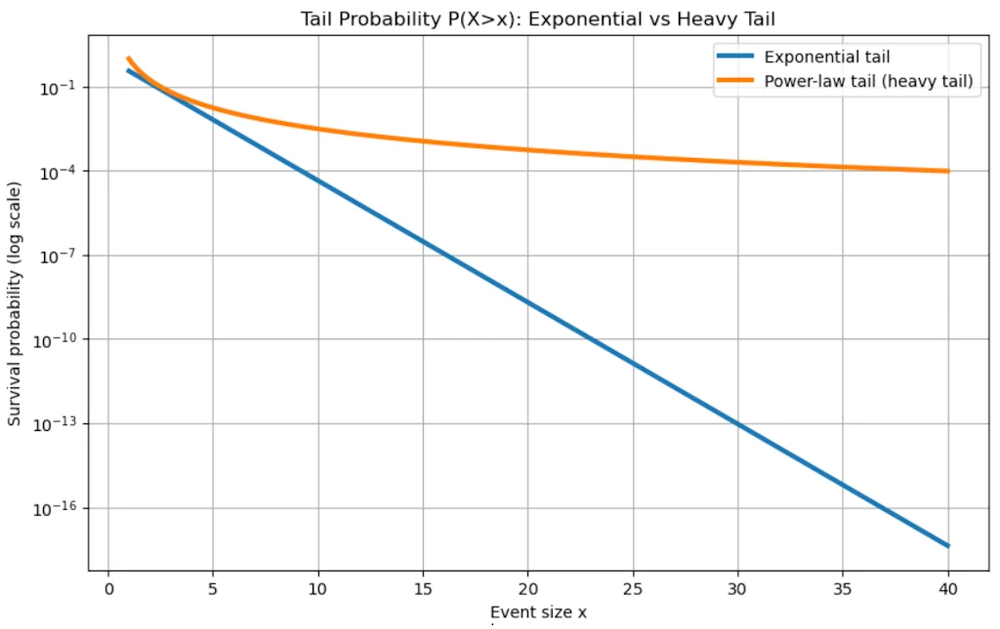 Exponential"
    style="width: 100%; height: auto;"
    loading="lazy"
/>
<figcaption>Heavy Tail > Exponential</figcaption>
</figure>


<!-- ###################################################################### -->
<!-- ###################################################################### -->
<!-- ###################################################################### -->
## The General Recipe

Both previous examples follow the same narrative, the same story:

1. **Measure without assumptions**. Just collect $$(x_i, y_i)$$ pairs (usually, harder than anticipited)
2. **Plot linearly**. See a curve, gain intuition about scale
3. **Try log-linear**. Test the exponential hypothesis explicitly
4. **Try log-log**. If this straightens, we have a power law candidate
5. **Fit the slope**. Get $$\hat{\alpha}$$ with error bars
6. **Check competing models**. Don't just confirm, try to falsify
7. **Ask what the exponent means**. The number $$\alpha$$ often encodes deep geometry or mechanism
8. **Watch for hidden variables**. Like Richter's magnitude being already logarithmic

The moment of discovery is always **step 4**. The log-log plot snapping into a straight line when everything else was a curve. That's the "aha" moment we will remember.


<!-- ###################################################################### -->
<!-- ###################################################################### -->
<!-- ###################################################################### -->
## So, what is a Power Law?

A power law is a relationship of the form:

$$y = C \cdot x^{\alpha}$$

where $$C$$ is a constant and $$\alpha$$ is the **exponent** (the key parameter). That's it. Deceptively simple.

Compare immediately with an exponential:

$$y = C \cdot e^{\lambda x}$$

The crucial structural difference: in a power law, $$x$$ is the **base**. In an exponential, $$x$$ is the **exponent**. This one difference has enormous consequences.


<!-- ###################################################################### -->
<!-- ###################################################################### -->
<!-- ###################################################################### -->
## Starting Simple: Concrete Calculations


<!-- ###################################################################### -->
### Power law examples we already know
{: .no_toc }

**Area of a circle:** $$A = \pi r^2$$ \rightarrow$$ exponent $$\alpha = 2$$

**Volume of a sphere:** $$V = \frac{4}{3}\pi r^3 \rightarrow$$ exponent $$\alpha = 3$$

**Gravitational force:** $$F = G \frac{m_1 m_2}{r^2} \rightarrow$$ exponent $$\alpha = -2$$ (decreasing)

Now let's feel the difference between power law and exponential growth numerically.

Take $$y = x^2$$ vs $$y = e^x$$, starting at $$x = 1$$:

| x | $$x^2$$ | $$e^x$$ |
|---|-------|--------|
| 1 | 1 | 2.7 |
| 2 | 4 | 7.4 |
| 5 | 25 | 148 |
| 10 | 100 | 22,026 |
| 20 | 400 | 485,165,195 |


```python
import numpy as np
import matplotlib.pyplot as plt

# Comparison: power law vs exponential
x = np.array([1, 2, 5, 10, 20])
power = x ** 2
expo = np.exp(x)

fig, ax = plt.subplots(figsize=(9, 6))
ax.semilogy(x, power, 'o-', markersize=8, color='#2a6496', label='$x^2$ (power law)')
ax.semilogy(x, expo, 's-', markersize=8, color='#cc4444', label='$e^x$ (exponential)')

ax.set_xlabel("x", fontsize=13)
ax.set_ylabel("y  (log scale)", fontsize=13)
ax.set_title("Power Law vs Exponential: the exponential always wins", fontsize=14)
ax.legend(fontsize=12)
ax.grid(True, which="both", alpha=0.3)
fig.tight_layout()
plt.show()
```


<figure style="max-width: 900px; margin: auto; text-align: center;">
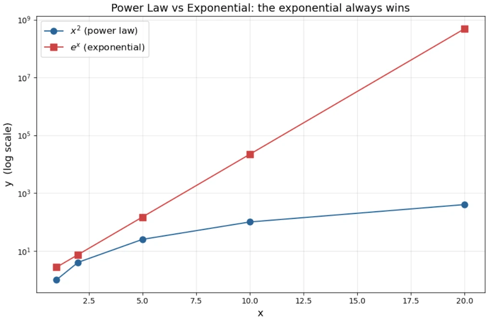
<figcaption>The semi-log y-axis makes the contrast dramatic.</figcaption>
</figure>

<!-- $$e^x$$ shoots up as a straight line while $$x^2$$ curves upward only very slightly. This clearly shows that exponential functions always outperform power laws when $$x$$ is large. -->

The exponential **annihilates** the power law for large $$x$$. This is the fundamental theorem of comparing these two families: **exponentials always eventually dominate power laws**, no matter how large $$\alpha$$ is.

But for small $$x$$, or when $$\alpha$$ is large, power laws can look like exponentials locally and this is a source of much confusion.


<!-- ###################################################################### -->
<!-- ###################################################################### -->
<!-- ###################################################################### -->
## The Signature Property: Scale Invariance

Power laws have a remarkable property that exponentials do **not** share: **scale invariance** (also called self-similarity).

Watch what happens when we multiply $$x$$ by a constant factor $$k$$:

$$y(kx) = C(kx)^{\alpha} = k^{\alpha} \cdot Cx^{\alpha} = k^{\alpha} \cdot y(x)$$

Doubling $$x$$ always multiplies $$y$$ by exactly $$2^{\alpha}$$, **regardless of where we are on the curve**. The ratio depends only on the factor $$k$$, not on the starting value of $$x$$.

With an exponential: $$y(kx) = Ce^{\lambda kx} = e^{\lambda(k-1)x} \cdot Ce^{\lambda x}$$. The multiplier **depends on $$x$$**, it's not constant. Scale invariance is broken.

**Practical meaning:** For a power law with $$\alpha = 2$$, a city 10× bigger than another will always have roughly $$10^2 = 100$$× more of whatever is being measured (road surface, number of gas stations…), regardless of whether we are comparing 10k vs 100k cities, or 100k vs 1M cities. The ratio is always the same.


```python
import numpy as np
import matplotlib.pyplot as plt

# Scale invariance: power law vs exponential
x = np.linspace(1, 10, 200)
alpha = 2
lam = 0.5

y_power = x ** alpha
y_expo = np.exp(lam * x)

# Pick two starting points, double each
x1, x2 = 2, 5
k = 2

fig, axes = plt.subplots(1, 2, figsize=(14, 6))

# --- Left panel: Power law ---
ax = axes[0]
ax.plot(x, y_power, '-', color='#2a6496', linewidth=2)
for xi in [x1, x2]:
    y_lo = xi ** alpha
    y_hi = (k * xi) ** alpha
    ratio = y_hi / y_lo
    ax.plot([xi, k * xi], [y_lo, y_hi], 'o', markersize=9, color='#cc4444')
    ax.annotate('', xy=(k * xi, y_hi), xytext=(k * xi, y_lo),
                arrowprops=dict(arrowstyle='<->', color='#cc4444', lw=1.5))
    ax.text(k * xi + 0.3, (y_lo + y_hi) / 2, f'×{ratio:.0f}',
            color='#cc4444', fontsize=12, va='center')

ax.set_xlabel('x', fontsize=13)
ax.set_ylabel('y', fontsize=13)
ax.set_title(f'Power law $y = x^{{{alpha}}}$\nDoubling x → always ×{k**alpha}', fontsize=13)
ax.grid(True, alpha=0.3)

# --- Right panel: Exponential ---
ax = axes[1]
ax.plot(x, y_expo, '-', color='#2a6496', linewidth=2)
for xi in [x1, x2]:
    y_lo = np.exp(lam * xi)
    y_hi = np.exp(lam * k * xi)
    ratio = y_hi / y_lo
    ax.plot([xi, k * xi], [y_lo, y_hi], 'o', markersize=9, color='#cc4444')
    ax.annotate('', xy=(k * xi, y_hi), xytext=(k * xi, y_lo),
                arrowprops=dict(arrowstyle='<->', color='#cc4444', lw=1.5))
    ax.text(k * xi + 0.3, (y_lo + y_hi) / 2, f'×{ratio:.1f}',
            color='#cc4444', fontsize=12, va='center')

ax.set_xlabel('x', fontsize=13)
ax.set_ylabel('y', fontsize=13)
ax.set_title(f'Exponential $y = e^{{{lam}x}}$\nDoubling x → ratio depends on x!', fontsize=13)
ax.grid(True, alpha=0.3)

fig.tight_layout()
plt.show()
```



<figure style="max-width: 900px; margin: auto; text-align: center;">
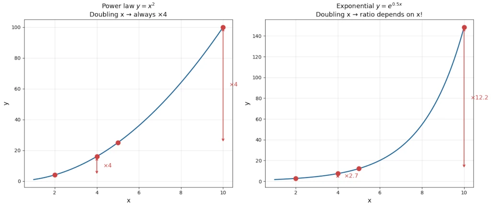
<figcaption>I'm a legend</figcaption>
</figure>

On the left, both red arrows show the same ×4 ratio (since $$2^2 = 4$$) whether we start at $$x=2$$ or $$x=5$$. That's **scale invariance**. On the right, the same doubling produces very different ratios depending on where we start. The exponential breaks scale invariance.


<!-- ###################################################################### -->
<!-- ###################################################################### -->
<!-- ###################################################################### -->
## Where Power Laws Appear?


<!-- ###################################################################### -->
### Economics & Society
{: .no_toc }

- **Zipf's law:** The $$n$$-th most common word in any large corpus appears with frequency $$\propto 1/n$$. The most common word ("the") appears roughly twice as often as the second most common, three times the third, etc.
- **City sizes:** In most countries, city population follows $$P(rank) \propto rank^{-1}$$. Paris is roughly 2× Lyon, 3× Marseille as a metropolitan area.
- **Wealth distribution:** Top 20% hold ~80% of wealth (Pareto's 80/20 rule). This is a power law with $$\alpha \approx 1.16$$.
- **Company sizes:** Number of companies with $$n$$ employees $$\propto n^{-\alpha}$$.


<!-- ###################################################################### -->
### Internet & Networks
{: .no_toc }

- **Web links:** Most pages have few inbound links; a tiny number (Google, Wikipedia) have billions. Distribution: $$P(k) \propto k^{-\gamma}$$, with $$\gamma \approx 2.1$$ for the web.
- **Degree distribution** in social networks (Facebook friends, Twitter followers).


<!-- ###################################################################### -->
### Nature & Physics
{: .no_toc }

- **Earthquake magnitudes** (Gutenberg-Richter law): $$\log N = a - b \cdot M$$, i.e., $$N \propto 10^{-bM}$$. The number of earthquakes of magnitude $$\geq M$$ follows a power law in energy.
- **Avalanche sizes, solar flares, forest fire extents.**
- **Metabolic rate vs body mass:** $$B \propto M^{3/4}$$ (Kleiber's law). An elephant uses ~$$10^4$$ times more energy than a mouse, yet its mass is $$\sim 10^{4.5}$$ times greater. The $$3/4$$ exponent reflects fractal-like vascular network efficiency.
- **Coastline length** vs measurement scale (Mandelbrot's fractal work).


<!-- ###################################################################### -->
### Information & Language
{: .no_toc }

- **File size distributions** on the internet.
- **Number of citations** a scientific paper receives.


<!-- ###################################################################### -->
<!-- ###################################################################### -->
<!-- ###################################################################### -->
## How to Distinguish a Power Law from an Exponential?


<!-- ###################################################################### -->
### The log-log trick
{: .no_toc }

Take $$\log$$ of both sides of $$y = Cx^{\alpha}$$:

$$\log y = \log C + \alpha \log x$$

On a **log-log plot**, a power law becomes a **straight line** with slope $$\alpha$$. This is the primary diagnostic tool.

For an exponential $$y = Ce^{\lambda x}$$, take $$\log$$:

$$\log y = \log C + \lambda x$$

On a **log-linear plot** (log $$y$$, linear $$x$$), an exponential is a straight line. On a log-log plot, it curves upward.


```python
import numpy as np
import matplotlib.pyplot as plt

x = np.linspace(1, 50, 200)
y_power = 2 * x ** 1.5          # power law: C=2, alpha=1.5
y_expo = 2 * np.exp(0.15 * x)   # exponential: C=2, lambda=0.15

fig, axes = plt.subplots(1, 2, figsize=(14, 6))

# --- Left: log-log plot ---
ax = axes[0]
ax.loglog(x, y_power, '-', color='#2a6496', linewidth=2, label='Power law $2x^{1.5}$')
ax.loglog(x, y_expo, '-', color='#cc4444', linewidth=2, label='Exponential $2e^{0.15x}$')
ax.set_xlabel('x', fontsize=13)
ax.set_ylabel('y', fontsize=13)
ax.set_title('Log-log plot\nPower law → straight line', fontsize=13)
ax.legend(fontsize=11)
ax.grid(True, which='both', alpha=0.3)

# --- Right: log-linear plot ---
ax = axes[1]
ax.semilogy(x, y_power, '-', color='#2a6496', linewidth=2, label='Power law $2x^{1.5}$')
ax.semilogy(x, y_expo, '-', color='#cc4444', linewidth=2, label='Exponential $2e^{0.15x}$')
ax.set_xlabel('x', fontsize=13)
ax.set_ylabel('y', fontsize=13)
ax.set_title('Log-linear plot\nExponential → straight line', fontsize=13)
ax.legend(fontsize=11)
ax.grid(True, which='both', alpha=0.3)

fig.tight_layout()
plt.show()
```


<figure style="max-width: 900px; margin: auto; text-align: center;">
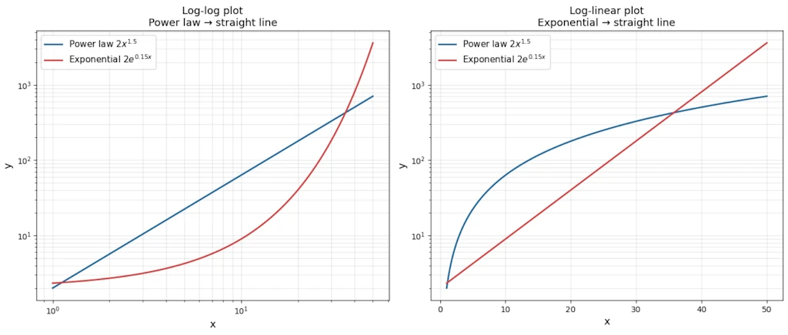
<figcaption>The log-log trick</figcaption>
</figure>


* Left panel: on a log-log plot the power law is a perfect straight line while the exponential curves upward.
* Right panel: on a log-linear plot the roles swap. The exponential becomes the straight line. That's the diagnostic trick in one glance.


<!-- ###################################################################### -->
### Decision table
{: .no_toc }

| Plot type | Power law | Exponential |
|-----------|-----------|-------------|
| Linear-linear | Curve | Curve |
| **Log-log** | **Straight line**  | Curves |
| **Log-linear** | Curves | **Straight line**  |


<!-- ###################################################################### -->
### Worked example
{: .no_toc }

Suppose we observe this data:

| x | y |
|---|---|
| 1 | 3 |
| 2 | 12 |
| 4 | 48 |
| 8 | 192 |
| 16 | 768 |

```python
import matplotlib.pyplot as plt

x = [1, 2, 4, 8, 16]
y = [3, 12, 48, 192, 768]

fig, ax = plt.subplots(figsize=(9, 6))
ax.plot(x, y, 'o', markersize=8, color='#2a6496')

ax.set_xlabel("x", fontsize=13)
ax.set_ylabel("y", fontsize=13)
ax.set_title("Raw Data", fontsize=14)
ax.grid(True, alpha=0.3)
fig.tight_layout()
plt.show()
```


<figure style="max-width: 900px; margin: auto; text-align: center;">
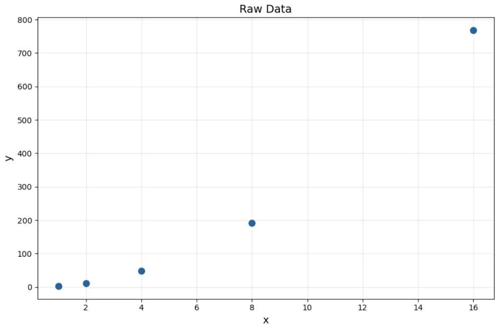
<figcaption>Raw data</figcaption>
</figure>


Check ratios: when $$x$$ doubles, $$y$$ quadruples. That's consistent every time $$\rightarrow$$ power law candidate with $$\alpha = 2$$.

Check: $$y = 3x^2$$. Indeed $$3(1)^2=3$$, $$3(2)^2=12$$, $$3(4)^2=48$$.

On a log-log plot: $$\log y = \log 3 + 2 \log x$$ $$\rightarrow$$ slope = 2, intercept = $$\log 3 \approx 0.48$$.


```python
import numpy as np
import matplotlib.pyplot as plt

x = np.array([1, 2, 4, 8, 16])
y = np.array([3, 12, 48, 192, 768])

# Linear fit in log-log space
coeffs = np.polyfit(np.log10(x), np.log10(y), 1)
slope, intercept = coeffs

# Fit line
x_fit = np.logspace(0, np.log10(20), 100)
y_fit = 10 ** (slope * np.log10(x_fit) + intercept)

fig, ax = plt.subplots(figsize=(9, 6))
ax.loglog(x, y, 'o', markersize=9, color='#2a6496', zorder=5, label='Data')
ax.loglog(x_fit, y_fit, '--', color='#cc4444', linewidth=1.5,
          label=f'Fit: slope = {slope:.1f}, intercept = {intercept:.2f}')

ax.set_xlabel("x", fontsize=13)
ax.set_ylabel("y", fontsize=13)
ax.set_title("Log-log plot: perfect straight line confirms $y = 3x^2$", fontsize=14)
ax.legend(fontsize=12)
ax.grid(True, which='both', alpha=0.3)
fig.tight_layout()
plt.show()
```


<figure style="max-width: 900px; margin: auto; text-align: center;">
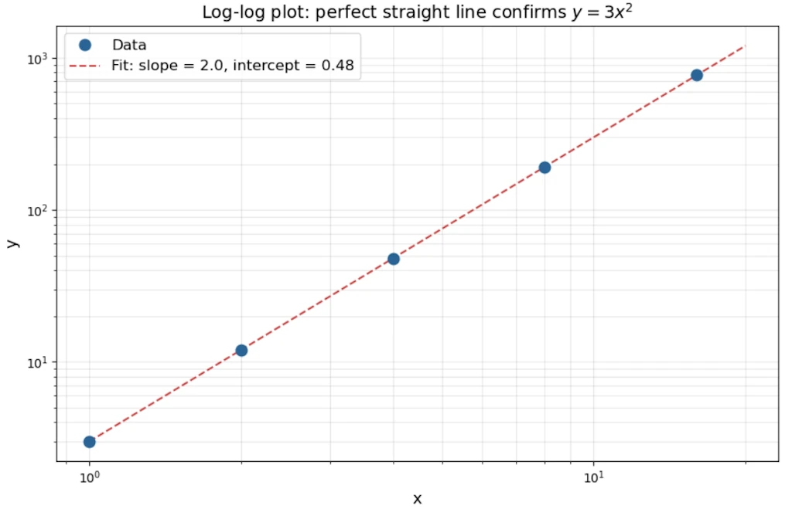
<figcaption>I'm a legend</figcaption>
</figure>


Now contrast with exponential data: $$y = 2 \cdot 3^x$$

| x | y |
|---|---|
| 1 | 6 |
| 2 | 18 |
| 3 | 54 |
| 4 | 162 |

Here when $$x$$ **increases by 1** (additive), $$y$$ **multiplies by 3** (constant ratio). For a power law, we need a multiplicative step in $$x$$ to get a constant ratio in $$y$$. That's the operational test.


<!-- ###################################################################### -->
### The "ratio test" in practice
{: .no_toc }

- Power law: $$y(2x)/y(x) =$$ constant (depends only on the factor, not on $$x$$)
- Exponential: $$y(x+1)/y(x) =$$ constant (constant ratio per additive step)


<!-- ###################################################################### -->
<!-- ###################################################################### -->
<!-- ###################################################################### -->
## Fitting: How to Determine That a Phenomenon Follows a Power Law


<!-- ###################################################################### -->
### Step 1: Log-log linearization
{: .no_toc }

Let's plot our data on log-log axes. If it looks linear, we have a candidate.


<!-- ###################################################################### -->
### Step 2: Linear regression on log-transformed data
{: .no_toc }

$$\log y = \alpha \log x + \log C$$

Run ordinary least square (OLS) on $$(\log x_i, \log y_i)$$ pairs. The slope gives $$\hat{\alpha}$$, the intercept gives $$\log \hat{C}$$.

**Caution:** This minimizes error in log-space, which implicitly assumes multiplicative (relative) errors, not additive ones. Fine for many natural phenomena, but check our assumptions.


<!-- ###################################################################### -->
### Step 3: The Clauset-Shalizi-Newman warning (2009)
{: .no_toc }

A landmark paper showed that **"looks linear on log-log" is necessary but not sufficient**. Many distributions that look like power laws on a log-log plot are actually log-normal or stretched exponential.

More rigorous approach:
1. Estimate $$x_{min}$$ (the lower cutoff, below which the power law doesn't hold)
2. Use **Maximum Likelihood Estimation** to estimate $$\alpha$$:

$$\hat{\alpha} = 1 + n \left[\sum_{i=1}^{n} \ln \frac{x_i}{x_{min}}\right]^{-1}$$

3. Use a **Kolmogorov-Smirnov test** to measure goodness-of-fit
4. Compare with alternative distributions (log-normal, exponential) via likelihood ratio tests

The code below runs this pipeline on two synthetic datasets: one sampled from a true Pareto distribution and one from a log-normal that looks identical on a log-log plot. The KS p-value and the log-likelihood ratio expose the difference.

```python
import numpy as np
import matplotlib.pyplot as plt
from scipy import stats

rng = np.random.default_rng(42)
xmin = 1.0
n = 2000

# --- Case 1: true power law (Pareto, alpha=2.5) ---
alpha_true = 2.5
u = rng.uniform(0, 1, n)
data_pl = xmin * (1 - u) ** (-1 / alpha_true)

# --- Case 2: log-normal impostor ---
data_ln = rng.lognormal(mean=0.0, sigma=1.5, size=n)
data_ln = data_ln[data_ln >= xmin]


def mle_alpha(data, xmin):
    """Clauset-Shalizi-Newman MLE for power-law exponent."""
    x = data[data >= xmin]
    return 1 + len(x) / np.sum(np.log(x / xmin))


def ks_pvalue(data, xmin, alpha_hat, n_boot=400):
    """Bootstrap p-value for KS goodness-of-fit."""
    x = np.sort(data[data >= xmin])
    n = len(x)
    ecdf = np.arange(1, n + 1) / n
    tcdf = 1 - (xmin / x) ** (alpha_hat - 1)
    ks_obs = np.max(np.abs(ecdf - tcdf))
    count = 0
    for _ in range(n_boot):
        boot = xmin * rng.uniform(0, 1, n) ** (-1 / alpha_hat)
        a_b = mle_alpha(boot, xmin)
        xb = np.sort(boot)
        ecdf_b = np.arange(1, n + 1) / n
        tcdf_b = 1 - (xmin / xb) ** (a_b - 1)
        if np.max(np.abs(ecdf_b - tcdf_b)) >= ks_obs:
            count += 1
    return ks_obs, count / n_boot


def loglik_pl(data, xmin, alpha):
    x = data[data >= xmin]
    n = len(x)
    return n * np.log(alpha - 1) - n * np.log(xmin) - alpha * np.sum(np.log(x / xmin))


def loglik_ln(data, xmin):
    x = data[data >= xmin]
    mu = np.mean(np.log(x))
    sigma = np.std(np.log(x), ddof=1)
    return np.sum(stats.lognorm.logpdf(x, s=sigma, scale=np.exp(mu)))


results = []
for data, label, color in [
    (data_pl, "True power law (Pareto)", "#FF7F0E"),
    (data_ln, "Log-normal impostor",     "#1F77B4"),
]:
    a = mle_alpha(data, xmin)
    ks, p = ks_pvalue(data, xmin, a)
    lr = loglik_pl(data, xmin, a) - loglik_ln(data, xmin)
    results.append((data, label, color, a, ks, p, lr))

fig, axes = plt.subplots(1, 2, figsize=(14, 6))

for ax, (data, label, color, a, ks, p, lr) in zip(axes, results):
    x = np.sort(data[data >= xmin])
    ccdf = 1 - np.arange(1, len(x) + 1) / len(x)
    ax.loglog(x, ccdf + 1e-6, ".", alpha=0.25, markersize=10, color=color)

    x_fit = np.logspace(np.log10(xmin), np.log10(x[-1]), 300)
    ax.loglog(x_fit, (xmin / x_fit) ** (a - 1), "-", linewidth=1,
              color="black", label=f"Power law fit  alpha={a:.2f}")

    verdict  = "CONFIRMED" if p >= 0.1 else "REJECTED"
    lr_label = "PL favored" if lr > 0 else "Log-normal favored"
    ax.set_title(
        f"{label}\n"
        f"KS p-value = {p:.2f}  =>  {verdict}\n"
        f"Log-LR = {lr:.1f}  ({lr_label})",
        fontsize=12,
    )
    ax.set_xlabel("x", fontsize=12)
    ax.set_ylabel("P(X > x)", fontsize=12)
    ax.legend(fontsize=11)
    ax.grid(True, alpha=0.3, which="both")

fig.suptitle("CSN Test: Confirming vs. Rejecting a Power Law")
fig.tight_layout()
plt.show()
```


<figure style="max-width: 900px; margin: auto; text-align: center;">
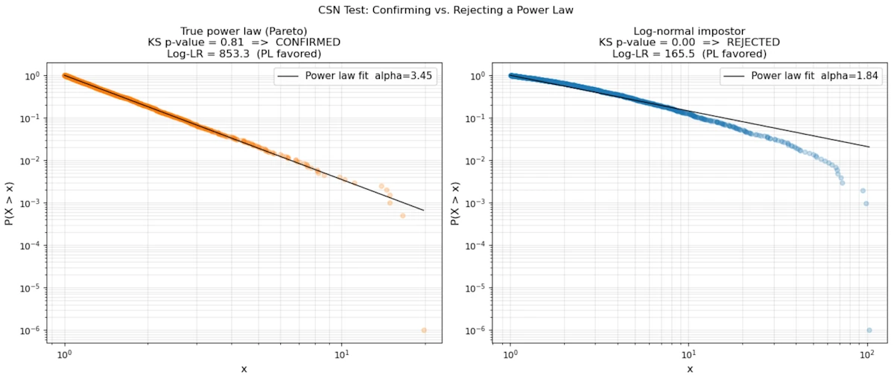
<figcaption>CSN Test: Confirming vs. Rejecting a Power Law</figcaption>
</figure>


<!-- ###################################################################### -->
### Step 4: Watch for the heavy tail
{: .no_toc }

Power law distributions with $$\alpha \leq 2$$ have **infinite variance**. With $$\alpha \leq 1$$, even the mean is infinite. This section explains why, step by step and shows the consequences with an example.


#### **The density function**
{: .no_toc }

Throughout this section we use the **CCDF tail exponent**: $$P(X > x) \sim x^{-\alpha}$$. The corresponding probability density is:

$$f(x) = \frac{\alpha}{x_{\min}} \left(\frac{x}{x_{\min}}\right)^{-(\alpha+1)}, \qquad x \geq x_{\min}$$

This is the Pareto distribution. The exponent on the density is $$-(\alpha+1)$$, one unit steeper than the tail, because differentiating $$x^{-\alpha}$$ gives $$\alpha x^{-(\alpha+1)}$$.


#### **Why the mean can be infinite ($$\alpha \leq 1$$)**
{: .no_toc }

By definition, $$\mathbb{E}[X] = \displaystyle\int_{x_{\min}}^{+\infty} x \cdot f(x)\, dx$$. Substituting:

$$\mathbb{E}[X] = \int_{x_{\min}}^{+\infty} x \cdot \frac{\alpha}{x_{\min}^{-\alpha}} \cdot x^{-(\alpha+1)}\, dx = \alpha\, x_{\min}^{\alpha} \int_{x_{\min}}^{+\infty} x^{-\alpha}\, dx$$

The key is the integral $$\displaystyle\int_{x_{\min}}^{+\infty} x^{-\alpha}\, dx$$. Using the power rule for antiderivatives:

$$\int_{x_{\min}}^{A} x^{-\alpha}\, dx = \left[\frac{x^{1-\alpha}}{1-\alpha}\right]_{x_{\min}}^{A} = \frac{A^{1-\alpha} - x_{\min}^{1-\alpha}}{1-\alpha}$$

Now let $$A \to +\infty$$:

- If $$\alpha > 1$$: the exponent $$1 - \alpha < 0$$, so $$A^{1-\alpha} \to 0$$. The integral converges and $$\mathbb{E}[X] = \dfrac{\alpha\, x_{\min}}{\alpha - 1}$$.
- If $$\alpha \leq 1$$: the exponent $$1 - \alpha \geq 0$$, so $$A^{1-\alpha} \to +\infty$$. The integral diverges. **The mean is infinite.**

**What does "infinite mean" feel like in practice?** Draw $$n$$ samples and compute their average. The average does not settle around a fixed value as $$n$$ grows; instead, every now and then, an astronomically large value appears and jerks the average upward. There is no "typical" observation and no reliable center of gravity.


#### **Why the variance can be infinite ($$\alpha \leq 2$$)**
{: .no_toc }


Variance is $$\text{Var}(X) = \mathbb{E}[X^2] - \mathbb{E}[X]^2$$. Even if the mean is finite ($$\alpha > 1$$), the variance is infinite when $$\mathbb{E}[X^2]$$ diverges:

$$\mathbb{E}[X^2] = \alpha\, x_{\min}^{\alpha} \int_{x_{\min}}^{+\infty} x^{1-\alpha}\, dx$$

Same reasoning: this integral converges if and only if $$1 - \alpha < -1$$, i.e., $$\alpha > 2$$.

- If $$\alpha > 2$$: variance is finite.
- If $$1 < \alpha \leq 2$$: mean exists, but variance is **infinite**. The central limit theorem does not apply. Sample averages converge, but agonizingly slowly, and fluctuations remain huge.


#### **Summary table:**
{: .no_toc }

| Condition | Mean | Variance |
|-----------|------|----------|
| $$\alpha > 2$$ | finite | finite |
| $$1 < \alpha \leq 2$$ | finite | **infinite** |
| $$\alpha \leq 1$$ | **infinite** | **infinite** |


#### **The 2008 financial crisis: a concrete illustration**
{: .no_toc }

From the 1990s onward, banks managed risk with a tool called **Value at Risk (VaR)**. The idea is simple: "what is the maximum amount we can lose in one day, with 99% confidence?" A 10M$ VaR means that, 99 days out of 100, the daily loss stays below 10M$.

To compute VaR, risk managers modeled daily asset returns as a **Gaussian distribution**. Under a Gaussian, the probability of losing more than 5 standard deviations (a "5-sigma event") is about $$3 \times 10^{-7}$$, or once every 14 000 years. Models said such events were essentially impossible.

The problem: asset return tails are not Gaussian. Empirical studies consistently find they follow a power law with $$\alpha \approx 3$$ (the so-called "cubic law" of returns). With $$\alpha = 3$$:

$$P(|r| > k\,\sigma) \sim k^{-3}$$

A "5-sigma event" has probability $$\sim 5^{-3} = 0.8\%$$, or roughly once every four months, not once every 14 000 years. The tails of a power law are incomparably fatter than a Gaussian tail.

Because $$\alpha = 3 > 2$$, variance is technically finite, so the Gaussian models were not obviously wrong in normal times. But the Gaussian drastically underestimated the probability of extreme moves. When the 2007-2008 crisis hit, VaR models said events with probability $$10^{-7}$$ were occurring week after week. They were not outliers, they were business as usual for a power-law distribution. Banks had set aside nowhere near enough capital to cover those losses, and the rest is history.


<!-- ###################################################################### -->
<!-- ###################################################################### -->
<!-- ###################################################################### -->
## Can We Convert Between Power Law and Exponential?

<!-- This is a subtle and interesting question. -->


<!-- ###################################################################### -->
### Mathematically: yes, via a change of variable
{: .no_toc }

Start with an exponential: $$y = Ce^{\lambda x}$$. Substitute $$x = \log t$$ (so $$t = e^x$$):

$$y = Ce^{\lambda \log t} = C \cdot t^{\lambda}$$

That's a power law in $$t$$! So: **an exponential in $$x$$ is a power law in $$e^x$$**, and conversely **a power law in $$x$$ is an exponential in $$\log x$$**.

This means log-normal data will appear as a power law if we accidentally plot it on the wrong axes (a very common mistake).


<!-- ###################################################################### -->
### Practically: when does this matter?
{: .no_toc }

In **network growth models**, preferential attachment (new nodes connect to existing nodes proportionally to their degree) generates power-law degree distributions. If instead growth were random (each new node equally likely to connect to any existing node), we would get an exponential distribution. The mechanism determines the law.

In **machine learning**: learning curves often follow a power law in the number of training samples: $$\text{error} \propto n^{-\alpha}$$. This has become crucial for **scaling laws** in large language models (Chinchilla, GPT-4 scaling). The implication is that we can extrapolate performance from small experiments — if the log-log relationship is linear, we can predict what a 10× larger model will do.


<!-- ###################################################################### -->
<!-- ###################################################################### -->
<!-- ###################################################################### -->
## When to Use a Power Law

We can use a power law when:

- **Scale invariance** is physically plausible. There's no natural characteristic scale in the system (vs. radioactive decay, which has a half-life: a characteristic time scale $$\rightarrow$$ exponential)
- We observe **"the rich get richer"** dynamics: multiplicative feedback, preferential attachment, cumulative advantage
- Our data has a **heavy tail** and extreme events are far more common than a Gaussian or exponential would predict
- The phenomenon involves **geometric/fractal self-similarity** (coastlines, vascular networks, drainage basins, pile of sand)
- We are dealing with **rank-frequency** relationships (words, cities, firms)

We should prefer an exponential when:
- There's a **constant per-unit-time probability** of an event (Poisson process $$\rightarrow$$ exponential waiting times)
- There's a **characteristic scale** (half-life, mean free path, time constant)
- The system has a **maximum** or **saturation** (logistic growth, not pure exponential, but related)

The deepest intuition: power laws emerge from **multiplicative processes without a characteristic scale**; exponentials emerge from **additive or constant-rate processes with a characteristic scale**.


<!-- ###################################################################### -->
<!-- ###################################################################### -->
<!-- ###################################################################### -->
## Conclusion

Power laws are not a mathematical curiosity. They are a recurring signature of how complex/scale-invariant/fractals systems actually work: a mouse and an elephant share the same metabolic blueprint scaled by a single exponent. A magnitude-8 earthquake is not a freak accident but the predictable tail of the same distribution that produces magnitude-2 tremors every day.

Three ideas are worth keeping:

1. **The log-log plot is a diagnostic, not a proof**: A straight line on log-log axes is the first clue, but log-normal distributions can produce the same visual. Rigorous confirmation requires MLE, a goodness-of-fit test, and a likelihood comparison against alternatives. This is exactly what Clauset, Shalizi, and Newman showed in 2009.

2. **The exponent $$\alpha$$ carries real stakes**: It is not just a fitting parameter. It determines whether the mean and variance of the phenomenon are mathematically finite. A system with $$\alpha \leq 2$$ has no stable "average" behavior in the sense the central limit theorem requires. Designing policy, infrastructure, or financial models as if the average were representative is how catastrophic surprises happen.

3. **The mechanism matters as much as the fit**: A power law is not just a description. It is evidence of a process, preferential attachment, self-organized criticality, multiplicative growth... Identifying that process tells us how the system will behave as it scales and whether the power law will hold beyond the range of our data.

From Kleiber's metabolic measurements in the 1930s to the scaling laws now used to predict the performance of language models, the same mathematical structure keeps reappearing. Learning to recognize it and to test it honestly is one of the most broadly useful tools in quantitative reasoning.


<!-- ###################################################################### -->
<!-- ###################################################################### -->
<!-- ###################################################################### -->
## Webliography


* [Percentage and exponential growth]()


<!-- * [Link to a web page](https://cleonis.nl/physics/phys256/energy_position_equation.php).
* [Link to a page of the site]()
-->

<figure style="max-width: 560px; margin: auto;">
<div style="position: relative; padding-bottom: 56.25%; height: 0;">
    <iframe
    src="https://www.youtube.com/embed/MrsjMiL9W9o"
    title="Krachs Boursiers & Tremblements De Terre"
    style="position: absolute; inset: 0; width: 100%; height: 100%;"
    allowfullscreen>
    </iframe>
</div>
<figcaption style="text-align: center;">Krachs Boursiers & Tremblements De Terre</figcaption>
</figure>


<figure style="max-width: 560px; margin: auto;">
<div style="position: relative; padding-bottom: 56.25%; height: 0;">
    <iframe
    src="https://www.youtube.com/embed/HBluLfX2F_k?start=0"
    title="What is a power law?"
    style="position: absolute; inset: 0; width: 100%; height: 100%;"
    allowfullscreen>
    </iframe>
</div>
<figcaption style="text-align: center;">What is a power law?</figcaption>
</figure>


