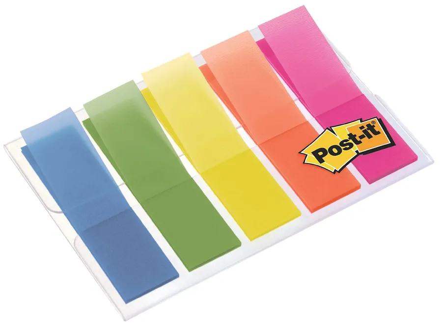
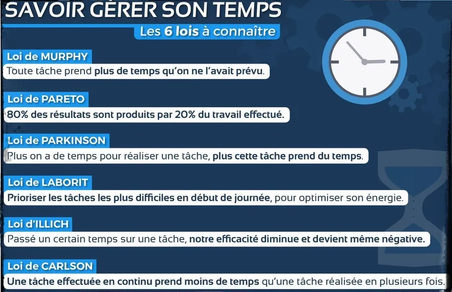

# Comment apprendre ?

## Introduction
Comment apprendre ? En ces temps de rentrée scolaire (au moment de la rédaction initiale de ce billet) "en voilà une question qu'elle est bonne !". Plus sérieusement j'ai eu l'occasion d'en discuter avec des élèves, de chercher un peu sur le Web où j'ai trouvé des informations principalement en anglais alors... Alors j'ai décidé de mettre les choses à plat en français et de faire une fiche de cuisine applicable de suite, dès la fin de lecture de ce billet.

Comme les mêmes causes produisent les mêmes effets… Si je ne change rien je vais obtenir les mêmes résultats. Autrement dit **si je souhaite améliorer mes résultats j'ai tout intérêt à essayer autre chose** et pourquoi pas ma façon d'apprendre et de retenir mes cours.

### Note
Tout ce qui est dit par la suite est justifié et/ou prouvé. Comme je ne souhaite pas alourdir cette fiche de cuisine je n'ai pas donné toutes les références. Je sais, c'est pas bien. Cela dit, si le sujet vous intéresse n'hésitez pas, suivez par exemple la vidéo qui se trouve à la fin du billet. Ensuite, ne me croyez pas sur paroles, cherchez des confirmations et n'oubliez pas que Google est votre ami...

## Se reposer
* Je vais au lit sans écran (tél portable, liseuse, iPad...)
* Ensuite, je dors au moins **8 heures** et j'essaie d'être le plus routinier possible tout au long de l’année (ce n'est pas drôle mais si c'est l'année du BAC faut peut-être se donner les moyens de ses ambitions). Je ne suis pas ta mère, c'est toi qui vois mais bon tu peux pas d'un côté vénérer tel ou tel sportif qui a organisé sa vie autour des son sports depuis qu'il est tout petit et penser que toi, ca va tomber tout seul.
* Je m'arrange pour marcher au moins 15 minutes en allant au lycée. Descend un ou deux arrêts avant si tu viens de loin. Là aussi, réfléchis. Donne toi les moyens.
* Enfin, je m'arrange pour marcher au moins 15 minutes sur le chemin du retour (idéalement faudrait marcher 1H par jour, à un rythme un peu soutenu [110 ppm par exemple]).

## Apprendre

{: .warning }
De retour à la maison, je commence par **relire** mon cours.

**Aucune excuse n'est acceptable !** Point. Je ferai le reste ensuite (exercices, DM…).  

Soyez persuadé que toute autre méthode est vouée à l'échec. En effet, vous allez prendre de plus en plus de retard dans les cours, les exercices...

## Une séance Pomodoro - COURS
1. Mettre le téléphone en mode minuteur pour 25 minutes.
1. Vérifier qu'il est bien en mode avion
1. Pas de PC ni de TV. Rien

### Début
* Je précise **à voix haute** mon objectif. Exemple : "Je vais apprendre mon cours avec une attention soutenue pendant 25 min."
* Je ne pars surtout pas avec l'idée d'apprendre tous mes cours en 25 min.
* Je n'ouvre pas mon cahier et j’essaie de me rappeler ce qu’il y avait dans le cours. 

### Milieu
* J'ouvre le cahier, je survole alors une fois l’ensemble du chapitre pour en identifier les grandes parties.
* Lors d’une 1ere relecture, j’ajoute des commentaires/notes/schémas dans mon cours. Je fais une lecture active. Cela veut dire qu'au cours de la lecture, je me pose des questions, je creuse, je fais le job quoi !
* Si un point n'est pas clair, je prends le temps de vérifier dans mon livre de cours  (j’évite Google et YouTube durant "un run" de type Pomodoro)
* Je n’utilise pas de Stabilo (ça ne sert à rien, c'est prouvé). Je n'hésite pas à prendre des notes sur un papier sur le côté.
* En maths, il faut lire les démonstrations. Oui je sais, c'est chiant et j'avais le même problème quand j'allais en cours. Le truc c'est qu'on lit ça comme s'il s'agissait d'une langue étrangère. En fait il faut connaître les signes (quelque soit, il existe, si et seulement si, nécessaire, suffisant...) puis se raconter une histoire. Sinon tout se passe comme si on lisait un texte en italien. On reconnaît certains mots mais l'histoire ne nous touche pas, on ne la retient pas, on ne la comprend pas.
* Dans les démonstrations il faut identifier et prendre conscience des étapes (les  numéroter puis attacher à chacune, un mot ou une note)
* Il faut lire les exercices qui sont dans le cours. Là aussi, il faut identifier et noter les étapes importantes
* À la fin de la page, je regarde ailleurs et je récite ce qu'il y a sur la page
* Ce n’est pas grave si je ne me rappelle pas tout. C'est normal. Pas de panique.
* Je relis la page de cours une seconde fois. Ce coup-ci j'ai pas ou peu de notes à ajouter
* À la fin de la page, je regarde ailleurs et je récite le contenu de la page
* Encore une fois, ce n’est pas grave si je ne me rappelle pas de tout. Je sais que je vais revenir sur mon cours.

### Fin
À la fin des 25 minutes je fais une pause de 5 minutes. Je me lève, je marche (non t'as pas besoin d'aller ouvrir le frigo), je pose mon regard sur des choses qui sont à plus d’un mètre de moi pour reposer mes yeux.

Si la relecture du cours n'est pas terminée alors je relance un second Pomodoro de 25 min.

Quand le cours est entièrement relu, tout n'est pas parfait mais je sens que je me l’approprie.

Il faut repérer (mini Post-it de couleur qu'on pourra enlever par exemple) les points sur lesquels il faudra revenir un autre jour :

* Point de cours toujours pas clair (revenir voir le prof, Google, YouTube)
* Démonstration dont je n’arrive pas à réciter les enchaînements
* Exercice du cours qu'il faut refaire

### Note

En période de révision, au bout de 4 Pomodori (période de 25 min.) il faut s'accorder une pose de 20-30 min. Il faut penser alors à aller **marcher dehors** au moins 10 minutes sur les 30 minutes que l'on s'accorde.

## Comprendre

Après avoir revu son cours, il faut résoudre exercices. *In other words...* Je ne fais pas d'exercices, et donc, je ne fais pas mes devoirs, sans avoir appris au préalable  mon cours.  

Cela dit, s’il faut avoir vu son cours il ne faut pas non plus attendre de connaître ce dernier par cœur pour commencer à faire des exercices car c'est contre-productif. 

Bref, à un moment, il faut se jeter à l'eau...

{: .important }
Ce n'est pas parce j’ai chanté une chanson une fois que je la connais. OK ? Donc, si je veux vraiment la connaître par cœur je **chante, chante encore, chante toujours**... Et quand je la connais je la rechante de temps à autre pour ne pas en oublier les paroles.

Si on fait ça pour les chansons il n'y a aucune raison de faire différemment pour son cours et les exercices. OK ? On est d'accord. Il faudra donc **refaire, refaire encore, refaire toujours**... certains exercices jusqu'à ce que ça roule tout seul.

### Une autre séance Pomodoro - EXERCICE

1. Mettre le téléphone en mode minuteur pour 25 minutes.
1. Vérifier qu'il est bien en mode avion
1. Pas de PC ni de TV. Rien

* Je précise à voix haute mon objectif. Exemple : "Je vais faire des exercices avec une attention soutenue pendant 25 min."
* J'attaque un exercice et je vais jusqu'au bout tout seul sans regarder la solution
* Si j'ai regardé la solution je reprends l'exercice et je vais au bout sans regarder la solution
* Il ne faut surtout pas lire la solution, la comprendre et se dire qu'on saura le refaire. C'est prouvé, ça ne marche pas. Ça s’appelle "**l'illusion de la compétence**" (c'est le piège des tutoriels sur YouTube par exemple). Pour progresser il faut nécessairement résoudre le problème par soi-même. 

{: .warning }
La compréhension c’est la récompense de la résolution 

Ça marche même si c’est la seconde fois ou la troisième fois qu’on fait l’exercice.

* Quand un concept est acquis ce n'est pas la peine de faire 5 exercices similaires. Au contraire, il faut passer à autre chose et varier les plaisirs...
* En plus des nouveaux exercices, il est alors essentiel de revenir sur les exercices de la veille et des jours précédents (**chanter, chanter encore, chanter toujours**). Il faut que les **répétitions soient espacées**. Par exemple : Lundi, Mardi, Mercredi, Vendredi, Dimanche. En cours d’année il faudra que je pense à revenir sur des exercices du début de l’année.

À la fin des 25 minutes je fais une pause de 5 min. Je me lève, je marche, je pose mon regard sur des choses à plus d’un mètre de moi.

### Les jours où il n'y a pas cours

Faire les choses importantes (ou qu'on aime moins) en début de matinée puis en début d'après-midi.

## Comment faire pour que ça reste dans la tête et s'en servir dans les contrôles ?

### Exercices et interrogations en temps limité
* C'est, de très loin, **le plus efficace.**
* Pour comprendre et retenir, une heure d'interrogation est bien plus rentable qu'une heure d'étude du cours.
* Je peux décider de faire tel ou tel exercice de mes devoirs en temps limité (faut penser à demander au prof une estimation du temps quand il donne les exercices à faire)
* Faire les DM en temps limité comme si c’était une interrogation (penser à demander au prof une estimation du temps)

### Créer et maintenir SA feuille de notes.

* C'est une feuille volante que j'ai toujours avec moi et sur laquelle je note ce que je n'arrive pas bien à me mettre dans le crâne.
* Cette feuille est dynamique. Cela signifie qu'en cours d'année, je vais ajouter et enlever des choses. Je vais très vraisemblablement la refaire entièrement plusieurs fois.
* Je ne mets que ce que je ne retiens pas. J’enlève ce dont je me rappelle ou qui est devenu évident en cours d'année. Je ne mets pas "Marignan 1515" par exemple.
* Je ne fais pas de belle phrases. Ton cerveau s'en fout. 2 mots clé, une formule, une abréviation... Ne note que les mots clé, pas de verbes, complément... Le strict minimum.
* Il n'est pas toujours possible de regrouper physiquement des concepts similaires et liés entre eux au même endroit sur la feuille. No problémo. Tire une flèche
* Peu importe que la feuille de notes soit belle et propre. C’est **ma** feuille, il n’y a que moi qui la relis. Si à la fin y a des pattes de mouches en bas à droite, des dessins, des encadrés en rouge... On s'en fiche.

### Répéter les devoirs et les exercices

* **Chanter, chanter encore, chanter toujours**
* Je ne vais pas faire 10 fois tous les problèmes ni toutes les démonstrations. Juste les plus significatifs et ceux dont j’ai du mal à me rappeler (on les retrouve facilement avec les mini PostIt).
* Je peux les refaire rapidement, au brouillon, dans la tête, au tableau… Je veux juste vérifier que je connais les étapes importantes.

### Vérifier ce dont je me rappelle

* Ouvrir un chapitre de cours au hasard et répéter le contenu des pages.
* Mettre à jour sa feuille de notes (rayer les choses connues)

### Expliquer un point du cours de telle sorte qu'un enfant de 10 ans puisse le comprendre

* C'est la méthode [Feynman](https://youtu.be/q-16DPh_VWw)
* Ça s’appelle "**Apprendre en enseignant**" car on se sent obligé de bien potasser le sujet avant d'en parler. Certains profs fonctionnent comme ça.

### Travailler à 3 (pas à 4 ou à 5, à 3)

* Bien choisir ses comparses. Il faut éviter d’avoir le même niveau dans toutes les matières.
* Être sûr que tout le monde a le même niveau de motivation.
* Ne pas hésiter à quitter rapidement le groupe si ça ne marche pas. On ne se fâche pas avec ses potes. Le truc c'est qu'on est peut-être potes mais on n'arrive pas à travailler ensemble efficacement. Faut alors trouver/monter un autre trinôme.

## Créer SON planning hebdomadaire

Le mieux c’est d’utiliser Excel ou Google sheets

* Commencer par placer dans la semaine les périodes de jeu, de sport, de détente, d'entraînements…
* Ajouter les heures de cours sans oublier les temps de trajets
* Identifier des slots de 30 min. Pas de pose entre les slots car un slot de 30min c'est 25 min. de travail + 5 min. de break. 
* Ensuite faut une pose de 30 minutes au bout de 4 runs consécutifs.
* Mettre en fin de journée les sessions d’apprentissage des cours de la journée (encore une fois, ce point **est non discutable**). Au début de l'année poser 1 Pomodoro de relecture de cours pour 2H de classe. Ajuster ensuite avec l’expérience.
* Ajouter des slots de compréhension pendant lesquels je résous des exercices, les DM, les exercices déjà fait etc. Pour que ça rentre il faut revoir ce que l’on a vu à J-1, J-2, J-5 et J-10. C'est sans doute une bonne idée que d'écrire dans l'agenda un truc du style "Exos J-5".
* Mettre des slots pour revoir les cours. Penser aux répétitions espacées. Là aussi, pour que le cours rentre il faut revoir ce que l’on a vu à J-1, J-2, J-5 et J-10
* Mettre un warning sur l'agenda et indiquer qu'il faut relire les chapitres et refaire les exercices des semaines et mois précédents.

Imprimer sur une feuille A3 et afficher l’agenda au-dessus de son bureau

Il faut ajuster l’agenda en cours d’année selon l’expérience acquise. Par exemple :

* Ajouter un slot de plus pour la philo
* Supprimer un slot d’histoire-géo

Sur une feuille A4, faire des agendas spécifiques à telle ou telle période de congés scolaires.

## Liens utiles

* La vidéo de [Barbara OAKLEY](https://youtu.be/vd2dtkMINIw)
* Son [livre](https://www.amazon.fr/Mind-Numbers-Science-Flunked-Algebra/dp/039916524X/ref%3Dsr_1_1?ie=UTF8&qid=1505680218&sr=8-1&keywords=Barbara+OAKLEY)
* La [page](http://bigthink.com/neurobonkers/assessing-the-evidence-for-the-one-thing-you-never-get-taught-in-school-how-to-learn) How To Learn du site BigThink avec leur classement de différentes méthodes
* Une autre [vidéo en Anglais](https://youtu.be/eVlvxHJdql8) (mais avec beaucoup de dessins) qui présente différentes options pour mieux apprendre
* J'aime bien ce que fait [David Louarpe](https://youtu.be/RVB3PBPxMWg?si=rtQJkQbPGJQzpPXD) et la vidéo ci-dessous ne déroge pas à la règle.
* Un [article sur LinkedIn](https://www.linkedin.com/pulse/savoir-g%C3%A9rer-son-temps-stephan-comelli/?trackingId=zhZ%2BV2dqwIiHnLJNX%2Bv%2B8w%3D%3D) sur la gestion du temps que je trouve vraiment pas mal.

