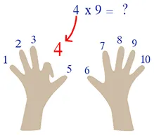

# La table de multiplication

{: .important }
Under Construction

## Introduction

## Une remarque

1. Je dois effectuer 6 x 9.
2. Avec l'astuce précédente, je remarque que le chiffre des dizaines c'est le plus petit des opérandes moins 1.
3. Donc ici le résultat sera un truc du style 5...
4. Donc, pas la peine de sortir 45 ou 63
5. Le résultat c'est 54

## Pour faire une évaluation

Allez faire un tour sur ce site de [révision des tables de multiplication](http://tables-de-multiplication.fr/tafels-oefenen.aspx). Ce n'est pas le seul dans son genre, loin de là.

[Lire la suite...](https://www.40tude.fr/priorite-des-operateurs/)

