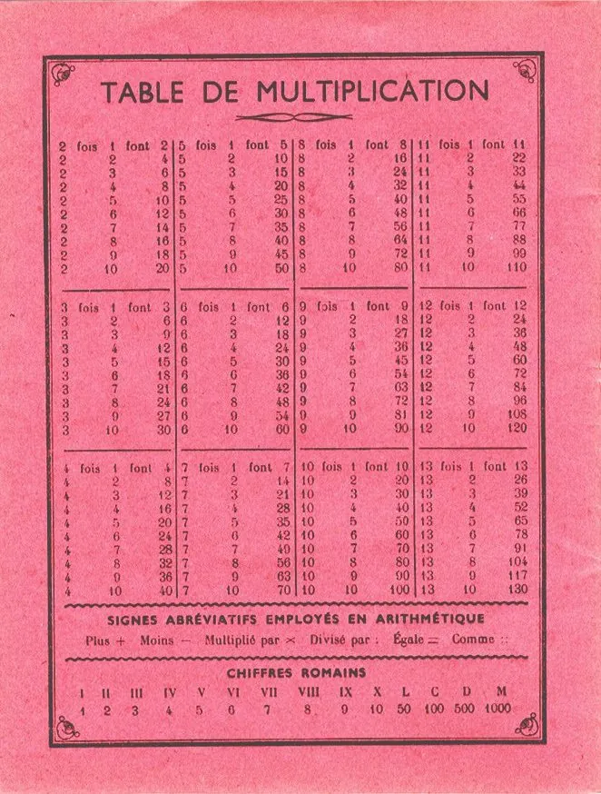

# La table de multiplication

## Introduction

Hop, pop, pop.... Ne quittez pas la page, ne tournez pas les talons, je n'en ai pas terminé avec vous. Oui, oui la table de multiplication à l'heure du machine learning ça fait ringard et ça rappelle les images d’Épinal. Mais bon... Prenons quand même le temps de faire le point.

En règle générale, l’addition et la soustraction ça va à peu près (quoique...). Cependant, je suis toujours étonné de voir autant d’erreurs de calcul liées à la non-connaissance de la table de multiplication. Très souvent l’élève où l'étudiant traîne ce problème depuis des années. Jusque-là, il a toujours réussi à s'en sortir en utilisant sa calculatrice, son téléphone ou ses petits doigts boudinés...

Attention, ne vous méprenez pas. J’ai une calculatrice qui fait du calcul formel, un téléphone, des PC, des feuilles de calcul... Oui, oui je confirme j’utilise [Wolfram Alpha](http://www.wolframalpha.com/) avec beaucoup de plaisir, j’adore [GeoGebra](https://www.geogebra.org/graphing) et [Desmos Graph](https://www.desmos.com/). Bref, je ne vis pas dans une grotte et non je ne râle pas après tous ces jeunes chevelus qui écoutent de la musique bizarre et qui savent à peine compter.

### Des choix et des conséquences
Il n'empêche, du côté des tables de multiplication, le constat n'est pas brillant et donc, il faut vraiment prendre conscience que le fait de ne pas les **connaître par coeur** (et c'est malheureusement, tout simplement, non discutable) a des conséquences significatives :

* Erreurs dans les calculs. C’est la moindre des choses… C’est le sujet de cette série.
* Lenteur dans les calculs. Tout le temps passer à vérifier ou à refaire ses calculs c’est du temps qu’on ne passe pas sur les autres questions du DST et/ou à construire un raisonnement.
* Lenteur à suivre les calculs effectués au tableau. Si le prof considère que tout le monde connaît ses tables, il ne va pas perdre de temps et il va poursuivre son bonhomme de chemin. Cela dit, si on est à la "ramasse", en train de copier sans comprendre ce qui se passe, c'est sûr, on ne retiendra rien du raisonnent. Autrement dit un truc de base nous fait passer à côté de l'essentiel.
* Erreur dans les divisions. Si je ne sais pas que 9 x 6 = 54, lorsque je vais devoir diviser 54t² par 9t, il y a de très fortes chances pour que je fasse une erreur.
* Manque de confiance en soi sur les autres sujets. Je suis nul en multiplication donc je suis nul en dérivation, en logique, en intégration etc. Ce n’est même pas la peine que je m’y mette c’est fichu d’avance... Autant s’asseoir et pleurer sur son triste sort.

### Une autre analogie...
De mon point de vue tout se passe comme si on se proposait de lire et de commenter ce qui a déjà été écrit en sachant lire et écrire de manière approximative. Le problème serait le même avec l'étude de l'histoire, de la philo etc. "Ce n'est pas grave puisque mon PC peut lire un texte à ma place et si je fais des fautes, le correcteur me remettra dans le droit chemin"... Peut-être... Au pays des "Bisousnours" sans doute... C'est oublier que le fait de ne pas avoir une base solide (lire/écrire) empêche de construire des raisonnements élaborés à l'aide d'un vocabulaire précis. Bref, on aura peu d'idées et on les exprimera pauvrement.

## Apprendre la table de multiplication
La solution ? Je suis désolé mais il n'y en a pas 36. Il faut revenir sur la table de multiplication et **l’apprendre par coeur**. Ceci dit la bonne nouvelle c’est qu’en fait, il reste très peu de choses à **apprendre par coeur**.

Allons-y, Alonso. Voilà une table de multiplication. Si, si, je te jure, ça ressemble à ça :

| x  | 1  | 2  | 3  | 4  | 5  | 6  | 7  | 8  | 9  |
|:--:|:--:|:--:|:--:|:--:|:--:|:--:|:--:|:--:|:--:|
| 1  | 1  | 2  | 3  | 4  | 5  | 6  | 7  | 8  | 9  |
| 2  | 2  | 4  | 6  | 8  | 10 | 12 | 14 | 16 | 18 |
| 3  | 3  | 6  | 9  | 12 | 15 | 18 | 21 | 24 | 27 |
| 4  | 4  | 8  | 12 | 16 | 20 | 24 | 28 | 32 | 36 |
| 5  | 5  | 10 | 15 | 20 | 25 | 30 | 35 | 40 | 45 |
| 6  | 6  | 12 | 18 | 24 | 30 | 36 | 42 | 48 | 54 |
| 7  | 7  | 14 | 21 | 28 | 35 | 42 | 49 | 56 | 63 |
| 8  | 8  | 16 | 24 | 32 | 40 | 48 | 56 | 64 | 72 |
| 9  | 9  | 18 | 27 | 36 | 45 | 54 | 63 | 72 | 81 |

### Simplification N°1
Comme la multiplication est une opération commutative 4 x 8 est équivalent à 8 x 4. Autrement dit, si on tire un trait en diagonal qui relie le x en haut à gauche au 81 en bas à droite, nous n'avons besoin d'apprendre qu'une des 2 moitiés. Le plus dur c'est de choisir celle qu'on garde. Allez, je choisi la moitié supérieure. 

Voilà la nouvelle table à apprendre. Nous sommes passé de 81 multiplications à 45. Pas mal, on a divisé le boulot par presque 2.

| x  | 1  | 2  | 3  | 4  | 5  | 6  | 7  | 8  | 9  |
|:--:|:--:|:--:|:--:|:--:|:--:|:--:|:--:|:--:|:--:|
| 1  | 1  | 2  | 3  | 4  | 5  | 6  | 7  | 8  | 9  |
| 2  |    | 4  | 6  | 8  | 10 | 12 | 14 | 16 | 18 |
| 3  |    |    | 9  | 12 | 15 | 18 | 21 | 24 | 27 |
| 4  |    |    |    | 16 | 20 | 24 | 28 | 32 | 36 |
| 5  |    |    |    |    | 25 | 30 | 35 | 40 | 45 |
| 6  |    |    |    |    |    | 36 | 42 | 48 | 54 |
| 7  |    |    |    |    |    |    | 49 | 56 | 63 |
| 8  |    |    |    |    |    |    |    | 64 | 72 |
| 9  |    |    |    |    |    |    |    |    | 81 |

### Simplification N°2
Bon... On va peut-être remarquer que depuis le temps, on connaît la table de 1. On peut donc supprimer la première ligne. Il reste :

| x  | 1  | 2  | 3  | 4  | 5  | 6  | 7  | 8  | 9  |
|:--:|:--:|:--:|:--:|:--:|:--:|:--:|:--:|:--:|:--:|
| 1  |    |    |    |    |    |    |    |    |    |
| 2  |    | 4  | 6  | 8  | 10 | 12 | 14 | 16 | 18 |
| 3  |    |    | 9  | 12 | 15 | 18 | 21 | 24 | 27 |
| 4  |    |    |    | 16 | 20 | 24 | 28 | 32 | 36 |
| 5  |    |    |    |    | 25 | 30 | 35 | 40 | 45 |
| 6  |    |    |    |    |    | 36 | 42 | 48 | 54 |
| 7  |    |    |    |    |    |    | 49 | 56 | 63 |
| 8  |    |    |    |    |    |    |    | 64 | 72 |
| 9  |    |    |    |    |    |    |    |    | 81 |

Idem avec la table de 2. Allez zou, on supprime la seconde ligne. Il reste :

| x  | 1  | 2  | 3  | 4  | 5  | 6  | 7  | 8  | 9  |
|:--:|:--:|:--:|:--:|:--:|:--:|:--:|:--:|:--:|:--:|
| 1  |    |    |    |    |    |    |    |    |    |
| 2  |    |    |    |    |    |    |    |    |    |
| 3  |    |    | 9  | 12 | 15 | 18 | 21 | 24 | 27 |
| 4  |    |    |    | 16 | 20 | 24 | 28 | 32 | 36 |
| 5  |    |    |    |    | 25 | 30 | 35 | 40 | 45 |
| 6  |    |    |    |    |    | 36 | 42 | 48 | 54 |
| 7  |    |    |    |    |    |    | 49 | 56 | 63 |
| 8  |    |    |    |    |    |    |    | 64 | 72 |
| 9  |    |    |    |    |    |    |    |    | 81 |

### Simplification N°3
À ce stade, il ne reste plus que 28 multiplications à **apprendre par coeur**. Et c'est pas finit... On peut encore simplifier. En effet, on connaît généralement la table de 5 car ça se termine toujours avec des 0 ou des 5. Allez, encore 5 multiplications à supprimer. Il reste : 

| x  | 1  | 2  | 3  | 4  | 5  | 6  | 7  | 8  | 9  |
|:--:|:--:|:--:|:--:|:--:|:--:|:--:|:--:|:--:|:--:|
| 1  |    |    |    |    |    |    |    |    |    |
| 2  |    |    |    |    |    |    |    |    |    |
| 3  |    |    | 9  | 12 | 15 | 18 | 21 | 24 | 27 |
| 4  |    |    |    | 16 | 20 | 24 | 28 | 32 | 36 |
| 5  |    |    |    |    |    |    |    |    |    |
| 6  |    |    |    |    |    | 36 | 42 | 48 | 54 |
| 7  |    |    |    |    |    |    | 49 | 56 | 63 |
| 8  |    |    |    |    |    |    |    | 64 | 72 |
| 9  |    |    |    |    |    |    |    |    | 81 |

### Simplification N°4
Ensuite c'est un peu dépendant de la personne.  
En règle générale, on se rappelle bien les carrés.  
Par exemple 4 x 4 = 16 ou 7 x 7 = 49.  
J'aurai tendance à les enlever mais ce n'est peut-être pas votre cas.  
À vous de voir.

| x  | 1  | 2  | 3  | 4  | 5  | 6  | 7  | 8  | 9  |
|:--:|:--:|:--:|:--:|:--:|:--:|:--:|:--:|:--:|:--:|
| 1  |    |    |    |    |    |    |    |    |    |
| 2  |    |    |    |    |    |    |    |    |    |
| 3  |    |    | 9  | 12 | 15 | 18 | 21 | 24 | 27 |
| 4  |    |    |    |    | 20 | 24 | 28 | 32 | 36 |
| 5  |    |    |    |    |    |    |    |    |    |
| 6  |    |    |    |    |    |    | 42 | 48 | 54 |
| 7  |    |    |    |    |    |    |    | 56 | 63 |
| 8  |    |    |    |    |    |    |    |    | 72 |
| 9  |    |    |    |    |    |    |    |    |    |

### Du sur mesure
Là, pour le coup, on rentre vraiment dans le spécifique et le cas par cas. Concernant les multiplications par 4 et 3 soit vous savez, soit vous hésitez. Ne vous bercez pas d'illusions. Une demi-seconde d’hésitation et vous devez considérer que vous ne connaissez pas 8 x 4 par exemple.

Soyez dur mais honnête avec vous-même. Demandez à une autre personne de vous interroger. Oui, je sais, c'est un peu la honte mais bon, par exemple, vous pouvez faire le test avec un collègue de classe ou une personne de confiance. La grand-mère semble une bonne candidate et comme en plus il y a de fortes chances pour qu'elle vous mette la honte, y a moyen de passer un bon moment avec elle. C'est important les mamies, faut les chouchouter.

De plus, je confirme qu'il est difficile de se tester sois même. En effet, lorsqu'on prononce la question "5 x 3", notre cerveau est déjà en mode recherche de la réponse. Il faut donc vraiment que l'on ne s'attende pas à la question, qu'on soit surpris etc. On peut aussi utiliser une application en ligne (voir plus bas).

Encore une fois. Si vous hésitez, il faut laisser la case en question dans la table de multiplication "trouée". De toute façon, au début, il vaut mieux avoir trop de cases remplies quitte à, très rapidement, les rayer une fois qu'on ne fait plus d'erreur.

### Pour les terminales 

Oui, oui... Je confirme, pour les terminales
Allez, je vous donne une table de multiplication "trouée" typique d'un niveau de terminale

| x  | 1  | 2  | 3  | 4  | 5  | 6  | 7  | 8  | 9  |
|:--:|:--:|:--:|:--:|:--:|:--:|:--:|:--:|:--:|:--:|
| 1  |    |    |    |    |    |    |    |    |    |
| 2  |    |    |    |    |    |    |    |    |    |
| 3  |    |    |    |    |    |    | 21 | 24 | 27 |
| 4  |    |    |    |    |    | 24 |    | 32 | 36 |
| 5  |    |    |    |    |    |    |    |    |    |
| 6  |    |    |    |    |    |    | 42 | 48 | 54 |
| 7  |    |    |    |    |    |    |    | 56 | 63 |
| 8  |    |    |    |    |    |    |    |    | 72 |
| 9  |    |    |    |    |    |    |    |    |    |

Admettons que ce soit votre table de multiplication "trouée". Que faire maintenant ?  
Il faut la copier dans une feuille Excel ou un Google sheet et l'imprimer en 2 exemplaires sur des feuilles A4 (21 x 29.6). 
Sinon n'hésitez pas. Une feuille de cahier, un gros feutre et zou, problème réglé. 
Il faut que la table de multiplication "trouée" prenne le maximum de place sur la feuille.  
Ensuite, il faut accrocher un exemplaire au-dessus de votre plan de travail et garder l'autre de côté.

### Then ?
Enfin, il faut se fixer une discipline qui dit un truc du style "Je n'attaque pas mes devoirs sans avoir testé 5 multiplications". 
On peut aussi essayer le fameux "Je ne vais pas sur "face de bouc" ou WhatsApp sans avoir testé 5 multiplications". 
On peut aussi, quand on va aux toilettes, emmener la feuille volante.  
Je sais, ça ne vend pas du rêve cette idée mais bon, à la guerre comme à la guerre...  
Sinon... Sinon, emmenez la feuille volante lors du prochain voyage familial en voiture.  
Dernier truc.  

Quoiqu'il en soit, c'est une question d'une à deux semaines. Typiquement il ne reste plus qu'une dizaine de multiplications à **apprendre par coeur**.

### Dernières remarques
1. Parfois on connaît mieux 4 x 8 que 8 x 4. Il ne faut pas hésiter à s’interroger sur les 2 cas.
1. **Révisez aussi les divisions**. Par exemple, je prends 63 dans la table de multiplication "trouée" et j'annonce "63 divisé par 9". J'attends 7 comme réponse.
1. Ne pas hésiter de temps à autre, à revenir sur les multiplications qui sont censées être connues (histoire de se rassurer)
1. Faites-vous plaisir. Quand une multiplication est connue dans les 2 sens (6 x 7 et 7 x 6) enlevez la case de la table de multiplication trouée (vous la rayez par exemple).

Selon l'intensité et le temps que vous allez y consacrer c'est une question de semaines ou de jours... N'écoutez pas ceux qui vous disent que cela ne sert à rien. Bref, à vous de voir. De toute façon **personne ne le fera à votre place**.

## Multiplier par 9
C'est généralement dans cette colonne (ou cette ligne) qu'il reste pas mal de multiplications à apprendre. Un truc et une remarque qui peuvent aider.

### Un truc
1. Je dois effectuer 4 x 9
1. Je commence par mettre mes mains devant moi.
1. Ensuite je compte 4 et j'abaisse le quatrième doigt
1. À gauche du doigt abaissé il reste 3 doigts
1. À droite du doigt abaissé il reste 6 doigts
1. Le résultat est 36

Mais bon c'est mignon, ça fait marrer autour de la table en fin de repas mais c'est 10 fois trop lent et bon, il faut apprendre que 4x9=36. Point barre.

## Une remarque

1. Je dois effectuer 6 x 9.
2. Avec l'astuce précédente, je remarque que le chiffre des dizaines c'est le plus petit des opérandes moins 1.
3. Donc ici le résultat sera un truc du style 5...
4. Donc, pas la peine de sortir 45 ou 63
5. Le résultat c'est 54

## Ajouter la table de 11 ?
Trop facile. Allez-y, ajoutez-les à votre table. Le motif est évident et donc facile à apprendre.

## Pour faire une évaluation

Allez faire un tour sur ce site de [révision des tables de multiplication](https://www.tablesdemultiplication.fr/test-de-vitesse/). Ce n'est pas le seul dans son genre, loin de là.

## Next ?
Prend une feuille A4  
Dessine une demi table de multiplication  
Gribouille toutes les cases que tu connais
Accroche-la dans les toilettes (vois quand même avec ta mère avant)  

