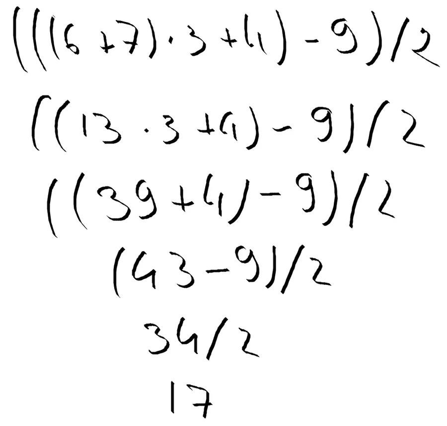

# Priorité des opérateurs

## Rappels
Ce sont des choses que l'on commence à voir en cinquième je crois. De toute façon, aucune honte à avoir. Personne ne sait que vous lisez ce billet. Voici les 4 règles à appliquer.

1. J'effectue les calculs de gauche à droite.
2. J'effectue en priorité les opérations situées entre parenthèses.
3. A l’intérieur des parenthèses, j’effectue les multiplications et les divisions **puis** les additions et les soustractions.
4. Quand les calculs entre parenthèses sont terminés je fais sauter les parenthèses.
5. Quand il n'y a plus de parenthèses, j’effectue les multiplications et les divisions **puis** les additions et les soustractions.

À la limite, on pourrait se passer des règles une et cinq. La une car c'est notre façon de lire. La quatre car c'est la même que la trois sauf qu'il n'y a plus de parenthèses. Je propose donc de suivre l'algorithme, la recette de cuisine, suivant :

1. J'effectue en priorité les opérations situées entre **parenthèses**.
2. J’effectue les multiplications et les divisions **puis** les additions et les soustractions.
3. Quand les calculs entre parenthèses sont terminés **je fais sauter les parenthèses**.

## Mise en application

Voici un exemple typique

1. Ligne 1. Je repère les parenthèses enfouies le plus profondément. Règle 1
2. J'additionne le 6 et le 7 et je pose 13. Règle 2
3. Comme c'était la dernière opération entre les parenthèses, je fais sauter ces dernières. Règle 3
4. Ligne 2. Je repère les parenthèses enfouies le plus profondément. Règle 1
5. Elles contiennent 13 x 3 + 4. J'effectue la multiplication et je pose 39 devant le + 4. Règle 2
6. Ligne 3. Je repère les parenthèses enfouies le plus profondément. Règle 1
7. Elles contiennent 39 + 4. J'additionne 39 et 4 et je pose 43. Règle 2
8. Comme c'était la dernière opération entre les parenthèses, je fais sauter ces dernières. Règle 3
9. Ligne 4. Je repère les parenthèses enfouies le plus profondément. Règle 1
10. Elles contiennent 43-9. J'effectue la multiplication et je pose 34. Règle 2
11. Comme c'était la dernière opération entre parenthèses, je fais sauter ces dernières.
12. Ligne 5. Il n'y a plus de parenthèses. Il ne reste plus qu'une division que j'effectue. Règle 2
13. Ligne 6. J'obtiens le résultat, 17

Un autre exemple pour souligner le fait que l'on peut traiter en parallèle le contenu de plusieurs parenthèses indépendantes. On dit que 2 parenthèses sont indépendantes car le contenu de l'une ne modifie pas le contenu de l'autre. Pense aux parenthèses et à leur contenu comme à des conteneur. Ce qu'il y a dans un conteneur (des voitures) est indépendant de ce qu'il y a dans un autres (des vélos) 

1. Ligne 1. Je repère les parenthèses enfouies le plus profondément. Règle 1.
2. Il y en a 2 qui sont indépendantes car le contenu de l'une ne modifie pas le contenu de l'autre. Je peux donc traiter l'une et l'autre en même temps. J'effectue 6 x 5 dans l'une et 3 x4 dans l'autre. Je pose 30 et 12 dans les parenthèses respectives. Règle 2.
3. Ligne 2.  Je repère les parenthèses enfouies le plus profondément. Règle 1.
4. Il y en a 2 qui sont indépendantes. J'additionne 30 et -2 d'un côté et 12 et 12 de l'autre. Règle 2.
5. Dans les 2 cas, comme c'était la dernière opération entre parenthèses, je fais sauter ces dernières. Règle 3
6. Ligne 3. Il n'y a plus de parenthèses. Il ne reste plus qu'à additionner 3, -28 et 24
7. Ligne 4. J'obtiens le résultat, -1

## Next ?
A toi de jouer.  
Personne ne peut le faire à ta place. 
Prend ton bouquin de maths et fais des exercices, reprends les exercices que vous avez fait en cours  
Au pire si tu bute sur un truc, ramène tes calculs sur une copie propre puis demande à ton prof demain

