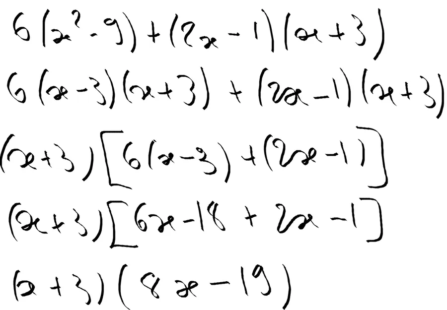

# Factorisations et développements

Là, on s'intéresse surtout aux différents outils qui permettent de simplifier les écritures algébriques. Pour cela on va être amené à les développer puis à les factoriser. Rappels sur les règles que l'on peut mettre en œuvre :

## Règle 1
Pour alléger les écritures algébriques je peux supprimer le signe multiplier devant une lettre ou une parenthèse. En règle générale on met d'abord le scalaire puis les variables. On écrit donc 5t plutôt que t5 car on dit "j'ai 2 portables" plutôt que "j'ai portables 2". De manière pratique ça donne :

* 6 x t = 6t
* 3 x (2 x t - 3) = 3 x (2t -3) = 3(2t - 3)
* 1 x t = t

Il faut remarquer que sur la dernière ligne, au lieu d'écrire 1t, on écrit encore plus simplement t.

## Règle 2
Pour alléger les écritures algébriques je peux changer l'ordre des facteurs et les regrouper différemment. 

**Attention** : on parle bien de facteurs. On parle donc des opérandes qui apparaissent autour du signe multiplier. On peut le faire car 3 x 4 = 4 x 3. Ceci n'est pas possible avec une soustraction car par exemple 4 - 3 != 3 - 4. 

Dans la pratique cela donne :

* 2 x t x 4 = 4 x 2 x t = 8 x t = 8t
* 2t x 4t = 2 x 4 x t x t = 8t²

## Règle 3 - Faire sauter les parenthèses 1/2
Pour alléger les écritures algébriques, quand il y a un signe + devant une parenthèse que je veux supprimer

1. Je supprime le signe + en question
2. J'écris chaque termes de la parenthèse en faisant apparaître son signe

Deux exemples vite fait :

* 3t + (3 - 4t) = 3t + 3 - 4t = 3 + 3t - 4t = 3 - t
* 5 + (-6 +3t) = 5 - 6 + 3t = -1 + 3t

Dans le premier exemple, il faut noter que le 3 qui est le premier terme de la parenthèse est positif. Quand la parenthèse saute on écrit donc + 3.

## Règle 4 - Faire sauter les parenthèses 2/2
{: .warning }
Généralent, c'est elle qui pose problème

Pour alléger les écritures algébriques, quand il y a un signe - devant une parenthèse que je veux supprimer

1. Je supprime le signe - en question
2. J'écris chaque terme de la parenthèse en faisant apparaître son **signe opposé**

Deux exemples :

* t - ( u + 5 ) = t - u - 5
* x - ( y - 42 ) = x - y + 42

Il faut vraiment bien voir se qui se passe.  
1. Par exemple pour le second exemple j'écris x.  
1. Comme je veux faire sauter les parenthèses je n'écris pas le moins et je n'écris pas la 1. parenthèse ouvrante.   
1. Ensuite pour chaque terme de la parenthèse j'inverse le signe.   
1. Je vois 'y'.  
1. Je lis '+y'.  
1. J'inverse son signe dans ma tête et j'écris '-y'.  
1. De même je vois '-42', j'inverse son signe dans ma tête et j'écris '+42'.

## Règle 5- Développer un produit ne pose généralement pas trop de soucis.

Il faut multiplier chaque élément du premier terme par chaque élément du second. Lors des multiplications les opérandes gardent leur signe.

De plus, on peut donc faire la remarque suivante : si il y a 3 éléments dans le premier terme et 4 dans le second je dois me retrouver avec 4 x 3 = 12 éléments. Un moyen comme un autre de vérifier qu'on a pas faire l'erreur d'oublier une multiplication.

Deux exemples typiques :

* a (5 + 4b) = a5 + a4b = 5a + 4ab
* (5a - 2b) (a - b) = 5a² - 5ab - 2ba + 2b² = 5a² - 7ab +2b²

Dans le second exemple on a un terme avec 2 éléments et un autre terme avec encore 2 éléments. On retrouve bien 4 éléments après le premier signe d'égalité. De manière pratique on a fait :

1. (+5a) x (+a) = 5a² (les deux opérandes sont positifs)
2. (+5a) x (-b) = - 5ab (le premier opérande est positif et le second est négatif)
3. (-2b) x (+a) = - 2ba
4. (-2b) x (-b) = 2b² (c'est le fameux [moins par moins égale plus]())

## Règle 6 - Factoriser une somme de termes algébriques

C'est identifier leur facteur commun et le mettre en avant.  
Je sais je suis lourd mais le **facteur commun** c'est le terme qui est **répété**.

Quelques exemples pour se faire les dents :

1. 6t + 2t = (6 + 2) t = 8t
2. -6t + 2t = t (-6 + 2) = t(-4) = (-4)t = -4t
3. 6t - 2t = t (6 - 2) = t4 = 4t
4. -4t - 2t = -t (4 + 2) = -t6 = -6t
5. -25x² + 15x = x(-25x + 15) = x 5 (-5x + 3) = 5x (3 - 5x)

Prenons la ligne 3 par exemple

1. Qu'est-ce qui est en commun? Le t. Je pose t et j'ouvre une parenthèse.
2. Pour remplir la parenthèse je me demande "6t divisé par t il reste quoi?". Il reste 6.
3. Je pose 6 dans la parenthèse.
4. Ensuite entre 6t et 2t je repère un signe négatif. Je reporte le signe négatif dans la parenthèse.
5. Pour continuer à remplir la parenthèse je me demande "2t divisé par t il reste quoi?". Il reste 2.
6. Je pose le 2 dans la parenthèse
7. Il n'y a plus de facteurs qui contiennent de t, je referme la parenthèse. Je me retrouve avec t (6-2)
8. Les règles de priorité des opérateurs (voir paragraphe précédent) m'incitent à calculer 6-2. Je me retrouve avec t 4
9. Comme on ne dit pas "passe moi bananes 4" mais plutôt "passe moi 4 bananes" j'écris 4t.

On est d'accord? Les 4 premiers exemples sont débiles. En effet, si 't' est une orange, la première ligne revient à dire "6 oranges plus 2 oranges". Et tout le monde voit (... ben si, quand même...) que cela fait 8 oranges (8 t dans le cas qui nous occupe).

## Règle 7 - Apprendre par cœur les 3 identités remarquables 

1. (a+b)² = a² + 2ab + b²
2. (a-b)² = a² - 2ab + b²
3. (a-b)(a+b) = a² - b²

Et il faut les apprendre dans les 2 sens
C'est tout simplement non négociable. Point. Le reste c'est de la poésie...

Apprendre dans les 2 sens ça veut dire que si j'entends "a² - b²", de suite je balance "(a-b) facteur de (a+b)".

Il faut aussi [pratiquer, pratiquer encore, pratiquer toujours](``NOT YET TRANSFERED``). 

Voici un exemple de simplification d'expression

{: .important }
Avant de me lancer dans le calcul, je prends un peu de recul 

C'est beau, ça rime... C'est normal, c'est un mantra bien connu des mathématiciens Indiens...

Quoiqu'il en soit, on me demande de simplifier... Ceci dit, je remarque à gauche, une identité remarquable du type a² - b².  
De plus cette dernière s'articule autour de x² et de 9 qui vont permettre de faire apparaître des x et de 3.  
Tiens, tiens on a un (x + 3) à la fin de l'expression à simplifier.  
Je pourrais donc le mettre en facteur par la suite.  
Allez, je me lance...

