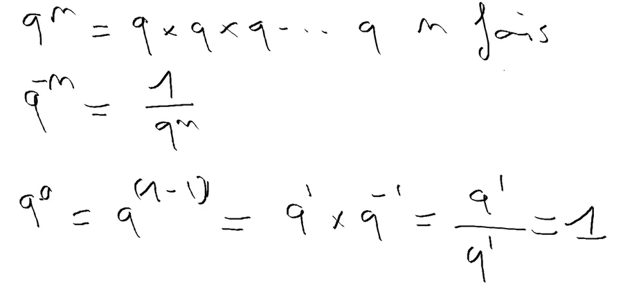
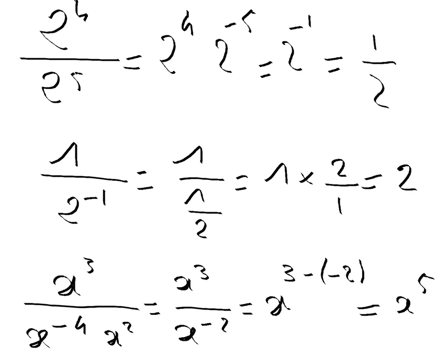

# Manipulation des puissances

Voilà les principales règles qu'il faut connaitre. Il ne faut pas hésiter à rayer celles que vous connaissez déjà.

1. $ q^0 = 1 $
2. $ q^1 = q $
3. $ q^n = q \cdot q \cdot q \ldots q $ n fois
4. $ q^{-n} = \frac{1}{q^n}$
5. $ q^n * q^m = q^{n+m} $
6. $ (q^n)^m = q^{n*m} $
7. $ q^{\frac{1}{2}} = \sqrt{q} $
8. $ q^{\frac{1}{n}} = \sqrt[n]{q} $

Essayons de faire le tri. On remarque que la ligne 2 est une application de la ligne 3. De même la ligne 3 c'est la nature même de l'exposant. On a peut-être pas besoin de les garder dans la liste. La ligne 1, quant à elle, est une convention qui se démontre si on accepte la ligne 4.

À ce stade il semble utile de ne garder que la règle 4 qui peut poser quelques problème de mémorisation. Ceci dit, c'est juste une façon de décrire l'inverse de qn. Il faut faire un travail similaire sur les autres lignes et ne garder que celles avec lesquelles on est pas à l'aise ou que l''on ne connait pas **par****cœur**.

C'est bien gentil tout ça mais on peut regarder les rappels précédents autant de temps que l'on veut, si on ne les utilise pas on arrivera jamais à se les approprier et à les manipuler efficacement. Voici des exemples de mise en oeuvre :

1. Ligne 1. On utilise la règle 4 pour faire "remonter" le $ 2^{-5}$. Bien voir le changement de signe. On fait ensuite la somme des exposants (règle 5). À la fin, au lieu d'avoir un exposant négatif, on remet ça sous forme de fraction (règle 4). Comme $ 2^{1}$ c'est 2 (règle 2) on simplifie encore l'expression et il reste 1/2.
2. Ligne 2. Pour le fun j'écris $ 2^{-1}$ sous forme de fraction (règle 4). "**Diviser c'est multiplier par son inverse**". Je multiplie 1 par l'inverse de 1/2. Je multiplie donc 1 par 2/1. Je trouve 2. On aurait pu directement "faire monter" le $ 2^{-1}$ et trouver 2 en un coup.
3. Ligne 3. Je fais la somme des puissances au dénominateur (règle 5). Ensuite on applique la règle 4 et on fait la somme des exposant (règle 5).

* [Lire la suite...](https://www.40tude.fr/autour-de-la-barre-de-fraction/)
* Retour à l’introduction sur les [erreurs de calcul](https://www.40tude.fr/erreurs-de-calcul/).

