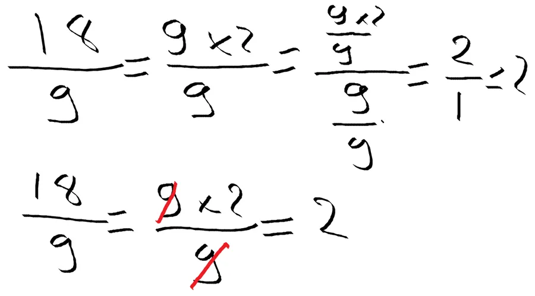
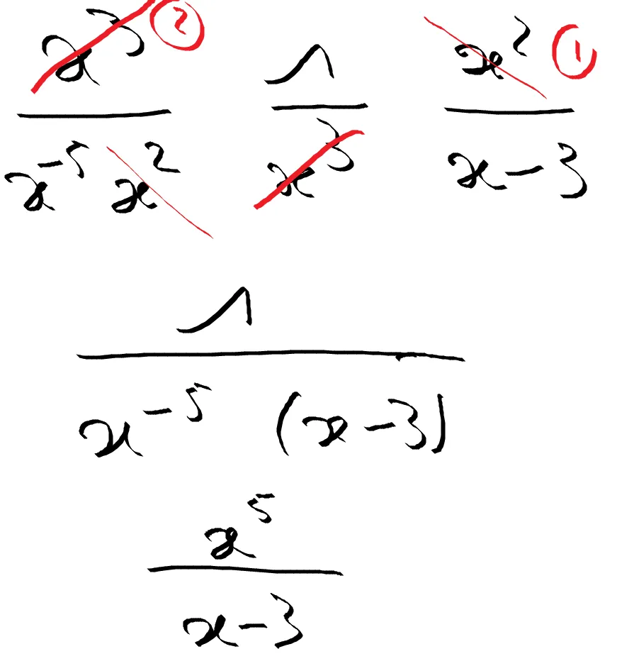
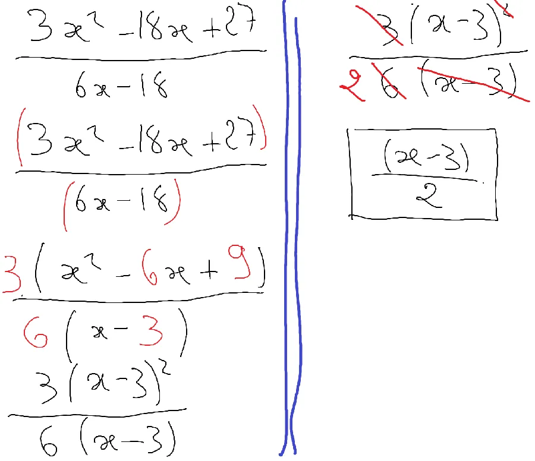

# Erreurs de calcul autour de la barre de fraction

Là, on aborde un sujet intéressant. En fait, pour simplifier une fraction, il n'y a qu'une seule règle.

1. On ne change pas la valeur d'une fraction si on **divise** ou si on **multiplie** le numérateur et le dénominateur par un même nombre non nul

Prenons une analogie "débile" afin de bien marquer les esprits.

1. Un père de 30 ans porte sa fille de 10 ans sur ses épaules. Les ages respectifs sont donc dans un rapport 10/30 = 1/3. Si on attend 5 ans le rapport des ages est devenu (10+5)/(30+5) = 15/35. On est plus dans un rapport 1/3. Bref, on comprend bien qu'on a pas le droit d'ajouter (soustraire) une même quantité en haut et en bas.
2. Ceci dit, si on imagine une autre famille où le père porte sa fille sur ses épaules mais où les ages sont multipliés par 2... Alors un père de 60 ans porte sa fille de 20 ans sur ses épaules. Les ages ont été multipliés par 2 et le ratio de 1/3 est respecté car 20/60 = 2/6 = 1/3. On a donc le droit de multiplier (diviser) par une même quantité non nulle en haut et en bas.

Dans un cas très simple (oui, oui je sais que 18 divisé par 9 ça fait 2) voilà, en toute rigueur, ce que nous devrions écrire :

* Ligne 1. Y a un 9 au dénominateur. Je remarque que 18 est un multiple de 9. Je fais apparaître le 9 en haut. Ensuite je divise par 9 en haut et en bas. Il reste 2 sur 1. Donc le résultat c'est 2.
* Ligne 2. C'est la version "TGV" de la version précédente. Je fais apparaître le 9 en haut. Je simplifie (en rayant les 9) directement en haut et en bas. Il reste le 2.

Voici un autre exemple ou on utilise la méthode TGV. Ceci dit, il ne faut jamais oublier que lorsqu'on raye, en fait, on divise par un même nombre le dénominateur et le numérateur.

Dans l'exemple ci-dessus, pas la peine d'additionner les puissances au dénominateur ou au numérateur. Rappelons nous le mantra Indien 

{: .important }
Avant de me lancer dans le calcul, je prends un peu de recul. 

On réalise alors que l'on a que des fractions qui se multiplient entre elles et qu'on retrouve au numérateur et au dénominateur des termes communs. Cela entraîne les simplifications (1) et (2).

Au pire, on pouvait faire la somme des exposants en haut et en bas. Allez-y faites le. Vous devez trouver le même résultat. Je rappelle que 5-5 = 0 et que $latex x^0=1$.

Un exemple plus vraisemblable

* Ligne 1. Je remarque que je peux factoriser le numérateur par 3
* De même, je peux factoriser le dénominateur par 6
* Ligne 2. Je commence par "sécuriser la scène du crime" en entourant le numérateur et le dénominateur avec des parenthèses
* Ligne 3. Ensuite, et seulement ensuite, au dénominateur, je fais sortir le 3.
* Ligne 3. Au dénominateur je fais sortir le 6.
* Ligne 3. Tiens, tiens... Dans la parenthèse du numérateur, je reconnais une identité remarquable.
* Ligne 4. Je vois que je vais pouvoir faire des simplifications entre le 3 et le 6 d'une part et les (x-3) d'autre part.
* Ligne 5. Je raye le 3 et le 6 et il reste 2 au dénominateur (au pire je remplace 6 par 2 x 3 et je simplifie les 3 en haut et en bas)
* Ligne 5. Je divise le numérateur et le dénominateur par (x - 3). Je raye le (x - 3) du dénominateur. En haut, je diminue de 1 la puissance du (x-3). Elle passe de 2 à 1. Il reste (x-3)1 c'est à dire (x-3) dont on aurait pu faire sauter les parenthèses.
* Pour finir j'entoure le résultat.

* [Lire la suite...](https://www.40tude.fr/autour-de-legalite/)
* Retour à l’introduction sur les [erreurs de calcul](https://www.40tude.fr/erreurs-de-calcul/).

