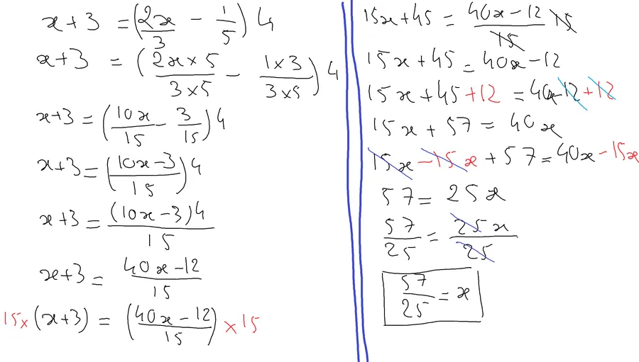

# Erreurs de calcul autour de l'égalité

On termine par le top du top : la résolution d'équation. Il n'y ici que deux règles

1. L'égalité est conservée si on ajoute la même quantité à droite **et** à gauche.
2. L'égalité est conservée si on multiplie par la même quantité à droite **et** à gauche.

Petite remarque. Je dis "ajouter". Si on se rappelle que soustraire c'est additionner un nombre négatif, la règle 1 est aussi valable pour les soustractions. De même, comme "**diviser c'est multiplier par l'inverse**", la règle 2 est aussi valable pour les divisions. 

Attention toutefois. On se rappelle qu'on a pas le droit ni d'avoir faim ni d'avoir froid mais surtout qu'on a pas le droit de diviser à gauche et à droite par 0. Il est donc important quand on divise à droite et à gauche de préciser/vérifier que ce par quoi on divise n'a aucune chance de valoir 0.  

*Oui mais moi j'ai vu des trucs avec des chiffres qui changent de signe quand ils passent de l'autre côté et d'autres qui passent en dessous... je sais plus quoi.*  

Peut être mais nous, pour l'instant, on va faire simple, on va s'en tenir aux deux règles précédentes et les utiliser sur des exemples que l'on va expliquer en détail.

Un premier exemple très simple pour commencer où on cherche à déterminer la valeur de x

Heu... Déjà, il faut prendre ça comme un jeu, une intrigue, une enquête. C'est surtout pas une punition. Dis toi qu'on a une situation, un meurtre dans la cuisine, t'arrives, tu inspecte les lieux, tu cherches des indices, tu utilise ton flaire... Et tu découvre l'assassin. Ben ici c'est pareil. T'arrives, je te donne les faits, à toi de cherche la valeur de x qui répond à la situation.

* Ligne 1. J'ai un x à gauche de l'égalité. Je vais essayer de le laisser là.
* Ligne 2. Je veux me débarrasser du 8 de gauche. Le mieux c'est de soustraire 8. Oui mais avec une égalité si j'enlève 8 à gauche je dois enlever 8 à droite. C'est ce que je fais ressortir en rouge. Quand c'est fait je simplifie en rayant le +8 et le -8 du membre de gauche.
* J'admire le résultat et je peux même prendre le temps de vérifier dans la première ligne que si x=4 alors x plus 8 ça fait bien 12.

## Remarque 
On comprend maintenant ce **mantra Tibétain** bien connu qui dit un truc du style :

{: .important }
Si l'égalité tu traverses, ton signe tu inverses.

En effet, entre la ligne 1 et la ligne 2 **tout se passe comme si** le +8 de gauche passait à droite en changeant de signe. Watch this...

Deux exemples avec des fractions ce coup-ci. Bien sûr on cherche toujours, le coupable, la valeur de x.

* Dans le premier exemple, ligne 1. Je veux supprimer le 1/3.
* Ligne 2. Comment faire? Il suffit de multiplier par 3. Ceci dit si je multiplie par 3 à gauche je dois faire de même à droite. C'est ce que je fais apparaître en rouge. Ensuite je simplifie en les rayant le 1/3 et le 3 de gauche
* Ligne 3. J'effectue la multiplication dans le membre de droite et j'admire le résultat.

* Dans le second exemple, ligne 1. Je veux me débarrasser du 5 devant le x.
* Ligne 2. Comment faire? Il suffit de diviser par 5. Ceci dit si je divise par 5 à gauche je dois faire de même à droite. C'est ce que je fais apparaître en rouge. Ensuite je simplifie le 5 et le 1/5 du membre de gauche
* Ligne 3. J'effectue la division dans le membre de de droite et j'admire le résultat.

Un dernier exemple va nous permettre d'utiliser certaines règles dont on a déjà parlé.

Le but du jeu (oui, oui je persiste et signe, c'est un jeu, un casse tête, une énigme) c'est de regrouper tous les x d'un côté de l'égalité et tout le reste de l'autre.

* Ligne 1. Je repère les parenthèses enfouies le plus profondément. Si on veut simplifier son contenu, on va commencer par tout mettre sur le même dénominateur. Comme 3 et 5 sont premiers entre eux on va tout mettre sur 15.
* Ligne 2. Dans la première fraction on multiplie en haut et en bas par 5 (le dénominateur devient 15). Dans la seconde fraction on multiplie en haut et en bas par 3 (le dénominateur devient encore 15).
* Ligne 3. On effectue les calculs et on étudie le résultat intermédiaire.
* Ligne 4. Comme on a le même dénominateur on peut tout regrouper dans une seule fraction
* Ligne 5. La multiplication par 4 va impacter le numérateur. Comme ce dernier comporte deux termes (10x et -3) on "sécurise la scène du crime" avec des parenthèses. Il n'y a pas besoin de parenthèses au numérateur car elles n'entoureraient que le nombre 15.
* Ligne 6. On distribue le 4 sur le contenu de la parenthèse.
* Ligne 7. **IMPORTANT**. À droite, on a ce 15 sous la fraction qui gâche le paysage. Comment se débarrasser de 1/15? Il suffit de multiplier par 15. OK, mais attention. En effet, si on multiplie d'un côté de l'égalité alors il faut multiplier par 15 de l'autre côté. C'est ce que l'on fait apparaître en rouge.
* Ligne 8. On simplifie les 15 à droite et on distribue le 15 entre les parenthèses à gauche.
* Ligne 9. On étudie le résultat intermédiaire. Oh, finalement, tout se passe comme si le 15 qui était en bas à droite était passé en haut à gauche.
* Ligne 10. Je décide de regrouper tous les x à droite de l'égalité. Il faut que je commence par me débarrasser de ce -12. Comment faire disparaître un -12? En ajoutant un +12. OK, mais si j'ajoute 12 à droite il faut que j'ajoute 12 à gauche. C'est ce que l'on fait ressortir en rouge. Ensuite, on simplifie le +12 et le -12 de gauche en les rayant en bleu.
* Ligne 11. J'étudie le résultat intermédiaire.
* Ligne 12. Ce qui n'est pas très beau ce sont les x à gauche. Comment faire pour supprimer 15x? Il faut soustraire 15x. Ceci dit si on enlève 15x à gauche faut en enlever 15 à droite aussi. C'est ce que l'on fait ressortir en rouge. Ensuite je raye le +15x et le -15x dans le membre de gauche car ces 2 là s'annihilent.
* Ligne 13. J'effectue la soustraction dans le membre de droite et j'étudie le résultat intermédiaire.
* Ligne 14. J'ai 25x à droite. Je souhaite qu'il ne m'en reste qu'un. Je pourrai soustraire 24x... Ceci dit, si je fais ça à droite il va falloir que je le fasse aussi à gauche. Du coup cela va faire réapparaître des x à gauche. C'est pas très malin. Ce que je peux faire, c'est diviser à droite par 25. Si je fais ça il faut que je fasse de même à gauche.
* Ligne 15. J'admire le résultat.

Heu... Tu dois noter deux ou trois petits trucs
1. C'est un peu toujours le même refrain. 
1. Prends le temps de regarder les résultats intermédiaires (c'est un autre mantra)
1. Ici à la fin le x est à droite. On s'en fout complètement. En effet les 2 écritures x=42 et 42=x sont identiques. Entraîne toi à faire tes enquêtes en laissant les x à droite.  

## Next ?
A toi de jouer.  
Personne ne peut le faire à ta place. 
Prend ton bouquin de maths et fais des exercices, reprends les exercices que vous avez fait en cours...  
Au pire si tu bute sur un truc, ramène tes calculs sur une copie propre puis demande à ton prof demain
