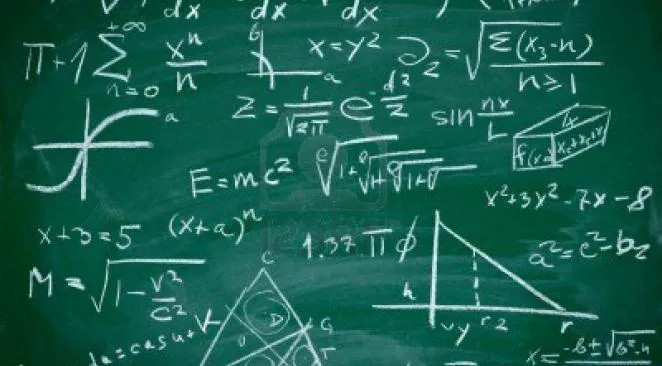
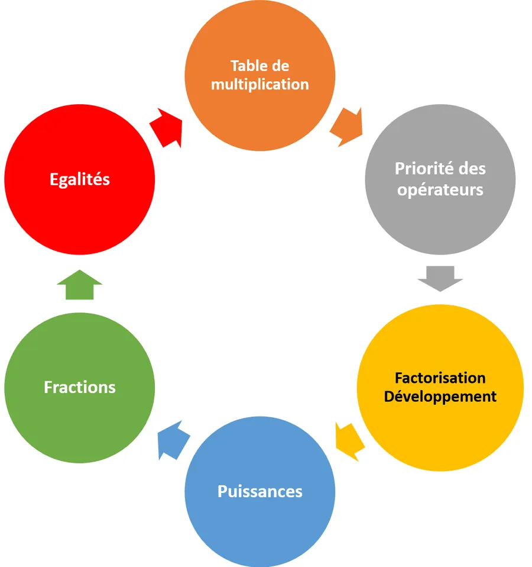

# Erreurs de calcul

## Introduction

Je sais... Il est impossible de couvrir un sujet aussi vaste que les erreurs de calcul dans un simple billet de blog. De toute façon, si cela était possible, cela aurait été fait depuis bien longtemps. 

De plus, s'il existait une méthode ou une recette miracle pour éviter les erreurs de calcul, elle serait enseignée à l'école primaire. Je vais donc parler de ce que je peux voir et entre autres de la table de multiplication mais pas que... Si plus tard je trouve des exemples pertinents je n'hésiterai pas à revenir compléter cet article.

Mon objectif est de couvrir 80% des erreurs que je rencontre lorsque j'ai l'occasion d'aider des gamins (Bac-2 à Bac+2 typiquement).

## Une analogie

Une analogie pour commencer et pour bien fixer les idées. Au départ, la copie vaut potentiellement 20. Ensuite, à chaque fois qu'on fait une faute de raisonnement ou de calcul ce sont des points qui sautent. 

C'est comme au tennis. À chaque fois qu'on met la balle dans le filet on donne un point à l'adversaire. Ici c'est pareil. Une erreur de calcul et c'est un point que prend le correcteur. Autant se donner les moyens de limiter la casse et évitons les erreurs de calcul (les erreurs de raisonnement c'est une autre histoire dont on ne va pas parler ici).

## Une remarque

J'ai toujours été surpris par le fait qu'on parle de fautes d'orthographe et d’erreur de calcul. Au fait, vous connaissez la différence entre une faute et une erreur ?

* Une erreur, c'est quand on fait la bêtise pour la première fois.
* Une faute, c'est quand on réitère le comportement.

Autrement dit, tout se passe comme s'il était inacceptable de se tromper en orthographe mais qu'il était pardonnable de faire encore et encore les mêmes bévues en calcul. 

Bizarre non ? De toute façon, il ne faut pas rêver. Malgré tous les efforts pour rattraper un maximum de candidats au Bac, ensuite, dans les études supérieures la clémence n'est plus de mise et là c'est "carnage à Fort Alamo".

Bref, il faut se donner les moyens d'éradiquer au mieux les erreurs de calculs et je vous propose de nous attaquer, dans cet ordre, aux sources d'erreurs suivantes :

<!-- Comme la page à propos des erreurs de calcul était devenue très/trop longue je l'ai découpé en chapitres :

1. Table de [multiplication](https://www.40tude.fr/erreurs-de-calcul/)
2. [Priorité des opérateurs](https://www.40tude.fr/priorite-des-operateurs/)
3. [Factorisation et développements](https://www.40tude.fr/factorisations-et-developpements/)
4. [Manipulations des puissances](https://www.40tude.fr/manipulation-des-puissances/)
5. [Autour de la barre de fraction](https://www.40tude.fr/autour-de-la-barre-de-fraction/)
6. [Autour de l'égalité](https://www.40tude.fr/autour-de-legalite/)
 -->
