<div align="center">
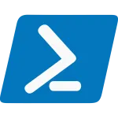
</div>

# Configurer Remote PowerShell (WinRM) dans un WORKGROUP

## Introduction
On va voir dans ce billet comment, dans un contexte privé (WORKGROUP, pas de nom de domaine ni de serveur AD) mettre en oeuvre PowerShell en mode remote. On mettra en oeuvre 2 méthodes différentes. Un objectif pourrait être de vouloir gérer les machines de la tribu à partir d'un seul terminal.

### Le set-up

* Machine locale de l'administrateur = 5PRO-PHILIPPE = 192.168.1.49 = Win 11 Pro 22H2
* Machine distante utilisateur = PC-MARTINE = 192.168.1.30 = Win10 Pro 22H2
* Machine distante utilisateur = VIRT11-PHILIPPE = 192.168.1.15 = Win 11 Pro 22H2

Afin de fixer le vocabulaire

* La machine locale est un client.
* La machine distante est un serveur, un hôte


<!-- ### Note très importante -->

{: .warning }
Il faut disposer sur chaque machine distante d'un compte **administrateur** de type **local**. La méthode ci-dessous ne fonctionne **PAS**, par exemple, si la machine distante est un PC qui utilise HELLO et la reconnaissance faciale pour connecter l'utilisateur administrateur. Elle ne fonctionne pas non plus si l'administrateur de la machine distante se logue avec son compte Microsoft.


Ne lisez pas la suite de ce billet tant que vous n'avez pas de compte Admin local sur la ou les machines distantes. N'hésitez pas à lire la fin de [cette section](#trustedhost) du billet si besoin.

Typiquement, je suis administrateur de ma machine MAIS je me connecte avec mon compte Microsoft. Je crée donc un compte local nommé 'Admin' (ou autre nom, on s'en fiche) et je n'oublie pas de lui donner des droits d'administrateur. C'est utile (mais pas indispensable) si on souhaite faire des tests en se connectant à une machine "distante" qui, en fait, serait localhost.

<div align="center">
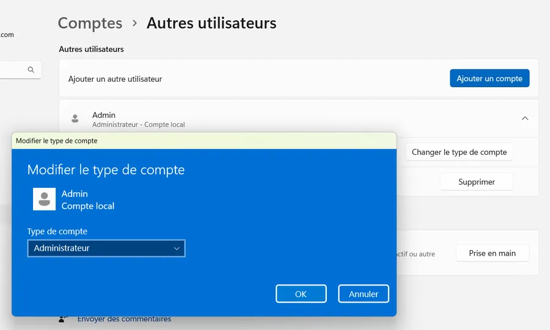
</div>


Sur la machine en question, si on ouvre une console en mode administrateur on peut créer un tel utilisateur avec les lignes ci-dessous :

```
$Password = Read-Host –AsSecureString
New-LocalUser 'Admin' -Password $Password -FullName 'Admin' -Description 'Admin pour accès distant.'
Add-LocalGroupMember -Group 'Administrateurs' -Member 'Admin'
```

Avec un peu de recul, je pense que, sur toutes les machines du WORKGROUP, je vais créer un compte nommé 'Admin' avec le même mot de passe ce qui me permettra de faire un peu de maintenance à distance si besoin.

Bon allez, pour le coup, c'est parti.


## Sur la machine distante (user)

### Ouvrir une console en mode administrateur

* WIN + X, i
  + Cela veut dire qu'il faut presser les touches Windows et 'x' simultanément puis appuyer sur la touche 'i'

### Vérifier que le réseau est privé

```
Get-NetConnectionProfile

Name                     : Livebox-AAE0
InterfaceAlias           : Wi-Fi
InterfaceIndex           : 10
NetworkCategory          : Private
DomainAuthenticationKind : None
IPv4Connectivity         : Internet
IPv6Connectivity         : Internet
```

Ci-dessus il n'y a rien à faire (`NetworkCategory` est égal à Private)

<div align="center">
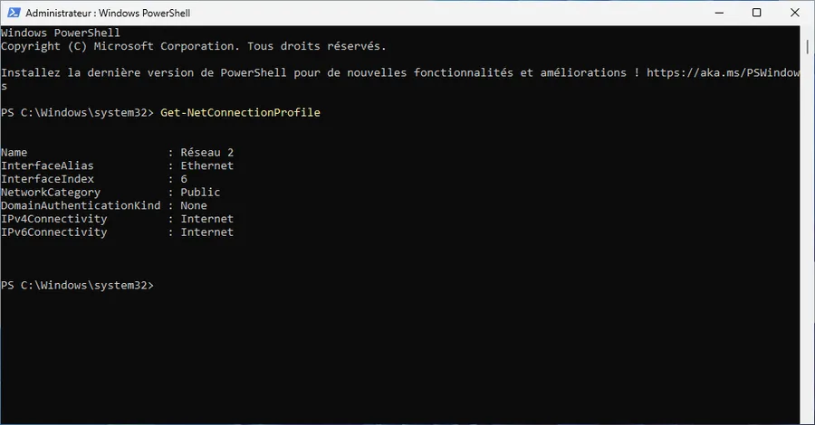
</div>


Si besoin, c'est le cas ci-dessus, configurer le réseau en mode privé. Il faut utiliser l'**InterfaceIndex** de la sortie précédente. On vérifie ensuite que le réseau est bien privé.

```
Set-NetConnectionProfile -InterfaceIndex 6 -NetworkCategory Private
Get-NetConnectionProfile
```
### Activer le service WinRM

Vérifier l'état du service :

```
Get-Service -Name '*WinRM*'
```
<div align="center">
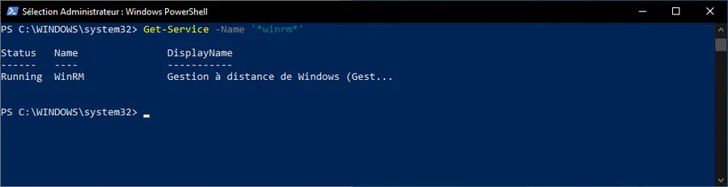
</div>

<div align="center">
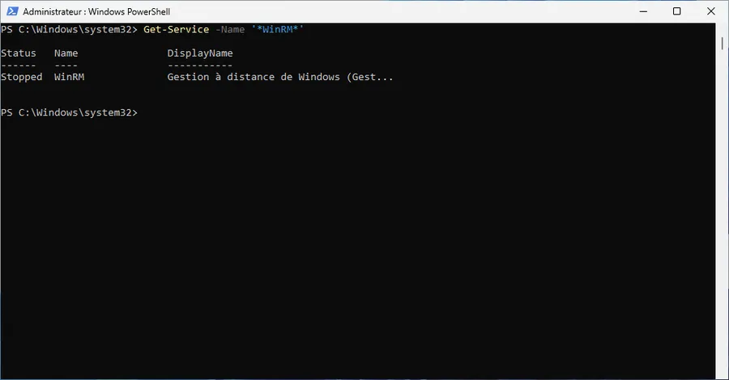
</div>


Si WinRM ne tourne **PAS** (cas ci-dessus) il faut l'activer :

```
Enable-PSRemoting
```
<div align="center">
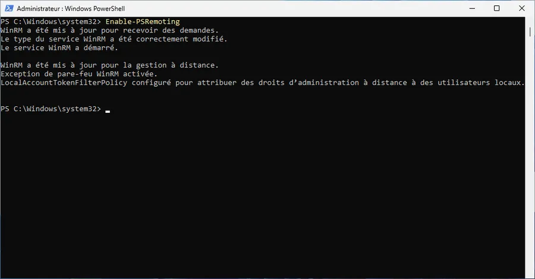
</div>


Vérifier l'état du firewall

```
Get-NetFirewallRule -DisplayName "Gestion à distance de Windows (HTTP-Entrée)"
```

Vérifier dans la description que le port est bien 5985. Ci-dessous on voit que tout est OK. Voir la valeur de l'attribut '**`Enabled`**' (6eme attribut).

<div align="center">
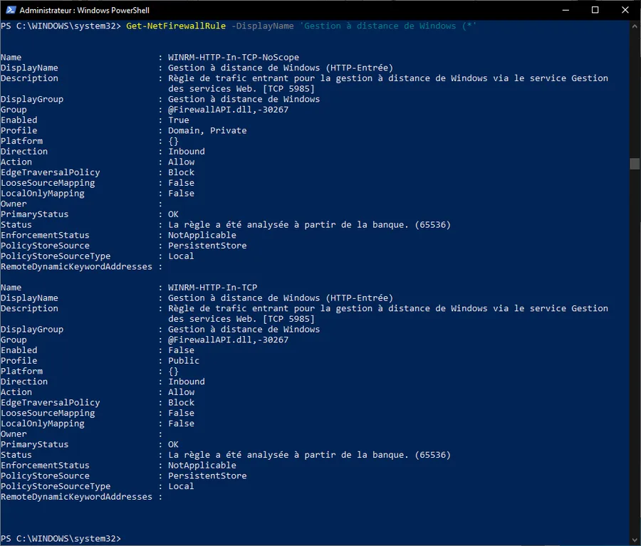
</div>


Par contre, sur cette machine distante, la règle n'est pas encore active :

<div align="center">
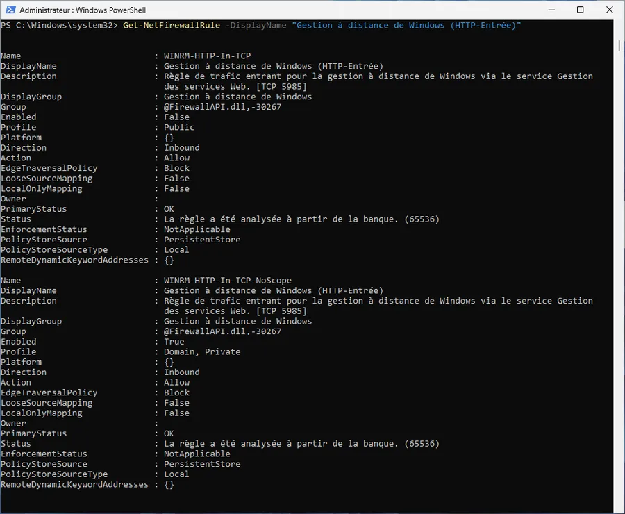
</div>


Si la règle n'est pas active alors il faut la mettre en route puis vérifier que ça s'est bien passé.

```
Enable-NetFirewallRule -DisplayName "Gestion à distance de Windows (HTTP-Entrée)"
Get-NetFirewallRule -DisplayName "Gestion à distance de Windows (HTTP-Entrée)"
```
<div align="center">
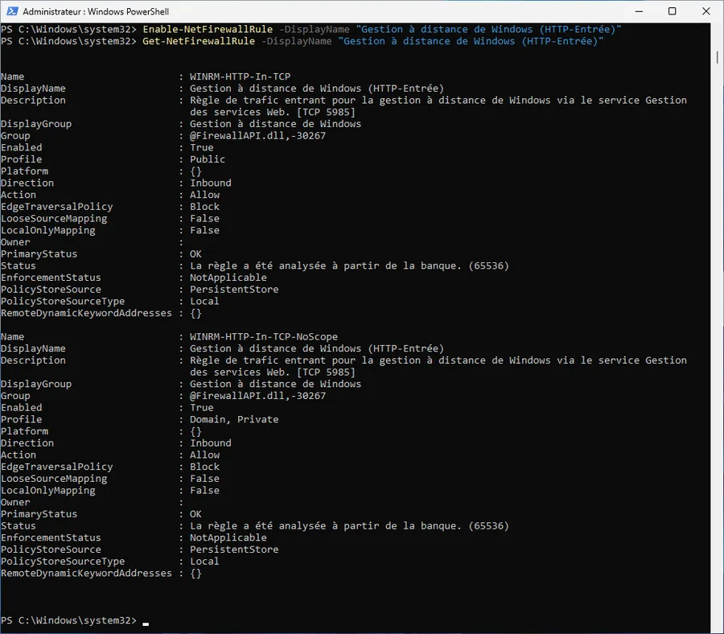
</div>


On en a terminé avec la ou les machines distantes

## Sur la machine locale (Administrateur)

### Ouvrir une console en mode administrateur

* WIN + X, i

### Vérifier la communication avec la machine distante

Sur le port 5985

```
Test-NetConnection 192.168.1.30 –Port 5985

ComputerName     : 192.168.1.30
RemoteAddress    : 192.168.1.30
RemotePort       : 5985
InterfaceAlias   : Wi-Fi
SourceAddress    : 192.168.1.49
TcpTestSucceeded : True
```
### Vérifier que WinRM fonctionne sur la machine distante

```
Test-WSMan 192.168.1.30

wsmid           : http://schemas.dmtf.org/wbem/wsman/identity/1/wsmanidentity.xsd
ProtocolVersion : http://schemas.dmtf.org/wbem/wsman/1/wsman.xsd
ProductVendor   : Microsoft Corporation
ProductVersion  : OS: 0.0.0 SP: 0.0 Stack: 3.0
```
### Tester l'ouverture d'une session distante PowerShell

Avec la commande `Enter-PSSession` et l'adresse IP de la machine distante

<div align="center">
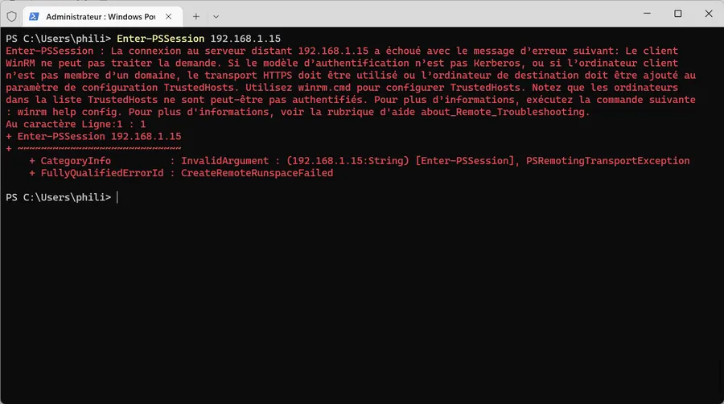
</div>


Il est possible (voir ci-dessus) que cela ne fonctionne pas car, par défaut, l'authentification supportée est Kerberos.

* Retrouver les types d'authentification supportées avec la commande `Get-ChildItem` invoquée sur WSMAN.

```
Get-ChildItem -Path WSMan:\localhost\Service\Auth\

   WSManConfig : Microsoft.WSMan.Management\WSMan::localhost\Service\Auth

Type            Name                           SourceOfValue   Value
----            ----                           -------------   -----
System.String   Basic                                          false
System.String   Kerberos                                       true
System.String   Negotiate                                      true
System.String   Certificate                                    false
System.String   CredSSP                                        false
System.String   CbtHardeningLevel                              Relaxed
```
## Se connecter avec la méthode trusted hosts

Je considère que les étapes précédentes, tant sur la machine distante que sur la machine locale, ont été franchies avec succès.

* Lister les hôtes de confiance disponibles sur la machine locale.

```
get-Item WSMan:\localhost\Client\TrustedHosts

   WSManConfig : Microsoft.WSMan.Management\WSMan::localhost\Client

Type            Name                           SourceOfValue   Value
----            ----                           -------------   -----
System.String   TrustedHosts
```

* Ajouter les 2 machines distantes avec `Set-Item`

* Vérifier la liste des hôtes de confiance

```
Set-Item WSMan:\localhost\Client\TrustedHosts -Value 192.168.1.15 -Concatenate
Configuration de la sécurité WinRM.
Cette commande modifie la liste TrustedHosts pour le client WinRM. Les ordinateurs figurant dans la liste TrustedHosts
ne sont pas nécessairement authentifiés. Or, le client risque d'envoyer des informations d'identification à destination
 de ces ordinateurs. Êtes-vous sûr de vouloir modifier cette liste ?
[O] Oui  [N] Non  [S] Suspendre  [?] Aide (la valeur par défaut est « O ») : O

Set-Item WSMan:\localhost\Client\TrustedHosts -Value 192.168.1.30 -Concatenate
Configuration de la sécurité WinRM.
Cette commande modifie la liste TrustedHosts pour le client WinRM. Les ordinateurs figurant dans la liste TrustedHosts
ne sont pas nécessairement authentifiés. Or, le client risque d'envoyer des informations d'identification à destination
 de ces ordinateurs. Êtes-vous sûr de vouloir modifier cette liste ?
[O] Oui  [N] Non  [S] Suspendre  [?] Aide (la valeur par défaut est « O ») : O

get-Item WSMan:\localhost\Client\TrustedHosts
   WSManConfig : Microsoft.WSMan.Management\WSMan::localhost\Client
Type            Name                           SourceOfValue   Value
----            ----                           -------------   -----
System.String   TrustedHosts                                   192.168.1.15,192.168.1.30
```

* Se connecter à la machine distante

```
Enter-PSSession -ComputerName 192.168.1.15 -Credential admin
```

Où 'admin' est l'identifiant d'un **administrateur** qui a un compte **local**. J'insiste car j'ai perdu pas mal de temps là-dessus 😀. S'il faut créer un compte local admin, il ne faut pas oublier de l'activer en ouvrant au moins une fois sa session (je suis pas sûr de mon coup à 100% mais je préfère mettre ceinture et bretelles)

<div align="center">
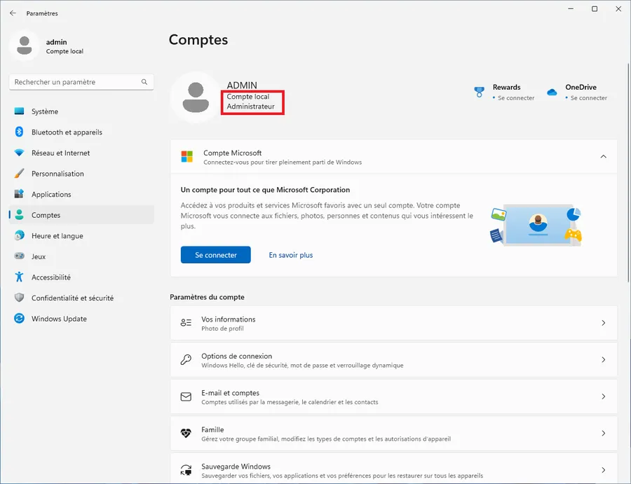
</div>


Lorsqu'on ouvre la session sur la machine distante avec `Enter-PSSession` il faut saisir le mot de passe de l'utilisateur 'admin'

<div align="center">
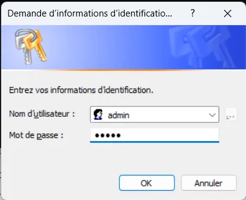
</div>


Si tout se passe bien on se retrouve sur la machine distante.

<div align="center">
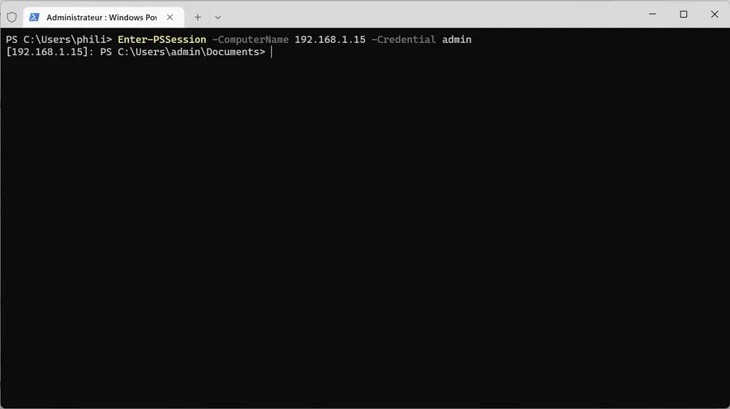
</div>


Tout se passe alors comme si on était en local et on peut utiliser tout ce que l'on sait de PowerShell (en ce qui me concerne ça va être vite fait... 😁)

<div align="center">
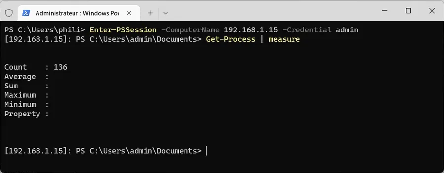
</div>


On peut aussi utiliser `Invoke-Command` mais à ce stade c'est assez lourd car il faut indiquer les credentials à chaque invocation.

<div align="center">
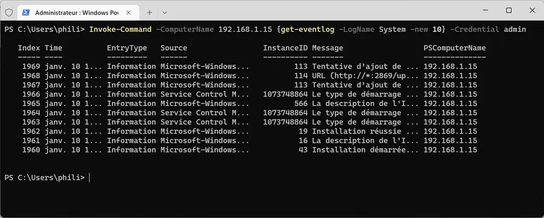
</div>


Par contre, coup de pot (ou pas) comme l'admin a le même mot de passe sur les 2 machines distantes on peut lancer la même commande sur les 2 machines en parallèle (voir les 2 adresses IP passées dans la commande) puis récupérer les résultats sur la machine locale. Ça c'est top. Je suis bluffé.

<div align="center">
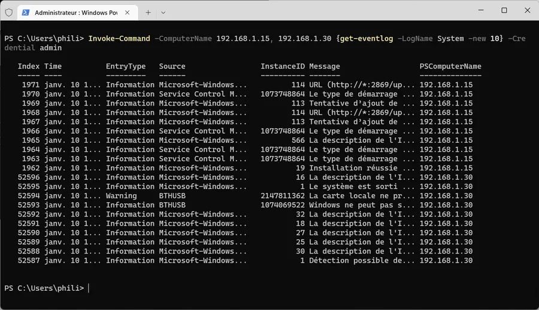
</div>

## Utiliser le nom des machines

Je commence par m'assurer que je peux m'adresser à la machine via son nom

```
Test-NetConnection surf-philippe –Port 5985
```
<div align="center">
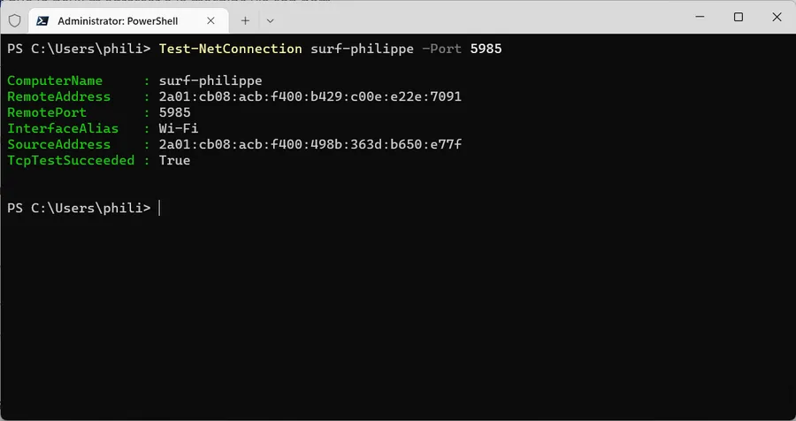
</div>


Ensuite, j'ajoute le nom de la machine à la liste des trusted host et je vérifie que c'est OK.

```
Set-Item WSMan:\localhost\Client\TrustedHosts -Value surf-philippe -Concatenate
Get-Item WSMan:\localhost\Client\TrustedHosts
```
<div align="center">
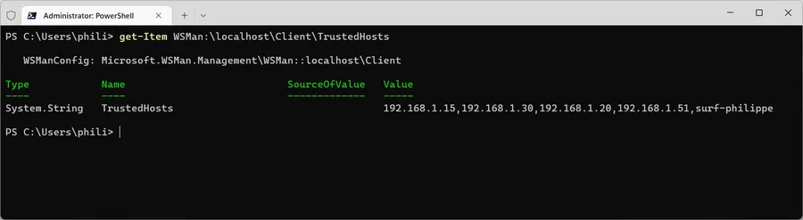
</div>

### En cas de problème avec la liste des trusted hosts

En fait on peut ajouter des noms ou des adresses IP mais je n'ai pas trouvé de moyen simple d'enlever un nom particulier par exemple. Si un jour il faut faire le ménage dans la liste des trusted host, le mieu est de s'inspirer des commandes ci-dessous. Il n'y a pas besoin de rajouter localhost et/ou 127.0.0.1 à la liste des hôtes de confiance.

```
cd ~
winrm get winrm/config/client | Out-File "./winrm-config-client.txt"  # Sauve la réponse dans un fichier

# On peut copier-coller tout ou partie de la liste des hôtes depuis le .txt
winrm set winrm/config/client '@{TrustedHosts="zoubida, surf-philippe, 192.168.1.51"}'  # MàJ
winrm get winrm/config/client         # La confiance n'exclut pas le contrôle...
```

Enfin je teste avec une commande sur le PC en question

```
Invoke-Command -ComputerName surf-philippe -Credential Admin {Get-WinEvent -LogName System -MaxEvents 3}
```
<div align="center">
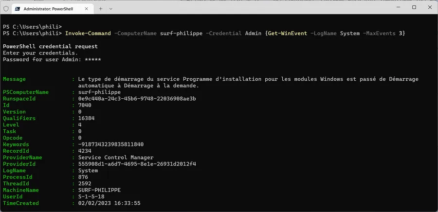
</div>


Même pas peur, je lance la commande sur 2 PC

```
Invoke-Command -ComputerName surf-philippe, localhost -Credential Admin {Get-WinEvent -LogName System -MaxEvents 3}
```

Ci-dessous on reçoit en premier les réponses de localhost (AKA 5PRO-PHILIPPE). Ensuite plus bas, mais on ne les voit pas ici, il y a les 3 derniers événements de la machine surf-philippe.

<div align="center">
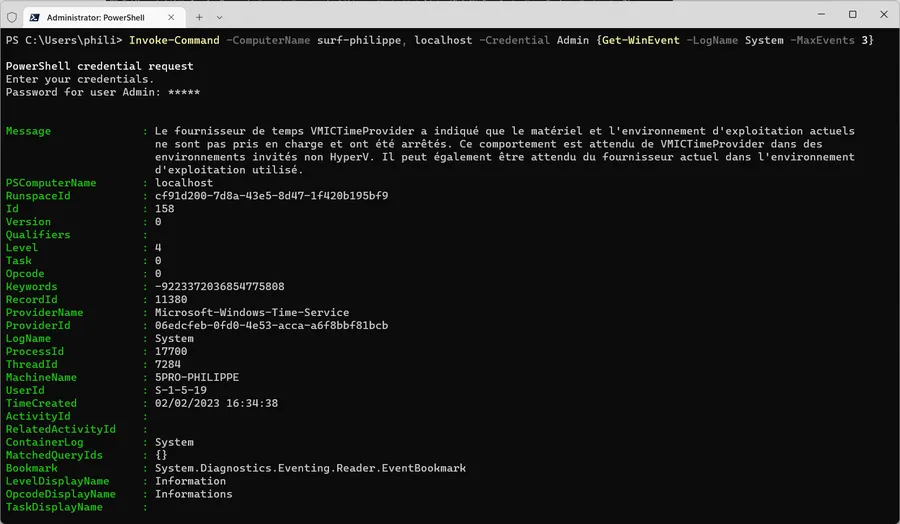
</div>


Je suis content ça marche à peu près comme je veux. Allez, il est temps d'utiliser un autre mode d'identification.

## Se connecter avec un certificat

Je considère que les étapes qui précèdent la section "Se connecter avec la méthode [trusted hosts](#trustedhost)" ont été franchies avec succès tant sur la machine distante (user) que sur la machine locale (admin).

On va générer sur la machine distante un certificat SSL de type self-signed certificate qu'on transfèrera à la machine locale et qui sera utilisé lors des connexions pour encrypter le trafic WinRM. En anglais dans le texte on va faire du WinRM over HTTPS.

### Générer un certificat sur la machine distante

Saisir les commandes suivantes

```
$hostname = $env:COMPUTERNAME
$hostIP=(Get-NetAdapter | Get-NetIPAddress).IPv4Address | Out-String
$RemoteCert = New-SelfSignedCertificate -DnsName $hostName, $hostIP -CertStoreLocation Cert:\LocalMachine\My
$RemoteCert | Format-List -Property *
```
<div align="center">
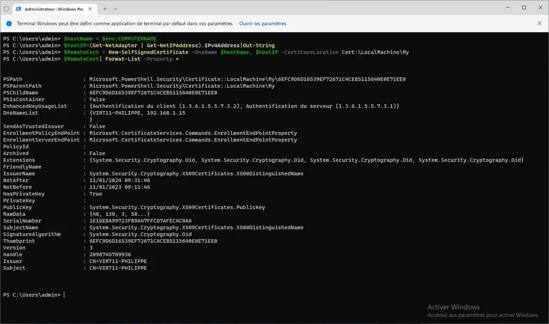
</div>


On peut vérifier le certificat sur la machine cible en suivant les étapes ci-dessous

* WIN, 'mmc'

<div align="center">
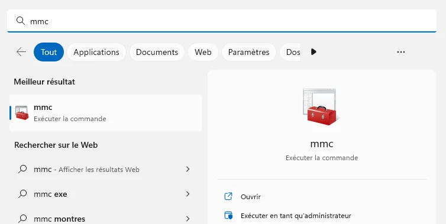
</div>


* CTRL + M

* Certificats (liste de gauche)

* Bouton 'Ajouter >'

<div align="center">
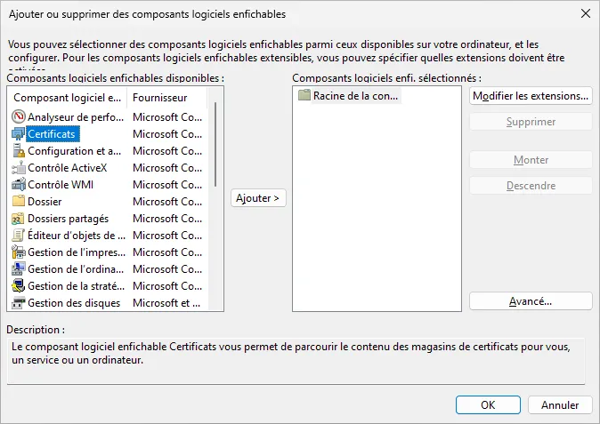
</div>


* Un compte d'ordinateur

<div align="center">
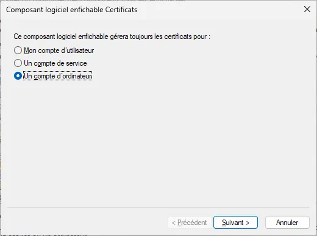
</div>


* Ordinateur local

<div align="center">
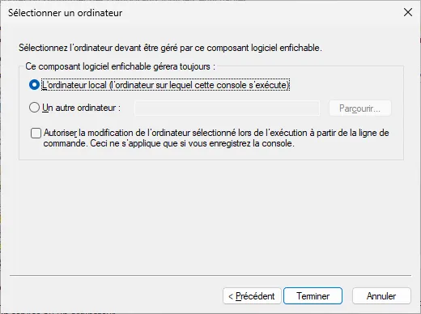
</div>


* Terminer

* OK

* On retrouve le certificat

<div align="center">
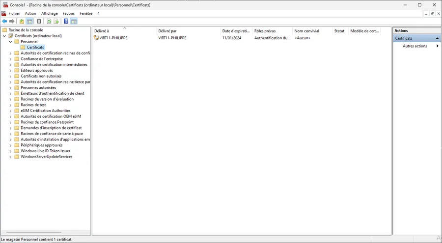
</div>


* Double clic sur le certificat. Il faut noter qu'il est valide 1 an

<div align="center">
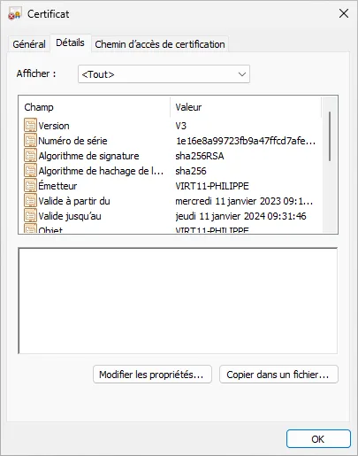
</div>

### Sécuriser la communication

* Sur la machine cible

* Ajouter un listener HTTPS et le lier au précédent certificat `$RemoteCert`

```
New-Item -Path WSMan:\localhost\Listener\ -Transport HTTPS -Address * -CertificateThumbPrint $RemoteCert.Thumbprint -Force
```
<div align="center">
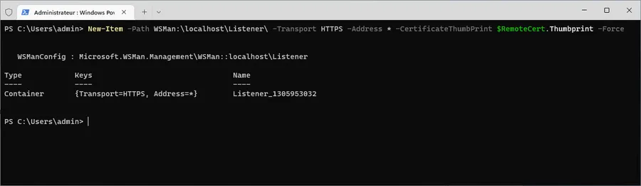
</div>


* Lister les écouteurs afin de confirmer que tout est OK
  + Il doit y en avoir 2. Un sur HTTP (utilisé précédemment dans la méthode trusted hosts) et celui sur HTTPS qu'on vient de créer.

<div align="center">
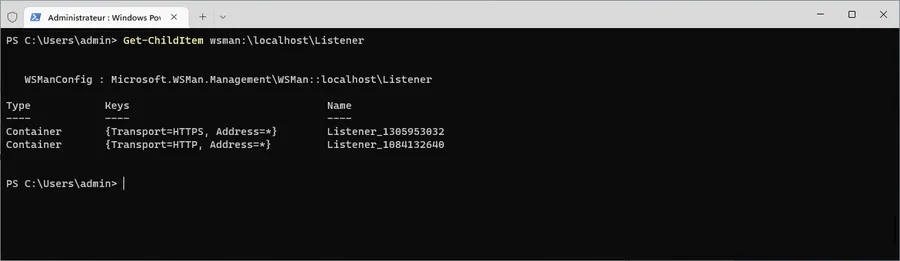
</div>


* Ouvrir le port 5986 dans le firewall
  + Les communications HTTP et HTTPS passent respectivement via les ports 5985 et 5986

```
New-NetFirewallRule -Displayname 'Gestion à distance de Windows (HTTPS-Entrée)' -Name 'WINRM-HTTPS-In-TCP-NoScope' -Profile Private -LocalPort 5986 -Protocol TCP

```
<div align="center">
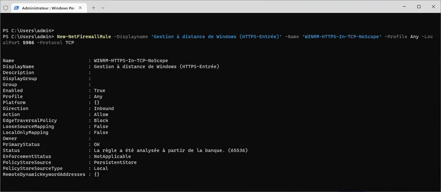
</div>


* Redémarrer WinRM

```
Restart-Service WinRM
```

* Exporter le certificat
  + La machine dispose d'un répertoire Public auquel on pourra accéder depuis la machine locale de l'administrateur. Le certificat peut très bien être sauvegardé sur le bureau ou ailleur.

```
Export-Certificate -Cert $RemoteCert -FilePath "c:\Users\Public\Documents\$env:COMPUTERNAME.cer"
```

* Importer le certificat sur la machine locale (Admin) d'une façon ou d'une autre

* Quand le certificat est sur le disque dur, on peut faire un clic droit sur le nom du certificat dans File Explorer et 'Installer le certificat'

<div align="center">
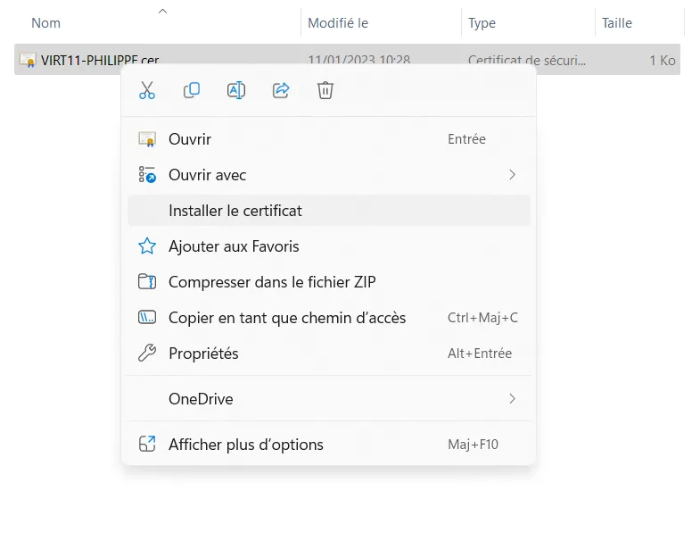
</div>


* Sinon, si par exemple on a copié le certificat sur le bureau on peut utiliser la commande suivante

```
Import-Certificate -FilePath C:\Users\phili\OneDrive\Bureau\VIRT11-PHILIPPE.cer -CertStoreLocation Cert:\LocalMachine\root\
```

* Comme précédemment, on peut utiliser la console de management (MMC) pour vérifier que le certificat est bien importé.

<div align="center">
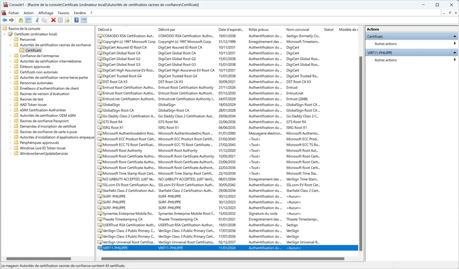
</div>


* On peut alors ouvrir une session sur la machine distante en utilisant son nom et une liaison cryptée. Youpi !

```
Enter-PSSession -Computername VIRT11-PHILIPPE -UseSSL -Credential admin
```

* Idem pour invoquer une commande

```
Invoke-Command -ComputerName VIRT11-PHILIPPE -UseSSL -Credential admin {get-eventlog -LogName System -new 3}
```
<div align="center">
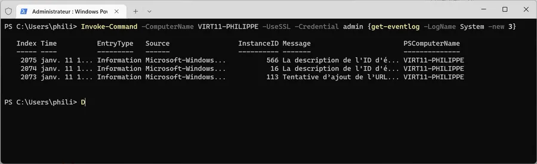
</div>


On peut s'amuser (ou anticiper un script) avec les lignes suivantes

```
$UserName = 'admin'
$Password = 'MyTopSecretPasswd'
$SecPassword = ConvertTo-SecureString $Password -AsPlainText -Force
$CredObject = New-Object System.Management.Automation.PSCredential ($UserName, $SecPassword)
Invoke-Command -ComputerName VIRT11-PHILIPPE -UseSSL -Credential $credObject {get-eventlog -LogName System -new 3}
```
<div align="center">
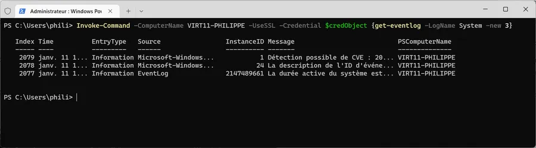
</div>

## Remarques

### Connexion sur localhost

* Il faut créer un compte local de type administrateur. Voir le tout début de ce billet. Ne pas oublier de mettre le compte en question dans le groupe administrateur. Ça sent le vécu mais j'ai perdu beaucoup de temps là-dessus...

* Ensuite, il faut suivre, sur la machine locale, la procédure de la configuration d'une machine distante qui est expliquée ci-dessus.

* Quand c'est fait je peux me connecter à localhost avec le compte local admin

```
Enter-PSSession -ComputerName localhost -Credential admin
```

Ci-dessous, on voit que

* Au tout début je suis phili

* On rentre dans une session avec le compte Admin. Admin est le nom du user que j'ai créé. C'est un compte local qui appartient au groupe Administrateur.

* Je rentre le mot de passe de Admin

* La session s'ouvre (voir le prompt avec [localhost] au début)

* Je vérifie qui je suis dans la session avec whoami. Je suis bien le compte Admin sur la machine 5PRO-PHILIPPE

* Bref la vie est belle 😁. Je peux faire des tests remote PowerShell sans avoir à me connecter à des machines virtuelles ou physique. Faudra juste que je me connecte sous le nom Admin.

<div align="center">
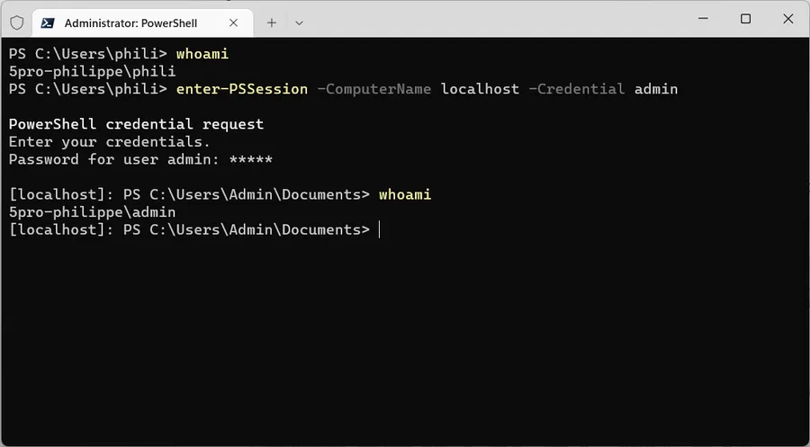
</div>

### Firewall - Port 5985

Quand je vais voir dans le firewall de la machine distante VIRT11-PHILIPPE, voilà ce que je vois. Les règles sont classées par N° de port.

<div align="center">
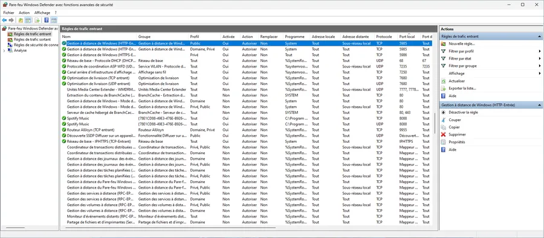
</div>


Je pense

2. Qu'il faut désactiver la première règle dont le profil est public

6. Modifier le profil de la seconde pour ne garder qu'un profil privé

Dans le premier cas il suffit de double cliquer sur la règle et de décocher la case Activé

<div align="center">
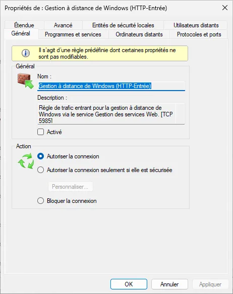
</div>


Dans le second cas, double cli sur la règle, onglet Avancé, ne laisser coché que la case Privé.

<div align="center">
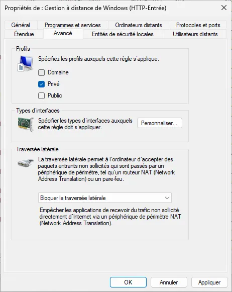
</div>
