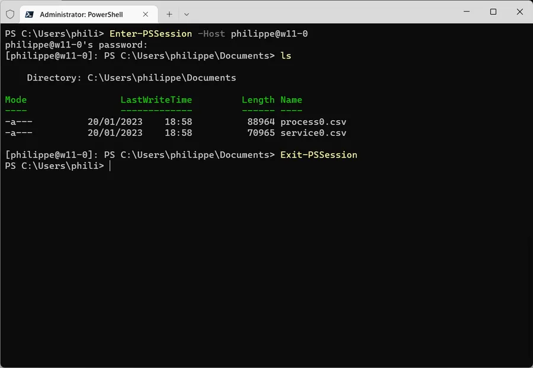

# Remote PowerShell sur SSH

## Introduction
Si besoin, il ne faut pas hésiter à [lire ce billet]() où j'explique comment configurer PowerShell pour pouvoir faire du Remote PowerShell sur WinRM dans un Workgroup.

Ici, on est toujours dans un Workgroup et le but est de faire du Remote PowerShell non pas sur WinRM mais sur SSH. Comme on va le voir, la majeure partie du boulot consiste à configurer la machine distante, le serveur. J'utilise une machine virtuelle Windows 11 'vierge' afin de partir d'une base saine.

## Installer PowerShell

* On est sur la machine distante.
* Je parle de PowerShell. Pas de Windows PowerShell qui est déjà sur la machine
* Si on installe PowerShell via le Microsoft Store, PowerShell va se retrouver dans C:\Progra~1\WindowsApps\Microsoft.PowerShell_7.3.2.0_x64__8wekyb3d8bbwe\pwsh.exe
  **Ce n'est pas une bonne idée.**
* Si on l'installe avec [choco](https://chocolatey.org/), PowerShell sera dans le répertoire C:\Program Files\PowerShell\7\pwsh.exe
  **C'est vraiment la méthode que je recommande.**
* Pour installer choco il faut ouvrir une console en mode administrateur (**WIN + X, A**) puis saisir la commande ci-dessous

```
Set-ExecutionPolicy Bypass -Scope Process -Force; [System.Net.ServicePointManager]::SecurityProtocol = [System.Net.ServicePointManager]::SecurityProtocol -bor 3072; iex ((New-Object System.Net.WebClient).DownloadString('https://community.chocolatey.org/install.ps1'))
```

* Ensuite pour installer PowerShell, dans la même console, il faut saisir cette ligne

```
choco install powershell-core -y
```

* Quand PowerShell sera installé, il faudra fermer la console.


## Installer client et serveur SSH

Quand c'est fait, rouvrir une console en mode administrateur et y saisir les lignes suivantes pour installer un client et un serveur SSH

```
Add-WindowsCapability -Online -Name OpenSSH.Client~~~~0.0.1.0          # Inutile sous Win11 car il est déjà installé
Add-WindowsCapability -Online -Name OpenSSH.Server~~~~0.0.1.0          # c'est lent
```

Saisir ensuite les 2 lignes suivantes pour démarrer et configurer les prochains démarrages du serveur SSH

```
Start-Service sshd
Set-Service -Name sshd -StartupType Automatic
```

Histoire d'être serein, vérifier que la règle SSH du firewall est bien à Enabled (paramètre 6) dans la capture d'écran

```
Get-NetFirewallRule -Name *ssh*
```
<div align="center">

</div>


Il faut ensuite éditer le fichier sshd_config. À partir de la console, saisir :

```
notepad $env:ProgramData/ssh/sshd_config
```

Dans le fichier sshd_config il faut faire 3 choses :

1. Mettre `PasswordAuthentication` à yes en enlevant le # de commentaire en début de ligne
   Faire une recherche sur 'PasswordAuthentication' peut aider

<div align="center">

</div>


2. Enlever le commentaire devant `PubkeyAuthentication`
   Là aussi, faire une recherche sur le mot 'PubkeyAuthentication' peut aider

<div align="center">

</div>


3. Ajouter PowerShell comme sous-système SSH.
   C'est là qu'on regrette d'avoir fait l'installation via le store Microsoft…
   Dans tous les cas, bien repérer le 'Progra~1' qui traîne dans le chemin.

<div align="center">

</div>


Avec une installation de PowerShell via choco, voilà ce que donne la section en question.

```
# override default of no subsystems
# Subsystem	sftp	sftp-server.exe
Subsystem powershell C:\Progra~1\PowerShell\7\pwsh.exe -sshs -NoLogo -NoProfile
```

En cas de soucis, afin de retrouver le chemin vers pwsh.exe on peut utiliser la commande suivante :

```
Get-Process pwsh | Format-List *
```

On voit alors la liste ci-dessous et on s'en sort avec un copier-coller partiel du paramètre Path. Bien sûr, LA solution, c'était d'installer PowerShell avec choco dès le départ.

<div align="center">

</div>


Sauver le fichier sshd_config quand les 3 points précédents sont effectués.

On relance alors le serveur SSH

```
Restart-Service sshd
```

Ensuite, je vérifie que la machine est bien sur un réseau privé

```
Get-NetConnectionProfile
# Si besoin Set-NetConnectionProfile-InterfaceIndex No_Interface -NetworkCategory Private

```


## Les tests

### Sur la machine distante

Bon allez, c'est parti, on reste dans la même console et on fait un premier test en local.

```
Enter-PSSession -Host localhost

```

Bien voir que j'utilise le paramètre `-Host` ce qui force PowerShell à passer via SSH plutôt que WinRM.

Ici, je peux me permettre de ne **PAS** préciser le paramètre `-UserName` car la commande prendra alors mon Id Windows. Bon, c'est un détail. En cas de doute lisez l'aide.

```
Get-Help Enter-PSSession -ShowWindow    # je ne peux pas le faire à ta place :-)
```

En tout cas, ça marche en local. Voir ci-dessous 😁 :

<div align="center">

</div>


### Sur la machine locale

Maintenant, depuis un autre PC sur lequel j'ai un client SSH et PowerShell je peux lancer directement la commande suivante :

```
Invoke-Command -ScriptBlock {Get-ChildItem} -HostName 192.168.1.53 -UserName philippe
# 192.168.1.53 c'est l'adr IP du serveur qu'on a préalablement configuré
# philippe est un administrateur local de la machine distante
```
<div align="center">

</div>


Je peux aussi me connecter en utilisant le nom de la machine distante qui s'appelle WIN11-0. Pour cela j'utilise la commande suivante :

```
 Enter-PSSession -Host w11-0 -UserName Philippe
```

Dans la commande ci-dessus, Philippe est le nom d'un utilisateur local qui est aussi un Administrateur de la machine distante. Ci-dessous, lors de la toute première connexion il faut une empreinte etc. On dit 'oui' et après avoir rentré le bon mot de passe, ça roule. On voit que la connexion est effective car le début du prompt change (ici, [Philippe@w11-0])

<div align="center">

</div>


On peut aussi se connecter avec philippe@win11-0 ce qui est plus pratique.

```
Enter-PSSession -Host philippe@w11-0
```
<div align="center">

</div>


Bizarrement, je n'arrive pas à utiliser les commandes suivantes :

```
Invoke-Command -ScriptBlock {Get-ChildItem} -HostName WIN11-0 -UserName philippe
Invoke-Command -ScriptBlock {Get-ChildItem} -HostName philippe@WIN11-0
```

Faut que je cherche encore un peu... Bon, allez, on va dire que c'est bon pour moi.

