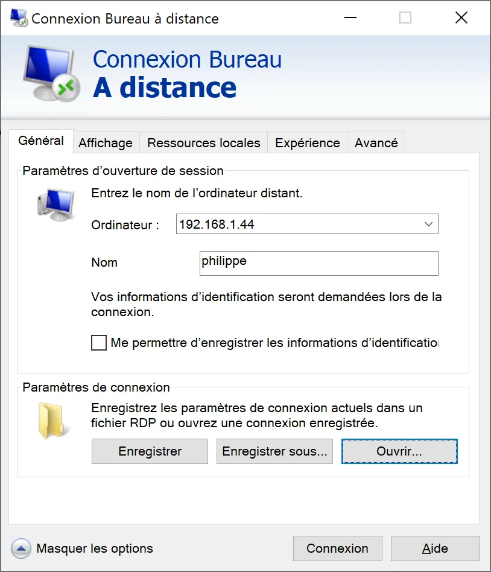
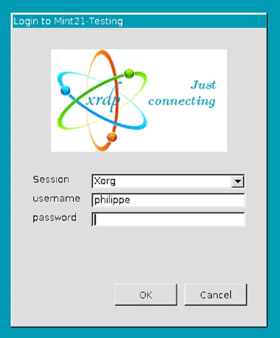
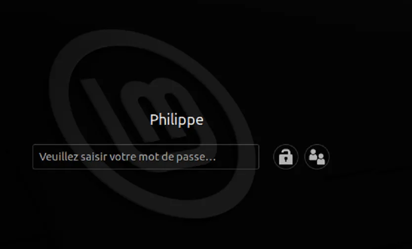
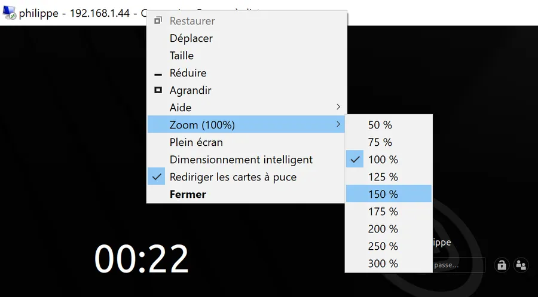

# Remote access to Linux with XRDP

## On the Linux Workstation

Open a console

* sudo apt install xrdp -y
* sudo systemctl start xrdp
* sudo systemctl enable xrdp
* sudo systemctl status xrdp

[XRDP](https://github.com/neutrinolabs/xrdp) use /etc/ssl/private/ssl-cert-snakeoil.key which can be read by the members of the "ssl-cert" group.

* sudo adduser xrdp ssl-cert
* sudo systemctl restart xrdp

Port 3389 must be open on the firewall

* sudo ufw status
* sudo ufw allow 3389/tcp
* sudo ufw status

We need to know the IP address of the Linux box

* ifconfig

The 3 lines below might be useful if you plan some testing over ssh or with Putty

* sudo apt install openssh-server
* sudo ufw allow 22
* sudo systemctl status ssh

## On the Windows Workstation

### Linux PC

* Make sure to log out from the Linux session

### Windows PC

* Open Remote Access
* Enter the IP address of the Linux box
* In the name field, you may enter your login and save the parameters of the session

On the screen of the remote Linux Workstation

* Type in your password

You should then access your Linux login screen. If not, double check, you don't have an open session with the same username on the Linux PC.

You may need to adjust the zoom. If so, right click in the tittle bar

Voilà!

