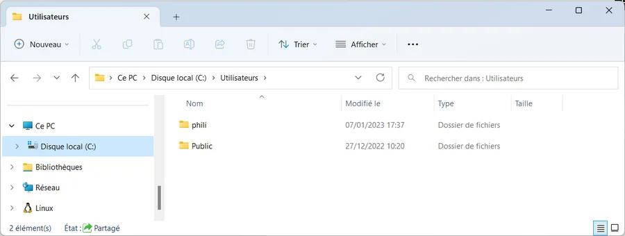

# Shared folders in local network

## Introduction
In a personal context, we have several networked PCs. We want to implement Public directories on each machine to be able to share documents without having to go through the NAS, the cloud, or emails. PCs run Win11 22H2, Win10 22H2 and Linux

## Check that the network is private - PowerShell

* Open an elevated Terminal (AKA run as **Administrator)**
* **WIN + X,  I**
  + This means press 'WIN' key and 'x' key simultaneously. Then press 'i' key.
  + I will not list that step in the next PowerShell sections.
* Get-NetConnectionProfile
* Note the InterfaceIndex (third line).
  + It will be useful if you need to set the network private

```
PS C:\Users\phili> Get-NetConnectionProfile

Name                     : Livebox-AAE0
InterfaceAlias           : Ethernet
InterfaceIndex           : 21
NetworkCategory          : Private
DomainAuthenticationKind : None
IPv4Connectivity         : Internet
IPv6Connectivity         : Internet
```


## Check that the network is private - Win11

* **WIN + I**
  + This means press 'WIN' key and 'i' key simultaneously

<div align="center">

</div>


* Network and Internet (on the left hand side)
* Properties

<div align="center">

</div>


## Check that the network is private - Win10

* **WIN + I**
  + This means press 'WIN' key and 'i' key simultaneously

<div align="center">

</div>


* Network and Internet
* Check the status of the network at the top of the window

<div align="center">

</div>


## 2 - Set the network to private - PowerShell

* If needed

```
PS C:\Users\phili> Set-NetConnectionProfile -InterfaceIndex 21 -NetworkCategory Private
```

* Double check the updated network category calling Get-NetConnectionProfile.

## 3.1 - Set the sharing and discovery option correctly - Win11

* Reach the Network and Internet settings
  + **WIN + I**
  + Network and Internet
* Select Advanced parameters

<div align="center">

</div>


* Select Advanced Sharing Parameters

<div align="center">

</div>


There are 3 sections on the next page. Unfold each of them and copy the setting here-below.

### 1 - Private Networks

<div align="center">

</div>


Network discovery is mandatory since we want our PC to be visible for the other PC.

### 2 - Publics Networks

<div align="center">

</div>


Nothing is shared on public network.

### 3 - All Networks

<div align="center">

</div>


The last parameter should be set if and only if you want to ask the users to enter their Id and Password otherwise leave it unset. In my case I do not set the parameter since the public directories are supposed to be shared between all the members of the private network. If we want to share specific directory with specific people, we can easily, do it with others means.


## Set the sharing and discovery option correctly - Win10

* Reach the Network and Internet settings
  + **WIN + I**
  + Network and Internet
* Select Network and Sharing

<div align="center">

</div>


* Left hand side
* Select Modify advanced sharing parameters

<div align="center">

</div>


There are 3 sections on the next page. Unfold each of them and copy the setting here-below.

### 1 - Private Networks

<div align="center">

</div>


Network discovery is mandatory since we want our PC to be visible for the other PC.

### 2 - Public Networks

<div align="center">

</div>


Nothing is shared on public network.

### 3 - All Networks

<div align="center">

</div>


The last parameter should be set if and only if you want to ask the users to enter their Id and Password otherwise leave it unset. In my case I do not set the parameter since the public directories are supposed to be shared between all the members of the private network. If we want to share specific directory with specific people, we can easily, do it with others means.


## Use cases

Repeat the process on the other PC and you should be good to go.

In the example below, SURF-PHILIPPE is a remote PC and 5PRO-PHILIPPE is my local machine.

First, note that there is a 'Public' directory under Users in your local machine

<div align="center">

</div>


The 'Public' directory is pre-populated with sub-directories whose names help to dispatch the kind of documents to be shared. Obviously, there is no restriction, and you can add your own subdirectories.

<div align="center">

</div>


Now, if I browse the local network and reach the PC named SURF-PHILIPPE. I'm asked an ID and password. I type one letter in the ID and click OK. In fact, to access the Public directory, the ID is not mandatory.

<div align="center">

</div>


I can now reach the 'Users' directory...

<div align="center">

</div>


and I the 'Public' sub-directory. For example, I can visit the Public Documents sub-directory.

<div align="center">

</div>


## Linux

To learn more about the use case with a Linux remote PC you should [read that page]().

