# Choix de mon prochain PC (2023)

## Introduction

Novembre 2022, je suis en train de changer de PC et je me dis qu'il est peut-être utile de regrouper sur une page mes notes, les points étudiés, mon "cahier des charges" etc. Il y aura donc un maximum de liens à consulter et à garder sous le coude. Même si finalement vous choisissez un autre type de PC, j'imagine que les points abordés ici ainsi que la démarche pourront être utiles à certains.

Mon précédent PC est un Surface Book i7 qui date de 2016. En fait, j'ai eu du mal à retrouver l'information. Pour rappel, sous Windows on peut retrouver la date d'installation de l'OS avec l'une ou l'autre des deux commandes ci-dessous. Sur mon Surface, cela ne marche pas car je retrouve la date à laquelle j'avais réinstallé Windows

### Première option

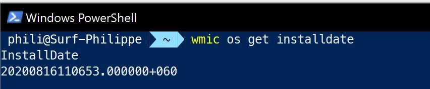

### Seconde option

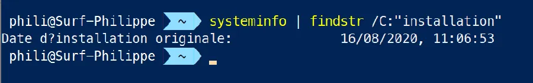

Après avoir appuyé sur la touche Windows, si je tape "msinfo", dans le Résumé Système la date du BIOS n'est pas disponible non plus.

### Ce que je retiens de mon utilisation du Surface

* En plus de mon portable de bureau (un ASUS UX480 que je n'aime pas beaucoup), j'utilise le Surface quasiment tous les jours.
* Pas mal de bidouilles autour de la programmation/compilation...
* Je ne joue pas
* Je passe un temps infini sur YouTube (et le Web)
* Je ne me sers pratiquement jamais de l'écran tactile. Idem pour le stylet.
* Je ne décroche jamais l'écran du reste du PC pour l'utiliser comme une grosse tablette.
* Je n'aime pas les écrans brillants. J'ai un écran brillant aussi sur mon portable de boulot et là aussi je trouve que c'est difficile à utiliser tous les jours. Dès qu'on a une fenêtre dans le dos on ne voit plus rien. Faut vraiment être chez soi, dans le noir, dos au mur pour être serein (oui, oui je sais j'exagère un peu...)
* Je ne suis pas trop fan du ratio 3/2
* J'aime beaucoup la résolution 3 000/2 000. Même avec le nez sur l'écran on ne voit pas les pixels. Tu m'étonnes... On est à 267 PPI et 98 PPD.

Info Windows

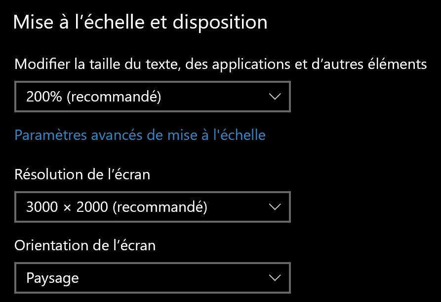

Calcul du nombre de Pixels per inch 

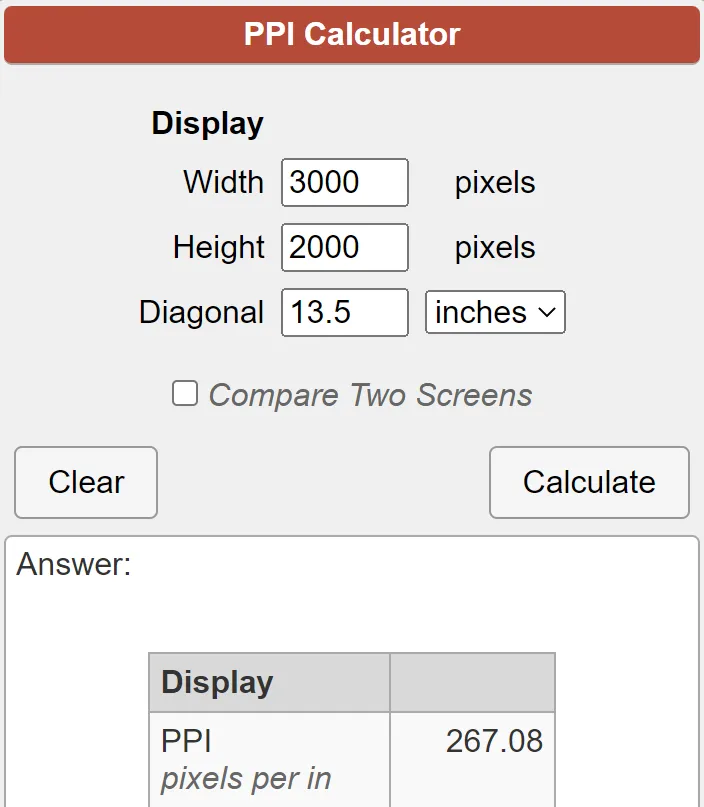

Ce que l'oeil peut discerner

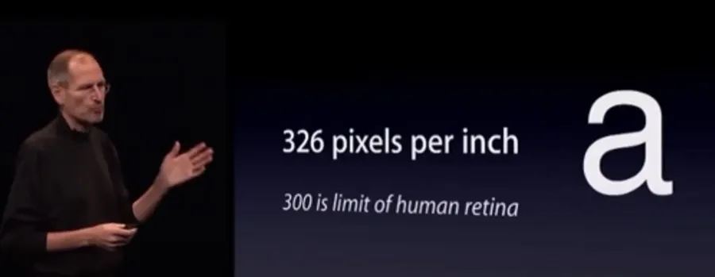

### Note

Pour rappel, la densité de pixels se calcule en utilisant la diagonale de l'écran. La formule est donc :

$$\text{PPI} = \frac {\text{Nb Pixels Diag}}{\text{Nb Inches Diag}}$$

Dans laquelle

$$\text{Nb Pixels Diag} = \sqrt{(\text{Nb Pixels Largeur})^2 + (\text{Nb Pixels Hauteur})^2}$$

#### AN :

* Nb Pixels Larg = 3 000
* Nb Pixels Haut = 2 000
* Diagonale = 13.5 inches

$$\text{Nb Pixels Diag} = \sqrt{3000^2 + 2000^2} = 3 605$$

Finalement

$$\text{PPI} = \frac {3 605}{13.5} = 267$$

### La suite de ce que je retiens à propos de mon Surface

* Le SSD de 256G est un peu court même si je mets beaucoup de choses sur Dropbox (je pense que je vais arrêter de payer et passer à OneDrive)
* La machine aurait mérité, un peu plus de coffre, de processeurs et [de dents](https://www.youtube.com/clip/UgkxDSlB66Fhqu6LMU8Nr_mOeZQl7l72OTkw).

## Mon cahier des charges

* Écran mat, non tactile.
* Pas 13' ni 17' mais entre les 2
* Résolution plus haute que 1920x1080
* Pixel per degree supérieur à 57 (idéalement supérieur à 60)
* NITS supérieur à 250
* Plus de 2 cores (4 processeurs logiques). C'est ce que j'ai actuellement et franchement c'est un peu court.

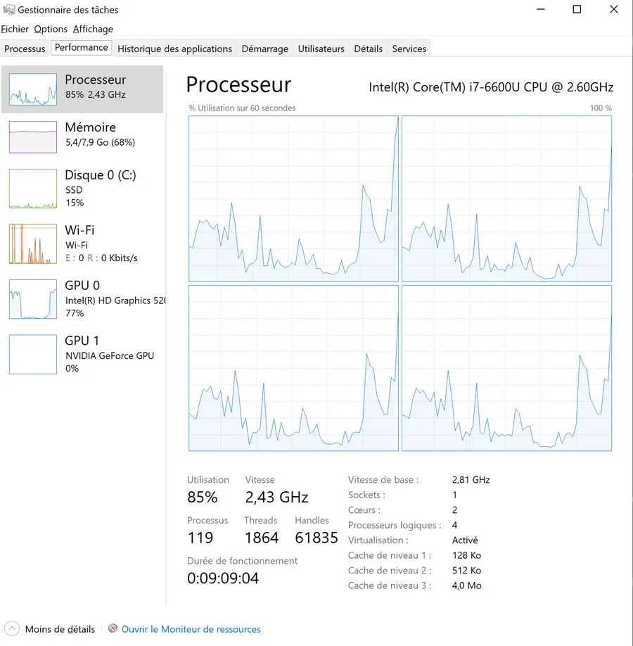

*Ci-dessus, je viens de démarrer, j'ai Chrome d'ouvert... Je suis déjà à 70% de RAM et franchement je ne sais pas ce que fait le processeur (85%). 120 Process en mémoire quand même...*

* 32 GB de RAM. Actuellement j'ai 8 GB. En 2023, de mon point de vue, il faut 16 GB minimum (c'est ce que j'ai sur le laptop du boulot)
* Disque dur 512 GB
* Un clavier au-dessus de la moyenne car j'y passe pas mal de temps
* Prise RJ45 directement disponible (pas via une prise et un chipset USB)
* Windows Pro (il dispose d'une [sand box](https://www.zebulon.fr/astuces/securite-systeme/comment-utiliser-la-sandbox-de-windows-10.html) pour y faire des tests). Les versions Home et Pro de Windows disposent toutes les deux de WSL
* Je n'ai pas de contrainte particulière vis à vis de l'autonomie

## Mon premier choix

Je souhaitais racheter un Dell. J'en ai déjà eu pas mal par le passé, je n'ai jamais été déçu. Ceux de mes enfants (XPS 13) n'ont jamais posé de problème. Je louchais sur un XPS 15 mais là, le hic, c'est le prix. En plus, aux résolutions que je souhaite, souvent, Dell ne propose que des écrans tactiles, brillants. De mon point de vue c'est donc la mort et le choléra...

### Exemple de configuration à base de XPS 15

2 500€ le bout quand même...

* Processeur : OK
* OS : OK
* Carte Graphique : je m'en fiche mais bon 2.5 k€ pour une config avec une RTX 3050... NOK
* Mémoire : OK
* Disque : Trop gros mais bon on va dire OK
* Ecran : NOK à cause de la résolution
* Prix : 2 500€, NOK (faut pas déconner)

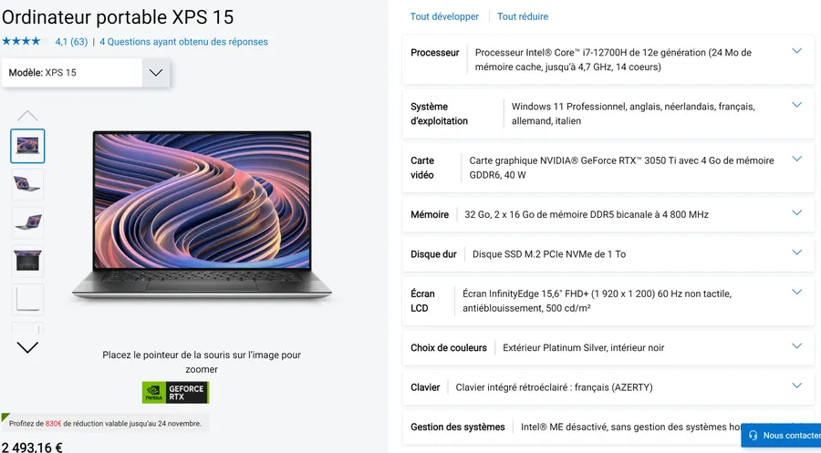

### Configuration à base de G 15

Bon allez, je passe mon chemin et je continue à chercher. Je me suis retrouvé avec une configuration à base de G15 sur lequel je ne pouvais pas faire évoluer la quantité de mémoire ni le type de Windows installé (version Home obligatoire). Le tout pour la "modique" somme de 1 400 €.

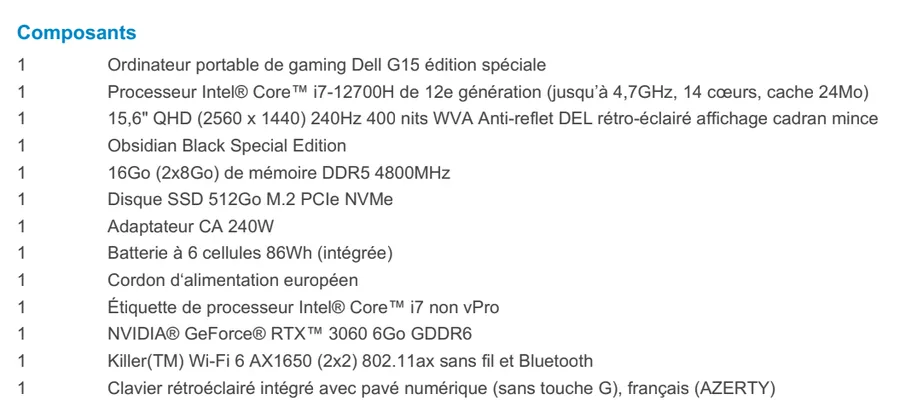

Ce qui m'a un peu déçu chez Dell c'est qu'il y a encore quelques années on pouvait tout changer, tout modifier, passer des heures sur leur site... À la limite, on faisait soi-même le BOM (bill of material) qui allait être envoyé à l'usine. Alors que là, finalement, ils n'ont plus que quelques configurations et il n'y avait pas vraiment moyen de les faire évoluer. J'étais prêt à attendre, je ne suis pas vraiment pressé. J'ai même appelé et reçu des devis. Dommage.

Une revue du G15 (il ne faut pas se laisser avoir par le titre alarmiste). Ce n'est pas tout à fait la même configuration (par exemple il y a une 3070Ti et pas une 3060 comme dans "ma" configuration) mais bon, c'est assez complet je pense : <https://www.youtube.com/watch?v=T8EzGLfRdiI>

Une vue de l'intérieur du G15. C'est classique et upgradable (mémoire, carte Wifi, disque SSD à interface NVMe [Non-Volatile Memory Express])

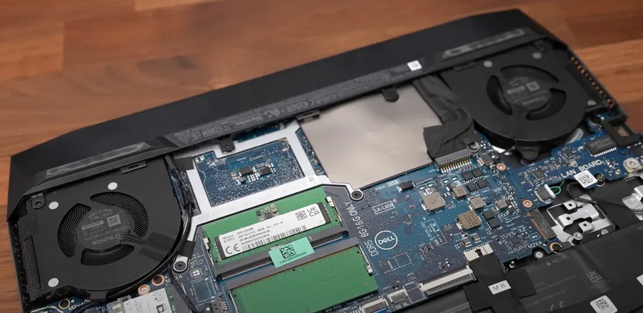

## C'est mon dernier choix Jean-Pierre

Bon... Je passe les détails, le nombre de vidéos regardées, le nombre de sites visités et de configurateurs torturés. En fait, j'adore ça... J'en ai profité pour me faire une orgie de pages et de vidéos techniques. Du coup j'ai réalisé que j'étais carrément à la ramasse et qu'il faudrait que je trouve le moyen de faire une remise à niveau plus régulièrement (une fois par semestre par exemple).

Finalement j'ai arrêté mon choix sur un **Lenovo Legion 5i Pro** livré sans OS. Le "i" c'est parce qu'il est équipé d'un processeur Intel pour laquelle il y avait une "promo" à 1699 € (ça pique quand même...)

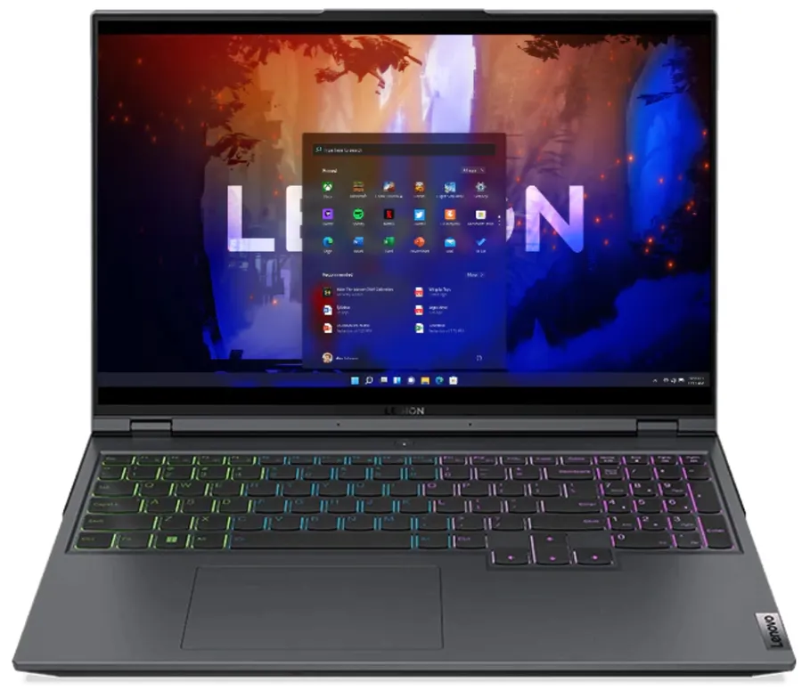

Un résumé des specs. Note au passage qu'il a autant de RAM dans la carte vidéo que dans mon Surface...

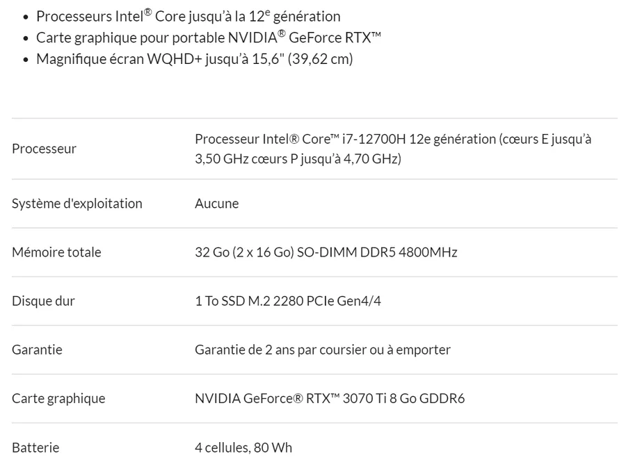

* Une vidéo de présentation : <https://youtu.be/iMuRFO5YuFQ>
* Une vidéo plus récente où le gars l'a eu entre les mains 30 jours : <https://youtu.be/4aWxK3bFzZo>
* Une autre vidéo qui évalue précisément cette configuration : <https://youtu.be/xK1HbpUoxyE>

Voilà ce qui a été mesuré sur le disque

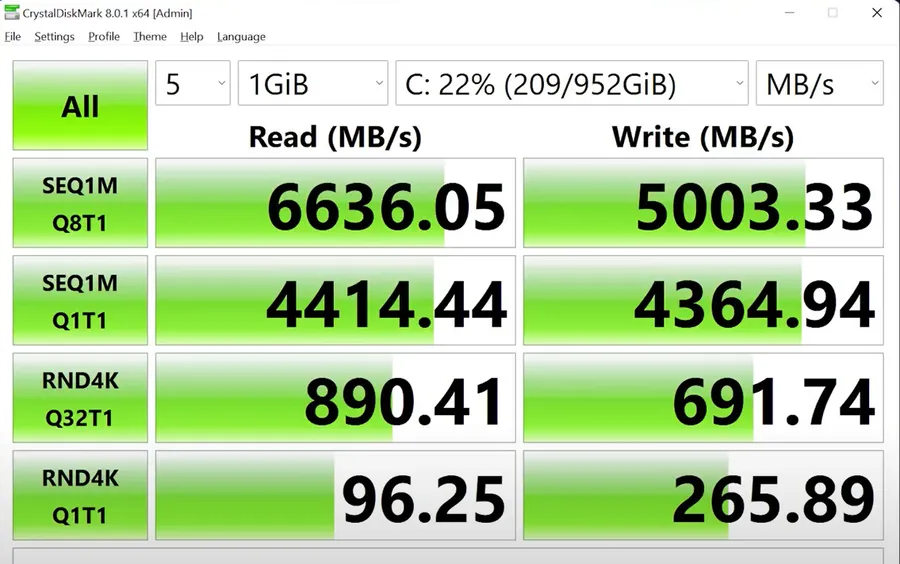

Dans la configuration on est sur du PCIe Gen 4/4. En Gen 4, théoriquement on peut passer 2 GB/s par voie PCIe. Si ici il y a 4 "lanes" PCIe. Ce n'est donc pas déroutant (mais complètement bluffant) d'avoir une vitesse de lecture de 6.6 GB/s.

Deux liens : 
1. Un premier pour faire [un rappel](https://www.cgdirector.com/nvme-vs-ssd/) sur le NVMe 
1. Un second pour aller [un peu plus loin](https://blog.westerndigital.com/nvme-important-data-driven-businesses/) dans les détails. 

Finalement, [une vidéo](https://youtu.be/HvfIeTieXOI) assez ancienne mais qui explique bien la transition disque dur classique, SSD puis SSD via interface NVMe.

Pour info, un comparatif des principales specs des cartes graphiques que l'on peut trouver dans ce type de portable.

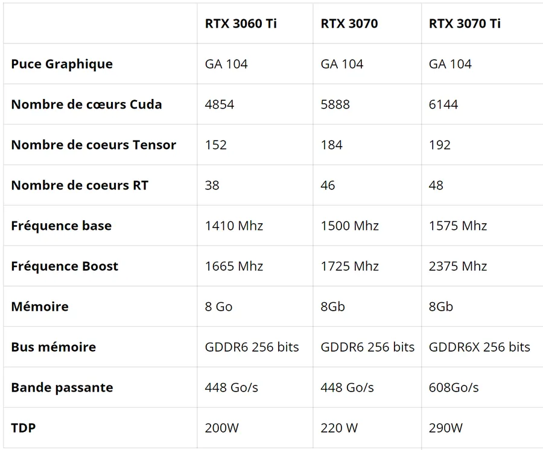

## Pourquoi une telle fixette sur l'écran, la résolution... ?

Tout simplement parce que l'on passe un temps infini devant l'écran. Un peu comme pour le clavier, on a intérêt à savoir ce que l'on choisit, quels compromis on fait, leurs conséquences etc.

Pour commencer, je vous propose d'aller voir cette [vidéo](https://youtu.be/vEKtElvxl8A?si=Q9tznF3uVMe9JcWH) qui fait le point sur les résolutions, les prix etc.

Ensuite, il faut aller jouer avec cette [feuille de calcul](https://bit.ly/techless-rescalc). J'ai fait quelques modifications dans ma copie pour tenir compte de la diagonale de 16 pouces ainsi que du ratio et du format QHD+. 

Enfin, j'ai pris le temps de vérifier que lorsque je tape au clavier, mes yeux sont plutôt à 52 cm et pas à 60 cm de l'écran.

Ci-dessous, il faut s'attarder sur la colonne où il y a le 16' et les lignes où il y a QHD+. On est bien au-delà de 57 DPP (Pixel Per Degree) ça devrait bien se passer.

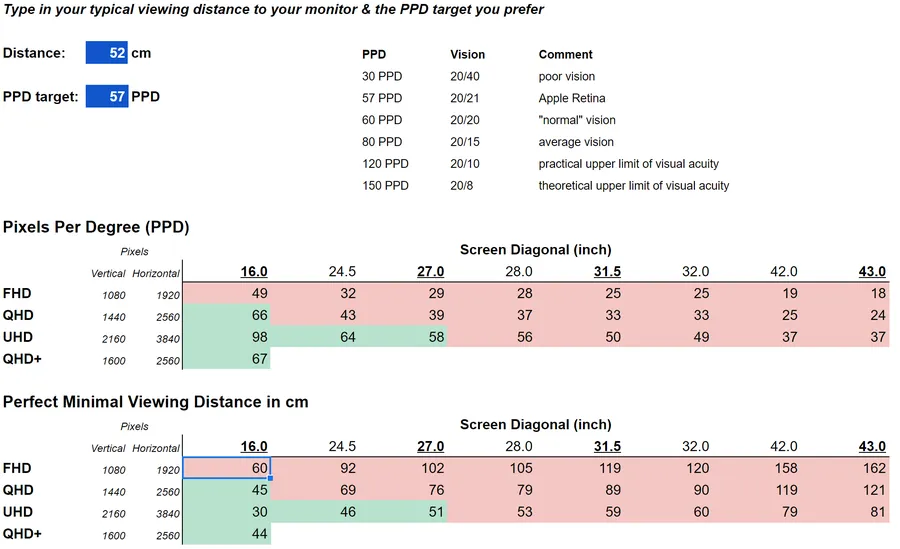

Bizarrement sur ce [site](http://phrogz.net/tmp/ScreenDensityCalculator.html#find:density,pxW:2560,pxH:1600,size:16,sizeUnit:in,axis:diag,distance:52,distUnit:cm) (ou sur [celui-là](https://qasimk.io/screen-ppd/)) on trouve une autre valeur (70 au lieu de 67). Je pense que je suis bon pour refaire les calculs...

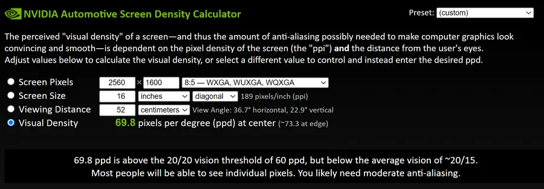

Du coup, j'ai refait les calculs. Voilà ce que j'obtiens sous Excel :

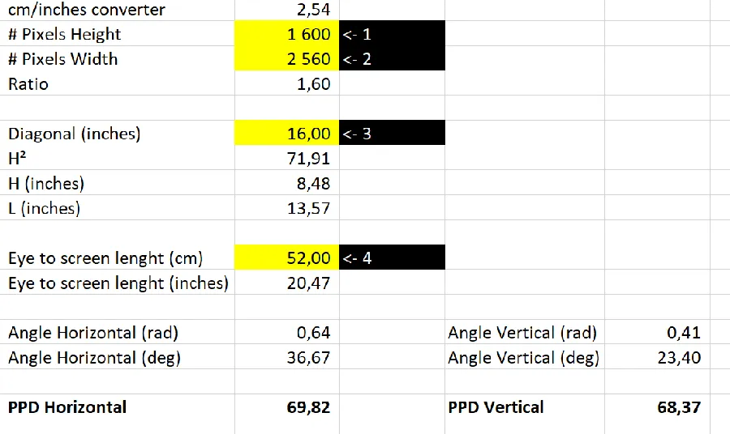

Dans la feuille il suffit de remplir les champs en jaune dans l'ordre (1, 2...). Le résultat se trouve en face de PPD Horizontal. Ci-dessous la feuille de calcul Excel en question :

[PPD.xlsx](./assets/PPD.xlsx)

Toujours sur le sujet du nombre de Pixels Per Degree mais plutôt dans un contexte de casque VR (où pour le coup c'est hyper important), il faut peut-être aller [lire cette page](https://www.roadtovr.com/understanding-pixel-density-retinal-resolution-and-why-its-important-for-vr-and-ar-headsets/).

Du point de vue de la densité des pixels on sera loin des 267 PPI du Surface, mais bon, avec 190 PPI ça devrait bien se passer.

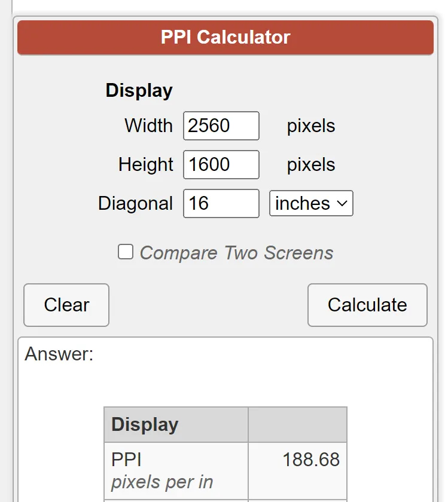

On peut utiliser cet excellent graphique pour s'y retrouver dans les résolutions, les ratios et les dénominations.

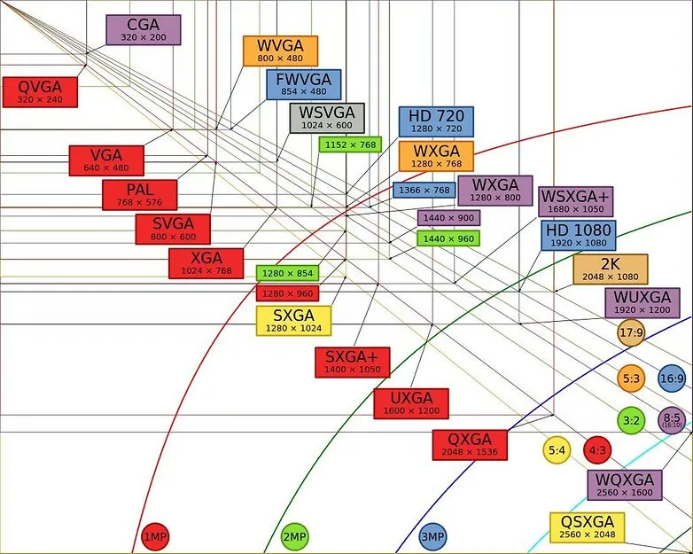

Pour compléter, 2 articles d'introduction aux gamuts [ici](https://www.viewsonic.com/library/fr/photographie-fr/quest-ce-que-le-gamut/) et [là](https://www.benq.eu/fr-fr/knowledge-center/knowledge/color-gamut-monitor.html).

Le Legion 5 i Pro a été mesuré à 97%, 70% et 72% des gamuts sRGB, AdobeRGB et DCI-P3 respectivement.

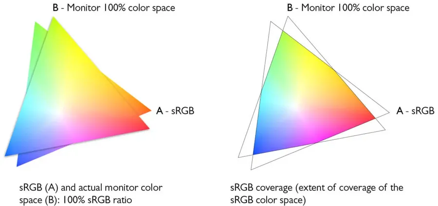

Un autre jeu de mesures des gamuts

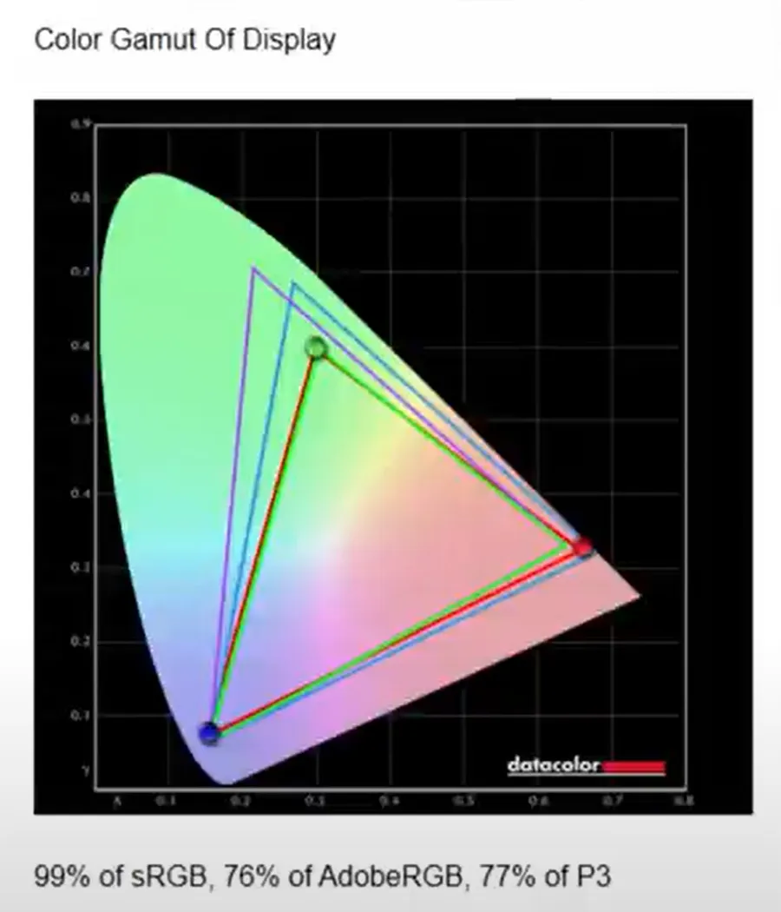

Un dernier couple de jeu de mesures que j'ai trouvé

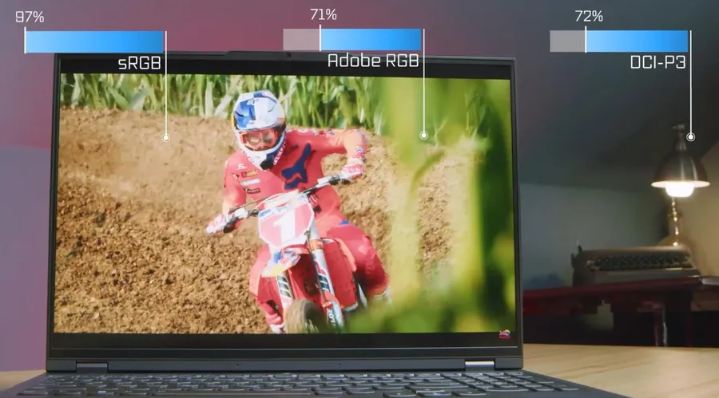

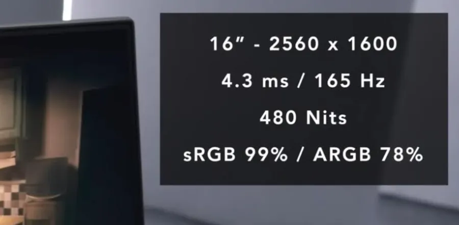

C'est quand même bizarre qu'on n'arrive pas à avoir deux jeux de résultats identiques.  
Bon allez, [une dernière vidéo](https://youtu.be/fmw1uE6DDco) à propos des gamuts.

### Note

Optimus de NVIDIA permet d'utiliser le bon GPU en fonction du contexte (je travaille sous Word, je lance un jeu...). Cela dit en mode jeu, si les données sont bien traitées par le dGPU (le discrete GPU, la carte NVIDIA) avant d'atteindre l'écran, les "frames" doivent passer par le iGPU (integrated GPU, celui qui est intégré au processeur) ce qui limite les performances.

Pour bénéficier des meilleures performances il faut aller dans le BIOS pour configurer "manuellement" le multiplexeur pour qu'il connecte le dGPU tout le temps à l'écran. Certes, c'est top pour les performances mais c'est moins bien pour la batterie car tout passe tout le temps via le dGPU qui consomme beaucoup plus que le iGPU. En plus cela oblige à sauvegarder ce sur quoi on bosse puis rebooter une fois pour configurer le multiplexeur puis une seconde fois quand c'est fait. Bref, pas cool.

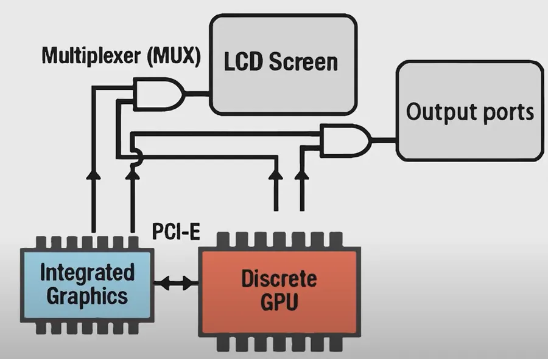

Advanced Optimus permet dorénavant de bénéficier d'Optimus (changement de GPU à la volée en fonction du contexte) et de s'assurer que lorsque l'écran doit être alimenté par le dGPU cela se fasse en direct sans passer par le iGPU ni avoir besoin de rebooter. Pour en bénéficier il faut quand même que le jeu n'utilise pas une version trop ancienne de DirectX.

Pour utiliser l'Advanced Optimus, il faut d'abord que sous Vantage (le soft de Lenovo), le "GPU Working Mode" soit sur "Hybrid-Auto Mode". Ensuite on peut aller dans le panneau de contrôle de NVIDIA pour activer l'Advanced Optimus.

Une vidéo spécifique sur [Advanced Optimus](https://youtu.be/h73dFLZgfh4).

## Pourquoi Intel et pas AMD?

* La "promo" de Novembre concernait la config avec le processeur Intel
* Le i7-12700H semble mieux s'en tirer que le Ryzen 7 6800H quand il s'agit de compilation qui est un sujet qui m'intéresse un peu.
* L'inconvénient de la config Intel c'est qu'elle vide plus rapidement la batterie

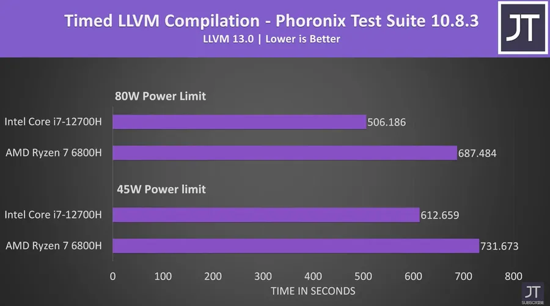

## Pourquoi un Legion 5 Pro et pas un simplement un Legion 5?

* 500 Nits plutôt que 300. 1 Nits = 1 candela/m². Plus il y en a plus l'écran est lumineux.
* Ratio de 10/16 plutôt que 9/16 qui permet d'avoir un peu plus de chose à l'écran en vertical
* Résolution WQXGA 2560x1600 plutôt que QHD 2560x1440
* Le bundle de la promotion de novembre incluait une carte graphique 3070Ti plutôt qu'une 3060.

Une vidéo qui rentre plus dans [les détails de la comparaison](https://youtu.be/HxGt_gZJybQ?t=276).

## Il n'y a pas eu des problèmes de performances avec la RAM?

### Pour faire court

Le problème n'existe plus depuis que les PC sont livrés avec de la RAM de type DDR5.

### Pour faire plus long

Je ne suis vraiment pas un expert en RAM mais apparemment Lenovo et d'autres constructeurs livraient leur DDR4 sur des modules Single Sided (composants d'un seul côté) mais surtout en rank 16 (1R16).

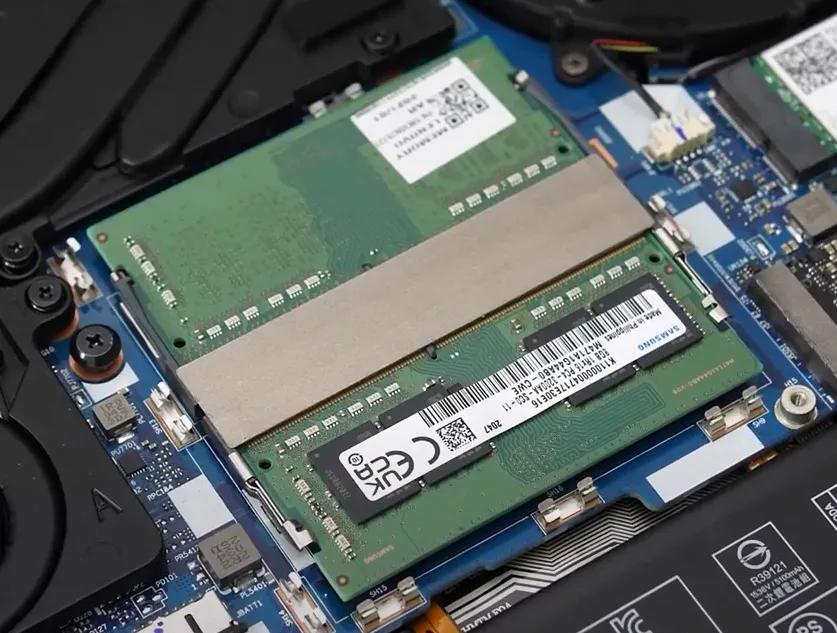

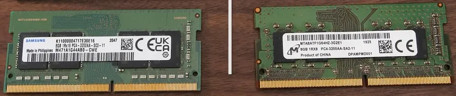

### Ce que j'ai retenu

* La RAM simple face (SS) et double face (DS) n'est pas la même chose que la RAM simple rang et double rang.
* En termes de performances, il n'y a pas de différence entre des modules mémoire simple face (SS) et double face (DS).
* En revanche, il existe une différence de performances entre la mémoire à rangée unique et la mémoire à double rangée.
* Les rangs de la RAM font référence au nombre total de bus de données de 64 bits (72 bits avec ECC) qui permettent d'accéder aux modules de mémoire.
* Tout dépend de leur quantité et d'un processus appelé entrelacement des rangs (Rank Interleaving).

### Quelques ressources que j'ai trouvé utiles sur le sujet

Attention, à part pour la premiere video, il ne faut peut-être pas trop perdre de temps là-dessus dans la mesure où cela ne concerne la RAM de type DDR4 et pas la RAM de type DDR5

[Explications détaillées](https://youtu.be/7J7X7aZvMXQ) sur le fonctionnement de la RAM DDR5

[Les explications de Linus Tech](https://youtu.be/R7CO9v9rpOk) (au pire allez directement à 9:22 pour comprendre ce qui se passait). En augmentant la densité de la RAM en diminuant le nombre de composants (1R16), on se retrouve avec plus qu'un seul contrôleur mémoire pour aller lire/écrire. En configuration 1R8 (deux fois plus de composants installés sur les 2 faces du module) on pouvait avoir 2 accès mémoire parallélisés.

[La vidéo de Jarod's Tech](https://youtu.be/zUbryj294Cs) spécifique au Legion 5 Pro équipé à l'époque de DDR4

## Et à propos du clavier?

Bien évidement je n'ai pas encore eu la possibilité de mettre les doigts dessus. Cependant, il semble qu'il y ait un consensus pour dire qu'avec une course de 1.5mm le clavier du Legion 5 Pro fait partie des meilleurs du marché (à vérifier quand même à son arrivée). Du côté temps de réponse il est annoncé inférieur à la milliseconde. Pour le reste, le clavier n'est malheureusement pas mécanique comme celui du [AERO](https://youtu.be/3id8tArV5ww?t=671) [15G](https://www.youtube.com/watch?v=3id8tArV5ww). Cela dit, il y a un "track record" côté claviers chez Lenovo (Thinkpad etc.)

* En cherchant j'ai trouvé une vidéo sur [la technologie TrueStrike](https://youtu.be/VdN1AzDxJAE) des claviers Legion.
* Un point sur les [différentes conceptions de claviers](http://www.ergopedia.ca/ergonomic_concepts/Mechanical_Keyswitches_Membrane_Keyswitches_and_Scissor_Switch_Membrane_Keyswitches_Ergonomic_Considerations.html) 
* La page [Wikipédia dédiée aux claviers.](https://en.wikipedia.org/wiki/Keyboard_technology)

### Note

Je suis en train de m'intéresser aux claviers mécaniques. C'est marrant, c'est un monde à part. Allez, [une vidéo](https://youtu.be/gYOEWMAX3W4), vite fait pour la route. Je pense que j'aurai l'occasion d'écrire un billet un jour.

## Pourquoi un PC sans système d'exploitation ?

Tout simplement parce que cela permet de faire baisser le prix de la configuration. Je vais donc acheter une clé OEM, installer Windows 11 Pro, l'ensemble des drivers Lenovo & NVIDIA, faire le ménage dans ce qui aura été installé puis tout sauver dans un point de restauration ou sur une clé USB. Je pense que cela méritera un article un peu plus tard.

Ensuite j'installerai comme d'habitude mes softs avec l'excellent [Chocolatey](https://chocolatey.org/).

À l'arrivée du PC, je pense que je vais prendre un peu de temps pour expérimenter 2 ou 3 trucs et faire mes propres benchmarks. On verra s'il y a matière à faire un ou 2 articles pour le blog.

### Quelques ressources que j'ai trouvé utiles sur ces sujets

* Une vidéo à propos des clés [Windows OEM](https://youtu.be/1N_YcnbRegM)
* Avec [Rufus](https://rufus.ie/fr/), il faut faire une clé UEFI (schéma de partition GPT) et pas MBR
* Une [vidéo](https://youtu.be/_zUbVvhYI3M) qui montre en détail le point précédent
* Une [procédure d'installation](https://www.reddit.com/r/LenovoLegion/comments/p0zdx2/softwaredrivers_to_install_when_buying_a_lenovo/), "pas à pas", à lire absolument
* Une [vidéo](https://youtu.be/x9BGn4MivJw) qui montre une autre façon de faire ses propres points de restauration
* L'outil de nettoyage de Windows dont il est question dans cette [vidéo](https://youtu.be/WmOvg0MagW0) a pas mal évolué depuis.

## Conclusion

La commande a été passée et maintenant j'attends... Ils prennent 1 mois pour livrer. Il doit donc arriver mi-décembre. Je pense qui ça irait plus vite si j'allais le monter moi-même en Chine.

Petites remarques avant de se quitter :
* Sous réserve de ne pas craindre d'ouvrir un portable neuf et/ou d'installer l'OS et les drivers...
* Il faut faire le calcul mais il est peut-être plus rentable de prendre une configuration avec une quantité de RAM minimale puis, à reception du PC, installer la quantité et la qualité de RAM souhaitée.
* Là aussi il faut faire le calcul mais je pense qu'il peut être vraiment intéressant de commander un PC sans OS et d'installer sois même Linux ou une version OEM de Windows.

Si d'ici la livraison je pense à d'autres choses, je viendrai mettre à jour cette page.

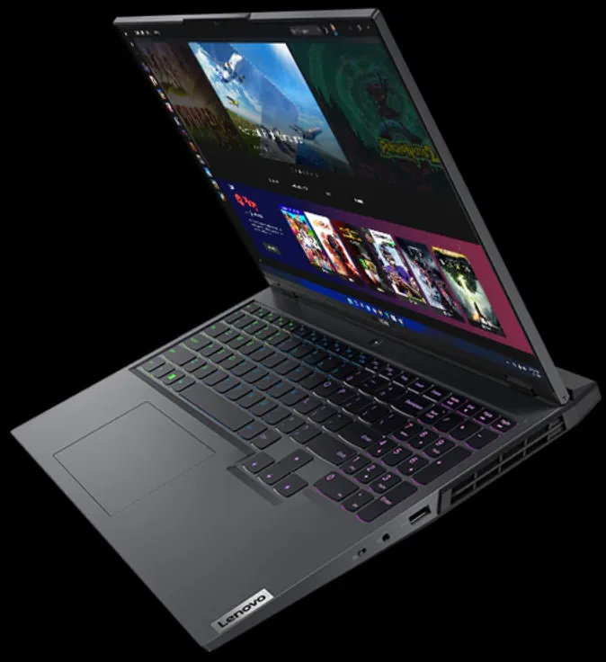

