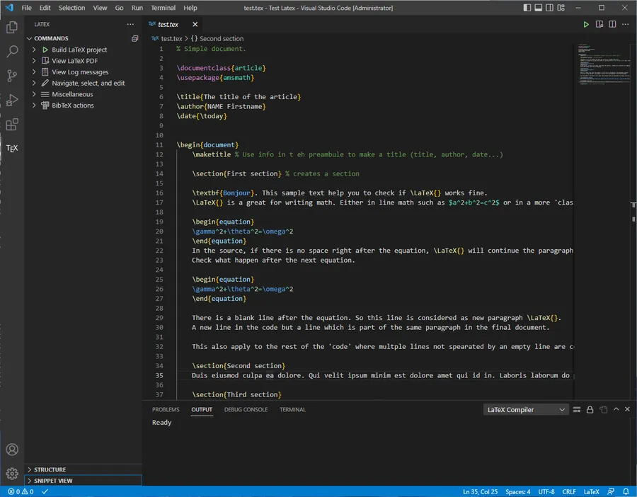
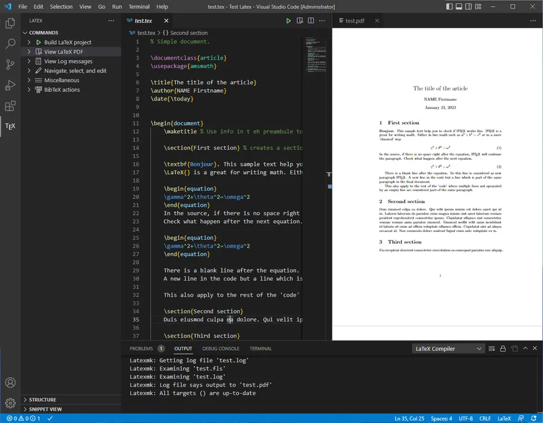
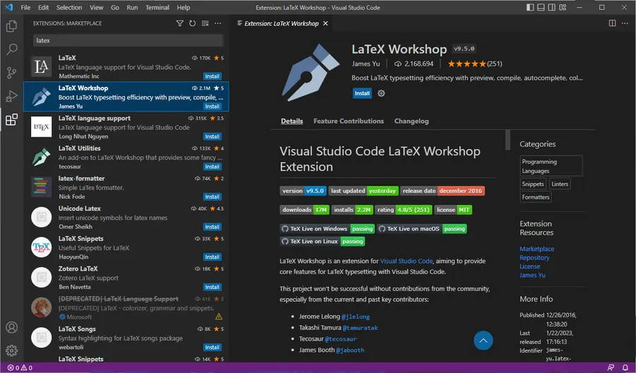
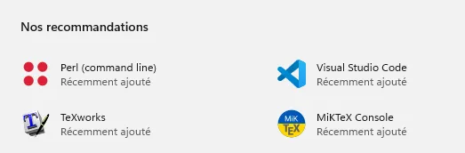
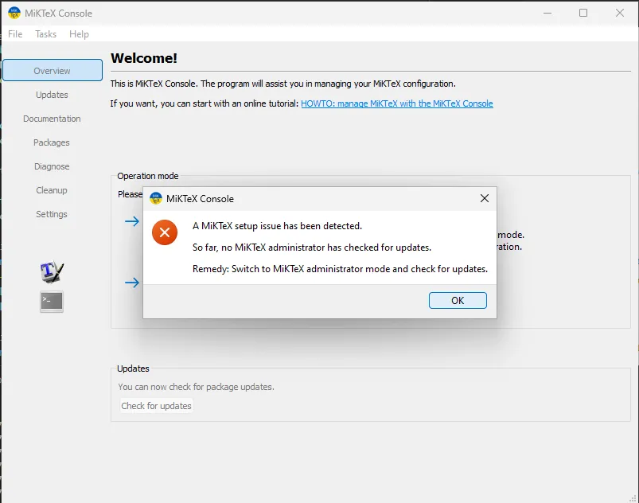
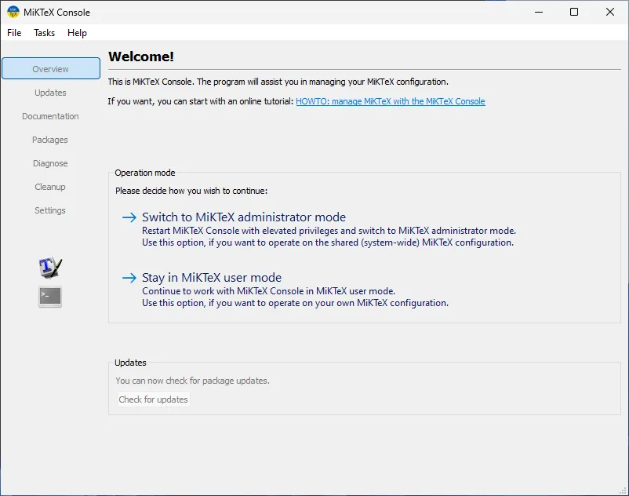

# $$\mathrm{\LaTeX}$$ and VSCode


* **WIN+x, a**
    * This means : Press the window key AND the X key. Then press A
    * It launches an elevated console
* Install [choco](https://community.chocolatey.org/packages) with the line below

```
Set-ExecutionPolicy Bypass -Scope Process -Force; [System.Net.ServicePointManager]::SecurityProtocol = [System.Net.ServicePointManager]::SecurityProtocol -bor 3072; iex ((New-Object System.Net.WebClient).DownloadString('https://community.chocolatey.org/install.ps1'))
```

* Install [MiKTteX](https://miktex.org/) with the line below

```
choco install miktex -y
```

* Install [Perl](https://strawberryperl.com/) (mandatory for MiKTeX)

```
choco install StrawberryPerl -y
```

* Install [VSCode](https://code.visualstudio.com/)

```
choco install vscode -y
```

Close the terminal and open a new one. The new terminal is required because the path has been updated and the new console doesn't have to be elevated.

* Win + X, i

* Installs the $$\mathrm{\LaTeX}$$ Workshop VSCode extension

```
code --install-extension James-Yu.latex-workshop
```

* Create a new directory to hold our test project, create a new .tex file and launch VSCode.

```
cd ~/documents
New-item ./TestLatex -ItemType Directory
cd ./TestLatex
New-item ./test.tex
code .

```

* Open the empty test.tex in the editor
* Copy and paste the sample code at the end of this page
  + The TEX icon should be visible on the left hand side
  + Click on the TEX icon
* Click the 'Build Latex project' option

<div align="center">

</div>


* Then click the 'View Latex PDF' option

<div align="center">

</div>


* Exit VSCode
* Exit the console
* From there, you should be ready for takeoff 😁

## Sample code to copy-paste

```
% Simple document.

\documentclass{article}
\usepackage{amsmath}

\title{The title of the article}
\author{NAME Firstname}
\date{\today}

\begin{document}
    \maketitle % Use info in t eh preambule to make a title (title, author, date...)

    \section{First section} % creates a section

    \textbf{Bonjour}. This sample text help you to check if \LaTeX{} works fine.
    \LaTeX{} is a great for writing math. Either in line math such as $a^2+b^2=c^2$ or in a more 'classical' way.

    \begin{equation}
    \gamma^2+\theta^2=\omega^2
    \end{equation}
    In the source, if there is no space right after the equation, \LaTeX{} will continue the paragraph.
    Check what happen after the next equation.

    \begin{equation}
    \gamma^2+\theta^2=\omega^2
    \end{equation}

    There is a blank line after the equation. So this line is considered as new paragraph \LaTeX{}.
    A new line in the code but a line which is part of the same paragraph in the final document.

    This also apply to the rest of the 'code' where multple lines not spearated by an empty line are considered part of the same paragraph.

    \section{Second section}
    Duis eiusmod culpa ea dolore. Qui velit ipsum minim est dolore amet qui id in. Laboris laborum do pariatur enim magna minim sint amet laborum veniam proident reprehenderit consectetur ipsum. Cupidatat ullamco sint consectetur veniam veniam anim pariatur eiusmod. Eiusmod mollit velit anim incididunt id laboris sit enim ad officia voluptate ullamco officia. Cupidatat sint ad aliqua occaecat id. Non commodo dolore nostrud fugiat enim aute voluptate ex in.

    \section{Third section}
    Eu excepteur deserunt consectetur exercitation ea consequat pariatur esse aliquip.

\end{document}
```


## Optional

### If you prefer to install the $$\mathrm{\LaTeX}$$ Workshop extension once VSCode is on screen,

* CTRL + SHIFT + X to open the Extension pane
* Search for $$\mathrm{\LaTeX}$$
* Select Latex Workshop
* Press the Install button

<div align="center">

</div>

### If you want to update Miktex

* Click on the icon to launch the MiKTeX Console

<div align="center">

</div>


A warning dialog bow will pop-up the very first time

<div align="center">

</div>


* Select the Administrator Mode

* This will restart the console in an elevated mode

* Press the "Check for updates" button at the bottom of the window

<div align="center">

</div>
