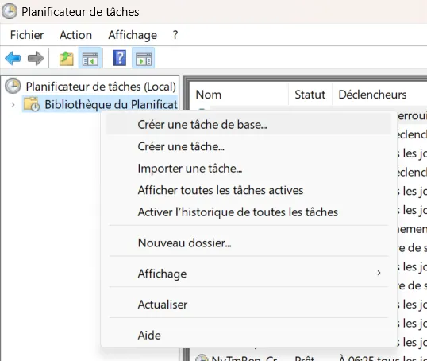
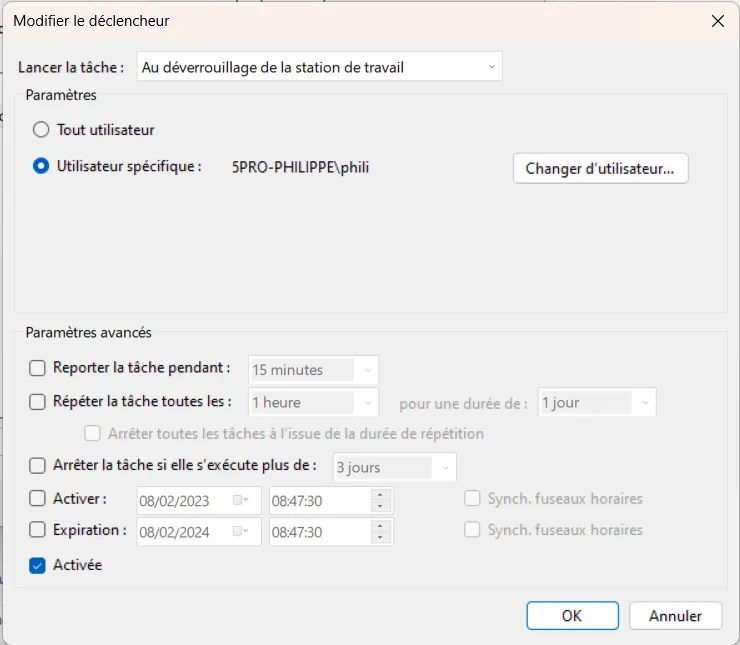

# Exécuter une commande PowerShell au démarrage

## Intro
Je souhaite afficher aléatoirement l'un des "about_*" de la documentation PowerShell à chaque fois que je me logue sur mon PC portable. Comme il a fallu que je cherche un peu voilà ce que j'ai dû faire.

## Recette

* **WIN + R**
* taskschd.msc

<div align="center">

</div>


* Clic droit sur "Bibliothèque du Planificateur de tâches
* Choisir l'option "Créer une tâche..."

<div align="center">

</div>


* Onglet Général
* Il faut donner un nom à la tâche

<div align="center">

</div>


* Onglet Déclencheurs
* Clic sur le bouton nouveau
* Je souhaite que le script se déroule à chaque fois que je déverrouille le PC. C'est l'option que je choisi dans la liste. Je précise aussi l'utilisateur

<div align="center">

</div>


* Onglet Actions
* C'est là que j'ai perdu le plus de temps. Je ne souhaitais pas lancer un script mais juste une commande.
* Je choisi "Lancer un Programme"
* Je retrouve PowerShell sur le disque dur. En cas de soucis, je lance une console PowerShell et j'exécute cette commande. Je peux alors retrouver le chemin vers pwsh.exe.

```powershell
get-process pwsh | ls | Format-List
```
<div align="center">

</div>


* Pour les paramètres, dans une console j'exécute cette commande

```powershell
Get-Help pwsh -ShowWindow
```

* La commande que je souhaite lancer est celle-ci

```powershell
Get-Random -InputObject (Get-Help about*) | Get-Help -ShowWindow
```

* Finalement voilà ce que je saisis dans le champ arguments de la boite de dialogue précédente

```powershell
-Command "& {Get-Random -InputObject (Get-Help about*) | Get-Help -ShowWindow}" -NoExit
```

* Comme je suis sur portable, dans l'onglet Conditions je m'assure que la case de la catégorie Alimentation est décochée.

<div align="center">

</div>


* Je ne crois pas avoir changé quoique ce soit dans l'onglet Paramètres

<div align="center">

</div>


## Next ?
La prochaine étape pourrait être d'automatiser je genre de tâche avec script PowerShell.

