# Anki - Créer et utiliser son premier deck

## Les épisodes de la série

* [L'épisode 1]() pour créer votre premier deck Anki à partir d'un contenu qui est maintenu dans Excel.
* [L'épisode 2]() pour préparer, avec PowerShell, le fichier .csv qu'on va importer dans Anki.
* [L'épisode 3]() pour traiter avec PowerShell les CR et les LF des feuilles Excel qu'on veut envoyer à Anki.

## Introduction

Dans un premier temps on va s'intéresser au cas où j'ai dans Excel une série de questions et de réponses que je souhaite utiliser comme jeu de cartes de révision (flashcard). Dans le second article on verra comment, à partir d'un fichier .xlsx, générer un fichier .csv (comma separated values) consommable par Anki.

Cela dit, un mot pour commencer : **je déteste Anki**.  
Comme ça c'est dit et vous connaissez mon point de vue sur la bête. Il y a malgré tout deux choses qui sont pas mal dans le produit :

1. Le premier truc et c'est pour ça que je n'ai pas écrit mon propre petit gestionnaire de cartes de révision, c'est la possibilité d'avoir ses jeux de cartes (decks) disponibles sur PC, téléphone, Web.
1. Le second et dernier point positif c'est la possibilité de partager des jeux de cartes avec une communauté (il y a des vrais passionnés j'ai l'impression).

Pour le reste, c'est simple, de mon point de vue, Anki c'est que du brin. Par exemple l'interface graphique est antédiluvienne et l'ergonomie est pas mal mais, sur une autre planète, pas sur Terre. Sinon, on peut parler de la usability et du workflow... Heu... Non, il vaut mieux pas qu'on en parle. Par contre, on peut penser que les développeurs ont tellement compliqué la chose que la prise en main est très difficile voire carrément rebutante. Franchement c'est la troisième fois que je reviens à la charge et je ne comprends toujours pas ce que je fais. Parfois, coup de pot, ça tombe en marche. Ce n'est pas normal qu'il soit si difficile de débuter avec un soft qui va afficher des recto verso de cartes de révision. Faut se calmer là!

J'ai l'impression que sous la pression des utilisateurs "avancés" mais aussi parce qu'ils voulaient sortir des nouveautés tous les ans, les développeurs se sont mis à "conceptualiser le concept". Du coup, on en arrive à une usine à gaz ou au code des impôts, à vous de choisir... 

Franchement, je ne suis pas une lumière mais, d'habitude j'arrive à démarrer avec un nouveau logiciel en quelques heures. Là, il a fallu que je lise, que j'aille voir sur YouTube, que je retourne sur Reddit... C'est du délire... Je veux juste afficher des questions et des réponses... Bon, j'arrête là, c'est mauvais pour mon coeur ❤️

## Le contexte

J'ai une feuille Excel avec 5 colonnes dont deux sont des questions et des réponses à propos de PowerShell. Si vous ne savez pas ce qu'est PowerShell c'est bien dommage mais ce n'est pas très grave. La feuille pourrait se réduire à 2 colonnes avec des mots d'Anglais et leur traduction, ce serait pareil.

Voici un exemple de ce que cela donne dans Excel

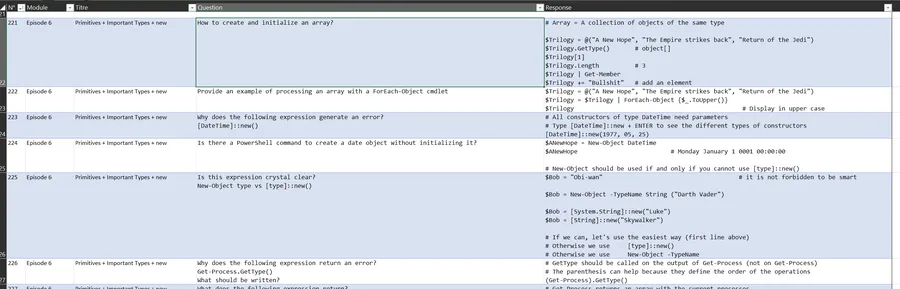

Il faut remarquer que dans mon cas les réponses peuvent être plus ou moins longues. En plus, quand il y a du code dans la réponse, ce dernier est commenté et indenté. C'est pour cela que même sous Excel j'utilise une police à chasse fixe de type Consolas et que tout est aligné à gauche.

Pour simplifier, on imagine aussi que cette feuille est correctement sauvegardée au format .csv et qu'elle peut être ingurgitée par Anki l'abruti. En fait, dans mon cas, la génération du fichier .csv n'est pas simple du tout et cela fait justement l'objet du second article.

Dernière remarque. À contrario de l'étude d'une langue, je n'ai même pas besoin que Anki l'ahuri me propose la réponse pour que je lui donne la question. Non, ce dont j'ai besoin, c'est du basique de chez basique. Il affiche les questions et moi je vois si mes réponses collent à ce qui est attendu.

Bon ben voilà, un .csv, 2 colonnes Q & A à utiliser dans le sens Q vers A... Y a plus qu'à !

## La méthodologie

Au début j'étais jeune et innocent. J'ai pris une feuille Excel, j'ai fait File/Import. Tout est rentré mais rien n'allait. J'avais les réponses au lieu des questions, la police n'allait pas... J'ai même modifié le template par défaut etc. Un vrai massacre.

Dans ce qui va suivre tout va se passer comme si c'était le bonheur... Mais non, ne soyez pas candides. Ça s'est fait dans les larmes et dans le sang, le try and error, le jet de PC par la fenêtre et l'éradication d'un nombre incalculable de cartes et de decks, difformes, malades, impropres à la consommation. Je ne suis pas fier de ces massacres de masse mais je ne suis pas le seul coupable. Anki le honni m'a bien aidé. Bref...

### Compte tenu de mes besoins 

1. On va faire un modèle de carte
1. Ensuite on va créer un deck qui utilisera par défaut, le modèle de carte en question
1. Enfin on fera un import du fichier .csv

## Faire un modèle de carte

Je passe les détails. Je suppose que l'application Anki le maudit est installée et qu'elle est à l'écran (j'utilise une interface en Anglais)

On clique sur ``Browse``

Dans la fenêtre qui s'ouvre, clic droit sur ``Note Types`` pour choisir ``Manage...``

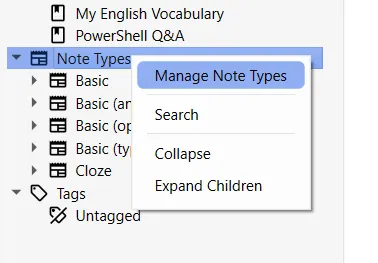

Basic est sélectionné par défaut. Clic sur ``Add`` pour ajouter notre type de carte.

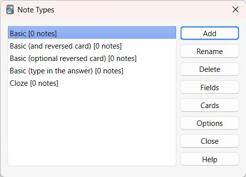

Pas clair du tout la fenêtre d'après. Au pif je laisse ``Add:Basic`` et je clique sur ``OK``.

Je donne un nom à mon modèle

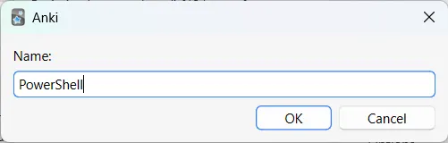

De retour dans la liste, je vois mon modèle. Je le sélectionne et je clique sur ``Fields``

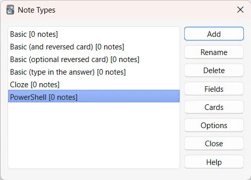

Je renomme les deux côtés des cartes. Ensuite on sauve et on revient à la liste

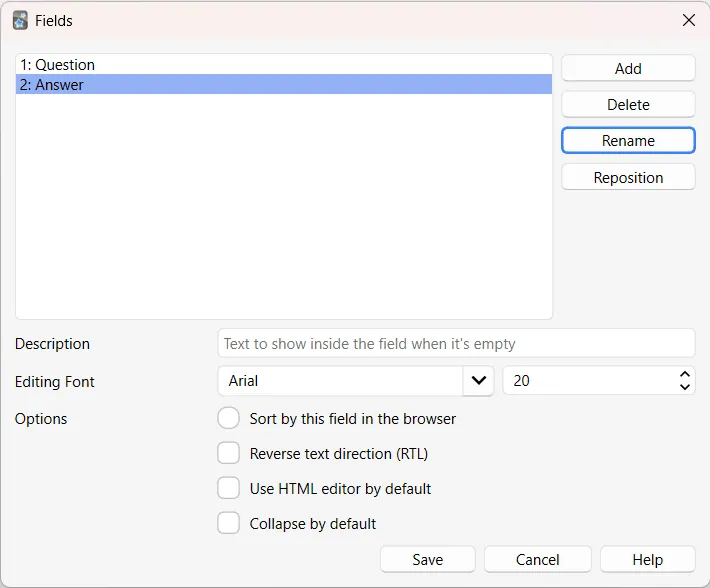

Là, il faut cliquer sur ``Cards``

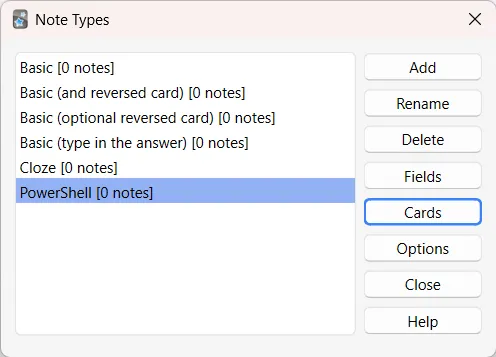

Sur la fenêtre qui arrive on a une espèce de ``Preview``. En revanche, ce qu'il y a de bien c'est quand on clique sur le bouton radio ``Styling``.

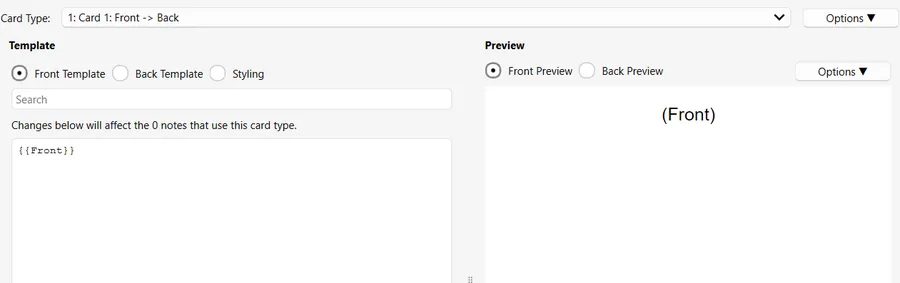

Là on voit ça et ça c'est bon signe car on va pouvoir jouer sur les paramètres CSS pour afficher le texte des questions et des réponses. Ci-dessous le CSS que j'ai tapé. Rien de très compliqué, on retrouve la police à chasse fixe dont j'ai besoin (Consolas), la taille (je la fait passer de 20 à 11 au pif, on verra) et l'alignement. Même sans être programmeur full-stack ça reste relativement gérable. 😊

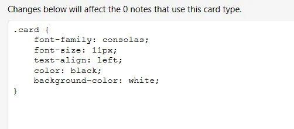

On appuie sur ``Save`` puis on appuie sur ``Close`` et enfin on ferme le ``Browser``.

## Faire un test

De retour sur la fenêtre de départ il n'y a toujours pas de deck. On en crée un en appuyant sur le joli 🥴 bouton ``Create Deck``

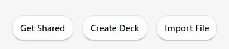

On lui donne un petit nom

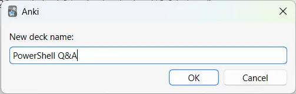

Il apparaît alors dans la liste des decks sur la fenêtre d'accueil

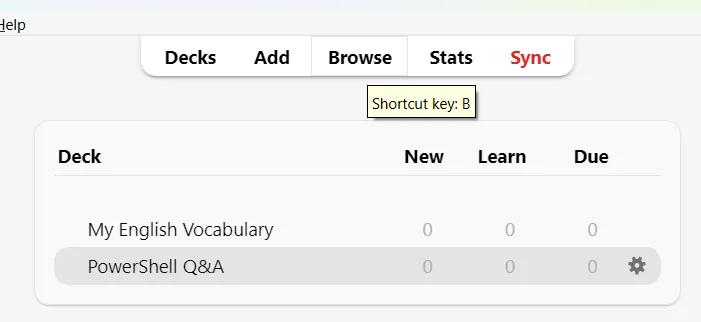

On clique alors sur le beau bouton ``Add`` du bandeau en haut de la fenêtre.

Pour les 2 cartes on fait au plus simple. Voilà par exemple ce que j'ai mis pour la première :

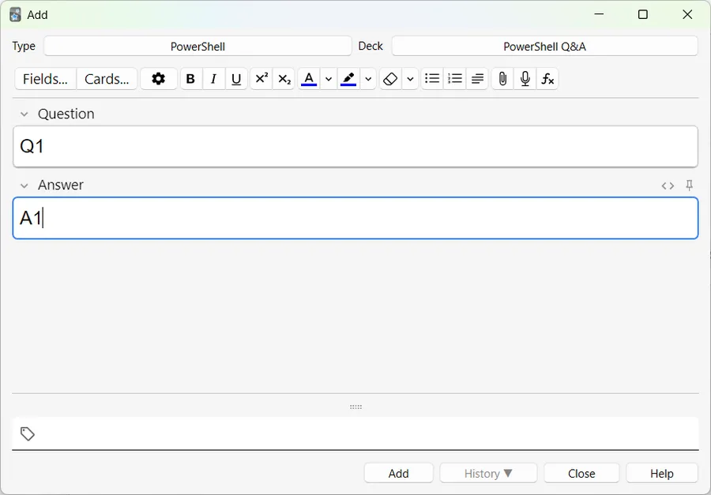

De retour sur la fenêtre d'accueil on peut cliquer sur le nom du deck puis sur le très sexy ``Study Now``.

Les questions arrivent avant les réponses, c'est aligné et à chasse fixe. Ça semble ``OK``. Allez, on arrête et on retourne à la fenêtre d'accueil.

### Supprimer les 2 cartes

Il faut cliquer sur ``Browse`` dans le bandeau.

À gauche, dans la section Decks il faut cliquer sur ``PowerShell Q&A``

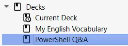

Les 2 cartes sont alors visibles dans la colonne du milieu. Je propose, sans être sûr à 100% que ce soit la meilleure façon de faire, de :

* Cliquer sur l'une d'elle
* **CTRL + A** pour les sélectionner toutes les deux
* **CTRL + SUPPR** pour les supprimer

On ferme le Browser et on revient à l'accueil.

## Importation des cartes depuis un fichier .csv

Il faut aller dans le menu ``File`` puis choisir l'option ``Import``

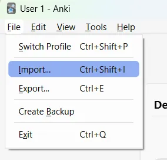

Après, bien sûr il faut choisir le fichier

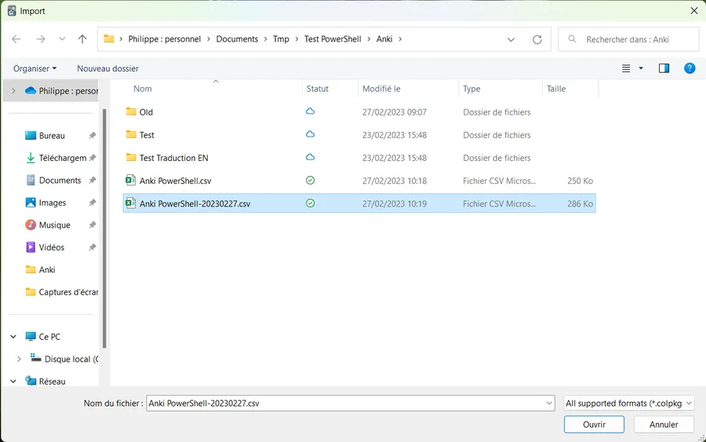

Ensuite arrive la boîte de configuration de l'importation

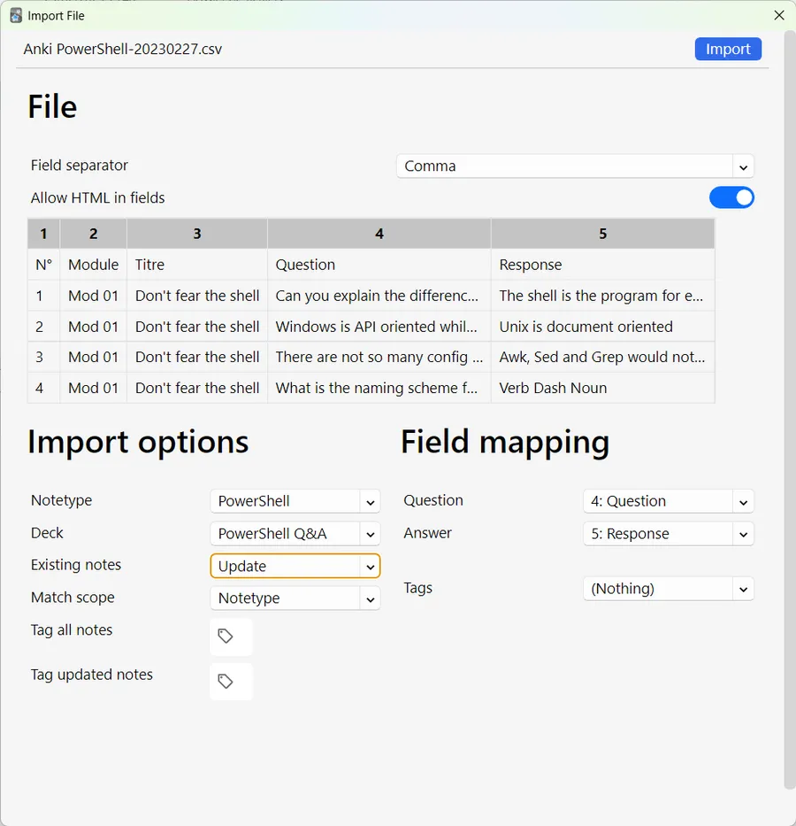

Il faut

* Indiquer qu'on va utiliser le modèle PowerShell comme type de note
* Indiquer que le deck de destination c'est bien PowerShell Q&A
* Choisir le field separator qui permet d'avoir un affichage correct. Il faut juste se rappeler qu'un fichier .csv peut utiliser autre chose que la virgule comme séparateur de champs. En France on utilise beaucoup le point-virgule par exemple (car nos nombres sont à virgule)
* En ce qui me concerne je mets à 1 le switch "Allow HTML in fields" car je sais que le texte des questions et des réponses de la feuille Excel en contient
* Normalement avec ce que l'on a fait les questions et les réponses devraient être dans le bon sens. Donc j'aligne les champs ``Question`` et ``Answer`` sur les colonnes ``Question`` et ``Response`` de la feuille Excel
* Enfin, je n'ai pas de tag donc je mets ``Nothing``. Il ne faut pas oublier de le faire. Ce n'est pas si innocent que ça je crois.

Quand tout semble correct il faut cliquer sur le bouton ``Import`` (tout en haut à droite). On a alors un récapitulatif de l'opération. Je clique sur ``Close``.

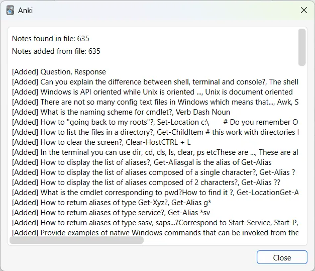

De retour sur la page d'accueil on peut cliquer sur le deck ``PowerShell`` puis sur le bouton ``Study Now``

Je vois tout de suite que la police est trop petite. Ci-dessous un exemple :

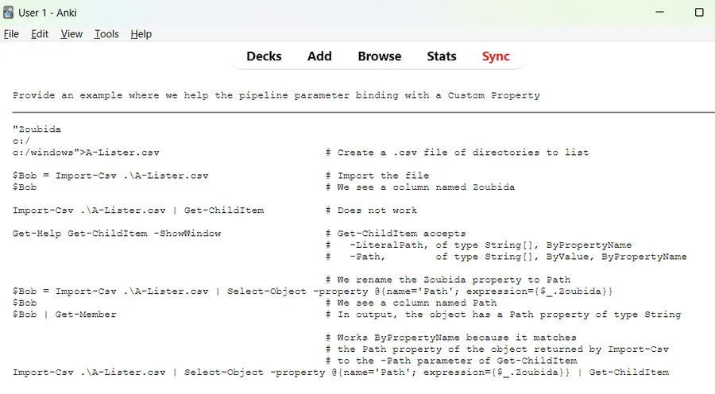

Je retourne dans ``Styling`` et je fais passer la taille de 11 à 14 pixels

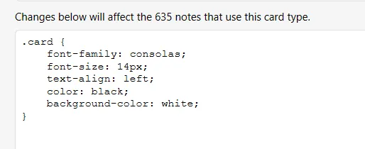

Dorénavant ça ressemble plus à ce que je souhaite.

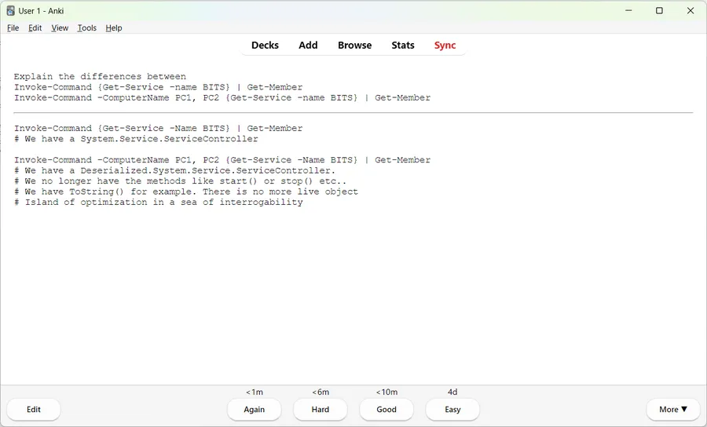

## Faire en sorte que les cartes arrivent au hazard

{: .warning }
Avant de faire quoique ce soit, lisez bien jusqu'au bout de ce paragraphe.

Là, franchement je ne suis pas sûr du tout de mon coup... Je sais, ça rassure et ça donne envie de lire la suite. Bon allez, à l'accueil, clic droit sur la roue crantée du deck qui m'intéresse et je choisis ``Options``.

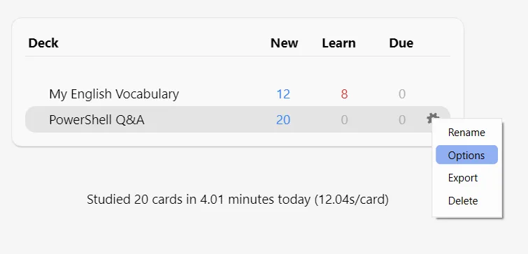

Là, je vais dans la section ``New Cards`` et je clique sur ``Random``. Ça a l'air de tomber en marche. En effet, lorsque je révise les cartes ces dernière arrivent désormais dans le désordre. En revanche, ce qui ne me va pas du tout c'est que cela n'a pas l'air spécifique au deck PowerShell Q&A. J'ai l'impression que ça touche tous les decks basés sur Default (voir ce qui est écrit en haut de la fenêtre). 

Bien sûr, quand je clique sur la liste déroulante rien ne déroule. Du brin ce soft je te dis, du brin.

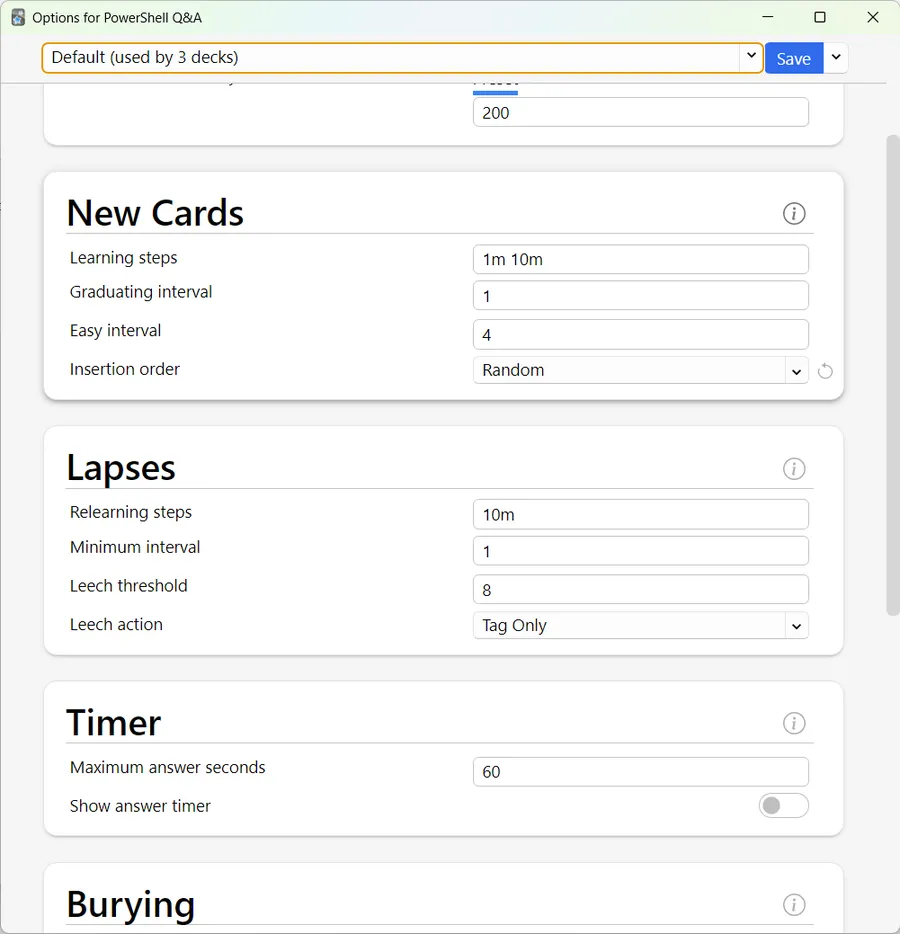

Je vais faire avec mais je ne comprends pas ce qui se passe et ça me fait vraiment suer.

### Update du 28/02

Alors... En fait, il faut cliquer sur la liste déroulante tout à droite. Là on peut choisir ``Add Preset``, lui donner un nom (PowerShell dans mon cas) puis ajuster les "Preset" qui seront utilisé par ce deck. On pourrait par ce biais, créer un Preset nommé "Momo" que l'on déciderait d'appliquer à tous ses decks par exemple.

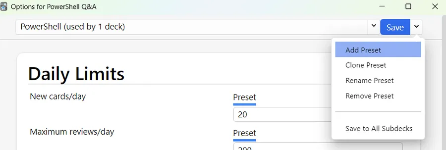

## Ajouter une description au deck

Depuis l'accueil, il faut cliquer sur le deck puis sur le bouton description

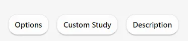

Là, il ne reste plus qu'à décrire au mieux le deck. Cela peut être utile si un jour on souhaite le partager. J'ai fait des essais et j'ai eu de soucis. Enfin bref, c'est à la hauteur du reste...

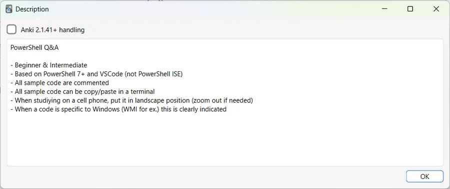

Du coup, la fenêtre du deck ressemble à ça dorénavant

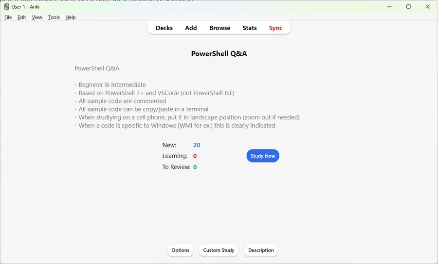

## Synchroniser le deck

Sur la page d'accueil il suffit d'appuyer sur le bouton ``Sync`` (sont malins ces développeurs...) mais il faut un compte sur [AnkiWeb](https://ankiweb.net/account/login). Quand c'est fait c'est pas mal et ça marche plutôt bien. Quand dans Anki le banni y a des choses bien, moi je dis qu'il faut le dire...

Une fois que la synchro fonctionne, il ne reste plus qu'à installer AnkiDroid et zou on retrouve nos decks sur téléphone. Ça c'est cool. Ben tu vois Anki l'incompris... Quand tu veux tu peux... Si ça se trouve cette partie a été développée par un stagiaire qui depuis est parti... Misère de misère... 

Si un jour il y a un problème de synchronisation une fenêtre de ce type arrivera. En ce qui me concerne je me refuse à éditer les cartes avec l'application Anki l'avili car je n'ai pas trouvé le moyen de les ré-exporter en .csv. Bref, ma source est unique et c'est Excel. Je ne fais qu'alimenter/mettre à jour les decks via des importations. Donc, en ce qui me concerne, je choisi toujours "Upload to AnkiWeb".

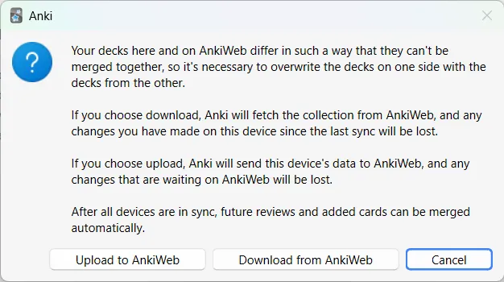

En fait, c'est même mieux que ça. Si un jour il y a un très gros souci, je peux supprimer tous les decks, les réimporter et me retrouver avec une configuration toute propre. En revanche ceux qui auront passé des heures à travailler sur leurs cartes avec Anki, si un jour il y a un accident, n'ayant plus les données source en mains, ils risquent de ne se retrouver qu'avec les yeux pour pleurer (oui, oui, j'ai vu qu'il y avait une option pour faire un backup mais bon je ne crois pas qu'il soit programmable et je n'ai pas compris ce qu'il faisait vraiment).

C'est, je crois, une question vraiment importante. Il faut y réfléchir sérieusement avant de penser à éditer et à maintenir un deck de cartes avec Anki le flétri

## Conclusion
*TO DO : à faire*

* Il était temps que ça se termine. Je commençais à manquer de qualificatifs en i 😁
* Question non résolue : Pas de mise à jour de la description sur AnkiWeb même après une synchro ?

