Abruti
Ahuri
Honni
Maudit
Banni
Incompris
Avili
Flétri

Pourri
Perverti
Malappris
Petit 

Salami 
Mal servi
Démuni


# Anki - PowerShell pour importer un .csv

<div align="center">

</div>

## Les épisodes de la série

* [L'épisode 1]() pour créer votre premier deck Anki à partir d'un contenu qui est maintenu dans Excel.
* [L'épisode 2]() pour préparer, avec PowerShell, le fichier .csv qu'on va importer dans Anki.
* [L'épisode 3]() pour traiter avec PowerShell les CR et les LF des feuilles Excel qu'on veut envoyer à Anki.


## Introduction

Je travaille sur un deck Anki conçu pour réviser le langage de scripting PowerShell. PowerShell est bien plus qu'un langage mais on s'en fiche ici. Lors de l'importation dans Anki, j'ai rencontré plusieurs problèmes d'édition. Dans ce document, j'explique comment j'ai résolu ces difficultés grâce à un script PowerShell. Les solutions présentées ici peuvent probablement être adaptées à d'autres outils similaires. La source unique des questions et réponses est un fichier Excel. Typiquement, je n'édite jamais une carte directement dans Anki. Tout est géré dans Excel, et idéalement, les mises à jour du deck consistent uniquement à importer de nouvelles cartes ou à mettre à jour celles qui ont été corrigées.

Ci-dessous un extrait caractéristique de ce que j'ai sous Excel

<div align="center">
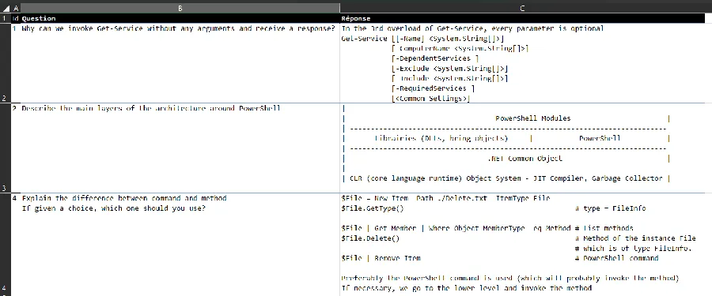
</div>


Je ne connais pas les us et coutumes sous Anki donc ça peut paraître bizarre mais c'est vraiment ce que je souhaite retrouver sur le recto et le verso des cartes de mon deck. 

Plusieurs remarques

* PowerShell étant, entre autres, un langage de script, certaines réponses comprennent du code sur plusieurs lignes. Les cellules Excel sont donc pleines de caractères cachés du type CR (carriage return, retour chariot) et LF (line feed, retour à la ligne) (aka \r et \n ou encore 0x0D et 0x0A ou enfin 13 et 10).
* La police de caractères doit être à chasse fixe (Consolas typiquement) ce qui permet de jouer sur les alignements (voir la ligne 2 ci-dessus par exemple) et faire un peu de "mise en page".
* Le texte doit être aligné à gauche on doit pouvoir l'indenter (voir les lignes 2 ou 3 ci-dessus).


## Faisons un premier test

On va importer l'extrait de feuille précédente tel quel. Pour cela je commence à la sauvegarder au format .csv.

<div align="center">
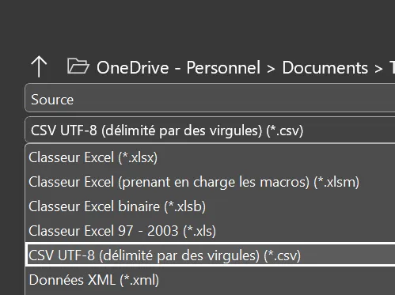
</div>


Du côté de Anki j'ai créé un deck de type basic que j'ai nommé Test. Voilà les paramètres d'importation du fichier .csv que je viens de sauver :

<div align="center">
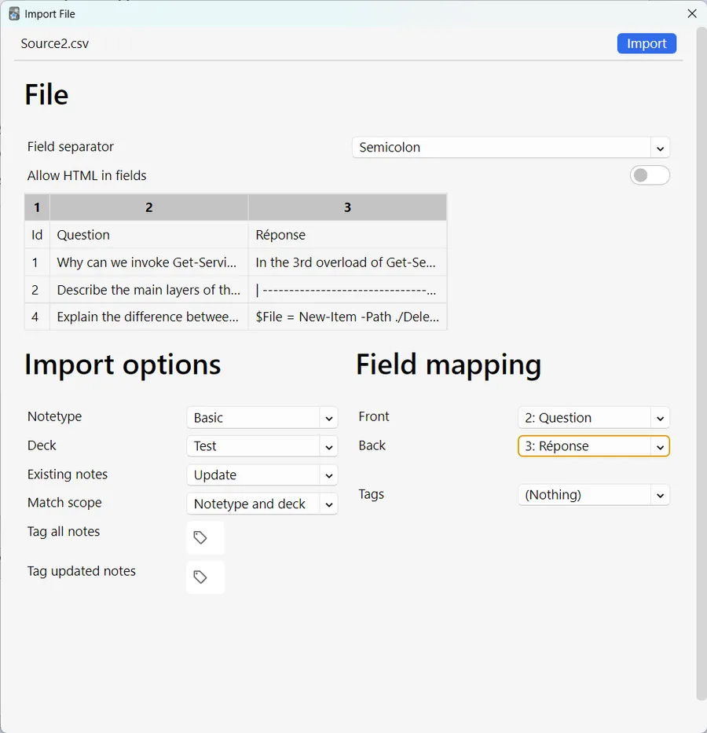
</div>


Enfin voici ce que cela donne dans Anki :

<div align="center">
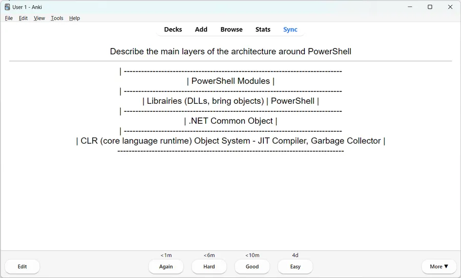
</div>


Le texte est centré mais ce n'est pas le plus grave. On voit tout de suite que même si on aligne à gauche, on va perdre la "mise en page" (les alignements). On peut avoir une idée de ce qui va se passer si on va dans le Browser et qu'on retrouve la carte en question.

<div align="center">
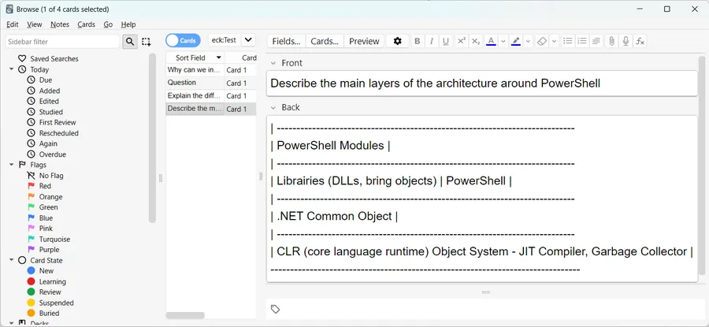
</div>


Il y a 2 problèmes à résoudre :

* Aligner le texte à gauche
* Utiliser une police à chasse fixe

Pour appliquer ces corrections (et les suivantes si besoin) on va créer notre propre Type de Note. Pour ça, dans le ``Browser`` je fais un clic droit sur ``Note Type`` et je choisi ``Manage Note Types``

<div align="center">
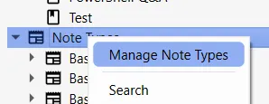
</div>


``Basic`` est sélectionné, j'appuie sur ``Add``

<div align="center">
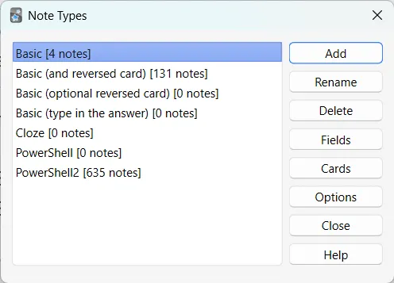
</div>


Je choisis ``Clone: Basic`` un peu au hasard.

<div align="center">
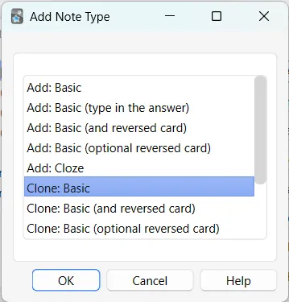
</div>


Je donne un nom à mon type de note

<div align="center">
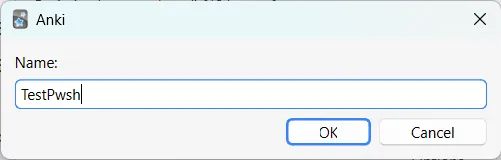
</div>

<div align="center">
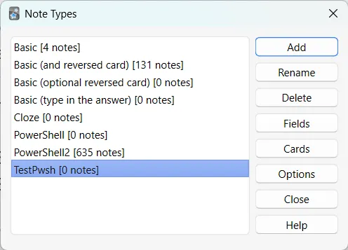
</div>


Ensuite je modifie le contenu de ``Styling`` comme ci-dessous :

<div align="center">
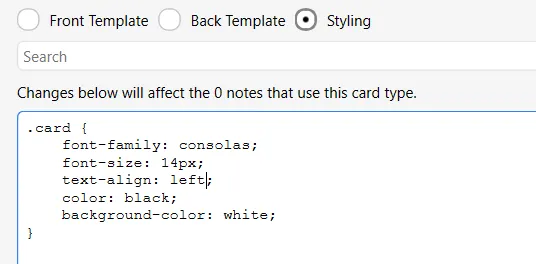
</div>


Je supprime les cartes du deck de test et je refais une importation pour voir comment ça se passe. Je prends bien soin de mettre exactement les mêmes paramètres d'importation. C'est mieux, mais ce n'est pas encore ça. Voici par exemple le rendu de la question 2.

<div align="center">
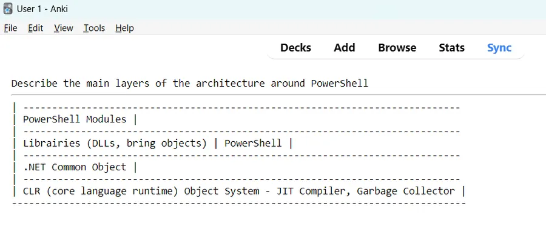
</div>


En fait, on l'a vu quand on a modifié le code CSS de la section ``Styling``, le rendu est de type HTML. Une fois qu'on a ça en tête, il faut se rappeler alors qu'en HTML, par défaut, on ignore les espaces dupliqués et on en garde qu'un seul à chaque fois. C'est exactement ce qui arrive dans le rendu précédent. Pour forcer HTML à ne pas supprimer ces espaces il existe une balise `<pre> </pre>` qu'on peut utiliser.


## Importation avec du code HTML

Faisons un test et modifions une seule cellule, la réponse 2, de cette façon :

<div align="center">
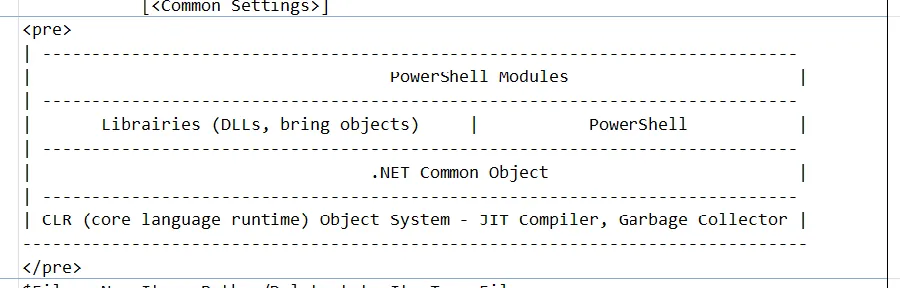
</div>


Je passe les détails et je refais un import en prenant bien soin de préciser cette fois-ci que mon fichier .csv contient du code HTML. Voir ci-dessous le switch "Allow HTML in fields" qui est dorénavant à un :

<div align="center">
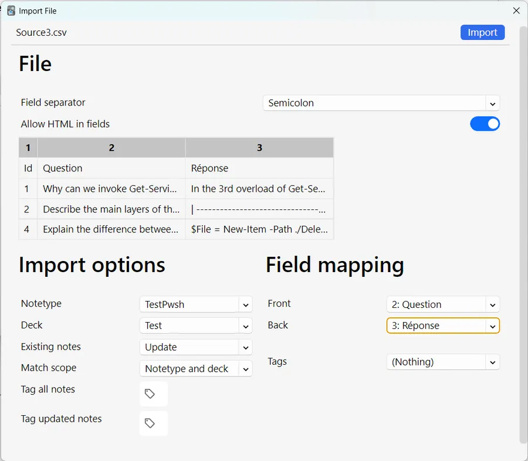
</div>


Nous avons fait un grand pas en avant. Voilà à quoi ressemble la seconde carte dorénavant :

<div align="center">
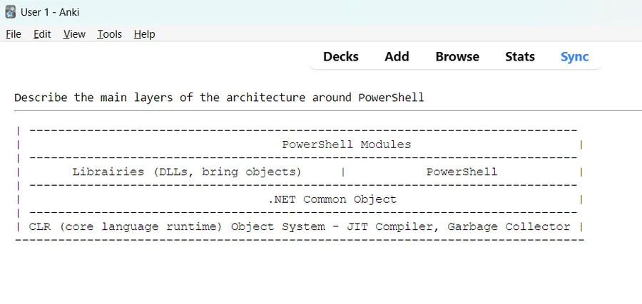
</div>


Bon ben voilà, il n'y avait pas besoin d'en faire tout un fromage. Allez, on applique à la main pour l'instant les balises `<pre>` et `</pre>` dans toutes les réponses (pas de besoin de s'occuper des questions, on fait juste quelques tests), on refait un import et on vérifie soigneusement.

Alleluia! Nous sommes des Dieux, on a tous compris... Heu, capitaine, mon capitaine... Il n'y aurait pas un petit problème avec la première réponse ?

Ci-dessous, dans le fond il y a l'original, la feuille Excel et au premier plan Anki. C'est un peu le jeu des 7 erreurs mais si on regarde la seconde ligne, on voit qu'il n'y a plus rien après [-Name]. Il y a un grand vide jusqu'au dernier crochet fermant. En fait il nous manque `<System.String[]>`. C'est peut-être rien pour vous, mais pour moi ça veut dire beaucoup🎶.

<div align="center">
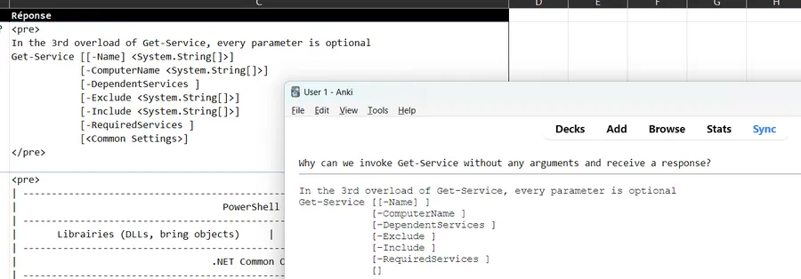
</div>


Pour faire simple... En HTML il existe une autre balise `<code>` et `</code>` qui semblait être une bonne candidate pour résoudre le problème mais non ça ne marche pas (j'ai fait les tests).

En fait, on n'a pas d'autre solution que de remplacer "`<`" par "`&lt;`" et "`>`" par "`&gt;`". Faisons un test sur le premier couple de "<" et de ">" de la réponse 1. Voilà ce que cela donne dans Excel :

<div align="center">
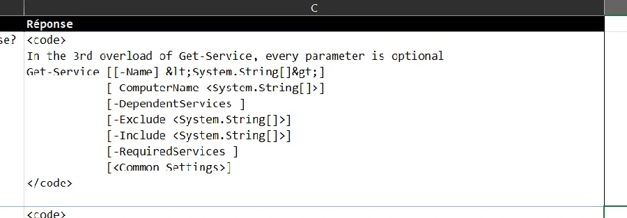
</div>


Voilà ce que cela donne dorénavant

<div align="center">
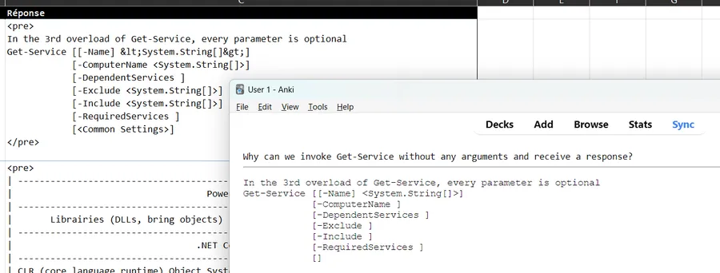
</div>


On retrouve bien ce que l'on souhaite après `-Name` alors qu'on n'a toujours rien après `-ComputerName`. Je pense que nous ne sommes pas loin de toucher but...👍


## À propos de mon workflow

On a fait des tests, je pense qu'on a compris le problème. Maintenant, je ne vais pas m'amuser à corriger ma feuille Excel à la main. J'ai à ce jour environ 650 questions et réponses. Des modifications à la mains sur autant de chaines ça va être générateur d'erreurs etc. 

Non, non, non. Ce que je veux c'est continuer à éditer ma feuille Excel comme d'habitude mais d'écrire "une moulinette" (un script, une routine) qui, à ma demande, transformera ma source .csv et un fichier correctement formaté pour Anki. 

L'avantage que j'y trouve c'est que l'automatisation va éviter les erreurs mais que surtout, les activités de rédaction et de préparation pour Anki sont complètement décorrélées. Si je veux, demain je peux partager ma feuille Excel. Le récipiendaire ne saura pas que c'est aussi un document source qui permet d'alimenter un deck Anki.

Donc le workflow est le suivant :

* J'édite les questions et les réponses dans Excel dans un fichier .xlsx
* J'utilise une police à chasse fixe, je fais ma "mise en page" etc.
* Quand j'estime que c'est bon, je génère un fichier .csv à partir d'Excel
* Une routine prend en entrée le fichier .csv généré
  + Elle applique les modifications nécessaires
  + Elle sauvegarde sous un nouveau noms le fichier modifié
* Je mets à jour (ou carrément je crée un nouveau) le jeu de cartes en important le .csv issu du script

Je fonctionne comme ça depuis un petit moment et "so far so good".


## Quel outil pour écrire la routine d'automatisation ?

Étant dans Excel j'aurai pu choisir d'écrire une macro en VBA. J'en ai déjà fait pas mal. Je suis toujours bluffé par ce qu'on arrive à faire faire à VBA. Par exemple j'aurai pu ajouter une macro au fichier où se trouve les questions et les réponses. J'aurai pu aussi dédier une feuille Excel dans laquelle il n'y aurait eu que la macro en question.

Finalement, j'ai choisi d'écrire un script PowerShell. Ce qui m'a motivé c'est que je suis en train de découvrir PowerShell justement.


## Code du script

Le script doit :

* Ouvrir le fichier .csv
* Pour toutes les lignes
  + Remplacer ">" et "<" dans la question
  + Remplacer ">" et "<" dans la réponse
  + Ajouter `<pre>` au début et `</pre>` à la fin du texte de la question. Ça doit être fait APRES les deux étapes précédentes car on ajoute des "<" et des ">".
  + Ajouter `<pre>` au début et `</pre>` à la fin du texte de la réponse
* Sauvegarder le fichier .csv sous un nouveau nom
* Faudra sans doute un peu d'accastillage pour solidifier le code

Ci-dessous le code du script. Les experts y trouveront sans doute à redire mais bon, je débute. J'ai essayé de mettre des commentaires. On commence par vérifier l'existence du fichier à traiter (`Test-Path`) et de son extension (`$FileInfo.Extension`). Ensuite on prépare le nom de la copie (on rajoute la date). La partie intéressante se trouve après la ligne `Import-Csv`. Le code est très lisible car PowerShell manipule des objets ce qui nous permet d'écrire des choses du style `$Ligne.Question -replace "<", "&lt;"`

```powershell
function Format-CsvForAnki {
 [cmdletbinding()]
  param(
    [Parameter(Mandatory=$True)]
    [string] $Path                                               # Chemin au fichier .csv à convertir
  )

  if(Test-Path $Path){                                           # Vérifie l'existence du fichier

    $FileInfo = Get-ChildItem $Path
    if($FileInfo.Extension -ne '.csv'){                          # Vérifie l'extension csv
      Write-Warning "Le fichier doit avoir une extension .csv."
      return
    }

    # $FullName contient le chemin complet, même si on a passé un chemin relatif au départ
    $FullName = $FileInfo.FullName

    # Conception du nouveau nom du fichier .csv
    $NewName = $FileInfo.FullName
    $NewName = $NewName.Substring(0,$NewName.LastIndexOf("."))
    $NewName = $NewName + (Get-Date -Format "-yyyyMMdd") + ".csv"
    $fichier = Import-Csv -Path $FullName -Delimiter ';'
    Foreach($Ligne in $fichier){
      $Ligne.Question = $Ligne.Question -replace "<", "&lt;"
      $Ligne.Question = $Ligne.Question -replace ">", "&gt;"
      $Ligne.Response = $Ligne.Response -replace "<", "&lt;"
      $Ligne.Response = $Ligne.Response -replace ">", "&gt"
      $Ligne.Question = "<pre>" + $Ligne.Question + "</pre>"
      $Ligne.Response  = "<pre>" + $Ligne.Response  + "</pre>"
    }
    $fichier | Export-Csv -Path $NewName -Encoding UTF8          # Sauve avec des virgules
  }else{
    Write-Warning "Le fichier n'existe pas."
    return
  }
}
Format-CsvForAnki -Path "./Anki PowerShell.csv"
```

Janvier 2025 : Je n'utilise plus WP. La phrase ci-dessous n'a plus lieu d'être.

~~Je suis confronté à un souci. Ce que vous voyez à l'écran n'est PAS ce qui est dans le code source. Je me bats avec cette saloperie d'éditeur de Wordpress mais bon, impossible de lui faire afficher ce que je veux. Normalement vous devriez lire ce qu'il y a ci-dessous. Si pour une raison ou une autre vous faisiez un copier-coller du code pensez-y :~~

<div align="center">
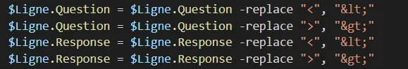
</div>


Un dernier commentaire :

* Tout en bas du code il y a un appel avec la fonction Format-CsvForAnki à qui on passe un nom de fichier en dur.

```powershell
Format-CsvForAnki -Path "./Anki PowerShell.csv"
```

* C'est juste pour des raisons pratiques. En fait j'appelle **toujours** ``Anki PowerShell.csv`` le fichier issu de Excel. Ensuite, dans un terminal, si mon script s'appelle ``Anki5.ps1`` et si il est à côté du fichier ``.csv``, j'ai juste à taper `./Anki5.ps1` (au lieu de taper `./Anki5.ps1 -Path "./Anki PowerShell.csv"` ) et c'est terminé. Il traite le fichier Anki PowerShell.csv et génère le fichier ``Anki PowerShell-20230301.csv`` (c'est ce dernier que je vais importer dans Anki). Voir ci-dessous :

<div align="center">
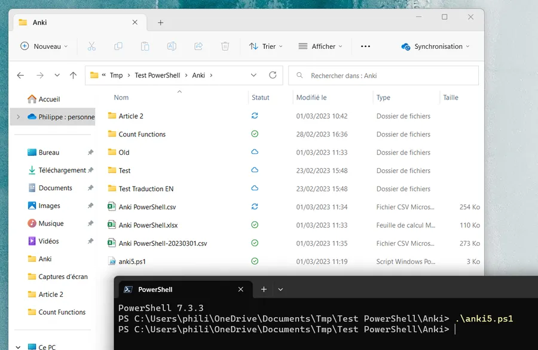
</div>

## Conclusion

Je ne suis toujours pas un grand fan de Anki (à ce propos voir le premier billet) mais bon, à l'aide de l'excellent PowerShell j'arrive à mes fins. J'espère que cette page pourra donner des idées à certains et les mettre sur une piste vers la solution de leur problème.

*Allez, la suite au prochain épisode...*

