# Anki - PowerShell pour traiter CR et LF

<div align="center">

</div>


## Les épisodes de la série

* [L'épisode 1]() pour créer votre premier deck Anki à partir d'un contenu qui est maintenu dans Excel.
* [L'épisode 2]() pour préparer, avec PowerShell, le fichier .csv qu'on va importer dans Anki.
* [L'épisode 3]() pour traiter avec PowerShell les CR et les LF des feuilles Excel qu'on veut envoyer à Anki.


## Introduction

C'est je pense le troisième et dernier billet que je fais à propos de Anki et de mes soucis. Il n'était pas prévu au départ mais j'ai cru comprendre que pas mal de personnes étaient en galère avec ça. Du coup je propose une solution à base de script PowerShell qui fonctionne. 


## À propos des retours chariot et retours à la ligne (CR LF)

On va partir de la feuille Excel suivante qu'on va appeler Data.xlsx. Elle comporte 2 cartes dont le contenu est sur plusieurs lignes.

<div align="center">
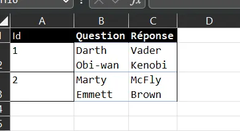
</div>


Depuis Excel je fais une copie du fichier au format .csv (Data.csv)

<div align="center">
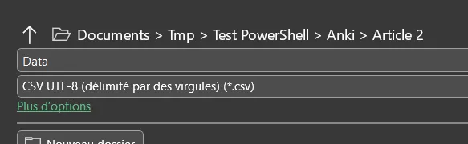
</div>


Ensuite j'ouvre le fichier .csv avec Notepad. Voilà ce que l'on peut voir :

<div align="center">
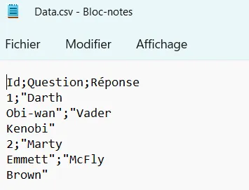
</div>


Plusieurs choses à remarquer :

* Ce ne sont pas des virgules qui séparent nos valeurs mais des points-virgules. En effet, on est en France et nos nombres utilisent la virgule. Du coup Excel utilise des points-virgules pour éviter de confondre le séparateur de colonne du point décimal.
* Excel rajoute des guillemets pour encadrer les chaines de caractères qui sont sur plusieurs lignes. Voir "Darth..." et "Vader..." par exemple.
* Les caractères CR et LF sont bien conservés car les éléments qui étaient sur 2 lignes dans Excel le sont toujours dans Notepad. Malheureusement ce dernier ne permet pas de les révéler.

Tout n'est pas perdu, on peut encore appeler un ami en la personne de [NotePad++](https://notepad-plus-plus.org/downloads/) (télécharger la dernière version, en version portable, si besoin). Là, pour le coup, on peut faire ressortir les caractères cachés CR et LF.

<div align="center">
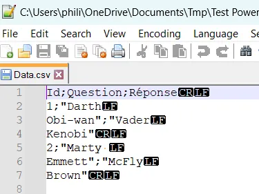
</div>


Il faut noter

* Qu'au bout de la première ligne on a un CR et un LF
* Alors qu'au bout de la seconde on a qu'un LF.

## Qu'est-ce qui se passe si on importe ce fichier ?

Dans Anki je crée un deck que j'appelle TestCRLF et j'utilise les paramètres d'importation ci-dessous :

<div align="center">
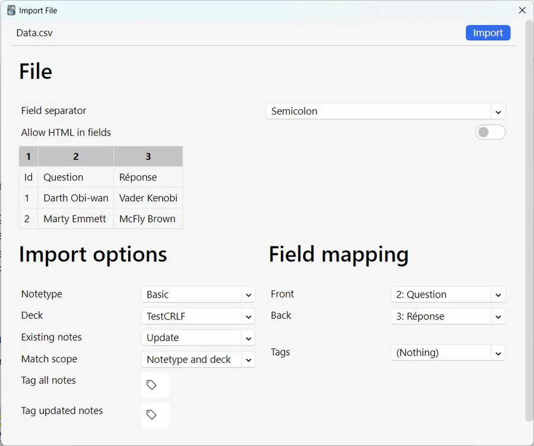
</div>


Ça marche. Ce n'est pas encore tout à fait comme on veut mais, au moins, les questions et les réponses multilignes sont respectées.

<div align="center">
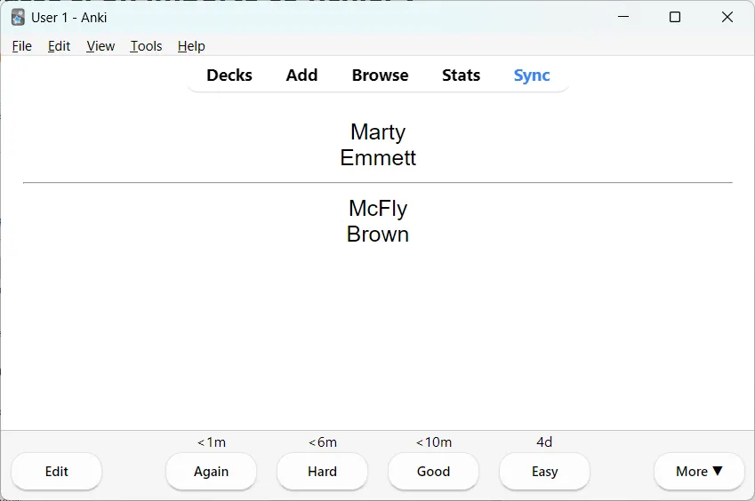
</div>


Pour corriger le tir, dans Anki je crée un Type de Note que je nomme CRLF et je modifie son Styling comme ci-dessous. Si vous ne savez pas comment faire, lisez le premier billet de cette série où tout y est expliqué avec force détail :

<div align="center">
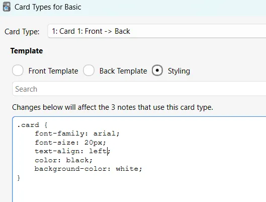
</div>


Pour être sûr de mon coup, je supprime les cartes du deck et je refais une importation. Voilà ce que je vois alors :

<div align="center">
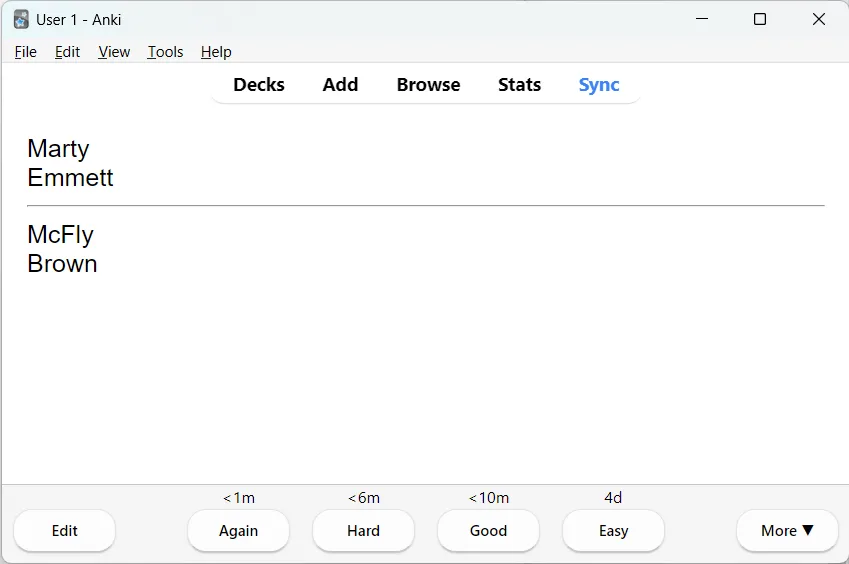
</div>


Bon, ben voilà, une affaire pliée, on rentre chez nous, apéro et Curly pour tout le monde. 

Hep, hep, hep...

## Qu'est-ce qui se passe si le .csv comprend du HTML ?

On va prendre un exemple tout simple dans lequel on utilise les balises `<b>` et `</b>` qui servent à mettre en avant du texte (en gras typiquement). On fait un test avec l'ami Darth Vader. Voir ci-dessous :

<div align="center">
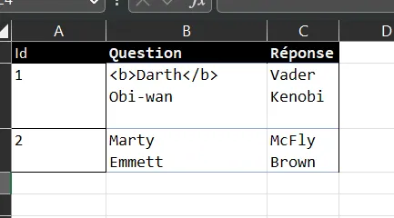
</div>


Je passe les détails :

* Sauvegarde au format .csv à partir d'Excel
* Suppression des cartes existantes du deck
* Importation des cartes en prenant soin, ce coup-ci, de mettre à 1 le switch "Allow HTML in fields"

<div align="center">
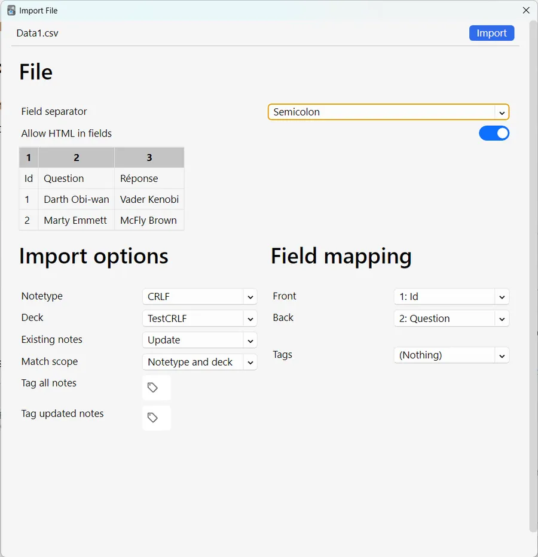
</div>


Du coup, c'est plus vraiment ce que l'on veut :

<div align="center">
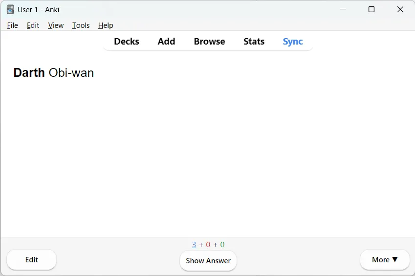
</div>


* On fait bien ressortir "Darth" en gras
* Mais bon, on a perdu notre affichage sur 2 lignes

Ils ne sont pas bien malins les gars qui s'occupent de l'importation chez Anki. Va falloir qu'on fasse le boulot à leur place.

## Et qu'est-ce qui faut faire ?

En deux mots :

* Dans le .csv
* Dans les chaines de caractères des questions et des réponses...
* Remplacer les LF par des balises HTML `<br/>`

## Et comment on fait ?

Une fois qu'on a le fichier .csv on peut l'ouvrir avec [VSCode](https://code.visualstudio.com/) ou NotePad++ et faire un remplacement "à la main". Cela dit, il faut faire très attention. En effet le fichier .csv contient aussi des groupes CRLF auxquels il ne faut surtout pas toucher. Donc, on ne peut pas dire simplement à VSCode "remplace moi tous les LF par des `<br/>`". En effet, on se retrouverait alors avec des CR`<br/>` au bout de certaines lignes et ça, ça risque de mettre le Bronx.

Bon ben, c'est mort. C'est ça ? Il y a bien sûr moyen de s'en sortir, même avec VSCode ou Notepad++. Cela dit, si on peut le faire une ou deux fois, ce n'est pas tenable sur le long terme.

Avec file explorer je vous propose donc d'aller dans le répertoire où se trouve le fichier .csv à modifier. Dans la barre où on voit habituellement les chemins d'accès aux fichiers, je tape "pwsh" puis j'appuie sur ENTER. Voir ci-dessous :

<div align="center">
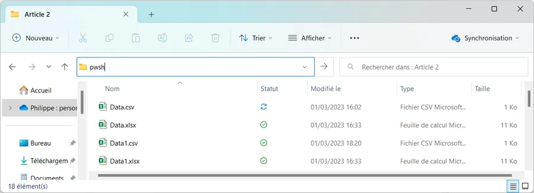
</div>


Ça ouvre, dans le répertoire en question, un terminal tel que celui-là :

<div align="center">
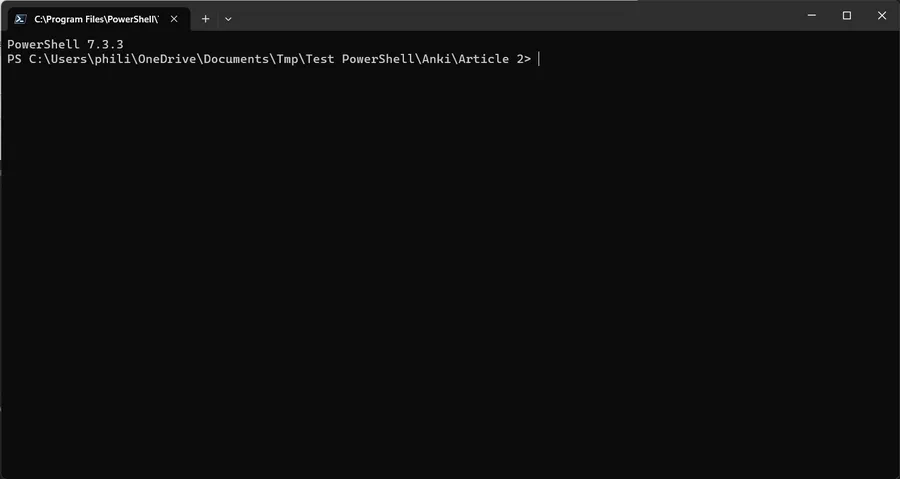
</div>


On va saisir trois commandes et le problème sera résolu. Avant ça, on va quand même vérifier que le fichier .csv qu'on veut traiter est bien là. Dans la suite du texte, le fichier que je vais traiter s'appelle dorénavant Data1.csv.

Allez, la première commande à saisir c'est `ls`. Une fois que c'est saisi dans le terminal, il suffit d'appuyer sur ENTER.

```powershell
ls
```

Voilà ce que je vois de mon côté quand j'ai appuyé sur ENTER. Je retrouve bien mon fichier Data1.csv

<div align="center">
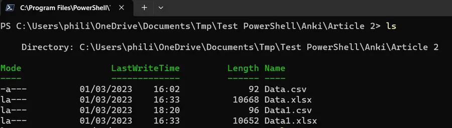
</div>


Roulement de tambour... Première commande. Il faut saisir ceci :

```powershell
$Data = Import-Csv -Path ./Data1.csv -Delimiter ';'
```

Il ne faut pas hésiter à copier-coller le contenu du bloc précédent et à l'adapter.

En français dans le texte la commande veut dire : ouvre le fichier ``Data1.csv``. Utilise ";" comme délimiteur pour interpréter son contenu et charge tout ça en mémoire dans un objet qu'on va appeler Data (le $ ne fait partie du nom de la variable). Quand j'appuie sur ENTER je ne vois rien de spécial dans le terminal.

<div align="center">
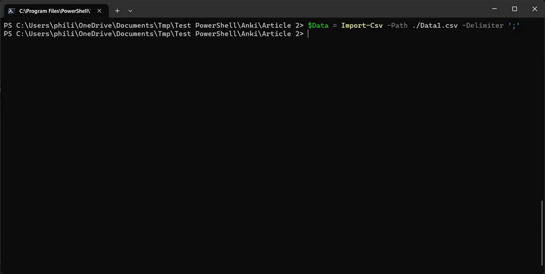
</div>


Deuxième commande un peu plus "touchy" mais bon, encore une fois, il ne faut pas hésiter à faire, d'un seul coup, un copier-coller des 4 lignes ci-dessous :

```
$Data | ForEach-Object {
  $_.Question = $_.Question -replace "`n", "<br/>"
  $_.Réponse = $_.Réponse -replace "`n", "<br/>"
}
```

Les lignes précédentes signifient : pour toutes les lignes de l'objet Data, retrouve la partie Question et la partie Réponse et remplaces-y le caractère "\n" (LF) par `<br/>`. 

On voit là l'un des intérêts d'utiliser PowerShell. Il a chargé toutes les lignes. Chaque ligne a été transformée en un objet dont les propriétés portent les noms des colonnes du fichier .csv (Question et Réponse dans mon cas). Ça permet d'écrire des lignes qu'on arrive à relire facilement. Cerise sur le loukoum, on a plus le problème des CRLF qu'il fallait éviter de modifier. En fait ils ont disparu quand le fichier .csv a été interprété et chargé en mémoire. Ils réapparaîtront quand on sauvera le fichier.

Quand je copie et colle les 4 lignes précédentes d'un coup, le terminal me demande de confirmer si c'est bien ce que je veux faire. Oui, oui, t'inquiète paupiette, vas-y, colle les lignes.

<div align="center">
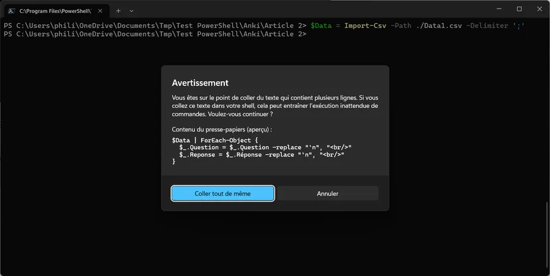
</div>


Quand c'est collé, j'appuie sur ENTER. Là aussi, rien de spécial à l'écran.

<div align="center">
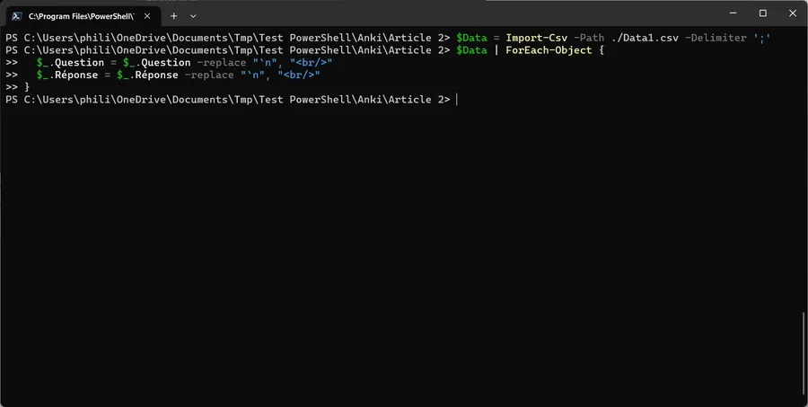
</div>


Allez, dernière commande :

```powershell
$Data | Export-Csv -Path "./Data1-bis.csv" -Encoding UTF8
```

Cette commande se charge de sauvegarder au format .csv le contenu de l'objet Data.

Pareil, pas de retour à l'écran. Pas de nouvelle, bonne nouvelle ?

<div align="center">
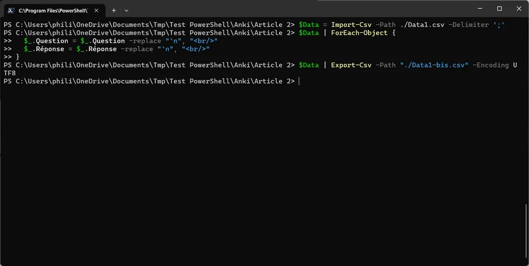
</div>


Cependant si je tape la commande `ls` dans le terminal, je vois que j'ai dans mon répertoire un nouveau fichier qui s'appelle Data1-bis.csv et qu'il est un peu plus long que le fichier Data1.csv original. Miam, miam, ça sent bon.

<div align="center">
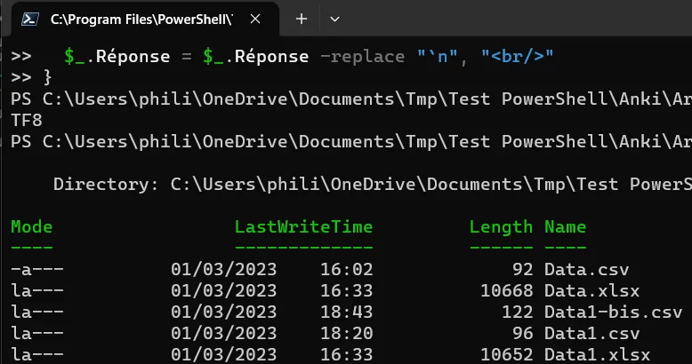
</div>


Je passe les détails mais après import de Data1.csv dans Anki voilà ce que je vois. Ayé, on a résolu notre problème en 3 commandes PowerShell.

<div align="center">
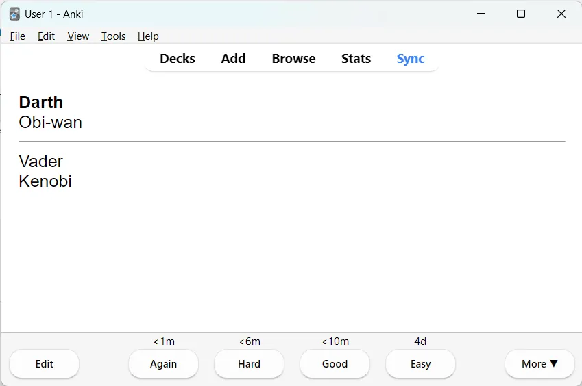
</div>


## Résumé

Afin de pouvoir importer dans Anki un fichier .csv qui contient du code HTML il faut supprimer les LF et les remplacer par des balises HTML `</br>`. En étant prudent, il est possible de le faire dans VSCode ou Notepad++. Cela dit, il est sans doute plus pratique d'utiliser les 3 commandes PowerShell ci-dessous :

```powershell
$Data = Import-Csv -Path ./Data1.csv -Delimiter ';'
$Data | ForEach-Object {
  $_.Question = $_.Question -replace "`n", "<br/>"
  $_.Réponse = $_.Réponse -replace "`n", "<br/>"
}
$Data | Export-Csv -Path "./Data1-bis.csv" -Encoding UTF8

```

On peut tout regrouper dans une seule commande dans laquelle il n'y a qu'à modifier les noms du fichier .csv et des colonnes. Il suffira alors de copier-coller les 7 lignes à la fois :

```powershell
Import-Csv -Path ./Data1.csv -Delimiter ';' |
ForEach-Object {
  $_.Question = $_.Question -replace "`n", "<br/>"
  $_.Réponse = $_.Réponse -replace "`n", "<br/>"
  $_
} |
Export-Csv -Path "./Data1-bis.csv" -Encoding UTF8
```

*Bon, ben voilà, je pense avoir fait le tour. La suite au prochain épisode...*

