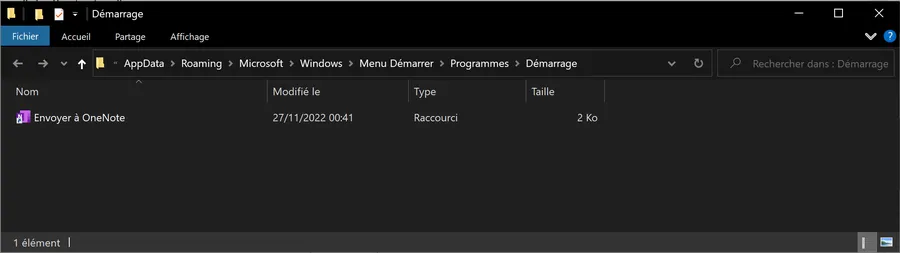
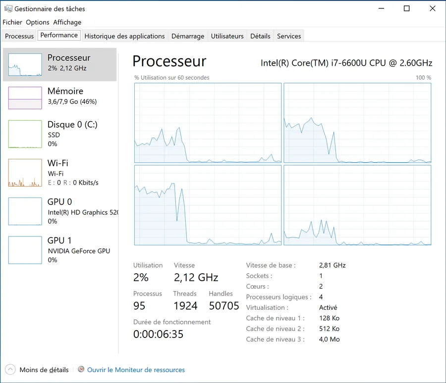
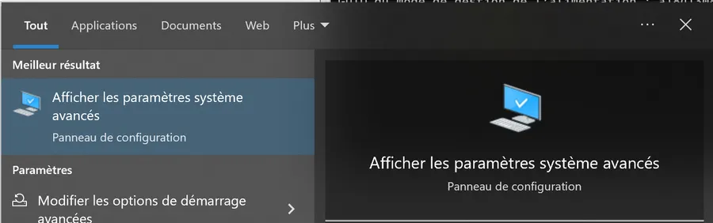

# Nettoyage de Windows 10
{: .no_toc }

{: .warning }
Janvier 2025. Je viens de transférer ce billet. Pas d'embrouille, le billet parle de **Windows 10**. Si certains points sont sans doute applicables à Windows 11, la dernière mise à jour du billet date de Janvier 2023. Beaucoup de choses ont évolué depuis. Bonne lecture mais prudence quand même...  

1. TOC
{:toc}

## Introduction

Il y a très longtemps que je souhaitais faire un billet de ce type mais je ne trouvais jamais le temps de mettre mes notes au clair. Je ne promets rien, pas de multiplication de la vitesse par 10, pas de division par 4 du nombre de process en mémoire ou quoi que ce soit. Non, au mieux on aura un système Windows qui démarrera un peu plus vite, qui aura plus de RAM libre... Enfin bref, pas de miracles mais on aura appris des choses et le système sera dans un état plus sain.

Idéalement, je pense qu'il faudrait faire ce type de nettoyage 2 fois par an (en mai et en novembre par exemple car il y a des ponts et qu'on doit être capable de se programmer un slot). Désolé mais je n'ai pas une idée très claire du temps que cela prend.

Afin de faire de cette page un outil, une fois n'est pas coutume, il y a une table des matières. Comme on ne va pas tout faire ou tout relire à chaque fois, cela permet de retrouver rapidement tel ou tel paragraphe qui nous interesse plus que les autres.

En plus, je pense que j'aurai l'occasion de revenir sur la page (c'est une "never ending story" cette affaire). De nouvelles sections vont apparaître, d'autres seront là mais "*à finir*", finalement certaines seront estampillées "obsolètes"... Bref, cette page est vivante et je vous propose :


### Méthode 
{: .no_toc }
* De la parcourir une fois sans **rien faire** à part noter les sections intéressantes
* De refaire une passe en mettant en oeuvre telle ou telle section

<!-- Enfin, il pourra être utile d'aller faire un tour sur cette page qui recense quelques [trucs et astuces](https://www.40tude.fr/windows-10-notes-diverses/) supplémentaires et/ou sur celle-ci où je conserve les [raccourcis claviers](https://www.40tude.fr/win10-raccourcis-clavier/) que j'utilise au quotidien. -->


## Conventions d'écriture utilisées dans ce billet

### 1er cas
{: .no_toc }
Dans le billet, si on voit :

* WIN + R
* "winver" + ENTER

Cela veut dire :

* Appuyer sur les touches Windows et "r"
* Taper le mot "winver" dans la boîte de dialogue puis taper sur ENTER

Si on revoit l'action au ralenti, voilà ce que cela donne à l'écran. Appui sur les touches Windows et "r". Pas besoin de saisir un "R" majuscule, il faut juste appuyer sur la touche "r". La boite de dialogue pour la saisie de la commande apparaît.

<div align="center">

</div>

Saisie de la commande "winver" puis appui sur ENTER

<div align="center">

</div>

### 2eme Cas
{: .no_toc }
Maintenant, si dans le billet, j'écris

* WIN
* "info" + ENTER

Cela veut dire :

* Appuyer sur la touche Windows
* Commencer à taper le mot "info"
* Quand l'application recherchée apparaît, appuyer sur ENTER

À l'écran, voilà ce que cela donne. Appui sur la touche Win. Le menu Windows apparaît.

<div align="center">

</div>


Il ne faut pas se poser de question et commencer à taper le mot "info" au clavier. Quand je tape les lettres, les différentes applications susceptibles d'être lancées apparaissent. Quand je vois celle que je veux en haut de la liste je clique sur ENTER.

<div align="center">

</div>


Dans le cas où il faudrait lancer l'application en question en mode **Administrateur**, pas besoin d'utiliser la souris. Il suffit d'utiliser les flèches du clavier pour se déplacer une fois à droite puis une fois vers le bas pour mettre le focus sur l'option "Exécuter en tant que...". Quand c'est fait, on appuie sur ENTER.

<div align="center">

</div>

## Version de Windows

C'est pour fixer les idées et éviter d'appliquer à la version de Windows de l'année 2058 des options qui étaient valables sur la version 10 que j'utilise ici. Il peut y avoir des différences dans certaines boîtes de dialogue d'une révision de Win 10 à l'autre mais bon, je pense que les procédures seront très similaires. Fin 2022, je suppose aussi qu'une bonne partie de ce qui est dit ici est aussi applicable à la version courante de Windows 11.

Allez, c'est parti je vérifie la version de Windows que j'utilise :

* WIN + R
* "winver" + ENTER

<div align="center">

</div>


On va aller jeter un oeil dans les informations système

* WIN
* "info" + ENTER

<div align="center">

</div>

### Ligne de commande (PowerShell ou WT)
{: .no_toc }
* WIN + X
* "i" + ENTER

* Saisissez les commandes ci-dessous
```powershell
(Get-ItemProperty -Path "HKLM:\SOFTWARE\Microsoft\Windows NT\CurrentVersion" -Name DisplayVersion).DisplayVersion
[System.Environment]::OSVersion.Version
Get-ComputerInfo -Property WindowsUBR
```

<div align="center">

</div>


## Point de restauration

Là, on ne rigole pas.   

**Avant** de se lancer dans ce genre de nettoyage de printemps il faut obligatoirement faire un point de restauration. C'est **non négociable**. En effet, on n'est pas à l'abri d'une grosse bêtise. En plus, cela ne prend pas beaucoup de temps. Ce serait vraiment dommage de ne pas le faire puis, de n'avoir plus que ses yeux pour pleurer une fois le désastre arrivé.

Je vais prendre un peu de temps pour expliquer, promouvoir et illustrer. L'idée est que ceux qui ne l'ont jamais fait puissent s'y mettre en toute confiance. Au pire, même si vous n'avez pas l'intention de faire un nettoyage de printemps, faites un point de restauration maintenant, c'est toujours utile de savoir le faire.

* WIN
* "rest" + ENTER
* Si besoin je sélectionne le disque C (celui où Windows est installé) et j'appuie sur Configurer...

<div align="center">

</div>


Là, j'active la protection et je réserve un certain pourcentage du disque pour y stocker le ou les points de restauration. Typiquement 5% du disque dur suffisent. Voilà ce que l'on voit quand on clique sur le bouton Configurer...

<div align="center">

</div>


À titre informatif, en ce qui me concerne, j'ai 2 points de restauration qui prennent 15.5 GB

<div align="center">

</div>


Bon bref, quand la première boite de dialogue est à l'écran, j'appuie sur Créer, je donne un nom au point de restauration et c'est terminé.

<div align="center">

</div>


En cas de problème il faudra revenir sur la boite de dialogue initiale et appuyer sur le bouton "Restauration de système...". Il suffira alors de choisir le nom du bon point de restauration

<div align="center">

</div>

<div align="center">

</div>

<div align="center">

</div>


### Note
{: .no_toc }
Si un jour il faut trouver de la place on peut supprimer les points de restauration (à l'exception du dernier)

* WIN
* "nett" + lancer en tant qu'Administrateur
* Onglet "Autres options"
* Bouton "Nettoyer..." de la section "Restauration du système..." en bas
* Bouton "Supprimer" sur la boîte de dialogue

<div align="center">

</div>


### Version résumée
{: .no_toc }
* WIN
* "rest" + ENTER
* Cliquer sur "Créer..."
* Donner un nom au Point de restauration
* Attendre 2 min.

### Ligne de commande (PowerShell en mode Administrateur)
{: .no_toc }
* WIN + X
* "a" + ENTER
* Coller la ligne ci-dessous
  + Get-ComputerRestorePoint
  + Checkpoint-Computer –Description "20221129 - Billet Blog"

<div align="center">

</div>


## Etat des lieux : avant le nettoyage

L'idée c'est d'avoir une photographie du système avant de faire quoique ce soit. Cela nous permettra de mesurer nos progrès (s'il y en a...) J'estime avoir un usage "normal" du PC. Par exemple, je n'installe pas 30 softs par semaine et je ne me suis pas occupé du PC depuis un bon moment (quelques mois).

* CTRL + SHIFT +ESC
* CTRL + TAB pour aller sur l'onglet performance

<div align="center">

</div>


Au bas de la page, je vois qu'il y a 192 processus qui tournent. Idéalement je recommande de faire une copie de toute la fenêtre (WIN + SHIFT +S puis sélection du mode capture de fenêtre) et de coller cette capture dans OneNote. Là, j'ai fait la bêtise de ne copier que le bas de la fenêtre et finalement je le regrette.

* CTRL + SHIFT + TAB pour aller sur l'onglet processus
* Je clique sur l'en-tête de la colonne Processeur pour mettre les process les plus gourmand en puissance CPU en haut de la liste
* Faire une capture et la mettre dans OneNote

### Les process les plus gourmands en processeur
{: .no_toc }
<div align="center">

</div>


* Je clique sur l'en-tête de la colonne Mémoire pour mettre les process les plus gourmand en haut de la liste

### Les process les plus gourmands en mémoire
{: .no_toc }
<div align="center">

</div>

### Ligne de commande (PowerShell ou WT)
{: .no_toc }
* WIN + X
* "i" + ENTER
* Coller les lignes ci-dessous
  + *À faire*

## Faire le tri des process lancés au démarrage

Cela se fait via le gestionnaire de tâches

* WIN + SHIFT + ESC
* Faire clic droit dans l'en-tête et cliquer sur toutes des cases à cocher

<div align="center">

</div>


* Faire ensuite le tri dans les informations que vous souhaitez garder. Par exemple, j'aime bien voir la ligne de commande utilisée

<div align="center">

</div>


* Cliquer sur l'onglet "Démarrage"
* Les classer par "Statut"
* Revoir les tâches qui sont "Activé" au démarrage
* Si besoin double clic sur une ligne et la mettre en "Désactivé"

<div align="center">

</div>

## Visite de la base de registre

Il y a encore 2 endroits où on peut trouver des lancements de programmes au démarrage. Pour cela il va falloir aller dans la base de registre. /Z!\ On a vite fait de mettre le bronx sur le PC si on n'est pas très prudent. Allez, on y va :

* WIN + R
* "regedit" + ENTER

<div align="center">

</div>


* Copier et coller le chemin ci-dessous dans la barre d'adresse (là où il y a écrit "Ordinateur" dans l'image ci-dessus)

* HKEY_CURRENT_USER\SOFTWARE\Microsoft\Windows\CurrentVersion\Run
* Voilà alors ce que je vois

<div align="center">

</div>


* Cela concerne les applications qui sont démarrées au lancement de la session de l'utilisateur actuel (``HKEY_CURRENT_USER``).
* Inspecter les entrées. En cas de doute ne rien faire. Attention, avec un clic droit on peut juste supprimer l'entrée. On ne peut pas la désactiver.
* Ici, il y aurait peut-être quelque chose à faire avec la clé "MicrosoftEdgeAutoLaunch" mais bon je ne suis pas sûr de mon coup donc, dans le doute, je ne fais rien. Un jour j'irai effectuer une recherche sur le web ...
* Copier et coller le chemin ci-dessous dans la barre d'adresse
    * ``HKEY_LOCAL_MACHINE\SOFTWARE\Microsoft\Windows\CurrentVersion\Run``

<div align="center">

</div>


* À priori je suis clean. Ce qui a été dit précédemment pour le ``HKEY_CURRENT_USER`` reste valable mais s'appliquera à l'ensemble des utilisateurs.


## Faire le tri dans les process de la barre de tâche

* Appuyer sur la flèche de la barre de taches

<div align="center">

</div>


* Désactiver/arrêter ce qui peut l'être
* Il faut comprendre que les process arrêtés ici reviendront au prochain démarrage si rien n'a été fait à l'étape "Faire le tri des process lancés au démarrage"


## Empêcher le redémarrage des applications

* WIN
* "options de conn" + ENTER
* Vérifier que le switch est off dans "Redémarrer des applications"

<div align="center">

</div>


## Nettoyage du répertoire temporaire

Ça ne va pas nous faire gagner de la puissance CPU ni de la mémoire mais bon c'est un nettoyage de printemps donc on sort les tapis et on fait le ménage.

* WIN
* "%temp%" + ENTER

<div align="center">

</div>


* CTRL + A pour sélectionner tous les fichiers
* SHIFT + SUPPR pour supprimer les fichiers sans les mettre dans la corbeille

<div align="center">

</div>


* Si besoin cocher la case "Faire ceci..." et appuyer sur le bouton "Ignorer".

<div align="center">

</div>


## Vider le cache Dropbox

Pas la peine de vider le cache si Dropbox fonctionne bien. Cela dit, si en inspectant l'utilisation de l'espace sur le disque dur (voir la section "[Nettoyage du disque bis"](#nettoyerdisquebis)), vous estimez que Dropbox prend trop de place, il y a peut-être 2 choses à faire :

* Mettre un max de fichiers en ligne
* Purger le cache

Allez, on y va

* WIN + E
* Cliquer sur Affichage
* S'assurer que les cases "Extensions de noms de fichiers" et "Eléments masqués" sont bien cochées

<div align="center">

</div>


* Retrouver le répertoire Dropbox
* Le répertoire .dropbox.cache doit être visible
* Clic droit sur le nom du répertoire puis "Propriétés" afin d'évaluer sa taille
* Assurez-vous que Dropbox est à jour et qu'il n'y a pas de transfers en cours

<div align="center">

</div>

* Double cliquer sur .dropbox.cache

<div align="center">

</div>


* CTRL + A pour sélectionner tous les répertoires et fichiers
* SHIFT + SUPPR pour les supprimer sans les stocker dans la corbeille

<div align="center">

</div>


## Inspecter les répertoires de "Démarrage"

* WIN + r
* "shell:startup"

<div align="center">

</div>


On arrive sur le répertoire de démarrage qui est propre à l'utilisateur courant. Y a-t-il des choses à supprimer ?

<div align="center">

</div>


* WIN + r
* "shell:common startup"

<div align="center">

</div>


On arrive sur le répertoire de démarrage qui est commun à tous les utilisateurs. Apparemment je n'ai rien à supprimer.

<div align="center">

</div>


## Nettoyage du disque

Pareil. Ça ne va pas nous faire gagner de la puissance CPU ni de la mémoire mais bon ça fait partie du nettoyage de printemps.

* WIN
* "Clean"
* Lancer en tant qu'**Administrateur**

<div align="center">

</div>


* Tout cocher
* OK

<div align="center">

</div>


## Nettoyage du disque bis

C'est sans doute un peu redondant avec ce que l'on vient de faire mais bon...

* WIN
* "temp" + ENTER

<div align="center">

</div>


* Cliquer sur le premier lien "Configurer l'Assistant de stockage..."

<div align="center">

</div>


Il y a là moyen de paramétrer certains nettoyages ou allègements. Par exemple, j'utilise OneDrive et je peux ici programmer le fait qu'un fichier pas ouvert depuis 30 jours passe automatiquement "En ligne".

* Cliquer sur "Nettoyer maintenant"
* Revenir à la première page

<div align="center">

</div>


* Sous Applications, cliquer sur "Désinstaller les applications..." quand cela a du sens.
  Cela dit, avec le temps, je me dis qu'il est sans doute plus efficace de faire le ménage dans les applications installées avec l'outil **OOAppBuster** : voir cette [section](#OOAppBuster) du billet.

<div align="center">

</div>


* Là, il faut parcourir la liste et appliquer la règle de ma grand-mère : "*Dans ton armoire, tout ce que tu n'as pas mis pendant un an, tu peux le donner*".
* Là, c'est pareil. Les applications qu'on n'a jamais utilisé ou qu'on utilise plus... Pas de quartier, il faut les virer. Au pire, le jour venu on réinstallera la dernière version. Exemple Drawboard PDF qu'on voit ci-dessus. Je ne sais même pas ce que c'est...
* Revenir à la première page
* Je regarde la taille des différentes catégories. Dans mon cas, je vois que le Bureau est à 4 GB et que "Autre" est à 16 GB. Le Bureau, je sais ce qui se passe, c'est une image ISO. Il faut que je la range ailleurs.

<div align="center">

</div>


* Allez, je clique sur Autre. En fait c'est mon dossier Dropbox qui prend de la place. Il faudra que je pense à mettre ses fichiers en ligne et/ou à le paramétrer de manière plus fine. En revanche, .vscode à 700MB... Aucune idée de ce qui se passe là.

<div align="center">

</div>


* Quand je clique sur la ligne, je vérifie rapidement que ce sont les extensions qui prennent de la place. Voir ci-dessous :

<div align="center">

</div>


## Faisons un break

Sors le popcorn et regardons cette vidéo : <https://youtu.be/9a_BHAMrdsw?t=94>


## Utiliser l'outil Windows10Debloater

{: .warning }
À ne PAS utiliser sous Windows 11


* Le projet semble assez vieux et pas mis à jour depuis quelques temps déjà. Voir ci-dessous les dates de mise à jour : 2 ans, 17 mois...

<div align="center">

</div>


* Récupérer le zip
  + Faut se rendre sur : <https://github.com/Sycnex/Windows10Debloater>

  + Cliquer sur le bouton vert et tout en bas cliquer sur "Download Zip"

<div align="center">

</div>


* Décompresser le fichier

Lancer un terminal en mode **Administrateur**

* WIN + X
* "a" + ENTER
* Se déplacer dans le répertoire où on a décompressé Windows10Debloater

<div align="center">

</div>


* Taper la commande "Set-ExecutionPolicy Unrestricted -Force"
* ENTER
* Lancer Windows10Debloater.ps1

* Ne **PAS** lancer la version GUI (Windows10DebloaterGUI.ps1) car lancer Windows10Debloater.ps1 est le seul moyen que j'ai touvé pour contrôler ce qu'il fait. En effet avec Windows10Debloater.ps1 des boites de dialogue apparaissent et aux étapes importantes on peut répondre "Oui", "Non"... Voir ci-dessous :

<div align="center">

</div>

<div align="center">

</div>

<div align="center">

</div>

<div align="center">

</div>

<div align="center">

</div>

<div align="center">

</div>

<div align="center">

</div>


### Ce que je n'aime pas dans la version GUI
{: .no_toc }
<div align="center">

</div>


* Il fait des trucs que je n'ai pas demandé
* Si je clique sur "Remove all bloatware" (second bouton à partir du haut), clairement, je ne demande pas à virer les tuiles (bouton de droite sur première ligne de la catégorie "Other changes fixes")
* Pourtant à l'exécution de "Remove all bloatware" il vire les tuiles (voir ci-dessous)
* Bon la version GUI c'est une bonne idée mal exécutée. À éviter je pense.

<div align="center">

</div>


### Pour revoir les tuiles
{: .no_toc }
* WIN
* Retrouver l'application
* Clic droit sur l'icone
* Choisir "Epingler au menu Démarrer"

<div align="center">

</div>


* Faut ensuite aller chercher les autres... Good luck

<div align="center">

</div>


Une fois qu'on a au moins une tuile on peut suivre la méthode suivante

* WIN + R
* explorer shell:AppsFolder

<div align="center">

</div>


* Clic droit sur une application
* Choisir l'option "Epingler à l'écran de démarrage" (je pense qu'il y a là un souci de traduction)

<div align="center">

</div>


## Etat des lieux

Après l'utilisation de Windows10Debloater.ps1 le PC passe de 192 à 160 process (-16% quand même). Je pense qu'on peut faire mieux.

<div align="center">

</div>


## Paramètres confidentialité

Un peu comme le ménage sur le disque dur, ça ne va pas nous faire gagner de la puissance CPU ni de la mémoire mais bon ça fait partie du nettoyage de printemps.

* WIN
* "pri" + ENTER
* Parcourir TOUTES les options à gauche

Quelques exemples qui me semblent importants ci-dessous :

<div align="center">

</div>


Localisation

<div align="center">

</div>


Arrêter les applications en arrière-plan

<div align="center">

</div>


Diagnostic

<div align="center">

</div>


## Disable Indexing du disque

À chaque démarrage, je vois bien que la charge processeur est liée en grande partie à l'indexation du disque dur. Je vais donc la supprimer.

* WIN + E (pour lancer l'explorateur de fichiers)
* Retrouver le disque C
* Clic droit
* Propriétés

<div align="center">

</div>


* En bas, décocher "Autoriser l'indexation..."
* Cliquer sur OK

<div align="center">

</div>


* Quand c'est parti ça peut prendre un peu de temps (5 min ou plus par exemple)


## Faisons un break

* Sors la bière et regardons cette vidéo : <https://youtu.be/GOz_foQcPcY>
* Si tu sais lire, passe un peu de temps sur cette [page](https://christitus.com/debloat-windows-10-2020/)
* Enfin, comme il y a pas mal de mise à jour sur le projet, il peut être utile de regarder cette [vidéo](https://youtu.be/vXyMScSbhk4) mais bon ce n'est pas indispensable. Tu peux passer à la suite directement si besoin


## Utiliser l'outil de Chris Titus Tech

Lancer un terminal en mode **Administrateur**

* WIN + X
* "a" + ENTER

Ou alors, si tu as l'excellent [Windows Terminal](http://ibit.ly/2NkQ) sur ton PC tu peux faire...

* WIN
* Taper "wt"
* GAUCHE + BAS + ENTER
* Dans l'une ou l'autre console, taper la commande suivante
  + ``irm christitus.com/win | iex``

Quand l'interface graphique est à l'écran, cliquer sur Tweaks puis sur Laptop (ou autre selon la situation) dans la section "Recommended Selections".

<div align="center">

</div>


* Reboot


## Etat des lieux

On passe de 159 à 95 process. Depuis le départ on a diminué le nombre de process de près de 50%. On est sous la barre des 100. Je pense que ce n'est pas trop mal.

<div align="center">

</div>


## Faisons un break

Sors les Curly et regardons cette vidéo : <https://youtu.be/AAC0Jb4YRc0>


## Utiliser l'outil System Utilities de Pegasun

* Aller sur cette page : <https://pegasun.com/system-utilities>
* Tout en bas de la page, récupérer la version portable (pas d'installeur, rien dans la base de registre etc.)

<div align="center">

</div>


* Il suffit de décompresser le fichier et de double cliquer sur SystemUtilities.exe

<div align="center">

</div>


### Etat des lieux
{: .no_toc }
On commence à aller chercher les derniers %. Je vais donc affiner un peu les choses au niveau de la mesure. Bref, tu n'es pas obligé de faire ce que j'explique ci-dessous. Lis et dans 2 minutes on va lancer l'outil de Pegasun

* Je fais un reboot
* Je lance le gestionnaire de tâches et je ne touche à rien
* J'attends 5 min.
* Je fais une copie d'écran (WIN + SHIFT + S)
* Je lance OneNote et je colle l'image dedans

<div align="center">

</div>


* Si je ferme OneNote
* Que j'attends encore 5 min.
* Je fais une copie d'écran
* Je lance OneNote et je colle la copie dedans

<div align="center">

</div>


* Si je refais la même chose 5 minutes plus tard

<div align="center">

</div>


* Lancer "SystemUtilities.exe" en double cliquant dessus. Voilà l'IHM :

<div align="center">

</div>


* Choisir Optimize PC à droite
* Clique sur bouton radio "Maximum" puis sur le bouton vert "Optimize" (en bas)

<div align="center">

</div>


* Avant de faire quoi que ce soit, il montre ce qu'il va optimiser. Faut lire le contenu des colonne "Currently" et "New"

<div align="center">

</div>


* Faire une repasse rapide de la liste
* Moi, je vais laisser le service "Service de clavier tactile blablabla" en route car sinon il y a des soucis avec WT (windows Terminal)
  + Voir aussi le bouton Describe qui peut aider quand on passe en revue certaines lignes

<div align="center">

</div>


* Clic sur Optimize
* De retour dans l'interface du Service Manager de Pegasun on peut encore faire des ajustements manuels

<div align="center">

</div>


* Par exemple, clic droit sur Adobe Update pour le désactiver au démarrage.

<div align="center">

</div>


Voilà ce qui reste quand je cache les services Microsoft et que je liste en premier les services qui sont lancés au démarrage. Il y a peut-être encore des trucs encore à virer

<div align="center">

</div>


* Fermer la fenêtre
* Revenir dans l'interface principale de Pagasun
* Cliquer sur Boost PC Start Up à droite

<div align="center">

</div>


* Voilà ce que je vois

<div align="center">

</div>


* Je clique sur Scan Items
* Voilà ce que je vois alors

<div align="center">

</div>


* Je peux faire du ménage et supprimer carrément la ligne en rouge

<div align="center">

</div>


* Je peux aussi décocher "MicrosoftEdge" et "Envoyer à OneNote"
* Clic sur Apply


### Etat des lieux
{: .no_toc }
Après reboot et attente de 10 minutes voilà ce que je vois à l'écran :

<div align="center">

</div>


On fait passer le nombre de processus de 97 à 94 mais on fait baisser le nombre de threads de 95. La mémoire quand à elle passe de 3.7 à 3.6 GB.

À la fin quand on estime qu'on en a terminé avec Pegasun on peut l'enlever de la barre de tâche... Hé oui...

* Clic droit sur l'icone
* Exit

<div align="center">

</div>


## Arrêter Windows Search

À chaque démarrage, je vois bien que j'ai toujours de la charge processeur liée à Windows Search. Donc en plus d'avoir [supprimé l'indexing](#indexing) sur le disque C: on va carrément arrêter le service Windows Search. Je vais le supprimer car je fais peu ou pas de recherche de fichiers et je ne cherche jamais tel ou tel texte dans un fichier que j'aurai perdu de vue.

* WIN + "serv" + ENTER

* Retrouver Windows Search dans la liste

<div align="center">

</div>


* Double clic sur la ligne
* L'arrêter (bouton Arrêter) et choisir "Désactiver" dans la list box en face de "Type de démarrage"
* Cliquer sur OK

<div align="center">

</div>


* Reboot


## Etat des lieux

J'ai toujours Dropbox et l'antivirus qui prennent pas mal de ressources. Je me demande si il n'y a pas un truc à faire pour Dropbox… Voilà ce que je vois au bout de 5 min.

<div align="center">

</div>

## Faisons un break

Sors les Magnums (les [glaces](https://www.magnumicecream.com/fr/produits.html) pas les [357](https://www.spotern.com/fr/spot/movie/l-inspecteur-harry/9301/le-magnum-357-de-harry-callahan-clint-eastwood-dans-l-inspecteur-harry)) et regardons cette vidéo : <https://youtu.be/sUXcMaP6wRQ>


## Utilisation de l'outil Autoruns de SysInternals

[SysInternals](https://learn.microsoft.com/en-us/sysinternals/) est dorénavant développé et maintenu par Microsoft. Il s'agit d'une collection d'outils (je compte 69 outils en 64 bit) très puissants qui peuvent nous aider à très rapidement mettre le brin sur notre machine. 

Remember : "Un grand pouvoir implique de grandes responsabilités" : <https://youtu.be/s0F3Tvc-3eI>

On va utiliser un de leurs outils : Autoruns. Cela dit comme les outils de la suite évoluent très vite on va se faire un lien sur le repository "live" ce qui nous permettra de toujours utiliser la dernière version à jour

* WIN + E
* Créer un répertoire
* Y créer un raccourci

<div align="center">

</div>


* Dans la boite de dialogue qui s'ouvre, taper

<div align="center">

</div>


* <https://live.sysinternals.com/>
* Quand on clique ensuite sur le lien qu'on vient de créer on arrive sur cette page qui contiendra toujours la dernière version des différents exécutables de la suite SysInternals.

<div align="center">

</div>


* Cliquer sur Autoruns64.exe
* L'application se télécharge et se lance

<div align="center">

</div>


* Il n'y a pas de miracle, l'application a été téléchargée (répertoire Téléchargements) puis lancée. Cela veut dire que si besoin, demain, vous pouvez toujours la lancer depuis ce répertoire au lieu de la télécharger.
* Une fois à l'écran, allez dans le menu File et choisissez "Run As Administrator"

<div align="center">

</div>


En haut il y a un onglet par catégorie : Everything, Logon... Pour l'instant on a "Everything" sous les yeux. Autrement dit on voit tout ce qui se lance. Histoire alléger l'affichage je vous propose de choisir les options ci-dessous :

<div align="center">

</div>


Si je déroule la catégorie "Everything", je retrouve le service d'Acrobat qui est désactivé

<div align="center">

</div>


De la même façon on retrouve dans ``HKEY_CURRENT_USER\SOFTWARE\Microsoft\Windows\CurrentVersion\Run`` les entrées correspondantes à OneDrive et Edge. Ensuite, si on déroule encore la liste "Everything", on "découvre" tous les autres process qui sont lancés.

<div align="center">

</div>


Si je prends une autre catégorie moins bondée (Drivers par exemple), voilà ce que je vois sur ma machine.

<div align="center">

</div>


La ligne en jaune correspond à un fichier qui n'a pas été trouvé par Autoruns. Cela ne veut pas dire qu'il est plus sur le disque. Cela veut dire qu'il n'a pas été trouvé. Si après avoir vérifié que le fichier en question n'est pas ailleurs sur le disque, je peux donc supprimer la ligne avec un clic droit (CTRL+D). À noter les options "Search Online" et "Properties" (qu'on ne voit pas sur la capture d'écran ci-dessous). Allez, je supprime la ligne.

<div align="center">

</div>


Il y a quand même une boite de confirmation

<div align="center">

</div>


Voilà la liste mise à jour

<div align="center">

</div>


Du coup, je peux aller dans la catégorie Everything, vérifier s'il y a d'autres les lignes jaune associées à des fichiers manquants et supprimer les entrées correspondantes. De retour dans la catégorie Drivers j'ai 3 lignes rouge. Elles correspondent à des fichiers non signés. Hein, hein... Il y a peut être un risque.

* Clic droit sur une des lignes
* Clic sur l'option "Check Virue Total"

<div align="center">

</div>


* Aller voir tout à droite de la fenêtre
* Il y a une note en cours d'élaboration
* Ci-dessous: 0/76

<div align="center">

</div>


* Pour en apprendre plus, clic sur la note (ici 0/76)
* On arrive sur une page qui contient un rapport spécifique. À priori ici tout va bien, aucun des anti-virus utilisés n'a trouvé quoique ce soit. Il ne faut pas hésiter à visiter les autres onglets du rapport web.

<div align="center">

</div>


Il y a vraiment plein de bonnes choses dans Autoruns. Mon conseil ? Vu que la documentation est très "light", le mieux c'est encore de voir et revoir la première des 2 vidéos ci-dessous. Je pense quand même qu'il faut en savoir un minimum sur la base de registre.

## Faisons un break

Sors les Knackis et la moutarde et regardons ces vidéos

* <https://youtu.be/L6Zp_fwYJa8>
* <https://youtu.be/G_YlltkI2mA>


## Utiliser le Task Manager

* WIN
* "plan" + ENTER
* WIN + Fleche HAUT

<div align="center">

</div>


Typiquement, il faut relire la liste et désactiver ce qui peut l'être. Par exemple la mise à jour d'Adobe (encore lui!) et les rapports de crash de Nvidia. Il vaut mieux désactiver les lignes car si besoin, bien sûr, on peut les réactiver (con, mais pas con Jean-Pierre).

<div align="center">

</div>


## Utiliser l'application OOAppBuster

Là c'est facile c'est de l'utilisation d'application.

* <https://www.oo-software.com/fr/ooappbuster>

* Récupérer et lancer l'application

<div align="center">

</div>


* Cliquer sur les applications à supprimer
* Appuyer sur Remove
* Confirmer le choix

<div align="center">

</div>


Je crois qu'il faut garder Cortana (même si on ne l'utilise pas) car elle est impliquée dans toutes les recherches que l'on fait. Par exemple rechercher une application avant de la lancer etc.


## Utiliser l'application OOShutUp

L'idée est d'utiliser un soft qui va pour nous aller positionner tous les switchs relatifs à la vie privée. On a vu [comment faire à la main](#confidentialité) mais bon il est sans doute beaucoup plus exhaustif que nous.

* <https://www.oo-software.com/fr/shutup10>
* Récupérer et lancer l'application

<div align="center">

</div>


* Dans Actions cliquer sur "Appliquer tous les paramètres recommandés"

<div align="center">

</div>


* Dire oui quand il propose de faire un point de restauration
* Reboot


## Conclusion

Fin 2022 voilà ce que je pouvais mettre noir sur blanc. Il y sans doute encore beaucoup de choses qui manquent, des imprécisions, des erreurs. Cela dit j'espère que les différentes sections vont aider certains à désengorger leur OS préféré.

De mon côté, maintenant que la page est en place, je n'hésiterai pas à revenir pour faire des mises à jour, ajouter ou supprimer des sections.

J'espère pouvoir un jour supprimer complètement cette page si à un moment ou un autre un projet "libre" permettra de faire tout ça à partir d'un unique script. Je pensais que c'était la voie qu'allait prendre CTT mais à priori ils ajoutent de plus en plus de choses autour de l'installation des logiciels etc. Ce n'est pas franchement ce que je souhaite. Pour ça il y a [Chocolatey](https://chocolatey.org/), [WinGet](https://learn.microsoft.com/fr-fr/windows/package-manager/winget/) et [Ninite](https://ninite.com/) par exemple. 

Non, moi ce dont j'ai besoin c'est d'un outil qui fasse une seule chose (le nettoyage de Windows) et qui le fasse bien.

Sinon je me demande s'il ne serait pas utile de compléter chacune des sections avec la ou les commandes PowerShell correspondantes. À méditer...


## Post-scriptum

### PS N°1 :
{: .no_toc }
J'ai eu l'occasion de faire les manipulations ci-dessus sur une machine assez ancienne, Intel I7 avec 1 cœur, 16GB de RAM pas à jour depuis longtemps etc.. J'ai fait exprès d'intervertir l'ordre des outils pour voir l'influence des uns et des autres. Voilà en mode télégraphique ce que cela a donné :

* Départ 175 Threads - 3.3 GB
* Point de restauration
* Nettoyage de disque etc.
* Après WinDebloat : 152 threads - 2.5 GB
* Enlever l'indexing a pris un temps inifini
* Après Systèmes Utililities : 135 threads - 2.2 GB
* Après OOAppBuster & OOShutup (5 min.) : 132 - 2.1 GB
* Après Chris Titus Tech (5 min.) : 86 threads - 2.1 GB

À la fin :

* J'avais vraiment l'impression (pas de mesure) que le PC démarrait plus vite.

<div align="center">

</div>


### PS N°2 :
{: .no_toc }
J'ai dû réinstaller un Windows 10 2022H2 Home (pas pro) sur un Dell XPS 13 9343. Une bonne occasion de voir ce que la "méthode" et les outils ci-dessus pourraient donner. Pour l'installation de Windows je fais simple, je dis oui à tout, je le laisse faire et j'utilise un compte Microsoft (pas un compte local).

Après l'installation je déroule la séquence. J'arrive à ça. Je suis content le PC démarre rapidement et utilise que 55 process et 2 GB de RAM. Cela dit, on ne peut pas faire grand-chose avec car il manque la plupart des softs...

<div align="center">

</div>


Sauf erreur de ma part j'ai installé

* Windows 365
* XnView
* VLC
* Acrobat reader
* Chrome (uBblock Origin, Rédacteur Microsoft)
* Paint.net
* 7.zip
* Teams

La plupart ont été installés avec l'excellent Chocolatey, d'autres avec winget et d'autres encore "à la main" (Windows 365 par exemple). J'ai dû réinstaller un driver son qui est venu avec 3 ou 4 soft parasites qu'il a fallu éradiquer. Ensuite, j'ai fait une repasse sur la séquence. J'arrive à ça :

<div align="center">

</div>


## Optionnel - Arrêter Windows Update?

Je ne suis franchement pas sûr que ce soit une bonne idée. De toute façon il peut être réactiver dans notre dos. Heu... C'est tout bête mais avant de le faire il faut vérifier que la machine est à jour et s'assurer qu'il n'est PAS en cours d'utilisation et/ou l'arrêter.

* WIN + R
* "services.msc"

<div align="center">

</div>


## Optionnel - Forcer les performances settings?

Je ne suis pas vraiment chaud non plus pour cet ajustement. Si on en est là, c'est que le PC n'est franchement plus à la hauteur de ce que l'on veut faire. Il est sans doute temps d'en changer.

* WIN
* "adv" + ENTER

<div align="center">

</div>


* Dans la section Performances
* Cliquer sur le bouton Paramètres...

<div align="center">

</div>


* Cliquer sur le 3eme bouton radio (meilleures performances)
* OK

<div align="center">

</div>
