# Sauvegarde sur disque externe & OneDrive

# Introduction
Je suis sous Windows 11 22H2. Cette fonction de sauvegarde sur disque externe existe depuis longtemps mais n'est pas/plus mise en avant car Microsoft fait dorénavant la promotion de la sauvegarde sur OneDrive (ce que je peux comprendre dans une certaine mesure). Dans ce qui suit je vais connecter un disque USB sur la LiveBox5 de la maison car cette dernière est toujours allumée. Ensuite on programmera une sauvegarde régulière. Enfin on verra comment ça se passe quand on active OneDrive et ce qu'il peut être judicieux de faire dans son répertoire "users" (création de liens symboliques etc.). Allez, c'est parti...

C'est parti oui mais bon, pour l'instant, alors qu'un disque USB SSD est pourtant branché sur la LiveBox, côté le PC, je ne vois cette dernière que dans l'infrastructure réseau et impossible d'atteindre le disque.

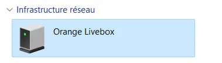

Quand je clique sur l'icône je n'ai accès qu'à une page web de gestion qui me demande un Id et un mot de passe.

## Installation de SMB 1.0

Pas la peine de râler... À ce jour il n'y a pas le choix... Oui, oui je sais, c'est un peu la honte pour Orange et ses ingénieurs de ne rien supporter de mieux que ça en 2023.

* **WIN + I**

* Applications

* Fonctionnalités facultatives

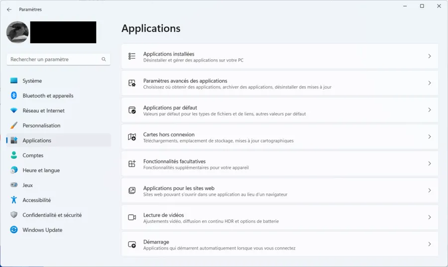

* Tout en bas, choisir "Plus de fonctionnalités Windows"

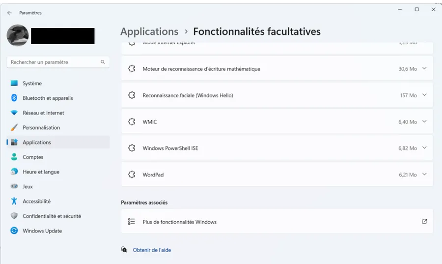

* Dans "Support de partage de fichiers SMB 1.0/CIFS", choisir
  + Client

  + Serveur

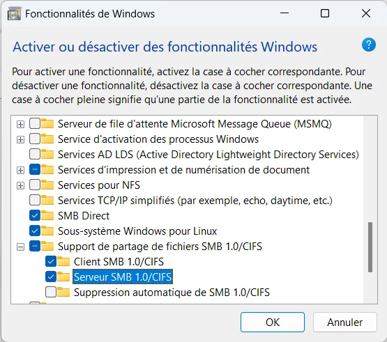

* Redémarrer

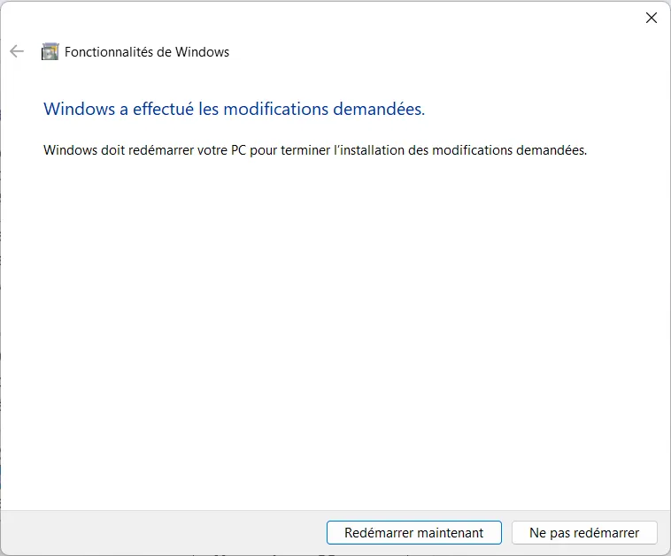

Dans le File Explorer je vois alors la LiveBox comme un ordinateur

Si je clique dessus j'accède dans la joie et la bonne humeur au disque dur SSD qui s'appelle Backup

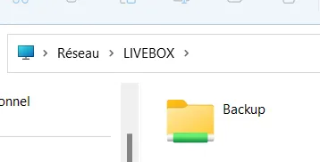

## Configuration de la sauvegarde

L'option est dorénavant encore plus cachée qu'avant. Un peu comme le cousin machin qu'on n'a pas trop envie de voir sur la photo de mariage....

* **WIN + R**

* "control"

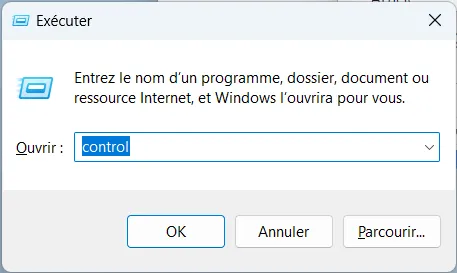

* Dans le groupe Système et sécurité

* "Enregistrer des copies de sauvegarde..."

* À gauche

* "Sélectionner un lecteur"

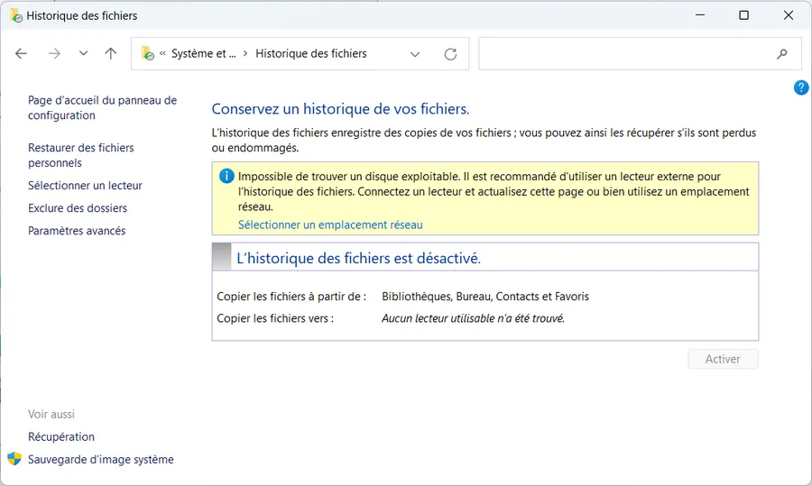

* Sous la liste qui est vide
  + Bien sûr, sur une tour sur laquelle il y a un disque externe ssd connecté ce n'est pas la peine d'aller rechercher un disque sur le réseau... Bon, bref...

* Ajouter un emplacement réseau

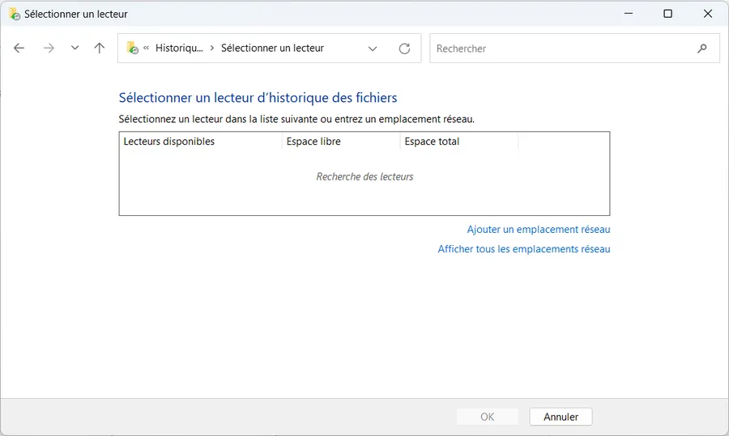

* Retrouver et choisir le disque Backup qui est connecté à la LiveBox 5 (où qui est ailleurs sur le réseau)

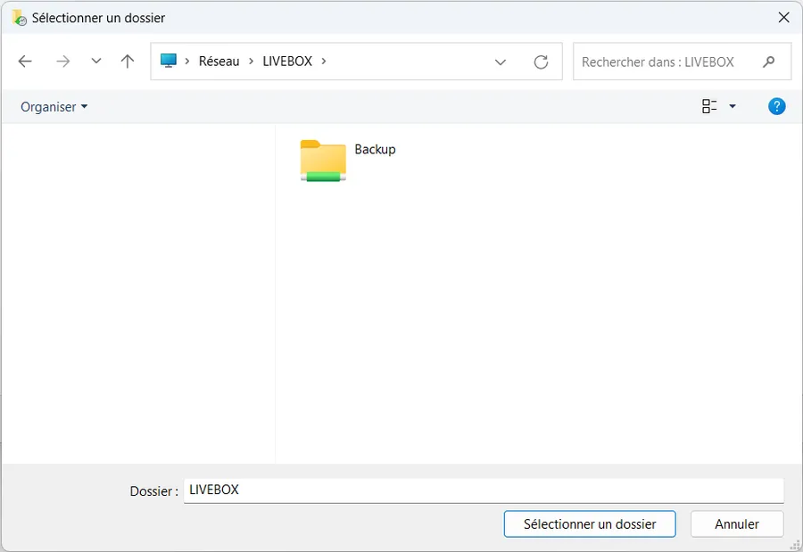

Retour à la liste des disques

* OK

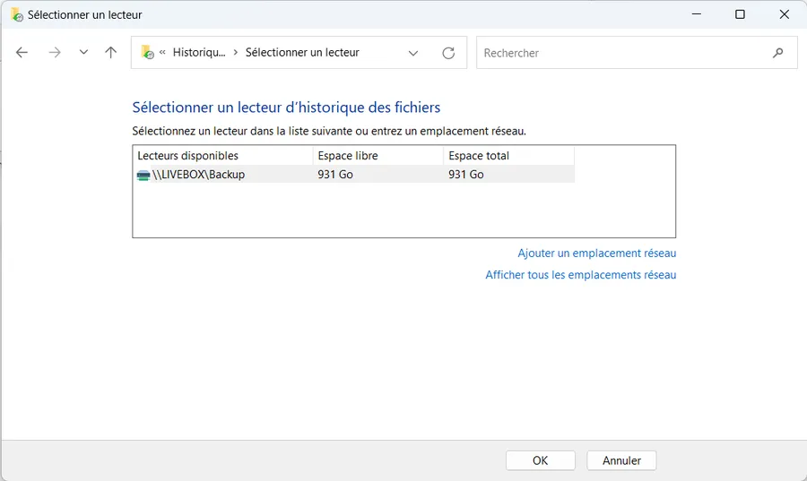

* Bouton Activer (en bas à droite)

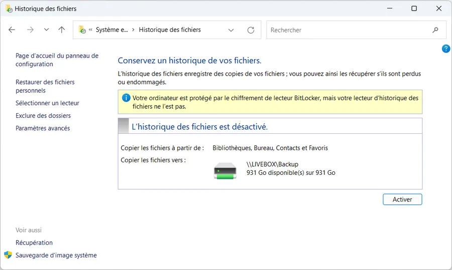

* La sauvegarde initiale se met alors en route et ça peut être long... Très long (sur la LiveBox 5 il n'y qu'un pauvre USB 2.0)

Bon après c'est du paramétrage... Le plus dur c'était de retrouver l'option 😊

* On peut aller dans les paramètres avancés
  + Par exemple, je choisis de ne conserver les versions veilles d'un an

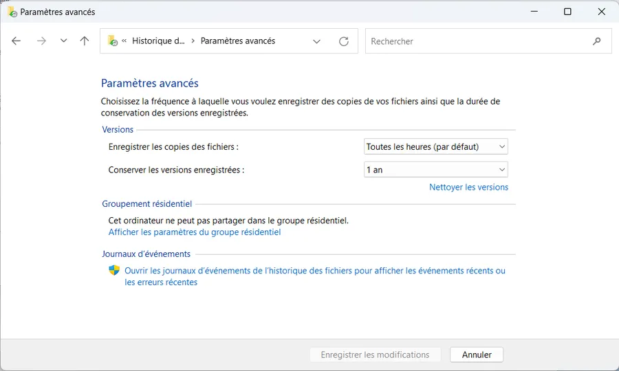

Faut lui laisser un peu de temps au début. Dans mon cas j'ai 2 ou 3 VM Windows 11 dans mon espace user... Ensuite, sauf erreur de ma part il ne sauvegarde que les différences (les nouveaux fichiers). Ce sera plus rapide. Si, alors que la première sauvegarde est toujours en cours, on clique sur "Restaurer des fichiers personnels" voilà ce que l'on peut lire.

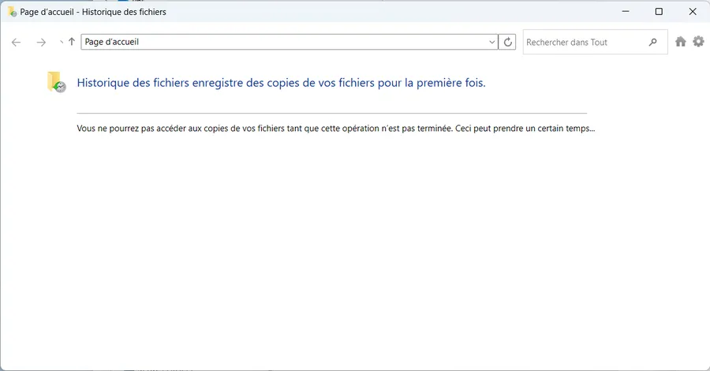

## Versioning des fichiers

Une fois que les fichiers sont copiés sur le disque en réseau et que la synchronisation est effective, il est facile de revenir en arrière si on s'est planté. Typiquement dans File Explorer, ALT +ENTER sur un fichier. Je peux alors retrouver les versions précédentes (ci-dessous il n'y a qu'une version qui date de 14:15).

Il faut utiliser les options des boutons Ouvrir et Restaurer. Entre-autres faut pas hésiter à tester Ouvrir/Ouvrir dans l'historique des fichiers. Assez sympa je trouve.

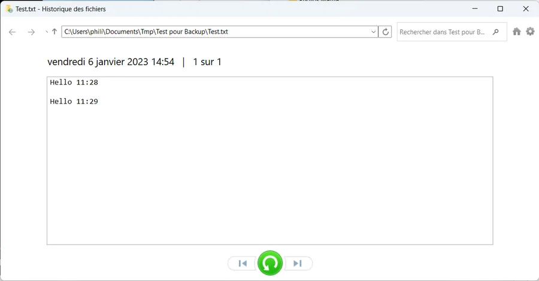

Quand on va directement sur le disque de backup pour regarder ce qui se passe on voit la chose suivante :

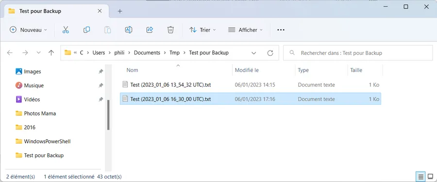

Je ne suis pas un expert mais j'ai l'impression qu'ils ont décidé de faire simple et de copier en les taguant avec une date et une heure les différentes versions d'un même fichier. Il n'y a donc pas de sauvegarde différentielle. En revanche, et c'est heureux, Windows ne sauvegarde que les fichiers qui ont été modifiés. Par exemple dans le dossier des VM, on voit que la machine virtuelle de 16 GB qui n'a pas été modifiée, n'a pas été versionnée.

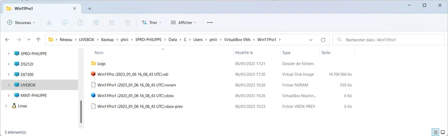

Vu la taille des VM, il faudra sans doute que j'enlève leur dossier du Backup... On en reparlera sans doute par la suite quand on va activer OneDrive. En effet, il faudra alors absolument exclure de la sauvegarde le répertoire OneDrive car sinon on va copier le contenu du répertoire user et donc aussi tout ce qui se trouve dans OneDrive. Ça va être redondant et pas du tout efficace.

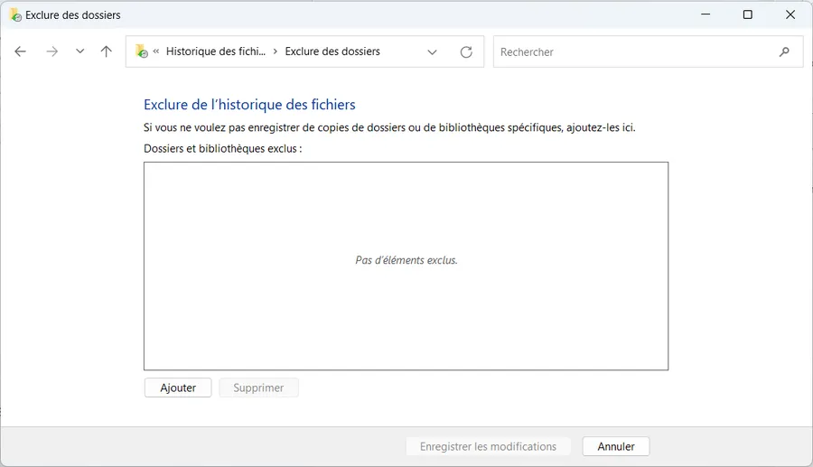

## Forcer une synchro à la main

* **WIN + R**
* "control"
* Seconde option du groupe Système et sécurité
* Dans la boite de dialogue qui apparait on peut cliquer sur le lien "Exécuter maintenant"

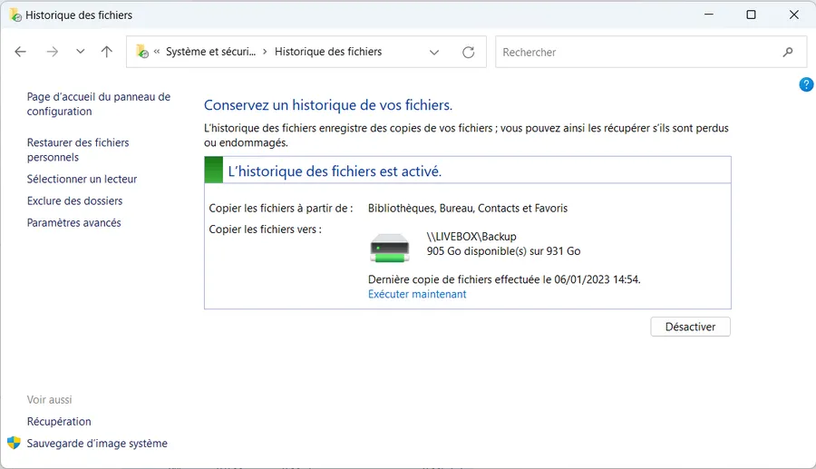

On voit alors dans le Gestionnaire de tâches que le Service d'historique des fichiers utilise une petite partie de la bande passante du réseau.

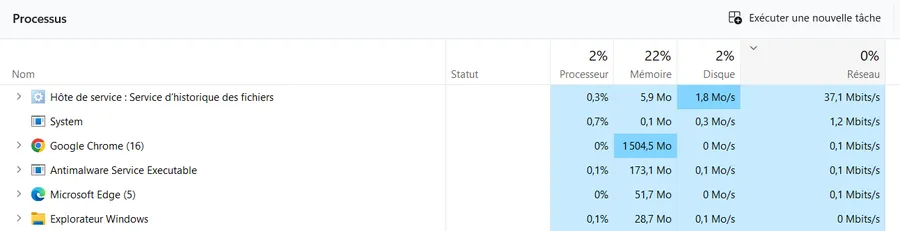

Question ouverte : bizarre j'ai l'impression que la synchronisation prend du temps alors que je n'ai modifié qu'un malheureux fichier texte. Faut que je regarde...

## Je n'ai pas réussi

À monitorer la synchronisation

* J'ai pu arrêter/redémarrer une sauvegarde qui était en cours mais bon...

* Via le Gestionnaire de tâches, je peux suivre l'activité réseau du Service d'historique des fichiers mais bon ce n'est pas top non plus.

## Test à faire avec OneDrive

Activer aussi la sauvegarde OneDrive et voir ce que cela donne. En effet si on sauvegarde sur disque SSD et dans OneDrive, d'où vont provenir les différentes versions d'un fichier ?

Pour activer OneDrive

* **CTRL + I**

* OneDrive (tout en haut à la hauteur du compte Microsoft)

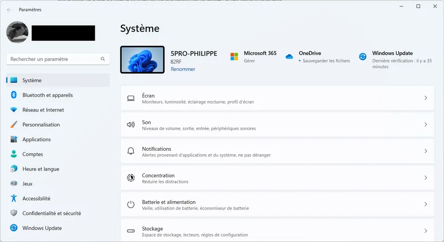

Ensuite c'est un peu la misère... En effet, si on joue le jeu et si on laisse à OneDrive le droit de synchroniser ce qu'il appelle les fichiers importants... Au pire, pour vérifier :

* Clic sur l'icône OneDrive de la barre de tâche

* Roue crantée

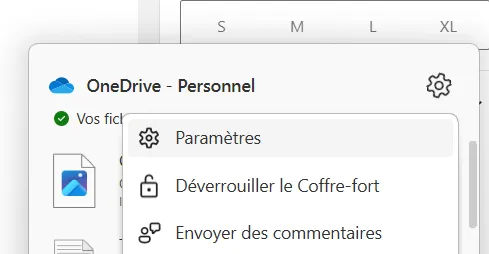

* Gérer la sauvegarde

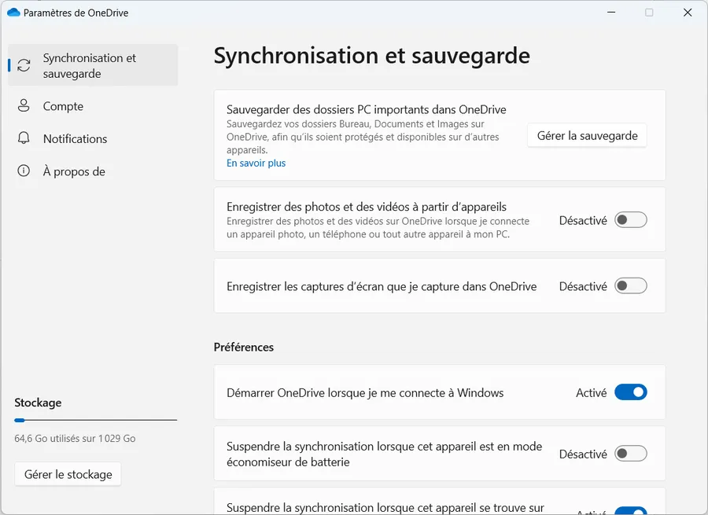

* Tout choisir et cliquer sur OK

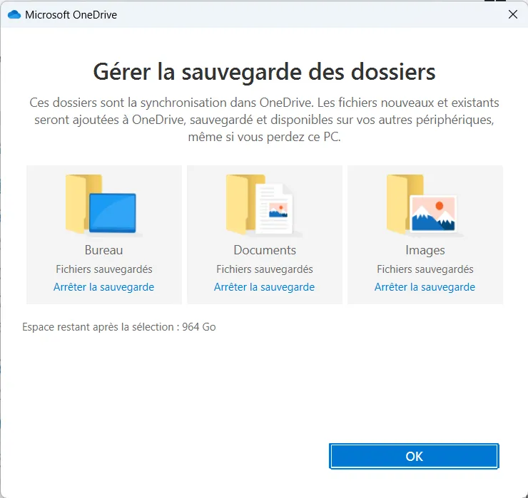

Les documents importants c'est donc Bureau, Documents et Images.

Bon bref, dans ce cas-là alors, le répertoire

* C:/Users/**NOM-UTILISATEUR**/Documents

N'existe plus. Il est transformé en un lien symbolique qui pointe sur le dossier

* C:\Users**NOM-UTILISATEUR**\OneDrive\Documents.

Il en va de même pour les dossiers Images et Bureau. Il est important de comprendre ce qui se passe et il faut prendre le temps de le vérifier dans le gestionnaire de fichiers. Dorénavant, quand dans le répertoire "Phili" je clique sur Documents je suis dirigé automatiquement vers le répertoire Philippe : personnel > Documents qui n'est autre que le répertoire C:\Users\Phili\OneDrive\Documents

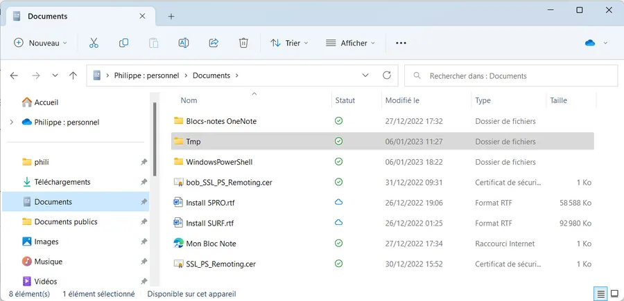

Ensuite pour la gestion de versions... ALT + ENTER sur le nom d'un fichier qui est synchronisé avec OneDrive ne donne plus rien (au moins dans mon cas. Attention j'ai peut-être fait des trucs qui ont mis à mal cette gestion de version... Je me rappelle plus trop).

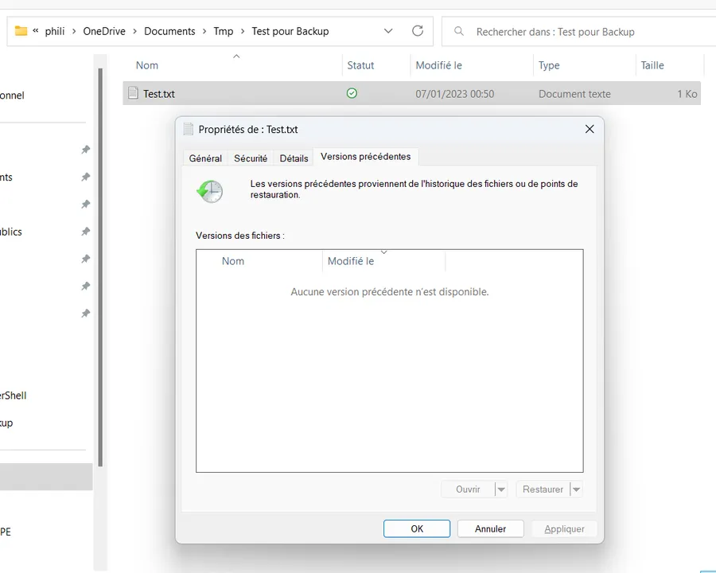

Cela dit, on accède aux différentes versions avec

* Clic droit

* OneDrive

* Historique des versions

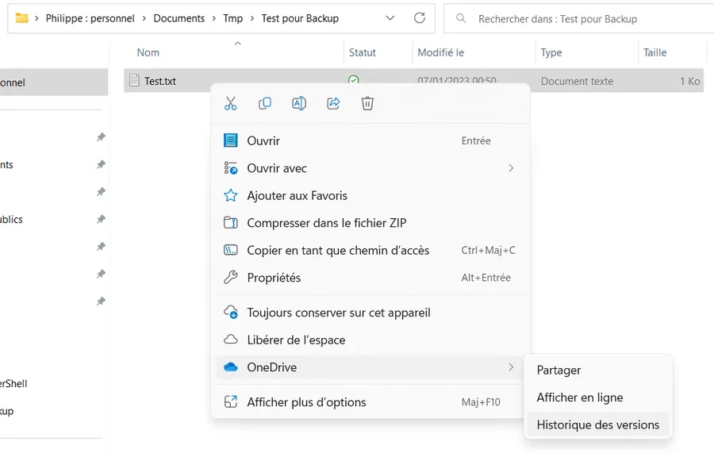

Exemple

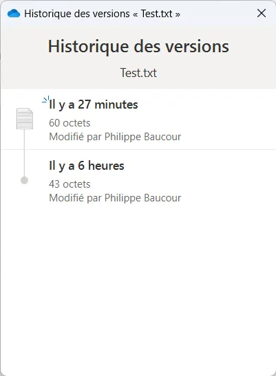

## Je ne comprends pas

Je ne comprends pas pourquoi OneDrive se limite à la trilogie Bureau, Documents, Images.

Pourquoi

1. Ne pas faire la même chose pour les répertoires Contacts, Favoris, Liens, Musique, Parties Enregistrées, Recherches, Téléchargements, Vidéos...

1. Proposer une option de synchronisation avec OneDrive quand un répertoire est créé dans mon User. Exemple typique : les machines virtuelles de VirtualBox qui sont stockées dans le répertoire C:\Users**NOM-UTILISATEUR**\VirtualBox VMs

## Conclusions

* Je vais laisser tourner le backup sur le disque SSD quelques jours afin de voir ce que cela donne
  + Le pour : les répertoires qui ne sont pas dans Bureau, Images et Documents seront sauvegardés
  + Le warning : si le backup continue à tourner alors que OneDrive est activé il faut sans doute exclure de la sauvegarde le répertoire C:/user/.../OneDrive
* À mon avis la messe est dite. OneDrive is the way to go.
* J'ai aussi un abonnement DropBox mais je trouve qu'il prend beaucoup trop de ressources au démarrage de Windows et qu'il ne permet pas, à un coup raisonnable, de partager simplement les photos entre les membres de la famille. Je ne vais pas le renouveler.
* Je vais chercher et voir comment ajouter des répertoires à OneDrive. Par exemple comment ajouter le répertoire Musique ou Téléchargement ? À mon avis c'est une question de création de lien symbolique. Je reviendrai sur cette page quand j'aurai une solution.

## Compléments

### Pour les répertoires Vidéos et Musique
* Clic droit sur le nom du répertoire
* Onglet emplacement
* Je mets à jour avec un chemin vers OneDrive
  + Exemple : C:\Users**NOM-UTILISATEUR**\OneDrive\Videos
* Si le répertoire n'existe pas il sera créé
* Windows demandera s'il faut transferer les fichiers etc. Dire oui à tout.

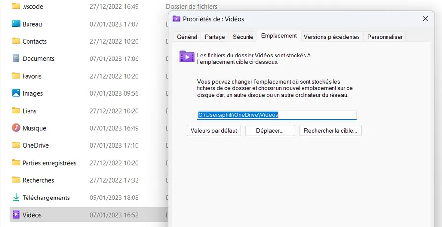

### Pour le répertoire des machines virtuelles de Virtual Box

C'est un exemple. Ce que l'on va faire ici est applicable à tout type de répertoire. Par exemple le répertoire Téléchargement pourrait être un bon candidat. Bref, ici c'est un répertoire qui se nomme "VirtualBox VMs", qui est sous le répertoire C:/Users/**NOM-UTILISATEUR** et qu'on souhaite rapatrier dans OneDrive (il n'est donc pas dans Bureau, Documents ou Images).

* Déplacement du répertoire C:/Users/**NOM-UTILISATEUR**/VirtualBox VMs vers C:\Users**NOM-UTILISATEUR**\OneDrive\VirtualBox VMs
  + C'est facile c'est du glissé-déposé
* Optionnel mais utile ici compte tenu de la taille des VM.
  + Clic droit sur le nom du répertoire
  + Choisir l'option" Toujours conserver sur cet appareil"

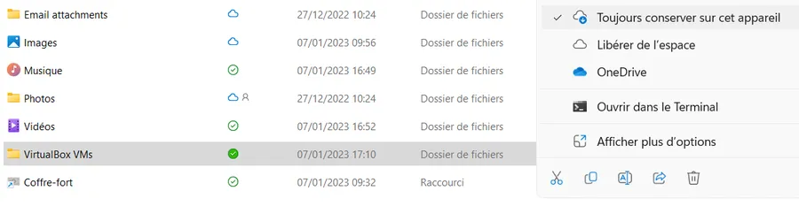

* Ouverture d'un terminal en mode **Administrateur** dans le répertoire C:/Users/**NOM-UTILISATEUR**/
* Saisir la commande suivante qui va créer, dans le répertoire courant, un répertoire nommé 'VirtualBox VMs' et qui sera un lien symbolique vers le répertoire qu'on vient de déplacer dans OneDrive.
* new-item -itemtype symboliclink -path . -name 'VirtualBox VMs' -value 'C:\Users**NOM-UTILISATEUR**\OneDrive\VirtualBox VMs\

Voilà ce que je vois dorénavant dans File Explorer dans le répertoire C:/Users/**NOM-UTILISATEUR**/

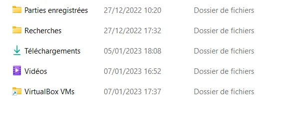

Sinon dans un terminal voilà ce que je vois quand je liste C:/Users/**NOM-UTILISATEUR**/

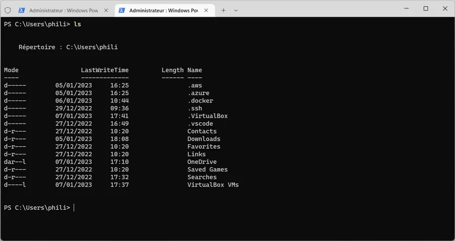

