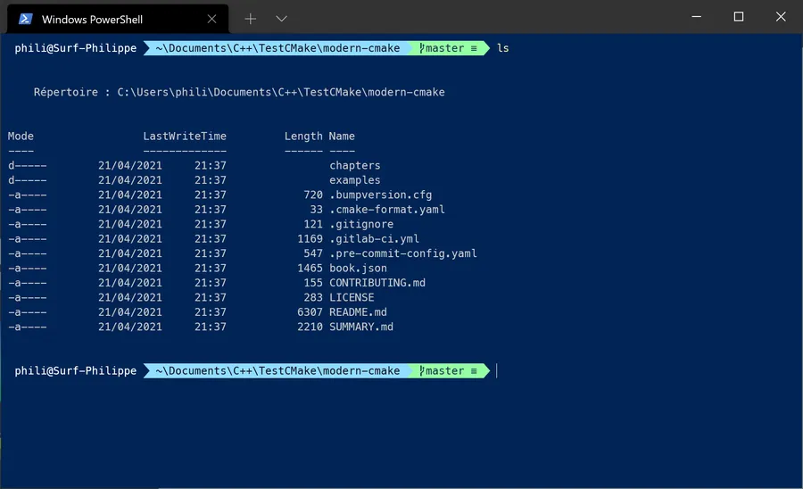
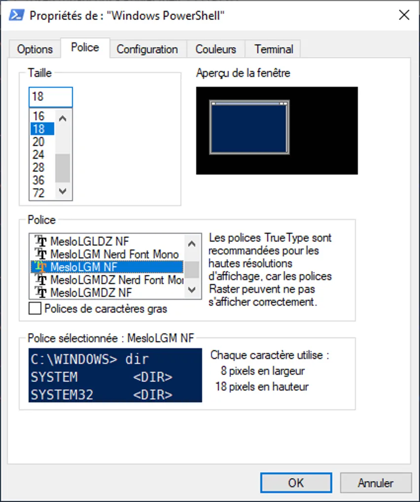
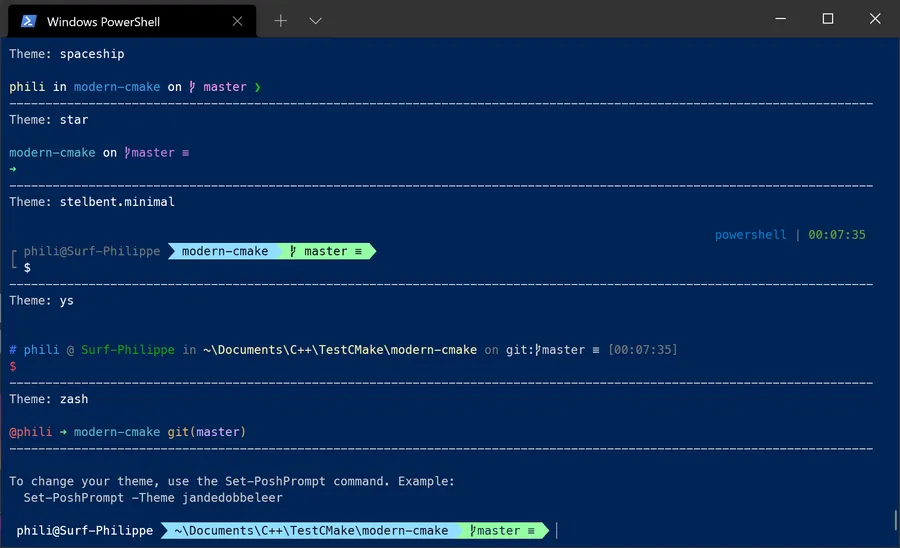
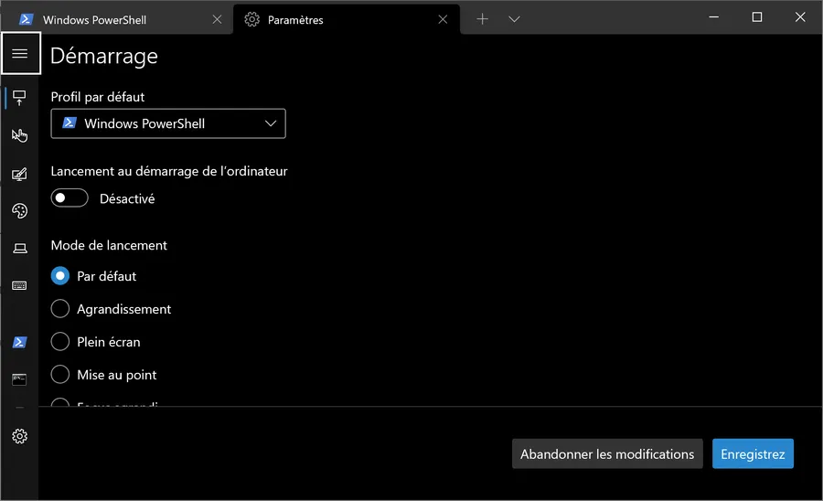
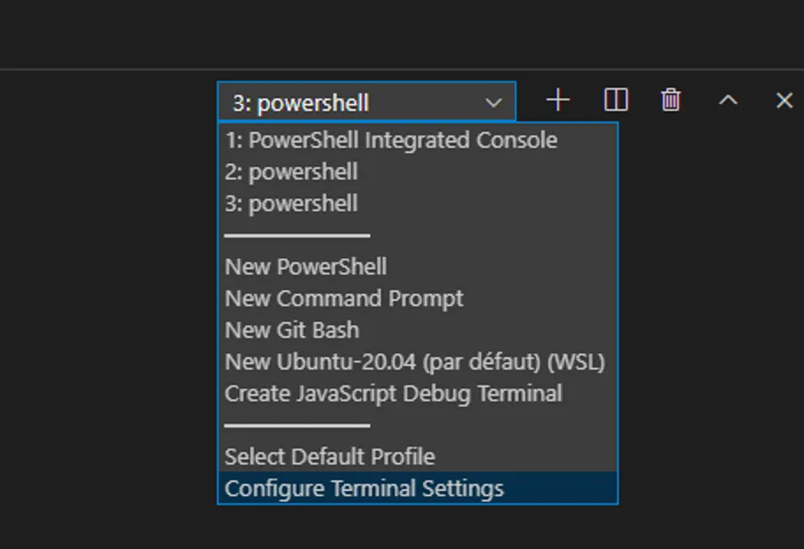
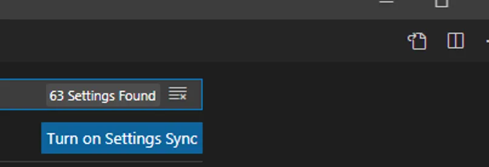
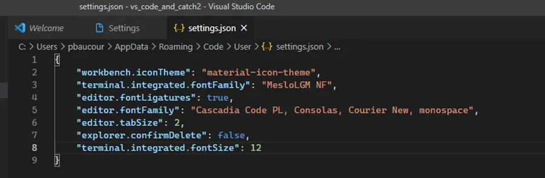
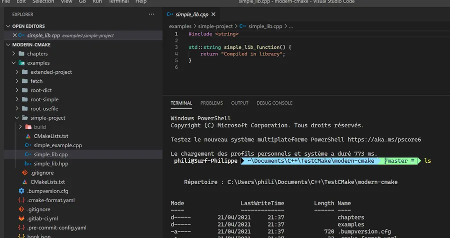

# Oh My Posh

## Introduction

**Avril 2021** : je fais une grosse mise à jour de cette page qui date de 2017. Ah oui, quand même...

Je vous propose une installation de Git, posh-git et de Oh-My-Posh étape par étape afin d'avoir des terminaux qui ressemblent à quelque chose surtout quand on travaille avec Git.

Typiquement voilà ce que cela peut donner dans un PowerShell sous Win Terminal. On voit tout de suite que le répertoire est un dépôt Git, qu'on est sur la branche master, qu'il n'y a pas de fichier modifié et rien dans le Stage.

<div align="center">
&nbsp;

&nbsp;
</div>


Rien de compliqué. Cette **check-list** a juste pour objectif de nous faire gagner du temps.


## Installer Git (si ce n'est pas encore fait)

2 solutions.

### 1 - Chocolatey

* Pour l'installation de chocolatey (voir cette [page](https://chocolatey.org/install)). Sinon voilà la version courte :
  + Ouvrir un PowerShell Admin (touches WIN + x puis taper sur a)
  + Coller le texte ci-dessous


```powershell
Set-ExecutionPolicy Bypass -Scope Process -Force; [System.Net.ServicePointManager]::SecurityProtocol = [System.Net.ServicePointManager]::SecurityProtocol -bor 3072; iex ((New-Object System.Net.WebClient).DownloadString('https://community.chocolatey.org/install.ps1'))
```

* Installation proprement dite de Git 
  + Dans le terminal admin précédent saisir coller le texte ci-dessous  

```powershell
choco install git -y  
```

Oui, oui on a l'air de perdre du temps... Mais la prochaine fois qu'on voudra mettre à jour tous les softs installés avec Chocolatey on aura juste à ouvrir un PowerShell Admin et à taper cette commande : 


```powershell
choco upgrade all
```


### 2 - Installation de Git classique

1. Aller sur <https://git-scm.com/download/win> pour récupérer l'installeur
2. Lancer l'installeur
3. "Aie confiance..." dis oui à tout.

Ensuite, bien sûr, faut configurer Git etc. Pour ça, on ne va pas chez [Ollivander](https://harrypotter.fandom.com/fr/wiki/Garrick_Ollivander) mais on peut aller voir [cette excellente vidéo](https://youtu.be/8JJ101D3knE)


## Installer posh-git

[Posh-git](https://github.com/dahlbyk/posh-git) permet d'avoir le statut Git du dépôt correspondant au répertoire dans lequel on se trouve. Cet état apparaît directement sur la ligne de commande. Pour installer posh-git il faut ouvrir ou continuer à utiliser le PowerShell Admin précédent et saisir les 2 lignes suivantes :

```powershell
Set-ExecutionPolicy -Scope LocalMachine -ExecutionPolicy RemoteSigned -Force
Install-Module -Name posh-git -Scope CurrentUser -Force
```

Si tu as un dépôt Git sur ton disque vas-y et jette ton oeil sur le prompt...


## Installer Oh my Posh

[Oh my Posh](https://ohmyposh.dev/), permet de rendre l'affichage de posh-git beaucoup plus beau. Dans le même terminal PowerShell Admin que précédemment, il faut saisir l'une des 2 lignes suivantes selon que vous utilisez Chocolatey ou pas. 

### Chocolatey
```powershell
choco install oh-my-posh
```

### Manuelle
```powershell
Set-ExecutionPolicy Bypass -Scope Process -Force; Invoke-Expression ((New-Object System.Net.WebClient).DownloadString('https://ohmyposh.dev/install.ps1'))
```


### Installation de la police Meslo

Oh my Posh utilise les polices [Nerd Fonts](https://www.nerdfonts.com/#home). Ces polices contiennent tout un tas de logos, d'icônes etc.

1. Aller sur cette [page](https://www.nerdfonts.com/font-downloads)
2. Télécharger la Meslo par exemple
3. Dézipper et installer la police (click droit, choisir "installer la police")

*Normalement c'est terminé, non ?* 

Presque, on y est presque... Faut juste qu'on prenne tout ça en compte dans les différents terminaux qu'on utilise le plus.


## Tuning de PowerShell

En haut à gauche de la fenêtre PowerShell qu'on a sous les yeux, il faut aller dans Propriétés/Police et choisir MesloLGM NF par exemple si on a installé la police Meslo. Compte tenu de mon écran, j'en profite pour mettre une taille de 18.

<div align="center">
&nbsp;

&nbsp;
</div>


Pour voir ce que peut donner Oh my Posh on peut saisir la commande suivante dans le PowerShell : `Get-PoshThemes`

Oh my Posh va alors afficher tous les thèmes dont il dispose. Par exemple, voilà ce que cela donne chez moi.

<div align="center">

</div>


Pour choisir un thème on peut suivre les instructions en bas de l'écran et taper, par exemple, un truc du style : `Set-PoshPrompt -Theme jandedobbeleer`


### Mettre à jour son profile PowerShell

Dans une console PowerShell taper

```powershell
echo $PROFILE
```

Ensuite il faut se déplacer dans le répertoire qui vient de s'afficher. Typiquement c'est quelque chose de la forme : `C:\Users\phili\Documents\WindowsPowerShell\`

Là, il faut éditer le fichier Microsoft.PowerShell_profile.ps1

```powershell
code ./Microsoft.PowerShell_profile.ps1
```

Voilà à quoi ressemble mon fichier profile

```powershell
Import-Module posh-git
Set-PoshPrompt -Theme powerLine
```

Ensuite il faut ouvrir un nouveau PowerShell pour vérifier que le bon thème Oh my Posh est utilisé.


## Tuning de Win Terminal

Si Win Terminal n'est pas encore sur votre PC je ne peux plus rien faire pour vous. Vous êtes perdu pour la cause 😡. Au pire, essayez un petit `choco install microsoft-windows-terminal` dans un PowerShell Admin... À vous de voir 😉

On lance win terminal : Touche WIN puis on tape "wt"

Ensuite on affiche les paramètres : CTRL + virgule

<div align="center">
&nbsp;

&nbsp;
</div>


Enfin, il faut cliquer sur la roue crantée en bas à gauche. VSCode doit s'ouvrir sur le fichier settings.json. Je ne montre pas tout mais voilà la section relative à PowerShell dans Win Terminal.

<div align="center">
&nbsp;

&nbsp;
</div>


Afin d'éditer les settings en mode texte plutôt qu'en mode graphique, lorsque les settings sont affichés, je propose de cliquer sur l'icône en forme de fichier en haut à droite.

<div align="center">
&nbsp;

&nbsp;
</div>


Voilà à quoi ressemble les settings du terminal de mon VSCode

<div align="center">
&nbsp;

&nbsp;
</div>


Il faut bien faire attention à la ligne 3 qui règle la police du terminal (et pas celle de l'éditeur... J'ai un peu cafouillé là-dessus...) ainsi qu'à la ligne 8 qui règle sa taille. Là, il a fallu que j'ajuste un peu car parfois l'affichage dans le terminal de VSCode n'était pas aussi propre que celui de Win Terminal ou de PowerShell. Chez moi avec une taille de 12 tout est propre.

Exemple de que cela donne finalement dans VSCode

<div align="center">
&nbsp;

&nbsp;
</div>


Bon allez, normalement vous êtes prêts. À vous de jouer.

