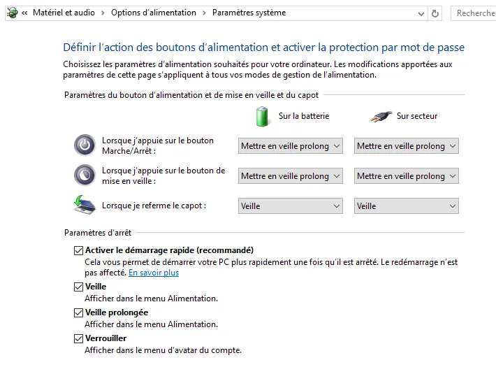

# Mes notes Windows
{: .no_toc }

## Table of Contents
{: .no_toc .text-delta}
- TOC
{:toc}


<!-- ###################################################################### -->
<!-- ###################################################################### -->
## Introduction

Je regroupe ici un ensemble de notes diverses à propos de Windows 10 & 11.   
Les notes sont classées par ordre alphabétique.  
Sinon faites CTRL+F et tapez un mot clé : "Mise en veille" ou "ISO" par exemple.  
Il y a aussi une TOC juste au dessus.  

Il est possible qu'avec les mises à jour de Windows, certaines boîtes de dialogue changent ou que la mise en page évolue. Cela dit vous devriez vous y retrouver.  
Si je fais des mises à jour importantes je l'indiquerai clairement.  
Si vous cherchez des raccourcis clavier Windows, allez plutôt sur cette [page] ``NOT YET TRANSFERED`` (https://www.40tude.fr/win10-raccourcis-clavier/).  


<!-- ###################################################################### -->
<!-- ###################################################################### -->
## Application en mode admin

* WIN + R
* Saisir le nom de l'application (regedit par exemple)
* CTRL + SHIFT + ENTER


<!-- ###################################################################### -->
<!-- ###################################################################### -->
## Bash Shell (Linux)

### Mise à jour Déc 2022
{: .no_toc }

Lire cette [page](https://devblogs.microsoft.com/commandline/the-windows-subsystem-for-linux-in-the-microsoft-store-is-now-generally-available-on-windows-10-and-11/) puis aller sur le [Windows Store](https://apps.microsoft.com/store/detail/windows-subsystem-for-linux/9P9TQF7MRM4R?hl=fr-fr&gl=fr)

À partir du prompt de la console, pour retrouver son répertoire d'utilisateur Windows il faut taper un truc du style :

```bash
cd /mnt/c/Users/phili/
```

À partir du prompt PowerShell, retrouver son répertoire d'utilisateur Linux.

```powershell
cd C:\Users\phili\AppData\Local\lxss\home\philippe
```

Le répertoire "lxss" n’apparaît pas du tout dans l'explorateur de fichier (même si les fichiers cachés sont censés être visibles). On peut bien sûr saisir le chemin à la main dans la barre de chemin (voir la barre en haut de la fenêtre ci-dessous)

<div align="center">
&nbsp;

&nbsp;
</div>

### Notes
{: .no_toc }

* Lire cette [page](https://www.howtogeek.com/249966/how-to-install-and-use-the-linux-bash-shell-on-windows-10/) pour plus d'information (police etc.)

* Voir cette [vidéo](https://channel9.msdn.com/Events/Ignite/Australia-2017/WIN321b)


<!-- ###################################################################### -->
<!-- ###################################################################### -->
## Gestionnaire de tâches

* CTRL + SHIFT + Esc


<!-- ###################################################################### -->
<!-- ###################################################################### -->
## Menu contextuel long

### Nov 2023 (WIN11 23H2)
{: .no_toc }

* Regedit
* ``HKEY_CURRENT_USER\SOFTWARE\CLASSES\CLSID``
* Nouvelle clé
  + **86ca1aa0-34aa-4e8b-a509-50c905bae2a2**
  + Nouvelle clé
    - **InprocServer32**
    - Dans la fenêtre, double-cliquer sur "par défaut".
    - Aucune modification. 
    - OK pour appliquer une valeur par défaut
* Redémarrer


<!-- ###################################################################### -->
<!-- ###################################################################### -->
## Mise à jour avec une image ISO

Je suis sous Windows 10. Si il s'agit de faire la mise à jour tout en préservant ses fichiers, on peut appliquer la méthode suivante :

* Télécharger l'image ISO
* La mettre dans le répertoire "Téléchargements" par exemple
* Click droit sur le nom du fichier et choisir "Monter"
* Double click sur le "Setup.exe"
* Penser à bien préciser de ne pas tout supprimer mais de garder les users en place
* Window va redémarrer plusieurs fois mais tout va bien se passer
* Pour vérifier à la fin la version de Window
  + Win + R
  + Taper "winver" puis ENTER

Pour refaire une installation complète à partir d'une clé USB, [consultez cette page]().


<!-- ###################################################################### -->
<!-- ###################################################################### -->
## Mise en veille : déterminer ce qui empêche la mise en veille

1. Win + X
1. PowerShell (admin)
1. Saisir

```powershell
powercfg /requests
```

En ce qui me concerne voilà ce que je peux voir :

<div align="center">
&nbsp;

&nbsp;
</div>


Dans ce cas très précis, saisir :

```powershell
powercfg -requestsoverride DRIVER "srvnet" SYSTEM
powercfg -requestsoverride DRIVER "\FileSystem\srvnet" SYSTEM
```

Je "pense" mais je ne suis pas sûr à 100% que seule la première ligne est suffisante.  
Si la raison est différente, faire une recherche sur le service/application qui pose problème.  


<!-- ###################################################################### -->
<!-- ###################################################################### -->
## Mise en veille : faire apparaître l'option "Mise en veille prolongée"

1. Win + X
1. Options d'alimentation
1. Clic sur "Choisir l'action des boutons d'alimentation"
1. Clic sur "Modifier des paramètres actuellement non disponibles"
1. Cocher "Veille prolongée"
1. Ensuite, voilà ce que je choisis comme action

<div align="center">
&nbsp;

&nbsp;
</div>

### Notes rapides
{: .no_toc }

1. Quand j'appuie sur le bouton On/Off ou sur le bouton de mise en veille (Fn + F1 sur mon portable) je veux être sûr de ne rien perdre donc : "Mise en veille Prolongée".
1. Entre deux réunions, je rabats le capot. Une simple mise en veille est suffisante car je sais que je vais le rouvrir bientôt.


<!-- ###################################################################### -->
<!-- ###################################################################### -->
## Mise en veille prolongée

### Mise à jour Déc 2022
{: .no_toc }

Il faut absolument aller vois cette vidéo

<iframe width="560" height="315" src="https://www.youtube.com/embed/OHKKcd3sx2c?si=9XAPkYg1McZ4aeUP" title="YouTube video player" frameborder="0" allow="accelerometer; autoplay; clipboard-write; encrypted-media; gyroscope; picture-in-picture; web-share" referrerpolicy="strict-origin-when-cross-origin" allowfullscreen></iframe>


À **retenir** quand on utilise un portable :
1. Je débranche
1. Je rabats


Par exemple mon Surface Book ne supporte que le mode S0

<div align="center">
&nbsp;

&nbsp;
</div>


Finalement, sin Win10 22H2, voilà mes paramètres actuels. Je garde en tête qu'en mode "veille prolongée" le PC est toujours susceptible de répondre à des solicitations issues du réseau (téléchargement de mises à jour...) et qu'il faut vraiment l'éteindre si on ne veut pas que la batterie se vide.

<div align="center">
&nbsp;

&nbsp;
</div>


Pour info on voit que par rapport à ce que je pouvais avoir avec d'autres portables, j'ai pas le mode hybride etc.

<div align="center">
&nbsp;

&nbsp;
</div>


Le truc à retenir c'est qu'il faut : 
* Etre vigilant
* Prendre le temps d'aller voir la vidéo
* Mettre un pouce en l'air
* Espérer que Microsoft et les constructeurs de PC corrigent le tir.


### Texte original
{: .no_toc }

Pour qu'en mon absence, le portable ce mette tout seul en veille prolongée au bout de 10 min.

1. Win + X
1. Options d'alimentation
1. Paramètres d'alimentation supplémentaires
1. Clic sur "Modifier les paramètres du mode"
1. Clic sur "Modifier les paramètres du mode avancés"

<div align="center">

</div>

### Explications rapides
{: .no_toc }

1. La veille hybride concerne les PC continuellement alimentés. Windows stocke en mémoire et sur disque les applications et les documents ouverts. Il met ensuite le PC dans un mode où il coupe presque tout mais où la mémoire reste alimentée. En cas de coupure de courant on retrouve normalement sa session.
1. La veille classique consomme trop. Fichiers et documents sont en mémoire. Si on "oublie" le PC, quand il n'y a plus de batterie on perd tout.
1. Le veille prolongée vide la mémoire sur disque et éteint le portable. C'est ce que je veux. Je met donc :
    1. Mise en veille classique à  "Jamais"
    1. Je désactive le veille hybride afin d'autoriser la veille prolongée
    1. Je met 10 min. pour la veille prolongée
1. Clic sur "Appliquer" puis sur "OK"


<!-- ###################################################################### -->
<!-- ###################################################################### -->
## OneDrive : supprimer le dossier dupliqué dans Explorer

1. Win + R
1. Taper ``regedit`` puis Enter.
1. Aller dans ``HKEY_CURRENT_USER``
1. ``SOFTWARE``
1. ``Microsoft``
1. ``Windows``
1. ``CurrentVersion``
1. ``Explorer``
1. ``Desktop``
1. ``NameSpace``
1. Cliquer sur les différentes entrées sous NameSpace (long code hexa). Lire dans la partie droite le nom du dossier.
1. Quand le coupable est trouvé, clic droit sur le code hexa et choisir "Supprimer"
1. Explorer est mis à jour instantanément


<!-- ###################################################################### -->
<!-- ###################################################################### -->
## OneDrive : éviter d'enregistrer dessus par défaut

1. Clic droit sur l’icône OneDrive
1. Paramètres
1. Onglet Enregistrement Automatique
1. Choisir "Ce PC uniquement"


<!-- ###################################################################### -->
<!-- ###################################################################### -->
## Point de restauration : appliquer

* Win + R puis saisir "RSTRUI". On peut aussi faire Win + S, taper "Restauration"
* Cliquer sur le bouton "Restauration du système..."
* Cliquer sur "Suivant>"
* Choisir le nom de la restauration à appliquer


<!-- ###################################################################### -->
<!-- ###################################################################### -->
## Point de restauration : créer

**Rappel** : on ne peut pas créer plus d'un point de restauration par jour.

* Win + S
* Taper "Restauration"
* Si besoin cliquer sur "Configurer" pour activer la protection
* Cliquer sur le bouton radio "Activer la protection du système"
* Je décide pour l'instant que la protection pourra utiliser jusqu'à 25% du disque

<div align="center">
&nbsp;

&nbsp;
</div>


* Cliquer sur Appliquer puis sur OK
* Cliquer alors sur le bouton "Créer..." de la boîte de dialogue "Propriétés système"
* Saisir une description. Exemple : "Restauration avant installation de XYZ"
* Cliquer sur le bouton "Créer"

Aller voir cette [page](http://winaero.com/blog/restore-point-windows-10-powershell/) pour le faire dans PowerShell.

Pour voir où sont les fichiers de restauration sur le disques dur

* Win + E
* Clic sur "Affichage"
* Puis clic sur "Options" (tout à droite)
* Clic sur l'onglet "Affichage"
* Décocher la case "Masquer les fichiers protégés du système d'exploitation"
* Clic sur le bouton "Oui" de la boite de dialogue
* Clic sur le bouton "OK"
* Aller sur c:\
* Double clic sur le répertoire "System Volume Information"
* Malheureusement même quand on le voit on ne peut pas l'ouvrir (même l'admin)
* Bon allez on referme tout (Affichage/Options/Affichage/Masquer)


<!-- ###################################################################### -->
<!-- ###################################################################### -->
## Point de restauration : supprimer

* Win + S
* Taper "Nettoyage"

<div align="center">
&nbsp;

&nbsp;
</div>


* Onglet "Autres options"
* Section "Restauration du système et clichés instantanés"
* Cliquer sur "Nettoyer...". Tous les points de restauration seront supprimés sauf le dernier

<div align="center">
&nbsp;

&nbsp;
</div>


<!-- ###################################################################### -->
<!-- ###################################################################### -->
## PowerShell : Power User Menu

1. Clic droit dans la barre de tâche
1. Choisir Paramètres
1. Choisir l'option qui va bien. Elle commence par "Remplacer Invite de commande..."
1. Ensuite avec Win + X on a les options PowerShell et Powershel (admin) dans le menu

### Note
Penser à ouvrir de suite une console en mode Admin et à taper :

```
Update-Help
```

Ensuite c'est plus sympa (qu'on soit Admin ou pas) quand on cherche de l'aide sur une commande.  
Exemple : 

```powershell
help ls
```


<!-- ###################################################################### -->
<!-- ###################################################################### -->
## PowerShell : autoriser les scripts

Entre autres, celui le script démarrage

1. Win + X
1. Console PowerShell en mode Admin
1. Saisir

```powershell
Set-ExecutionPolicy RemoteSigned
```
4. Taper 'T'


<!-- ###################################################################### -->
<!-- ###################################################################### -->
## PowerShell : créer un script de démarrage

Pour faire démarrer PowerShell dans un répertoire particulier ou bien lancer le profile posh-git par exemple

1. Win + X
1. Choisir PowerShell
1. Taper :

```powershell
New-Item -path $profile -type file –force
```

4. Aller dans  C:\Users\xyz\Documents\WindowsPowerShell
1. Modifier le contenu du fichier Microsoft.PowerShell_profile.ps1

Pour modifier le répertoire on peut taper :

```powershell
Set-location .\Documents\
```


<!-- ###################################################################### -->
<!-- ###################################################################### -->
## PowerShell : démarrer dans un répertoire particulier

1. Dans $HOME$/Documents/WindowsPowerShell
1. Editer le ficher Microsoft.PowerShell_profile.ps1 comme suit par exemple

```powershell
# default directory
Set-location $HOME\Documents\
```

Pour prendre en compte le nouveau profile, pas besoin de fermer le PowerShell.  
Il suffit de saisir :

```powershell
.$PROFILE
``` 


<!-- ###################################################################### -->
<!-- ###################################################################### -->
## Power User Menu

* Win + x


<!-- ###################################################################### -->
<!-- ###################################################################### -->
## Raccourcis

Voir cette page pour quelques [raccourcis clavier]`NOT YET TRANSFERED` (https://www.40tude.fr/win10-raccourcis-clavier/) utiles.


<!-- ###################################################################### -->
<!-- ###################################################################### -->
## Tâches au démarrage

Pour désactiver Adobe Acrobat Update Service par exemple

1. Win +R
1. Taper **msconfig**
1. Aller dans l'onglet Services
1. Décocher qui vous voulez!


<!-- ###################################################################### -->
<!-- ###################################################################### -->
## Tâches programmées

Pour désactiver ``CompatTelRunner.exe`` par exemple

1. Win + R
1. Taper **taskschd.msc**
1. Rechercher Microsoft Compatibility Appraiser (\Microsoft\Windows\Application Experience)
1. Click droit
1. Disable


<!-- ###################################################################### -->
<!-- ###################################################################### -->
## Test micro

### Nov 2023 (WIN11 23H2)
{: .no_toc }

* https://fr.mictests.com/
* https://www.malekal.com/le-micro-non-detecte-windows-11/
* WIN + R
* mmsys.cpl


<!-- ###################################################################### -->
<!-- ###################################################################### -->
## Utilisateurs : gestion

Pour supprimer defaultuser0 par exemple.

1. Win +R
1. Taper **lusrmgr.msc**
1. Supprimer **defaultuser0**


<!-- ###################################################################### -->
<!-- ###################################################################### -->
## Variable d'environnement PATH

1. Win + Pause
1. Clic sur "Paramètres Système Avancés" (liste à gauche, tout en bas)
1. Clic sur bouton "Variables d'environnement" (tout en bas)
1. Double clic sur "PATH" dans la liste
1. Clic sur "OK", "OK", "OK"
1. Fermer et relancer la console Powershell (ou la console)

<div align="center">
&nbsp;

&nbsp;
</div>


<!-- ###################################################################### -->
<!-- ###################################################################### -->
## Version courante

Pour vérifier le N° de la version installée

1. Win + I
1. Système
1. Information Système (tout en bas à gauche)
1. On accède au numéro de Version

Retrouver la version en cours : <https://technet.microsoft.com/fr-fr/windows/release-info.aspx>


<!-- ###################################################################### -->
<!-- ###################################################################### -->
## VMWare : Problème de résolution écran sur Surface Pro

La résolution du Surface Pro est très grande et les machines virtuelles Debian ou Ubuntu se retrouvent avec des polices toutes petites. C'est très désagréable.

1. Touche Win
1. Cliquer droit sur l'icône VMWare Worksation 12
1. Choisir Plus/Emplacement du fichier
1. Cliquer droit et choisir Propriétés
1. Onglet Compatibilité
1. Cocher "Remplacez le comportement de mise à l'échelle..."
1. Choisir "Système amélioré" dans la liste

<div align="center">
&nbsp;

&nbsp;
</div>


<!-- ###################################################################### -->
<!-- ###################################################################### -->
## Windows Old : supprimer

1. Win + S
1. Taper "Nettoyage"
1. Bouton "Nettoyer les fichiers système"
1. Cocher "Précédente(s) installation(s) de Windows"
1. Cliquer sur "Ok" puis confirmer en cliquant sur "Supprimer les fichiers"

<div align="center">
&nbsp;

&nbsp;
</div>

<div align="center">
&nbsp;

&nbsp;
</div>
