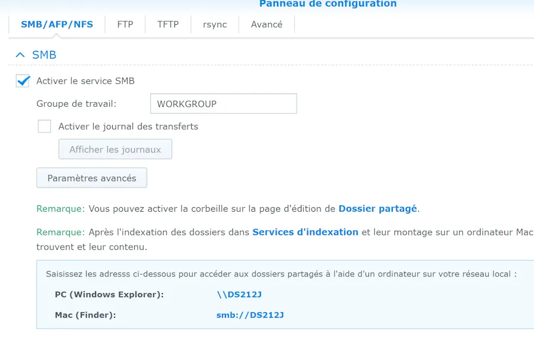
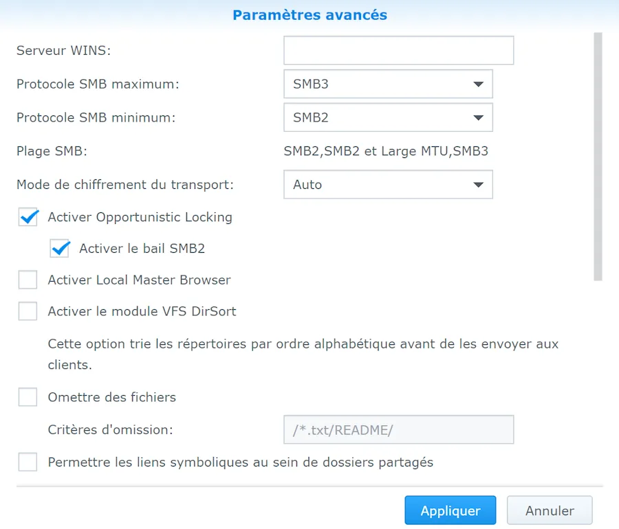
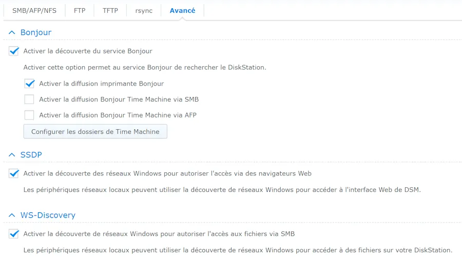
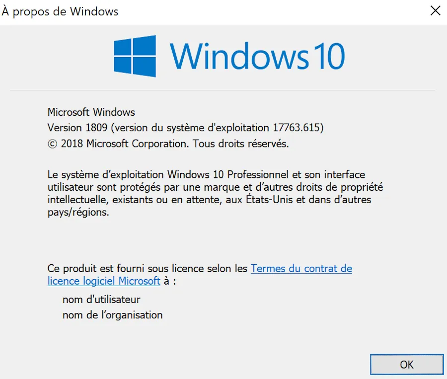
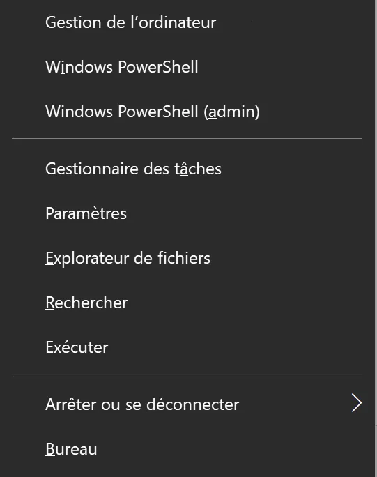
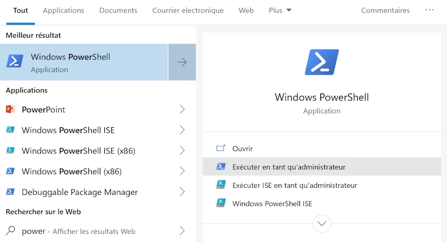
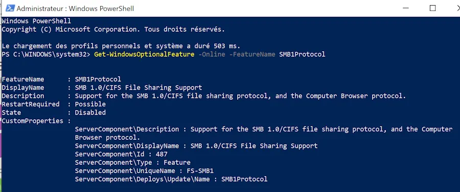
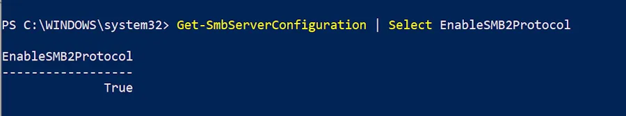
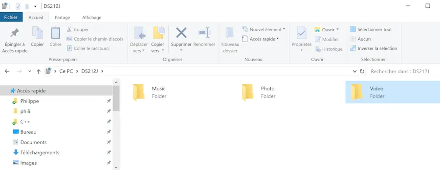

# Accès au Synology

## Introduction
Depuis quelques temps déjà, à partir du gestionnaire de fichiers (là où je tape ``\\DS212J`` dans la barre en haut de la fenêtre), je n'arrivais plus à accéder au Synology à partir d'un des PC Windows 10 de la maison. Tous les autres PC, téléphones et autres Freebox n'avaient aucun problème.

Voilà ce que j'ai dû faire pour pouvoir y accéder de nouveau. Pour faire court, il s'agit d'un souci de configuration Samba (SMB). Le but de la manipulation est de s'assurer que le Synology cause, à minima en SMB2 et que le poste Windows ne cause plus en SMB1


## Check list
Sur le Synology, dans le Panneau de Configuration, dans la section Services de Fichiers et l'onglet ``SMB/AFP/NFS`` voilà ce que j'ai :

<div align="center">
&nbsp;

&nbsp;
</div>


Ensuite faut cliquer sur le bouton ``Paramètres avancés``. Voilà les paramètres que j'utilise:

<div align="center">
&nbsp;

&nbsp;
</div>

De retour dans la fenêtre Services de Fichiers, faut aller dans l'onglet ``Avancé``. Il faut s'assurer que l'option ``WS-Discovery`` (tout en bas) est bien activée. Voir ci-dessous :

<div align="center">
&nbsp;

&nbsp;
</div>

On en a terminé avec le Synology. On passe maintenant au PC. J'ai une version Pro. Je le mentionne car je crois que les config réseau par défaut diffèrent entre les versions Pro et Familiale. Au pire, pour vérifier :

* Clique sur le bouton Windows du clavier
* Tape "winver"
* Presse ENTER

Voilà ce que j'ai aujourd'hui comme config et comme révision (1809)

<div align="center">
&nbsp;

&nbsp;
</div>

On va commencer par vérifier si SMB1 est encore actif sur la machine. Pour cela il faut lancer une console Powershell en mode Administrateur et taper une ligne de commande.

Pour lancer Powershell, en ce qui me concerne, je presse la touche Windows et la touche "X". Le menu déroulant arrive à gauche et je choisis alors Windows Powershell (admin)

<div align="center">
&nbsp;

&nbsp;
</div>

Si l'option n'est pas possible chez vous, il faut taper sur la touche Windows puis taper "Power". Le menu arrive en bas à gauche. Il faut alors choisir "Exécuter en tant qu'administrateur"

<div align="center">
&nbsp;

&nbsp;
</div>

Une fois la console à l'écran, afin de vérifier si SMB1 est activé (ou pas) sur la machine il faut copier la ligne ci-dessous et la coller dans la console

```powershell
Get-WindowsOptionalFeature -Online -FeatureName SMB1Protocol
```

Il n'y a aucun risque puisque à ce stade on demande juste si SMB1 est dispo ou pas. Par exemple ci-dessous, on voit qu'il n'est plus disponible sur ma machine (ligne ``state : disable``)

<div align="center">
&nbsp;

&nbsp;
</div>

Si SMB1 est encore dispo sur la machine alors il faut le désactiver. Pour cela il faut copier/coller la ligne ci-dessous dans la console

```powershell
Disable-WindowsOptionalFeature -Online -FeatureName SMB1Protocol
```

Maintenant, pour savoir si SMB2 est actif sur la machine il faut copier/coller la ligne ci-dessous :

```powershell
Get-SmbServerConfiguration | Select EnableSMB2Protocol
```

Si besoin, afin d'installer SMB2 il faut copier/coller la ligne ci-dessous

```powershell
Set-SmbServerConfiguration -EnableSMB2Protocol $true
```

Faudra peut être redémarrer. Pour finir, on peut vérifier que SMB2 est bien installé via la commande précédente. Voilà ce que je vois sur ma machine :

<div align="center">
&nbsp;

&nbsp;
</div>

Suite au redémarrage du PC j'accède de nouveau à certains répertoires (pas tous) du Synology. Bizarrement je ne vois plus mon "home" ni le répertoire "homes".

<div align="center">
&nbsp;

&nbsp;
</div>

*La suite au prochain épisode...*

