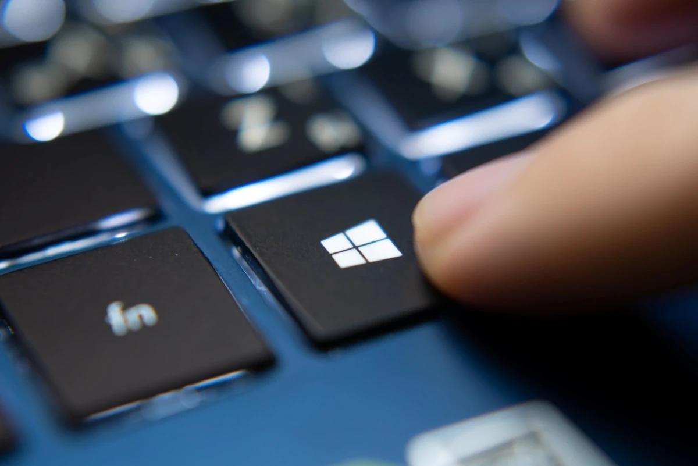

# {{ page.title }}
{: .no_toc }

{{ page.description }}
{: .lead }

<figure style="max-width: 600px; margin: auto; text-align: center;">

<!-- <figcaption>TODO: Add a legend</figcaption> -->
</figure>

Cette page n'est qu'un listing des raccourcis clavier que j'utilise régulièrement.
Allez faire un tour sur cette page pour [quelques manipes utiles]() sous Windows.
S'il y a d'autres raccourcis clavier que je me mets à utiliser je ferai une mise à jour de cette page.

## Mon top du top

| RACCOURCIS CLAVIER                                   | DESCRIPTION            |
| :--------------------------------------------------- |:---------------------- |
| Windows + E                                          | Explorateur de fichiers |
| Windows + Shift + s                                  | Capture écran |
| Ctrl + Shift + Echap                                 | Gestionnaire de tâches |
| Alt + Tab                                            | Les tâches |
| Windows + X + I ou + A (admin)                        | Terminal normal ou admin |
| Windows + R                                          | Run une commande |
| Windows + ²                                          | Terminal en mode Quake |

| RACCOURCIS CLAVIER                                   | DESCRIPTION            |
| :--------------------------------------------------- |:---------------------- |
| Windows + Shift + S                                  | Capture écran |
| Ctrl + Shift + Echap                                 | Gestionnaire de tâches |
| Alt + Tab                                            | Les tâches |
| Windows + Tab                                        | Applis & bureaux (Tab pour switcher entre Apps & Bureaux. Flêche pour naviguer) |
| Windows + Ctrl + D                v                   | Crée un nouveau bureau virtuel |
| Windows + Ctrl + flèche gche/drte                    | Circule dans les bureaux |
| Windows + Ctrl + F4                                  | Ferme le bureau virtuel en cours d’utilisation |

| RACCOURCIS CLAVIER                                    | DESCRIPTION            |
| :---------------------------------------------------- |:---------------------- |
| Windows + taper le nom de l'appli ("Exc" par exemple) | Retrouve l'appli |
| Windows + D                                           | Desktop |
| Windows + E                                           | Explorateur de fichiers |
| Windows + X                                           | Quick Access Menu (penser à remplacer l'option console par powershell) |
| Windows + I                                           | Centre de paramètres (Comptes, Mise à Jour & Sécurité...) |
| Windows + R                                           | Run une commande |
| Windows + L                                           | Lock l'écran |
| Windows + A                                           | Centre de notifications |
| Windows + S                                           | Cortana en mode saisie |
| Windows + Q                                           | Cortana en mode requête vocale |
| Windows + Alt Gr + Imp Ecran                          | Copie la fenêtre active (faut faire ctrl+v dans paint) |
| Windows + Impr écran                                  | Capture l'écran (faut faire ctrl+v dans paint) |

| RACCOURCIS CLAVIER                                    | DESCRIPTION            |
| :---------------------------------------------------- |:---------------------- |
| Windows + flèche du haut                              | Maximise la fenêtre |
| Windows + flèche du bas                               | Fenêtre taille normale puis dans la barre des tâches |
| Windows + flèche gauche (plrs fois)                   | 1/2 gauche, 1/2 droite, centre écran |
| Windows + flèche gauche, bas, gauche, haut            | 1/2 gauche, 1/4 bas gauche, 1/4 bas dte, 1/2 dte |

