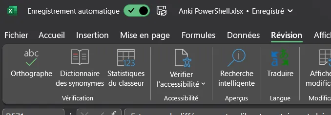
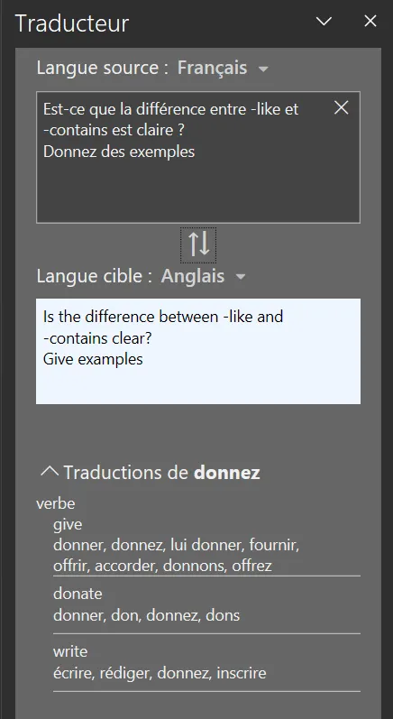
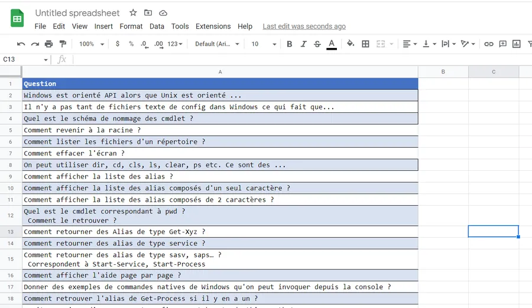
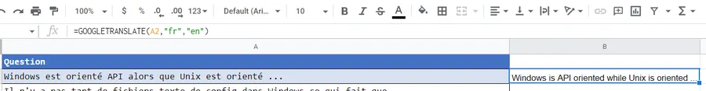
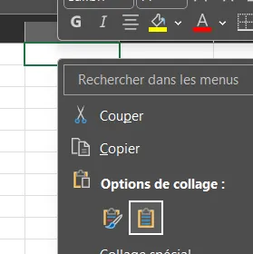
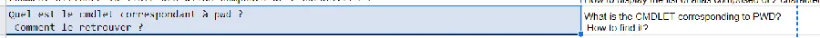
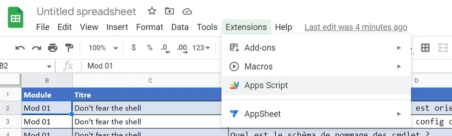
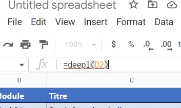

# 4 méthodes pour traduire une feuille Excel
{: .no_toc }

## Table of Contents
{: .no_toc .text-delta}
- TOC
{:toc}


## Introduction

Je suis en train d'apprendre [PowerShell](https://fr.wikipedia.org/wiki/Windows_PowerShell) (ça c'est vraiment, vraiment top). Je gardais mes notes de lecture et de test dans OneNote au début. Ensuite je suis passé à Excel car les capacités d'édition sont meilleures dans ce cas précis. En plus, j'utilise le contenu de la feuille Excel pour créer un jeu de cartes [Anki](https://apps.ankiweb.net/). Pour des raisons que je ne m'explique pas bien encore, j'ai commencé à prendre mes notes en français et pas en anglais comme d'habitude. Comme cela n'a pas de sens de partager un jeu de cartes Anki à propos de PowerShell en français, je me retrouve avec environ 600 lignes de questions et de réponses à traduire.

Du point de vue du contenu c'est assez hétéroclite. Il y a des phrases simples qui tiennent sur une ligne mais aussi des réponses qui sont de gros pavés multilignes qui contiennent du texte ainsi que du code. Ce matin il y avait environ 30 000 signes. Il est urgent que je traduise et que je relise encore une fois tout ça avant de passer sur une version définitive tout en anglais.

Vous trouverez-ci dessous les tests que j'ai faits ainsi que mes remarques sur la traduction du contenu de feuille Excel. Je ne m'intéresse ici qu'à la traduction de texte dans Excel. On ne va pas traduire les noms de macros ni les fonctions.


## 1 - Excel

* Je clique sur une cellule
* Onglet révision
* Je clique sur Traduire (SHIFT + ALT + F7)

<div align="center">

</div>


* Le contenu de la cellule est traduit dans le volet de droite

<div align="center">

</div>


* Cela dit, cela ne répond pas du tout à mon problème. En effet, ça fonctionne cellule par cellule alors que moi je souhaite traduire d'un coup toutes les cellules de la feuille.

### Le pour et le contre
{: .no_toc }

**Pour**

* Totalement intégré dans Excel
* Très facile à mettre en oeuvre
* Pas de quota de mots ou autre
* Bonne qualité de traduction (cela dit je n'ai pas passé 3H dessus)
* C'est plus un outil de relecture/révision quand on a un doute sur un texte

**Contre**

* Il faut copier, coller le texte traduit et ce, cellule par cellule
* Pas de fonction pour automatiser. Rédhibitoire dans mon cas
* Le texte traduit n'est pas automatiquement collé dans le presse-papier (c'est complètement idiot)
* À mon avis, on aura un jour une fonction du type Translate() dans Excel. En attendant je ne peux pas utiliser le Traducteur intégré d'Excel. Dommage.


## 2 - Google Sheets

* J'ai un compte Google
* J'ouvre un document de type feuille de calcul
* Je copie-colle la colonne de cellules à traduire

<div align="center">

</div>


* Sur la première ligne de la colonne qui contiendra les traductions j'utilise la commande GoogleTranslate(). L'usage est assez simple. Voir ci-dessous :

```
=GOOGLETRANSLATE(A2,"fr","en")
```
<div align="center">

</div>


* Je sélectionne la cellule traduite
* Je double clique sur la poignée. Le petit carré bleu en bas à droite de la cellule. Voir ci-dessus.
* Toutes les cellules adjacentes sont alors traduites. C'est bluffant la première fois 😀
* Je sélectionne la colonne
* CTRL + C
* Je la colle ensuite dans mon document Excel original
  + Je copie uniquement le texte

<div align="center">

</div>

* Relecture obligatoire dans Excel


### Le pour et le contre
{: .no_toc }

**Pour**
* Pas de quota
* Rapide
* Très facile à mettre en oeuvre une fois qu'on est dans Google Sheets

**Contre**
* La traduction n'est pas aussi bonne que celle de Deepl
* On sort d'Excel (mais bon on pouvait choisir de tout faire à partir de Google Sheets dès le départ)
* Le traducteur touche à la mise en page et aux majuscules. Dans mon cas c'est gênant pour moi car je suis dans un contexte "programmation" avec pas mal de termes qui sont impactés. Par exemple certains noms de fonctions ou de paramètres sont traduit ou partiellement traduits. Voir un autre exemple ci-dessous :

<div align="center">

</div>


## 3 - Google Sheets et Deepl

* Il faut un compte Google
* Il faut aussi un compte Deepl
  + https://www.deepl.com/fr/translator
  + Connexion en haut à droite
  + Prendre un compte gratuit qui donne accès à l'API Deepl
  + Vous aurez ensuite une clé d'identification dans l'onglet compte à garder sous le coude. On va en avoir besoin dans 2 min.
* Voir la section précédente pour le début de la procédure et le rapatriement de la colonne à traduire dans Google Sheets.

Une fois que les données à traduire sont dans la feuille on va écrire une fonction et utiliser le service Deepl

* Dans le menu Extensions, choisir l'option Apps Script

<div align="center">

</div>


* Un nouvel ongle s'ouvre.
* Copiez-collez et adaptez le code ci-dessous
* Il faut à minima, remplacer la clé Deepl par la votre

```
function deepl(cell) {

  var BaseUri = "https://api-free.deepl.com/v2/translate"
  var PassWrd = "xxxxxxxx-xxx-xxxx-xxxx-xxxxxxxxxxxx:fx"
  var SrcLang = "fr"
  var TargetLang = "en"
  var ATraduire = encodeURIComponent(cell)
  var Uri = BaseUri + '?auth_key=' + PassWrd + '⌖_lang=' + TargetLang + '&source_lang=' + SrcLang + '&text=' + ATraduire
  var response = UrlFetchApp.fetch(Uri);
  var json = response.getContentText();
  var data = JSON.parse(json);
  return data.translations && data.translations.length > 0 ? data.translations[0].text : "No value";
}
```

* Pensez à sauvegarder le code à chaque fois que vous faites une modification à prendre en compte car sinon la feuille de calcul ne peut pas en bénéficier. Ça semble idiot de devoir le préciser mais je me suis fait avoir plusieurs fois.
* Dans la feuille, on utilise ensuite alors notre "fonction" deepl() comme on avait utilisé la fonction GOOGLETRANSLATE() précédemment.

<div align="center">

</div>

* À titre indicatif, il peut être utile de faire un test et de confronter dans 2 colonnes les traductions issues de Google Translate et de Deepl. De mon point de vue, à ce jour, il n'y a pas photo.

### Le pour et le contre
{: .no_toc }

**Pour**

* Très bonne qualité de traduction
* Respect des majuscules etc.
* Dans un contexte de texte à propos de la programmation, le traducteur n'essaie pas de traduire les noms de fonctions ni les paramètres. Je ne sais pas comment il fait, je suis bluffé. C'est vraiment top.

**Contre**

* Il faut un compte Deepl, mais bon, à créer, ce n'est pas la mort non plus
* Avec un compte gratuit il y a un quota (500 000 mots par mois je crois)
* Il faut écrire une fonction. Cela dit, avec le code ci-dessus, vous avez une pas trop mauvaise base de départ. Par exemple j'ai passé pas mal de temps à trouver la fonction `encodeURIComponent()`.
* /Z!\ ☣️Faire **très attention** aux rafraîchissements de page qui consomment des tokens de traduction
* /Z!\ ☣️ Je ne suis pas sûr de comprendre **exactement** à quel moment les fonctions deepl() des différentes cellules sont invoquées. Ce qui est sûr c'est qu'à chaque fois qu'on ouvre la feuille elles sont appelées. On peut rapidement exploser son quota. Au début, il y a donc intérêt à faire des tests avec 5 ou 6 lignes. Quand on est à peu près satisfait on se lance sur l'ensemble des lignes. Dans mon cas j'ai 600 lignes et à peu près 30 000 mots à traduire. Bien sûr, j'ai explosé mon quota dans la journée. De tous les points négatifs c'est, de mon point de vue, le plus important. Je veux maitriser précisément à quels instants ma fonction `deepl()` est invoquée.
* On sort d'Excel (mais bon, là aussi, on pouvait choisir de tout faire à partir de Google Sheets dès le départ)
* Il supprime des espaces qui se répètent. Gênant dans mon cas particulier mais bon je peux comprendre. En fait mes cellules Excel sont éditées avec une police Consolas (chasse fixe), elles ont quasiment toutes plusieurs lignes et je fais de la "mise en page" en alignant certaines lignes entre elles. Voir par exemple un exemple de contenu de cellule typique ci-dessous :

```
The -like operator     : compare 2 strings using wildcards (*, ?, [ ])
The -contains operator : test if an object is part of a collection

Get-Help about_Comparison_Operators -ShowWindow

"Darth Vader" -like "*k V*"          # True
"Darth Vader" -like "[D-M]ark Vader" # True

$MyTab = "The Rocinante", "Donnager", "Anubis", "Razorback"
$MyTab -contains "X-Wing"                                   # False
$MyTab -contains "Donna*"                                   # False
$MyTab -contains "Donnager"                                 # True

"Donnager" -in $MyTab                                       # Do not forget. Here answer = True
```

* Il y a une ou 2 cellules qui sont parties en erreur. Le texte était long. C'est peut-être ça. Faudrait que je fasse d'autres tests. Je les ai traduit "à la main" avec la page web de Deepl. Ça doit être un problème dans le code de ma fonction.


## 4 - PowerShell et Deepl

*En cours mais je n'ai plus de crédit Deepl jusqu'au 17 février. J'ai tout consommé hier 😁*

### Le pour et le contre
{: .no_toc }

Pour

* ...

Contre

* ...

