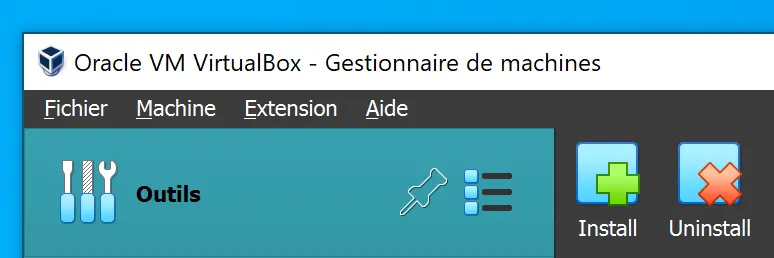
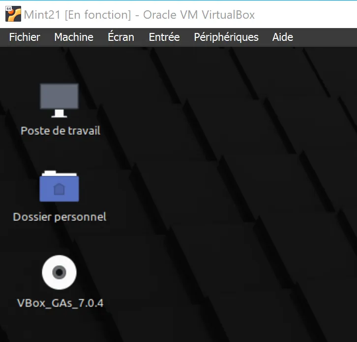
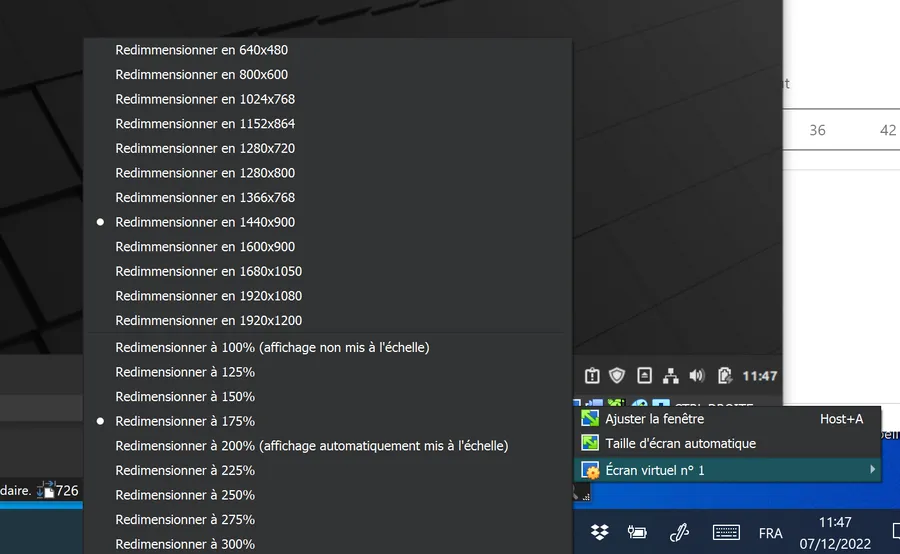
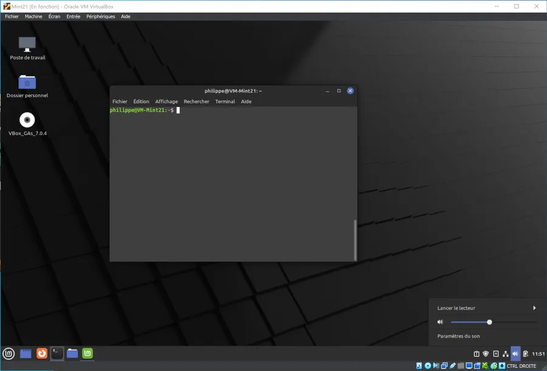

# Install Virtual Box

Running Linux Mint in Virtual Box is just an example.  
Of course, you can install any other ISO

## Checklist
* Download Virtual Box for Windows [on this page](https://www.virtualbox.org/wiki/Downloads)
* Download the VirtualBox Extension Pack on [the same page](https://www.virtualbox.org/wiki/Downloads)
* Install Virtual Box on Windows
* Launch Virtual Box

&nbsp;

&nbsp;

* In the Tools palette, on the right-hand side, click on the green "+ Install" button and install the Extension Pack
* Download a Mint 21 .iso file [from here](https://www.linuxmint.com/download.php).
    * Obviously, this could be any other ISO (Windows, Debian...)
* In VirtualBox press **CTRL + A** to add a new VM, select the previous .iso file etc.
* Run the VM
    * You will tune the details later
* You may have some issues with the screen resolution but install the OS first
* Once installed reboot the VM
* Once logged in, open the CD and install the Guest Additions (VBox_GAs stands for VirtualBox Guess Additions. See below)

&nbsp;

&nbsp;

* Once installed, you can set the resolution

&nbsp;

&nbsp;

* Voilà !

&nbsp;

&nbsp;

