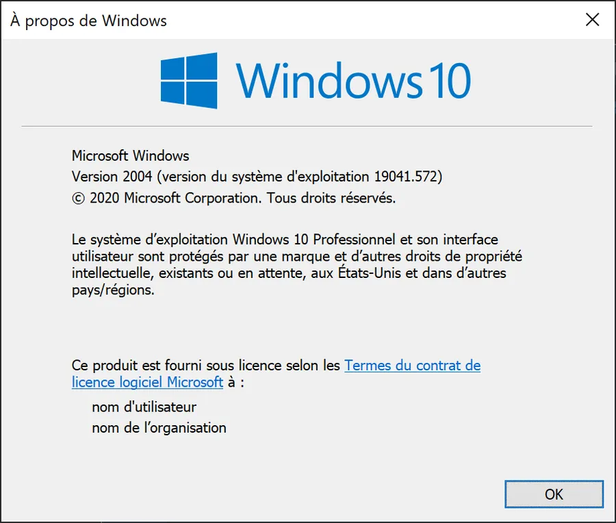
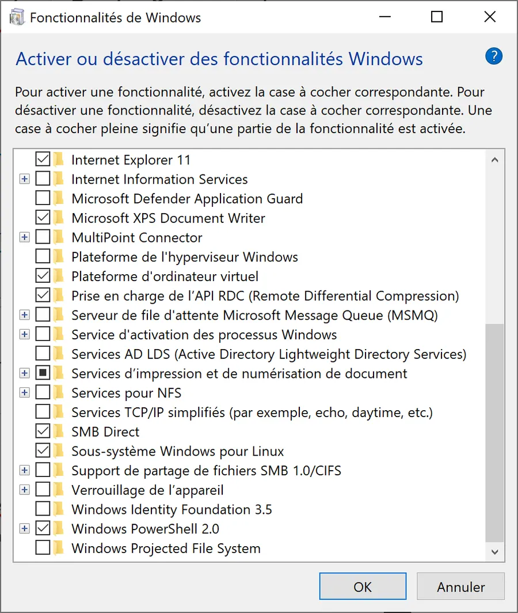
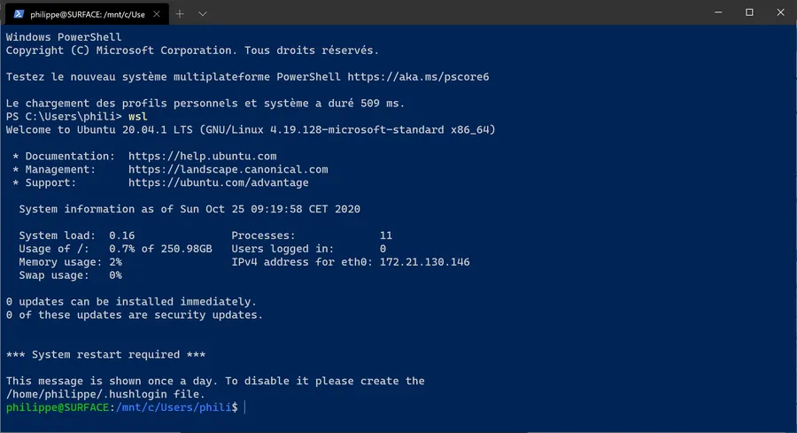
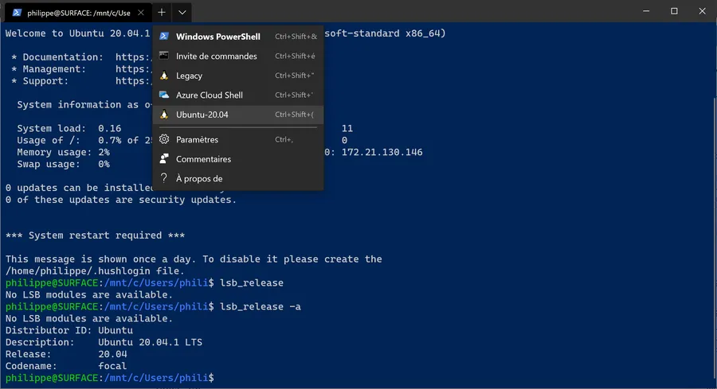
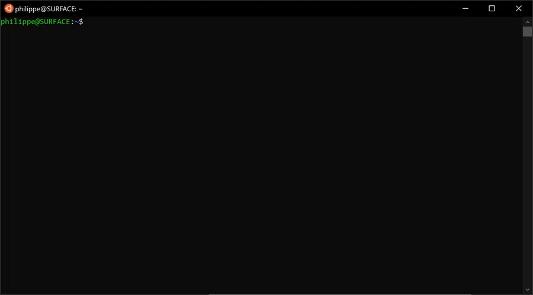
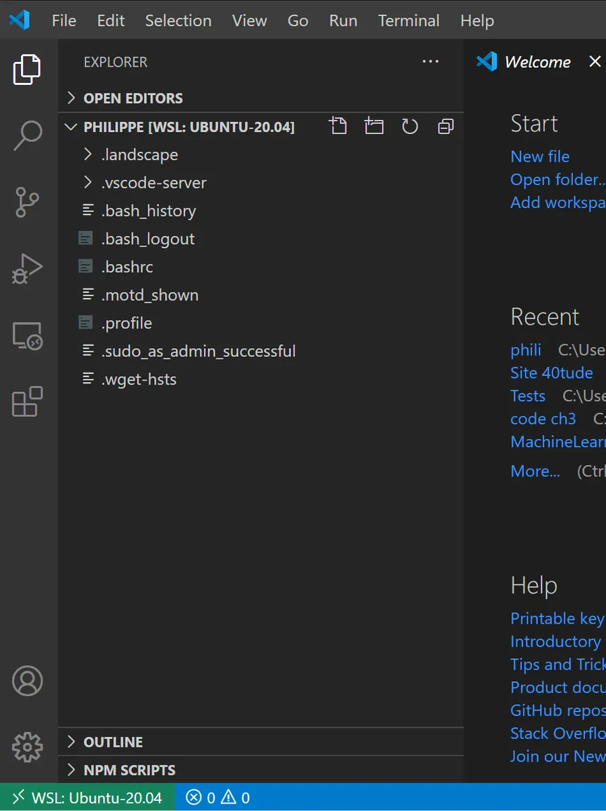
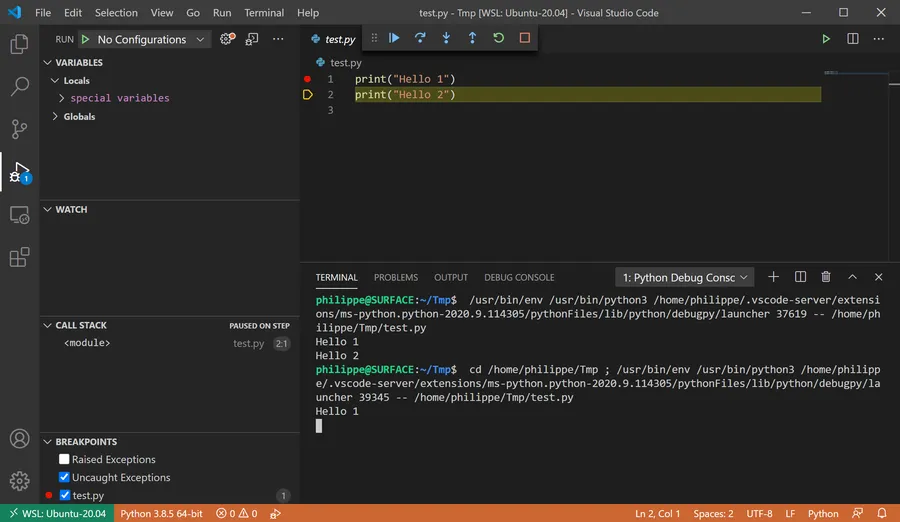
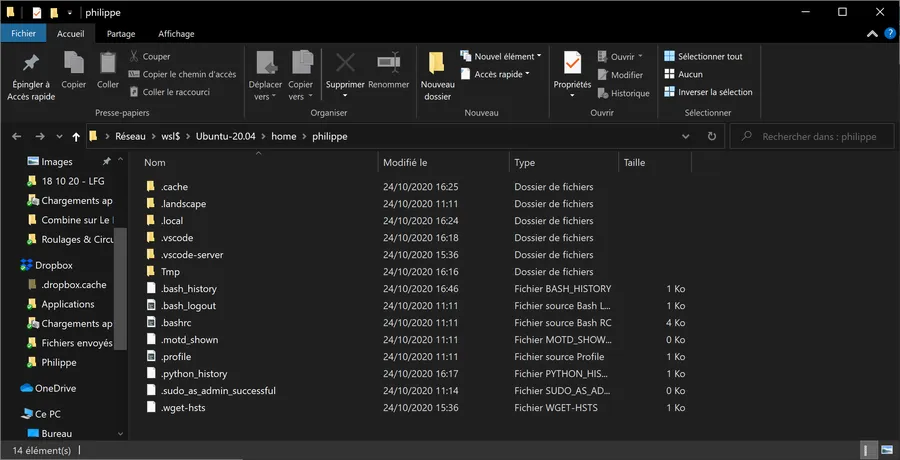
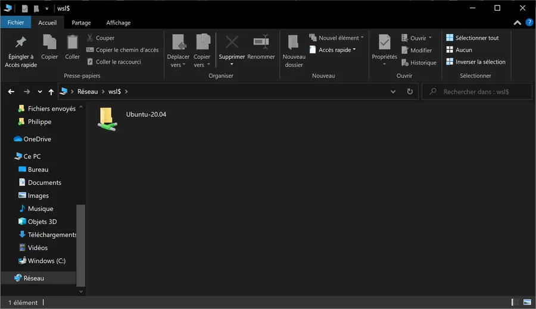

# WSL 2 - Windows Subsystem for Linux 

## Introduction

WSL 2 utilise une machine virtuelle plutôt qu'une couche de traduction entre Windows et Linux (WSL). Ça se lance plus vite et l'intégration avec Windows est bien plus aboutie.

Il faut être en Windows 10 Version 1903 ou supérieure. À vérifier avec l'utilitaire WinVer (à lancer avec WIN + R). En octobre 2020 je suis sous la version 2004.

<div align="center">

</div>

## Installation

* Touche Win
* Taper "Fe" (comme le début du mot "Features")
* Choisir "Activer ou Désactiver des fonctionnalités Windows"

<div align="center">

</div>


Sélectionner "Sous-système Windows pour Linux" et "Plateforme d'ordinateur virtuel". Cliquer sur "OK" et laisser le PC rebooter.

Quand on est de retour sous Windows

* Aller sur le Windows Store
* Chercher Ubuntu
* Télécharger et installer la 20.04 (on est en Oct 2020). Lors de l'installation il faudra créer un utilisateur et lui attribuer un mot de passe.

## Gestion

Pour connaître la version en cours d'utilisation, ouvrir PowerShell et saisir :

```powershell
PS C:\Users\phili> wsl -l -v
  NAME            STATE           VERSION
* Legacy          Stopped         1
  Ubuntu-20.04    Running         2
```

On voit que j'ai un vieil Ubuntu qui traîne (Legacy) , qui est stoppé, qui est celui qui se lance par défaut si je tape "wsl" dans Powershell et qui est en version 1.

Pour faire en sorte que Ubuntu 20 devienne la distribution par défaut et vérifier que c'est bien pris en compte, on peut taper :

```powershell
PS C:\Users\phili> wsl --setdefault Ubuntu-20.04
PS C:\Users\phili> wsl -l
Distributions du sous-système Windows pour Linux :
Ubuntu-20.04 (par défaut)
Legacy
```

Si Unbuntu 20 est en Version 1, pour le forcer à fonctionner en version 2, taper :

```powershell
 PS C:\Users\phili> wsl --set-version Ubuntu-20.04 2
```

Cela ne sera peut-être pas possible directement et il vous sera demandé de télécharger un update du kernel sur la page <https://docs.microsoft.com/fr-fr/windows/wsl/wsl2-kernel>. Une fois téléchargé et installé on peut relancer la demande (--set-version). Ensuite la commande "wsl -l -v" doit retourner la version 2. Pour s'assurer de fonctionner en version 2 par défaut, dans PowerShell, on peut saisir :

```powershell
PS C:\Users\phili> wsl --set-default-version 2
```

## 4 façons de lancer un shell

Dans PowerShell, pour passer en mode Linux, je tape wsl. Le prompt change. Au pire je peux saisir une commande du type "lsb_release -a" pour me rassurer. Pour quitter la session et revenir à Powershell je tape "exit".

<div align="center">

</div>


Si à partir du prompt PowerShell je ne veux pas lancer la distribution par défaut je peux, dans mon cas, saisir :

```powershell
PS C:\Users\phili> wsl -d legacy
```

Il peut être utile de lire cette page : <https://docs.microsoft.com/fr-fr/windows/wsl/wsl-config>

Si j'utilise le Windows Terminal je peux lancer une session Ubuntu dans un autre onglet.

<div align="center">

</div>


Pour lancer une console Linux dans une console indépendante

* Touche Win
* Taper "Ub"
* Ubuntu apparaît
* Cliquer sur Enter

<div align="center">

</div>


Une fois sous Linux

```bash
philippe@SURFACE:~$ uname -a
Linux SURFACE 4.19.128-microsoft-standard #1 SMP Tue Jun 23 12:58:10 UTC 2020 x86_64 x86_64 x86_64 GNU/Linux
```

```bash
philippe@SURFACE:~$ lsb_release -a
No LSB modules are available.
Distributor ID: Ubuntu
Description:    Ubuntu 20.04.1 LTS
Release:        20.04
Codename:       focal
```

Faire la mise à jour. C'est du Linux classique. Normal, on est sous Linux 😁

```bash
philippe@SURFACE:~$ sudo apt update
philippe@SURFACE:~$ sudo apt upgrade
```

## Interactions avec Windows

Lancer VS Code à partir du prompt Linux. Ça c'est super cool et la réalisation est vraiment top.

```bash
philippe@SURFACE:~$ code .
```

Si besoin il va installer le serveur

```bash
philippe@SURFACE:~$ code .
Installing VS Code Server for x64 (d2e414d9e4239a252d1ab117bd7067f125afd80a)
Downloading: 100%
Unpacking: 100%
Unpacked 2357 files and folders to /home/philippe/.vscode-server/bin/d2e414d9e4239a252d1ab117bd7067f125afd80a.
```

Relancer VS Code à partir du prompt Linux

```bash
philippe@SURFACE:~$ code .
```

L'application Windows VS Code se lance. À gauche, en bas et en vert, je retrouve la connexion à WSL Ubuntu-20.04 et en haut j'ai bien la liste des fichiers du répertoire Linux à partir duquel j'ai invoqué VS Code.

<div align="center">

</div>


À partir de là je peux créer des fichiers, les sauver etc. Attention tout sera sauver dans le contexte Linux. Bref, c'est le meilleur des 2 mondes.

Dans le cas d'un développement, je peux aussi débugger à partir de VSCode. Par exemple ci-dessous j'ai créé un répertoire Tmp ainsi qu'un fichier Python test.py. Pour débuguer, la toute première fois, VS Code m'a demandé d'installer pip. Pour cela j'ai fermé Code puis dans la console Linux j'ai tapé :

```powershell
philippe@SURFACE:~/Tmp$ sudo apt install python3-pip
```

Ensuite, je relance VS Code à partir de la console Linux. VS Code me propose d'installer une extension pour Python puis un Linter. Je dis oui à tout. Bref, à un moment je peux taper F5 puis F10 pour tracer mon code. Là aussi, c'est que du bonheur. Merci les gars ✌

<div align="center">

</div>


Je n'ai pas encore fait le test avec un bout de code C++ mais j'imagine que c'est le même principe. De même je ne sais pas encore si je peux appeler Visual Studio (Visual Studio 2019 par exemple, pas Visual Studio Code).

## Accès aux fichiers

Depuis la console Linux, si je veux accéder à me fichiers Windows je vais dans /mnt/c. Ne pas hésiter à utiliser "sudo" dans certains cas.

<div align="center">

</div>


Bien voir le format de l'adresse du répertoire qui est du style

```bash
\\wsl$\Ubuntu-20.04\home\philippe
```

Là, je peux faire ce que je veux. Copier, modifier, supprimer. Bien sûr, si je veux aller mettre le bronx dans \\wsl$\Ubuntu-20.04\root, là ça ne va pas passer.

Depuis Windows, je peux bien sûr lancer Explorer (WIN+E) puis taper \\wsl$ dans la barre d'adresse. C'est quand même plus pratique que ce que l'on avait avant. Lire le premier point de [cette page](https://www.40tude.fr/windows-10-notes-diverses/) si besoin.

<div align="center">

</div>


Faut peut-être passer un peu de temps sur cette page : <https://docs.microsoft.com/fr-fr/windows/wsl/reference>

## Dupliquer une distribution

```powershell
# créer un répertoire pour stocker une image de base
PS C:\Users\phili\Documents\Temp> mkdir ./WSL-Copy

# Se déplacer dans le répertoire
PS C:\Users\phili\Documents\Temp> cd .\WSL-Copy\

# Y exporter l'image
PS C:\Users\phili\Documents\Temp\WSL-Copy> wsl  --export Ubuntu-20.04  Ubuntu-20.04-default.tar

# Vérifier
PS C:\Users\phili\Documents\Temp\WSL-Copy> ls
Mode                 LastWriteTime         Length Name
----                 -------------         ------ ----
-a----        26/10/2020     23:37     1699194880 Ubuntu-20.04-default.tar

# importer l'image sous un nouveau nom
# wsl --import Nom_Nouvelle_Distro Chemin_Répertoire_Nouvelle_Distro Source_Distro --version [1,2]
PS C:\Users\phili\Documents\Temp\WSL-Copy> wsl --import Ubuntu-20.04-testing ./Ubuntu-20.04-testing ./Ubuntu-20.04-default.tar --version 2

# Vérifier le contenu du répertoire Ubuntu-20.04-testing
PS C:\Users\phili\Documents\Temp\WSL-Copy> ls .\Ubuntu-20.04-testing\
    Répertoire : C:\Users\phili\Documents\Temp\WSL-Copy\Ubuntu-20.04-testing
Mode                 LastWriteTime         Length Name
----                 -------------         ------ ----
-a----        26/10/2020     23:44     1911554048 ext4.vhdx

# Vérifier que la nouvelle distribution est bien disponible
PS C:\Users\phili\Documents\Temp\WSL-Copy> wsl -l -v
  NAME                    STATE           VERSION
* Ubuntu-20.04            Stopped         2
  Ubuntu-20.04-testing    Stopped         2

# La lancer depuis l'invite PowerShell
PS C:\Users\phili\Documents\Temp\WSL-Copy> wsl -d Ubuntu-20.04-testing

# Tout casser...

# Une fois sous Powershell la désinscrire
PS C:\Users\phili\Documents\Temp\WSL-Copy> wsl --unregister Ubuntu-20.04-testing

# Vérifier
PS C:\Users\phili\Documents\Temp\WSL-Copy> wsl -l
Distributions du sous-système Windows pour Linux :
Ubuntu-20.04 (par défaut)

# Vérifier qu'il n'y a plus rien dans le répertoire Ubuntu-20.04-testing où on avait stocké la distribution dupliquée
PS C:\Users\phili\Documents\Temp\WSL-Copy> ls .\Ubuntu-20.04-testing\
```

*Bon, la suite au prochain épisode...*

