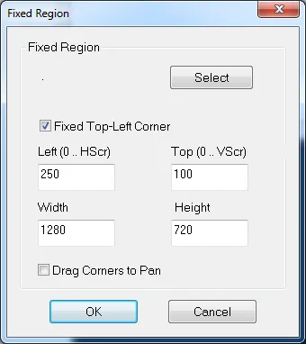
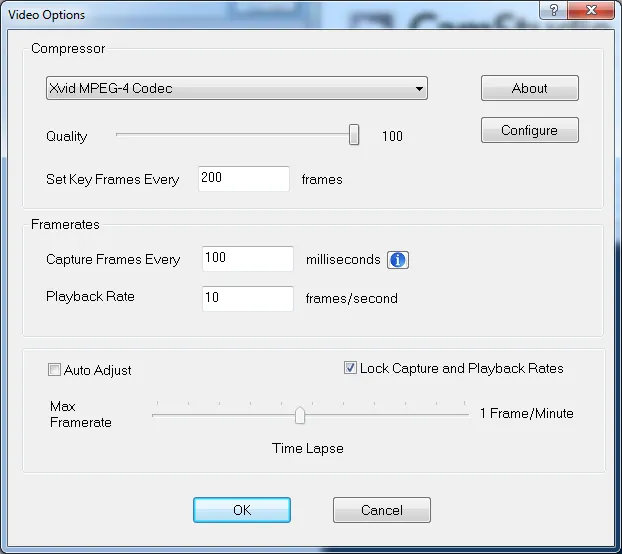
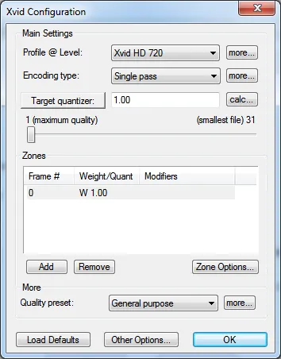
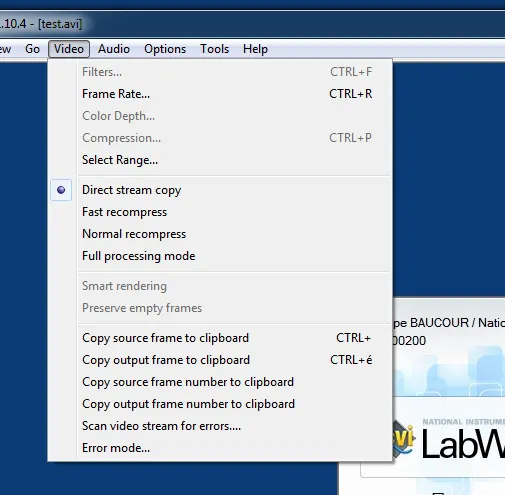
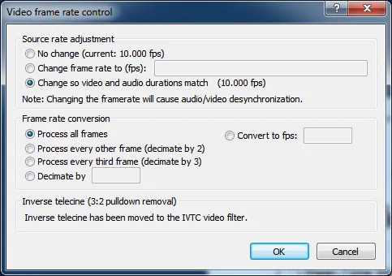
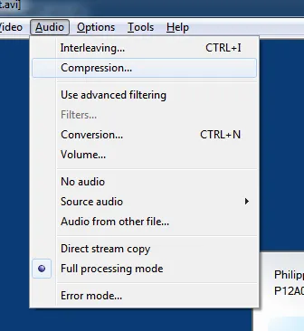
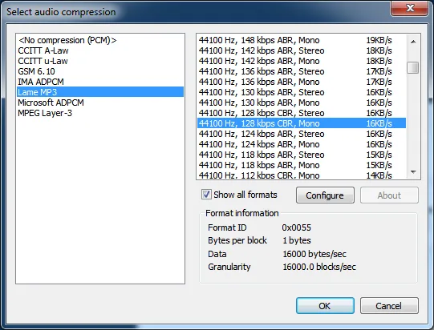
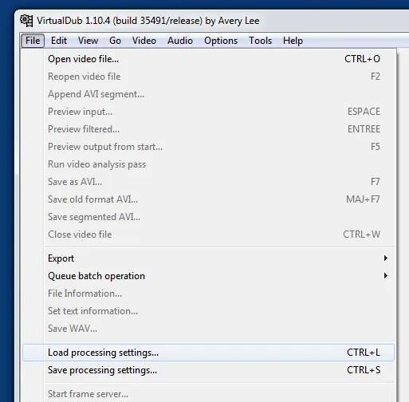

# MOF vidéo CVI

## Introduction

Après des années d'hésitation, j'ai enfin posté une vidéo à propos de CVI sur YouTube. Rendez-vous sur : <https://www.youtube.com/watch?v=48pPFFJe27Y> (soyez indulgents et merci pour les feedbacks.) ou alors visionnez-la [ici](https://www.youtube.com/watch?v=48pPFFJe27Y).

<iframe width="560" height="315" src="https://www.youtube.com/embed/48pPFFJe27Y?si=xBxnwDFUUDZa7Xz2" title="YouTube video player" frameborder="0" allow="accelerometer; autoplay; clipboard-write; encrypted-media; gyroscope; picture-in-picture; web-share" referrerpolicy="strict-origin-when-cross-origin" allowfullscreen></iframe>

## Le making of

En fait c'est un peu "merdique" au niveau des réglages alors je note tout ici comme ça, au pire, je n'aurai plus qu'à copier/coller la prochaine fois. Si en plus cela peut rendre service... Il n'y a pas de mal à se faire du bien. Pour commencer, en termes d'outils il va falloir :

* CamStudio (<http://camstudio.org/>)
* Codec Jawor XVid (<http://codecpack.co/download/Jawor_Xvid_Binaries.html>)
* VirtualDub (<http://www.clubic.com/telecharger-fiche10126-virtualdub.html>)
* VLC (<http://www.clubic.com/telecharger-fiche10829-vlc-media-player.html>)
* Lame ACM MP3 Codec (attention l'install sous  win64 est uniquement décrite dans le readme qui est dans le .zip)
* Le lecteur multimedia de Windows,
* Un casque avec un micro (Créative, 20€, micro à 5 cm (3 doigts) )

Peu importe que les codecs soient installés avant ou après CamStudio et/ou VirtualDub.

## Configuration de CamStudio

En fait, je fixe une région de mon écran une fois pour toute. Comme je vais être en 720p au niveau du driver XVid j'ai choisi une région de 1280 par 720

Du point de vue de la vidéo je sélectionne le codec XVid qu'on a installé. Compte tenu du fait que les vidéos ont beaucoup d'à plat, je mets 200 dans le "Set Key Frames". Notez que 100x10 = 1000. Si vous changez les valeurs il faut que le produit fasse toujours 1000. Quand c'est fait, on clique sur "Configure".

Le truc important ici c'est de choisir Xvid HD 720

Contrairement à ce que l'on peut lire ailleurs, je choisi "Use MCI Recording". En effet, j'ai testé d'autres options mais le son était saccadé. Ici la taille des données audio sera monstrueuse mais ce n'est pas grave on réglera ça dans VirtualDub.

A propos du micro, pour finir, dans Windows j'ai fait en sorte qu'il soit le périphérique par défaut. Pour cela, faut cliquer droit sur le HP dans la barre de taches et choisir "Périphérique d'enregistrement". Ensuite dans les réglages Windows j'ai mis le niveau le niveau à 75%. Dans CamStudio je choisi aussi Default Input Device (voir ci-dessous). Attention, je ne suis pas sûr que CamStudio garde en mémoire le choix de l'Audio Capture Device.

Dernier point de détail. Dans mon cas j'ai un casque avec micro et connexion USB. Après quelques essais je règle finalement le micro à 2 ou 3 doigts de large de ma bouche. Faites des tests en fonction de la distance micro-bouche et du volume d'enregistrement.

Lorsque que je clique sur l'option "Frame Rate..." voilà les options que j'ai choisies. Le plus important c'est le 3me bouton radio (Change so video and audio...)

Voilà le menu Audio. On voit que je suis en mode full processing.

Quand je clique sur "Compression..." voilà l'option choisie

J'utilise le codec Lame MP3 et on mettre le son en mono, 44.1 kHz, 128 kbps.

Un dernier truc. VirtualDub permet de sauver/recharger la configuration. A utiliser une fois que vous êtes contents de vos réglages. Faites de très nombreux test et essayez différents lecteurs multimédias. J'ai perdu beaucoup de temps avec une version de VLC. En mettant à jour le problème a disparu mais j'avais perdu pas mal de temps.

