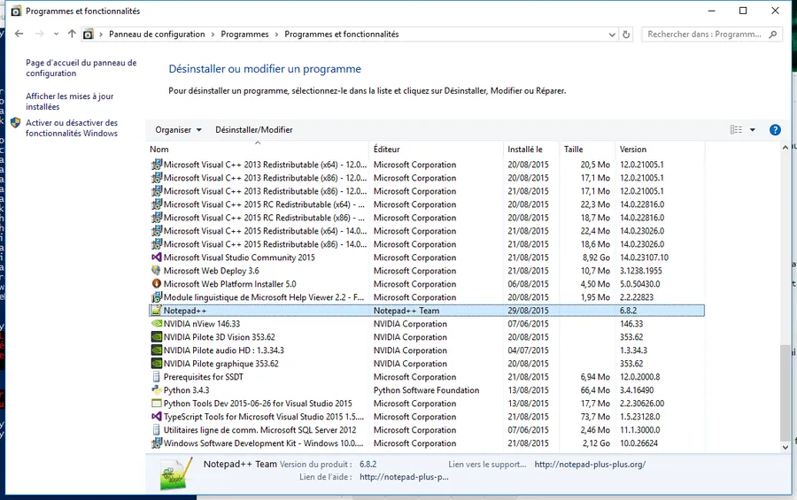

# PowerShell PackageManagement


Je suis sous Windows 10 et j'utilise Powershell 5.0. À l'instar de ce que l'on peut faire sous Debian avec un bon ``apt-get`` voilà comment j'utilise le Package Management de Powershell pour installer Notepad++ sur ma machine.

**WIN + X** et je lance un PowerShell en mode Admin. Ensuite, je commence par regarder l'aide :

```powershell
get-help *Package*
```

Entre autres :

```powershell
get-help about_PackageManagement
```

Ensuite on peut inspecter les fonctions à notre disposition avec la commande suivante :

```powershell
Get-Command -module PackageManagement

CommandType Name Version
----------- ---- -------
Cmdlet Find-Package 1.0.0.0
Cmdlet Get-Package 1.0.0.0
Cmdlet Get-PackageProvider 1.0.0.0
Cmdlet Get-PackageSource 1.0.0.0
Cmdlet Install-Package 1.0.0.0
Cmdlet Register-PackageSource 1.0.0.0
Cmdlet Save-Package 1.0.0.0
Cmdlet Set-PackageSource 1.0.0.0
Cmdlet Uninstall-Package 1.0.0.0
Cmdlet Unregister-PackageSource 1.0.0.0
```

Enfin je fais un test pour retrouver un package sur l'excellent [Chocolatey](https://chocolatey.org/)

```powershell
Find-Package NotepadPlusplus -ProviderName chocolatey

Le fournisseur « chocolatey v2.8.5.130 » n'est pas installé.
chocolatey peut être téléchargé manuellement à partir de https://oneget.org/ChocolateyPrototype-2.8.5.130.exe et
installé.
Voulez-vous que PackageManagement télécharge et installe automatiquement « chocolatey » maintenant ?
[O] Oui [N] Non [S] Suspendre [?] Aide (la valeur par défaut est « O ») : O

Name Version Source Summary
---- ------- ------ -------
notepadplusplus 6.8.2 chocolatey Notepad++ is a free (as in "free speech" and also a...
```

Ce que je trouve super c'est que comme Chocolatey n'était pas encore disponible sur ma machine, la package manager me propose de l'installer. Bon, eh bien je me lance...

```powershell
Find-Package NotepadPlusplus -ProviderName chocolatey |Install-Package -Force
```

Youpi ! Notepad++ est dispo sur ma machine et je le retrouve dans les logiciels installés. Je suis bluffé et le Package Management de Powershell est mon nouvel ami de la semaine😁

<div align="center">

</div>


Pour le lancer, soit j'utilise le Menu ou la ligne de commande

```powershell
Start-Process Notepad++
```

Ensuite, on imagine que l'installation de PC et/ou de machines virtuelles va pouvoir se faire dans la joie et la bonne humeur. Il ne me manque plus qu'un truc : la mise à disposition de PowerShell 5 sur Win8.1 et Win 7?