# 100% de charge disque dur

C'est la solution qui a marché chez moi sous Windows 10 et je ne prétends pas qu'elle marchera pour tout le monde. Cela dit, elle a réglé le souci que j'avais sur une pauvre machine à base d'un Intel Core i5 et équipée de 4 To de disque.

C'était très désagréable car le disque "grattait" pendant 10 à 20 minutes, tout était ralenti, rien ne se lançait rapidement... Bref, j'étais à chaque fois à deux doigts de mettre mon pied dans l'écran (cela n'aurait rien amélioré mais ça soulage...).

Bon allez, on y va, on en a pour 30 secondes ou presque.

## Désactiver Windows Search

* Appuyer sur la touche Windows
* Taper ``services.msc``
* ENTER

Quand l'application est à l'écran

* Aller tout en bas et retrouver un service nommé ``Windows Search``
* Double cliquer dessus

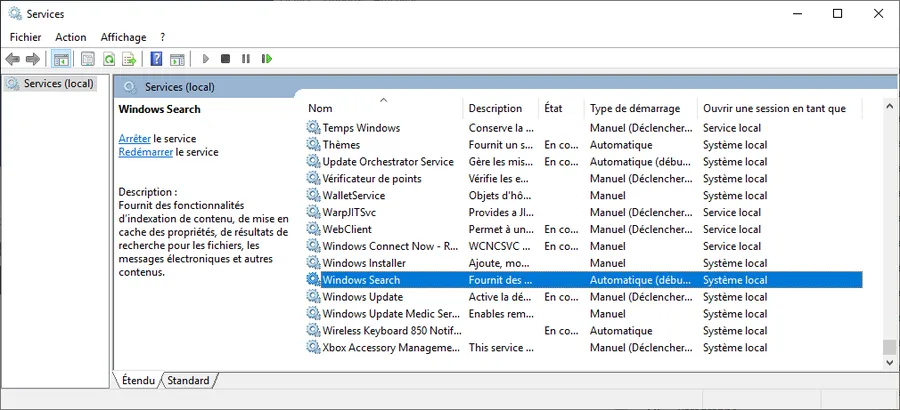

* Si besoin il faudra arrêter gentiment le service à l'aide du bouton qui va bien
* Ensuite dans ``Type de démarrage`` il faut choisir ``Désactivé``

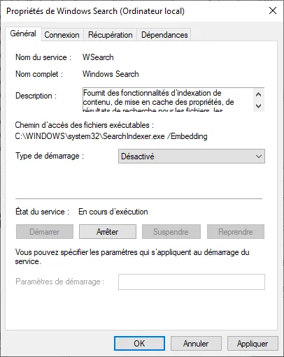

## Désactivation de ``SysMain`` (aka ``SuperFetch``)

C'est exactement la même chose sauf que l'on va rechercher un service nommé SysMain.

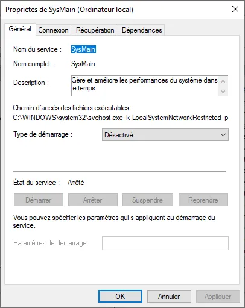

Ensuite l'application Services doit ressembler à ça

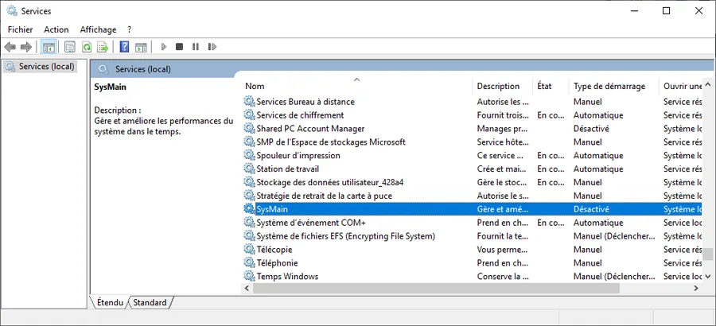

Normalement c'est bon le disque ne devrait plus être à 100% de charge pendant 2 heures au prochain démarrage. Enjoy!

## Désactiver le mode MSI (Message Signaled Interrupt)

* Win + X
* Choisir ``Gestionnaire de périphériques`` dans la liste
* Contrôleur IDE...
* Contrôleur AHCI...

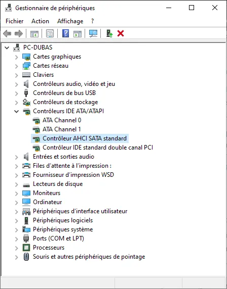

* Double click
* Onglet ``Pilote``
* Bouton ``Détails du pilote``

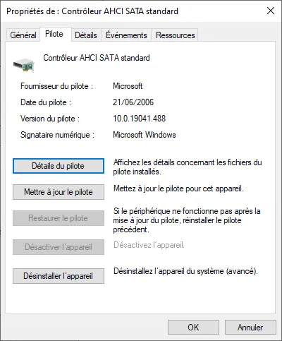

* Si tu lis ``storahci.sys`` alors continues sinon c'est terminé

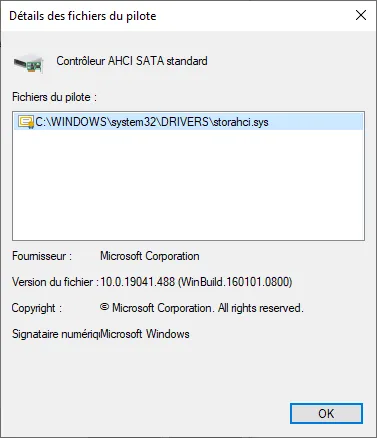

* Cliquer ``OK``
* Revenir à la fenêtre précédente
* Onglet ``Détails``

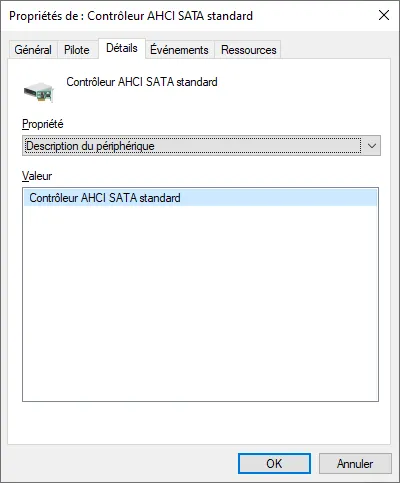

* Choisir ``Chemin d'accès à l'instance...`` dans la liste déroulante
* Noter la référence du style ``3B22&SUBSYS_...``

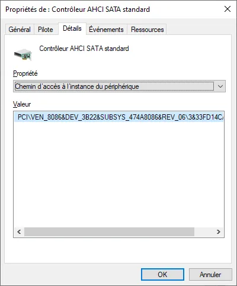

* Touche Win
* Taper ``regedit``
* Coller ``Ordinateur\HKEY_LOCAL_MACHINE\SYSTEM\CurrentControlSet\Enum\PCI`` dans le champ en haut

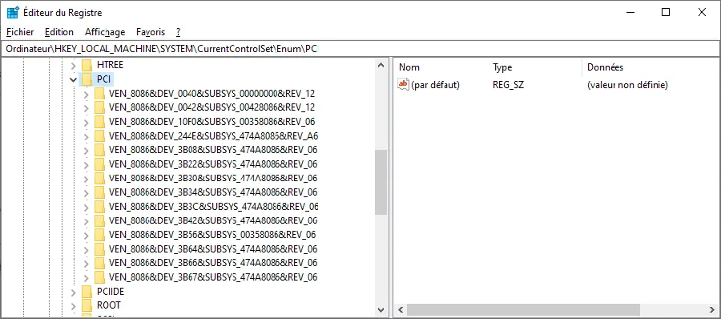

* Retrouver l'entrée ``3B22&SUBSYS...`` dans la liste
* Descendre jusqu'à ``MessageSignaledInterruptProperties``

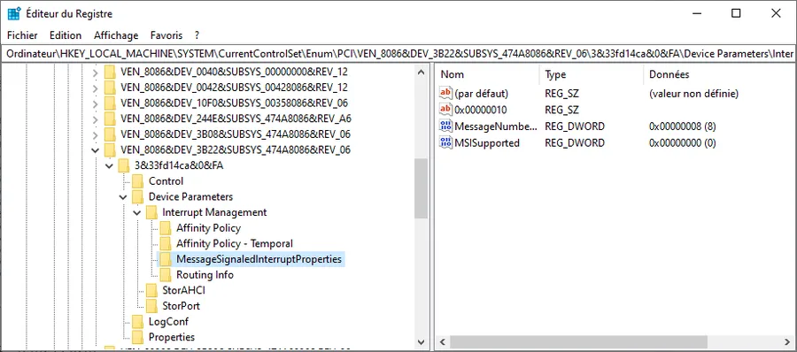

* À droite, double click sur ``MSISupported``
* Au lieu de la valeur 1
* Taper la valeur 0
* Cliquer sur ``OK``

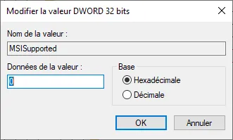

* Quitter ``regedit``
* Reboot

*La suite au prochain épisode...*