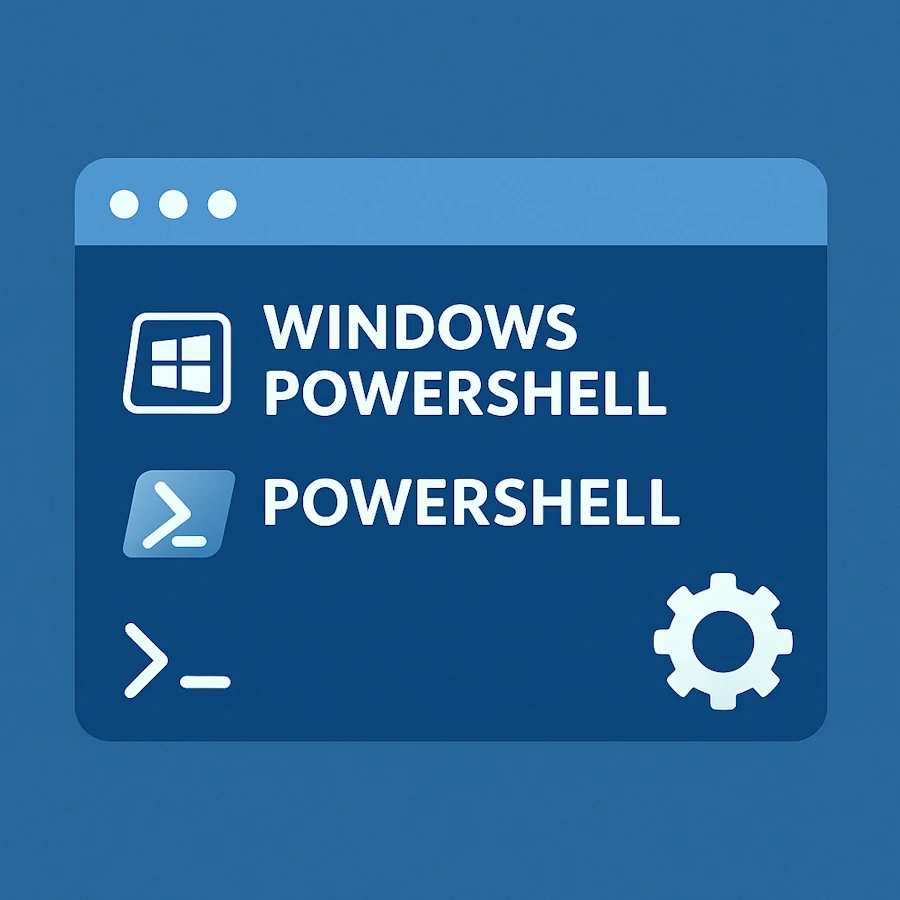
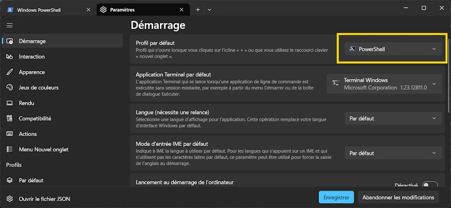
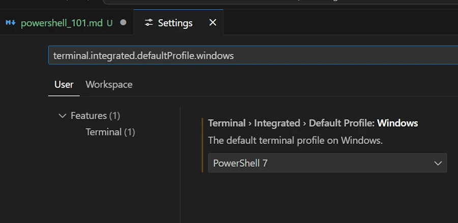
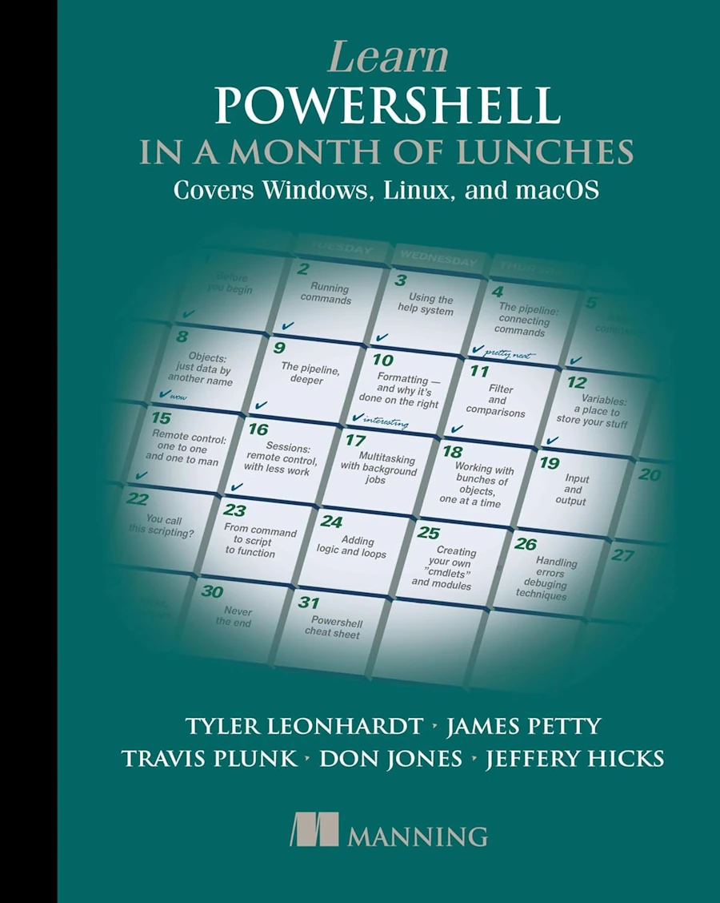

<div align="center">
<br/>
<span>PowerShell and Windows PowerShell</span>
</div>

# PowerShell and Windows PowerShell


## Quickstart

```powershell
# Check your version
$PSVersionTable.PSVersion

# Install or update PowerShell
winget install --id Microsoft.PowerShell --source winget
winget upgrade Microsoft.PowerShell

# Launch PowerShell 7
pwsh
```


**Above, from where does `pwsh` comes from?**

`pwsh` is the executable name for PowerShell 7 and later. It stands for: 
> **P**ower**Sh**ell → **pwsh**

On Windows PowerShell 5.1, the executable was `powershell.exe`

But since PowerShell 7 is cross-platform (Windows, Linux, macOS), the new, shorter command works everywhere:

```powershell
pwsh
```

So when you see `pwsh`, just remember:
* It is the **modern**, **open-source**, **cross-platform** version of PowerShell.
* It’s the one you should launch for any new script or automation.


## Current situation
Here I suppose you have a recent Windows 11 (version above 22H2 that comes with [Terminal Windows](https://learn.microsoft.com/fr-fr/windows/terminal/)) 

There are 2 versions of PowerShell available

1. **Windows PowerShell** (5.1 for example) 
- Windows PowerShell is specific to Windows, it is NOT portable, hence the name: **Windows** PowerShell
- Comes with Windows
- Path to the app: `%SystemRoot%\System32\WindowsPowerShell\v1.0\powershell.exe`
- See the folders : 
    * `%USERPROFILE%/Documents/WindowsPowerShell`
    * or `%USERPROFILE%/OneDrive/Documents/WindowsPowerShell`

2. **PowerShell** (7.5.3 for example) 
- PowerShell is portable (Linux...)
- Open source: [GitHub repo](https://github.com/PowerShell/PowerShell)
- Does not come (yet) automatically with Windows. You must install it
- Path to the app: `C:\Program Files\PowerShell\7\pwsh.exe`
- See the folders : 
    * `%USERPROFILE%/Documents/PowerShell`
    * or `%USERPROFILE%/OneDrive/Documents/PowerShell`

PowerShell (not Windows PowerShell) is **the one you should use**.

### Why should I prefer PowerShell?


| Feature        | Windows PowerShell 5.1 | PowerShell 7          |
| -------------- | ---------------------- | --------------------- |
| Cross-platform | ❌                      | ✅ Win/Linux/mac       |
| Performance    | 🐢                     | ⚡ Faster (CoreCLR)    |
| Support        | Finishing              | ✅ Fully supported     |
| New modules    | Rare                   | 🚀 Continuous updates |


Windows PowerShell is legacy — PowerShell 7 is the future.


## Checking the version

```powershell
$PSVersionTable 
```


<div align="center">
<br/>
<span>One way to get PowerShell current version with $PSVersionTable</span>
</div>


## Installing PowerShell

If PowerShell is not yet installed, shame on you 😁. You can however either run one of the 2 commands below:

```
winget install --id Microsoft.PowerShell --source winget
choco install powershell -y
```


## Once PowerShell is installed

If you want to execute local script run the following command:

```powershell
Set-ExecutionPolicy RemoteSigned -Scope CurrentUser
```


## Updating PowerShell

Use one of three commands below:

```powershell
Update-PowerShell
winget upgrade Microsoft.PowerShell
choco upgrade powershell-core
```


## Set PowerShell as your default in Terminal Windows


1. Open Terminal Windows (`WIN+X the I`)
1. Settings → Startup → Default profile
1. Select PowerShell

<div align="center">
<br/>
<span>Define PowerShell as your default in Terminal Windows</span>
</div>


## Configuring PowerShell in VSCode

* `CTRL,`
* Look for: `terminal.integrated.defaultProfile.windows`
* Select: `PowerShell 7`


<div align="center">
<br/>
<span>Configuring PowerShell in VSCode</span>
</div>


## Checking your profile

Open Window Terminal (`WIN+X the I`)

```powershell
$PROFILE
C:\Users\phili\OneDrive\Documents\WindowsPowerShell\Microsoft.PowerShell_profile.ps1
C:\Users\phili\OneDrive\Documents\PowerShell\Microsoft.PowerShell_profile.ps1

```

<div align="center">
<br/>
<span>Checking your profile with $PROFILE</span>
</div>


## About the Profile Files

There are **4 levels of profiles** in PowerShell, from the most specific to the most general:

1. **`$Profile.CurrentUserCurrentHost`**

   * File: `Microsoft.PowerShell_profile.ps1`
   * For: The current user + the specific host (e.g. PowerShell console)

2. **`$Profile.CurrentUserAllHosts`**

   * File: `profile.ps1`
   * For: The current user + ALL hosts (console, ISE, VS Code, etc.)

3. **`$Profile.AllUsersCurrentHost`**

   * File: `Microsoft.PowerShell_profile.ps1` (but located in `$PSHOME`)
   * For: ALL users on the machine + the specific host

4. **`$Profile.AllUsersAllHosts`**

   * File: `profile.ps1` (but located in `$PSHOME`)
   * For: ALL users + ALL hosts

### In practice

* **Levels 3 and 4** are in a system folder (like `C:\Program Files\PowerShell\7\`) and require admin rights. They’re rarely used.
* **Levels 1 and 2** are in your Documents folder — those are the most common ones.

To see all your profile paths, you can type in PowerShell:

```powershell
$Profile | Get-Member -MemberType NoteProperty | Select-Object Name
```

**Most people only use one of [1, 2]**, usually `Microsoft.PowerShell_profile.ps1`.


## About the PowerShell directory

* Keep `Microsoft.PowerShell_profile.ps1`.
    * It runs when you open a standard PowerShell console (including in VS Code).

* Delete `profile.ps1`
    * **UNLESS** you also use PowerShell ISE or other special hosts
    * In practice, 99% of people don’t need it


## About the WindowsPowerShell directory

* Do not delete it
* Some scripts or Windows tools may still use PowerShell 5.1. 
* You can leave it empty


## My `../PowerShell/Microsoft.PowerShell_profile.ps1`

```powershell

oh-my-posh init pwsh --config "$env:POSH_THEMES_PATH/paradox.omp.json" | Invoke-Expression


# Import the Chocolatey Profile that contains the necessary code to enable tab-completions to function for `choco`.
# Be aware that if you are missing these lines from your profile, tab completion for `choco` will not function.
# See https://ch0.co/tab-completion for details.
$ChocolateyProfile = "$env:ChocolateyInstall\helpers\chocolateyProfile.psm1"
if (Test-Path($ChocolateyProfile)) {
  Import-Module "$ChocolateyProfile"
}


# I moved from Conda to uv
# This help activate a venv
function venv {
    param([string]$EnvName = "venv")
    
    if (Test-Path ".\$EnvName\Scripts\Activate.ps1") {
        & ".\$EnvName\Scripts\Activate.ps1"
    } elseif (Test-Path "..\$EnvName\Scripts\Activate.ps1") {
        & "..\$EnvName\Scripts\Activate.ps1"
    } else {
        Write-Host "Environment '$EnvName' not found" -ForegroundColor Red
    }
}


```


## My `../PowerShell/profile.ps1`

```powershell
# Redirect to the main profile
. "$PSScriptRoot\Microsoft.PowerShell_profile.ps1"
```


## FAQ

### Does Terminal Windows == PowerShell ? 
* No
* Terminal Windows is "just" a modern "host" app.
* PowerShell is the shell that runs inside it.
* Inside Terminal Windows you have Ubuntu, cmd, Windows PowerShell, PowerShell...


### What’s the difference between PowerShell and Command Prompt?

**Command Prompt (cmd.exe)** is the traditional Windows command-line tool.
It can run basic commands and batch scripts, but it works mostly with plain text.

**PowerShell**, on the other hand, is a **modern automation and scripting shell** based on .NET.
It doesn’t just output text — it works with **objects**, which makes automation, data processing, and tool integration far more powerful.

Cmd is for simple commands. PowerShell is for scripting, automation, and modern system management.


### Why does Windows PowerShell still exist?

Windows PowerShell (version 5.1) comes **preinstalled** with Windows for compatibility.
Many enterprise tools and admin scripts created in the past **still rely on it**.

It stays for **legacy support**, but development has shifted to PowerShell 7.


### Can I uninstall Windows PowerShell?

**Not recommended.**
Some Windows features and management tools still depend on Windows PowerShell 5.1.

You *can* uninstall it using advanced tools, but it may **break** parts of Windows.
Better approach:

* Set **PowerShell 7** as your default
* Keep Windows PowerShell for older scripts


### How do I start PowerShell 7? ("pwsh"??)

* After installing PowerShell 7
* In any terminal (Terminal Windows, cmd, Run dialog, etc.) 
* You can launch PowerShell by typing:

```powershell
pwsh
```
* **pwsh** is the executable for the modern version of PowerShell.


You can also:

* Search for **PowerShell 7** in the Start menu
    * Just type the 3 letters `pow`. It will be listed
* Set PowerShell 7 as your **default shell** in Terminal Windows settings


 

## Bibliography
- [Learn Powershell in a Month of Lunches](https://amzn.eu/d/gIeAd7w)
<div align="center">
<br/>
<!-- <span>Optional comment</span> -->
</div>


## Webliography
- [PowerShell](https://learn.microsoft.com/powershell/)
- [Install PowerShell](https://learn.microsoft.com/powershell/scripting/install/installing-powershell)
- [PowerShell GitHub repository](https://github.com/PowerShell/PowerShell)
- I know, this playlist is very old BUT I really enjoy the tone of the talk and you can see the [father of Powershell](https://en.wikipedia.org/wiki/Jeffrey_Snover)... Respect. For what I know he left Microsoft since then.

<div align="center">
<iframe width="560" height="315" src="https://www.youtube.com/embed/videoseries?si=b0P_Wpe5JMUg-FmA&amp;list=PLyJiOytEPs4etH7Ujq7PU7jlOlHL-9RmV" title="YouTube video player" frameborder="0" allow="accelerometer; autoplay; clipboard-write; encrypted-media; gyroscope; picture-in-picture; web-share" referrerpolicy="strict-origin-when-cross-origin" allowfullscreen></iframe>
</div>


