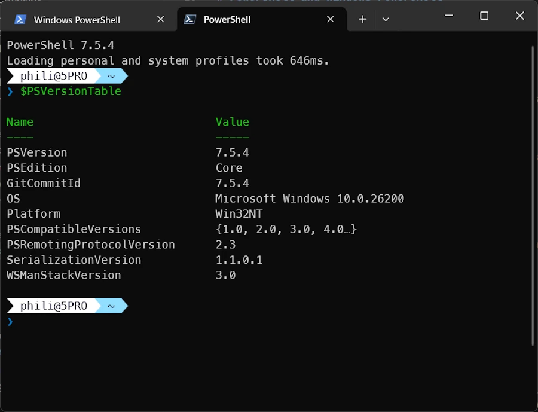
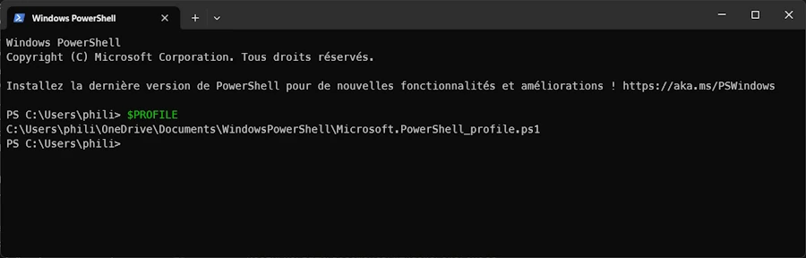

<div align="center">
<br/>
<span>Powershell and Windows PowerShell</span>
</div>

# Powershell and Windows PowerShell

## Current situation
Here I suppose you have a recent Windows 11 (version above 22H2 that comes with Terminal Windows) 

There are 2 versions of PowerShell available

1. **Windows PowerShell** (5.1 for example) 
- Windows Powershell is specific to Windows, it is NOT portable, hence the name: **Windows** Powershell
- Comes with Windows
- See the folders : 
    * `%USERPROFILE%/Documents/WindowsPowerShell`
    * or `%USERPROFILE%/OneDrive/Documents/WindowsPowerShell`
- Path to the app: `%SystemRoot%\System32\WindowsPowerShell\v1.0\powershell.exe`

2. **PowerShell** (7.5.3 for example) 
- Powershell is portable (Linux...)
- Open source: [GitHub repo](https://github.com/PowerShell/PowerShell)
- Does not come (yet) automatically with Windows. You must install it
- See the folders : 
    * `%USERPROFILE%/Documents/PowerShell`
    * or `%USERPROFILE%/OneDrive/Documents/PowerShell`
- Path to the app: `C:\Program Files\PowerShell\7\pwsh.exe`

Powershell (not Windows Powershell) is **the one you should use**.


## Checking the version

```powershell
$PSVersionTable 
```


<div align="center">
<br/>
<span>One way to get Powershell current version with $PSVersionTable</span>
</div>


## Installing Powershell

If Powershell is not yet installed, shame on you. You can however either run one of the 2 commands below:

```
winget install --id Microsoft.PowerShell --source winget
choco install powershell -y
```


## Updating PowerShell

Use one of three commands below:

```powershell
Update-PowerShell
winget upgrade Microsoft.PowerShell
choco upgrade powershell-core
```


## Define Powershell as your default in Terminal Windows


1. Open Windows Terminal (`WIN+X I`)
1. Settings → Startup → Default profile
1. Select PowerShell

<div align="center">
<br/>
<span>Define Powershell as your default in Terminal Windows</span>
</div>


## Checking your profile

Open Window Terminal (`WIN+X I`)

```powershell
$PROFILE
C:\Users\phili\OneDrive\Documents\WindowsPowerShell\Microsoft.PowerShell_profile.ps1
C:\Users\phili\OneDrive\Documents\PowerShell\Microsoft.PowerShell_profile.ps1

```

<div align="center">
<br/>
<span>Checking your profile with $PROFILE</span>
</div>


## About the Profile Files

There are **4 levels of profiles** in PowerShell, from the most specific to the most general:

1. **`$Profile.CurrentUserCurrentHost`**

   * File: `Microsoft.PowerShell_profile.ps1`
   * For: The current user + the specific host (e.g. PowerShell console)

2. **`$Profile.CurrentUserAllHosts`**

   * File: `profile.ps1`
   * For: The current user + ALL hosts (console, ISE, VS Code, etc.)

3. **`$Profile.AllUsersCurrentHost`**

   * File: `Microsoft.PowerShell_profile.ps1` (but located in `$PSHOME`)
   * For: ALL users on the machine + the specific host

4. **`$Profile.AllUsersAllHosts`**

   * File: `profile.ps1` (but located in `$PSHOME`)
   * For: ALL users + ALL hosts

### In practice

* **Levels 3 and 4** are in a system folder (like `C:\Program Files\PowerShell\7\`) and require admin rights. They’re rarely used.
* **Levels 1 and 2** are in your Documents folder — those are the most common ones.

To see all your profile paths, you can type in PowerShell:

```powershell
$Profile | Get-Member -MemberType NoteProperty | Select-Object Name
```

**Most people only use one of [1, 2]**, usually `Microsoft.PowerShell_profile.ps1`.


## About the PowerShell directory

* Keep `Microsoft.PowerShell_profile.ps1`.
    * It runs when you open a standard PowerShell console (including in VS Code).

* Delete `profile.ps1`
    * **UNLESS** you also use PowerShell ISE or other special hosts
    * In practice, 99% of people don’t need it


## About the WindowsPowerShell directory

* Do not delete it
* Some scripts or Windows tools may still use PowerShell 5.1. 
* You can leave it empty


## Configuring Powershell in VSCode

* `CTRL,`
* Look for: `terminal.integrated.defaultProfile.windows`
* Select: `PowerShell 7`


<div align="center">
<br/>
<span>Configuring Powershell in VSCode</span>
</div>


## My `../PowerShell/Microsoft.PowerShell_profile.ps1`

```powershell

oh-my-posh init pwsh --config "$env:POSH_THEMES_PATH/paradox.omp.json" | Invoke-Expression


# Import the Chocolatey Profile that contains the necessary code to enable tab-completions to function for `choco`.
# Be aware that if you are missing these lines from your profile, tab completion for `choco` will not function.
# See https://ch0.co/tab-completion for details.
$ChocolateyProfile = "$env:ChocolateyInstall\helpers\chocolateyProfile.psm1"
if (Test-Path($ChocolateyProfile)) {
  Import-Module "$ChocolateyProfile"
}


# I moved from Conda to uv
# This help activate a venv
function venv {
    param([string]$EnvName = "venv")
    
    if (Test-Path ".\$EnvName\Scripts\Activate.ps1") {
        & ".\$EnvName\Scripts\Activate.ps1"
    } elseif (Test-Path "..\$EnvName\Scripts\Activate.ps1") {
        & "..\$EnvName\Scripts\Activate.ps1"
    } else {
        Write-Host "Environment '$EnvName' not found" -ForegroundColor Red
    }
}


```


## My `../PowerShell/profile.ps1`

```powershell
# Redirect to the main profile
. "$PSScriptRoot\Microsoft.PowerShell_profile.ps1"
```

