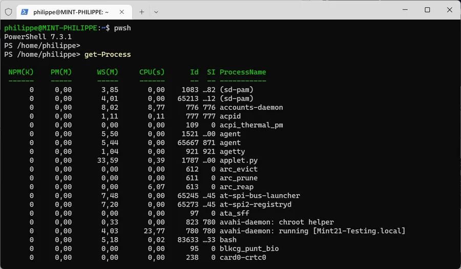

# Linux Mint 21 - Install PowerShell

## Expected Result
<div align="center">

</div>

## How to

Copy & paste the lines below

```
sudo apt upgrade -y

sudo apt install dirmngr ca-certificates software-properties-common gnupg gnupg2 apt-transport-https curl -y

curl -fsSL https://packages.microsoft.com/keys/microsoft.asc | gpg --dearmor | sudo tee /usr/share/keyrings/powershell.gpg > /dev/null

echo deb [arch=amd64,armhf,arm64 signed-by=/usr/share/keyrings/powershell.gpg] https://packages.microsoft.com/ubuntu/22.04/prod/ jammy main | sudo tee /etc/apt/sources.list.d/powershell.list

sudo apt update

sudo apt install powershell -y

```

In a console launch Powershell using the command below

```
pwsh
```
