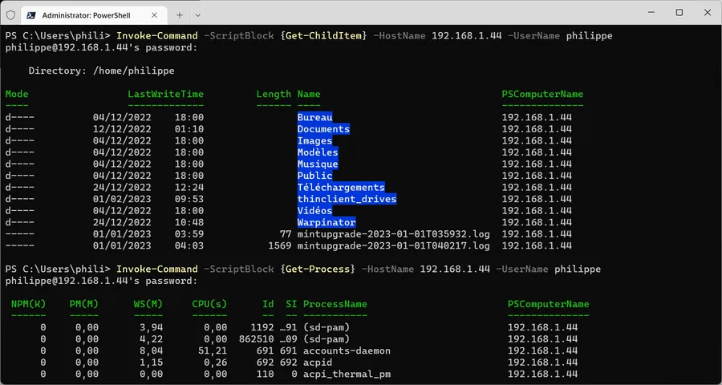
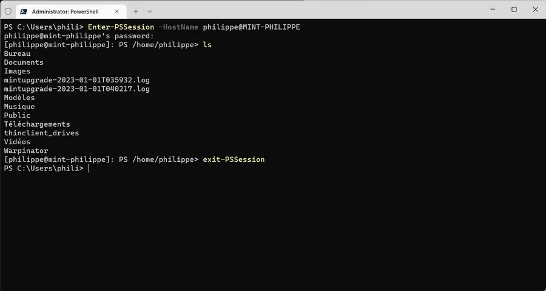

# Remote PowerShell sur SSH

# Introduction

Ce billet fait suite à [celui-ci]() qui traitait de PowerShell remoting protocol (PSRP) over SSH mais dans un contexte Windows. Là, on va faire la même chose mais avec une machine distante (un serveur) Linux.

Afin d'éviter trop de redites je vous propose de lire [le billet en question](). 

Si besoin, n'hésitez pas à lire [cet autre billet]() qui traite de la configuration de remote PowerShell dans un contexte WORKGROUP (à la maison) et dans lequel je parle de WinRM.

Enfin bref, ici on va faire court...

Les coordonnées de la machine distante

* 192.168.1.44
* MINT-PHILIPPE
* PowerShell y est installé. [Lire ce billet]() si besoin.

Je suis connecté dessus à distance via XRDP. Lire [ce billet]() si besoin.


## Sur la machine distante - Linux

### Configuration de SSH

Ouvrir une console et saisir les 2 lignes ci-dessous

```
sudo apt install openssh-client
sudo apt install openssh-client
```

Editer le fichier de configuration du serveur SSH pour, entre autres, y enregistrer PowerShell comme sous-système SSH

```
sudo nano /etc/ssh/sshd_config
```

3 choses à faire

* Enlever le # devant : PasswordAuthentication yes
* Enlever le # devant : PubkeyAuthentication yes
* Ajouter la ligne suivante

```
subsystem powershell /usr/bin/pwsh -sshs -nologo
```

Après avoir sauvegardé le fichier, il faut redémarrer le serveur SSH

```
sudo systemctl restart sshd.service
```


## Sur la machine locale - Win11

### Invoke-Command

<div align="center">

</div>


### Enter-PSSession

<div align="center">

</div>
