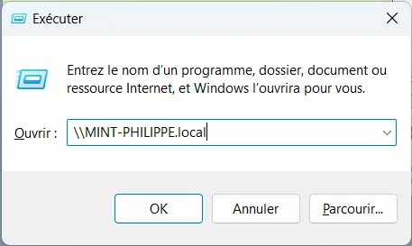

# Linux shared Folder in Windows Home Network

## Windows PC

I run Windows 11.  
I connect to the Linux workstation (Mint 21) using ssh in a Windows Terminal.  
For now, I can't use the name of the remote station, instead so I use its IP address


```powershell
ssh philippe@192.168.1.44
```


## Linux PC

Once connected to the Linux box

```bash
sudo apt install samba
sudo apt install wsdd
```

Check if wsdd is up and running

```bash
sudo service wsdd status
wsdd.service - Web Services Dynamic Discovery host daemon
     Loaded: loaded (/lib/systemd/system/wsdd.service; enabled; vendor preset: enabled)
     Active: active (running) since Thu 2022-12-29 10:18:19 CET; 10min ago
       Docs: man:wsdd(8)
   Main PID: 67591 (python3)
      Tasks: 1 (limit: 9150)
     Memory: 16.7M
        CPU: 232ms
     CGroup: /system.slice/wsdd.service
             └─67591 python3 /usr/sbin/wsdd --shortlog --chroot=/run/wsdd
```

Create a public folder

```bash
sudo mkdir -p /home/share
sudo chmod 777 /home/share
```

Tune the Samba configuration

```bash
sudo nano /etc/samba/smb.conf
```

Edit the file


### Edit 0
Comment the 2 lines

```
#interfaces = 127.0.0.0/8 eth0
#bind interfaces only = yes
```


### Edit 1

Before the ``### Debugging/Accounting ###`` section for example, add the following lines

```
# Philippe
# see https://techviewleo.com/configure-samba-file-sharing-on-linux-mint/
   server min protocol = NT1
   ntlm auth = yes
   unix charset = UTF-8
```


### Edit 2
At the end of the file, add the lines below

```
# Philippe
[Docs]
   path = /home/share
   writable = yes
   guest ok = yes
   guest only = yes
   create mode = 0777
   directory mode = 0777
```

Restart Samba and open the ports in the firewall

```bash
sudo systemctl restart smbd
sudo ufw allow samba
```


## Windows PC

I open a new terminal. Now I can use the name of the Linux box to open a ssh session

```powershell
ssh philippe@MINT-PHILIPPE
```
<div align="center">

</div>


WIN+R. I can use the name of the linux box

<div align="center">

</div>


Or even the ``.local`` version of the UNC path

<div align="center">

</div>


When you hit ENTER, File Explorer pops up and we can access the shared folder.

<div align="center">

</div>


## TO DO

* Remove the printer from the shared ressources on the Linux box (via Samba.conf I suppose)
  + This can be done modifying Edit 1 of samba.conf as follow

```
# Philippe
# see https://techviewleo.com/configure-samba-file-sharing-on-linux-mint/
   server min protocol = NT1
   ntlm auth = yes
   unix charset = UTF-8
   # Disable printer
   load printers = no
   printing = bsd
   printcap name = /dev/null
   disable spoolss = yes
```
<div align="center">

</div>


* The linux box icon doesn't show up if I first open File Explorer 

<div align="center">

</div>


## This can help

* <https://techviewleo.com/configure-samba-file-sharing-on-linux-mint/>

