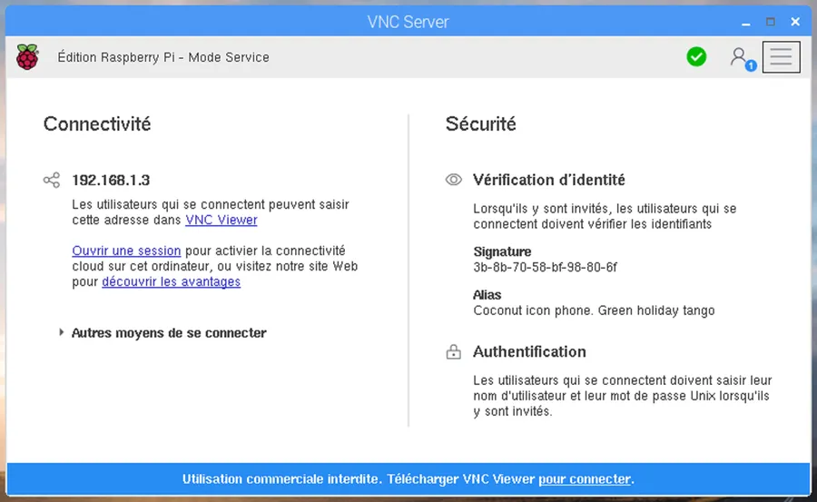
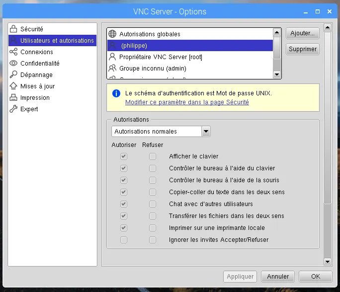
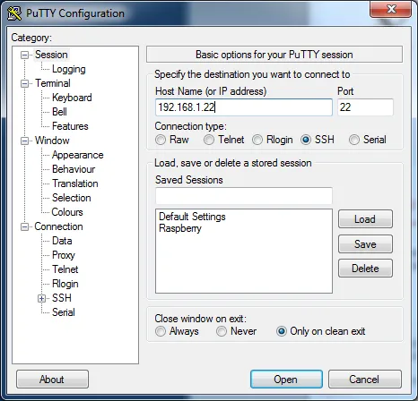
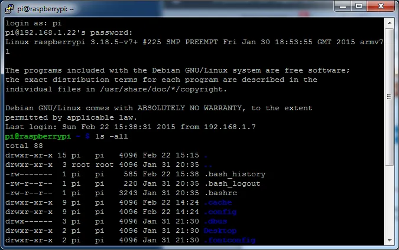
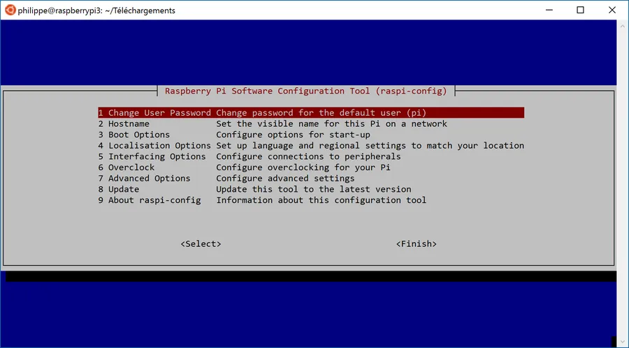
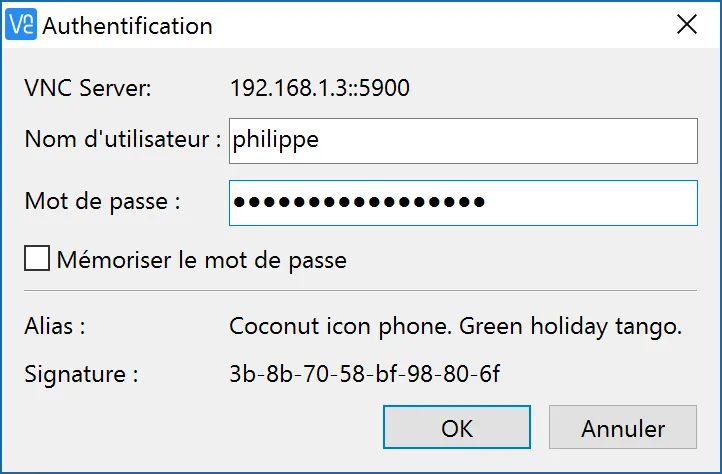
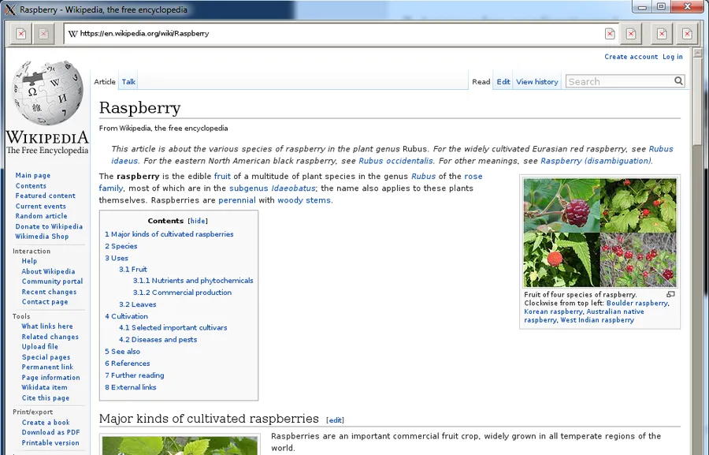

# Installer Configurer Raspberry

## Installation
L'installation d'un Raspberry ne pose généralement pas de problème. Il s'agit donc ici d'une check list à suivre étape par étape. Oh, by the way, pour installer un Raspberry en ligne de commande c'est plutôt [par ici](``NOT YET TRANSFERED``).

J'écris tout ça en mode "télégraphique" pour pas perdre trop de temps

Récupérer [raspbian](http://www.raspberrypi.org/downloads/)

Sous Windows, pour installer l'OS sur la carte Micro SD Card je conseille [Etcher](https://etcher.io/). J'ai essayé LinuxLive USB Creator mais sans succès. Je n'ai pas trouvé de méthode très simple pour faire cette opération sous Mac.

## Maintenance du Raspberry Pi

Je le fais plus ou moins dans l'ordre de mise en route d'un Raspberry tout neuf qui est connecté à un clavier, une souris et un écran.

### Configurer le Raspberry

```bash
sudo raspi-config
```

### Configurer les options de localisation

* Change Locale
  + Laisser la coche en face de en_GB.UTF-8 UTF-8
  + Cocher fr_FR.UTF-8 UTF-8
* Change TimeZone
* Change Keyboard Layout

Sortir de raspi-config et taper 'é' et '€' pour vérifier que tout va bien. Taper aussi "Date" pour vérifier l'heure locale.

### Changer le mot de passe

```bash
sudo passwd bob
```

À la toute première connexion c'est sans doute le premier truc à faire pour le user "pi". Comme normalement on est connecté en tant que "pi" + "raspberry" il n'y a pas besoin de mettre sudo (pi est sudoer) ni le nom du user. On tape simplement :

```bash
passwd
```

### Ajouter un user

```bash
sudo adduser bob
```

Faut juste répondre aux questions posées et tout devrait bien se passer.

### Ajouter un user à la liste des sudoers

Ouvrir une session en tant que pi (qui est sudoer)

```bash
sudo visudo
```

Ajouter une ligne du style (c'est une copie de la ligne du user pi)

```bash
Marcel ALL=(ALL) NOPASSWD: ALL
```

Sauver le fichier (CTRL+X puis CTRL+O) et normalement le user (Marcel dans notre cas) peut lancer des commandes de type sudo...

### Changer le nom de la machine 1/2

```bash
sudo raspi-config
```

* Option Hostname
* Ce sera utile plus tard pour retrouver la machine sur le réseau

### Changer le nom de la machine 2/2

```bash
sudo nano /etc/hosts
```

Changer la ligne où il y a raspberry (127.0.1.1) et mettre le nom qui va bien

```bash
sudo nano /etc/hostname
```

Changer encore une fois le nom

```bash
sudo reboot
```

### Boot Option

Ici on va faire en sorte que PIXEL se lance mais demande une ouverture de session. Par défaut, PIXEL démarre en connectant automatiquement le user "pi". C'est très pratique au tout début mais un peu risky si on est en dehors de la maison (école, labo...). On procéderait de manière similaire pour que le Raspberry reste en mode console et attende qu'un user reconnu ouvre une session.

```bash
sudo raspi-config
```

* Desktop/CLI
* Choisir B3 Desktop (requiert un user login)
* Ok pour rebooter
* Au reboot choisir le user nouvellement créé (pas le user 'pi')

### Supprimer un user

Une fois qu'on a un compte qui est 'sudoer' et qui marche bien, penser à supprimer le compte "pi" qui est un peu trop connu. Il faut le faire à partir de la session du sudoer. Dans une console, taper :

```bash
sudo userdel pi
```

### Arrêter le Raspberry

```bash
sudo shutdown -h now
```

### Redémarrer le Raspberry

```bash
sudo reboot
```

### Update et upgrade des packages installés

```bash
sudo apt-get update
sudo apt-get upgrade
```

### Update et upgrade de la distribution

```bash
sudo apt-get update
sudo apt-get dist-upgrade
```

### Update du firmware du Raspberry

```bash
sudo apt-get install rpi-update
sudo rpi-update
sudo reboot
```

### Ajuster l'écran (éviter les bandes noires)

sudo nano /boot/config.txt

Faire en sorte d'avoir ces paramètres dans le fichier :

1. disable_overscan=1           # désactive l’overscan
2. hdmi_mode=16                  # met l’image en 1080p
3. hdmi_drive=2                    # force le HDMI plutôt que le DVI

### Autoriser SSH

SSH n'est plus opérationnel par défaut. Lire cette [page](https://www.raspberrypi.org/blog/a-security-update-for-raspbian-pixel/) si besoin.

sudo raspi-config

* Interfacing Options
* P2 SSH
* Oui
* OK
* Finish

Pour connaître l'adr de la machine, saisir

```actionscript3
ifconfig
```

### Mettre en route le serveur VNC

sudo raspi-config

* Interfacing Options
* P3 VNC
* Oui
* OK
* Finish

Quand l’icône est dans la barre de titre, cliquer dessus.

<div align="center">

</div>


* Cliquer sur le menu tout en haut à droite
* Choisir Options
* Saisir mote de passe
* Cliquer sur Utilisateurs et autorisations dans la liste de gauche
* Cliquer sur le bouton Ajouter...
* Là il faut saisir l'identifiant d'un utilisateur préalablement enregistré

<div align="center">

</div>


* Cliquer sur le bouton OK
* Fermer l'autre fenêtre

## Client console (ssh)

Faut retrouver l'adresse ip du Raspberry Pi sur le réseau local (voir ifconfig juste avant). Au pire, la box de la maison permet de le faire aussi.

### Mac

Quand c'est fait, sur Mac, dans une console faut taper

```bash
ssh bob@<adr-ip-du-RPI>
```

Il faut que le user "bob" existe sur le raspberry et bien sûr faut connaître son mot de passe.

### Windows 1/2

Windows on peut utiliser [Putty](http://www.clubic.com/telecharger-fiche10874-putty.html) ou [Putty Portable](http://portableapps.com/apps/internet/putty_portable). Une fois installé, la méthode est identique mais on passe par une boite de dialogue intermédiaire.

<div align="center">

</div>


Comme ici je n'ai rien saisi à part l'adr IP du RPI, quand on clique sur le bouton Open, une console s'ouvre et demande le login et le mot de passe (pi, raspberry).

<div align="center">

</div>

### Windows 2/2

Sous Windows 10 on peut utiliser Bash (WSL : Windows Subsystem for Linux). Pour [configurer Bash](https://www.40tude.fr/windows-10-notes-diverses/) c'est par ici. Quand c'est fait, dans la console il suffit d'invoquer un truc du style :

```bash
ssh bob@192.168.0.47
```

Il faut bien sûr que l'utilisateur "bob" existe sur la machine dont l'adresse est "192.168.0.47". Il va demander le mot de passe de "bob". Quand c'est fait, on est à la maison (en mode texte). On peut lancer raspi-config si besoin etc.

<div align="center">

</div>

## VNC Viewer

* Je suis sous Windows 10.
* Aller sur cette page pour télécharger [VNC Viewer](https://www.realvnc.com/download/viewer/windows/)
* Lancer l'application
* Dans la barre, en haut, saisir l'adr du Raspberry (Ex : 192.168.1.3)
* Une boite de dialogue d'authentification apparaît. Il faut donner
  + Id de l'utilisateur
  + Son mot de passe sur le Raspberry

<div align="center">

</div>


* Cliquer sur OK
* La connexion s'établit
* On peut prendre le contrôle graphique du Raspberry Pi

<div align="center">

</div>


On est dorénavant prêt à "travailler" à distance avec le RPI que ce soit via une console texte ou une fenêtre graphique.

*La suite au prochain épisode...*

